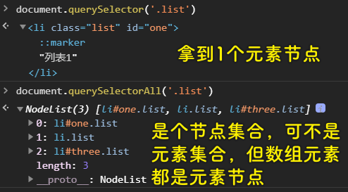

### ✍️ Tangxt ⏳ 2020-11-27 🏷️ DOM

# 01-DOM 封装-对象风格

对象风格也叫命名空间风格，我们在 `window` 旗下搞个全局属性 `dom` ，那么 `window.dom` 就是命名空间。

我们对 `dom` 这个对象添加了「增删改查」功能，以此来完成对元素的 DOM 操作！毕竟原生 DOM API 使用起来不怎么方便！

## ★查

1）dom.find（获取节点）

1、获取一个元素节点

语法：

``` js
dom.findOne(selector[, container])
```

参数：

* `selector`：字符串，一个包含单个或多个匹配的选择器的字符串
* `container`：节点对象（`document`节点 or 元素节点），可选，默认值是`document`节点

返回值：

* 与指定选择器或选择器组匹配的第一个 `Element`，如果未找到匹配项，那就返回`null`

实现：

``` js
{
  findOne(selector, container) {
    return (container || document).querySelector(selector)
  }
}
```

2、获取多个元素节点

语法：

``` js
dom.find(selectors[, container])
```

参数：

* `selector`：字符串，一个包含单个或多个匹配的选择器的字符串
* `container`：节点对象（`document`节点 or 元素节点），可选，默认值是`document`节点

返回值：

* 一个静态的`NodeList`对象，它有着与指定选择器或选择器组相匹配的元素节点列表，如果未找到匹配项，那就返回一个`length`为`0`的`NodeList`对象！

实现：

``` js
{
  find(selectors, container) {
    return (container || document).querySelectorAll(selectors)
  }
}
```

💡： `querySelector` 与 `querySelectorAll` 的区别？

``` html
<ul class="container">
  <li class="list" id="one">列表 1</li>
  <li class="list">列表 2</li>
  <li class="list" id="three">列表 3</li>
</ul>
```



💡：什么是「静态的」？

静态 `NodeList` 就是对底层 `document` 的更改不会影响到返回的这个 `NodeList` 对象。此时返回的 `NodeList` 只是 `querySelectorAll()` 方法被调用时的**文档状态的快照**。

``` js
var divs = document.querySelectorAll("div");
var i = 0;
while (i < divs.length) {
  document.body.appendChild(document.createElement("div"));
  i++;
}
```

在这种情况下没有死循环， `divs.length` 的值永远不会改变，不会因为文档状态变化了，使得 `divs.length` 也发生变化了。

总之，这不是一个「彼消我长」的过程

而动态的，简单来说，就是你获得东西是会变化的，比如此刻你的银行卡里有 100 元，但过几小时后，它就有 200 元了。

➹：[静态 NodeList 和 动态 NodeList 的区别_前端学习之路 - SegmentFault 思否](https://segmentfault.com/a/1190000008829267)

2）dom.parent（获取父节点）

语法：

``` js
dom.parent(node)
```

参数：

* `node`：节点对象

返回值：

* 指定节点的父节点

实现：

``` js
{
  parent(node) {
    return node.parentNode;
  }
}
```

3）dom.children（获取子元素们）

语法：

``` js
dom.children(node)
```

参数：

* `node`：节点对象

返回值：

* 一个动态的、有序的`HTMLCollection`，如果`node`没有子元素，那就返回`length`为`0`的空列表

实现：

``` js
{
  children(node) {
    return node.children;
  }
}
```

4）dom.siblings（获取同级节点）

语法：

``` js
dom.siblings(node)
```

返回值：

* 指定节点的所有同级节点列表，返回的对象是 Array

实现：

``` js
siblings(node) {
  return Array.from(node.parentNode.children).filter((item) => item !== node);
}
```

> 如何拿到所有的兄弟元素节点？-> 找到爸爸，拿到爸爸的所有子元素节点们，数组化，过滤掉指定节点

5）dom.previous（获取上一个相邻节点）

语法：

``` js
dom.previous(node)
```

实现：

``` js
{
  previous(node) {
    let p = node.previousSibling;
    while (p && p.nodeType === 3) {
      p = p.previousSibling;
    }
    return p;
  }
}
```

> 元素节点的 `nodeType` 为 `1` ，而文本节点则是 `3` 。如果指定节点的前任节点是文本节点，那就继续查找……

💡： `Node.previousSibling` ？

只读属性，返回其父节点的 `childNodes` 列表中的所指定节点的上一个节点，如果指定的节点是该列表中的第一个节点，则返回 `null`

6）dom.next（获取后一个同级节点）

语法：

``` js
dom.next(node)
```

实现：

``` js
{
  next(node) {
    let n = node.nextSibling;
    while (n && n.nodeType === 3) {
      n = n.nextSibling;
    }
    return n;
  }
}
```

7）dom.travel（遍历节点）

语法：

``` js
dom.travel(nodeList, callback)
```

> `callback` 的第一个参数是当前元素节点

参数：

* `nodeList`：被遍历的节点列表或元素集合
* `callback`：遍历得到一个元素节点对象，就会执行一次`callback`

返回值：

* `undefined`

实现：

``` js
{
  travel(nodeList, callback) {
    for (let i = 0; i < nodeList.length; i++) {
      callback.call(null, nodeList[i]);
    }
  }
}
```

8）dom.index（获取节点索引）

语法：

``` js
dom.index(node)
```

返回值：

* 指定节点在其父节点中的索引值

实现：

``` js
{
  index(node) {
    const nodeList = dom.children(dom.parent(node));
    for (let i = 0; i < nodeList.length; i++) {
      if (nodeList[i] === node) {
        return i;
      }
    }
  }
}
```

## ★增

1）dom.create（创建节点）

语法：

``` js
dom.create(string)
```

参数：

* `string`：HTML 代码片段字符串，如`'<p>我是段落</p>'`，请保证该片段只有一个根节点

返回值：

* 一个元素节点（文档片段节点的元素节点化）

实现：

``` js
{
  create(string) {
    const template = document.createElement("template");
    template.innerHTML = string.trim();
    return template.content.firstChild;
  }
}
```

💡： `template` 元素？

HTML `<template>` 元素代表标记中的一个模板，它包含”模板内容”；本质上是一大块的惰性可复制 DOM。 可以把模板想象成一个脚手架的零件（螺丝钉），在应用的整个生命周期中你都可以使用（和重用）它

你在写了一个 `template` 元素，页面并不会渲染这个标签：


> 该元素节点应该是参与了 DOM 树的构建

测试例子：

``` html
<template id="tem">
  <div id="div1">我是 template</div>
  <div>我是 template</div>
</template>
<script>
  let o = document.getElementById("tem");
  console.log(o.content.nodeName); //#document-fragment
  console.log(o.content.querySelectorAll("div")); //NodeList(2) [div#div1, div]。得到一个类数组
  console.log(o.content.getElementById("div1")); //<div id="div1">我是 template</div>
  console.log(o.innerHTML); //'<div id="div1">我是 template</div><div>我是 template</div>'
</script>
```

2）dom.before（向前插入节点）

语法：

``` js
dom.before(node, referenceNode)
```

参数：

* `node`：指定要插入的节点
* `referenceNode`：参考节点对象，可简单理解成处在坐标为 0 的节点（一维坐标系）

实现：

``` js
{
  before(node, referenceNode) {
    dom.parent(referenceNode).insertBefore(node, referenceNode);
  }
}
```

3）dom.after（向后插入节点）

语法：

``` js
dom.after(node, referenceNode)
```

实现：

``` js
{
  after(node, referenceNode) {
    dom.parent(referenceNode).insertBefore(node, dom.next(referenceNode));
  }
}
```

4）dom.append（插入子节点）

找到某个节点，把指定节点作为它的子节点插入其中

语法：

``` js
dom.append(node, parentNode)
```

实现：

``` js
{
  append(node, parentNode) {
    parentNode.appendChild(node);
  }
}
```

5）dom.wrap（插入父节点）

找到某个节点，指定节点认它为干儿子

语法：

``` js
dom.wrap(node, childNode)
```

实现：

``` js
{
  wrap(node, childNode) {
    dom.before(node, childNode);
    dom.append(childNode, node);
  }
}
```

> 我当你是你兄弟，你居然想让我叫你爸爸？

## ★删

1）dom.remove（删除节点）

删除指定节点，并返回被删除的指定节点

语法：

``` js
dom.remove(node)
```

实现：

``` js
{
  remove(node) {
    node.remove();
    return node;
  }
}
```

2）dom.empty（清空子节点）

删除并返回指定节点的所有子节点

语法：

``` js
dom.empty(node)
```

返回值：

- 数组，数组元素是一个个被删除的子节点

实现：

``` js
{
  empty(node) {
    const arrChildren = Array.from(dom.children(node))
    let array = [];
    for (let i = 0; i < arrChildren.length; i++) {
      array.push(dom.remove(arrChildren[i]));
    }
    return array;
  }
}
```

> 用 `for` 循环遍历元素集合有bug呀！于是我把伪数组数组化了！-> 或许是浏览器的问题！

## ★改


