### ✍️ Tangxt ⏳ 2020-11-29 🏷️ DOM

# 02-DOM 封装-链式风格

## ★Q&A

💡：为什么要用链式姿势封装一个 DOM 库？

因为我想进一步理解 jQuery 的设计思想

💡：链式风格是什么？

链式风格也称作 jQuery 风格，与对象风格不同的是，我们全局变量 `jQuery` 是个函数，而不是一个对象，我们在 `jQuery` 函数的原型上，也就是 `prototype` 旗下，添加了对元素**增删改查**的功能！

💡：为什么用 `$` 作为 `jQuery` 的别名？

因为它够短呀！

💡：如何实现链式操作？

为了实现链式操作，在使用 `jQuery("选择器")` 或 `$("选择器")` 选择页面元素时，应当返回一个可操作对应元素的对象，而不是元素本身。我们称这个对象为由 jQuery 函数构造的对象，简称为 **jQuery 对象**。

在 jQuery 对象中添加 `print` 属性，属性值为一个用于打印出选择元素的函数，函数的返回值为 `this` ，指向调用它的对象，即作为 jQuery 函数返回值的 jQuery 对象。函数与选择的元素构成闭包结构，这样我们就可以继续对元素进行操作，从而形成链式风格

``` js
window.$ = window.jQuery = function(selectors) {
  let elements = document.querySelectorAll(selectors)
  return {
    print() {
      console.log(elements)
      return this
    }
  }
}

// 选择 class 属性为 list 的所有元素并将它们打印出来
$(".list").print()
```

💡：内存优化处理？

每次调用 jQuery 对象中的函数都会**新占用一块地址**，从而导致内存浪费，所以我们可以：

1. 把 jQuery 对象的共有属性（函数）全部放在 `jQuery.prototype` 上 -> 对其使用别名 `jQuery.fn = jQuery.prototype` -> 将 jQuery 对象的原型指向 `jQuery.fn`（这一步真得有必要吗？`Object.create(jQuery.fn)`？） -> 使用 `constructor` 设置 jQuery 对象的构造函数 `jQuery`

2. 使用 `Object.assign` 为 jQuery 对象添加多个属性

我们写的 API 都在 jQuery 对象的原型对象上，也就是在 `jQuery.prototype` 旗下！

## ★查

### <mark>1）$(selectors)（选择元素）</mark>

根据指定的 CSS 选择器选择所有元素，返回 jQuery 对象。

语法：

``` js
const $api = $(selectors)
```

参数：

* `selectors`：字符串，一个包含单个或多个匹配的选择器的字符串

实现：

``` js
// 别名
window.$ = window.jQuery = function(selectorsOrArrayOrTemplate) {
  let elements;
  // 重载
  if (typeof selectorsOrArrayOrTemplate === "string") {
    if (selectorsOrArrayOrTemplate[0] === "<") {
      elements = [create(selectorsOrArrayOrTemplate)];
    } else {
      elements = document.querySelectorAll(selectorsOrArrayOrTemplate);
    }
  } else if (selectorsOrArrayOrTemplate instanceof Array) {
    elements = selectorsOrArrayOrTemplate;
  }

  function create(string) {
    const template = document.createElement("template");
    template.innerHTML = string.trim();
    return template.content.firstChild;
  }
  // jQuery 对象的共有属性
  const api = Object.create(jQuery.prototype);
  Object.assign(api, {
    elements: elements,
    oldApi: selectorsOrArrayOrTemplate.oldApi,
    jquery: true,
  });
  // 闭包
  return api;
};
```

> `oldApi` 是旧的 jQuery 对象，每次你调用 API，都会返回一个新的 jQuery 对象！

一个疑问： `elements` 这个属性的类型是不是只是数组类型比较好？

### <mark>2）.each(fn)（遍历元素）</mark>

遍历元素列表，对每个元素执行一次指定的函数，返回 jQuery 对象。

语法：

``` js
const $api = $(selectors).each(fn(element, index))
```

实现：

``` js
{
  each(fn) {
    for (let index = 0; index < this.elements.length; index++) {
      const element = this.elements[index];
      fn.call(this, element, index);
    }
    return this;
  }
}
```

测试：

``` js
$('.list').each((ele, index) => {
  console.log(ele, index)
})
```

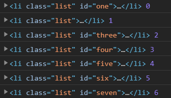

### <mark>3）.find(selectors)（查找元素）</mark>

遍历元素里列表（数组类型），根据指定的 CSS 选择器选择元素，返回 jQuery 对象

语法：

``` js
const $api = $(selectorsOrArray).find(selectors)
```

参数：

* `selectorsOrArray`：字符串 or 数组
* `selectors`：字符串，选择器 or 选择器组

实现：

``` js
{
  find(selectors) {
    const array = [];
    this.each((element) => {
      array.push(...element.querySelectorAll(selectors));
    });
    array.oldApi = this;
    return jQuery(array);
  }
}
```

测试：

字符串选择器：

``` js
$('.container1').find('#one')
$('.container1').find('.list')
$('.container2').find('.list')
```

元素列表（数组类型的，可不是 `NodeList` 这样的伪数组）：

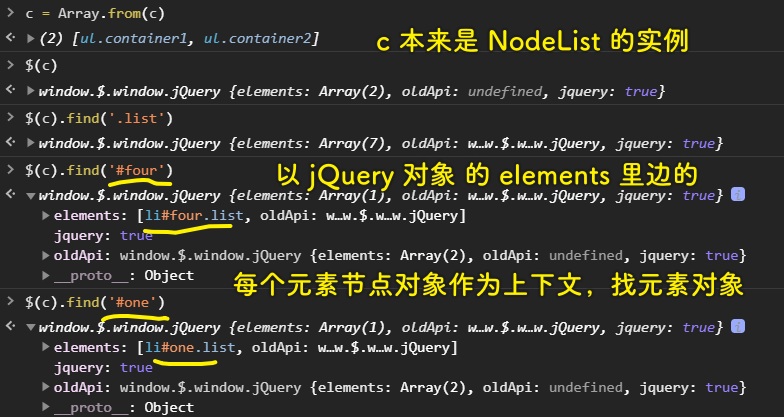

### <mark>4）.end()（元素回退）</mark>

终止当前链的操作，返回上一层的 jQuery 对象。

语法：

``` js
const $api = $(selectorsOrArray).end()
const $oldApi = $(selectorsOrArray).find(selectors).end()
```

实现：

``` js
{
  end() {
    return this.oldApi || this;
  }
}
```

测试：

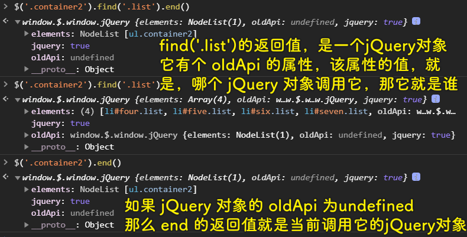

### <mark>5）.get(index)（获取单个节点元素对象）</mark>

通过 jQuery 对象获取指定索引的 DOM 节点。

语法：

``` js
const elNode = $(selectorsOrArray).get(index)
```

参数：

* `index`：数值类型，表示指定的索引值，若为负数，如`-1`，则是倒数第一个元素，若负值过小，那就是第一个元素，同理，若值过大，那就是最后一个元素

实现：

``` js
{
  get(index) {
    const length = this.elements.length;
    if (index < 0) {
      index = index + length < 0 ? 0 : index + length;
    } else if (index >= length) {
      index = length - 1;
    }
    return this.elements[index];
  }
}
```

测试：

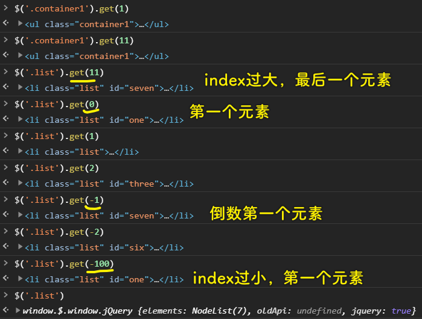

### <mark>6）.eq(index)（获取 jQuery 化的单个元素节点）</mark>

语法：

``` js
const $api = $(selectorsOrArray).eq(index)
```

实现：

``` js
{
  eq(index) {
    const length = this.elements.length;
    if (index < 0) {
      index = index + length < 0 ? 0 : index + length;
    } else if (index >= length) {
      index = length - 1;
    }
    return jQuery([this.elements[index]]);
  }
}
```

测试：

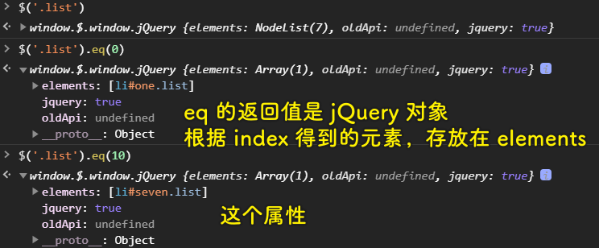

### <mark>7）.parent()（选择父元素）</mark>

遍历元素列表，得到每个元素的父元素（去重），返回 jQuery 对象

语法：

``` js
const $api = $(selectorsOrArray).parent()
```

实现：

``` js
{
  parent() {
    const array = [];
    this.each((element) => {
      const parentElement = element.parentNode;
      if (array.indexOf(parentElement) === -1) {
        array.push(parentElement);
      }
    });
    array.oldApi = this;
    return jQuery(array);
  }
}
```

测试：

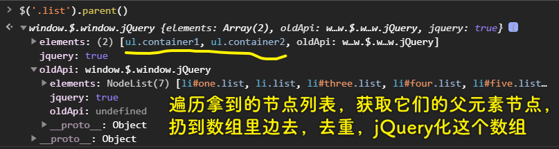

💡： `NodeList` vs `HTMLCollection` ？

历史上的 DOM 集合接口。主要不同在于 `HTMLCollection` 是元素集合而 `NodeList` 是节点集合（即可以包含元素，也可以包含文本节点）。所以 `node.childNodes` 返回 `NodeList` ，而 `node.children` 和 `node` . `getElementsByXXX` 返回 `HTMLCollection` 。

**唯一要注意的是 `querySelectorAll` 返回的虽然是 `NodeList` ，但是实际上是元素集合**，并且是静态的（其他接口返回的 `HTMLCollection` 和 `NodeList` 都是 live 的）。事实上，将来浏览器将增加 `queryAll` 接口取代现在的 `querySelectorAll` ，返回 `Elements` 是 `Array` 的子类（因而可以使用 `Array` 上的 `forEach` 、 `map` 等方法）。

➹：[NodeList 和 HTMLCollection 之间的关系？ - 贺师俊的回答 - 知乎](https://www.zhihu.com/question/31576889/answer/52559370)

### <mark>8）.children()（选择子元素们）</mark>

遍历元素列表，选择每一个元素的子元素，返回 jQuery 对象。

语法：

``` js
const $api = $(selectorsOrArray).children()
```

实现：

``` js
{
  children() {
    const array = [];
    this.each((element) => {
      array.push(...element.children);
    });
    array.oldApi = this;
    return jQuery(array);
  }
}
```

测试：

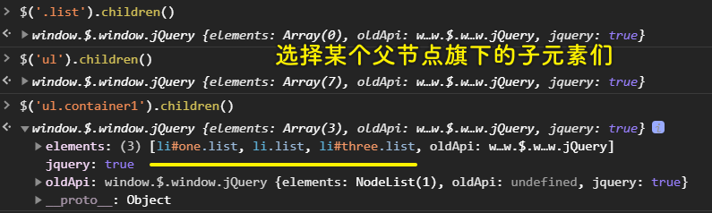

### <mark>9）.siblings()（选择同级元素）</mark>

遍历元素列表，选择每一个元素的同级元素们，返回 jQuery 对象。

语法：

``` js
const $api = $(selectorsOrArray).siblings()
```

实现：

``` js
{
  siblings() {
    const array = [];
    this.each((element) => {
      const siblingsElements = Array.from(element.parentNode.children).filter(
        (item) => item !== element
      );
      array.push(...siblingsElements);
    });
    array.oldApi = this;
    return jQuery(array);
  }
}
```

测试：

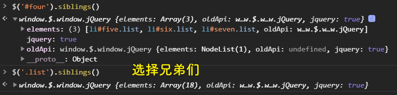

### <mark>10）.prev()（选择前一个同级元素）</mark>

遍历元素列表，选择每一个元素的前一个同级非文本元素，返回 jQuery 对象。

语法：

``` js
const $api = $(selectorsOrArray).prev()
```

实现：

``` js
{
  prev() {
    const array = [];
    this.each((element) => {
      let p = element.previousSibling;
      while (p && p.nodeType === 3) {
        p = p.previousSibling;
      }
      array.push(p);
    });
    array.oldApi = this;
    return jQuery(array);
  }
}
```

测试：

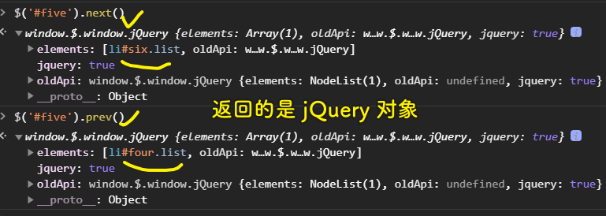

### <mark>11）.next()（选择后一个同级元素）</mark>

遍历元素列表，选择每一个元素的前一个同级非文本元素，返回 jQuery 对象。

语法：

``` js
const $api = $(selectorsOrArray).prev()
```

实现：

``` js
{
  next() {
    const array = [];
    this.each((element) => {
      let n = element.nextSibling;
      while (n && n.nodeType === 3) {
        n = n.nextSibling;
      }
      array.push(n);
    });
    array.oldApi = this;
    return jQuery(array);
  }
}
```

## ★增

### <mark>1）$(template)（创建元素）</mark>

根据指定的 HTML 字符串模板创建并选择元素，返回 jQuery 对象

语法：

``` js
const $api = $(selectorsOrArrayOrTemplate)
```

实现：

``` js
window.$ = window.jQuery = function(selectorsOrArrayOrTemplate) {
  let elements
  if (typeof selectorsOrArrayOrTemplate === "string") {
    if (selectorsOrArrayOrTemplate[0] === "<") {
      elements = [create(selectorsOrArrayOrTemplate)]
    } else {
      elements = document.querySelectorAll(selectorsOrArrayOrTemplate)
    }
  } else if (selectorsOrArrayOrTemplate instanceof Array) {
    elements = selectorsOrArrayOrTemplate
  }

  function create(string) {
    const template = document.createElement("template")
    template.innerHTML = string.trim()
    return template.content.firstChild
  }
  return {
    oldApi: selectorsOrArrayOrTemplate.oldApi,
    elements: elements
  }
}
```

测试：

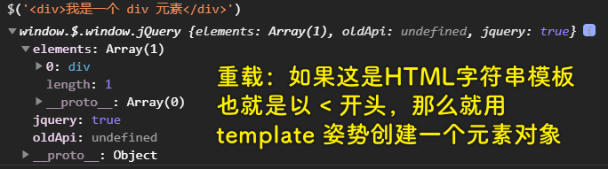

### <mark>2）.before(jQueryOrNode)（向前插入元素）</mark>

将指定元素作为所选择元素的前一个节点

语法：

``` js
const $api = $(selectorsOrArrayOrTemplate).before(jQueryOrNode)
```

参数：

* `jQueryOrNode`：jQuery 对象或者节点对象，表示需要插入的元素或者 DOM 节点

实现：

``` js
{
  before(jQueryOrNode) {
    const element = this.get(0);
    if (jQueryOrNode.jquery) {
      element.parentNode.insertBefore(jQueryOrNode.get(0), element);
    } else if (jQueryOrNode instanceof Node) {
      element.parentNode.insertBefore(jQueryOrNode, element);
    }
    return this;
  }
}
```

> jQuery 对象都有个 jquery 属性，而该属性是用于区分这是 jQuery 对象还是 DOM 节点的！

测试：

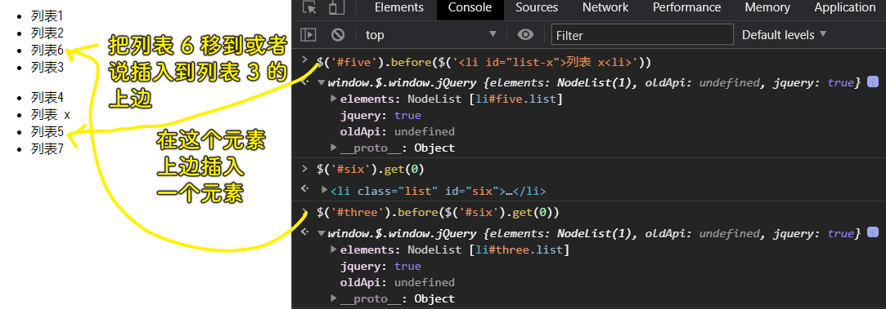

### <mark>3）.after(jQueryOrNode)（向后插入元素）</mark>

将指定元素作为所选择元素的后一个节点。

语法：

``` js
const $api = $(selectorsOrArrayOrTemplate).after(jQueryOrNode)
```

实现：

``` js
{
  after(jQueryOrNode) {
    const element = this.get(0);
    if (jQueryOrNode.jquery) {
      element.parentNode.insertBefore(
        jQueryOrNode.get(0),
        jQuery([element]).next().get(0)
      );
    } else if (jQueryOrNode instanceof Node) {
      element.parentNode.insertBefore(
        jQueryOrNode,
        jQuery([element]).next().get(0)
      );
    }
    return this;
  }
}
```

> 基于 `insertBefore` 实现， `insertBefore` 的第二个参数是参考节点，我们在这里是拿到了选择元素的下一个节点元素对象！

一个疑问，参考节点是 `null` ，那么 `insertBefore(jQueryOrNode,null)` 是如何插入的？

> If `referenceNode` is `null` , then `newNode` is inserted at the end of `parentNode` 's child nodes.

测试：

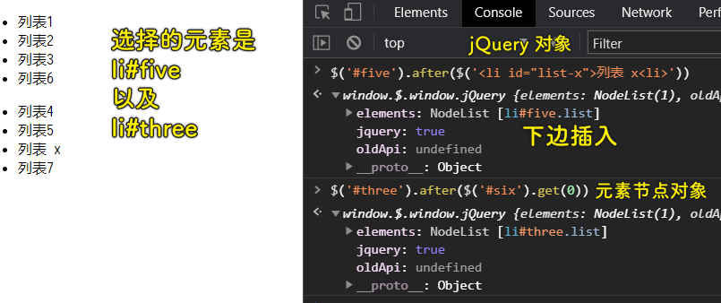

### <mark>4）.append(jQueryOrNode)（插入子元素）</mark>

将指定元素作为所选择元素的末位子节点

语法：

``` js
const $api = $(selectorsOrArrayOrTemplate).append(jQueryOrNode)
```

实现：

``` js
{
  append(jQueryOrNode) {
    const element = this.get(0);
    if (jQueryOrNode.jquery) {
      element.appendChild(jQueryOrNode.get(0));
    } else if (jQueryOrNode instanceof Node) {
      element.appendChild(jQueryOrNode);
    }
    return this;
  }
}
```

测试：

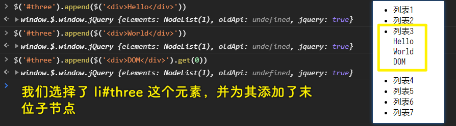

### <mark>5）.appendTo(jQueryOrNode)（插入子元素之逆操作）</mark>

将所选择元素作为指定元素的末位子节点。

语法：

``` js
const $api = $(selectorsOrArrayOrTemplate).appendTo(jQueryOrNode)
```

实现：

``` js
{
  appendTo(jQueryOrNode) {
    const element = this.get(0);
    if (jQueryOrNode.jquery) {
      jQueryOrNode.get(0).appendChild(element);
    } else if (jQueryOrNode instanceof Node) {
      jQueryOrNode.appendChild(element);
    }
    return this;
  }
}
```

> 实现原理：调用 `appendChild` 的是指定元素节点对象！可不是我们用 jQuery 函数选择的元素

测试：

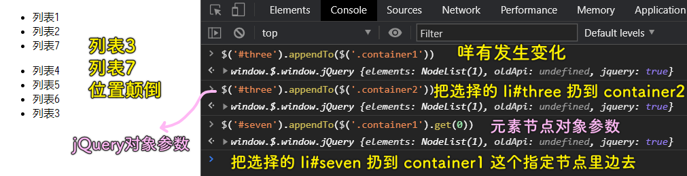

## ★删

### <mark>1）.remove()（删除元素）</mark>

遍历元素列表并删除其中所有节点，返回 jQuery 对象

语法：

``` js
const $api = $(selectorsOrArrayOrTemplate).remove()
```

实现：

``` js
{
  remove() {
    this.each((element) => {
      element.remove();
    });
    return this;
  }
}
```

测试：

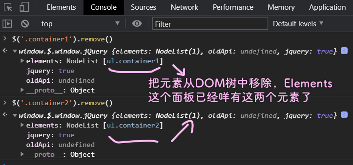

### <mark>2）.empty()（清空子元素）</mark>

遍历元素列表并删除其中所有元素的子节点，返回 jQuery 对象。

语法：

``` js
const $api = $(selectorsOrArrayOrTemplate).empty()
```

实现：

``` js
{
  empty() {
    this.each((element) => {
      console.log(element.children)
      const children = Array.from(element.children);
      for (let i = 0; i < children.length; i++) {
        children[i].remove();
      }
    });
    return this;
  }
}
```

测试：

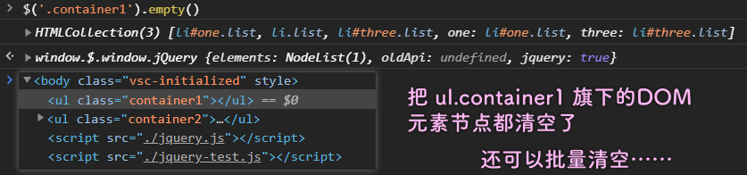

> 批量清空： `$('ul').empty()` -> `$('ul')` 会选中两个元素，我们遍历之，对每个元素旗下的所有子节点都执行一个 `remove` 方法……

## ★改

### <mark>1）attr(name, value)（读写特性）</mark>

返回或修改所选元素的指定特性值

语法：

``` js
const attributeValue = $(selectorsOrArrayOrTemplate).attr(name)
const $api = $(selectorsOrArrayOrTemplate).attr(name, value)
```

实现：

``` js
{
  attr(name, value) {
    // 重载
    if (arguments.length === 1) {
      return this.get(0).getAttribute(name);
    } else if (arguments.length === 2) {
      this.each((element) => {
        element.setAttribute(name, value);
      });
    }
    return this;
  }
}
```

测试：

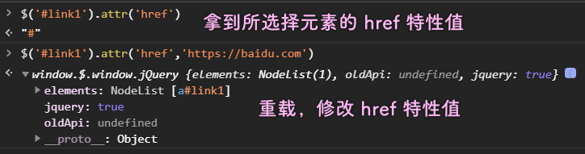

### <mark>2）.css(name, value)（读写 style 属性）</mark>

返回或修改所选元素的指定样式属性值。

语法：

``` js
const styleValue = $(selectorsOrArrayOrTemplate).css(name)
const $api = $(selectorsOrArrayOrTemplate).css(name, value)
```

实现：

``` js
{
  css(name, value) {
    // 重载
    if (arguments.length === 1) {
      if (typeof name === "string") {
        return this.get(0).style[name];
      } else if (name instanceof Object) {
        this.each((element) => {
          for (let key in name) {
            element.style[key] = name[key];
          }
        });
      }
    } else if (arguments.length === 2) {
      this.each((element) => {
        element.style[name] = value;
      });
    }
    return this;
  }
}
```

测试：

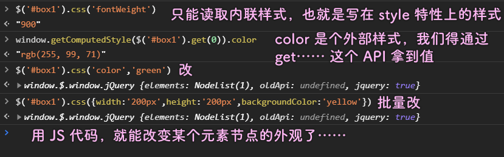

### <mark>3）读写 class 属性</mark>

#### <mark>1、.hasClass(className)（判断 class 属性）</mark>

判断元素列表中的第一个元素的 class 属性是否包含相应的字符串，返回布尔值。

#### <mark>2、.addClass(className)（添加一个 class ）</mark>

遍历元素列表，为其中每一个元素创建 or 追加一个 class

#### <mark>3、.removeClass(className)（删除一个 class）</mark>

遍历元素列表，为其中每一个元素删除一个 class 

语法：

``` js
let bool = $(selectorsOrArrayOrTemplate).hasClass(className)
let $api = $(selectorsOrArrayOrTemplate).addClass(className)
let $api = $(selectorsOrArrayOrTemplate).removeClass(className)
```

实现：

``` js
{
  hasClass(className) {
      return this.get(0).classList.contains(className);
    },
    addClass(className) {
      this.each((element) => {
        element.classList.add(className);
      });
      return this;
    },
    removeClass(className) {
      this.each((element) => {
        element.classList.remove(className);
      });
      return this;
    }
}
```

注意，你不能一次性追加两个 `class` ：


测试：

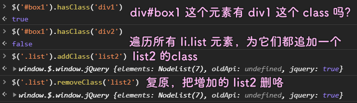

### <mark>4）.text(textString)（读写文本内容）</mark>

返回或修改所选元素的文本内容

``` js
let text = $(selectorsOrArrayOrTemplate).text()
const $api = $(selectorsOrArrayOrTemplate).text(textString)
```

实现：

``` js
{
  text(textString) {
    // 重载
    if (arguments.length === 0) {
      let string = "";
      this.each((element) => {
        // 适配
        string += document.all ? element.innerText : element.textContent;
      });
      return string;
    } else if (arguments.length === 1) {
      this.each((element) => {
        document.all ?
          (element.innerText = textString) :
          (element.textContent = textString);
      });
    }
    return this;
  }
}
```

测试：

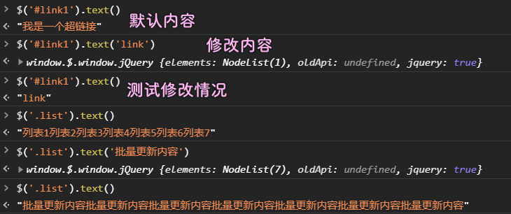

### <mark>5）.html(htmlString)（读写 HTML 内容）</mark>

返回或修改所选元素的 HTML 内容

语法：

``` js
let html = $(selectorsOrArrayOrTemplate).html()
const $api = $(selectorsOrArrayOrTemplate).html(htmlString)
```

实现：

``` js
{
  html(htmlString) {
    // 重载
    if (arguments.length === 0) {
      return this.get(0).innerHTML;
    } else if (arguments.length === 1) {
      this.each((element) => {
        element.innerHTML = htmlString;
      });
    }
    return this;
  }
}
```

> 重载：当不传入参数时，读取元素列表中第一个元素的 HTML 内容；当传入一个参数时，修改元素列表中所有元素的 HTML 内容

测试：


### <mark>6）事件监听</mark>

#### <mark>1、.on(eventType, listener, useCapture)（绑定事件监听）</mark>

遍历元素列表，为其中每一个元素绑定事件监听函数。

#### <mark>2、.off(eventType, listener, useCapture)（删除事件监听）</mark>

遍历元素列表，为其中每一个元素删除事件监听函数。

---

语法：

``` js
let $api = $(selectorsOrArrayOrTemplate).on(eventType, listener, useCapture)
let $api = $(selectorsOrArrayOrTemplate).off(eventType, listener, useCapture)
```

实现：

``` js
{
  on(eventType, listener, useCapture = false) {
      this.each((element) => {
        element.addEventListener(eventType, listener, useCapture);
      });
      return this;
    },
    off(eventType, listener, useCapture = false) {
      this.each((element) => {
        element.removeEventListener(eventType, listener, useCapture);
      });
      return this;
    }
}
```

测试：

我用了这样的测试代码：

``` js
function alertContent(e) {
  alert($(this).text())
  $(this).off('click', alertContent)
}

$('.list').on('click', alertContent)
```

> 我每个`li.list`元素添加一个`click`事件，事件触发就会弹出这个元素的文本内容，并且删除这个事件监听函数，换言之，只监听一次，就把这个`alertContent`给 GG 了

我们这个 `$` 函数是无法处理元素节点对象的，于是我就加了一个 `if...else...` :

``` js
if (selectorsOrArrayOrTemplate instanceof HTMLElement) {
  elements = [selectorsOrArrayOrTemplate]
}
```

## ★参考文章

1. [jQuery API 中文文档](https://www.jquery123.com/)
2. [阮一峰 jQuery 设计思想](http://www.ruanyifeng.com/blog/2011/07/jquery_fundamentals.html)
3. [方应杭 jQuery 都过时了，那我还学它干嘛？](https://fangyinghang.com/why-still-jquery/)
4. [Woozyzzz DOM 封装-对象风格](https://www.yuque.com/woozyzzz/ybz8i1/yo9rg6)