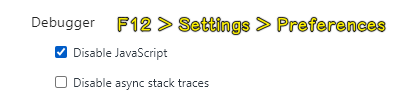
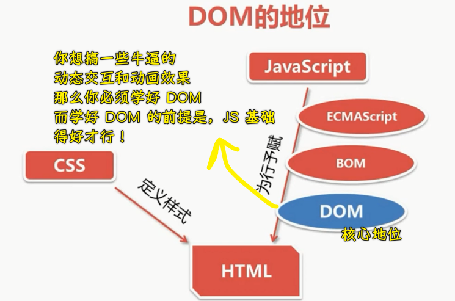
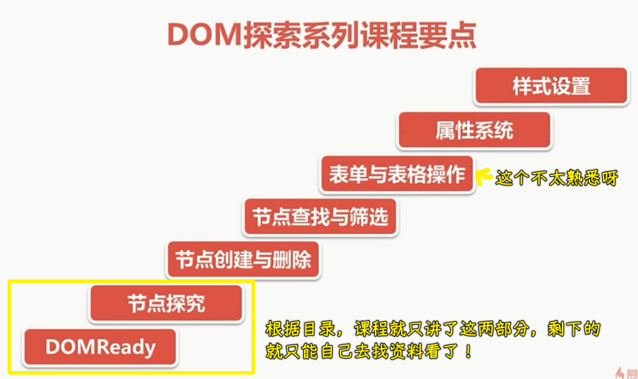
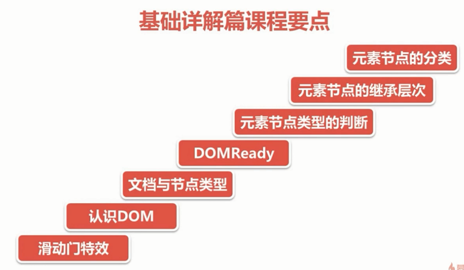

### ✍️ Tangxt ⏳ 2020-11-10 🏷️ DOM

# 第一章 DOM 热身案例——滑动门特效

> 通过一个案例，一方面让大家回忆前面学过的 JS 和 DOM 基础，另一方面让大家感性认识 DOM 操作。

## ★课程介绍

1）DOM 是什么？

Document Object Model 的缩写 -> 直译过来就是「文档对象模型」

2）DOM 在前端开发中的地位和作用

1、DOM 的作用

💡：在哪里可以禁用页面的 JavaScript？

2、DOM 的地位

我们知道一个网页是由 HTML 来搭建结构的，透过 CSS 定义样式的，而 JavaScript 则赋予了页面的行为，有了 JS ，我们就可以通过它与页面进行交互了，如实现页面的动画效果等等

可 JS 具体又是通过什么来实现对页面的交互的呢？

1. 根据 ECMAScript 标准，我们可以编写 JS 代码来让浏览器解析执行我们的程序代码
2. 利用 ECMAScript，我们可以通过 BOM 来操作浏览器窗口、浏览器导航对象、屏幕分辨率、浏览器历史、Cookie 等等，然而仅仅是通过 BOM 来实现的交互，是远远不够的，**要实现页面的动态交互和效果，操作 HTML 才是核心** -> 所以我们该如何操作 HTML 呢？
3. DOM 就可以让我们操作 HTML

为啥 DOM 就可以让我们操作 HTML？

简单来说，**DOM 给我们提供了用程序来动态控制 HTML 的接口**！也就是早期的 DHTML 的概念！

因此，DOM 处在 JavaScript 赋予 HTML 具备动态交互和效果能力的**核心地位**上

所以，我们必须要学好这个 DOM

3）DOM 探索系列课程要点

1. DOMReady：想要安全的操作 DOM，必须等到页面上所有的 HTML 都被解析成 DOM 节点才能进行操作 -> 因此，了解 DOMReady 是第一步
2. 探究节点：学习文档与节点的类型、元素节点类型的判断、元素节点的继承层次以及元素节点的分类等内容
3. 节点的操作：比如节点的创建与删除、节点的查找与筛选等
4. 表格和表单的操作
5. 属性系统
6. 样式设置

4）基础详解篇课程要点

1. 滑动门特效：通过一个案例来让大家感性的认识一下 DOM 在实际开发中是如何应用的
2. 认识 DOM：了解什么是 DOM，以及与 DOM 相关的一些基础概念
3. 文档与节点类型： 重新认识一下 HTMl 与 XML 这两种文档类型，以及文档的各种节点类型
4. DOMReady：详细实现 DOMReady
5. 元素节点类型的判断：学习如何判断元素节点的类型？
6. 元素节点的继承层次：什么是元素节点的继承层次？以及学习继承层次的意义？
7. 元素节点的分类：学习各种元素节点的分类和规格

通过本课程的学习，能为后续课程的学习打下一个坚实的基础

5）适合对象与学习前导

- 该课程特别适合想要深入学习 JS，尤其是想要深入了解 DOM 的前端开发者
- 学习本课程前，要求具备一定的 HTML+CSS+JS 基础知识

通过该课程可以给你梳理脉络，让你重新认识 JS 这门语言，总之，会让你的 JS 能力，再进步一点！

## ★案例 HTML+CSS 结构

