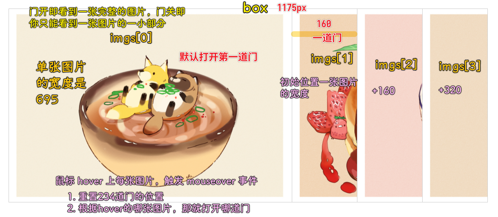

### ✍️ Tangxt ⏳ 2020-11-10 🏷️ DOM

# 第一章 DOM 热身案例——滑动门特效

> 通过一个案例，一方面让大家回忆前面学过的 JS 和 DOM 基础，另一方面让大家感性认识 DOM 操作。

## ★课程介绍

### <mark>1）DOM 是什么？</mark>

Document Object Model 的缩写 -> 直译过来就是「文档对象模型」

### <mark>2）DOM 在前端开发中的地位和作用</mark>

1、DOM 的作用


💡：在哪里可以禁用页面的 JavaScript？


2、DOM 的地位


我们知道一个网页是由 HTML 来搭建结构的，透过 CSS 定义样式的，而 JavaScript 则赋予了页面的行为，有了 JS ，我们就可以通过它与页面进行交互了，如实现页面的动画效果等等

可 JS 具体又是通过什么来实现对页面的交互的呢？

1. 根据 ECMAScript 标准，我们可以编写 JS 代码来让浏览器解析执行我们的程序代码
2. 利用 ECMAScript，我们可以通过 BOM 来操作浏览器窗口、浏览器导航对象、屏幕分辨率、浏览器历史、Cookie 等等，然而仅仅是通过 BOM 来实现的交互，是远远不够的，**要实现页面的动态交互和效果，操作 HTML 才是核心** -> 所以我们该如何操作 HTML 呢？
3. DOM 就可以让我们操作 HTML

为啥 DOM 就可以让我们操作 HTML？

简单来说，**DOM 给我们提供了用程序来动态控制 HTML 的接口**！也就是早期的 DHTML 的概念！

因此，DOM 处在 JavaScript 赋予 HTML 具备动态交互和效果能力的**核心地位**上

所以，我们必须要学好这个 DOM

### <mark>3）DOM 探索系列课程要点</mark>


1. DOMReady：想要安全的操作 DOM，必须等到页面上所有的 HTML 都被解析成 DOM 节点才能进行操作 -> 因此，了解 DOMReady 是第一步
2. 探究节点：学习文档与节点的类型、元素节点类型的判断、元素节点的继承层次以及元素节点的分类等内容
3. 节点的操作：比如节点的创建与删除、节点的查找与筛选等
4. 表格和表单的操作
5. 属性系统
6. 样式设置

### <mark>4）基础详解篇课程要点</mark>


1. 滑动门特效：通过一个案例来让大家感性的认识一下 DOM 在实际开发中是如何应用的
2. 认识 DOM：了解什么是 DOM，以及与 DOM 相关的一些基础概念
3. 文档与节点类型： 重新认识一下 HTMl 与 XML 这两种文档类型，以及文档的各种节点类型
4. DOMReady：详细实现 DOMReady
5. 元素节点类型的判断：学习如何判断元素节点的类型？
6. 元素节点的继承层次：什么是元素节点的继承层次？以及学习继承层次的意义？
7. 元素节点的分类：学习各种元素节点的分类和规格

通过本课程的学习，能为后续课程的学习打下一个坚实的基础

### <mark>5）适合对象与学习前导</mark>

- 该课程特别适合想要深入学习 JS，尤其是想要深入了解 DOM 的前端开发者
- 学习本课程前，要求具备一定的 HTML+CSS+JS 基础知识

通过该课程可以给你梳理脉络，让你重新认识 JS 这门语言，总之，会让你的 JS 能力，再进步一点！

## ★案例 HTML+CSS 结构

滑动门特效，视频里边给出的案例，是没有添加滑动的过渡效果的，为啥没有添加？-> 因为我们重点关注的是 DOM 操作，而 JS 的加速和减速算法并没有添加之！

### <mark>1）写代码</mark>


代码：[Demo](https://github.com/ppambler/demo/commit/37782bc85e04f08237dbe6cf491cf42d2a98f3e3)

💡：`<!DOCTYPE html>`的作用？

`!DOCTYPE`声明文档类型为`html`，这是 HTML5 的声明规则，这个声明能让浏览器按照标准模式来解析文档！

💡：`charset="UTF-8"`？

定义解析页面的编码范围！

💡：`reset.css`

可以用第三方写好的`reset`代码，该代码的作用是用于屏蔽一些浏览器默认样式的显示差异！

## ★实例 JS+DOM

### <mark>1）交互效果代码的实现</mark>

先定义页面加载完毕再进行 DOM 操作的方法：

``` js
window.onload = function() {

}
```

`window.onload`这个方法表示等到页面所有的元素加载完毕，并且所有要请求的资源也加载完毕，才会触发执行`function`这个匿名函数里边的具体内容！

`onload`这个 API 就是 DOM 范畴里边其中一个部分的内容——事件

我们要实现和页面进行交互，就得通过 JS 来操作元素或者说操作 DOM，而要想操作 DOM，就必须先找到 DOM 的元素节点，也就是要找到操作对象！

所以可有：

1. 获得容器对象
2. 获得图片 NodeList 对象集合

长话短说，代码的实现思路：



> 图片滑动的规律，一打开页面，你直接打开第三张图片，那么第二张与第三张都会向左滑动，同理，你打开第四张，那么 2、3、4 都会一起向左滑动……

代码：[Demo](https://github.com/ppambler/demo/commit/01d963f1324db3194d3ec6560420953f8e06d350)

效果：[Preview](https://ppambler.github.io/demo/01/01/index.html)

💡：`offsetWidth`？

属于 DOM 样式设置的内容！

## ★总结

- 了解了一些基本的 DOM API
- 感性地认识了 DOM 是如何被应用到我们实际的交互特效开发中去！
