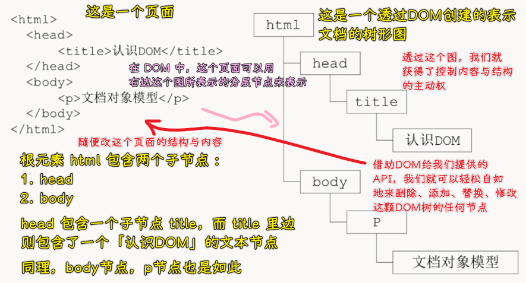
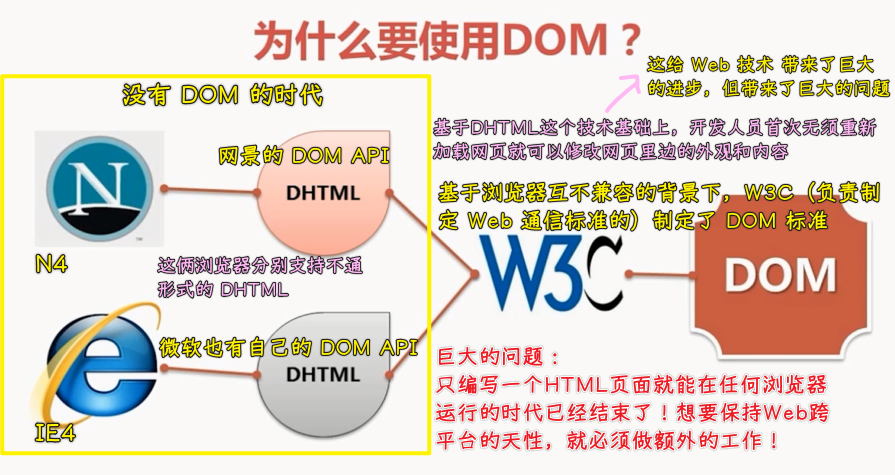
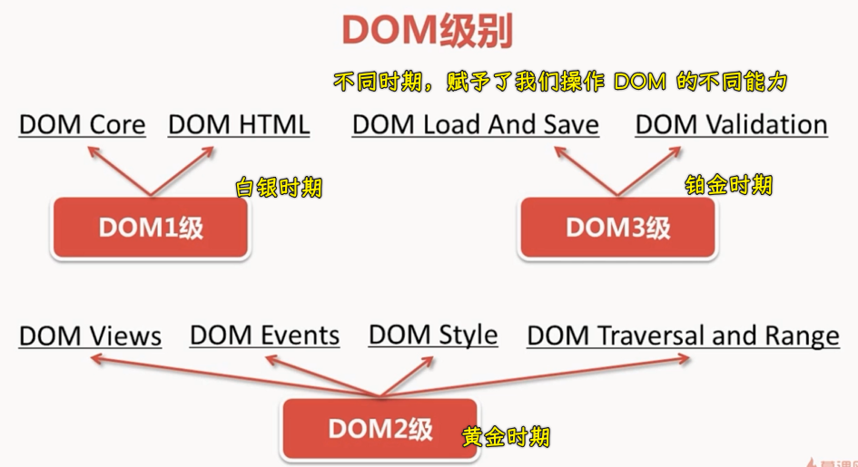
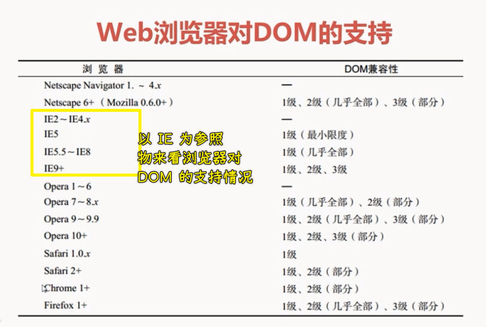

### ✍️ Tangxt ⏳ 2020-11-18 🏷️ DOM

# 第二章 认识 DOM

## ★认识 DOM

1）DOM

DOM，即文档对象模型，它是**针对 XML 、经过扩展用于 HTML 的应用程序编程接口**，也被大众称之为「API」。

DOM 把整个页面**映射**为一个多层的节点结构，HTML 或者是 XML，页面中的每个组成部分都是某种类型的节点，而这些节点又包含着不同类型的数据

> 当你想操作 DOM，那么你的脑海中，就得有一份 DOM 树图！而不是直接的 HTML 源码！

2）为什么要使用 DOM？

如果你接触前端比较早，那么你也许听说过 DHTML（可简单理解为 HTML+CSS+JavaScript+DOM 的组合）-> 这玩意儿可以实现页面的动态的交互开发

> 卧槽，原来我们用 JS 操作 DOM，不用刷新页面，就能让页面发生变化，是来自于 DHTML 这项技术呀！

为啥要制定标准？

因为如果不制定标准，那么这就不利于 Web 技术的发展了 -> 开发者要骂「操」了！还能不能摸鱼了？

3）DOM 级别

DOM 发展至今，已经有好几个版本了！每个时期都会有一个版本，而这个版本用「x」级来表示！

1、DOM1 级

1998 年 10 月成为 w3c 的推荐标准，它由两个模块组成：

1. DOM Core：规定了如何映射基于 xml 的文档结构，以便简化对文档中任何部分的访问和操作
2. DOM HTML：在 DOM Core 的基础上加以扩展，添加了针对 HTML 的对象和方法

其实，DOM 并不是针对 JS 的，很多别的语言也都实现了 DOM，不过，在浏览器中，基于 ECMAScript 实现的 DOM 的确已经成为 JS 这门语言的一个重要组成部分！

如果说 DOM1 级的目标主要是映射文档的结构，那么 DOM2 级的目标就要宽泛多了！

2、DOM2 级

它由 4 块东西组成：

1. DOM Views：DOM 视图，它定义了跟踪不同文档视图的接口，比如跟踪应用 CSS 之前和应用 CSS 之后的文档视图
2. DOM Events：DOM 事件，定义了事件和事件处理的接口
3. DOM Style：定义了基于 CSS 为元素应用样式的接口
4. DOM Traversal and Range: DOM 遍历和范围，它定义了遍历和操作文档树的接口

3、DOM3 级

这一级，则进一步扩展了 DOM

1. DOM Load And Save：引用了以统一方式加载和保存文档的方法
2. DOM Validation：新增了验证文档的方法

---

我们在阅读 DOM 标准的时候，我们经常会看到 DOM0 级，即「**DOM level zero**」这样的字眼，实际上，**DOM0 级这个标准是不存在的**

所谓 DOM0 级，只是 DOM 历史坐标系中的一个参照点而已，具体来说，**DOM0 级就是指 IE4.0 和 N4.0 最初支持的那个 DHTML**

> DOM0 级说白了就是混沌时期各大浏览器自有的 DOM 标准

4）Web 浏览器对 DOM 的支持

在 DOM 标准出现了一段时间之后，Web 浏览器才开始实现它！

微软在 IE5 中首次尝试实现 DOM，但直到 IE5.5 才算是真正的支持 DOM1 级，在随后的 IE6、7 中，微软都没有引入新的 DOM 功能，而到了 IE8 才对以前 DOM 实现中的 bug，进行了修复

目前，支持 DOM，已经成为浏览器开发商的首要目标

主流浏览器每次发布的时候，这个新版本都会改进对 DOM 的支持

5）小结

从以下这四个方面：

1. 什么是 DOM？
2. 为什么要使用 DOM？
3. DOM 级别
4. 浏览器对 DOM 的支持

对 DOM 做了一个基本的介绍！

## ★DOM 文档类型

