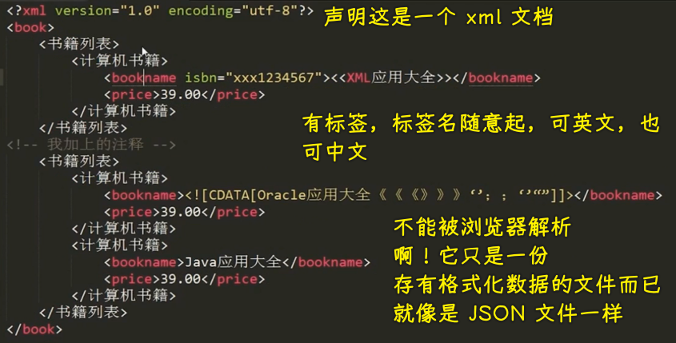

### ✍️ Tangxt ⏳ 2020-11-18 🏷️ DOM

# 第二章 认识 DOM

> 介绍什么是 DOM，为什么使用 DOM，DOM 级别以及 Web 浏览器对 DOM 的支持。 详细介绍 HTML 与 XML 两种文档的类型，介绍七种重要的节点类型。

## ★认识 DOM

### <mark>1）DOM</mark>

DOM，即文档对象模型，它是**针对 XML 、经过扩展用于 HTML 的应用程序编程接口**，也被大众称之为「API」。

DOM 把整个页面**映射**为一个多层的节点结构。HTML 或者是 XML，页面中的每个组成部分都是某种类型的节点，而这些节点又包含着不同类型的数据


> 当你想操作 DOM，那么你的脑海中，就得有一份 DOM 树图！而不是直接的 HTML 源码！

### <mark>2）为什么要使用 DOM？</mark>

如果你接触前端比较早，那么你也许听说过 DHTML（可简单理解为 HTML+CSS+JavaScript+DOM 的组合）-> 这玩意儿可以实现页面的动态的交互开发


> 卧槽，原来我们用 JS 操作 DOM，不用刷新页面，就能让页面发生变化，是来自于 DHTML 这项技术呀！

为啥要制定标准？

因为如果不制定标准，那么这就不利于 Web 技术的发展了 -> 开发者要骂「操」了！还能不能摸鱼了？

### <mark>3）DOM 级别</mark>

DOM 发展至今，已经有好几个版本了！每个时期都会有一个版本，而这个版本用「x」级来表示！


#### <mark>1、DOM1 级</mark>

1998 年 10 月成为 w3c 的推荐标准，它由两个模块组成：

1. DOM Core：规定了如何映射基于 xml 的文档结构，以便简化对文档中任何部分的访问和操作
2. DOM HTML：在 DOM Core 的基础上加以扩展，添加了针对 HTML 的对象和方法

其实，DOM 并不是针对 JS 的，很多别的语言也都实现了 DOM，不过，在浏览器中，基于 ECMAScript 实现的 DOM 的确已经成为 JS 这门语言的一个重要组成部分！

如果说 DOM1 级的目标主要是映射文档的结构，那么 DOM2 级的目标就要宽泛多了！

#### <mark>2、DOM2 级</mark>

它由 4 块东西组成：

1. DOM Views：DOM 视图，它定义了跟踪不同文档视图的接口，比如跟踪应用 CSS 之前和应用 CSS 之后的文档视图
2. DOM Events：DOM 事件，定义了事件和事件处理的接口
3. DOM Style：定义了基于 CSS 为元素应用样式的接口
4. DOM Traversal and Range: DOM 遍历和范围，它定义了遍历和操作文档树的接口

#### <mark>3、DOM3 级</mark>

这一级，则进一步扩展了 DOM

1. DOM Load And Save：引用了以统一方式加载和保存文档的方法
2. DOM Validation：新增了验证文档的方法

---

我们在阅读 DOM 标准的时候，我们经常会看到 DOM0 级，即「**DOM level zero**」这样的字眼，实际上，**DOM0 级这个标准是不存在的**

所谓 DOM0 级，只是 DOM 历史坐标系中的一个参照点而已，具体来说，**DOM0 级就是指 IE4.0 和 N4.0 最初支持的那个 DHTML**

> DOM0 级说白了就是混沌时期各大浏览器自有的 DOM 标准

### <mark>4）Web 浏览器对 DOM 的支持</mark>

在 DOM 标准出现了一段时间之后，Web 浏览器才开始实现它！


微软在 IE5 中首次尝试实现 DOM，但直到 IE5.5 才算是真正的支持 DOM1 级，在随后的 IE6、7 中，微软都没有引入新的 DOM 功能，而到了 IE8 才对以前 DOM 实现中的 bug，进行了修复

目前，支持 DOM，已经成为浏览器开发商的首要目标

主流浏览器每次发布的时候，这个新版本都会改进对 DOM 的支持

### <mark>5）小结</mark>

从以下这四个方面：

1. 什么是 DOM？
2. 为什么要使用 DOM？
3. DOM 级别
4. 浏览器对 DOM 的支持

对 DOM 做了一个基本的介绍！

## ★DOM 文档类型

我们知道文档对象模型是从文档中抽象出来的，**而 DOM 操作的对象也是文档**！

因此，我们有必要了解一下**文档的类型**。

文档随着历史的发展，演变为多种类型。

话说，有哪些类型呢？

### <mark>1）文档的类型</mark>

回顾历史来看：


1. GML：20 世纪 60 年代，IBM 研发了一种格式化文档语言——GML（通用标记语言），它用于描述文档的组织结构、各部件及其相互关系。如 GML 标记（h 标签）可以描述章节的主要部分、次要部分等等
2. SGML：1985 年，国际标准化组织 ISO 对 GML 进行了整理规范，开发出了标准通用标记语言（SGML），但是 SGML 是一种**非常严谨的文本描述法**，过于**庞大复杂，让人难以理解**，于是就有了 HTML
3. HTML：1993 年 6 月，互联网工程工作小组（IETF）发布了 HTML 这个草案，HTML 标准由 w3c 来进行维护，而经过应用，w3c 发现了 HTML 的诸多问题，如不能解释如类似于影音文件、化学公式等其它形式的内容，并且性能比较差，**不易于扩展**，弹性差等问题
4. XML：于是，专家们使用 SGML 简易制作并依照 HTML 的发展经验开发了可扩展的标记语言——XML，由于 XML 的**高扩展性**，为了用来**描述矢量图形**的标记语言，VML、SVG 和其它的一些标记语言也陆续诞生了……
5. XHTML：可扩展超文本标记语言，它的表现方式与超文本标记语言（HTML）类似，不过**语法上更加严格**。从继承关系上讲，HTML 是一种基于标准通用标记语言 (SGML) 的应用，是一种非常灵活的置标语言，而 XHTML 则基于可扩展标记语言 (XML)，XML 是 SGML 的一个子集。XHTML 1.0 在 2000 年 1 月 26 日成为 W3C 的推荐标准。

> 注意：HTML 和 XML 都衍生于 SGML，XML 可以被认为是 SGML 的一个子集，而 HTML 是 SGML 的一个应用

由此可见，**不同的标签语言，是因为专注的领域的不同，我们针对不同的领域使用更专业的工具，这是人之常情**

- HTML 被用来结构化信息，也可用来在一定程度上描述文档的外观和语义，重点是「**什么是结构**」「**如何更好地语义化信息**」
- XML 被设计是用来描述数据的，重点是「**什么是数据**」「**如何存放数据**」
- SGML 被设计是用来显示数据的，重点是「**显示数据**」「**如何更好地显示数据**」
- ……

早期 IE 中的 HTML，可以混合 XML，称之为「XML 数据岛」，可以看到，XML 是与存放数据息息相关的！

> 在 HTML 文档中使用`<XML></XML>`标记来嵌入 xml 数据时，就在 HTML 文档中形成了一个 XML 数据岛（data island）。数据岛是指存在于 HTML 页面中的 xml 代码

### <mark>2）HTML 文档 与 XML 文档，都长啥样？</mark>

#### <mark>1、HTML 文档</mark>

HTML 文档是根据标准的 HTML 规范来**命名元素或者是标签以及属性**等来表示一个文档的，这里的元素或属性作为标准能够**被所有的浏览器认识并且解析**


透过`head`和`body`这两个单词，我们就能体会到 HTML 的标签元素是用来**如何布局和显示内容**的！

如`h1`标签，就是用 1 号标题来显示一段文字 -> 总之，这是为了**强调显示的格式**！

还有，我们甚至可以在 HTML 文档里边引入外部的样式，而这样就可以让我们更详细地去定义页面的布局和显示的风格了

对比 XML 文档来看

#### <mark>2、XML 文档</mark>

与 HTML 类似的是，XML 也基本由标签、属性和叶子节点（没有儿子的节点）组成的

> 我没听清楚老师讲的这个是叶子节点，还是 island 节点，按我理解就是文本节点呗，对于 HTML 就叫文本节点，对于 XML 就叫数据节点…… -> 总之，这指的是标签之间的那段内容



与之不同的是，标签名是可以根据数据的语义要求随意地命名的，如要表现出一本书的名字，那就起名为`bookname`，甚至我们还可以使用汉字，如`书籍列表`、`计算机书籍`等等，而这些标签显然是不能够被浏览器所认识的。可以看到，**XML 是用来存放格式化数据的**

> 前端向后端发请求，拿到的数据是`JSON`格式的数据！

---

基于 XML 扩展出来的其它标记语言，如 SVG、VML 等等，如果你对它们感兴趣，那么就去查阅一下它们的相关文档吧！

> 对于我而言，就 SVG 用得上！

## ★DOM 节点类型

目前，我们已经熟悉了文档的类型，那么问题来了：

> 在 XML/HTML 文档里边的这些代码标记是如何的有机组织起来完成它们的使命的？

我们通常把一个文档划分成多个节点，而这些节点分别用不同的类型来表示，以此来代表不同的含义

**了解这些 DOM 节点类型的含义是我们进行 DOM 节点定义和操作的基础**

DOM1 级定义了一个 Node 接口，这个 Node 接口在 JS 中是作为 Node 类型来实现的，除了 IE 以外，其它所有浏览器都可以访问这个类型

每个节点都有一个`nodeType`属性，用于表明节点的类型，节点类型通过定义数值常量和字符常量这两种方式来表示 -> IE 只支持数值常量

节点类型一共有 12 种，在这里我们只介绍常用的 7 种，其它 5 种请自行查阅有关资料

接下来逐一认识一下这些节点的类型

### <mark>1）节点的类型</mark>


#### <mark>1、Element 节点</mark>

它是组成文档树的重要部分，它表示 HTML/XML 文档中的元素，通常元素拥有子元素——文本节点或二者的结合，元素节点是唯一拥有属性的节点类型


#### <mark>2、Attr 节点</mark>

它代表了元素中的属性，因为**属性实际上是附属于元素**的，所以属性节点不能被看作是元素的子节点。在 DOM 中，属性没有被认为是文档树中的一部分，换句话说，属性节点其实是被看作是包含它的元素节点的一部分，**它并不作为一个单独的节点在文档树中出现**

上图中的`lang`、`charset`、`name`、`rel`、`href`等都属于属性节点！

#### <mark>3、Text 节点</mark>

它是一个只包含文本内容的节点，在 XML 中称为「**字符数据**」，它可以由更多的信息组成，也可以只包含空白。

在文档树中，元素的文本内容和属性的文本内容都是由文本节点来表示的


#### <mark>4、Comment 节点</mark>

它用来表示注释的内容


#### <mark>5、Document 节点</mark>

它是文档树的根节点，它是文档中其它所有节点的父节点。

特别需要注意的是，文档节点并不是 HTML/XML 文档的根元素，**因为在 XML 文档中，处理指令、注释等内容可以出现在根元素之外**，所以我们在构造 DOM 树的时候，**根元素并不适合作为根节点**，于是就有了文档节点。

而根元素是作为文档节点的子节点出现的！


#### <mark>6、DocumentType 节点</mark>

每一个 Document 都有一个 DocumentType 属性，它的值或者是`null`或者是`DocumentType`对象


在控制台测试：


#### <mark>7、DocumentFragment 节点</mark>

文档片段是轻量级的或最小的 Document 对象，它表示文档的一部分或者是一段，**它不属于文档树**，不过它有一种特殊的行为，而该行为使得它非常的有用。

比如，当你请求把一个`DocumentFragment`的节点插入到文档的时候，插入的并不是`DocumentFragment`自身，而是它的所有的子孙节点，这使得`DocumentFragment`成了有用的占位符，暂时存放那些一次性插入文档的节点。

同时，它还有利于实现文档的剪切、复制和粘贴等操作！


注意，这个`frag`节点自始至终都没有在我们这个 HTML 代码里边进行定义，它只是作为了一个临时的占位符，而这就是所谓的文档片段节点啦！


这就像是这样：


> 一种读法：透过文档片段节点，把 10 个`li`元素**装载**到这个`ul`元素里边去

---

关于各种类型的节点，目前就先简单了解到这儿吧！之后，在其它篇里边会详细地介绍到！

### <mark>2）补充其它节点类型</mark>

还在用的：


废弃的：


## ★DOM nodeType

我们可以通过某个节点的`nodeType`属性来获得节点的类型，而节点的类型可以是数值常量，也可以是字符常量

### <mark>1）例子</mark>

#### <mark>1、判断一个节点是否是元素节点？</mark>


在 Chrome 浏览器下测试成功，但在 IE 浏览器下并没有测试成功，原因是 IE 浏览器并咩有内置`Node`这个对象


那么同样的需求，如何能让代码 在 IE 8 下也能正常跑起来呢？

很简单，不使用字符常量，而是使用数值常量

---

结论：通过数值常量来判断一个节点类型，是所有浏览器都兼容的！因此，以后在写代码的时候，我们就使用**数值常量**来比较`nodeType`的返回值，以此来判断一个节点的类型，而不是用「字符常量」来比较

💡：一个我不知道的点？


## ★DOM nodeName-nodeValue

除了通过`nodeType`来返回节点的类型以外，我们还可以通过`nodeName`来返回节点的名称、通过`nodeValue`来返回节点的值。

接下来，我们会对**所有常用的节点**通过实验来分别看`nodeName`和`nodeValue`的返回值究竟是什么，了解这些返回值很重要，它**是我们进行 DOM 操作的基础**


### <mark>1）实验姿势</mark>

实验姿势是这样的：

我们通过 DOM API 获得了 `div` 这个**元素节点对象** -> 把这个对象保存在`divNode`这个临时变量里边 -> `log`一下这个元素节点的名字和元素节点的值 -> 得到`DIV/null`

> 元素节点的`nodeValue`一定是`null`吗？

---

`attributes`保存了`div`元素的所有属性 -> 返回值是一个类数组对象


> 可以拿到属性节点的名字，以及它的值！

如果有`div`有多个属性，比如多了一个`class`属性：

``` html
<div class="box" id="container">这是一个元素节点</div>
```

那么 `attributes` 的返回值是这样的：


---

`childNodes`可以获得`div`元素所有的子节点


> 我在`html`元素插入一段文本，结果还是只添加了一个`回车`的文本节点 -> 不知道为啥会这样，但我并不关心它的原因

我觉得这个`childNodes`是有 bug 的！我在`html`元素旗下插入了各种节点，其结果并没有按我的预期所返回……比如我在`<html>`旁边插入了一个元素，其结果只返回了一个`head`和`body` -> 又或者说是`html`元素比较特殊，而在`body`元素里边这样搞是很正常的？

总之，一般情况下，你要拿`html`元素旗下所有的子节点，那么其返回值是`[head,text,body]`

> 为啥就不是`[HEAD,#text,BODY]`呢？ -> 无法理解……你这 API 爱咋样实现就咋样实现……爱返回啥就返回啥……

---

汇总一下`nodeName/nodeValue`的返回值：


### <mark>2）小结</mark>

- 通过 DOM API 拿到的节点，我们叫「元素/属性/文本/注释……节点对象」；读 HTML 文档上的元素代码，就叫「元素/属性节点」
- 为了浏览器兼容，我们选择了`数值常量`作为我们`nodeType`的返回值来判断节点类型
- 很多时候，我们需要拿到这个`xxx`节点的名字以及它的值！

## ★了解更多

➹：[以前的 DHTML 如今是不是也算前端？ - 知乎](https://www.zhihu.com/question/27791518)

➹：[IBM Generalized Markup Language - Wikipedia](https://en.wikipedia.org/wiki/IBM_Generalized_Markup_Language)

➹：[What is GML (Generalized Markup Language)? - Definition from WhatIs.com](https://whatis.techtarget.com/definition/GML-Generalized-Markup-Language)

➹：[HTML - Wikipedia](https://en.wikipedia.org/wiki/HTML)

➹：[XML - Wikipedia](https://en.wikipedia.org/wiki/XML)

➹：[【HTML/XML 11】XML 和 HTML 的混合使用_san.hang 的博客-CSDN 博客](https://blog.csdn.net/weixin_30245867/article/details/95930743)

➹：[Node.nodeType - Web APIs - MDN](https://developer.mozilla.org/en-US/docs/Web/API/Node/nodeType)