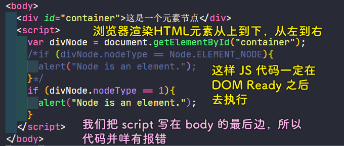
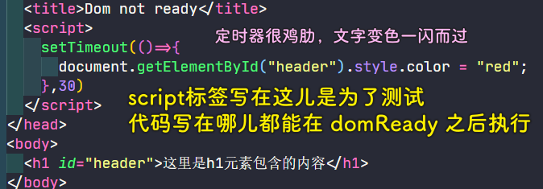
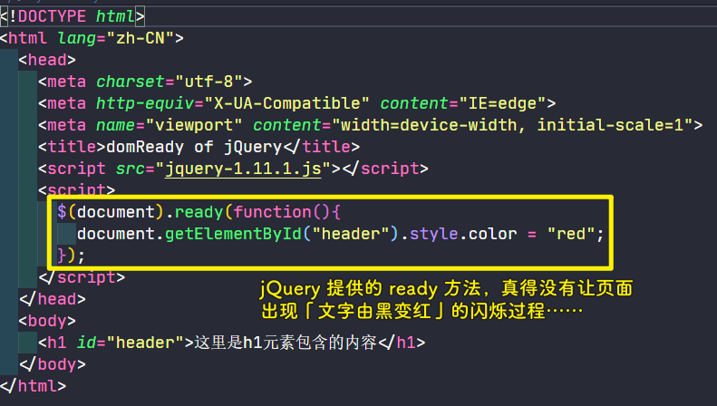
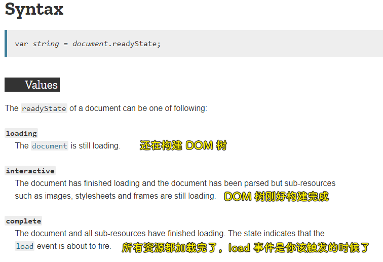
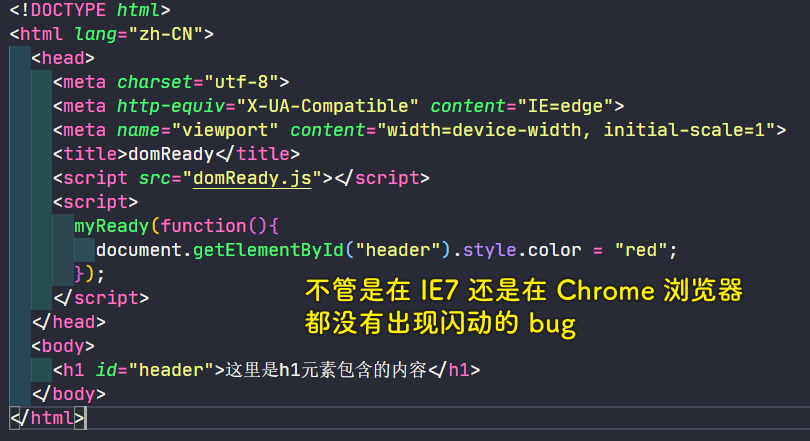

### ✍️ Tangxt ⏳ 2020-11-20 🏷️ DOM

# 第三章 DOM Ready

> 深入剖析什么是 DOM Ready，了解什么是浏览器渲染引擎，判断 DOM 是否 Ready 的意义，学会自己编写浏览器兼容的 domReady，最后通过实例来比较 window.onload 与 domReady 的不同之处。

## ★什么是 domReady

### <mark>1）需求：把这段文字变成红色</mark>


要求用「JS + DOM」实现

根据之前所学到的内容，我们这样做：


可以看到这没有预期的显示红色

打开控制台：


> 这个报错读法：不能读取一个空元素的 `style` 属性

通过这个错误，我们基本能推断出我们的 JS 代码并没有找到这个 `h1` 元素

### <mark>2）为什么会报错？</mark>

回到代码来看，在这个页面（ `.html` 这个源码文件）里边，明明就有一个包含 `id` 为 `header` 的 `h1` 元素呀！

其实，出现这个问题就是我们**没有分清 HTML 标签和 DOM 节点之间的区别**的缘故了！

HTML 是一种标记语言，它告诉我们这个页面有什么内容，但**行为交互是需要通过 DOM 操作来实现**的，我们千万不要认为：


> 我们的 JS 代码操作的 DOM 节点，可不是 HTML 代码里边直接的元素标签！-> 浏览器执行 JS 代码的时候，h1 元素标签还未变成一个 DOM 节点嘞！-> 菜都没买，你说你让我怎么煮？煮西北风吗？

HTML 标签要通过浏览器解析才会变成 DOM 节点，当我们向地址栏里边传入一个 URL，敲下回车的时候，浏览器开始加载页面，之后我们就能看到内容了，而在这个期间，其实就有一个 DOM 节点构建的过程

**节点们是以「树」的形式组织的，当页面上所有的 HTML 都转化为节点以后，就叫做 DOM 树构建完毕，我们简称为「DOM Ready」**

那浏览器是如何将 HTML 标签解析变成 DOM 节点的呢？

实际上，浏览器是通过渲染引擎来实现的，渲染引擎的职责就是**把请求的内容显示到浏览器屏幕上**，默认情况下，渲染引擎可以**显示 HTML/XML 文档以及图片**，通过插件可以扩展浏览器的能力，使其可以渲染显示其它类型的文档，如安装「pdf viewer」插件就可以显示 pdf 文档了……

在这里，我们只了解渲染引擎的主要用途，即将 CSS 格式化的 HTML 与图片在浏览器上进行显示


## ★DOM 渲染引擎的渲染流程

### <mark>1）何为渲染</mark>

**浏览器把请求得到的 HTML 内容显示出来的过程**，渲染引擎首先通过网络获得所请求文档的内容，通常**以 8k 分块的方法**来完成

接下来，我们就来了解一下渲染引擎在取得内容之后的基本渲染流程。

### <mark>2）基本渲染流程</mark>


1. 解析 HTML 以构建 DOM 树，即「**构建 DOM 节点**」，渲染引擎开始解析 HTML，并将标签转化为内容树的 DOM 节点
2. 构建渲染树，即「**解析样式信息**」，解析外部的 CSS 文件以及`style`标签中的样式信息，渲染树由一些包含有各种属性的矩形组成，它们将被按照正确的顺序显示到屏幕上
3. 布局渲染树，即「**布局 DOM 节点**」，执行布局的过程，它将确定每个节点在屏幕上的确切坐标
4. 绘制渲染树，即「**绘制 DOM 节点**」，渲染树构建好了以后，再下一步就是绘制，即遍历渲染树，并使用 UI 后端层来绘制每个节点

以上就是 HTML 在浏览器里边的基本渲染过程了！

注意，这并不包含解析过程中浏览器加载外部资源，比如图片、脚本、iframe 等一些的过程，说白了，**上边四步仅仅是 HTML 结构的渲染过程**，而**外部资源的加载在 HTML 结构的渲染过程中是贯穿于始终的**，即便绘制 DOM 节点已经完成了，而外部资源仍然可能**正在加载或者是尚未加载**

接下来，以 Webkit 渲染引擎为例来来看看浏览器的主要渲染流程

### <mark>3）Webkit 主要渲染流程</mark>


1. HTML 标签元素经过 HTML 解析，**依据 DOM 标准**生成 DOM 树
2. CSS 样式代码，经过 CSS 解析成我们的**样式规则**
3. Webkit 使用`Attachment`来连接我们的 DOM 节点（DOM Tree）和可视化信息（Style Rules），以此来构建渲染树，渲染树由**渲染对象**来组成，并使用「`Layout`」来表示元素的布局
4. **遍历**渲染树，也就是「Painting」
5. 在浏览器上边**绘制**出页面 -> 「Display」

Webkit 主要渲染流程那张图里边的**每个蓝色部分都是一个相当复杂的运算**，在这里就不一一展开地来讲了，浏览器具体内部工作原理，请看：

* [前端必读：浏览器内部工作原理_知识库_博客园](https://kb.cnblogs.com/page/129756/)
* [How browsers work](http://taligarsiel.com/Projects/howbrowserswork1.htm)

## ★domReady 的实现策略

> 如何获得浏览器绘制完 DOM 节点的时机或者说如何得知 DOM 何时 Ready？

### <mark>1）为什么需要 domReady</mark>

之前我们写的例子代码，其实并咩有考虑 DOM Ready 的事儿，而貌似这程序也能正常运行，没有报错！

如这个例子：



这个例子，我们并咩有考虑「DOM Ready」这个概念就去写了，仅仅只是把 `script` 标签写到 `body` 标签里边的最后边去了……

所以，为啥我们还有考虑「DOM Ready」呢？直接把 JS 代码都放到 `body` 的后边去不就好了吗？

事实上，我们在编写大型应用程序的时候 JS 文件往往非常得多，而且它们之间相互的调用大多都是外部引用的，不把代码直接写在页面上，这样的话，如果有个「DOM Ready」这样的方法，我们想要用到它就直接调用它，不管这逻辑代码写在哪儿，都是等到「DOM Ready」之后才去执行的！-> 总之，一句话说之「**为了显得高大尚**」

> 其实很鸡肋……

### <mark>2）如何实现 domReady？</mark>

#### <mark>1、用定时器来搞？</mark>



我们想要的是「domReady 之后，文字即可变成红色」，而不是「domReady 之后一段时间，才变成红色」，说白了，我们想让用户只看到这是红色的文字，不是「从黑变红」这样一闪而过……

> 其实用 `0` ms 是可以做到「只看到文字只是红色的效果」的！-> 不过，HTML 元素过多的话，这还是会有文字颜色变化的闪烁过程！

所以，此方法不可行……

#### <mark>2、 `window.onload`</mark>

`window.onload` ：

1. 是一个事件
2. 在浏览器绘制完 DOM 节点并且当页面上所有的资源都加载完毕以后才会去执行自己定义的逻辑代码，也就是`callback`啦！

总之，在文档所有的解析渲染、资源加载完成之前，不让 JS 代码执行，这样就可以妥妥地**避免了因 JS 操作先于 DOM 树创建而带来的 bug**

``` js
window.onload = function() {
  document.getElementById("header").style.color = "red";
};
```

视频里的讲解并咩有闪烁，其实还是有「文字由黑变红」这样的过程！

这个 API 的弊端：

如果我们的页面上有 100 张远程的图片，我们需要让 JS 做到在点击每张图片的时候 `alert` 出图片的 `src` 属性

按照我们之前对浏览器解析渲染 HTML 的流程的认识，我们知道 DOM 树很快就构建完毕了，而 100 张图片还在缓慢的加载，而你用这个 `onload` 方法，得要等到图片都加载完毕后，才会去执行 JS 代码，所以在加载图片的这个页面期间，你不管怎么点击页面都不会响应你的任何操作，就好像 GG 了一样……

而在实际项目中，用户很有可能不会等到页面把所有的东西都加载完毕后才去操作，于是就会去点页面，但页面不给用户任何反应，于是用户就用了非常解气的方式，也就是果断关掉页面来解决之，并表示「再也不访问这个页面了」

所以，在实际应用中我们经常会遇到这样的场景，让页面加载后再做一些事情，比如绑定事件、DOM 操作某些节点等等。**使用 `onload` 对于很多实际的应用而言显得有点太迟了，比较影响我们的用户体验**

总之， `onload` 是有问题的，我们得另找一个方案……

#### <mark>3、DOMContentLoaded 事件</mark>

> The `DOMContentLoaded` event fires when the initial HTML document has been completely loaded and parsed, without waiting for stylesheets, images, and subframes to finish loading.



> 其效果就像是我们为这个 HTMl 元素写了 `color:red` 样式一样……

在这里，我们实验的例子是 jQuery 中的 `ready` 的方法，其实现逻辑是这样的：

``` js
jQuery.ready.promise = function(obj) {
  if (!readyList) {

    readyList = jQuery.Deferred();

    // Catch cases where $(document).ready() is called after the browser event has already occurred.
    // we once tried to use readyState "interactive" here, but it caused issues like the one
    // discovered by ChrisS here: http://bugs.jquery.com/ticket/12282#comment:15
    if (document.readyState === "complete") {
      // Handle it asynchronously to allow scripts the opportunity to delay ready
      setTimeout(jQuery.ready);

      // Standards-based browsers support DOMContentLoaded
    } else if (document.addEventListener) {
      // Use the handy event callback
      document.addEventListener("DOMContentLoaded", completed, false);

      // A fallback to window.onload, that will always work
      window.addEventListener("load", completed, false);

      // If IE event model is used
    } else {
      // Ensure firing before onload, maybe late but safe also for iframes
      document.attachEvent("onreadystatechange", completed);

      // A fallback to window.onload, that will always work
      window.attachEvent("onload", completed);

      // If IE and not a frame
      // continually check to see if the document is ready
      var top = false;

      try {
        top = window.frameElement == null && document.documentElement;
      } catch (e) {}

      if (top && top.doScroll) {
        (function doScrollCheck() {
          if (!jQuery.isReady) {

            try {
              // Use the trick by Diego Perini
              // http://javascript.nwbox.com/IEContentLoaded/
              top.doScroll("left");
            } catch (e) {
              return setTimeout(doScrollCheck, 50);
            }

            // detach all dom ready events
            detach();

            // and execute any waiting functions
            jQuery.ready();
          }
        })();
      }
    }
  }
  return readyList.promise(obj);
};
```

我们可以看到这代码出现了`readyState`、`DOMContentLoaded`、`onreadystatechange`等这样的字眼，但这些跟我们的 domReady 有啥关系呢？

先从`DOMContentLoaded`这个 API 说起，再去了解它们之间的关系

### <mark>3）DOMReady 实现策略</mark>

很多时候，我们都会把 JS 逻辑写到`window.onload`回调里边，以防止 DOM 树还未建完就开始对节点进行操作，从而导致错误……

而对很多实际应用来说，我们**越早介入对 DOM 的干涉越好**，比如我们进行特征检测、事件绑定、DOM 操作啥的……

DOMReady 它可以满足用户提前绑定事件的需求，因为有些情况下，我们页面的图片等外部资源过多，会导致`window.onload`迟迟不能触发，这时候如果还咩有绑定事件，那么用户点击任何按钮都没有反应，当然，除了`a`链接之外……这样的话，就会严重影响用户体验

就下来就来研究一下 DOMReady 的实现策略

我们为了解决`window.onload`的短板，w3c 终于提供了一个叫`DOMContentLoaded`这样一个事件，与`onload`事件相比，该事件触发的时机更早！它是**在页面的 DOM 树创建完成以后，也就是 HTML 解析第一步完成即触发，而无需等待其它资源的加载**！

但对于低版本的 IE 而言，这个事件并不支持，所以我们该咋办呢？

一开始，我们勉强使用`onreadystatechange`这个事件来模拟，但直到有一天有一个外国的大牛，他发掘出了`doScroll`这个伟大的 hack，这个 hack 可以让我们在低版本 IE 下边实现更接近`DOMContentLoaded`这个事件的效果，于是我们就有了下面两套策略：


回顾 jQuery 的`ready`源码：

1. 判断`document.readyState === "complete"`是否为`true`，如果是，那就说明时机到了，可以执行`ready`方法了 -> 也就是执行`callback`
2. 如果是现代浏览器支持`DOMContentLoaded`这个事件，我们直接就可以为页面绑定这个`DOMContentLoaded`事件，该事件触发，就可以执行我们的业务逻辑代码。而且等所有资源都加载完毕后，还会执行一遍`callback`
3. 如果是 IE 的低版本浏览器并且是`frame`的话，就使用`onreadystatechange`这个事件，同样也绑定了`onload`事件。但如果窗口不是`frame`，那就执行那个利用了`doScroll`的 hack 代码

目前我们简要的看了一下 jQuery 的 domReady 实现，接下来，我们自己也要实现一个 domReady

💡：`Document.readyState`？

The `Document.readyState` property describes the loading state of the `document`.

When the value of this property changes, a `readystatechange` event fires on the `document` object.



💡：`addEventListener`的第二个参数`completed`？

``` js
document.addEventListener( "DOMContentLoaded", completed, false );
```

额……它就是一个函数名字呀！DOM 构建完毕，就会执行这个`completed`方法，而该方法体里边会`jQuery.ready()` -> 总之，这最后会执行你传给`ready`的`callback`函数哈！

## ★domReady 的实现

### <mark>1）代码实现</mark>

``` js
function myReady(fn) {
  // 对于现代浏览器，对 DOMContentLoaded 事件的处理采用标准的事件绑定方式
  if (document.addEventListener) {
    // 绑定 w3c 给我们定义好的 DOMContentLoaded 事件，就能实现侦测 DOMReady 了
    // DOMReady 以后，才去调用 fn
    // false 表示在冒泡阶段捕获
    document.addEventListener("DOMContentLoaded", fn, false);
  } else {
    // 如果是 IE 低版本浏览器，就调用我们实现的 IEContentLoaded 方法
    IEContentLoaded(fn);
  }

  // IE 模拟 DOMContentLoaded
  function IEContentLoaded(fn) {
    // 把 window.document 缓存到一个变量里，以此来让代码更简洁
    var d = window.document;
    // 标记变量
    var done = false;

    // 只执行一次用户的回调函数 init()
    var init = function () {
      if (!done) {
        done = true;
        fn();
      }
    };

    // 如果 document 的加载状态是未就绪，我们如何尽快地侦测到 DOMReady？
    // 并立即调用我们的回调函数 fn？
    (function () {
      // 定义一个 try catch 语句
      try {
        // DOM 树未创建完之前调用 doScroll 会抛出错误
        d.documentElement.doScroll("left");
      } catch (e) {
        // 延迟再试一次~
        // arguments.callee 是函数自身，也就是这个匿名函数 function
        setTimeout(arguments.callee, 50);
        // 通过直接 return 来实现递归……
        return;
      }
      // 没有错误就表示 DOM 树创建完毕，然后立马执行用户回调
      init();
    })();

    // 监听 document 的加载状态
    d.onreadystatechange = function () {
      // 如果用户是在 domReady 之后绑定的函数，就立马执行
      if (d.readyState == "complete") {
        // 把清除 onreadystatechange 这个事件清除掉
        d.onreadystatechange = null;
        init();
      }
    };
  }
}
```

### <mark>2）代码解析</mark>

1. `fn`形参是 DOM Ready 以后要执行的回调函数
2. 在 IE 下完美实现模拟的 `DOMContentLoaded`：
   1. 搞个只执行一次`fn`的`init`函数
   2. 监听`document`的加载状态，如果用户在`domReady`之后绑定了函数，那就立马执行`init`函数 -> 关注`complete`值
   3. 如果`document`的`readyState`还是`loading`，那么我们就以`50 ms`的时间间隔，来轮询问候浏览是否已经把 DOM 树创建好了，如果创建好了，那就执行`init`函数 -> 关注`loading`值，想尽快在 DOM 树创建完成的第一时间内，执行`init`函数……
3. 通过判断`addEventListener`这个方法是否存在来判断这浏览器是否是现代浏览器 -> 这是一种典型的通过「能力检测」来区分浏览器的方法 -> 简而言之，就是 JS 询问浏览器你有`addEventListener`这个能力吗？
   1. 有这能力，就为`document`绑定`DOMContentLoaded`事件
   2. 没有这能力，那就调用我们实现的`IEContentLoaded`方法

---

`myReady`这个方法的实现思路跟 jQuery 的大同小异。

接下来就来测试一下，我们写的这个`myReady`方法灵光不灵光？

例子还是原来那个把文字变成红色的例子：



可以看到，我们写到这个`domReady`方法（兼容 IE7、现代浏览器）完美实现了 domReady ！

---

话说，各大主流框架的 DOMReady 是如何实现的？

- Prototype
- jQeury
- moontools
- dojo
- yui
- ext

- [转- 主流 JS 框架中 DOMReady 事件的实现 - Lorz - 博客园](https://www.cnblogs.com/JulyZhang/archive/2011/02/12/1952484.html)
- [主流 JS 框架中 DOMReady 事件的实现 - 山哥的个人空间 - OSCHINA - 中文开源技术交流社区](https://my.oschina.net/jsan/blog/86801)
- [JS DOMReady 事件的六種實現方法總結 - 程式前沿](https://codertw.com/%E5%89%8D%E7%AB%AF%E9%96%8B%E7%99%BC/252665/)

## ★domReady 综合案例

透过一个综合案例，来真实的感受一下`window.onload`与`domReady`-> 执行时机的不同点

测试逻辑：

> 准备 6 张超高清的壁纸图片（`2560*1440`）-> 每个文件大概在`1.5M`左右

测试效果：


结论：

为了提高用户体验，我们大多数的时候是使用`domReady`，而不是使用`onload`！

## ★了解更多

➹：[浏览器渲染原理及流程 - 李某龙 - 博客园](https://www.cnblogs.com/slly/p/6640761.html)

➹：[为什么说 DOM 操作很慢_知识库_博客园](https://kb.cnblogs.com/page/534571/)

➹：[Document.readyState - Web APIs - MDN](https://developer.mozilla.org/en-US/docs/Web/API/Document/readyState)

➹：[页面生命周期：DOMContentLoaded，load，beforeunload，unload](https://zh.javascript.info/onload-ondomcontentloaded)

➹：[译-页面生命周期：DOMContentLoaded, load, beforeunload, unload 解析 · Issue #3 · fi3ework/blog](https://github.com/fi3ework/blog/issues/3)

➹：[DOM Ready 详解 - ziqiu.zhang - 博客园](https://www.cnblogs.com/zhangziqiu/archive/2011/06/27/domready.html)

➹：[浅谈DOMContentLoaded事件及其封装方法_Ms. Han 前端小站 - SegmentFault 思否](https://segmentfault.com/a/1190000005869515)

➹：[【第884期】你不知道的 DOMContentLoaded](https://mp.weixin.qq.com/s?__biz=MjM5MTA1MjAxMQ==&mid=2651226247&idx=1&sn=8595a53fe98a3225d0cf0ce3f8ff2acc&chksm=bd4959038a3ed015c3d03fcdadcdabf4225a7eee4efb1988becd9ae3cd87f2216a34717383bc&mpshare=1&scene=1&srcid=0403gXzWL8aSq91TuBoqyFtm&key=19bca82a00e28dcd2ee4826d029205065cd6e6bbcc6f97f2da04129789e26a00b82cc9fccc4f838fc1bda9d9935ab03cc482bfcee734dd40c175fe0d882d0518c4ecf63d82e3d78471415eee960f66cc&ascene=0&uin=NzM0NTM5MzQx&devicetype=iMac+MacBookPro12%2C1+OSX+OSX+10.11.6+build(15G31)&version=12020110&nettype=WIFI&fontScale=100&pass_ticket=2uOqWTPNenLxF7wD%2F%2Bi%2F0TK60XMDQLdZ%2Bk2hyDjtKZsM9jitnQM4c%2B5cVfq0SJLP)