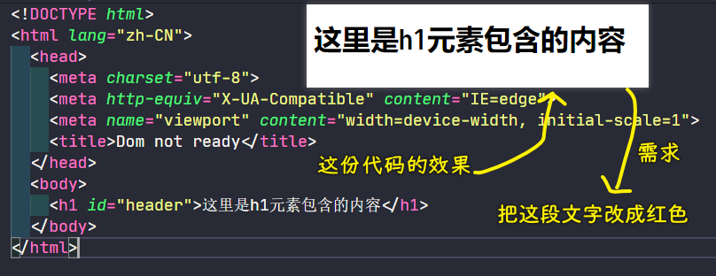
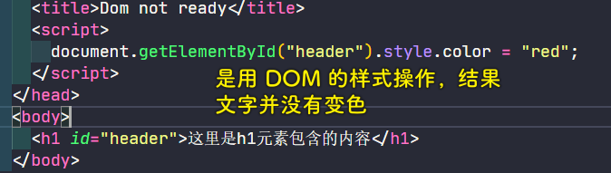
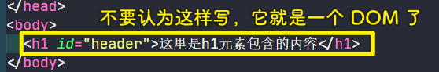
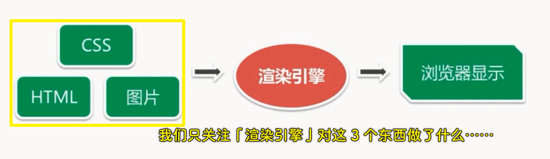
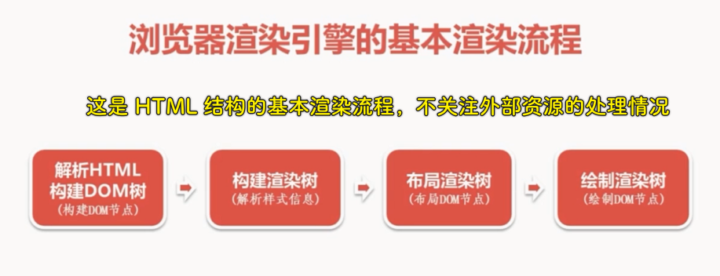
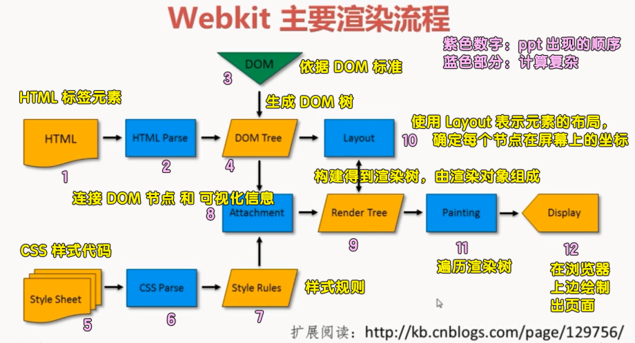

### ✍️ Tangxt ⏳ 2020-11-20 🏷️ DOM

# 第三章 DOM Ready

> 深入剖析什么是 DOM Ready，了解什么是浏览器渲染引擎，判断 DOM 是否 Ready 的意义，学会自己编写浏览器兼容的 domReady，最后通过实例来比较 window.onload 与 domReady 的不同之处。

## ★什么是 domReady

1）需求：把这段文字变成红色

要求用「JS + DOM」实现

根据之前所学到的内容，我们这样做：

可以看到这没有预期的显示红色

打开控制台：

> 这个报错读法：不能读取一个空元素的`style`属性

通过这个错误，我们基本能推断出我们的 JS 代码并没有找到这个`h1`元素

2）为什么会报错？

回到代码来看，在这个页面（`.html`这个源码文件）里边，明明就有一个包含`id`为`header`的`h1`元素呀！

其实，出现这个问题就是我们**没有分清 HTML 标签和 DOM 节点之间的区别**的缘故了！

HTML 是一种标记语言，它告诉我们这个页面有什么内容，但**行为交互是需要通过 DOM 操作来实现**的，我们千万不要认为：

> 我们的 JS 代码操作的 DOM 节点，可不是 HTML 代码里边直接的元素标签！-> 浏览器执行 JS 代码的时候，h1 元素标签还未变成一个 DOM 节点嘞！-> 菜都没买，你说你让我怎么煮？煮西北风吗？

HTML 标签要通过浏览器解析才会变成 DOM 节点，当我们向地址栏里边传入一个 URL，敲下回车的时候，浏览器开始加载页面，之后我们就能看到内容了，而在这个期间，其实就有一个 DOM 节点构建的过程

**节点们是以「树」的形式组织的，当页面上所有的 HTML 都转化为节点以后，就叫做 DOM 树构建完毕，我们简称为「DOM Ready」**

那浏览器是如何将 HTML 标签解析变成 DOM 节点的呢？

实际上，浏览器是通过渲染引擎来实现的，渲染引擎的职责就是**把请求的内容显示到浏览器屏幕上**，默认情况下，渲染引擎可以**显示 HTML/XML 文档以及图片**，通过插件可以扩展浏览器的能力，使其可以渲染显示其它类型的文档，如安装「pdf viewer」插件就可以显示 pdf 文档了……

在这里，我们只了解渲染引擎的主要用途，即将 CSS 格式化的 HTML 与图片在浏览器上进行显示

## ★DOM 渲染引擎的渲染流程

1）何为渲染

**浏览器把请求得到的 HTML 内容显示出来的过程**，渲染引擎首先通过网络获得所请求文档的内容，通常以 8k 分块的方法来完成

接下来，我们就来了解一下渲染引擎在取得内容之后的基本渲染流程。

2）基本渲染流程

1. 解析 HTML 以构建 DOM 树，即「**构建 DOM 节点**」，渲染引擎开始解析 HTML，并将标签转化为内容树的 DOM 节点
2. 构建渲染树，即「**解析样式信息**」，解析外部的 CSS 文件以及`style`标签中的样式信息，渲染树由一些包含有各种属性的矩形组成，它们将被按照正确的顺序显示到屏幕上
3. 布局渲染树，即「**布局 DOM 节点**」，执行布局的过程，它将确定每个节点在屏幕上的确切坐标
4. 绘制渲染树，即「**绘制 DOM 节点**」，渲染树构建好了以后，再下一步就是绘制，即遍历渲染树，并使用 UI 后端层来绘制每个节点

以上就是 HTML 在浏览器里边的基本渲染过程了！

注意，这并不包含解析过程中浏览器加载外部资源，比如图片、脚本、iframe 等一些的过程，说白了，**上边四步仅仅是 HTML 结构的渲染过程**，而**外部资源的加载在 HTML 结构的渲染过程中是贯穿于始终的**，即便绘制 DOM 节点已经完成了，而外部资源仍然可能**正在加载或者是尚未加载**

接下来，以 Webkit 渲染引擎为例来来看看浏览器的主要渲染流程

3）Webkit 主要渲染流程

1. HTML 标签元素经过 HTML 解析，**依据 DOM 标准**生成 DOM 树
2. CSS 样式代码，经过 CSS 解析成我们的**样式规则**
3. Webkit 使用`Attachment`来连接我们的 DOM 节点（DOM Tree）和可视化信息（Style Rules），以此来构建渲染树，渲染树由**渲染对象**来组成，并使用「`Layout`」来表示元素的布局
4. 遍历渲染树，也就是「Painting」
5. 在浏览器上边绘制出页面 -> 「Display」

Webkit 主要渲染流程那张图里边的**每个蓝色部分都是一个相当复杂的运算**，在这里就不一一展开地来讲了，浏览器具体内部工作原理，请看：

- [前端必读：浏览器内部工作原理_知识库_博客园](https://kb.cnblogs.com/page/129756/)
- [How browsers work](http://taligarsiel.com/Projects/howbrowserswork1.htm)

## ★domReady 的实现策略

