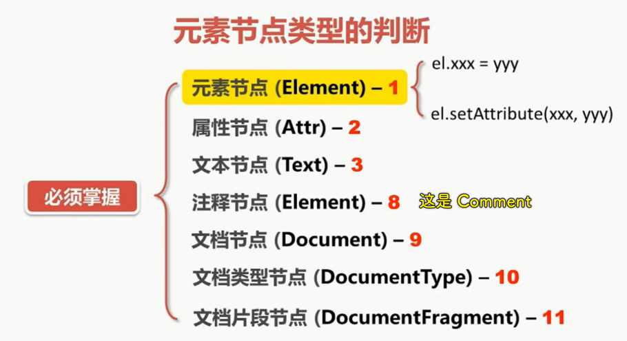
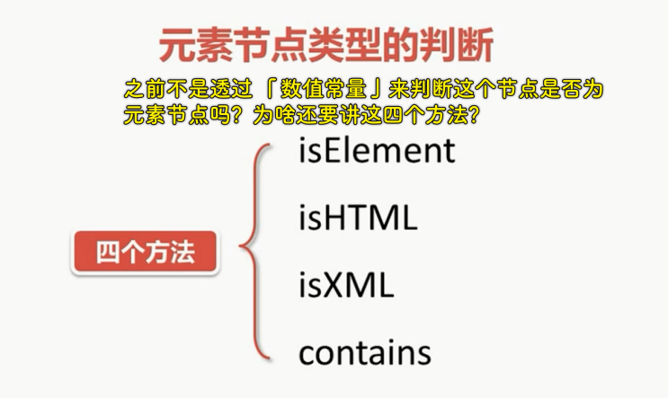
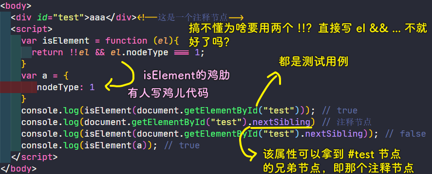
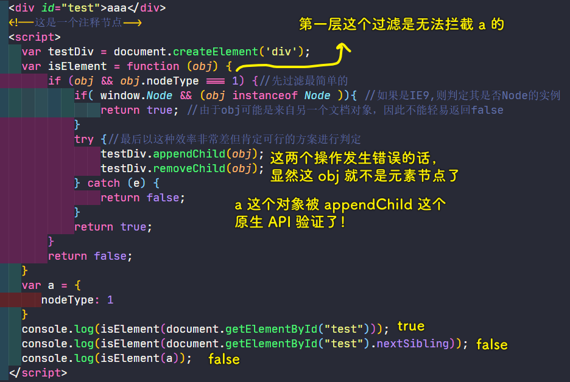
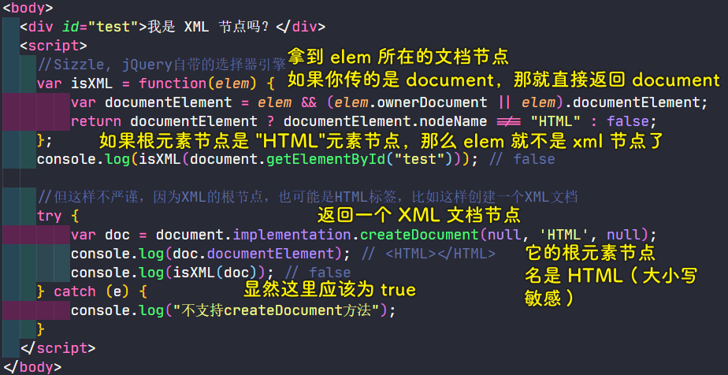
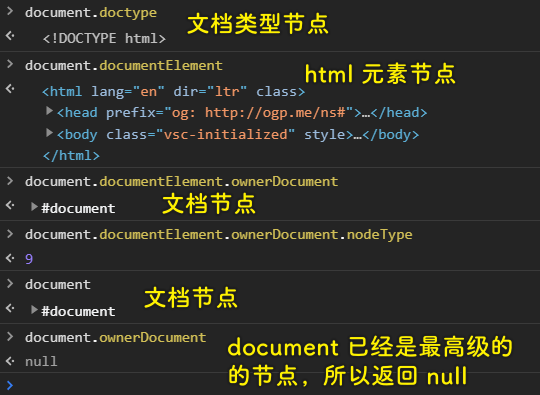
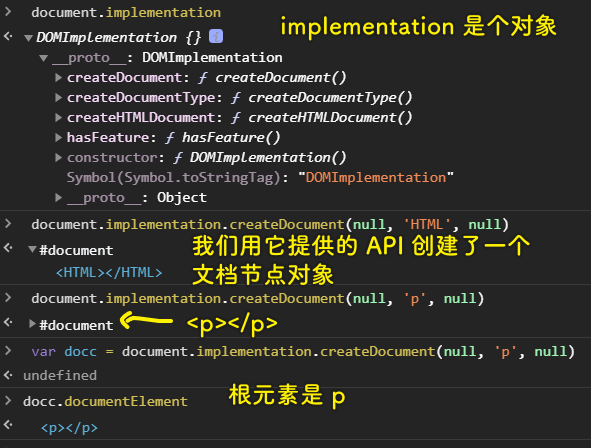

### ✍️ Tangxt ⏳ 2020-11-21 🏷️ DOM

# 第四章 如何判断元素节点类型

> 感觉这一章的标题怪怪的……比如，这是说元素节点还会细分为 `a` 元素节点、 `h1` 元素节点这样吗？……元素节点不是有类型了吗？为啥还要判断？照理说，应该叫「如何判断这个节点是否为元素节点类型？」，但这似乎和第二章重合了？或者说这是第二章的补充内容……

## ★为什么要判断元素节点的类型

1）概述

之前我们已经了解了节点的类型，而且我们强调必须掌握以下七个节点的类型：



在这七个节点里边，我们的「元素节点」是最常用的，而**元素节点也分成很多种**，有关这个元素节点类型的判定是我们这节课的**重点**

话又说回来，我们为啥要判断元素节点的类型呢？

这是因为**我们对属性的一系列操作是与元素节点类型息息相关的**！如果我们不区分它们，我们就不知道应该使用**元素的直接属性操作**，形如 `el.xxx = yyy` 这种形式，还是使用 `el.setAttribute(xxx,yyy)` 这种调用一个方法的姿势来设置 `xxx` 的值

当然，除了这个属性操作以外，我们还有很多地方会用到元素节点类型的判定，接下来就学习一下元素节点类型的判定方法！

2）元素节点类型判断的四种姿势

涉及元素节点类型的判定，老师给出了四个方法：



1. `isElement`：用来判定某个节点是否是元素节点
2. `isHTML`：用来判定它是否为 HTML 文档的元素节点
3. `isXML`：用来判定它是否为 XML 文档的元素节点
4. `contains`：用来判定两个节点的包含关系

这几个方法都是非常基础的方法 -> **必须掌握**

接下来就来一一研究一下这些方法是如何实现的……

## ★如何判断节点是元素节点

1）不完美的 isElement



关于 `a` 这个普通对象，并不是一个普通元素节点，但其验证结果却是 `true` ，显然我们的 `isElement` 是有 bug 的，不过一般来说，没有那么无聊的人会写 `a` 这样的代码去验证我们的 `isElement` 函数，但是我们在写代码的时候有时会免不了出现这样的语法哈！

当然，如果你想追求完美一点的 `isElement` ，还是有办法的！

2）完美一点的 isElement



3）其它方案

更多关于元素节点的判定，请参考：[How do you check if a JavaScript Object is a DOM Object? - Stack Overflow](https://stackoverflow.com/questions/384286/how-do-you-check-if-a-javascript-object-is-a-dom-object/27112297#27112297)

## ★如何判断节点是 html 和 xml 元素节点

1）概述

我们简单的可以将所有的元素节点化为两类：一类是 HTML，一类是 XML。

不过从严格意义上来说，HTML 只是 XML 的一个子集，它拥有更多的特性，而 XML 在矢量绘图的处理上又派生出了两大类：一个是 SVG，一个是 VML。那么按照这样的说法，**我们可以简单的认为如果不是 HTML，那么它就是 XML 的元素节点了**。而 HTML 是比较容易识别的，因为它有更多的特性。比如说，XML 是没有 `className` 的，或者我们通过一个元素 的 `ownerDocument` 得到它的文档对象，XML 它是没有 `document.getElementById()` 和 `document.getElementsByTagName()` 这些方法的。此外，最大的区别是 HTML 元素的 `nodeName` 总是**大写的**，在你使用 `createElement()` 方法创建 HTML 元素的时候，**无论你传入的字母是大写还是小写，最后得到的都是大写**。

接下来就来看看各大类库是怎么实现在 HTML 和 XML 文档中的元素节点的判定的。

2）Sizzle 里边的 isXML 方法实现

> Sizzle 是 jQuery 这个项目自己派生的 CSS 选择器引擎，后来逐渐独立出来，成为一个独立的模块，可以自由地引入到其它类库中。如果你想阅读 Sizzle 的源码，请看 jQuery1.7，从中你可以获得「框架设计的思路」以及「编程技巧」……



💡： `ownerDocument` 这个 API？



💡： `implementation` 这个 API？



3）mootools 的 slick 选择器引擎里边的 isXML 方法实现

``` js
//我们看看 mootools 的 slick 选择器引擎的源码：
var isXML = function(document) {
  return (!!document.xmlVersion) || (!!document.xml) || (toString.call(document) == '[object XMLDocument]') ||
    (document.nodeType == 9 && document.documentElement.nodeName != 'HTML');
};
```

该 `isXML` 方法的实现，使用了四个并列的判断：

1. `document`存在`xmlVersion`这个属性吗？
2. `document`存在`xml`这个属性吗？
3. `document`的`toString`一下的返回结果是不是`'[object XMLDocument]'`
4. `document`是文档节点吗？还有`document`这个文档的根元素的名字是不是不等于`'HTML'`？

经过以上这么几轮判断以后，我们基本上就可以锁定传入的节点到底是不是 XML 文档旗下的元素节点了！

`mootools` 用到了大量的属性进行判定，从 `mootools 1.2` 到现在还没有改动过，说明这个 `isXML` 函数是很可靠的！

我们再精简一下这个 `isXML` 函数：

``` js
//精简版
var isXML = window.HTMLDocument ? function(doc) {
  return !(doc instanceof HTMLDocument);
} : function(doc) {
  return "selectNodes" in doc;
}
```
