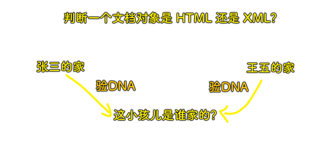
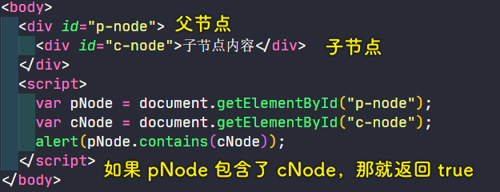

### ✍️ Tangxt ⏳ 2020-11-21 🏷️ DOM

# 第四章 如何判断元素节点类型

> 感觉这一章的标题怪怪的……比如，这是说元素节点还会细分为 `a` 元素节点、 `h1` 元素节点这样吗？……元素节点不是有类型了吗？为啥还要判断？照理说，应该叫「如何判断这个节点是否为元素节点类型？」，但这似乎和第二章重合了？或者说这是第二章的补充内容……

## ★为什么要判断元素节点的类型

### <mark>1）概述</mark>

之前我们已经了解了节点的类型，而且我们强调必须掌握以下七个节点的类型：


在这七个节点里边，我们的「元素节点」是最常用的，而**元素节点也分成很多种**，有关这个元素节点类型的判定是我们这节课的**重点**

话又说回来，我们为啥要判断元素节点的类型呢？

这是因为**我们对属性的一系列操作是与元素节点类型息息相关的**！如果我们不区分它们，我们就不知道应该使用**元素的直接属性操作**，形如 `el.xxx = yyy` 这种形式，还是使用 `el.setAttribute(xxx,yyy)` 这种调用一个方法的姿势来设置 `xxx` 的值

当然，除了这个属性操作以外，我们还有很多地方会用到元素节点类型的判定，接下来就学习一下元素节点类型的判定方法！

### <mark>2）元素节点类型判断的四种姿势</mark>

涉及元素节点类型的判定，老师给出了四个方法：


1. `isElement`：用来判定某个节点是否是元素节点
2. `isHTML`：用来判定它是否为 HTML 文档的元素节点
3. `isXML`：用来判定它是否为 XML 文档的元素节点
4. `contains`：用来判定两个节点的包含关系

这几个方法都是非常基础的方法 -> **必须掌握**

接下来就来一一研究一下这些方法是如何实现的……

## ★如何判断节点是元素节点

### <mark>1）不完美的 isElement</mark>


关于 `a` 这个普通对象，并不是一个普通元素节点，但其验证结果却是 `true` ，显然我们的 `isElement` 是有 bug 的，不过一般来说，没有那么无聊的人会写 `a` 这样的代码去验证我们的 `isElement` 函数，但是我们在写代码的时候有时会免不了出现这样的语法哈！

当然，如果你想追求完美一点的 `isElement` ，还是有办法的！

### <mark>2）完美一点的 isElement</mark>


### <mark>3）其它方案</mark>

更多关于元素节点的判定，请参考：[How do you check if a JavaScript Object is a DOM Object? - Stack Overflow](https://stackoverflow.com/questions/384286/how-do-you-check-if-a-javascript-object-is-a-dom-object/27112297#27112297)

## ★如何判断节点是 html 和 xml 元素节点

### <mark>1）概述</mark>

我们简单的可以将所有的元素节点化为两类：一类是 HTML，一类是 XML。

不过从严格意义上来说，HTML 只是 XML 的一个子集，它拥有更多的特性，而 XML 在矢量绘图的处理上又派生出了两大类：一个是 SVG，一个是 VML。那么按照这样的说法，**我们可以简单的认为如果不是 HTML，那么它就是 XML 的元素节点了**。而 HTML 是比较容易识别的，因为它有更多的特性。比如说，XML 是没有 `className` 的，或者我们通过一个元素 的 `ownerDocument` 得到它的文档对象，XML 它是没有 `document.getElementById()` 和 `document.getElementsByTagName()` 这些方法的。此外，最大的区别是 HTML 元素的 `nodeName` 总是**大写的**，在你使用 `createElement()` 方法创建 HTML 元素的时候，**无论你传入的字母是大写还是小写，最后得到的都是大写**。

接下来就来看看各大类库是怎么实现在 HTML 和 XML 文档中的元素节点的判定的。

### <mark>2）Sizzle 里边的 isXML 方法实现</mark>

> Sizzle 是 jQuery 这个项目自己派生的 CSS 选择器引擎，后来逐渐独立出来，成为一个独立的模块，可以自由地引入到其它类库中。如果你想阅读 Sizzle 的源码，请看 jQuery1.7，从中你可以获得「框架设计的思路」以及「编程技巧」……


💡： `ownerDocument` 这个 API？


💡： `implementation` 这个 API？


### <mark>3）mootools 的 slick 选择器引擎里边的 isXML 方法实现</mark>

``` js
//我们看看 mootools 的 slick 选择器引擎的源码：
var isXML = function(document) {
  return (!!document.xmlVersion) || (!!document.xml) || (toString.call(document) == '[object XMLDocument]') ||
    (document.nodeType == 9 && document.documentElement.nodeName != 'HTML');
};
```

该 `isXML` 方法的实现，使用了四个并列的判断：

1. `document`存在`xmlVersion`这个属性吗？
2. `document`存在`xml`这个属性吗？
3. `document`的`toString`一下的返回结果是不是`'[object XMLDocument]'`
4. `document`是文档节点吗？还有`document`这个文档的根元素的名字是不是不等于`'HTML'`？

经过以上这么几轮判断以后，我们基本上就可以锁定传入的节点到底是不是 XML 文档旗下的元素节点了！

`mootools` 用到了大量的属性进行判定，从 `mootools 1.2` 到现在还没有改动过，说明这个 `isXML` 函数是很可靠的！

我们再精简一下这个 `isXML` 函数：

``` js
//精简版
var isXML = window.HTMLDocument ? function(doc) {
  return !(doc instanceof HTMLDocument);
} : function(doc) {
  return "selectNodes" in doc;
}
```

在标准浏览器中， `window` 旗下是否暴露了一个创建 HTML 文档的构造器—— `HTMLDocument` ？而在 IE 下的 XML 元素是拥有 `selectNodes` 这个属性的，所以进而就得到了 `isXML` 这个精简版函数！

不过这些方法都只是规范，JS 对象是可以随意添加属性的，**属性法是很容易被攻破的**，所以最好是使用**功能法**！

### <mark>4）功能法实现 isXML</mark>

``` js
var isXML = function(doc) {
  return doc.createElement("p").nodeName !== doc.createElement("P").nodeName;
}
```



> 功能法：借他人之手实现目的……借 `xxx` API，实现 `yyy` API

我们知道无论是 HTML 文档，还是 XML 文档，都支持 `createElement` 这个方法，我们判定创建元素的 `nodeName` **是区分大小写的还是不区分大小写的**，我们就能够知道这个传入的 `doc` 是 XML 文档旗下的节点，还是 HTML 文档旗下的节点了……

这个 `isXML` 函数是我们目前能给出的最严谨的函数了，你可以写个用例测试一下，看看这个 `isXML` 是否有 bug

同理，我们可以改 `isXML` 为 `isHTML` ，就能判定这个节点是不是 HTML 文档旗下的节点了：

``` js
var isHTML = function(doc) {
  // 该不等于为等于即可
  return doc.createElement("p").nodeName === doc.createElement("P").nodeName;
}
```

有了上边的基础认识，我们就可以编写了一个 `isHTMLElement` 方法了

### <mark>5）isHTMLElement 实现</mark>

``` js
// 传入一个 el 节点对象，判断这个 el 是 HTML 元素还是 XML 元素
var isHTMLELement = function(el) {
  // 是元素节点吗？还是其它非元素节点？又或者这是一个冒充元素节点的对象？
  if (isElement(el)) {
    // 拿到这个元素的文档节点对象
    // 判断这个文档对象是 XML 的还是 HTML 的，从而实现我们元素节点类型判断的目的
    return isXML(el.ownerDocument);
  }
  return false
};
```

> 这个 `isHTMLELement` 函数的实现旅程：假设这是在 HTML 文档下的节点？-> 假设这可能不是在 HTML 文档下的元素节点？也许是在 XML 文档下？……从有限制的条件，到无限制的条件……

测试用例：

``` js
console.log(isHTMLELement(document)) // false，这是文档节点对象呀！可不是元素节点对象
```

## ★如何判断节点的包含关系 contains

### <mark>1）概述</mark>

DOM 可以将任何 HTML 描绘成一个由多层节点构成的结构。节点分为 12 种不同类型，每种类型分别表示文档中不同的信息及标记。每个节点都拥有各自的特点、数据和方法，也与其他节点存在某种关系。节点之间的关系构成了层次，而所有页面标记则表现为一个以特定节点为根节点的树形结构。节点中的各种关系可以用传统的家族关系来描述，相当于把文档树比喻成家谱。

节点与节点之间的关系：


元素与元素之间的关系：


### <mark>2）如何判断两个节点的关系</mark>

研究一下「**如何判断两个节点的关系**」，顺便说一句，这个节点关系不单单指元素节点之间的关系，比如我们的 `document` 文档节点也在我们的考虑范围之内

在最新的浏览器中，所有的节点都已经装备了 `contains` 方法（低版本浏览器也兼容这个方法，如 IE6/7），我们使用 `contains` 方法其实就能搞定一切

实验如下：



但是， `contains` 这个方法的兼容是有条件的，我们要判断两个节点之间关系的这两个节点必须是「**元素节点**」，如果换作是其它类型的节点可能就不兼容，也就是说，IE6/7 不干了……

如你这样：

``` js
alert(document.contains(cNode));
```

在最新的浏览器中，这是返回 `true` 的，而在低版本浏览器则是报错说「 `document` 这个对象不支持此属性或方法」，总之，在低版本浏览器中，如 IE6/7， `document` 是不包含 `contains` 这个方法的

话说，这仅仅只是 `document` 节点有问题吗？还是说其它非元素节点也有这样的问题？

测试：

``` js
var pNode = document.getElementById("p-node");
var cNode = document.getElementById("c-node").childNodes[0];
alert(pNode.contains(cNode));
```

我们把 `contains` 的参数改为了 `文本节点` ，在现代浏览器中，这是 `true` ，说明**文本节点也是可以用 `contains` 方法来进行节点层次关系的判断**，但在 IE6/7 中则是报错说「不支持此接口」，而这就说明采参数作为文本节点还是有问题的！

### <mark>3）编写一个低版本浏览器也兼容的 contains</mark>

该方法对于所有的节点类型，以及所有的浏览器都是兼容的

``` js
// a 是上层节点，b 则是下层节点
function fixContains(a, b) {
  try {
    // 循环 + parentNode 实现节点之间关系的判断
    // IE6/8 -> 游离在 DOM 树外边的文本节点，如果访问 parentNode 就会报错
    // 因此我们就使用了 try...catch 语句
    while ((b = b.parentNode)) {
      if (b === a) {
        return true;
      }
    }
    return false;
  } catch (e) {
    // 游离于 DOM 树外的文本节点，直接返回 false
    // 因为脱离了节点层次关系的判断范围
    return false;
  }
}
```

测试用例：

``` js
var pNode = document.getElementById("p-node");
var cNode = document.getElementById("c-node").childNodes[0];
alert(fixContains(pNode, cNode)); // true ，E6/7 也为 true
alert(fixContains(document, cNode)); // true ， IE6/7 也为 true
```

---

如果你使用的是现代浏览器，那么我们就可以毫无顾忌地直接使用我们浏览器给我们自带的`contains`方法，当然，这得看我们的业务要求！

## ★了解更多

➹：[Sizzle 选择器引擎介绍](http://zhenhua-lee.github.io/framework/sizzle.html)

➹：[jQuery - Wikipedia](https://en.wikipedia.org/wiki/JQuery)

➹：[jQuery Custom filter. jQuery 自定篩選器 / Sizzle 選擇器引擎](https://medium.com/susan-blog/jquery-custom-filter-db07a425bb95)

➹：[深入理解 DOM 节点关系 - 小火柴的蓝色理想 - 博客园](https://www.cnblogs.com/xiaohuochai/p/5785297.html)

➹：[DOM 小测 28 期 – DOM 节点文档前后位置判断 «  张鑫旭-鑫空间-鑫生活](https://www.zhangxinxu.com/wordpress/2019/03/dom-contains-comparedocumentposition/)

➹：[DOM 结构 —— 两个节点之间可能存在哪些关系以及如何在节点之间任意移动 - 简书](https://www.jianshu.com/p/e45821392c8c)

➹：[DOM 节点以及节点之间的关系_@宝藏男孩-CSDN 博客](https://blog.csdn.net/qq_44624386/article/details/104876912)

➹：[【总结】浅谈 JavaScript 中的接口 - 悠扬的牧笛 - 博客园](https://www.cnblogs.com/xhb-bky-blog/p/5887242.html)