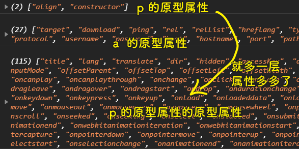
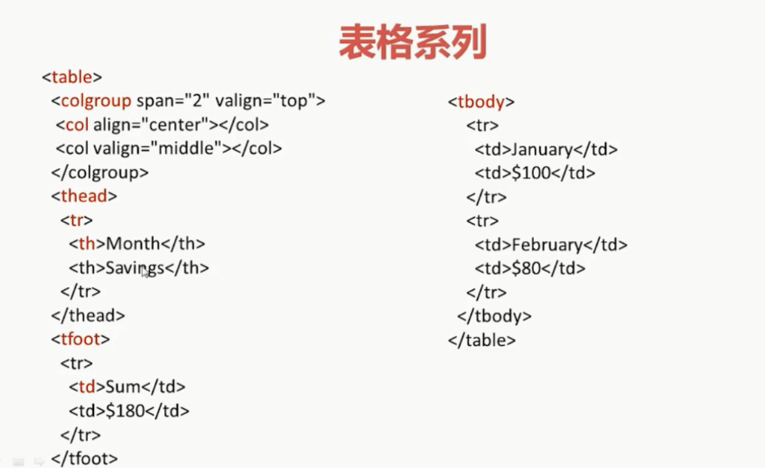

### ✍️ Tangxt ⏳ 2020-11-24 🏷️ DOM

# 第五章 继承层次与嵌套规则

## ★DOM 节点继承层次

1）概述

DOM 节点是一个非常复杂的东西，对它的每一个属性的访问，不走运的话，就可能会向上溯寻到 N 多个原型链，**因此 DOM 操作是个非常耗性能的操作**。而风头正盛的 React 为了解决这个问题，它提出了虚拟 DOM 的概念，**合并和屏蔽了很多无效的 DOM 操作**，效果非常惊人。接下来我们就来看看 DOM 节点究竟是如何继承的。

2）DOM 节点继承层次

一个元素节点的继承旅程：


一个文本节点的继承旅程：


---

可以看到所有节点的继承层次都不简单，但相比较而言，元素节点是更可怕的！

从 HTML1 -> HTML3.2 -> HTML4.1 -> HTML5，除了不断地增加新类型和新的嵌套规则以外，每个元素也不断地添加新属性

如这个例子：

``` js
console.log(Object.getOwnPropertyNames(document.createElement("p").__proto__));
console.log(Object.getOwnPropertyNames(document.createElement("a").__proto__));
console.log(Object.getOwnPropertyNames(document.createElement("p").__proto__.__proto__));
```

> 这些属性都是原始属性，不包含用户自定义的属性！



> 如果你在 IE 下查看这个结果，属性的个数更加惊人……

可以看到，每往上一层，原型链就会为这个元素节点添加一些属性

💡： `Object.getOwnPropertyNames()` ？

返回一个数组，里边的元素是所传参数对象的所有属性（包括不可枚举的属性，当然，使用 `Symbol` 定义的属性除外） -> 这是自有属性，不包括公有属性！

3）空的 div 元素自有属性

一个没有插入到 DOM 树的而且没有任何子节点的`div`元素节点，你猜猜它有多少属性？


你可以在控制台`dir(document.createElement("div"))`一下，就能看到`div`元素节点它旗下有多少个自有属性了！

在新的 HTML 规范中，许多元素的固有属性，比如`value`都放到原型链上了，而这数量就显得更为庞大了。因此，未来的发展方向是尽量使用现成的框架来实现业务，比如 MVVM 框架，**将所有的 DOM 操作都转交给框架内部做精细有效的处理**，这些实现方案当然就包括了虚拟 DOM 的技术了。

但是在使用 MVVM 框架之前，我们还是要**认真学好底层的知识，明白为什么要这样做，为什么不这样做的目的**。这就是老师要大家**理解 DOM 节点继承层次的目的**。

> 我们在进行 DOM 操作的时候，经常会直接`xxx.`某个属性，如果这个属性在继承层次比较深的地方，那么这显然会影响性能！

## ★HTML 嵌套规则

1）是什么？


HTML 存在许多种类型的标签，**有的标签下面只允许特定的标签存在，而这就叫 HTML 嵌套规则**。

话说，我们为什么要遵守 HTML 嵌套规则呢？

因为如果不按着 HTML 嵌套规则写，浏览器就不能够正确解析，会将不符合嵌套规则的节点放到目标操作节点的下边，或者变成个纯文本。

**了解 HTML 嵌套规则是进行 DOM 操纵的基础**

不过，在了解 HTML 嵌套规则之前，我们首先得掌握两个概念：块级元素与内联元素

2）块状元素与内联元素

概念：


例子：


3）块状元素与内联元素嵌套规则

规则一：


规则二：


规则三：


规则四：


`li`和`div`这俩标签都是装载内容的容器，地位是平等的，没有级别之分，不想我们`h1~h6`这样森严的等级制度，实际上`li`标签连它的父级`ul/ol`都能容纳，那`li`容纳`div`也是没有问题的！

规则五：


4）某些特殊元素嵌套规则

1、有序列表与无序列表


`ol/ul`与`li`之间，应该只允许注释节点或者`script/style`标签

2、定义列表系列


- `dl`用于定义列表
- `dt`用于生成定义列表中各个列表下的标题，重复使用可以定义多个列表下的标题
- `dd`用于生成定义列表各个列表下边的说明文字段，重复使用可以定义多个说明文字段

`dd`对应`dt`的显要说明或者解释

> 显要，即重要之意

3、下拉列表系列


`mutiple`为`true`即可为多选，`optgroup`用于组合选项，当你**使用一个非常长的选项列表的时候**，我们就可以对相关的选项进行组合了，这样处理起来就更加容易了

`option`里边不能放置其它的任何的元素节点，我们只能使用文本，**这就是为什么我们要花大量的时间做各种自定义下拉框的原因**

4、热点链接系列

怎么在一个图片中做多个链接呢？


热点链接可以帮你解决。这种效果的实质是**把一幅图片划分为不同的热点区域，再让不同的区域进行超链接**


这个系列涉及到的标签有`img`、`map`、`area`，这三标签用来做热点链接，允许我们在同一个图片上点击不同的区域，这些区域可以是不连接的、不规则的、圆形、五角形等其它图形，我们打开不同的链接，可以链接到不同的地址！

这个的东西常用于「地图」这个业务场景！

5、多媒体对象系列


`object`这个元素用于向页面添加多媒体对象，包括flash、音频、视频等，它规定了对象的数据和参数，以及可以用来显示和操作数据的代码

`object`的开标签和闭标签之间的文本是替换文本，如果用户浏览器不支持这个`object`标签就显示这个文本！

`object`元素一般指不会包含`param`这个子标签，`param`用来定义我们定义的一些播放参数

`object`与`embed`的区别：两个都是用来播放多媒体文件对象的，`object`用于IE浏览器，而`embed`则用于非IE浏览器，当我们使用这两个元素的时候，我们应该把`embed`放在`object`的内部，这样的话，如果浏览器支持`embed`就会先读取`embed`的代码，如果不支持就会读取`param`这个参数设置！

以上就是多媒体对象系列里边的一些标签元素的嵌套规则……

6、表格系列



这是一个比较庞大的家族，20年前，我们大量使用 table 来做布局，就目前而言，它衍生了这么多的标签类型……

`table`下包含：`thead` -> `tfoot` -> `tbody`，里边还可以包含`tr`、`th`、`td`，甚至我们还可以定义`colgroup`和`col`

简单来说，如果`table`之下只包含`tr`元素，那么浏览器会帮助你在上边插入`tbody`这个元素，`tbody`元素可以让你这个庞大的 table 渲染速度提升。

`table`旗下由外到内现在变成了四层：

- `table`
- `thead`
- `tbody`
- `tfoot`

`thead`、`tbody`、`tfoot`这三者的顺序可以随意设置

`tr`里边包含`th`或者是`td`

`col`和`colgroup`是可以直接放在`table`这个元素下边的，`col`用于定义每一列的外观，如果你只写了`col`这个元素，那么浏览器会帮助你插入`colgroup`这个元素

以上就是表格系列里边的一些元素的嵌套规则了！

## ★课程总结


