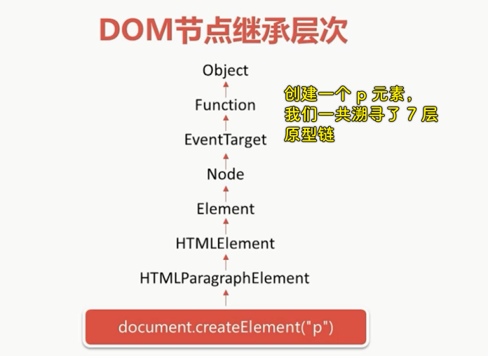

### ✍️ Tangxt ⏳ 2020-11-24 🏷️ DOM

# 第五章 继承层次与嵌套规则

## ★DOM 节点继承层次

1）概述

DOM 节点是一个非常复杂的东西，对它的每一个属性的访问，不走运的话，就可能会向上溯寻到 N 多个原型链，**因此 DOM 操作是个非常耗性能的操作**。而风头正盛的 React 为了解决这个问题，它提出了虚拟 DOM 的概念，**合并和屏蔽了很多无效的 DOM 操作**，效果非常惊人。接下来我们就来看看 DOM 节点究竟是如何继承的。

2）DOM 节点继承层次

一个元素节点的继承旅程：



一个文本节点的继承旅程：


---

可以看到所有节点的继承层次都不简单，但相比较而言，元素节点是更可怕的！

从 HTML1 -> HTML3.2 -> HTML4.1 -> HTML5，除了不断地增加新类型和新的嵌套规则以外，每个元素也不断地添加新属性

如这个例子：

``` js
console.log(Object.getOwnPropertyNames(document.createElement("p").__proto__));
console.log(Object.getOwnPropertyNames(document.createElement("a").__proto__));
console.log(Object.getOwnPropertyNames(document.createElement("p").__proto__.__proto__));
```

> 这些属性都是原始属性，不包含用户自定义的属性！


> 如果你在 IE 下查看这个结果，属性的个数更加惊人……

可以看到，每往上一层，原型链就会为这个元素节点添加一些属性

💡： `Object.getOwnPropertyNames()` ？

返回一个数组，里边的元素是所传参数对象的所有属性（包括不可枚举的属性，当然，使用 `Symbol` 定义的属性除外） -> 这是自有属性，不包括公有属性！

3）空的 div 元素自有属性

一个没有插入到 DOM 树的而且没有任何子节点的`div`元素节点，你猜猜它有多少属性？


你可以在控制台`dir(document.createElement("div"))`一下，就能看到`div`元素节点它旗下有多少个自有属性了！

在新的 HTML 规范中，许多元素的固有属性，比如`value`都放到原型链上了，而这数量就显得更为庞大了。因此，未来的发展方向是尽量使用现成的框架来实现业务，比如 MVVM 框架，**将所有的 DOM 操作都转交给框架内部做精细有效的处理**，这些实现方案当然就包括了虚拟 DOM 的技术了。

但是在使用 MVVM 框架之前，我们还是要**认真学好底层的知识，明白为什么要这样做，为什么不这样做的目的**。这就是老师要大家**理解 DOM 节点继承层次的目的**。

> 我们在进行 DOM 操作的时候，经常会直接`xxx.`某个属性，如果这个属性在继承层次比较深的地方，那么这显然会影响性能！

## ★HTML 嵌套规则
