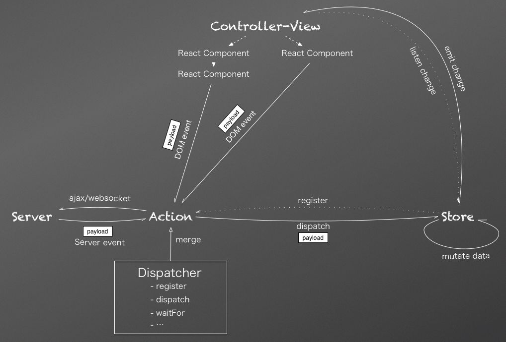

### ✍️ Tangxt ⏳ 2021-02-20 🏷️ 预备课

# 01-预备课-课前准备

## ★第一段

什么东西再怎么封装，最后都是 JS -> 不会变的思想！

所以请抓住最核心的东西去学，而不是天天学什么库、框架之类的……

如果你吃透了 JS，那不管以后出了啥新东西，你都能很快的上手和理解了……

当然，除非 JS 被浏览器放弃了，不过，JS 是大众脸，即便它被放弃了，学习其它语言也是类似的！

💡：`flux`（数据管理）有必要学吗？

建议了解一下它的思想（比如单向数据流）……因为后续的框架都用到了它的思想！而这对理解框架的逻辑有很好大的好处！



➹：[如何理解 Facebook 的 flux 应用架构？ - 知乎](https://www.zhihu.com/question/33864532)

💡：TS？

blue 写 TS 比 JS 还顺手……毕竟精通 C/C++、Java、Python、前端开发等多种开发技术

一般做大型项目，用 JS 的话，就要凉凉……因为它不带类型啊！

总之，TS 就是长得像 Java 的 JS！如带类型，带接口等各种东西！它增强了 JS，毕竟 JS 在语法层面上很烂的语言！

💡：这个课程的目的？

- 理论上，学完这个课，可以实现一个框架（看工作量情况）
- 把工作的实际问题带到课堂上提问 -> 不然，只听老师要讲的内容，是很难和实际情况产生联系的！

## ★第二段

原生 JS 的力量的意思说，有了原生 JS 这个力量，当你使用 React 、Vue 等这些工具的时候，耍起来就得心应手了！

💡：Vue 和 React？

内核原理几乎一样，只是表现不一样罢了！

### <mark>1）面向对象</mark>

关注层面：

1. 思想 -> 如：我怎样去看待一个类？我怎样去看待一个对象？
2. 写法

思想是排第一的，而写法啥的，也重要，但重要程度排第二！

我们用 Angular、React 会用到 class，而用 jQuery，很多时候都是用函数

可为什么要用 class 呢？而不是函数呢？

显然，class 在某些方面肯定有它的优势之处！

#### <mark>1、面向对象基础</mark>

💡：面向对象是防着自己人写烂代码？

同事写代码有时会偷懒，如变量名随便起、不准守规范等，这样代码就容易出 bug 了

而你用了面向对象，意味着如果你不这样做就会报错！

这就是为什么需要封装的原因……即不想同事动你的代码！

总之，就是防着自己人故意去捣乱呗！

💡：在 JS 里边，多态是一种思想，可不是语法层面上的东西

💡：什么叫可响应对象？

`this.a=12` -> 页面就会更新 UI

总之，就是对对象做了什么，它就会有反应呗！

### <mark>2）事件与队列</mark>

队列就是事件队列的简称！

例子：

淘宝登录前和登录后效果，登录前没有用户名等，登录后就有了

为什么登录后就有了呢？ -> 解耦，事件队列有回调，让回调去处理响应回来的请求结果！

### <mark>3）DOM 与 虚拟 DOM</mark>

没有 DOM，JS 就无法操作页面上的元素了，即 JS 废了……

DOM -> 麻烦（需要频繁地获取元素）、太慢（比平常弄个数组之类的操作，要慢个 1000~4000 倍）

现在的页面，元素太多，频繁地操作真实的 DOM，会导致页面卡卡的……（页面停滞，几秒钟才出效果）

> 节点筛选非常好性能

如果要优化页面性能，那就得用虚拟 DOM，它可以**尽可能减少对 DOM 的操作**，毕竟修改一个东西，比重新造一个东西的性能要高多了！

简单理解虚拟 DOM，就是真实 DOM 的一份拷贝，相当于是真实 DOM 的映射啊！

问题：如何确定哪些节点要动，哪些节点不要动？

### <mark>4）数据交互</mark>

Ajax、Fetch、Axios（在通信相关方面的库里边，它是最常用，最好用的）

能发什么数据？不能发什么数据？怎么发数据？数据来了用什么姿势去处理？

使用者需要个性化的数据，比如大部分使用者拿的是 JSON 数据，而这个使用者偏要拿 XML 数据

问题：如何定制（安全问题，需要自定义头之类的）？总不能这个通信库只能收 JSON 数据吧！

> 了解 Axios 里边的拦截器原理，为啥这个库就能拦截数据呢？这也太牛逼了吧！

### <mark>5）图形、动画</mark>

- canvas：性能好
- SVG：图表、地图

webgl 很吃电脑 GPU -> 工作中很少用

动画：CSS3、JS 动画

- 动画搞到最后就是一堆数字，这个数字显示哪个帧

---

听课，只能明白这东西，不能说是会这东西。那什么才是会呢？就是能把所学的做出一个东西来！

- 实战一：数据交互封装 -> Axios
- 实战二：MVVM 框架 -> 能从 0 手写这个，可以说在中国前端，千分之一

学这个课的目的：

1. 提高自己身价，加工资
2. 把在课程所学到的东西，用在工作上
3. 前端代码的健壮性 -> 写框架，把用户的负担（可能会乱传东西）加到自己这个作者身上
4. 理解框架 -> 用几年这个框架也不一定能理解这个框架，你要自己把这个框架拆了，去理解它才行，而不是只用就完事儿了！

如何写一个 MVVM 框架？

在写这个框架的过程中，会碰到哪些问题？如何解决它？需要用到哪些技术？

从后往前看，从结果推自己要学什么……而不是先学一堆不知道与目标是否相关的东西再去想我要去实现这个 MVVM 框架！

> 独立从 0 写一个简易的 MVVM 框架（实现核心功能的），要 20 k 不过分？

讲课技巧：抓大放小、画大饼充饥（如实现一个 MVVM 就能拿 30K），让学员有干劲！、从终点推自己要学的，从做一个 MVVM 框架，推出自己要学什么，才能实现它！

## ★第三段

我们打算写一个 MVVM，那么例子就是 Vue 了！

我们怎么用 Vue 的，那么我们就能推出我们要学什么，如我们：

- `new Vue()`、`Vue.set`显然就需要用到面向对象的知识！
- `Vue.component('xxx',{})` -> 用到继承
- 组件 -> HOC
- `this.a = 12`，UI改变 -> 响应式 对象
- DOM、虚拟DOM
  - ref -> 简化获取DOM元素
- 事件

---

要做的：

```
1.面向对象、继承、HOC
  响应式
  多态


2.DOM、虚拟DOM
  真实DOM->虚拟DOM
  差异 -> 复用DOM -> 减少真实DOM操作

  创建

  简化——ref

3.事件、事件队列

4.指令
  管理、关联

5.动画
  动画、动画组件

6.核心
  data()
  el：

7.watch
  监听数据——响应式
  队列

8.computed
  数据

9.Vuex
  全局？
  getters
  修改数据

10.还有生命周期函数

11.Router
  动态组件
  匹配——正则
  三种路由原理
```


