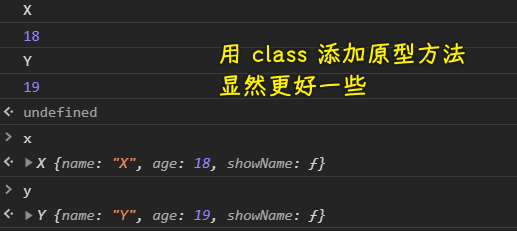
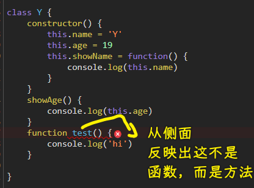
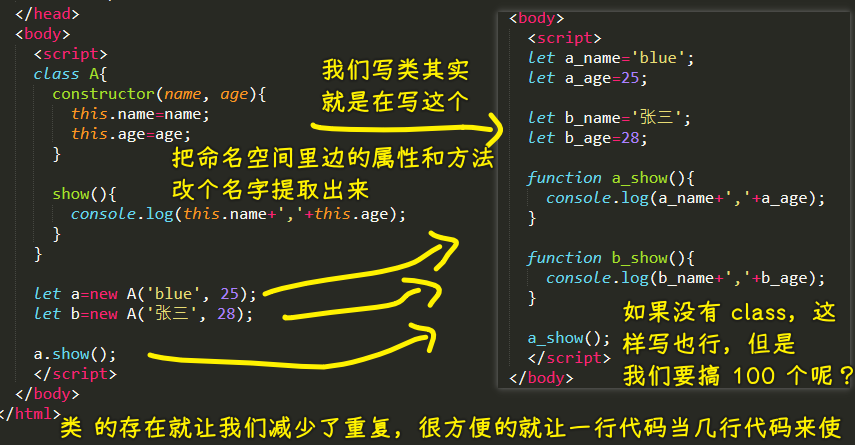

### ✍️ Tangxt ⏳ 2021-02-21 🏷️ 面向对象

# 02-面向对象基础-1

目标：

1. 我们写对象到底是在写什么？它里边都有什么？
2. 如何设计？

### <mark>1）设计模式是什么？</mark>

就是经验，就像是盖房子那种经验——搞地基、搭竹架子、铺绿网……

你要相信你在程序里边遇到的问题，几乎百分百的肯定在世界你不是第一个遇到的！ -> 那么多前辈已经踩过的坑

你不需要自己去填坑，直接用前辈提供的姿势：

1. 第一步：x
2. 第二步：xx
3. 第三步：xxx
4. ……

就完事儿了，为什么还要自己去想解决方案呢？

同理，数据结构与算法也是如此……

总之，碰到某种问题，你就用某种经验就完事儿了，而这种经验就是设计模式！

> 前人经验 = 设计模式（这个名字很高端，设计还模式的调调）

注意：

某一类模式，都对应着某一类特别实际的问题，几乎很难看到一个设计模式在程序的世界里找不到任何用途，如果找不到，那它就废了……

如何讲设计模式？ -> 很难讲清楚，得在某种场景下解决实际问题这样用起来讲！ 

### <mark>2）对象</mark>

💡：为啥要用对象、类？

很多框架都会用类，可这到底是为什么呢？

💡：对象是什么？

简单理解：对象 = 数据 + 操作

有些人把「数据」叫成是：变量（官方叫法）、状态、属性

还有「操作」是：过程（官方叫法）、方法、函数

老师习惯叫「属性和方法」

叫法很多，但你不需要强制人家一定要叫这个，只要你们俩在谈到这个的时候，知道它是什么就行了！如你说状态，他说数据，但你们都知道互相在说一个什么样的东西……

在看待一个类/对象的时候，不管它有多么的复杂，你都把它理解成是由「数据+操作」这么两个东西组成的！

💡：类是什么？

- 类（class）：蓝图、设计图 -> 告诉你这个类有什么
  - 实例化：new -> 让类有作用
- 实例（instance）：由类创建的（new），有功能的
- 成员（member，实例成员和类成员的统称）：里边包括的东西（属性+方法） -> 如一个班的成员有老师和同学……
- 实例成员——**实例上面有的成员** -> 这是成员细分的东西，如`str.length、this.$set`，`length`就是实例的成员，而`Array.push()`这样不能用的，显然`push`就不是`Array`的成员了！
- 类成员——类上面有的成员（**无需实例化，直接使用**） -> `Math.PI、Vue.set`，而且我们也不会`new Math`这样用它！ -> 在 Java 里边它叫静态方法、静态属性等……叫法会因为语言不同而有所区别

> 国外的文档都把成员叫做是「member」，如果你遇到「menber」这个单词，那你就应该明白它代表着什么……

💡：什么是抽象？

当你去设计一个类，设计一个程序的时候，往往要经过一个抽象的过程

如设计数据库（设计什么的思路都是一致的），设计一个表：

那我到底需要这个人他的哪些信息进来呢？ -> 这个过程就叫做抽象！

具体来说，一个人的特性很多，如这个人的年龄、有没有头发、身高多少、体重多少等等，而我们并不是对所有的数据都关心，如一个论坛网站：我们最多就关心个用户名、密码，至于有没有头发什么的，都不用去管！

再比如，在网上卖车，这个过程也要抽象，我们也要设计一下，如车颜色等……

总之，抽象是：

1. 第一种情况：提取过程，提取数据 -> 设计类、设计程序 -> 需要互相商量
2. 第二种情况：不提供实现 -> 抽象类（不允许 new，提供一个公共的基类） -> 例子：react 里边的 `class` 组件，就得继承`Component`，而`Component`这个类的功能就类似于抽象类的功能！（JS 是没有抽象类的语法） -> 有了这个东西，可以让很多很多的类保持一样的特性……

为什么 React 的`class`组件需要继承`Component`？也就是为什么需要`Component`这个东西？

因为：

我们想所有的组件都具备一些公共的东西，如可以渲染之类的，总不能让每个`class`自己去实现吧！如`class Cmp extends Component {}`，我们不想 `Cmp` 这个类自己去实现某些东西……不然，学习成本太高，使用成本也太高了！而且我们`new Component()`这样也不实际！

### <mark>3）面向对象思想</mark>

1. 封装 -> 目的是什么？（不能让别人轻易破坏里边的东西，别人要改数据得按我的要求来！）
   1. 保护成员 -> 让代码自己有规则，而不是人工 review，是人就会犯错
   2. 数据隐藏 -> 让方法去改，而不是直接改
   3. 强制访问权限
   4. 便于理解 -> 没有人可以理解一个复杂程序应用里边的所有代码，而且也不现实，代码封装好了，我们直接传参数用，不用去管它的实现是怎样的……
2. 继承 
   1. 如果不用继承，那你只能发挥出面向对象的 20%、30%的功能！
   2. 是什么？
      1. 不用从 0 开始写一个类，可以在父类的基础上添加或删除东西
   3. 目的：
      1. 重用代码 -> 父类写过的，子类就不用再搞一遍了……而且日后父类更新了，之类也不需要跟着改了……
      2. 无需修改父类（不用改的，才有资格去继承）
         1. 人家的库里边的代码，如`Component`这个类，你想加个`Ajax`，然，库升级了，你这代码很有可能被覆盖了……
         2. 那自己写的代码呢？
            1. 可以改，但没必要
            2. 如果这个代码经过了几年的检验，一直稳定运行，那你就不要改了，不然引入一些东西，可能会崩掉！
   4. 多重继承（让多个特性集于一身）
      1. 现实中，不可能，一个人多个父亲？
      2. 很少语言可以这样，毕竟多继承很容易让结构、状态混乱，C++可以，Java、JS 不行
   5. 抽象类（不具备实际的功能，提供了公共的属性和方法，作为基类使用）
3. 多态 -> 思想层面
   1. 是什么？
      1. 一种抽象
         1. 不用多态：在一个公司里边，计算员工工资的方式是多种的，如果是程序员，那工资就是这种计算方式，如果是测试，那工资就是这种计算方式，如果是 xxx，那工资的就是这种 xxx 方式
         2. 用多态：把不同职责的人都抽象成员工，至于工资是如何计算的，我不管……
      2. 可以简化问题！

💡：如何看面向对象？

就是属性和方法！而类只是一个蓝图，无法起作用，我们需要实例化它，才有作用！

面向对象的思想：

代码方面，封装（减少人犯错误）、继承（千万别想着我就不要继承，可难道你想把沙子变成 CPU 吗？）、多态（很难感受，可以简化问题，延迟问题的解决或者说把问题丢给别人）

💡：面向对象并不是语言所独有的东西

数据库有 ORM -> 把一条记录当成是对象，让其可以进行某种操作

网络通信 -> CORBA -> 传输的是对象，而不是字符串之类的，就像是 Java 搞了个对象，传给 JS 使用！

### <mark>3）面向对象的写法</mark>

我们只知道面向对象，显然是没有用的！ -> 你得把代码搞出来啊！

- 古典做法——构造函数（其实也叫类，在 ES6 里边有了个`class`关键字，正式把构造函数和类区分开来了）
  - 添加属性 -> 一直都是`this.xx`这种姿势
  - 添加原型方法 -> 一直都是把构造函数（`function X() {}`）和`X.prototype.zzz`分开来写，即把一个构造函数拆散了，看起来比较乱！
- ES6 class 做法
  - 添加属性 -> 在`constructor`里边写`this.xx`
  - 添加原型方法 -> 在`class`里边写

``` js
function X() {
    this.name = 'X'
    this.age = 18
    this.showName = function() {
        console.log(this.name)
    }
}
X.prototype.showAge = function() {
    console.log(this.age)
}

var x = new X()
x.showName()
x.showAge()

class Y {
    constructor() {
        this.name = 'Y'
        this.age = 19
        this.showName = function() {
            console.log(this.name)
        }
    }
    showAge() {
        console.log(this.age)
    }

}

var y = new Y()
y.showName()
y.showAge()
```

效果：



小结：

- ES5 写法：既是构造函数也是类 -> 不分的
  - 添加原型方法很乱
- ES6 写法：有了`class`关键字，区分来了构造函数
  - 添加原型方法，视觉上很干净

💡：为什么不能在`class`里边这样写？



> class 里边的过程可不是函数的简写，而是方法呀！

当然，函数和方法它们都是过程……

💡：ES5 写法的缺陷？

- 不能区分普通函数 -> 没有`class`关键字，直接就是`function X() {}`
- 需要额外的`prototype`来帮忙——添加原型方法
  - `prototype`的作用不是给我们写这个类的时候直接用的，而是将来我们需要对一个类动态的修改才会用到！
- 在继承方面有很多问题

💡：给`constructor`传参？

`constructor(age,name)`

`new X('frank',18)`的时候，就是在调用`constructor`方法！

💡：很多的技术其实它本质上就纯粹是为了方便你，并不是说离了它就不行了……

面向对象就是其中一个，老师希望我们不光会用面向对象，而且还得了解面向对象的本质是什么……

### <mark>4）面向对象的本质</mark>

所谓的属性和方法，我们可以认为它们是在类当中被提供了一个命名空间

类的本质就是命名空间，把属性和方法包在了一起，让属性和方法在空间之内是唯一的，以此来让我们放心大胆去用！这样一来，相同的类，但它们的实例却是不同的！

总之，类出现的目的就是大量的用它！如果只用一次，显然没有意义，还不如只定义一个变量呢！



> 我第一次看到，是用这样的角度来理解 class 的！ -> 这加深了我对命名空间的认识…… -> 我似乎可以把任何嵌套的属性和方法，都看成是变量了，如`a.b.c.d=6`，它可以被看出是`a_b_c_d=6`这样

➹：[class 与 namespace 的区别](https://blog.csdn.net/weixin_40237626/article/details/80467545)

可以看到，面向对象这玩意儿不一定得有啊！如我们就用右边这种姿势写，但这样写其实很没有意义！

总之，类就是空间，`new` 出来的实例，其属性和方法并不会冲突！

💡：类是实例的归纳，实例是类的演绎？

从一个个实例中得到共性，从类的特性这个大前提出发，推出这个实例是这个类的实例……

> 归纳推理是从特殊性到一般的认识过程；演绎推理是从一般到特殊性的认识过程。

➹：[归纳法 - 知乎](https://zhuanlan.zhihu.com/p/39784141)

➹：[演绎法和归纳法具体是什么？ - 知乎](https://www.zhihu.com/question/276937850)

💡：`class` 里边的 `constructor`的读法？

可以读构造器，也可以读构造函数！

### <mark>5）类型检测</mark>

我们要知道参数的类型，以此来根据不同的类型来做不同的事儿！

```
typeof        适合基本类型：number, boolean, string, function, Object, undefined
instanceof    适合实例的具体类型
              子级类型+父类类型
constructor   返回实例的构造器
              精确类型判断（只包括子级，不包括父级）
```

- `typeof`：如果都是对象类型，它只会返回`object`，它无法区分引用类型（除了函数）
-  `instanceof`：不光能检测你的直接类型，也能检测你的父类型 -> 说白了，除了可以检测自己的那个类型，还能检测自己爸爸的类型！ -> 这样好吗？很好，因为子类其实就是一个父类（**子类 `>=` 父类，这是一定的！即子类一旦具有父类的所有特征**）
   -  如：员工类（基本具备工号、入职时间、底薪这几个特性）
      -  具体点，Coder 类，肯定具备员工类的特性，所以程序员继承了员工类 -> **程序员是员工 -> 子类也是父类**
-  `constructor`：它不是为检测类型而生的，但它可以间接检测类型！ -> 很少用到

💡：为什么需要用`constructor`来判断类型？

因为我们在用`instanceof`的时候，有这样一个需求：我们只想判断这个实例是不是属于子类，而父类啥的，不想去判断……

`constructor`这个属性可以判断实例是由谁构造出来的！

总之，这个属性可以标明实例当初是由谁构造出来的！

💡：子级和父级？

构造实例的类就是子级……子级的爸爸就是父级！

💡：还有其它姿势可以判断这个数据的类型？

``` js
({}).toString.call([]) //"[object Array]"
```

但老师觉得这样很恶心，很没有必要！

💡：如何判断一个节点是不是元素节点？

``` html
<div id="div1">
  asfasdfasdfsdaf
</div>
<script>
  let oDiv=document.getElementById('div1');

  // alert(oDiv.constructor==HTMLDivElement);
  alert(oDiv instanceof HTMLElement);
</script>
```

> 子级 和 父级

---

小结：

- 基本类型用`typeof`
- 对象类型用`instanceof` -> 为什么用这个？因为我们一般会把子级视作父级来处理！换言之，父级能干的，子级也能干！
- `constructor`很少用！

### <mark>6）回顾讲了什么</mark>

1. 到底什么叫面向对象？
   1. 属性+方法 -> 小米加步枪
   2. 它代表着一种保护，一种隐藏 -> 不能让什么东西都让人给随便改了，不然，这就乱了！而且，说实话，如果什么东西都暴露在外边，那么这种情况下：
      1. 第一：不安全
      2. 第二：别人需要会花更多的精力来理解你这东西，如看到某个 xx 属性，总觉得有用……**如果我们把这些属性都隐藏了，使用者不关心了，用起来反而方便了许多**……
   3. 在类的基础上再去继承一个新的类出来，这样可以让它更加的灵活、更加的易用、更加的重用
   4. 多态：**把所有的子类视作父类的一种特殊情况来对待**这样一样的用……
      1. `Parent instance = new Child();` -> `instance.foo(); //==> Child foo()` 
2. 面向对象的写法
3. 用面向对象的时候我到底在干嘛？ 

➹：[JAVA 的多态用几句话能直观的解释一下吗？ - 知乎](https://www.zhihu.com/question/30082151)

Next：一个类到底怎么写出来 -> 写出来之后，又怎么去用呢？
