### ✍️ Tangxt ⏳ 2021-02-21 🏷️ OOP

# 03-面向对象基础-2

> 所学的东西是为了做事儿的！

需求：


实现这样一个小列表

如何用`class`来实现它呢？为什么要用`class`实现？ -> 因为除了有「热门主播」以外，还有「热门音乐」等 -> 这是一个非常有**重用需求**的这么一个东西 -> 体会一下用`class`完成它是怎么一个感觉、感受……

### <mark>1）如何写`class`？</mark>

千万别拿到一个需求就直接硬刚了……

第一步：想

1. 它有啥属性、方法 -> 看看这个需求要求我们什么功能
   1. 先考虑方法 -> 知道有啥功能 -> 注意，不需要你面面俱到（考虑个 7、8 成就行了），也不用想着这个需求能用 20 年（不实际），之后边做边添加功能，如之后添加个`update`
      1. 获取数据（`reload`）
      2. 如果是评论列表 -> 显然有添加的功能（`add`）
      3. 如果是购物车列表 -> 显然有删除的功能（`remove`）、设置数量的功能（`setCount`）
      4. 如果列表日后很大，需要分页 -> `setPage`

> 第一步想是「草稿」 -> 产品那边调整需求，你就可以进一步完善这个草稿

**设计好一个类，比写好一个类还要重要！**

设计一个类应该是一个自上而下的过程，千万不要想着这个 xxx 功能如何实现，这个方法如何实现，不然，你就乱了……

自上而下：

1. 功能 -> 大的方面
   1. 修改「热门主播」这个标题 -> 这个功能是我们自己推测的，一般在公司里边会提供一个文档告诉你这个需求有啥功能
   2. 设置列表数据 -> 不能设置的话，那内容岂不是死的？ -> 要动态改列表名字吗？也是属于列表数据 
   3. 重新渲染 -> 数据变了要改了 
2. 方法 -> 有些功能需有两个方法，如分页功能，要设置第几页的状态，还得重新发起请求获取数据。功能和方法有时候是重叠的，毕竟一个功能可能就对应着一个方法
   1. `setTitle()/getTitle` -> 一般有`set`就会有`get`
   2. `setData()/getData()`
   3. `render()` -> 不管是第一次，还是第二次，都是这样`render`
3. 数据 -> 即属性，在考虑方法的时候，想着需要哪些数据
   1. `title` -> 没有接受数据的容器？怎么保存数据呢？
   2. `data`

### <mark>2）设计好后，干就完事儿了</mark>

写类的时候，你需要考虑是方便自己写类，还是方便用类的那个人？

显然是方便用类的那个人！

方便自己写的做法：

``` js
class A {
  constructor() {
    this.title = '';
    this.data = [];
  }
  setTitle(title) {
    this.title = title;
  }
  setData(data) {
    this.data = data;
  }
}

let a = new A();
a.setTitle('A');
a.setData(['666']);
console.log(a);
```

方便他人用的做法：

``` js
class B {
  constructor(title = '', data = []) {
    this.title = title;
    this.data = data;
  }
  setTitle(title) {
    this.title = title;
  }
  setData(data) {
    this.data = data;
  }
}
let b = new B('B', ['666']);
console.log(b);
```

💡：写所有代码，所有程序都要有的一个思路？（这与类无关）

有错是常态：当你得尽早找到错误

什么意思？

如果使用者是这样做的：`new HotList(obj,'',666)`

也就是我们要求它传的第三个参数是数组，但它传了一个`Number`

这意味着在`render`的时候：`this.data.forEach(data=>{})`

`render`里边的`this.data`会报错，而这个错误信息的位置，并不是我们想要的 -> 为什么这么说？如果这个代码有 5000 多行，而报错信息的位置在 3678 行，那么我们如何能断定这个错误是来自于使用者`new`的时候所传的参数所导致的错误呢？

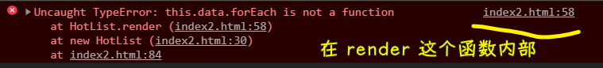

> 如果有几千行，那么报错的嵌套层次就很深了……而我们就得一层层排查了……

而如果我们在一开始就找到错误：

``` js
assert(data instanceof Array, 'data 必须是一个数组');
```

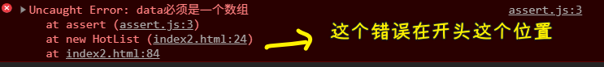

总之，说白了，在传参到`constructor`的时候，就尽早把这个参数给拦住，如果有错误，那就赶紧地说……而不是继续往下执行，不然在于后台交互的时候，搞坏了后台数据库里的数据，而且错误越早报出来，越容易定位错误在哪儿

关于参数校验报错的处理：

很多人喜欢这样写：

``` js
if(!(data instanceof Array)) {
  throw new Error('data 必须是一个数组')
}
```

但这样做太麻烦了，代码也很不简洁……

老师喜欢写一个断言（有很多断言库） -> 所谓断言就是断定的意思，担保这事儿一定是这样……

``` js
// 一个简单的断言封装
// 表达式、错误信息
function assert(reg, msg){
  if(!reg){
    throw new Error(msg);
  }
}
```

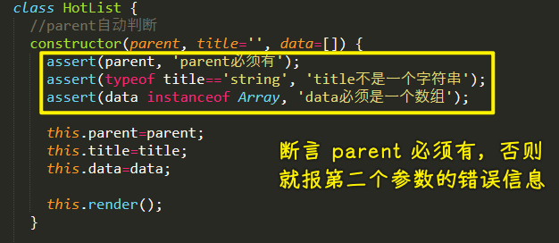

- 断言`title`一定是`string`，否则就 xxx
- 断言`data`一定是`Array`，否则就 zzz

> 断言的错误信息描述，为了人阅读方便 -> 意思相同的情况下，人越容易越读越好！

💡：`throw`之后，后面的代码还会走？

死了就不走了，不然，错误的东西继续走下去，会破坏某些东西……

💡：断言数据的格式问题？

可以用正则：

``` js
assert(/^a/.test(title),'标题必须是 a 开头')
```

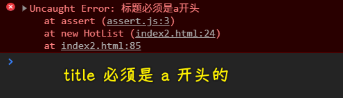

所以你得写成是`'a 热门主播'`

💡：为什么需要加一个`parent`属性？

提供给`render`的挂载点，这个挂载点不是固定某个叫`hot-host`的`div`的……

💡：数据不要暴露给外边？

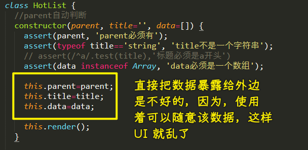

💡：为了方便使用者，`parent`能否自动判断呢？

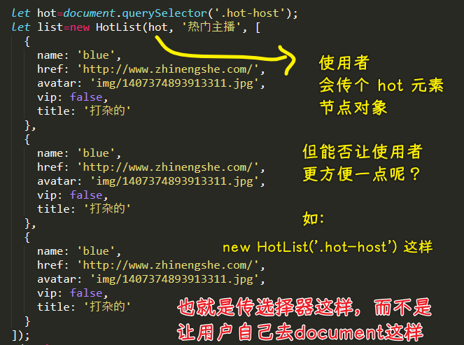

💡：每次数据改变，都得重新`render`？如果是一个商品列表，而且商品特别多，性能岂不是凉凉了？

也许你可以挑着来改，但是这代码也就越来越混乱了……

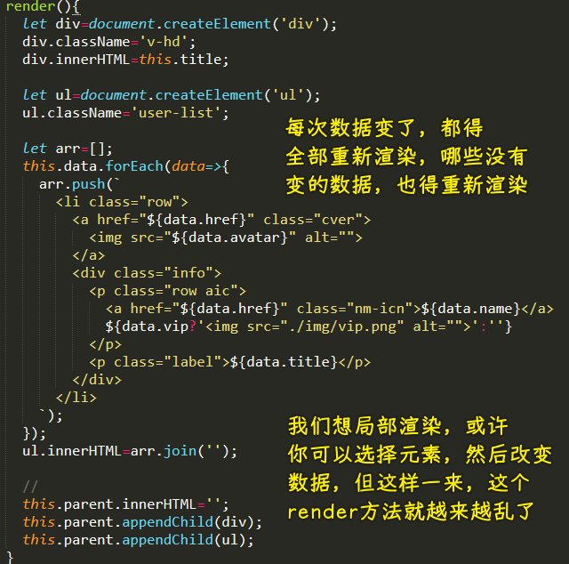

> 虚拟 DOM

---

东西不大，问题不少，每个类的都是一个小小的世界……

> 老师讲这个小例子的时候，我就在想，这个小小的例子能讲出什么花来？能有什么知识点可以讲？ -> 没想到，听完后，就改变了我的看法了，例子很小，但所涉及的问题一点也不少……

💡：为什么需要响应式对象？

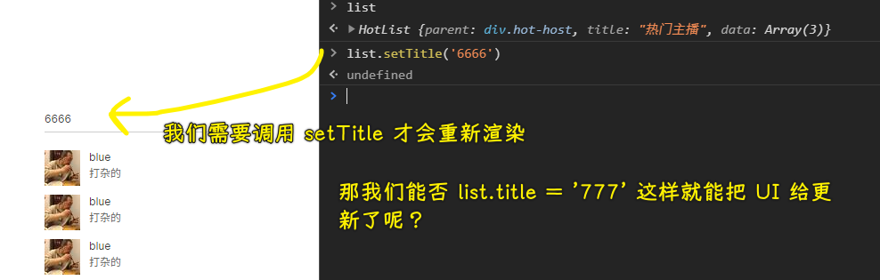

说白了，我们就是为了方便使用者使用啊！

你看：

``` js
list.setTitle('6666')
```

方便，还是：

``` js
list.title = '777'
```

这样赋值就更新了 UI 方便？

### <mark>3）回顾自己干了什么</mark>

1. 设计一个类 -> 比写一个类还有价值
   1. 自上而下：**功能**拆解为**方法**，根据这些方法再看我们需要一些什么样的**属性（数据）**，设计完了，最后再完成**编码**
   2. 类的完成是一个不断修改的过程，如一开始我们只考虑了`title、data`这个两个数据，可在写`render`方法的时候，就追了一个`parent`属性……
2. 尽早定位问题 -> 人类犯错误是常态
   1. `assert`——`throw new Error();` -> 有人会认为这些代码很没有会消耗性能，但打包的时候，我们是可以去掉它们的（用`webpack`提供的大量插件），总之，使劲用`assert`就好了
      1. 防止代码继续执行，以此来造成更大的破坏
      2. 报错后，调试极其方便，很快就知道是哪个位置出错了……
3. 注意
   1. 属性尽量不要直接暴露
   2. 渲染的时候——请不要每次都重新渲染，毕竟这样渲染开销很大啊！

### <mark>4）原型——prototype</mark>

这是一个在原生 JS 里边非常有用，也非常重要的东西！

#### <mark>1、干啥的？</mark>

给类添加/修改东西 -> 能添加意味着就能修改

那么这个类所有的实例都会有这个东西，而这就是它的**根本作用**！

原型的作用：给类添加东西，导致这个类所有的实例都会有这个东西

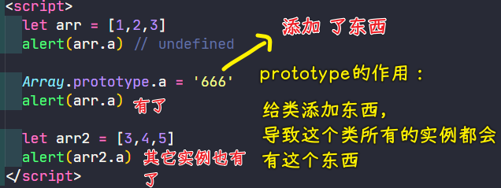

感觉很神奇，它是怎么做到的？ -> 原理是啥？

注意：如果实例自己已经有了这东西，那加上去也没有用 -> 也就是说，实例在自己身上已经找到了，那就不会到原型上找了…… -> 显示不出这加到原型上的东西的效果

#### <mark>2、原理？</mark>

特别简单，举个例子：一座城市里就一座发电站就行了，一幢楼房里，就一个发电机就行了，而不是每家每户都配有一个发电机……

原理：自己身上有这个属性，就不求人，如果没有，那就求人，即往上找……

总之：

实例需要某个东西时（属性、方法），首先从自己身上找，如果有直接用 -> 如果没有继续去类身上找 -> 如果还没有就去父类上找 -> 如果还是没有，直到找到所有类的祖宗`Object`的`prototype`上，如果还是没有，那就返回`undefined`呗！表示找不到！

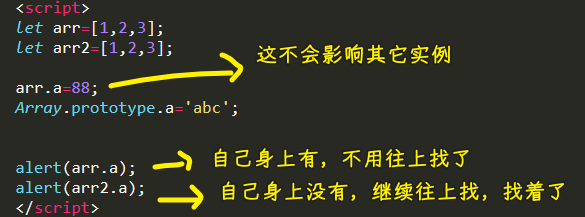

在自己身上找，相当于自己盖了一座发电厂（自己发电自己用），不用去国家那里买电用了！而隔壁的邻居没自己造，只能用国家给的，而我也不借给他用！

再举例子：自己家有厕所，还要去找公共厕所吗？

> 原型链

一个很无语的问题，但这是如何思考的，值得记录一下：

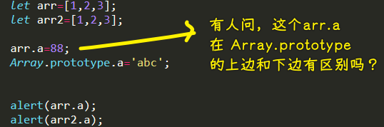

如果在上边，`arr.a=88;`是否会影响`Array.prototype.a='abc';`，反之，`Array.prototype.a='abc';`在上边是否会影响` arr.a=88;`？

结果，都不影响 -> 所以，放在哪儿对结果都没影响！

#### <mark>3、能干啥？</mark>

有了这个原型，我们能干啥？什么时候能用到原型？以前用得比较多，可现在有了`class`，我们直接写里边就完事儿了，所以还用它干啥呢？ -> 还是有用滴！

> 如果没有用途，那就停留在爱好了！

给类添加方法：

1. 添加一些公共方法 -> 不管是系统类（内置类），还是自己的类都可以添加一些公共的方法 -> 如搞个`setter`方法之类的
2. 修补系统函数-polyfill -> 由于种种原因，我们的一些 API 是无法在低版本浏览器使用的

例子：统计这个字符串有多少个`a`？

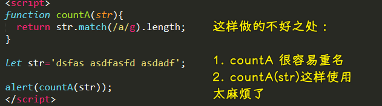

`countA`是个全局函数，很容易重名，如我们要统计这个数组有多少个`A`元素……结果也叫`countA`

换一种姿势：

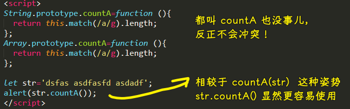

例子：polyfill

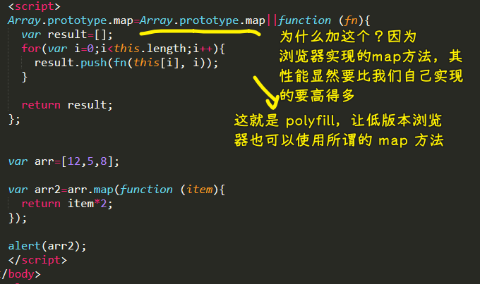

IE6、7、8 是不支持 `map` 方法的

### <mark>5）JS 里边有一个很大的坑</mark>

那就是`this`

### <mark>6）继承</mark>

如果你用面向对象，不用继承，那几乎就是白用了！

---

💡：经常看到参考资料说 js 是词法作用域（静态作用域），这个概念怎么解？

涉及到解析器的工作原理

➹：[JavaScript 深入之词法作用域和动态作用域 · Issue #3 · mqyqingfeng/Blog](https://github.com/mqyqingfeng/blog/issues/3)

### <mark>7）作业</mark>

1. 数组做 polyfill -> 考察你会不会用`prototype`、下边这两个功能自己实现是否有障碍？
   1. filter
   2. reduce
   3. Array.from -> 实现这个静态方法
2. String.trim -> 也是完成它的 polyfill
3. 豆瓣弹出层（选择频道） -> 东西不大，但要考虑的东西很多
   1. 点击频道名称，豆瓣弹出层 -> 考虑重用的问题
   2. 点击页面任意位置，弹出层消失
   3. 弹出层中的数据需要是活的
   4. 弹出层选择后，频道名称变了

> 从用人家的组件，到现在自己实现！

---

Next：JS 的 this、继承
