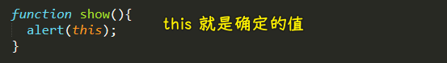
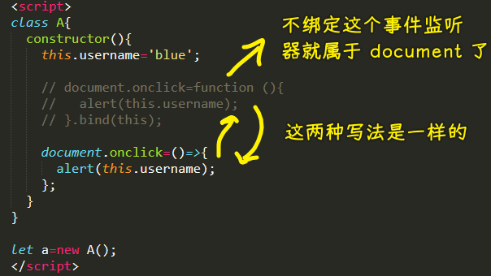

### ✍️ Tangxt ⏳ 2021-02-23 🏷️ OOP

# 04-this、对象基础-1

> 写在对象身上的方法，叫属性，从子类原型找的才是方法

1）回顾 OOP

1. 对象 = 数据 + 方法（可叫函数、过程、代码、程序）
   1. 它不是一个很神秘的东西，它的思想是很简单的
   2. 它提供了空间（命名空间，一个模块是一个命名空间、一个函数它内部也是命名空间，一个类里边也是一个命名空间）
2. 写法 -> 思想层面再怎么成熟，如果不落实到代码上，那都是空的、假的、扯淡的……
   1. 传统写法（构造函数）
      1. 混乱 -> 没有关键字`class`，难以区分这是构造函数还是`function` -> function 和类混淆
      2. 需要在原型上添加方法
   2. ES6 -> 兼容方面，用 babel 就好了
      1. class 关键字 -> class 就是 class，function 就是 function
      2. 方法 -> 就在`class`里边写
3. 原型 -> 有了 class 之后，它是不是废了呢？显然不是，它还是有很大的用途的
   1. 作用：给类加东西——所有实例有
   2. 原理：往上找 -> JS 语言支撑的功能，不需要我们自己实现
      1. 先找实例本身
      2. 找不到就找子类
      3. 如此反复 -> 最后基类 `Object`
      4. 再找不到 -> `undefined`
   3. 题外话：JS 这语言比较特别，语言天生自带`prototype`，而这是不太常见的，绝大多数的 OOP 语言，有`prototype`这个概念，但都得自己动手来实现 -> 如 Java 要实现「往上找」的功能，就得自己通过代码来实现了，当然，会存在一些库来帮助我们这样做…… -> 总之，`prototype`并不是语言自带的东西
   4. 用途：
      1. 给类添加方法 -> 很常用，在某些场景下，如需要判断这个字符串是不是合法的 id，于是就在原型上加了方法了……
      2. 给系统类打补丁 `Array.prototype.filter=Array.prototype.filter||function (){};` -> 系统自带的`filter`比我们自己实现的性能更高！
4. 类型
   1. typeof -> 基本类型
      1. 检测对象 -> 不好 -> 因为检测出来都是 `object`，分不清了，而你又不能说它错，因为理论上说，它们确实是`object`，但这样检测，跟废话差不多，没有意义！所以，它适合基本类型
   2. instanceof -> 子级+父类
      1. 既能检测子类，也能检测父类，而这样做是对的 -> 因为在面向对象的思想当中，一个父类可以有多个子类，这些子类都是父类的特例，父类描述了这些子类的共有属性和操作。一个子类可以继承它的父类（或祖先类）中的属性和操作，这些属性和操作在子类中不必定义，子类中还可以定义自己的属性和操作。
   3. constructor -> 只检测子类，不检测父类
      1. 这不是语言自身规定的用法，而是各路的人自己探索出来的用法
      2. 它返回的是构造这个实例出来的那个函数（也叫类） -> 可间接作为判断类型的标准 -> 用得比较少，但在某些特殊场景下，用它贼鸡儿方便，而且用别的还真不行
5. 特性 -> 面向对象本身的特性，不管是啥介绍面向对象（无论哪种语言）的书，都会提到这 3 个特性 -> 这 3 个特性都有很丰富的含义
   1. 封装 -> 不让别人看到这个类里边都有什么东西
      1. 减低程序的复杂性 -> 关注的事越多，那精力就会越分散，最后写出来的东西就会越混乱 -> 不要关注我这个类怎么写出来的，你只管用我提供给你的这 3 个方法就完事儿了，管那么多干嘛呢？ -> 把具体的这个类的实现细节给封装起来，让它不可见
      2. 保护类里边的成员 -> **主要目标**
         1. 面向对象等等一系列的东西都是软件工程里边的工具，而软件工程这个学科它本身研究的就是「**如何防止人犯错误**」，我们都知道「**犯错误是常态，不犯错误不可能**」 -> 而保护成员就是**为了防止这个成员被意外的修改**，至少我们用了它，就可以加那一层保护了，这样使用者就无法直接去赋值、修改、操作我了 -> 安全性大大提高
   2. 继承 -> 从一个父类的基础上继承出来一个子类 -> 最大限度重用了父级的代码，同时可以把一些特征延续下来！
      1. this -> JS 的 this 很乱，一会儿是这个，一会儿是那个，而其它有面向对象特性的语言里的 this 是非常严谨、非常好的，唯独 JS 的 this 很乱 -> JS 作者之所以这样做是为了让语言变得更加简单
   3. 多态
      1. JS 语法层面不支持多态 -> 因为 JS 自身就是一个动态类型的语言，所以它不需要多态
      2. 我们写 JS，更多是利用它思想层面上的东西，如不用去深究这个东西到底是**谁搞出来**的，也不用深究这个东西到底是**谁来实现**的，反正我用就完事儿了！

我们用面向对象实际上就是在用它某个层面上的特性（3 个特性），如果这些特性都不用，那干脆用函数得了……

2）课程目标

- this -> 乱
- 继承

第一个话题：this

1. 为什么 `this` 这么「乱」？好奇怪啊！怎么回事啊！为啥非得搞成这个样子啊！
2. `this`乱没关系，毕竟，我们无法改变，总不能买张机票去找 JS 作者好好聊说「给我把这个`this`改好……」 -> 所以，你更多的是去适应这个语言，而不是改变这个语言 -> 如何在`this`乱的情况下，让自己的代码不乱呢？

第二个话题：继承

1. 极其常见 -> 什么叫极其？随手就能看到一个例子 -> 几乎你所见到的所有的类型或者其它东西，都是继承的产物，几乎它都有一个父类
2. 价值 -> 继承的价值何在？
   1. 尽可能重用代码 -> 什么东西都从零开始的话，那么这就废了……
   2. 它是多态的一个支撑，没有继承，那就没有多态了！
3. 什么时候就想到要去用继承了？
   1. 公共的东西（属性和方法，类也就这两个东西） -> 抽取出来，没必要在每个类里边都搞一套，毕竟这样很没有意义，父类搞一套，大家一起用不香吗？ -> 这是继承最大的一个应用价值
4. 写法 -> 思想层面再怎么成熟，最后只飘在脑子里边是没有意义的！ -> 所以我们最终就要拿来用，而拿来用就是变成代码来用！而变成代码就需要写！
   1. 古典写法 -> 很乱
   2. ES6 -> 非常简洁、方便
5. 用 -> 用它来做一些事儿
   1. 平常干活时，这继承大部分情况下，其实是用来帮助我们实现一些带有功能的组件 -> 怎么做这些组件呢？ -> 这次课会做一个最初步的设计！ -> 真正对组件很深入，得在后边的课了……

3）this

给 `this` 下一个最基本的一个结论性的东西，什么样的结论呢？如 `this` 到底是什么东西？到底是干什么的？怎么回事等等这一系列的东西……

一句话描述：它取决于一个东西——「谁在调用」

`this`这个东西用在哪儿呢？ -> 用于函数/方法内部，在函数之外的地方用它是没有意义的！

> 函数、方法不分家，它们俩是一个东西！

所以这取决于当前这个函数/方法是谁在调用？ -> 谁调用我，`this`就是谁，就怎么简单！

1、例子（用法）

在其它语言里边，`this`是固定的，如这样：



函数代码写好后，这个`this`就是固定的，就是指的某一个对象或者什么东西！

而在 JS 中，这是不一样的 -> 我们之所以说 JS `this`乱，是因为这`this`是能变的！

JS 有这么一个特点：全局的东西，都是属于`window`的

如：

``` js
function show(){
  alert(this);
}

show(); // window

//全局的东西——都是属于 window

// 等价于
window.show()
```

我们直接写`show()`就是一种简写姿势，即把`window.`给省了……

然而，我们说过，`this`是会变的

如函数`show`代码本身不变，但是随着我的用法不同，那么它的`this`可能也会有所不一样

如我们加个`'use strict;'` -> 这是 JS 作者搞出来的玩意儿，为自己年轻的时候所犯下的错而填的坑 -> 这叫严格模式！

简单来说，JS 这个语言，它其实天然有很多语法层面上的一些漏洞或者弱点之类的东西，而这个**严格模式它可以帮助咱们的 JS 运行在一个更加严格的一个状态之下**！ -> 这样的话，很多问题其实就可以得到解决了！

在严格模式下：


也许你会疑问：「全局的东西——都是属于`window`，这不是打脸吗？」

话说，你认为「全局的东西——都是属于 window」这个事本身严谨吗？

这是不严谨的 -> 因为 JS 早就已经不是只能工作在浏览器的状态之下了，JS 有没有可能工作在后台？比如 Node.js（出了很多年了，很多人在用，在 Node.js 下运行没毛病） ？然后台的 JS 根本就咩有 window 的概念

所以，在这种情况下，全局函数`show`并没有真正意义上属于谁的概念，就是一个函数，就是一个飘着的东西，就是全局的，不属于任何人……不然，你让 Node.js 怎么看？

总之，上边这个例子，主要是告诉我们`this`的第一个特别混乱的地方是：**JS 的`this`是动态的！** -> 说白了，`this`不是死的，它可以根据你的使用方法不同而随着改变！

当你加上`window`后：


2、`this`的值受什么影响？

1. 严格模式 -> 影响全局
2. 方法 -> 谁调用我`this`就是谁
3. 事件 -> `document.onclick = show` -> 谁触发事件？
4. 定时器

> 严格模式只影响全局的，其它东西都不管

💡：为啥严格模式下，定时器下的`this`还是`window`？

`setTimeout(show,100)` -> `this` 是 `window`

因为定时器是由浏览器触发的！不然，不触发就没人执行了……

所以这是由浏览器，也就是`window`间接执行这个`show`方法！

💡：为什么要设计`this`？

想要理解任何一个东西，最好的办法就是知道它为何要出现、为何会有这么一个东西……

如果这个世界没有`this`：

假如有这样的需求：调用一个方法弹出自己的名字

``` js
// 不用 this，那你就得根据使用者来确定类该怎么写了
// 而这显然是很愚蠢的行为，因为使用者万一取名叫 p2 呢？
class Person {
  fn() {
    alert(p.name)
  }
}
let p = new Person('blue')
p.fn()
```

总之，它的存在就是**方便我们使用当前实例**

➹：[JS 里为什么会有 this - 知乎](https://zhuanlan.zhihu.com/p/30164164)

💡：js 的`this`为什么乱？

JS 作者说：为了让 JS 更简单易用

可，我们开发者并没有觉得哪里简单易用啊？

要理解这么个事儿，需要对比其它语言来看：

几乎在所有的语言里边，函数这个东西，是不能单独存在的，比如 Java，你就只写函数，不写类，看看这是什么情况？

总之，函数是不能独立存在的，它必须得属于某一个类！

而这个时候，`this`就是不乱的，就指向当前对象！

而在 JS 里边，你可以发现，函数可以存在在各种各样的地方，如：

1. 给事件加个函数
2. 给定时器加个函数
3. 在某个类里边搞个函数
4. 还可以把函数赋值，赋给谁都行……

所以，`this`之所以那么乱，就是因为函数本身可以到处窜，如果函数是固定的，不能动，就死在那儿，不能走，那么`this`就会变得非常的简单了，因此，归根到底，JS 里边的`this`之所以那么乱，就是因为`function`特别灵活：

- 可以独立存在
- 可以给别人
- 可以……

这就是为什么说 JS`this`乱是为了让 JS 更简单易用 -> 也就是函数的锅……毕竟，函数是一等公民！

在其它语言里，如在 Java 里边使用定时器这个场景，之前说到，这些语言的函数无法独立出去，那么怎么用定时器呢？

很简单，带有定时器方法的这个类传给别人就行了（传给别人一个类，实际是实例），说白了，函数就没有离开过这个类，传给人家的是这个类，所以这样`this`就不混乱了…… -> 人家想要喝水，把水杯拿给他相当于是把水拿给了他

> JS `this` 乱的原因，就是因为函数它太灵活了！

---

如果能直接得出结论，那就不要搞那么多花里胡哨的东西了！

如果能简单得出 JS `this`乱的原因，那就不要搞那么多解释来解释这个原因了？？？

➹：[怎样理解奥卡姆剃刀原则「如无必要，勿增实体」中的「必要」和「实体」？ - 知乎](https://www.zhihu.com/question/25527032)

➹：[「奥卡姆剃刀原则」是正确的吗？ - 知乎](https://www.zhihu.com/question/20159241)

---

💡：统一把方法叫做「函数」

把函数甩给谁，`this`就是谁，如果我把一个函数甩到一个对象上作方法，如`arr.show = show`，那么这个`show`函数就变成对方的东西了！

同理，如果我把一个函数甩到一个地方去给人当事件处理器（事件触发时会运行的代码块，也叫事件监听器，用来监听事件发生，当然这也处理事件，总之，处理器就是对事件发生做出的回应），那么这个`this`就变成了那个事件触发元素了……如`document.onclick = show`

可以看到，从写法的角度来看，`arr.show = show` 和 `document.onclick = show` 其实是一样的……

> 给一个东西当方法，跟你去给某个东西加一个事件，从写法角度上来看，是完全一样的！

事件`onclick`本质上就是一个方法 -> 当某一个事发生的时候，如用户点击这个事发生的时候，`document`就会调用自己的`onclick`方法！

总之，**方法和事件是一回事儿**！

而定时器之所有把`this`指向`window`，是因为定时器是属于`window`的！

4）小结

1. 谁调用
   1. arr.aaa();      // aaa:this -> arr
   2. setTimeout(aaa,1000) // this -> window
2. js 的 this 混乱的原因——js 太灵活

> 定时器指的是谁？ -> 我猜是`aaa`，因为类比事件监听器！延时 1000 ms 执行`aaa`，相当于 1s 后触发事件，而定时器属于`window`的，所以`aaa`的`this`指向的是`window`

`this`是一个实用性很强的东西！在用的过程中，你会体会到它的各种各样的用法！

5）操作 this

我们希望操作`this`，换言之，我们想把`this`变成自己想要的那个东西，不管啥规则，我们想`this`是啥就是啥！

有以下两种姿势：

1. 函数的方法：call、apply、bind
2. 箭头函数 -> ES6 推出的特性
   1. 可简化函数的写法
   2. 修正 this 的指向

💡：函数也是一个对象，它也有自己的方法


> JS 里边一切都是对象，所以把函数看成是对象也不奇怪了！

所有`function`都是`Function`这个类的实例！

1、call 的一个参数就是`this`

```
fn.call(thisObj[,arg1,...])
```

2、apply 的第一个参数就是 `this`

``` js
fn.apply(thisObj,[arg,...])
```

call vs apply -> 传参方式不一样

3、bind

call 和 apply 是直接执行了函数，而 bind 则是**生成一个新的函数** -> 新函数里边的`this`已经被绑定过了！


用途：事件触发时固定监听器的`this` -> React


> 可以认为 Java 里边的 函数都被`bind`过了，即`this`是不会变的！一直把`this`牢牢绑住了某个值！

4、箭头函数

- 箭头函数内部的`this`**永远**跟箭头函数外部一致
  - 箭头函数所写位置的上下文的`this`值就是它里边的`this`值
- 箭头函数相当于——自带一个`bind(this)`



上下两种写法理论上是一个东西，其内部是一致的……

💡：函数里面的代码，能获取到这个函数的名字吗？

是可以的，但推荐！

具名函数：

``` js
function show() {}
console.log(show.name) // 'show'
```

匿名函数：

``` js
// 这个获取到的名字是会变的
let show = function() {}
console.log(show.name) // 'show'
```

箭头函数：

``` js
let show = () => {}
console.log(show.name) // 'show'
```

非严格模式下：

``` js
function show(){
  console.log(arguments.callee.name);
}

// or

var show = function () {
  console.log(arguments.callee.name);
}

show();
```

严格模式下：


> caller 是调用者，callee 是函数本身

➹：[JavaScript：匿名函数和具名函数 - 有猫的程序员](http://hongliya.me/post/javascript_anonymous_function/)

💡：类的实例方法，能用箭头函数吗？

类里边不支持这种写法

对象里边可以，但不建议用，因为箭头函数里边的`this`很有可能是`window`


全局下也有个`this`，它指向的是`window`，而我测试了一下`window.this`结果是`undefined`……

6）继承

