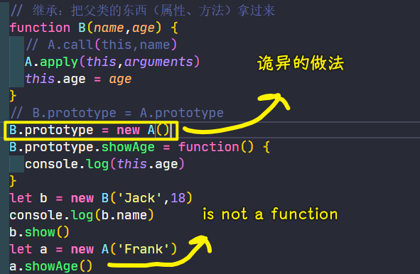
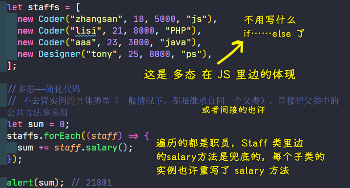
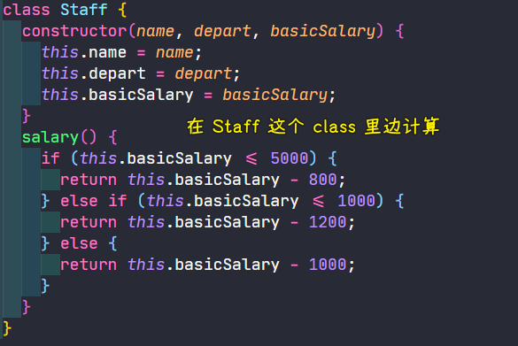
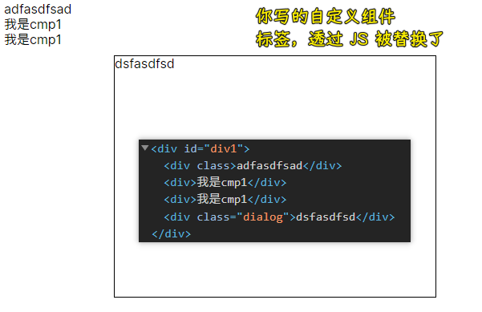

### ✍️ Tangxt ⏳ 2021-02-24 🏷️ this、继承

# 05-this、对象继承-2

### <mark>1）继承的写法</mark>

> 把无数的理想化为现实

注意：不能用`class`，又用古典写法写继承…… -> 配套写

#### <mark>1、古典写法</mark>

我们知道古典的面向对象写法里边：所有的类，它就是一个函数，这是一个缺点，因为它把`class`给混淆了，但是这也是它的一个优点，因为「**是函数就可以执行**」

怎么说呢？

假如有 A（父）、B（子）两个构造函数

构造函数的职责 -> 只管加属性对吧！

而我们想要的是，A 你不要为了你的实例加属性了，为我的 B 加吧！


之后，万一如果 A 类的东西发生任何改变，如`this.name = name + '666'`，B 类也不需要做任何的改动，就能这种享受到这种变化了！ -> 这才算继承

不过，这样做还是有很多问题的，野路子出来的方法，确实可以实现目的，但是：

这太乱了，有的人写继承喜欢`A.apply(this,arguments)`这样写，有的人喜欢用`call` -> 在一个团队内部，这就很恶心了，毕竟一个团队里边写出来的代码风格都不一样！

总之，这种做法并不是实现不了功能，而是存粹是乱啊！

---

继承父类的方法：

``` js
B.prototype = A.prototype
```

可以这样做，真得行吗？ -> 我们要子类大于等于父类啊！换言之，子类之后要添加东西的啊，如果跟父类一样，这完全没有意义啊！

> 别忘了把`constructor`改成是`B`的

更何况，我们为子类添加方法，还会污染父类：


所以，`B.prototype = A.prototype`这种添加方法的办法行，但是并不好

所以，咋办呢？

有人搞出了这样的诡异方法：

``` js
B.prototype = new A()
```



这很神奇啊！可这到底是怎么做到的？


其实说白了，就是原型链机制，还有`A.prototype`也是一个对象……

总之，这种姿势能行，但过程太恶心了……

一个事儿，有很多种搞法，但在一个项目里边，如果代码不统一，台词对比上去，各说各的，显然大家都要疯了……

#### <mark>2、现代的继承</mark>

💡：如何读`class B extends A{}`？

B 不是白来的，而是扩展（`extends`） A 而来的！

💡：为啥要用`super`？

古典姿势用了`call`，如果现代姿势还是这样：

``` js
class B extends A{
  constructor(name,age) {
    A.call()
  }
}
```

万一 `extends A` 这个`A`变了呢？岂不是还要把`constructor`里边的`A`给变了！而且`call`和`apply`也不统一……

所以我们需要让继承父类的属性是可变的！ -> 所以用了`super`关键字

`super`就是超，即超类 -> 父类

注意，`super`它不是一个变量，你无法`super==A`这样去比较它！ -> 它是一个关键字

但是，你是可以`super()`这样去做事儿的！

`super()` -> 相当于是`A.constructor.call(this)`

正确的做法：


💡：为啥`super()`要在`this.xxx`前边？

先完成父类属性的构建，再完成子类属性的构建

#### <mark>3、小结</mark>

- 古典写法 -> 乱、麻烦（加原型方法需要写到构造函数外边去）、不统一（call、apply）
- ES6 -> 简单，统一（`super`就完事了）

回顾：

1. 继承
   1. 层次 -> 清晰 -> 继承是否合理，每一级添加的东西是否合理
   2. 重用父类的东西 -> 子类也可以覆盖自己写一套
2. 继承的写法
   1. 古典 -> 与父类建立联系贼麻烦 
   2. 现代 -> 与父类建立联系贼简单
3. 原型链
   1. 实例 -> 类.prototype -> 父类.prototype -> 父父类.prototype -> 父父父类.prototype -> ... -> Object.prototype -> null 
      1. 不找父类实例 -> 因为父类的实例千千万，你要去哪儿找呢？即便想找，也没法找啊！
   2. 原型链这个词描述了咋们 JS **为什么可以继承过来东西**这件事儿 -> 说白了，为什么咋们在父类里边加了东西，子类就能用呢？ -> 就是因为沿着原型链往上找！
   3. 有啥用？
      1. 对语言使用者没啥用，除了面试
      2. 对语言本身有价值 -> JS 自身就依赖这种机制来工作

#### <mark>4、多重继承</mark>

一个类是由多个父类派生出来的

JS 不支持多重继承 -> 绝对对数的 OO 语言都不支持多重继承，如 Java

C++ 可以 -> 但被广大 c++ 开发者吐槽用了这个特性很乱！

需求：一个类确实需要多个父类的特性

一个类需要 Ajax 发请求，也需要 Component 一些特性

如何做？

多重继承 -> 它的替代方案就是**组合**（对象组合） -> 不继承，只在里边使用你！

Java 不支持多重继承，遇到需要多重继承，也是通过「组合」这种方案来解决的！

> 并不是只有继承才能重用某一个类，也可以通过组合来做！

多继承几次吗？


这就变成单继承了，我们要的是，一次性继承多个类啊！

如果你想这样写：

``` js
class A extends Ajax {}
class A extends Component {}
```

显然会报错

---

至此，我们已经理解了继承，也理解了继承的写法！

### <mark>2）例子</mark>

记住：父类有这样一个特性 -> 帮我们搞定公共的属性和方法

#### <mark>1、员工管理</mark>

> Staff 照理说是抽象类，因为我们随机找一个员工过来，ta 可能是设计师，可能是前端，也可能是 HR 等等，所以这是没有真正一个员工这样的实例出来的！ -> 总之，这是一个虚的东西！

Staff：

- 公共的属性：名字、部门、底薪
- 公共的方法：工资（每个人的工资的计算方式是不一样的） -> 所有人都有，来公司工作就是为了工资

Coder：

- 属性：language
- 方法：salary -> 重写父类的方法（覆盖），即父类给我的方法我没用，我只用自己的！ -> 非常有用，因为父类和子类关于同样的功能可能会有很大的差异，而这种可能性很大！

Designer：

- 属性：software
- 方法：salary

计算员工们的总工资：



``` JAVA
// 类似这样
Staff[] staffs = {new Coder(),new COder(),new Coder(),new Designer()}
```

这种多态思想，让我们不用考虑实例属于什么类的，直接调用这些实例的`salary`方法，就能拿到他们的工资了！ -> 父类的`salary`方法就是在兜底啊！

💡：`super`的另外一重功能？

除了可以调用`constructor`，还可以调用父类的方法！ -> 也就是把`super`当作是一个空间来用（类似 JSON 一样），从这个空间里边找到父类方法！


> 父类自己算底薪，其它子类，在底薪的基础上计算工资！

效果：


总之，super 的作用有：

1. 父类的构造器 -> `super（参数）`
2. 父类的方法的空间 -> `super.calc()`

我们可以在`super`里边找东西，但我们并不能把它当作是一个变量去使用，如`console.log(super)`这样：

``` txt
Uncaught SyntaxError: 'super' keyword unexpected here
```

我们是无法看到`super`里边有什么东西的！

> 为什么把`super`看成是一个 JSON 这样的东西？ -> 因为我们就像是在这个 JSON 空间里边找数据一样！

💡：计算社保的位置？



💡：明白了什么？

1. 写父类的时候
   1. 放公共的东西——提取的时候需要三思而行，是否所有子类都有 -> 如果是，就这样搞，如果不是，就那样搞！
2. super 的用法
   1. 父类构造函数    `super(...)`
   2. 父类的方法     ` super.xxx()` -> **常见于重写或者说覆盖父类的方法！**
3. 重写父类方法
   1. 同名覆盖 -> 可透过`super.xxx`找父级的方法
4. 多态 -> 有多种表现形式，上述只是其中一种
   1. 同一个方法——可以有很多个版本
   2. 具体调用的是哪一个？不重要
      1. 希望调用自己的？ -> 那就覆盖吧！
      2. 不需要调用自己的？ -> 那就不覆盖，不写呗！

> 引用多态思想，是为了让代码变得更简单，而不是变得更复杂！

平时我们用继承，几乎不会用在搞上述的「员工管理」里边！ -> 老师只是为了大家方便理解才搞出来的例子！

一般都是用在可视化的组件方面！

#### <mark>2、组件（真实一点的例子）</mark>

> render 可认为是 convertHTML

这个例子（Vue 和 React 的混合体）大概描述了，在页面写自定义标签，是如何被渲染成真实的 HTML 元素的！ -> Vue、React 大概是这样的思路实现

`render`这个实现很烂，但至少思路是很清晰的……也搞明白了，为啥我们在使用 React 的 class 组件时，需要传一个 `render` 方法了！（多态的思想）

``` html
<!DOCTYPE html>
<html lang="en" dir="ltr">
  <head>
    <meta charset="utf-8" />
    <title></title>
    <style media="screen">
      .dialog {
        width: 400px;
        height: 300px;
        margin: 10px auto;
        border: 1px solid black;
      }
    </style>
  </head>
  <body>
    <div id="div1">
      <div class="">adfasdfsad</div>
      <Cmp1 click="fn"></Cmp1>
      <Cmp1></Cmp1>
      <UserLogin></UserLogin>
    </div>

    <script>
      //html 元素->组件
      function render(options) {
        //1.root 搞定
        let root = null;
        // 尽早定位错误
        if (typeof options.root == "string") {
          root = document.querySelector(options.root);

          if (!root) {
            throw new Error(`can't found ${options.root}`);
          }
        } else if (options.root instanceof HTMLElement) {
          root = options.root;
        } else {
          throw new Error("root invaild");
        }

        //2. 找出所有自定义元素
        let elements = root.getElementsByTagName("*");

        //遍历所有元素，找到不能识别的元素
        Array.from(elements).forEach((element) => {
          // HTMLUnknownElement
          if (element.constructor == HTMLUnknownElement) {
            // 你传的和写在 HTML 里边的作比较，如果写在 HTML 里边的是，是你传的
            // 那么就替换成真实 DOM 呗！
            for (let cmpName in options.components) {
              // tagName 返回都是大写，我们传的自定义组件名是 Xxx 这样的格式
              if (cmpName.toLowerCase() == element.tagName.toLowerCase()) {
                // 组件名即是类名
                let CmpCls = options.components[cmpName];

                let cmp = new CmpCls();
                // 多态思想
                let res = cmp.render();

                // 由于是从 根元素 里边选的，所有自定义标签肯定是有父元素的
                // 参数 1：新的，参数 2：旧的
                // 定位一个容器，从这个容器里边找到一个你想替换的元素
                element.parentNode.replaceChild(res, element);
              }
            }
          }
        });
      }

      //抽象的
      class Component {
        render() {
          throw new Error(`render is required`);
        }
      }

      class Cmp1 extends Component {
        render() {
          let div = document.createElement("div");
          div.innerHTML = "我是 cmp1";

          return div;
        }
      }

      class UserLogin extends Component {
        render() {
          let div = document.createElement("div");
          div.className = "dialog";
          div.innerHTML = "dsfasdfsd";

          return div;
        }
      }

      // 这类似 Vue
      render({
        root: "#div1",
        components: {
          Cmp1,
          UserLogin,
        },
        methods: {
          fn() {
            alert("a");
          },
        },
      });
    </script>
  </body>
</html>
```

效果：



作业：加事件

个人思路：

1. 解析写在自定义标签上的属性
   1. 拿到事件名
   2. 事件监听器
2. 为真实元素添加事件 -> 似乎这就是为什么在写组件模板时都要求只有一个根元素的原因！

💡：为啥说 DOM 操作慢？

> DOM 操作相当于 for 循环操作的几千倍

1. 臃肿
2. 重排 -> 布局改变，如浮动布局发生，影响了其它元素
3. 重绘 -> 图形输出

💡：Array 是继承自 Object 吗？为什么它还是 Object 的一个实例？

arr 是 Object 的实例？ -> 这是 `false`，因为这句话的潜台词是说 Object 是 arr 的构造类！

`arr instanceof Object` -> `true`