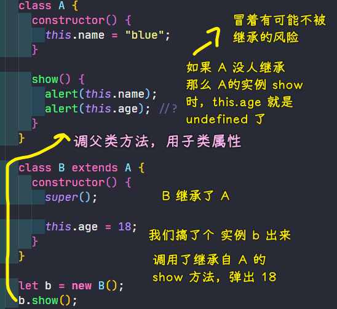
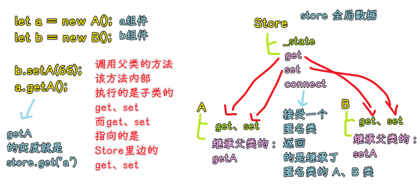
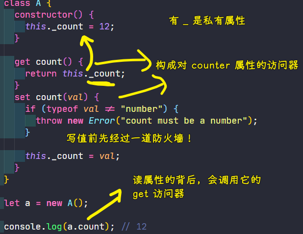
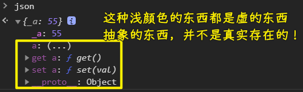
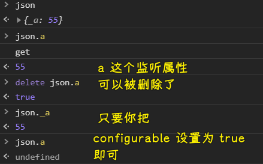
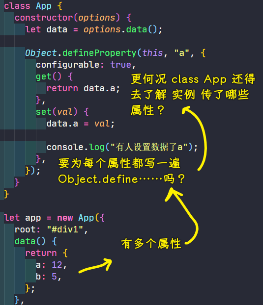
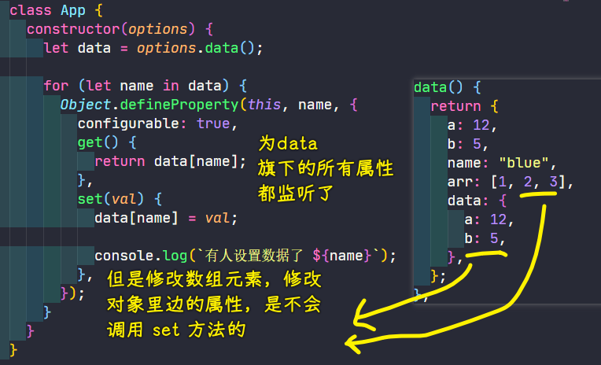

### ✍️ Tangxt ⏳ 2021-02-26 🏷️ 可响应对象

# 06-可响应对象-1

### <mark>1）两个问题</mark>

💡：websocket 如果发送的数据量很大的话，是不是要考虑拆包，粘包的问题？

websocket 自己会拆，不用我们拆 -> 路由会有一个数据量上限值！它想不拆都不行！

💡：reduce -> polyfill（修补）？

性能 -> 系统实现的比我们自己实现的要高得多！因为它是用原生语言实现的！

它的特点：

* 有两个参数，第一个是 callback，第二个是初始值
  + callback 的形参
    - accumulator -> 累积能量
    - currentValue -> 元素
    - currentIndex -> 索引
    - array -> 源数组
* 如果不给初始值，那么循环是从第二个元素开始的；如果给了，那么循环是从第一个元素开始的

实现：

``` js
Array.prototype.reduce =
  Array.prototype.reduce ||
  function(cb, initialValue) {
    var start = 0;
    if (typeof initialValue == "undefined") {
      initialValue = this[0];
      start = 1;
    }

    for (start; start < this.length; start++) {
      // 函数 -> 表达式 -> 求值
      initialValue = cb(initialValue, this[start], start);
    }

    return initialValue;
  };

let arr = [12, 5, 7, 9];
let sum = arr.reduce(function(tmp, item, index) {
  return tmp + item;
}, 99);
let arr1 = [1, 2, 3]
let sum1 = arr1.reduce((tmp, item) => {
  return tmp + item
})

console.log(sum);
console.log(sum1)
```

mdn 文档也有关于 reduce 的 polyfill 实现

➹：[Array.prototype.reduce() - JavaScript - MDN](https://developer.mozilla.org/en-US/docs/Web/JavaScript/Reference/Global_Objects/Array/Reduce)

### <mark>2）回顾</mark>

* 面向对象
* 继承
  + 重用父级代码
  + 多态 -> 让代码更简单
  + 层次 -> 像 HTML 标签嵌套那样
* 重用父级代码
  + 继承 -> 最常用
  + 组合 -> 有些场景用它 -> 多重继承

这节课讲什么？

1. 高阶类——反向继承（不是子类继承父类，然后父级继承子类这种反向），在父级中使用子类的成员 -> 一种很有意思的思想 -> 用途不广，但偶尔用它非常不错
2. 可响应对象 -> 只要给类的实例的某一个属性（注意是属性，可不是方法）赋值，实例的内部就能感知到，有人对它的属性怎么怎么样了！ -> 知道了，就会作出相应的反应！ -> **很重要**

   1. 方便吗？ -> 方便与坑同在！

💡：只有 JS 有高阶类吗？

其它语言也有，但实现比较费劲，如 Java，对于 JS 这种动态脚本语言来说，so easy！

💡：动态语言和静态语言怎么区分啊？

什么叫动态？

`class` 是这样写的：

``` js
class A {
  a = 12
}

let obj = new A()
console.log(obj) // {a:12}
```

我们可以为 `obj` 添加属性：

``` js
obj.b = 666
```

这就是动态的！

而如果是 Java 语言的话，是不能这样添加的，你得改 `class` 才能添加，而 JS 就不用这样做了！

这个例子只是区分动态和静态的一个比较突出的点！但这也足够解释动态（活的，随便改）和静态（不能改）了！

### <mark>3）HOC 高阶类</mark>

一般来说，子类继承父类是天经地义的一件事儿！

那高阶类「高」在哪儿呢？ -> 父类可以反过来使用子类的东西！（感觉很厉害的样子，但这个操作也感到很别扭）

它不常用，但偶尔在恰当的时候用它一次，会对我们有极大的帮助！



可以看到，这代码似乎挺简单的，可它居然起来一个叫「高阶类」的名字！

它的使用场景：组件之间的数据交互（交流）

Store.js：

``` js
// Store.js
class Store {
  constructor() {
    this._state = {};
  }

  get(key) {
    if (key in this._state) {
      return this._state[key];
    } else {
      throw new Error(`${key} is not defined`);
    }
  }

  set(key, val) {
    this._state[key] = val;
  }

  connect(cls) {
    let store = this;
    return class extends cls {
      constructor(...args) {
        super(...args);

        this.get = store.get.bind(store);
        this.set = store.set.bind(store);

        // this.get=store.get;
        // this.set=store.set;
      }
    };
  }
}

let store = new Store();
```

A.js：

``` js
const A = store.connect(
  class {
    constructor() {}
    getA() {
      console.log(this.get("a"));
    }
  }
);
```

B.js：

``` js
const B = store.connect(class {
  constructor() {}
  setA(val) {
    this.set('a', val);
  }
});
```

index.html：

``` html
<body>
  <script src="./Store.js"></script>
  <script src="./A.js"></script>
  <script src="./B.js"></script>
  <script>
    let a = new A();
    let b = new B();

    b.setA(66);
    a.getA();
  </script>
</body>
```

> 既然有匿名函数，那就会有匿名 `class` -> `get` 和 `set` 并不是 `getter` 和 `setter` 方法

程序的大概思路：



💡：super

只要出现了 `extends` 就得手动调 `super` ， `Object` 除外！

💡：小结

HOC 高阶类：

1. 在父类中使用子类才有的东西
2. 类写完不直接用——包裹一下

### <mark>4）可响应对象</mark>

> 重点话题

* 是什么：属性可以被监听
* 目的：为了方便
* 怎么做？ -> 三种姿势
  + 访问器——get/set -> 在简单场景使用
  + defineProperpty -> 可以帮我们添加被监听的属性，但有缺陷
  + Proxy -> defineProperpty 的后继版本，功能非常强大，比 defineProperpty 的监听范围还要广得多，而且 defineProperpty 的一些问题它还没有 -> 人类总在进步
    - 好用，可以把一个对象的所有属性都给监听了！

为什么讲 `defineProperpty` ？ -> 因为还有人用，但我们主要还是用 `Proxy`

---

#### <mark>1、访问器</mark>

> 如何让一个属性响应我的操作？

* `get xxx(){} / set xxx(){}`构成对`xxx`属性的访问器
  + get 和 set 是 JS 里边特殊的语法，它所定义的方法不是通常意义上的方法，而通常意义的方法是供我们调用的，而添加了`get`和`set`会把方法变成所谓的访问器方法 -> 所谓的访问器方法，说白了，就是把 `xxx` 当作是变量来用，读取时候会**自动调用**它的背后的那个方法！（让访问器方法自己来搞，不用你去调用） 这样一来，我们代码写起来就比较方便了！
  + 只能在面向对象里边搞！ -> `class/{}` -> 因为只有它们可以添加方法！
* 下划线开头意味着私有属性，表示不要去访问，不然，会有莫名其妙的错误
* 关联 -> 让`getter`关联私有属性`_xxx`，当然也可以不关联！直接返回一个数值！
  + 访问器返回的是`this._xxx`，不然，你写的是`this.xxx`就会死循环了 -> 因为`this.xxx`也是一个读操作啊！
* 防火墙 -> 约束属性可以接受的类型

例子 1：



例子 2：


> 让普通属性被访问器属性关联

``` js
class HotList {
  _title = 'xxx'
  get title() {
    console.log('获取 title 的值')
    return this._title
  }
  set title(val) {
    console.log('title 被赋值了')
    this._title = val
  }
}
```

可以看到 `get/set` 让我们之前那种 `setTitle/getTitle` 写法变简单了！ -> 其作用，让不合法的值通通完蛋！

#### <mark>2、defineProperpty</mark>

> 虽然有缺陷，但它在历史上有一定地位！

Tips：

* 老师喜欢把普通对象`{}`叫为「json」
* `get(){}`是方法，`get xxx(){}`这种有名字的是访问器

`Object.defineProperpty` 这种姿势的 `get(){}` 同访问器姿势几乎一模一样！

``` js
let json = {
  _a: 10
};
Object.defineProperty(json, "a", {
  get() {
    console.log("get");
    return json._a;
  },
  set(val) {
    console.log("set", val);
    json._a = val;
  },
});

json.a = 55;
```



> 为何说虚？ -> `json.a`的本质是去执行`get`方法，而不是去找`a`属性……

它只能做作用于`json`，而且这样写，我们并不能直接删除属性，如`delete json.a`返回`false`

那如何才能删呢？ -> 需要用到它的其它参数 -> 除了`get`和`set`参数以外，它还有其它参数！

用到`configurable` -> 可配置的 -> 默认值是`false` -> 表示这个属性不可配置

如果你把它设置为`true`，那意味着你可以把`a`给删了！



如果你把`json._a`删了，而`json.a`没删，那么`json.a`的结果就是`undefined` -> 可以看到 js 语法上的缺陷，如果有私有成员这种语法，那么`json._a`就不会被删除了！

总结：

- 比访问器的功能更为复杂，但也更为强大！
- 它用来定义属性 -> 可通过参数指定属性的一些行为
- 它的其它参数意义不大，常用的就`get/set/configurable`

💡：例子：响应数据修改

难点：

1. 对比 Vue，定义属性作用的是实例本身，而不是`data`这个`json`
2. 能不能同时`define`几个属性？
   1. 不能同时，只能一个个定义
   2. 需要注意的是：`App`这个`class`里边是无法确定`app`实例的`data`到底是传了什么属性的 -> 如果写死的话，那显然是不合理的！
3. 为什么在`constructor`里边用`let data=options.data();`，而不是`this.data=options.data();`？
   1. 不想实例可以`app.data.a`这样改数据
   2. `let data`这样做，那`data`就是一个局部变量了，这是一个非常好的封装！
4. 为什么`data`是个函数，而不是一个对象？
   1. 如果是对象，假如有两个实例`app1`和`app2`
      1. app1 -> data:{age:18}
      2. app2 -> data:{age:18}
      3. 有些数据是重复使用的，于是他们把`data`改为：
         1. app1 -> data:json
         2. app2 -> data:json
      4. 这样数据就乱套了
   2. 如果是函数，那就提醒它们返回一个`{}`，而不是返回一个来自外边全局的`json`变量 -> 函数最好是纯的这样一个理念

💡：为啥要遍历`data`来监听属性？

不遍历：



遍历：



💡：`defineProperty`有问题——操作数组内部的东西——无法响应？

对于数组、json 监听不完整 -> 你监听的一个`x`属性，但是`x`属性的值是一个数组或者对象，你改变了数组元素或者修改了对象里边的属性 -> 是不会调用`set`方法的！

Proxy 是没有这个问题的！而`defineProperty`只监听你让它监听的那一层属性，如监听`data`属性，就只看`data`属性，不看其内部的属性是否发生改变！ -> 如果想监听内部那一层，就得自己加上去了！

接下来就来看看如何修补`defineProperty`的问题！ -> 可以提供一个 API 来做这件事儿！

> 不会深入学习`defineProperpty`，因为它本身天然就有很多问题啊！ -> 何必去深入学习它呢？毕竟还有好的，为啥不去用呢！ -> 日常中，更多用的是 `Proxy`
