### ✍️ Tangxt ⏳ 2021-02-27 🏷️ 可响应对象

# 07-可响应对象-2

### <mark>1）设置值，触发重新渲染</mark>

💡：不要重复渲染？

搞一个 `_updated` 私有属性


💡：想要这种调用方式： `app.data.a = 666` -> 触发 `render`

需要自己去递归处理 -> 处理不好影响性能，处理好了，代码丑陋！

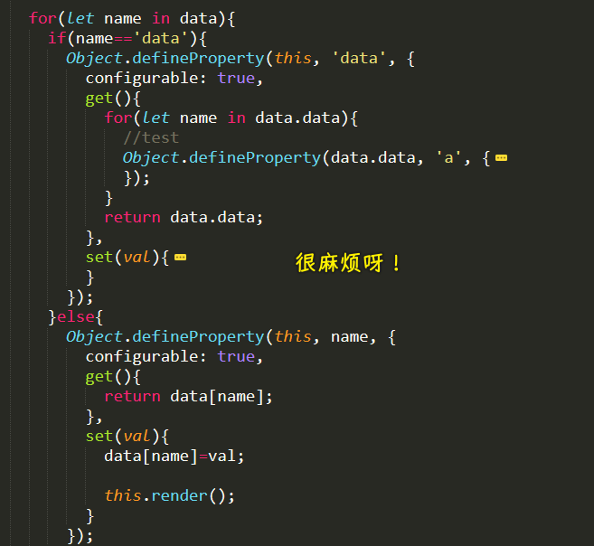

### <mark>2）重写 HotList</mark>

💡： `constructor` 里边不要搞那么多操作，有价值的操作就提取出来成为一个方法！

> 在写断言的时候，时常来一句：我这要求过分吗？

``` js
class HotList {
  //parent 自动判断
  constructor(options) {
    assert(options, "options 必须有");
    // 把需要搞很多断言的操作抽出去
    this._root = this._getRoot(options);
    this._defineData(options);

    this.render();

    this._update = false;
  }

  _getRoot(options) {
    // 我这要求过分吗？
    assert(options.root, "root 不能为空");

    if (typeof options.root == "string") {
      let root = document.querySelector(options.root);
      assert(root, `找不到：${options.root}`);

      return root;
    } else if (options.root instanceof HTMLElement) {
      return options.root;
    } else {
      assert(false, "root 不合法");
    }
  }

  _defineData(options) {
    assert(options.data, `data 不能没有`);
    assert(typeof options.data == "function", `data 必须是函数`);

    let data = options.data();
    assert(data, "data 必须有返回值");
    assert(typeof data == "object", "data 必须是 object");

    //
    for (let name in data) {
      Object.defineProperty(this, name, {
        configurable: true,
        get() {
          return data[name];
        },
        set(val) {
          data[name] = val;

          this.render();
        },
      });
    }
  }

  // 修改数组元素里边的内容，强制 render！
  $set(obj, name, val) {
    this._update = false;
    obj[name] = val;

    if (!this._update) {
      this.render();
    }
  }

  render() {
    let div = document.createElement("div");
    div.className = "v-hd";
    div.innerHTML = this.title;

    let ul = document.createElement("ul");
    ul.className = "user-list";

    let arr = [];
    this.data.forEach((data) => {
      arr.push(`
        <li class="row">
          <a href="${data.href}" class="cver">
            
          </a>
          <div class="info">
            <p class="row aic">
              <a href="${data.href}" class="nm-icn">${data.name}</a>
              ${data.vip ? '' : ""}
            </p>
            <p class="label">${data.title}</p>
          </div>
        </li>
      `);
    });
    ul.innerHTML = arr.join("");

    //
    this._root.innerHTML = "";
    this._root.appendChild(div);
    this._root.appendChild(ul);

    this._update = true;
  }
}

let list = new HotList({
  root: ".hot-host",
  data() {
    return {
      title: "热门主播",
      data: [{
          name: "blue",
          href: "http://www.zhinengshe.com/",
          avatar: "img/1407374893913311.jpg",
          vip: false,
          title: "打杂的",
        },
        {
          name: "blue",
          href: "http://www.zhinengshe.com/",
          avatar: "img/1407374893913311.jpg",
          vip: false,
          title: "打杂的",
        },
        {
          name: "blue",
          href: "http://www.zhinengshe.com/",
          avatar: "img/1407374893913311.jpg",
          vip: false,
          title: "打杂的",
        },
      ],
    };
  },
});
```

### <mark>3）Proxy</mark>

> defineProperty 能用，但它不靠谱，为何不用靠谱的东西呢？

Proxy 的前身是 Observe，但它已经被废弃掉了！

#### <mark>1、怎么用</mark>

1. 准备一个真实数据 -> 此数据是要藏在背后的，不会被人去修改
2. `new Proxy` -> 代理，你找他有事？先跟我说吧！

   1. 第一个参数 -> 我要监听谁
   2. 第二个参数 -> `{}` -> 里边提供了好几种方法，原先的 `defineProperty` 过于复杂，取消掉了一些东西 -> 以下这些函数需要返回值，不然返回 `undefined` 的话，就是 `false` 了 -> 对代理做某些操作，会触发以下相应的某些行为

      1. has -> `xxx in {}` -> 返回`ture/false` -> **`in`触发**
      2. get -> 获取
      3. set -> 设置
      4. deleteProperty -> 处理 delete -> 不叫 delete，是以防与`delete`关键字重名 -> **`delete`触发**

         1. 从哪儿删
         2. 删谁

基本使用（没有解决 `arr` 值没有被监听的问题）：

``` js
//真实数据
let _data = {
  a: 12,
  arr: [1, 2, 3],
  json: {
    a: 12,
    b: 5
  },
};

let p = new Proxy(_data, {
  has(data, name) {
    //in
    if (name in data) {
      return true;
    } else {
      return false;
    }
  },
  get(data, name) {
    //获取
    if (name in data) {
      return data[name];
    } else {
      throw new Error(`${name} is not defined`);
    }
  },
  set(data, name, val) {
    //设置
    console.log("set");
    data[name] = val;
  },
  deleteProperty(data, name) {
    //处理 delete
    if (name in data) {
      return delete data[name];
    } else {
      throw new Error(`${name} is not defined`);
    }
  },
});
```

这玩意儿，目前在用法上是不方便的！因为你要监听一个对象，都得 `new Proxy(_data,{})` 这样包裹一层！

#### <mark>2、介绍两个对它在使用上至关重要的东西</mark>

跟函数配合：

如何才能跟函数配合？

1. 前提条件：监听的东西也得是个函数，不用我们无法调用`p` -> `new Proxy`的第一个参数是函数的话，那么返回值也是函数
2. 使用 `apply` 这个参数 -> `{has,apply}`

   1. `apply` 有三个参数 -> `fn/thisValue/args`

> Proxy 它不仅可以用来包装一个数据，还可以用来包装一个函数！

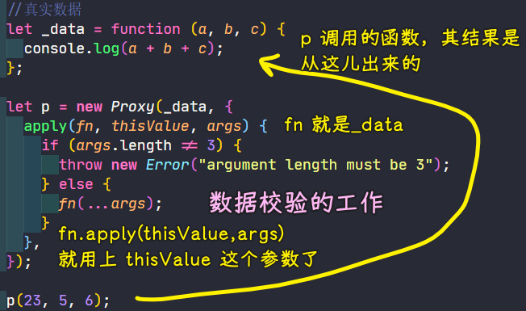

目前，我们试了 json，函数，接下来试一下数组！

跟数组配合：

``` js
let _data = [1, 2, 3];

let p = new Proxy(_data, {
  get(data, name) {
    console.log("get");
    return data[name];
  },
  set(data, name, val) {
    console.log("set");
    data[name] = val;
  },
});
```

在 `push` 元素时， `set` 报错了：

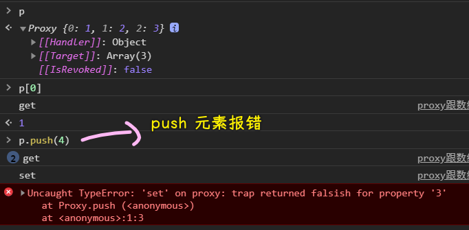

跟类打交道：

> 这个很重要

`construct` 用来处理 `new` 的！在你 `new` 的时候，会拦截你这个操作 -> 这可不是 `constructor`

注意点：不需要传 `this` ，因为 `new` 的时候就确定 `this` 是实例了！

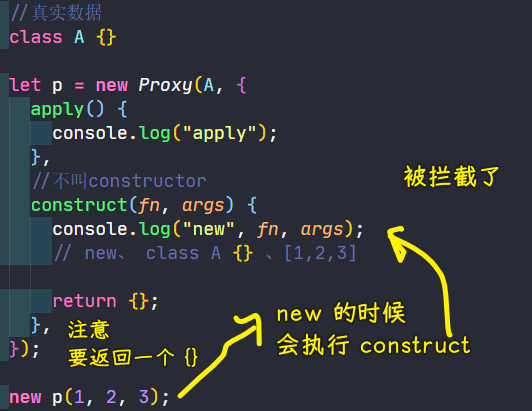

如果你不返回一个 `{}/[]` 等，那么就会报错：

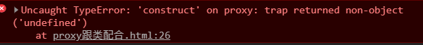

#### <mark>3、小结</mark>

分情况使用这 6 个东西：

* has -> in
* get -> 获取
* set -> 赋值（push、pop 等操作，很复杂，会同时改动多个东西）
* deleteProperty -> 删除 -> 需要返回`in`操作的结果
* apply -> 函数调用 -> 原先那个定义属性 API 是无法检测函数被调用的！
* construct -> new

### <mark>4）监听一个 `class` 里边所有的属性</mark>

一旦属性被改动了，就得收到通知！

监听对象：

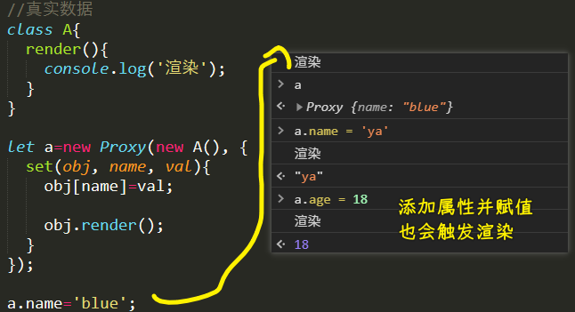

用户在使用时不方便 -> 需要用 `let a = new Proxy()` 这样包裹一层使用 `a` 实例

监听类（类似高阶类）：

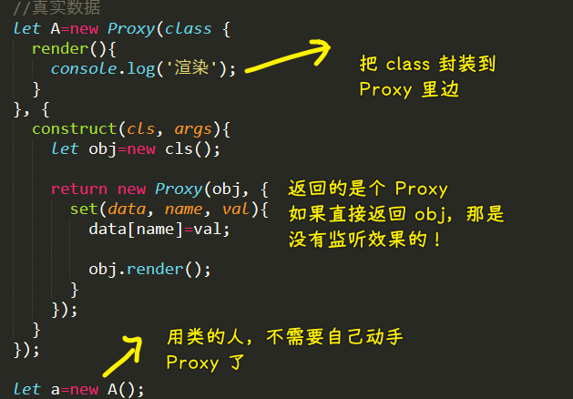

---

这两种姿势，显然后者好！ `Proxy` 相较于 `Object.defineProperty` ：

1. 强大多了 -> 多了好多功能
2. 也多了很多复杂 -> 用起来要更复杂一些

### <mark>5）例子</mark>

> 透过例子，进一步深入理解这个 `Proxy`

#### <mark>1、例子 1</mark>

``` js
// 写类的人做的
class Cmp {
  constructor(name) {
    this.name = name;

    this.el = document.createElement("div");
    this.el.className = "box";
    document.body.appendChild(this.el);

    this.render();
  }

  render() {
    this.el.innerHTML = this.name;
  }
}

// 用类的人做的
let _cmp = new Cmp("blue");
let cmp = new Proxy(_cmp, {
  set(obj, name, val) {
    obj[name] = val;

    obj.render();
  },
});
```

效果：

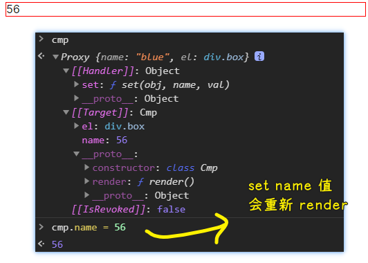

#### <mark>2、例子 2</mark>

这种封装性更好 -> 常用！

我们想要把这部分：

``` js
let _cmp = new Cmp("blue");
let cmp = new Proxy(_cmp, {
  set(obj, name, val) {
    obj[name] = val;

    obj.render();
  },
});
```

搞得更简洁一些……

> 写起来麻烦 -> 但用起来容易

``` js
//写
const Cmp = new Proxy(
  class {
    constructor(name) {
      this.name = name;

      this.el = document.createElement("div");
      this.el.className = "box";
      document.body.appendChild(this.el);

      this.render();
    }

    render() {
      this.el.innerHTML = this.name;
    }
  }, {
    construct(cls, args) {
      let obj = new cls(...args);

      return new Proxy(obj, {
        set(obj, name, val) {
          obj[name] = val;

          obj.render(); 
        },
      });
    },
  }
);

//使用类
let cmp = new Cmp("blue");
```

效果：

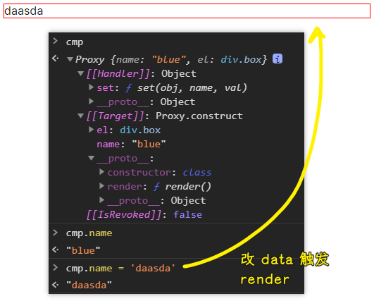

可以看到，使用类的人方便多了，不过写类的人就得套很多层来写，当然，这些写多了也就那么一回事了！

注意：这个例子还有其它的组合写法！这不是唯一的做法哈！总之，用熟上边的写法就好了！

### <mark>6）用 Proxy 改写 HotList 例子</mark>

> 该例子足够简单，而且也足够支撑我们要讲的很多的东西！

注意：不能给`this`赋值

``` js
const HotList = new Proxy(
  class {
    //parent 自动判断
    constructor(options) {
      assert(options, "options 必须有");

      this._root = this._getRoot(options);
      // this._data=this._getData(options);

      // this.render();

      // this._update=false;
    }

    _getRoot(options) {
      assert(options.root, "root 不能为空");

      if (typeof options.root == "string") {
        let root = document.querySelector(options.root);
        assert(root, `找不到：${options.root}`);

        return root;
      } else if (options.root instanceof HTMLElement) {
        return options.root;
      } else {
        assert(false, "root 不合法");
      }
    }

    render() {
      let div = document.createElement("div");
      div.className = "v-hd";
      div.innerHTML = this.title;

      let ul = document.createElement("ul");
      ul.className = "user-list";

      let arr = [];
      this.data.forEach((data) => {
        arr.push(`
        <li class="row">
          <a href="${data.href}" class="cver">
            
          </a>
          <div class="info">
            <p class="row aic">
              <a href="${data.href}" class="nm-icn">${data.name}</a>
              ${data.vip ? '' : ""}
            </p>
            <p class="label">${data.title}</p>
          </div>
        </li>
      `);
      });
      ul.innerHTML = arr.join("");

      //
      this._root.innerHTML = "";
      this._root.appendChild(div);
      this._root.appendChild(ul);

      // this._update=true;
    }
  },
  {
    construct(cls, args) {
      console.log(args);
      let obj = new cls(...args);

      assert(args[0].data, `data 不能没有`);
      assert(typeof args[0].data == "function", `data 必须是函数`);

      let data = args[0].data();
      assert(data, "data 必须有返回值");
      assert(typeof data == "object", "data 必须是 object");

      for (let name in data) {
        obj[name] = data[name];
      }

      obj.render();

      return new Proxy(obj, {
        set(obj, name, val) {
          obj[name] = val;

          obj.render();
        },
      });
    },
  }
);

let list = new HotList({
  root: ".hot-host",
  data() {
    return {
      title: "热门主播",
      data: [
        {
          name: "blue",
          href: "http://www.zhinengshe.com/",
          avatar: "img/1407374893913311.jpg",
          vip: false,
          title: "打杂的",
        },
        {
          name: "blue",
          href: "http://www.zhinengshe.com/",
          avatar: "img/1407374893913311.jpg",
          vip: false,
          title: "打杂的",
        },
        {
          name: "blue",
          href: "http://www.zhinengshe.com/",
          avatar: "img/1407374893913311.jpg",
          vip: false,
          title: "打杂的",
        },
      ],
    };
  },
});
```

代码大概逻辑：

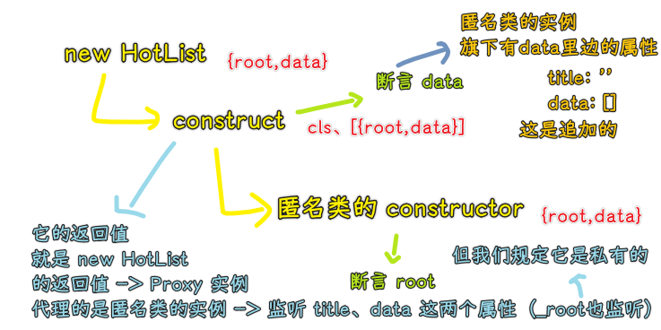

> 包一层类 -> 在`construct`里边`new`这个类 -> 包一层这`new`出来的实例 -> 在`set`里边设置重新`render`

缺陷：二级数据变动，还是无法监听

进一步优化上边的代码：

> `createClass() ` -> `Vue.extend()`

`common.js`：

``` js
function _getRoot(options) {
  assert(options.root, "root 不能为空");

  if (typeof options.root == "string") {
    let root = document.querySelector(options.root);
    assert(root, `找不到：${options.root}`);

    return root;
  } else if (options.root instanceof HTMLElement) {
    return options.root;
  } else {
    assert(false, "root 不合法");
  }
}

function _getData(options) {
  assert(options.data, `data 不能没有`);
  assert(typeof options.data == "function", `data 必须是函数`);

  let data = options.data();
  assert(data, "data 必须有返回值");
  assert(typeof data == "object", "data 必须是 object");

  return data;
}

function createClass(cls) {
  return new Proxy(cls, {
    construct(cls, args) {
      let obj = new cls(...args);

      obj._root = _getRoot(args[0]);
      // data 函数，实例不需要，但 data 函数所返回的实例是实例所需要的
      let data = _getData(args[0]);

      for (let name in data) {
        obj[name] = data[name];
      }

      obj.render();

      return new Proxy(obj, {
        set(obj, name, val) {
          obj[name] = val;

          obj.render();
        },
      });
    },
  });
}
```

`HotList.js`：

``` js
const HotList = createClass(
  class {
    // 只管自己的 render
    render() {
      let div = document.createElement("div");
      div.className = "v-hd";
      div.innerHTML = this.title;

      let ul = document.createElement("ul");
      ul.className = "user-list";

      let arr = [];
      this.data.forEach((data) => {
        arr.push(`
        <li class="row">
          <a href="${data.href}" class="cver">
            
          </a>
          <div class="info">
            <p class="row aic">
              <a href="${data.href}" class="nm-icn">${data.name}</a>
              ${data.vip ? '' : ""}
            </p>
            <p class="label">${data.title}</p>
          </div>
        </li>
      `);
      });
      ul.innerHTML = arr.join("");

      //
      this._root.innerHTML = "";
      this._root.appendChild(div);
      this._root.appendChild(ul);
    }
  }
);

let list = new HotList({
  root: ".hot-host",
  data() {
    return {
      title: "热门主播",
      data: [
        {
          name: "blue",
          href: "http://www.zhinengshe.com/",
          avatar: "img/1407374893913311.jpg",
          vip: false,
          title: "打杂的",
        },
        {
          name: "blue",
          href: "http://www.zhinengshe.com/",
          avatar: "img/1407374893913311.jpg",
          vip: false,
          title: "打杂的",
        },
        {
          name: "blue",
          href: "http://www.zhinengshe.com/",
          avatar: "img/1407374893913311.jpg",
          vip: false,
          title: "打杂的",
        },
      ],
    };
  },
});
```

### <mark>7）总结</mark>

高阶类 -> 用得不多，但思想重要：

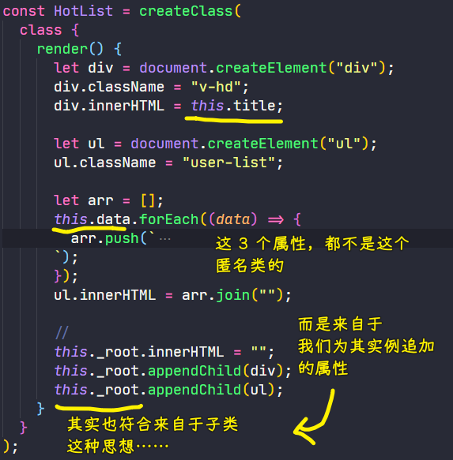

响应类：

- get/set -> 访问器，它最大问题是它是静态的，你要监听哪个属性写哪个属性，你写 3 个就监听 3 个，多了没有（我们想要对数据进行各种各样的操作，我们就得让它动态起来，于是就有了下边两种姿势）
- defineProperty
- Proxy

目前，我们只是初步了解了 class，要想进一步了解它，还得多多使用它……

我们并不关心读操作 -> 关心的是写操作（同步渲染、同步数据到服务器上）

作业：

- 菜单是否弹出 -> 赋值：true 出来，false 消失
- 菜单里边每一项的数据是真实的数据
