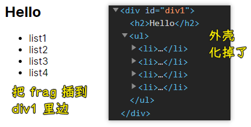
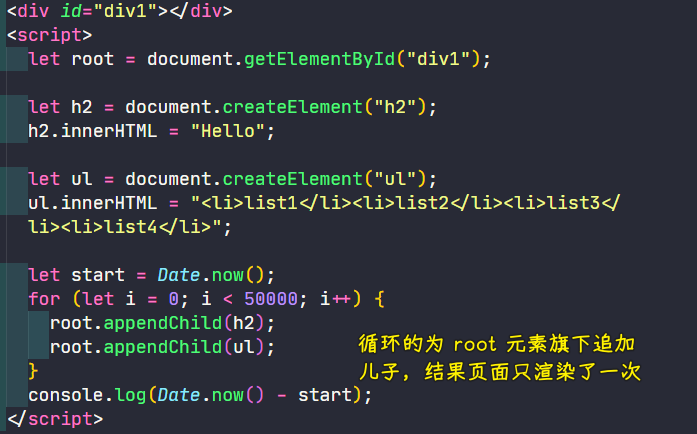
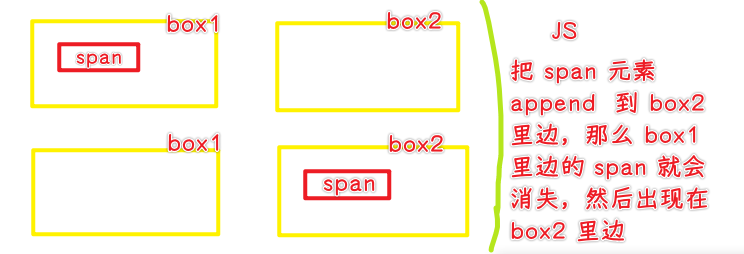

### ✍️ Tangxt ⏳ 2021-03-07 🏷️ 虚拟 DOM

# 08-DOM 基础、初级 DOM 编译-1

> 任何一个东西被完全淘汰都会有一个过程，毕竟，当初它一统江湖的时候，也是击败了许多对手！ -> 例子： `defineProperty` -> 还有框架在用它！ -> 但目前是推荐使用 `Proxy` 的！

上节课的知识唯有在实践中才能明白它们的作用！

### <mark>1）DOM 操作</mark>

> DOM 涉及到很多外延的东西


> [逻辑学中「外延」与「内涵」是什么意思？ - 林大炮的回答 - 知乎](https://www.zhihu.com/question/22267682/answer/1644637486)

vDOM（虚拟 DOM，全世界的人都这么叫）总会关联到真实 DOM，不然 vDOM 一点意义都没有，毕竟我们要在页面里边看到东西啊！

* DOM（由各种节点构成）
  + DOM 节点 -> 判断节点、节点相关信息、如何找节点
  + DOM 操作 -> 如何创建？添加？删除？
  + 文档碎片 -> IE6 那个年代就有的东西，但一直就咩有被大家所重视起来，因为我们找不到应用场景呀！
    - 它有很多优势，如性能、操作便利上等
    - 后续经常会用到
  + DOM 属性 -> 添加属性（不一定是`.xxx`这样加属性）、遍历属性
  + 编译 DOM 节点 -> 给 vDOM 铺路
    - 直接用 DOM 性能不好，需要转化成另一种形式 -> 把标签抽离出来！

💡：设计模式是啥？

* 目的：解决问题
* 你遇到的问题：给了你目前**最优的**解决方案

#### <mark>1、节点</mark>

节点之间的关系 -> 父子、兄弟

1. 父节点 -> parentNode
2. 子节点 -> 获取元素所返回的都不是数组

   1. children -> **元素节点**
   2. childNodes -> 不常用，但某些场景下，不得不用它！ -> **各种节点**，如文本节点、注释节点、元素节点等

      1. 空格也许对我们没有意义，但对于计算机而言，它是有意义的！它也是一个字符呀！
      2. 我们基本不操作文本节点，毕竟它加不了事件呀！我们都是在元素节点上加的！

💡：节点类型？

根据类型，搞操作！


➹：[Node.nodeType - Web APIs - MDN](https://developer.mozilla.org/en-US/docs/Web/API/Node/nodeType)

---

属性节点基本不会用到，既然不会用它，可为啥会有它呢？因为 HTML 是 XML 的子级呀！这个属性节点是继承自 XML 的，而 XML 是有属性节点的！ -> XML 是透过 `getAttributeNode()` 方法拿到属性节点

`Node.CDATA_SECTION_NODE` -> 几乎不用，早期 HTML 会用到！

💡：document？

一个很特殊的虚拟节点！

可以理解成看不见的顶级元素：

``` html
<document>
  <html>

  </html>
</document>
```

总之，它是 html 元素的父级，它是一个接口，不是一个真的节点的，因为我们不需要写这个节点！

它保存了各种各样的方法，帮助我们找到各种元素节点等……

它是节点，意味着它有 `nodeType`

💡： `document` 有父级？

什么叫父级？

* 以`parentNode`的角度来判断 -> 它咩有父级，返回值是`null` -> 所以`document`就是头，没有父级 -> 也许你会问，既然你是头，可你又是如何存在的呢？就像是先有鸡还是先有蛋一样 -> 特殊节点
* 从对象所属关系上，它是属于`window`的！ -> `document`也是一个全局属性呀！

总之， `document` 是没有节点上的父级的！

那 `window` 又是怎么来的呢？ -> `window.parent`

总之，可以把 `window` 理解成系统对象，开天辟地依赖这东西就存在了！ -> 系统给的，你就用就行了！不要管它是怎么来的！

💡：自己写的组件的 nodeType 是啥？

1. 编译后都是元素了
2. 可以自己定义

💡：兄弟节点？

1. previousSibling -> 上一个同辈节点 -> 一般不用，因为不会操作文本节点
2. nextSibling
3. previousELementSibling -> 上一个同辈元素 -> 有兼容问题
4. nextELementSibling

💡：把添加文本读作「加点字」

字意味着你看得见的东西！

💡：DOM 操作？

一般来说，有几大类的操作：

1. 创建（下边三个点是在创建地球人，但我们还可以创建外星人）

   1. `document.createElement('button')` -> 常用
   2. `document.createTextNode('dadaa')` -> 加字 -> 常用
   3. `document.createComment('dada')` -> 有大用，不写内容就是空注释 -> 作用，用作占位符，将来会把其替换成我们想要的真正节点
   4. 创建其它标准下的元素

      1. 创建一个其它命名空间里边的元素：`document.createElementNS`，如 SVG 标签，它不是真正的 HTML 标签，它只是方便了我们写在 HTML 内部罢了，它是另一套标准下的东西 -> 地球里边混入了一个外星人，但这个人的呼吸不是吸氧气的，而是其它的……
2. 加入到页面当中（东西创建的再好也没用 -> 你必须把它们加到页面的 DOM 结构中去啊！） -> 有两种姿势加

   1. `parent.appendChild(ele)` -> 把 `ele` 添加到父元素里边的末尾
   2. `parent.insertBefore(ele,xxx)` -> 把 `ele` 插入到 `xxx` 之前 -> 不带空格

3. 删除、替换

   1. 删除 -> `parent.removeChild(ele)` -> 把 `parent` 的儿子 `ele` 给删除了！
   2. 替换 -> `parent.replaceChild(ele,xxx)` -> 用 `ele` 把 `parent` 的儿子 `xxx` 替换了！ -> `ele` 把 `xxx` 的位置给顶了！

💡：文档碎片？

操作方便性 + 性能优化 -> 日常开发很难找到应用场景

把文档碎片 -> 看作是 💊 -> 吃下去，外壳会被化掉，剩下的药颗粒会被我们吸收掉

文档碎片也是如此 -> 外层是虚拟的，里层才是真正显示到页面里边的东西！

``` js
let frag = document.createDocumentFragment();
```

可以把 `frag` 看做是一个 HTML 元素，它有 HTML 元素的一些方法，如 `appendChild` ，但它也没有 HTML 元素的一些方法，如 `innerHTML`

``` html
<div id="div1"></div>
<script>
  let root = document.getElementById("div1");

  let frag = document.createDocumentFragment();
  let h2 = document.createElement("h2");
  h2.innerHTML = "Hello";
  frag.appendChild(h2);

  let ul = document.createElement("ul");
  ul.innerHTML = "<li>list1</li><li>list2</li><li>list3</li><li>list4</li>";
  frag.appendChild(ul);
  root.appendChild(frag);
</script>
```

效果：



> 为啥在写单文件组件时， `template` 那一层不见了呢？ -> 使用了文档碎片

总之，我们可以为页面某个元素里边，添加文档碎片元素，而且它还不会搞一层无关东西！

文档碎片的好处：

1. 不会多出一层
2. 性能比较高

   1. 所有的更新、重排 -> 一次搞定 -> 类似于搬家，一件一件地搬，一件一件地整理（会有家具的位置调整） vs 一次性搬完进来，一次性规划好，哪个家具放哪个位置

如何比较一个东西的性能是高是低？

有很多方式可以做到，但最直接的方式莫过于写两个版本的程序跑起来，看看谁快谁慢！

> DOM 操作性能没有那么不堪，如果你只循环一次，显然看不到它们之间的差异 -> 循环 10 万次倒是可以看到差异了！ -> 一般 DOM 结构越复杂，差异越明显 -> 多搞几次，取个平均值

实验组（用文档碎片） vs 对照组（不用文档碎片，普通插入）

> [实验组？对照组？还是傻傻分不清，那就请看这篇文章](https://www.163.com/dy/article/FLS4DDSP05323H3L.html)

对照组：

``` js
 console.time('Test');
 for (let i = 0; i < 100000; i++) {
   let e1 = h2.cloneNode(true)
   let e2 = ul.cloneNode(true)
   root.appendChild(e1);
   root.appendChild(e2);
 }
 console.timeEnd('Test') //1922 ms
```

实验组：

``` js
console.time('Test');
for (let i = 0; i < 100000; i++) {
  // true 是深克隆，表示后代元素也 clone 了，如果不加，那就值 clone 最外边一层了
  // 对于文档碎片而言，那就是无了！
  let ele = frag.cloneNode(true);
  root.appendChild(ele);
}
console.timeEnd('Test') //903 ms
```

**大概是 2 倍差距 -> 视频里的测试是 3 倍差距**

不知道的点：

循环地为一个元素的里边追加一样的 DOM 元素是不行的！



`appendChild(xxx)`有一个特性 -> `xxx`这个元素只会在页面存在一份，重复添加是不行的 -> 就像是 A 有个房子，A 把房子卖给了 B，那么这个房子就不属于 A 了！



同样，如果你在内存里边创建了一个文档碎片`frag`，你把`span`添加到`frag`旗下，那么这个`span`就从页面消失了！

说白了，`appendChild(xxx)`这个`xxx`元素，会与原来所附着的元素自动脱钩！

这就是为什么在测试的时候要`cloneNode`了，不然，你重复`appendChild`同一个元素到页面中去的话，相当于，不断地删除它，然后再添加之……

---

平时优化性能有个 20%~30% 就已经非常不错了，而现在用了文档碎片，性能就有了极大的提升……

---

接下来探究一下循环：

1. 在 vue 里边，我们用`v-for`
2. 在 react 里边，我们用`map`

前端发送 ajax 请求，拿到一个数组 -> 我们需要遍历这个数组，拿到相应的数据，渲染到页面上！
