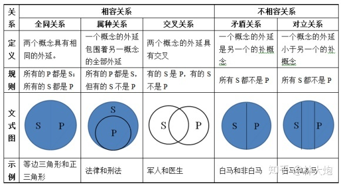
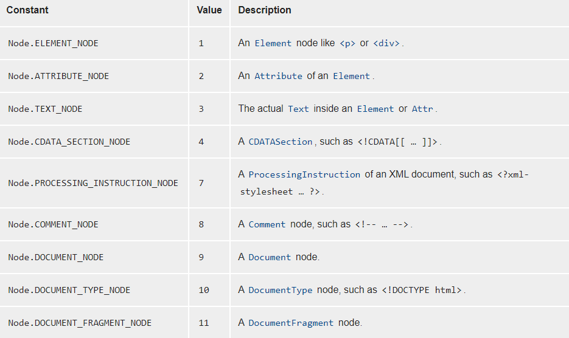

### ✍️ Tangxt ⏳ 2021-03-07 🏷️ 虚拟 DOM

# 08-DOM 基础、初级 DOM 编译-1

> 任何一个东西被完全淘汰都会有一个过程，毕竟，当初它一统江湖的时候，也是击败了许多对手！ -> 例子：`defineProperty` -> 还有框架在用它！ -> 但目前是推荐使用`Proxy`的！

上节课的知识唯有在实践中才能明白它们的作用！

1）DOM 操作

> DOM 涉及到很多外延的东西



> [逻辑学中「外延」与「内涵」是什么意思？ - 林大炮的回答 - 知乎](https://www.zhihu.com/question/22267682/answer/1644637486)

vDOM（虚拟 DOM，全世界的人都这么叫）总会关联到真实 DOM，不然 vDOM 一点意义都没有，毕竟我们要在页面里边看到东西啊！

- DOM（由各种节点构成）
  - DOM 节点 -> 判断节点、节点相关信息、如何找节点
  - DOM 操作 -> 如何创建？添加？删除？
  - 文档碎片 -> IE6 那个年代就有的东西，但一直就咩有被大家所重视起来，因为我们找不到应用场景呀！
    - 它有很多优势，如性能、操作便利上等
    - 后续经常会用到
  - DOM 属性 -> 添加属性（不一定是`.xxx`这样加属性）、遍历属性
  - 编译 DOM 节点 -> 给 vDOM 铺路
    - 直接用 DOM 性能不好，需要转化成另一种形式 -> 把标签抽离出来！

💡：设计模式是啥？

- 目的：解决问题
- 你遇到的问题：给了你目前**最优的**解决方案

1、节点

节点之间的关系 -> 父子、兄弟

1. 父节点 -> parentNode
2. 子节点 -> 获取元素所返回的都不是数组
   1. children -> **元素节点**
   2. childNodes -> 不常用，但某些场景下，不得不用它！ -> **各种节点**，如文本节点、注释节点、元素节点等
      1. 空格也许对我们没有意义，但对于计算机而言，它是有意义的！它也是一个字符呀！
      2. 我们基本不操作文本节点，毕竟它加不了事件呀！我们都是在元素节点上加的！

💡：节点类型？

根据类型，搞操作！



➹：[Node.nodeType - Web APIs - MDN](https://developer.mozilla.org/en-US/docs/Web/API/Node/nodeType)

---

属性节点基本不会用到，既然不会用它，可为啥会有它呢？因为 HTML 是 XML 的子级呀！这个属性节点是继承自 XML 的，而 XML 是有属性节点的！ -> XML 是透过 `getAttributeNode()` 方法拿到属性节点

`Node.CDATA_SECTION_NODE` -> 几乎不用，早期 HTML 会用到！

💡：document？

一个很特殊的虚拟节点！

可以理解成看不见的顶级元素：

``` html
<document>
  <html>
  </html>
</document>
```

总之，它是 html 元素的父级，它是一个接口，不是一个真的节点的，因为我们不需要写这个节点！

它保存了各种各样的方法，帮助我们找到各种元素节点等……

它是节点，意味着它有`nodeType`

💡：`document`有父级？

什么叫父级？

- 以`parentNode`的角度来判断 -> 它咩有父级，返回值是`null` -> 所以`document`就是头，没有父级 -> 也许你会问，既然你是头，可你又是如何存在的呢？就像是先有鸡还是先有蛋一样 -> 特殊节点
- 从对象所属关系上，它是属于`window`的！ -> `document`也是一个全局属性呀！

总之，`document`是没有节点上的父级的！

那`window`又是怎么来的呢？ -> `window.parent`

总之，可以把`window`理解成系统对象，开天辟地依赖这东西就存在了！ -> 系统给的，你就用就行了！不要管它是怎么来的！

💡：自己写的组件的 nodeType 是啥？

1. 编译后都是元素了
2. 可以自己定义

💡：兄弟节点？

1. previousSibling -> 上一个同辈节点 -> 一般不用，因为不会操作文本节点
2. nextSibling
3. previousELementSibling -> 上一个同辈元素 -> 有兼容问题
4. nextELementSibling

💡：把添加文本读作「加点字」

字意味着你看得见的东西！

💡：DOM 操作？

一般来说，有几大类的操作：

1. 创建（下边三个点是在创建地球人，但我们还可以创建外星人）
   1. `document.createElement('button')` -> 常用
   2. `document.createTextNode('dadaa')` -> 加字 -> 常用
   3. `document.createComment('dada')` -> 有大用，不写内容就是空注释 -> 作用，用作占位符，将来会把其替换成我们想要的真正节点
   4. 创建其它标准下的元素
      1. 创建一个其它命名空间里边的元素：`document.createElementNS`，如SVG标签，它不是真正的HTML标签，它只是方便了我们写在HTML内部罢了，它是另一套标准下的东西 -> 地球里边混入了一个外星人，但这个人的呼吸不是吸氧气的，而是其它的……
2. 加入到页面当中（东西创建的再好也没用 -> 你必须把它们加到页面的DOM结构中去啊！）
3. 删除、替换


