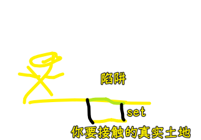
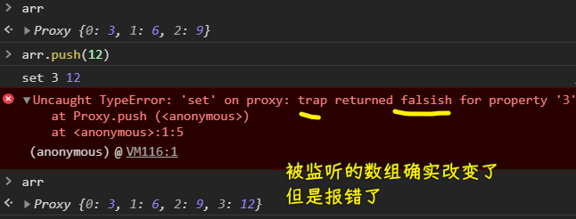
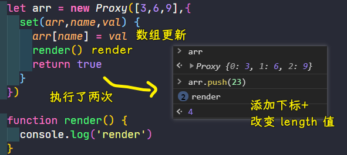
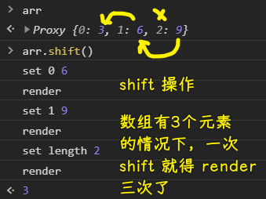
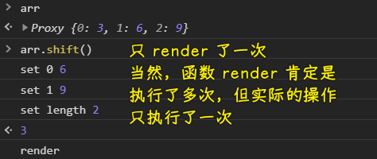
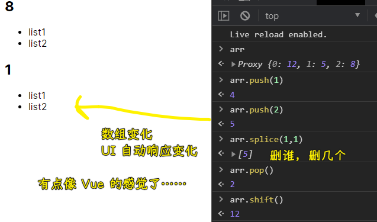
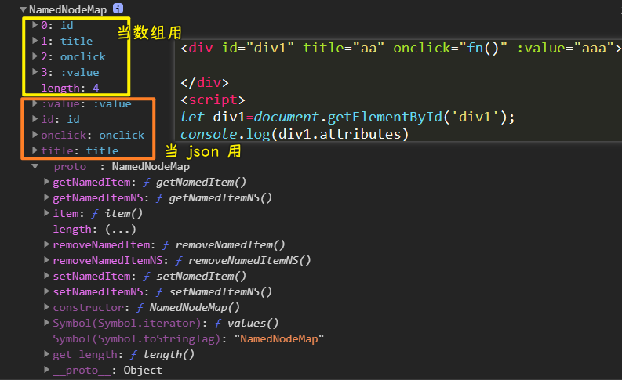
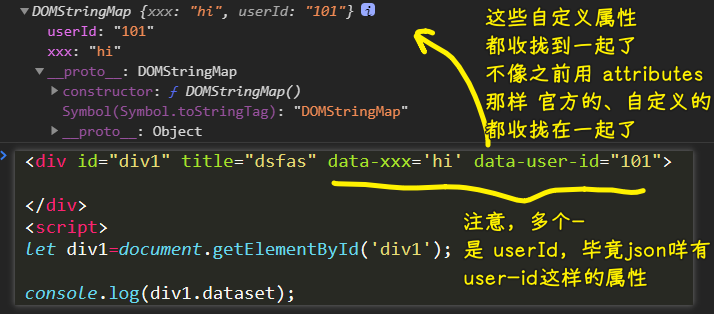

### ✍️ Tangxt ⏳ 2021-03-08 🏷️ DOM

# 09-DOM 基础、初级 DOM 编译-2

1）数组的可响应

数组有多少个元素，那么页面就有多少个元素

如何把数组变成是可响应的状态？

> 在写 `proxy` 的时候， `get` 不用写，因为默认就能拿！

`set` 函数被叫做所谓的 `trap` 函数（陷阱函数） -> 你以为自己脚踏实地了，实际中了陷阱后才脚踏实地……



💡：为什么在写 `set` 的时候要返回 `true` ？

不返回 `true` ：

``` js
let arr = new Proxy([3, 6, 9], {
  set(arr, name, val) {
    console.log('set', name, val)
    arr[name] = val
  }
})
```



返回 `true` ：

``` js
let arr = new Proxy([3, 6, 9], {
  set(arr, name, val) {
    console.log('set', name, val)
    arr[name] = val
    return true
  }
})
```


你 `proxy` 了一个数组，当你 `arr.push(1)` 一个元素时，相当于是做了两个操作：

1. 添加一个索引
2. 改变`length`的值

如果你写返回 `true` ，那么就是返回 `undefined` ，即返回一个
`falsish` 值！

返回 `true` 意味着可以继续 `set` ！

> 为什么 `proxy` 不去优化数组这些操作： `push` 等 -> 把多次搞成是一次？ -> 因为我们有时候就是需要一次属性改变，就得 `set` 一次……而不是把两次改属性合并成 `set` 一次这样！ -> 总之， `push` 被拆成了两次操作！就得 `set` 两次

💡：数组更新后就 `render` ？

问题：



目前来看，一个 `push` 操作， `render` 两次没啥问题，性能上看还好，但如果你做 `shift` 操作呢？



当被监听的数组有好几千个元素的时候，一次 `shift` 操作，就得 `render` 好几千次了！ -> 显然，这会让页面卡死！

所以，如何把重复的 `render` 给干掉呢？

注意，导致重复 `render` ，不仅仅是使用 `push/shift` 这样的 API，还有开发者连续修改数组的数据，如 `arr[0] = 66` 、 `arr[2]=77` 等这样 -> 为何不合并起来一次性 `render` 呢？非得一次赋值，就来一次 `render` 吗？

野路子方法解决问题（很多场景都可以这样用）：

把同步操作化为了异步操作

``` js
let arr = new Proxy([3, 6, 9], {
  set(arr, name, val) {
    console.log('set', name, val)
    arr[name] = val
    render()
    return true
  }
})

let timer = null

function render() {
  // 把下一次的回调给砸了，如果没有下一次，那就执行回调呗！
  clearTimeout(timer)
  timer = setTimeout(function() {
    console.log('render')
  }, 0)
}
```



不断地关定时器，开定时器，虽然也有内存上的开销，但相较于多次 `render` ，这点开销算是毛毛雨了……

关于定时器的 `0ms` （其它浏览器都是这样、Node.js 也是这样） ：

> 加 `0` 是为了可读性，也表明栈内存没东西后，请快速执行回调，不需要延时 -> 有写低版本浏览器不加这个参数，会有问题的！

同步：

``` js
console.log('aaa')
console.log('bbb')
console.log('ccc')
// 按顺序输出结果
```

异步：

``` js
console.log('aaa')
setTimeout(() => {
  console.log('bbb')
}, 0);
console.log('ccc')
// aaa 、ccc、bbb
```

为什么要让 `bbb` 最后输出？ -> 等后边的操作都处理完后，才去搞我们真正要做的事儿 -> 类比 `render` ，让代码不要着急 `render` ，毕竟遇事先停 6 秒！

> 我国古籍《吕氏春秋》中记载了一个故事：楚国边境城邑卑梁和吴国接壤。一天，吴国姑娘采桑叶时不小心踩了卑梁姑娘的脚。卑梁姑娘的家人随后来评理，吴国人非但没有好言赔礼，反而出言不逊：“小孩子做游戏受了点伤，你们还想来讹我们吗？”卑梁人很生气，争执之下打死了吴国人，吴国人纠集几十号人，杀了卑梁的那家人。卑梁的守城官大怒，发兵杀光吴国边境的。老幼。吴王非常震怒，发兵把卑梁夷为平地。吴楚两国因此发生大战，后来吴国攻入了楚国都城郢都，将楚国灭亡。
>  
> 这个真实可叹的历史悲剧说明一个道理：不经过大脑的冲动言行可能导致难以想象的后果，这就是如今我们常说的“蝴蝶效应”。所以，《管子·形势解》告诫我们“择可言而后言，择可行而后行”，一言一行都要深思熟虑。
>  
> 心理学家研究发现，人脑中最古老的边缘系统主管情绪，而最晚进化来的大脑皮层主管认知。任何事情发生后，边缘系统会第一时间产生情绪反应，如恐惧、愤怒、喜悦等，约 6 秒钟后，大脑皮层才能做出认知处理。也就是说，冲动是原始人的行为，深思熟虑才是文明人该做的。原始和文明、冲动与理智之间只隔着 6 秒钟。因此，遇到让我们生气的事情，想发脾气或动手时，一定要控制住冲动，深呼吸 6 秒钟后，再选择应对之策，往往会得到更加理智和正确的决策。
>  
> 每一句话都仔细思考之后再说，每一个行为都仔細权衡后再做，我们就会减少很多失误、后悔，也更加值得别人信赖。

➹：[遇事先停 6 秒钟美文](http://m.ruiwen.com/jingdianmeiwen/2075297.html)

---

目前我们做了两件事：

1. 让数组可响应
2. 把无效地`render`给取消掉！

2）渲染真正的东西

> 数组变化，UI 响应变化

``` html
<div id="root">
  <!-- 模板元素 -->
  <div class="box">
    <h2>sssss</h2>
    <ul>
      <li>list1</li>
      <li>list2</li>
    </ul>
  </div>
</div>

<script>
  let arr = new Proxy([12, 5, 8], {
    set(arr, name, val) {
      arr[name] = val;
      render();

      return true;
    },
  });

  //
  let root = document.querySelector("#root");
  let box = document.querySelector(".box");
  let frag = document.createDocumentFragment();
  // 让模板从页面消失
  frag.appendChild(box);

  let timer = null;

  function render() {
    clearTimeout(timer);
    timer = setTimeout(function() {
      // 性能很低
      root.innerHTML = "";

      arr.forEach((item) => {
        // 深 clone 一份一模一样的模板
        let el = frag.cloneNode(true);

        el.children[0].getElementsByTagName("h2")[0].innerHTML = item;

        // 每次添加的元素都是独有的 -> 像唯一 id 这样
        root.appendChild(el);
      });
    }, 0);
  }

  //初始渲染
  render();
</script>
```

效果：



Vue 极其庞大和复杂，但其里边的核心原理，就如上边所写的代码这样！

---

可以看到，我们的 DOM 操作也是可以玩出花来的 -> `proxy` 配合模板这样响应式渲染还是挺不错的！

> 目前这个 `render` 方法还有很多可以改进的空间！

3）DOM 属性

之前说了 DOM 的节点怎么玩，一些 DOM 的操作怎么搞，接下来就说一下「DOM 属性」 -> 这个很重要！

💡： `.title` vs `getAttribute('title')` ？

``` html
 <div id="div1" userid="56">

 </div>
 <script>
   let div1 = document.getElementById('div1');

   console.log(div1.getAttribute('userid'));
 </script>
```

如果你在元素上写了一个自定义属性： `xxx` ，那么你用 `.` 去读取它的话，那么读到的值就是 `undefined` 了

而如果你用 `getAttribute` ，那么你读到的值就是你想要的拿到的值了！

总之， `.` 只读标准的 HTML 属性，如 `id/class` 等，这些属性浏览器都会帮我们解析好，然后放到 DOM 对象上作为一个属性存在，方便我们开发者读取

浏览器是人写的，如果要**把标签抽象成 DOM 对象**的话，那么显然会把写在 HTML 标签上看得懂的属性给解析出来，然后放到 DOM 对象旗下，而看不懂的就不解析了，毕竟谁会增加自己的工作量啊！

而 `getAttribute` 则是会真正地去标签上找这个属性，即便这个属性没见过的或者说自定义的都会给你找出来！

总之， `getAttribute` 的特点就是 -> **自定义属性也给你找出来！**

同理，关于 `div1.user = 'dada'` 这样赋值添加属性：

这个赋值，不会让页面的 DOM 结构出现 `user` 这个属性，它只会存在于 `div1` 这个 DOM 对象身上，毕竟，这个属性浏览器是不认识的，既然不认识，那就没必要把它放到页面的 DOM 结构里边了 -> 如果放了，万一出事了咋办？

当你 `let div2 = div1.cloneNode(true);` 的时候， `div2.user` 的结果是 `undefined` ，可以看到 `user` 这个属性咩有被 `clone` 下来的，当然，你会想着用 `div2.getAttribute('user')` 这样去获取自定义属性 -> 结果是 `null`

如果你用了 `div1.setAttribute('user','666')` 添加属性，那么 `cloneNode` 也会把自定义属性 `user` 给 `clone` 过去！而且它也会真得把自定义属性放到 HTML 标签里边

> 通过 `setAttribute` 添加到 HTML 标签上的非官方给的属性，我们同样无法用 `.` 来读取这个非官方属性！

总之，不要用 `.` 去读取自定义属性，也不要用 `.` 去添加属性！ -> `get/setAttribute` 后边会经常用到，因为像 `@click、v-if` 等这样的非官方属性，在 Vue 里边就经常会被使用到！

4）获取标签上所有的属性



`div1.attributes` -> 返回一个 `NamedNodeMap` -> 意味着可以把值当成是数组用，也可以当成是 json 用！ -> 可对数组用 `for` 循环、也可以对 json 用 `for...in`

它可以拿到所有属性，即便是像 `:value` 这样的自定义属性

言归正传，拿到写在标签上的所有属性以及相应的属性值：

``` js
Array.from(div1.attributes).forEach(attr => {
  console.log(attr.name, attr.value);
});
```

5）自定义属性

话说，在 HTML 标签上塞一些别人没见过的属性，这种姿势好吗？ 

虽然这种姿势也是可行的，但官方提供了一种自定义姿势 `data-xxx` -> 这种姿势显然更规范



`data-*` 特点：

1. 受官方保护的（在未来的 HTML 的版本当中不会有冲突） -> 如果不用官方认可的，那么如果你写一个`bind`这样的自定义属性，万一未来这个属性被官方给征用了呢？那么当你用新版本浏览器打开这个页面的时候，这个`bind`属性显然是有实际意义的，所以你就得把这个`bind`属性给改了！ -> 你写了`data-`开头这样的属性，意味着以后不会出现一个拿`data-`开头的东西作为属性，毕竟 W3C 规定了，`data-`开头就是自定义属性了！
2. 直接遍历 -> 之前我们用`attributes`，不管是官方给的属性，还是自定义的属性，都搞到一起 -> 这个`data-`直接就给了一个我们获取自定义属性的独立空间

`data-*` 的用途其实挺有限的！

> W3C 就像联合国 -> 有名无实 -> 被浏览器厂商打脸！

💡：我们学 DOM 是为了什么？

操作节点呀！ -> 最终目标：实现一个属于自己的 MVVM 框架

要实现这个最终目标，显然，我们要做一个重要的事儿：那就是编译真实的 DOM 节点！

所谓编译：

就是把：

``` html
<div id="div1" title="dsfas" data-xxx="hi" data-user-id="101" v-if="" @click="">

</div>
```

这个结果，编译成虚拟DOM，把一些功能性的属性给拎出来，如`v-if`、`@click`这样的属性


