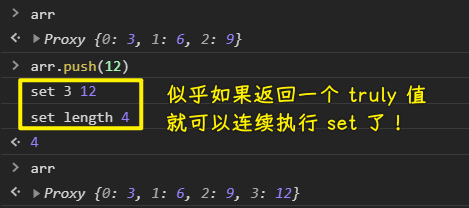
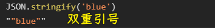
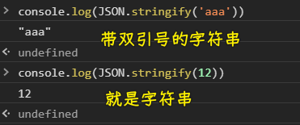
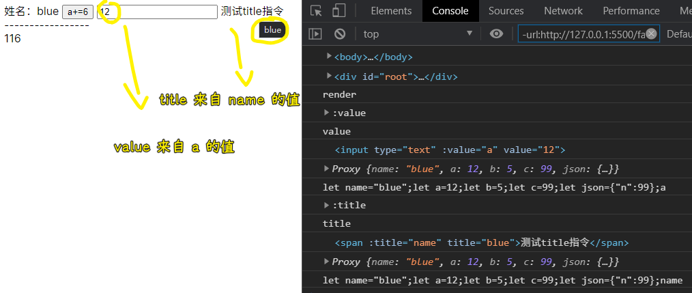

### ✍️ Tangxt ⏳ 2021-03-08 🏷️ DOM

# 09-DOM 基础、初级 DOM 编译-2

### <mark>1）数组的可响应</mark>

数组有多少个元素，那么页面就有多少个元素

如何把数组变成是可响应的状态？

> 在写 `proxy` 的时候， `get` 不用写，因为默认就能拿！

`set` 函数被叫做所谓的 `trap` 函数（陷阱函数） -> 你以为自己脚踏实地了，实际中了陷阱后才脚踏实地……


💡：为什么在写 `set` 的时候要返回 `true` ？

不返回 `true` ：

``` js
let arr = new Proxy([3, 6, 9], {
  set(arr, name, val) {
    console.log('set', name, val)
    arr[name] = val
  }
})
```


返回 `true` ：

``` js
let arr = new Proxy([3, 6, 9], {
  set(arr, name, val) {
    console.log('set', name, val)
    arr[name] = val
    return true
  }
})
```



你 `proxy` 了一个数组，当你 `arr.push(1)` 一个元素时，相当于是做了两个操作：

1. 添加一个索引
2. 改变`length`的值

如果你写返回 `true` ，那么就是返回 `undefined` ，即返回一个
`falsish` 值！

返回 `true` 意味着可以继续 `set` ！

> 为什么 `proxy` 不去优化数组这些操作： `push` 等 -> 把多次搞成是一次？ -> 因为我们有时候就是需要一次属性改变，就得 `set` 一次……而不是把两次改属性合并成 `set` 一次这样！ -> 总之， `push` 被拆成了两次操作！就得 `set` 两次

💡：数组更新后就 `render` ？

问题：


目前来看，一个 `push` 操作， `render` 两次没啥问题，性能上看还好，但如果你做 `shift` 操作呢？


当被监听的数组有好几千个元素的时候，一次 `shift` 操作，就得 `render` 好几千次了！ -> 显然，这会让页面卡死！

所以，如何把重复的 `render` 给干掉呢？

注意，导致重复 `render` ，不仅仅是使用 `push/shift` 这样的 API，还有开发者连续修改数组的数据，如 `arr[0] = 66` 、 `arr[2]=77` 等这样 -> 为何不合并起来一次性 `render` 呢？非得一次赋值，就来一次 `render` 吗？

野路子方法解决问题（很多场景都可以这样用）：

把同步操作化为了异步操作

``` js
let arr = new Proxy([3, 6, 9], {
  set(arr, name, val) {
    console.log('set', name, val)
    arr[name] = val
    render()
    return true
  }
})

let timer = null

function render() {
  // 把下一次的回调给砸了，如果没有下一次，那就执行回调呗！
  clearTimeout(timer)
  timer = setTimeout(function() {
    console.log('render')
  }, 0)
}
```


不断地关定时器，开定时器，虽然也有内存上的开销，但相较于多次 `render` ，这点开销算是毛毛雨了……

关于定时器的 `0ms` （其它浏览器、Node.js 都支持这样做） ：

> 加 `0` 是为了可读性，也表明栈内存没东西后，请快速执行回调，不需要延时 -> 有写低版本浏览器不加这个参数，会有问题的！

同步：

``` js
console.log('aaa')
console.log('bbb')
console.log('ccc')
// 按顺序输出结果
```

异步：

``` js
console.log('aaa')
setTimeout(() => {
  console.log('bbb')
}, 0);
console.log('ccc')
// aaa 、ccc、bbb
```

为什么要让 `bbb` 最后输出？ -> 等后边的操作都处理完后，才去搞我们真正要做的事儿 -> 类比 `render` ，让代码不要着急 `render` ，毕竟遇事先停 6 秒！

> 我国古籍《吕氏春秋》中记载了一个故事：楚国边境城邑卑梁和吴国接壤。一天，吴国姑娘采桑叶时不小心踩了卑梁姑娘的脚。卑梁姑娘的家人随后来评理，吴国人非但没有好言赔礼，反而出言不逊：“小孩子做游戏受了点伤，你们还想来讹我们吗？”卑梁人很生气，争执之下打死了吴国人，吴国人纠集几十号人，杀了卑梁的那家人。卑梁的守城官大怒，发兵杀光吴国边境的。老幼。吴王非常震怒，发兵把卑梁夷为平地。吴楚两国因此发生大战，后来吴国攻入了楚国都城郢都，将楚国灭亡。
>  
> 这个真实可叹的历史悲剧说明一个道理：不经过大脑的冲动言行可能导致难以想象的后果，这就是如今我们常说的“蝴蝶效应”。所以，《管子·形势解》告诫我们“择可言而后言，择可行而后行”，一言一行都要深思熟虑。
>  
> 心理学家研究发现，人脑中最古老的边缘系统主管情绪，而最晚进化来的大脑皮层主管认知。任何事情发生后，边缘系统会第一时间产生情绪反应，如恐惧、愤怒、喜悦等，约 6 秒钟后，大脑皮层才能做出认知处理。也就是说，冲动是原始人的行为，深思熟虑才是文明人该做的。原始和文明、冲动与理智之间只隔着 6 秒钟。因此，遇到让我们生气的事情，想发脾气或动手时，一定要控制住冲动，深呼吸 6 秒钟后，再选择应对之策，往往会得到更加理智和正确的决策。
>  
> 每一句话都仔细思考之后再说，每一个行为都仔細权衡后再做，我们就会减少很多失误、后悔，也更加值得别人信赖。

➹：[遇事先停 6 秒钟美文](http://m.ruiwen.com/jingdianmeiwen/2075297.html)

---

目前我们做了两件事：

1. 让数组可响应
2. 把无效地`render`给取消掉！

### <mark>2）渲染真正的东西</mark>

> 数组变化，UI 响应变化

``` html
<div id="root">
  <!-- 模板元素 -->
  <div class="box">
    <h2>sssss</h2>
    <ul>
      <li>list1</li>
      <li>list2</li>
    </ul>
  </div>
</div>

<script>
  let arr = new Proxy([12, 5, 8], {
    set(arr, name, val) {
      arr[name] = val;
      render();

      return true;
    },
  });

  //
  let root = document.querySelector("#root");
  let box = document.querySelector(".box");
  let frag = document.createDocumentFragment();
  // 让模板从页面消失
  frag.appendChild(box);

  let timer = null;

  function render() {
    clearTimeout(timer);
    timer = setTimeout(function() {
      // 性能很低
      root.innerHTML = "";

      arr.forEach((item) => {
        // 深 clone 一份一模一样的模板
        let el = frag.cloneNode(true);

        el.children[0].getElementsByTagName("h2")[0].innerHTML = item;

        // 每次添加的元素都是独有的 -> 像唯一 id 这样
        root.appendChild(el);
      });
    }, 0);
  }

  //初始渲染
  render();
</script>
```

效果：


Vue 极其庞大和复杂，但其里边的核心原理，就如上边所写的代码这样！

---

可以看到，我们的 DOM 操作也是可以玩出花来的 -> `proxy` 配合模板这样响应式渲染还是挺不错的！

> 目前这个 `render` 方法还有很多可以改进的空间！

### <mark>3）DOM 属性</mark>

之前说了 DOM 的节点怎么玩，一些 DOM 的操作怎么搞，接下来就说一下「DOM 属性」 -> 这个很重要！

💡： `.title` vs `getAttribute('title')` ？

``` html
 <div id="div1" userid="56">

 </div>
 <script>
   let div1 = document.getElementById('div1');

   console.log(div1.getAttribute('userid'));
 </script>
```

如果你在元素上写了一个自定义属性： `xxx` ，那么你用 `.` 去读取它的话，那么读到的值就是 `undefined` 了

而如果你用 `getAttribute` ，那么你读到的值就是你想要的拿到的值了！

总之， `.` 只读标准的 HTML 属性，如 `id/class` 等，这些属性浏览器都会帮我们解析好，然后放到 DOM 对象上作为一个属性存在，方便我们开发者读取

浏览器是人写的，如果要**把标签抽象成 DOM 对象**的话，那么显然会把写在 HTML 标签上看得懂的属性给解析出来，然后放到 DOM 对象旗下，而看不懂的就不解析了，毕竟谁会增加自己的工作量啊！

而 `getAttribute` 则是会真正地去标签上找这个属性，即便这个属性没见过的或者说自定义的都会给你找出来！

总之， `getAttribute` 的特点就是 -> **自定义属性也给你找出来！**

同理，关于 `div1.user = 'dada'` 这样赋值添加属性：

这个赋值，不会让页面的 DOM 结构出现 `user` 这个属性，它只会存在于 `div1` 这个 DOM 对象身上，毕竟，这个属性浏览器是不认识的，既然不认识，那就没必要把它放到页面的 DOM 结构里边了 -> 如果放了，万一出事了咋办？

当你 `let div2 = div1.cloneNode(true);` 的时候， `div2.user` 的结果是 `undefined` ，可以看到 `user` 这个属性咩有被 `clone` 下来的，当然，你会想着用 `div2.getAttribute('user')` 这样去获取自定义属性 -> 结果是 `null`

如果你用了 `div1.setAttribute('user','666')` 添加属性，那么 `cloneNode` 也会把自定义属性 `user` 给 `clone` 过去！而且它也会真得把自定义属性放到 HTML 标签里边

> 通过 `setAttribute` 添加到 HTML 标签上的非官方给的属性，我们同样无法用 `.` 来读取这个非官方属性！

总之，不要用 `.` 去读取自定义属性，也不要用 `.` 去添加属性！ -> `get/setAttribute` 后边会经常用到，因为像 `@click、v-if` 等这样的非官方属性，在 Vue 里边就经常会被使用到！

### <mark>4）获取标签上所有的属性</mark>


`div1.attributes` -> 返回一个 `NamedNodeMap` -> 意味着可以把值当成是数组用，也可以当成是 json 用！ -> 可对数组用 `for` 循环、也可以对 json 用 `for...in`

它可以拿到所有属性，即便是像 `:value` 这样的自定义属性

言归正传，拿到写在标签上的所有属性以及相应的属性值：

``` js
Array.from(div1.attributes).forEach(attr => {
  console.log(attr.name, attr.value);
});
```

### <mark>5）自定义属性</mark>

话说，在 HTML 标签上塞一些别人没见过的属性，这种姿势好吗？ 

虽然这种姿势也是可行的，但官方提供了一种自定义姿势 `data-xxx` -> 这种姿势显然更规范


`data-*` 特点：

1. 受官方保护的（在未来的 HTML 的版本当中不会有冲突） -> 如果不用官方认可的，那么如果你写一个`bind`这样的自定义属性，万一未来这个属性被官方给征用了呢？那么当你用新版本浏览器打开这个页面的时候，这个`bind`属性显然是有实际意义的，所以你就得把这个`bind`属性给改了！ -> 你写了`data-`开头这样的属性，意味着以后不会出现一个拿`data-`开头的东西作为属性，毕竟 W3C 规定了，`data-`开头就是自定义属性了！
2. 直接遍历 -> 之前我们用`attributes`，不管是官方给的属性，还是自定义的属性，都搞到一起 -> 这个`data-`直接就给了一个我们获取自定义属性的独立空间

`data-*` 的用途其实挺有限的！

> W3C 就像联合国 -> 有名无实 -> 被浏览器厂商打脸！

💡：我们学 DOM 是为了什么？

操作节点呀！ -> 最终目标：实现一个属于自己的 MVVM 框架

要实现这个最终目标，显然，我们要做一个重要的事儿：那就是编译真实的 DOM 节点！

所谓编译：

就是把：

``` html
<div id="div1" title="dsfas" data-xxx="hi" data-user-id="101" v-if="" @click="">

</div>
```

这个真实存在的元素，变成我们的虚拟 DOM 元素，以及把一些功能性的属性（与框架相关的属性、自定义的属性）给拎出来，如 `v-if` 、 `@click` 这样的属性 -> 像 `id、title` 这样的属性，Vue 一点也不关心，它只关心与自己相关的属性

总之，我们要做的：

1. 把真实 DOM 搞成虚拟 DOM
2. 拿到与框架相关的属性，如`v-if、@click`这样的属性

### <mark>6）编译 DOM 节点</mark>

> 做一个初级版本 -> 这是一个可大可小的实践 -> 未来会有很复杂的东西在里边

功能：

1. 可识别`🟡🟡🟡🟡`
2. 可计算`🟡🟡a+b🟡🟡`
3. 可点击`🟡🟡+1🟡🟡`

如何写？

step1：确定要被处理的真实 DOM

``` html
<div id="root">
  姓名：🟡🟡name🟡🟡

  <button type="button" @click="add">a+=6</button>

  <div class="">
    -----------------
  </div>

  🟡🟡a+b+json.n🟡🟡
</div>
```

step2：类名确定，不要用 Vue 这个名字，以防侵权

``` js
class Blue {
  constructor(options = {}) {

  }
  render() {

  }
}
```

step3：确定如何使用这个 `class` ？

``` js
let blue = new Blue({
  root: '#root',
  data() {
    return {
      name: 'blue',
      a: 12,
      b: 5,
      c: 99,
      json: {
        n: 99
      }
    }
  },
  methods: {
    add() {
      this.a += 6;
    }
  }
})
```

step4：断言——使用者乱传数据给予警告

> 提取成一个函数，是因为作为类的方法没有意义，实例用这些方法没有意义呀！

``` js
function assert(exp, msg) {
  if (!exp) {
    throw new Error(msg);
  }
}

function _getElement(obj) {
  assert(obj, 'root is required');

  if (typeof obj == 'string') {
    let el = document.querySelector(obj);
    assert(el, `${obj} not found`);
    return el;
  } else if (obj instanceof HTMLElement) {
    return obj;
  } else {
    assert(false, 'root is invaild');
  }
}
```

step5：开始正式写 `Blue`

1. 使用断言，处理`this._root`
2. 响应式数据 -> `data`
   1. 断言 -> `options.data()` 的返回值
   2. 数据变化 -> `render()`
3. 写`render`
   1. 定时器 -> `timer` 默认为 `0` ，因为定时器 id 值就是数值 -> 避免连续多次 `render`
4. 处理「`data`在`proxy`旗下，而不是`Blue`实例旗下」这个问题
   1. 让`constructor`返回一个`Proxy`实例 -> 虽然返回了一个`Proxy`实例，但`constructor`里边的`this`依旧指向的是`Blue`实例 -> **用来顶雷的**
   2. 修改给`new Proxy`参数里边的`this`指向
      1. 姿势 1：用`set(){}` -> 定义一个`_this` -> **老师喜欢用这个，因为不想把每个函数都改写成箭头函数**
      2. 姿势 2：不用`set(){}` -> 用`{set:()=>{}}` -> 箭头函数
5. 为代理的数据写一个`get`方法（可不写） -> 为了调试方便
6. 开始真正地写`render`
   1. 改原先的`render`名为`update` -> 因为不想让`render`里边有判断呀！而且我们把`Blue`这个类看作是基类，之后之类重写`render`的话，就不用影响到定时器了！
7. 保留原始模板 -> 第一次渲染，会把模板里边的占位符搞成是真实的数据 -> 第二次渲染，也就是更新，此时显然也需要用到原先的模板啊！不然，怎么更新数据呢？
   1. 创建一个文档碎片 -> `this._template`
   2. 把写在 HTML 里边的`div#root`搞到这个`this._template`里边去
8. `render` 
   1. `clone`一份原始模板 -> `root`
   2. 对`root`填充相应的数据
   3. 把旧的灯泡给拧下来，把新的灯泡拧上去
9. 如何找到`🟡🟡🟡🟡`？
   1.  在文本节点里边找，属性节点的值可没有`🟡🟡🟡🟡`
   2.  如何拿到`🟡🟡🟡🟡`里边的内容？
       1.  用正则 -> 不要一个个字符去拿，你可以用排除法 -> 不要出现这种占位符：`🟡🟡}}🟡🟡`
   3.  替换内容 -> `replace`的返回值就是取代占位符的值
   4.  `this._data[str]` -> 相当于是 Vue 里边的`this.$data[str]`
10. 如何处理`🟡🟡a+b🟡🟡`这种情况？
    1.  姿势一：使用`with(this._data){ eval('a+b') }` -> `a+b -> this._data.a+this._data.b` -> 严格模式下不能用`with` -> 以前可以用，现在被 JS 作者干掉了！ -> 为什么被干掉了？ -> 会把作用域搞得特别混乱，降低代码的可读性！ -> 或许你会说「不用严格模式，不就行了么？」，但你无法确定使用者是否用了严格模式呀！如果使用者用了严格模式，那代码就凉凉了！
    2.  姿势二：把`eval`这个东西用得彻底一点 -> 构建`a、b、name`等变量 -> `let a = this._data['a']` -> 获取字符串值的时候，会把引号去掉 -> 利用`JSON.stringify()`加引号
11. 如何做事件处理 -> `@click`？
    1.  为什么属性加`@`？ -> 打一个标志 -> 好判断这是一个搞事件的属性 -> 不然，你直接`click`这样的话，就得一个个用`if`去判断这个`click`是不是`'click'`这样了……
    2.  在哪找？
        1.  不会去文本节点里边找 -> 去属性节点里边找
    3.  `@click="add" vs @click="add()"` -> 没括号比有括号要做得活更少 -> 如果有括号，还得处理一下
        1.  还是用到`eval`去拼数据 -> 把`methods`里边的`add`方法搞到事件监听器里边：`let add=this._methods["add"];add.call(this._data)`
    4.  `methods`旗下的方法里边的`this`确定，可选择的指向：
        1.  `new Blue()`这个实例
        2.  `new Proxy()`这个实例
        3.  `this._data` -> **选择这个**

---

`Blue`实现代码（编译 DOM 节点的核心代码）：

``` js
class Blue {
  constructor(options = {}) {
    this._root = _getElement(options.root);

    //
    this.timer = 0;

    //assert 从简
    const _this = this;
    let proxy = new Proxy(options.data(), {
      get(data, name) {
        assert(name in data, `data '${name}' is not found`);

        return data[name];
      },
      set(data, name, val) {
        data[name] = val;

        _this.update();

        return true;
      },
    });

    this._parent = this._root.parentNode;
    // this._template=document.createDocumentFragment();
    // this._template.appendChild(this._root);
    this._template = this._root.cloneNode(true);

    //保存所有 methods
    this._methods = options.methods || {};

    this.update();

    this._data = proxy;
    return proxy;
  }

  update() {
    clearTimeout(this.timer);
    this.timer = setTimeout(() => {
      this.render();
    }, 0);
  }

  render() {
    console.log("render");

    let root = this._template.cloneNode(true);

    //1. 找到所有的模板 (🟡🟡🟡🟡)
    Array.from(root.childNodes).forEach((child) => {
      if (child.nodeType == document.TEXT_NODE) {
        child.data = child.data.replace(/\{\{[^\}]+\}\}/g, (str) => {
          str = str.substring(2, str.length - 2).trim();

          let arr = [];
          for (let key in this._data) {
            arr.push(`let ${key}=${JSON.stringify(this._data[key])};`);
          }
          arr.push(str);

          return eval(arr.join(""));
        });
      }
    });

    //2. 找到所有的事件
    Array.from(root.children).forEach((child) => {
      Array.from(child.attributes).forEach((attr) => {
        if (attr.name.startsWith("@")) {
          let evname = attr.name.substring(1);

          child.addEventListener(
            evname,
            () => {
              let arr = [];
              for (let key in this._methods) {
                arr.push(`let ${key}=this._methods[${JSON.stringify(key)}];`);
              }
              arr.push(attr.value + ".call(this._data)");
              console.log(arr.join(""));
              eval(arr.join(""));
            },
            false
          );
        }
      });
    });

    //新的元素换进去
    this._parent.replaceChild(root, this._root);
    this._root = root;
  }
}
```
---

目前，我们实现了核心功能 -> **能实现是一回事儿，但搞明白这个实现又是另外一回事儿了** -> 自己写一遍才能知道自己是否真得明白了

这个实现，还有大量的值得我们去改进的地儿：

1. 适用面很窄
   1. 不能`add()`这样加括号 -> 无括号是一个版本，有括号又是另一个版本了 -> 需要自己去判断
   2. 不能`xxx.add()`这样 -> 当然，Vue 好像就只有`add`和`add()`这两种情况了！

总之，对于这个实现还有很多事情要做 -> 这个 DOM 编译目前仅仅只是很初级的版本，它还有很多问题存在

> 这是一个很高级的内容 -> 即便搞了 5 年 js 的人来写这玩意儿，都得想好一会儿才能搞出来！ -> 对于 blue 老师而言，这是高级内容，对其他人而言，就不知道是不是了……每个人心中都有一杆秤……

💡：构造函数的另类用法？

对于 Java 开发者而言，这个用法会让他们感到不适应……

在 JS 里边， `constructor` 居然有返回值，你返回一个 json，那么 `new` 这个类的结果，就是这个 json 了（返回数组也行） -> 注意：得是返回对象才行，如果你返回一个数字 `12` ，那么结果不会把 `12` 包装成对象，而是真正的类实例

对于其它正常的普通语言来说， `constructor` 是不能有返回值的！

``` js
class A {
  constructor() {
    return {
      a: 12,
      b: 5
    };
  }
}

let a = new A();
console.log(a); // {a:12,b:5}
```

💡：Vue 和 React？

内部原理实现 -> 技术上没啥说很难的 -> 难的是，第一个想到的！

💡：`JSON.stringify()`？

配合`eval`使用 -> 字符串值会变成变量 -> 添加引号后，就是字符串了！



进一步理解：



💡：为什么处理事件代码不这样写？

``` js
Array.from(ele.attributes).forEach(attr=>{
  if(attr.name.startsWith('@')) {
    let eventName = attr.name.slice(1)
    let eventFn = options.methods[attr.value]
    console.log(eventFn)
    res.addEventListener(eventName,eventFn,false)
  }
})
```

这样做也是可以的，但这有一个问题，那就是`methods`人家不填呢？

代码不存在必须这样搞，第二个方法不行这种情况，所以不要觉得老师这种写法就是唯一的！ -> 这还有更好地实现，只是你没有发现罢了！

### <mark>7）作业</mark>

加一个功能 -> 不要小看这个功能，如果你能把这个功能做出来，意味着这节课所讲的内容你都会了！

``` html
<input type="text" :value="a">
<span :title="name"></span>
```

解析这个`:value`和`:title` -> 可以不用`:`，可以是`-`等这些字符作为标志 -> 随你

实现：

``` js
if (attr.name.startsWith(":")) {
  // attr -> 属性节点对象
  console.dir(attr);
  let attrName = attr.name.substring(1);
  // 属性值的空格是有意义的，如 class="cls1 cls2"
  // 所以这里不用 trim 了
  let attrValue = attr.value;
  // 去掉：的属性，如 :value -> value
  console.log(attrName);
  // 有：标志属性的节点，如 input 的 :value 和 span 的 :title
  console.log(child);
  let arr = [];
  // Proxy 实例 -> 监听你传的 data 函数的返回值
  // Proxy {name: "blue", a: 12, b: 5, c: 99, json: {…}}
  console.log(this._data);
  for (let key in this._data) {
    arr.push(`let ${key}=${JSON.stringify(this._data[key])};`);
  }
  arr.push(attrValue);
  // let name="blue";let a=12;let b=5;let c=99;let json={"n":99};a
  console.log(arr.join(""));
  // eval 的返回值正是最后一行代码的返回值，也就是 a 的返回值
  attrValue = eval(arr.join(""));
  child.setAttribute(attrName, attrValue);
}
```

效果：



### <mark>8）下节课讲什么</mark>

初步搞虚拟 DOM -> 在真实 DOM 的基础上，抽象出一层虚拟的东西来 -> 以思想、实现核心为主

目前所有主流框架的核心都是虚拟 DOM -> 这是一个好东西