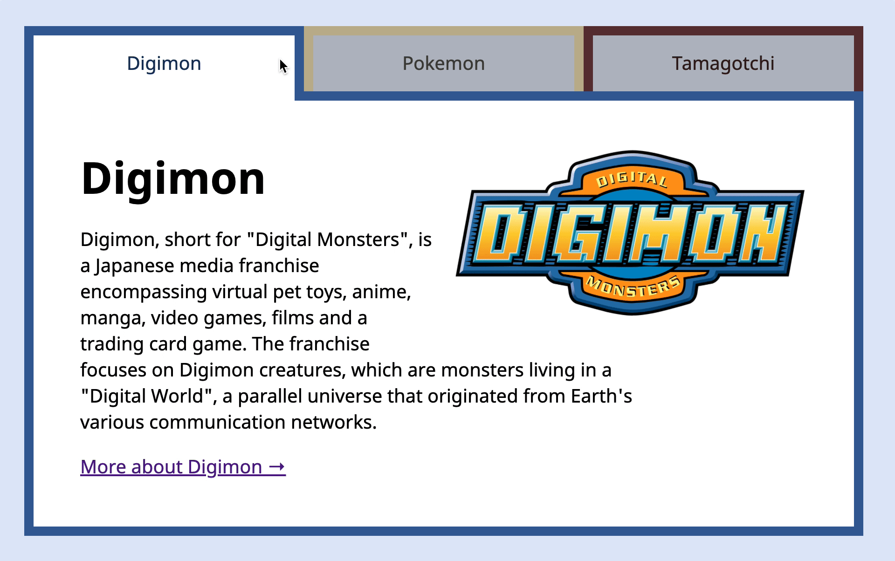
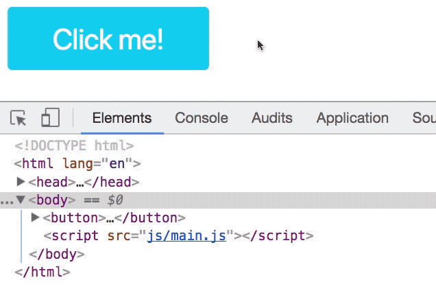
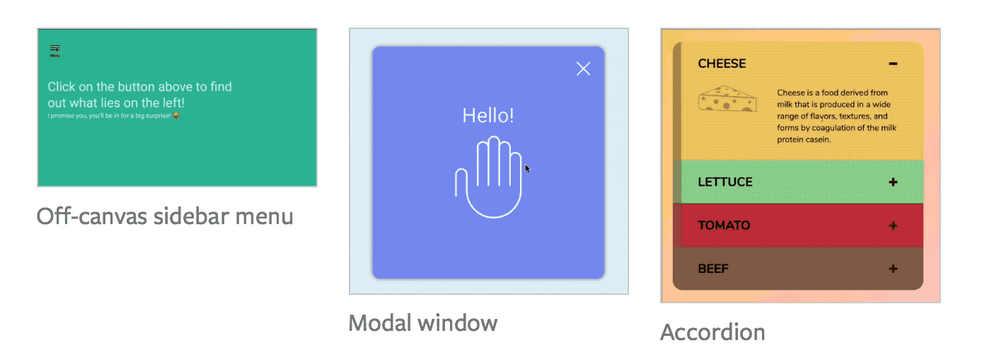

### ✍️ Tangxt ⏳ 2022-02-07 🏷️ JS

# 01-JavaScript 及其生态系统

## ★Welcome to Learn JavaScript!

- 努力学习完这个课程的收获
  - 让你能够在不粘贴代码的情况下使用 JavaScript 从头开始构建东西
- 以下是学习 JavaScript 的最佳方法，用来增强你的学习过程（7 tips）
  - 每天都学一点 JavaScript
    - 30~60 分钟
    - 不要学太多，你的脑袋内一天只能记住这么多，不然多出来的只会被遗忘
    - 不要在疲劳的时候学习，要在你脑袋清醒的状态学习，比如早起 30~60 分钟，当然，如果你真这样做了，那就早点睡吧！
  - 按照你自己的节奏来理解理论部分
    - 理论给你基础，指导你在实践时该怎么去做
    - 对于理论，慢慢品尝，逐字地阅读这个理论
    - 在开始下一节课前，请确保这一节你都理解了，当然，理解一部分也可以，总之，困惑未解除，就不要继续前进了，不然，你就不能很好地学习下一个东西了
    - 一节课完成后，请用自己的话写下你所学到的东西，写作是为了让你理解地跟清晰，以及帮助你更好地记忆，对了，别忘了，请分享你所写的东西，因为这可以让你学到更多，毕竟他人会给出你看不到的问题
    - 在阅读下一节课之前，总结一下你上一节所学到的东西 -> 有助于你的记忆
  - 做你遇到的每一个练习
    - 帮助你巩固你所获得的知识
    - 没有答案 -> 自己到网上去找、去问，然后自己回答它
    - 不知道问啥？没关系，只要你不怕问问题就好了，起初你问的问题可能不那么正确，但你问多了，你就会问出更好的问题 -> 总之，这一切都是朝着问正确问题的方向前进……
    - 问题参考：[chiangs/jsf-solutions: This is a public repo for students of Learn JavaScript with Zell Liew to contribute solutions.](https://github.com/chiangs/jsf-solutions)
  - 提出问题，分享你的答案，并教会别人
    - 经常回答别人的提问
    - 回答问题，即在回忆你曾经学的东西，请用更通俗的话教会别人 -> 帮助你更好地记住和学习 JavaScript
    - 帮助别人，就是帮助自己
  - 编写代码，然后再次构建它（**思考，对比老师的思考 -> 尝试自己写（可选） -> 看老师写，跟着老师的做法手把手敲一遍 -> 不看老师的，自己写出来**）
    - 你要创建一个组件，先把你的想法，怎么做的过程给写下来，然后看看老师是如何思考的，找出你的思路和老师的思路之间的区别
    - 尝试自己写，即便你陷入了困境，总之，这种尝试始终会有好处，写不出来仅仅是你还没有找到一个方法来击破它（可选步骤）
    - 编写教程中的代码时。请确保每个单词都是手动输入的 -> 这可以帮助你通过肌肉记忆来记住这些功能和方法。
    - 自己编写组件代码。如果你可以在不参考解决方案的情况下完成组件，那么你就总结你的经验教训并开始下一课。如果你还是不能自己编写这个代码，那么你就找出你不理解的地方，然后再试一次。
  - 休息一下
    - 学习是一场马拉松。虽然很有趣，但也会很艰难。有时候，你的大脑就是不想合作。你会犯一些愚蠢的错误，然后大脑一片空白。有时候，你只是不想再学习了。
    - 当这种情况发生时，是时候休息一下了
    - 当你休息的时候，你的大脑会组织你所学到的信息，把它们储存在“正确”的地方ーー无论在哪里ーー以便于回忆。
    - 记住，每天练习 30 分钟比每周强迫自己在某一天内学习四小时更有效果。如果你今天休息 15 分钟后觉得需要休息，那就让自己休息一下，明天再回来。坚持是学习的关键。
    - 如果你在训练中刚好超过 60 分钟，那也很好。你已经知道什么时候需要休息来完成马拉松。
  - 成立问责小组
    - 有人和你一起学习是有帮助的。接触社区，介绍你自己，问问是否有人想一起学习 JavaScript。
    - 更好的做法是，与社区分享你的经历ーー你今天学到了什么（学习经验 -> 从实践中得到的知识、技能等），你被什么困住了（遇到的困难），等等。你会激励别人，别人也会反过来激励你。

## ★JavaScript 是用来做什么的？

- 历史
  - 起初页面是静态的，没有生气
  - 用户与页面的交互只有超链接 -> 从一个页面跳到另外一个页面
  - 人们希望页面的互动性更多，比如有动画之类的
  - 我们的目的是「学习如何使用这门语言」，而不是学习「JavaScript 这门语言的历史」
  - 了解 JavaScript 的更多历史：[A Brief History of JavaScript](https://auth0.com/blog/a-brief-history-of-javascript/)
- JavaScript 使页面变得动态
  - 它允许这三件事情发生
    - 它允许你检测用户交互，这使得你的网站可以根据用户的行为做出响应
    - 它允许你改变 HTML 的结构以及它对应的样式
    - 它允许你创建动画
  - 当然，JavaScript 能做的远不止这三件事
    - 它除了能让页面在浏览器上变得动态。它也可以在服务器上使用

例子：

当用户单击下面选项卡接口中的一个选项卡时，屏幕上显示的内容会发生变化，以反映该选项卡包含的内容：

当用户单击按钮时，文档对象模型 (DOM) 中会出现一个名为 `red` 的类，DOM 是浏览器中的 HTML：

创建如下动画：

## ★JavaScript 的生态系统

- frontend：前端包含**用户可以看到**，触摸或感觉到的所有内容；这意味着浏览器中存在的所有内容被归类为前端技术。前端也被称为客户端（client-side）。
- backend：后端包含了**对用户隐藏的内容**；这包括服务器（告诉客户端要显示什么内容的东西）和数据库（存储数据的地方）。为了简单起见，你可以把后端想象为你的计算机。它也被称为服务器端（server-side）。
- 在前端的 JavaScript
  - 在前端的 JavaScript 通过一组被统称为 Web APIs 的函数来与浏览器进行交互。
  - 所有的 Web APIs：[Web APIs - MDN](https://developer.mozilla.org/en-US/docs/Web/API)
  - 在前端 JavaScript 世界中，你还会发现三大类型的代码资源：
    - libraries（库）
      - 一个小型的代码集合
      - 几乎可以让你在 web 上实现你能想到的任何事情
      - 例子
        - [D3](https://d3js.org/)：创建令人惊叹的可视化效果
        - [Axios](https://github.com/axios/axios)：让你可以从其它网站里边获取东西
        - [GSAP](https://greensock.com/gsap)：制作柔滑的平滑动画
        - [jQuery](https://jquery.com/)：解决了不同浏览器中 Web API 实现之间的不一致性，曾经很牛逼，可现代浏览器都是基于约定的规范来构建的，所以我们就不再需要它了！
    - frameworks（框架）
      - 框架是巨大的代码块，需要你以特定的方式编写 JavaScript
      - 它们经常被用来构建 web 应用程序
      - 现在流行的框架有 Angular、React 和 Vue
      - 框架每隔几年来来去去，在 Angular、React 和 Vue 流行之前，Backbone、 Ember 和 Knockout 占据了中心舞台，所以，在未来几年里边，新的框架可能会出现，并且会取代 Angular，React 和 Vue
      - 由于框架要求你以特定的方式构建应用程序，所以换个新框架意味着你需要**抛弃你已经学到的关于以前的框架的所有知识**，唯一能转移的知识就是你对 JavaScript 的了解以及应用程序通常是如何工作的基本知识
      - 还有一些倾向于 CSS 的框架，如 Bootstrap 和 Foundation
    - plugins（插件）
      - 插件是为库或框架提供附加功能的代码块。如果没有特定的库或框架，它们就无法工作
- 在后端的 JavaScript
  - Node.js
    - JavaScript 通过 Node.js 在后端工作（人们通常将 Node.js 称为 Node)
    - 当你在后端编写 JavaScript 时，你需要通过 Node 来把你的 JavaScript 代码转换成计算机可以读取的代码
    - 通过 Node，你可以访问计算机的文件系统（读写文件），也可以启动服务器来让访问者来访问你的网站
  - npm
    - npm 是与 Node 捆绑在一起的包管理器。通过在命令行终端中敲下命令，让你可以快速查找并下载库「libraries」（或包「packages」）。它还可以方便地更新你下载过的库。
  - 启动服务器
    - 如果你想要隐藏远离用户的代码，则需要一个服务器。你可以使用 Node，就像你使用 PHP，Python，Ruby 和其他语言一样
    - 在 Node 中组建一个服务器的常用框架包括 Express、 Koa 和 Hapi
- Tooling
  - 由于 JavaScript 可以在前后端中使用 -> 吸引了许多开发者 -> 导致了 node 和 npm 的爆炸式发展 -> 开发者开始创建库来制造工具
  - Tooling 是一个术语，用来描述使用开发工具的过程
    - 通过提供一个理想环境来帮助开发人员提高编码速度
    - 还可以帮助开发人员自动优化图片等资源
    - 了解更多工具知识？ -> [Automating Your Workflow - Learn how to create an automated workflow using Gulp](https://automateyourworkflow.com/)
    - [xiaoyu2er/automating-your-workflow-with-gulp: 使用 Gulp 来构建你的 workflow](https://github.com/xiaoyu2er/automating-your-workflow-with-gulp)
- 我们应该先学习啥？
  - 在转移到对库、框架、后端、工具的学习之前，我们先集中精力学习 JavaScript 和 Web APIS

## ★不同版本的 JavaScript

- 概述
  - JavaScript **有另一个名字：ECMAScript**
  - ES6 是 ECMAScript 的第 6 版，同理，ES7 就是 ECMAScript 的第七版……每个版本的 ECMAScript 都为我们用户提供了新的 JavaScript 特性
  - ES6 也叫 ES2015，因为它是在 2015 年完成的，所以 ES7 就是 ES2016，ES8 就是 ES2017
  - 任何被提出的但是没有最终定稿的新 JavaScript 特性，都被归类到 **ES.Next**
  - 论文定稿：一般来说论文发表要经过初稿、中稿、定稿三个环节，定稿就是文章的最终版本，也就是经过作者反复修改的版本，是论文发表最终的“成品”。
- ES-year 这个名号具有误导性
  - 比如现在是 2022 年，你就可以使用 ES2022（or ES13）了吗？
    - 不能使用，因为 ES-year 只告诉我们这个规格是什么时候定稿的，它不会告诉你浏览器是否支持规范中最终确定的特性
    - 由于特性需要由不同的浏览器供应商实现，因此你应该通过这个 [兼容性表](https://kangax.github.io/compat-table/es2016plus/) 来注意你想要使用的特性是否被浏览器支持，而不是依赖于 ES-year 名称
- 学习 ES6、ES7、ES8 等等
  - 目前已经是 2022 年了，ES6 在 2015 年就有了，可现在我们依然会听到关于 ES6 的噪音，为啥会这样呢？
    - 因为 ES6 带来了改变我们编写 JavaScript 方式的主要特性。其中一些变化是如此的剧烈，以至于初学者常常完全迷失了方向
- 严格模式
  - ES5 引入了严格模式，以此来帮助我们强制执行更好的代码实践，当我们在 ES3 和 ES5 之间徘徊时，会经常使用它
  - 严格模式过去曾被强烈推荐，因为它可以保护你免受那些被认为已被弃用的实践
  - 在当今世界，我们不需要严格模式，原因有二
    - 这门课程所学到的所有东西都是遵循严格模式的，因此我们没有必要添加`'use strict';`到代码中（如果你的团队中有从 Stack Overflow 拷贝和粘贴代码的 JavaScript 开发者，那么你仍有可能会去添加它，因为 Stack Overflow 里边的一些答案已经过时了，被废弃了，所有你添加严格模式是有道理的）
    - 如果你真得需要添加严格模式，那么这不需要你手动去添加，因为 Babel 会自动帮你添加
      - transpiler：将 ES.Next 和其它最先进的 JavaScript 的特性转换成 ES5 代码，如 Babel
      - [5 cutting edge JavaScript features to improve your code - StartFunction](https://startfunction.com/cutting-edge-javascript-features/)
  - 对严格模式了解更多：[严格模式 - JavaScript - MDN](https://developer.mozilla.org/zh-CN/docs/Web/JavaScript/Reference/Strict_mode)
