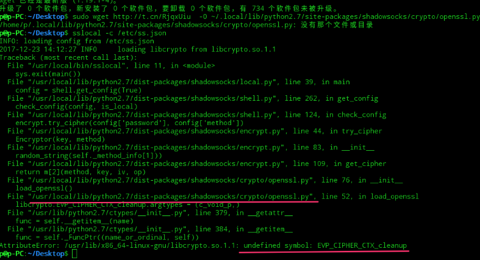
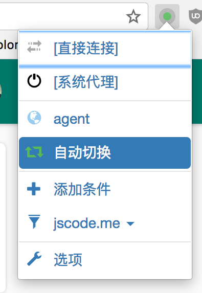
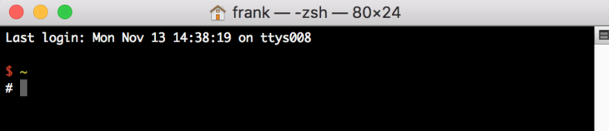

# 学习环境搭建

## ★课程简介

### ◇注意

#### 视频说明

> 1. 如果你使用 Linux 且已经会翻墙了，请不要观看视频《macos 安装 sslocal》和《windows 安装虚拟机》
> 2. 如果你使用 Window，请不要观看《macos 安装 sslocal》
> 3. 如果你使用 macOS，请不要观看《windows 安装虚拟机》
> 4. 我装的深度系统的版本号是 15.4.1，新手尽量装一样的版本。（有同学测试过 15.5 也是没有问题的）
>
> 准备好系统之后的第一件事情应该是安装 sslocal 等翻墙工具（见下面讲义）。

#### 本次课程的重点为

> 1. ~/.bashrc 或 ~/.zshrc 的使用
> 2. alias 的写法
> 3. 学会翻墙
> 4. 学会使用 z 和 fzf
> 5. 学会使用 bash function
> 6. 了解 vim 的基本用法

#### 课程目的

> 这次课程跟 JS 没什么关系，只是为了
>
> 1. 让你们能看懂我上课时使用的命令和工具
> 2. 强迫你们学会命令行
>
> 如果这节课你完全看不懂也没有关系，因为之后的课程不会再用类似的内容了。

### ◇安装与配置

#### ①操作系统

> - 本次课程不会照顾 Windows 系统的用户
> - 使用 深度Linux/Ubuntu 或 macOS 最佳。
> - Windows 用户推荐使用虚拟机或双系统安装「深度Linux」
>   - [虚拟机安装教程](http://www.jianshu.com/p/3379892948da) 不需要安装 Ubuntu
>   - [深度 Linux 安装教程](https://www.google.com/search?q=%E6%B7%B1%E5%BA%A6linux+%E5%AE%89%E8%A3%85+%E6%95%99%E7%A8%8B)
>   - [直接在 Windows 上安装深度 Linux 的教程](https://www.deepin.org/docs/deepintoeveryone/%E5%90%84%E7%A7%8D%E7%8E%AF%E5%A2%83%E4%B8%8B%E5%AE%89%E8%A3%85deepin%E7%B3%BB%E7%BB%9F%E7%9A%84%E6%96%B9%E6%B3%95/windows%E4%B8%8B%E7%9B%B4%E6%8E%A5%E5%AE%89%E8%A3%85/)

#### ②翻墙

1. 安装命令行 sslocal（如果你不喜欢命令行 sslocal，可以看这篇 [Windows 教程](https://jscode.me/t/topic/582)）

   1. macos 系统：brew install shadowsocks-libev

      1. 如果你没有 brew 命令，就要先安装 homebrew：<https://brew.sh/>

   2. Linux：sudo apt-get install python-pip; sudo pip install shadowsocks;

      1. 如果你遇到 _cleanup 不存在的提示，可能是遇到 bug 了，你要将 openssl.py 中的 _cleanup 全部改为 _reset 才行。

         

      2. 如果你不会改，可以运行命令：

         ```bash
          sed -i 's/_cleanup/_reset/g' xxxxxxxxxxxxxxxxxxxxxx/openssl.py  
          注意把 xxxxxxxxxxxxxxxxxxxxxx/openssl.py 改成图中的 openssl.py 文件的路径
         ```

      3. 如果你没有遇到 _cleanup 不存在的提示，就不用运行上面命令了

2. 创建 sslocal 配置文件（如果你不知道在哪创建就创建在 ~/.ssconf.json），配置文件的内容可使用我的服务器（请发邮件向我询问密码），你也可以自己买服务器（显然自己买服务器更靠谱）

   ```
    {
        "server":"207.148.94.164",
        "server_port":1984,
        "local_address": "127.0.0.1",
        "local_port":1080,
        "password":"请发邮件向我询问密码",
        "timeout":300,
        "method":"aes-256-cfb",
        "fast_open": false
    }
   ```

   不用向我询问密码了，我的服务器被和谐了。大家还是[自行购买靠谱的服务吧](https://jscode.me/t/topic/582)

3. 使用 `ss-local -c ~/.ssconf.json` 或 `sslocal -c ~/.ssconf.json` 开启代理，其中 ~/.ssconf.json 是配置文件的路径

4. 如果你想让命令行也走代理，你需要安装 [proxychians-ng](https://github.com/rofl0r/proxychains-ng)

   1. macos 系统使用 brew install proxychains-ng 即可安装

   2. 创建 proxychains-ng 的配置文件，如果你不知道创建在哪，就创建在 ~/.proxychains.conf（用 `touch ~/.proxychains.conf` 即可创建文件），内容如下

      ```bash
       strict_chain
       quiet_mode
       proxy_dns 
      
       remote_dns_subnet 224
       tcp_read_time_out 15000
       tcp_connect_time_out 8000
       [ProxyList]
       socks5     127.0.0.1 1080
      ```

   3. 在 ~/.bashrc 里添加一句 alias pc='proxychains4 -f ~/.proxychains.conf'，保存

   4. source ~/.bashrc

   5. pc 后面接任何命令，就都是走翻墙代理啦。

      1. curl -L [http://google.com](http://google.com/) 不成功
      2. pc curl -L [http://google.com](http://google.com/) 就是成功的！

   6. 《Chrome翻墙神器 Proxy SwitchyOmega 教程》
      [Chrome 插件下载地址](https://chrome.google.com/webstore/detail/padekgcemlokbadohgkifijomclgjgif)

      1. 打开 sslocal 翻墙

      2. 在操作系统网络设置中设置 Socks5 代理，地址 127.0.0.1:1080

      3. 点击 [Chrome 插件下载地址](https://chrome.google.com/webstore/detail/padekgcemlokbadohgkifijomclgjgif)，安装插件

      4. 导入[配置](https://jscode.me/uploads/default/original/1X/15be26176393443bf33fc8a86e8b283079acaf00.zip)，解压后，导入并点击「应用选项」即可，然后选中「自动切换（auto switch）」。

      5. 点击‘应用选项’，很多很多人忘记点击这个安全，然后导入失败了。

      6. 选择 auto switch（自动切换）

         

      7. 遇到被墙的网站就加入 FQ 名单

      8. 删除操作系统网络设置中的 Socks5 代理，以免访问国内网站太慢

#### ③Shell

Linux 操作系统一般分为 Kernel（内核）和 Shell（外壳）
常见的 Shell 有 Bash 和 Zsh。
Bash 是一种命令行式的软件。大概长这个样子：



Zsh 是一种比 Bash 体验更好一点的软件
如果你想使用 Zsh 可以参考这篇[教程](http://macshuo.com/?p=676)。
当然你坚持使用 Bash 也是很不错的。

注意 Zsh 和 Bash 的区别很少，目前你需要记住的区别是

1. zsh 的配置文件位于 ~/.zshrc
2. bash 的配置文件位于 ~/.bashrc

#### ④VIM

请在命令行输入 vimtutor，学习 vim 的基本操作。
我录视频的过程中发现如果不会 vim 真的很难配置各种软件，所以真心建议你把 vimtutor 看完。

#### ⑤命令行小工具

1. z
   方便实现快速目录跳转，[下载在此](https://github.com/rupa/z)

2. fzf
   方便快速搜索文件或目录，[官网在此](https://github.com/junegunn/fzf#installation)

3. 自己写脚本（前提是要先安装 z 和 fzf）

   ```bash
    j() {
        if [[ -z "$*" ]]; then
            cd "$(_z -l 2>&1 | fzf +s | sed 's/^[0-9,.]* *//')"
        else
            _last_z_args="$@"
            _z "$@"
        fi
    }
   
    jj() {
        cd "$(_z -l 2>&1 | sed 's/^[0-9,.]* *//' | fzf -q $_last_z_args)"
    }
   ```

#### ⑥node 相关

你需要安装 node 和 yarn

1. node 直接去[官网](https://nodejs.org/en/)下载双击安装即可，如果是 Linux，需要搜一下教程
2. yarn 也是看[官网的安装教程](https://yarnpkg.com/en/docs/install)
3. npm 不用安装，你安装完 node 就有 npm 了
4. nrm，安装 nrm 可以方便我们切换 npm 源，安装见[这里](https://github.com/Pana/nrm)
5. nvm，如果你希望同时有多个 node 版本，可以安装 nvm。但是我一般只安装最新版 node，所以我没有安装 nvm

#### ⑦编辑器

本次课程我全程使用 WebStotm，好处是不折腾。

#### ⑧词典

如果你遇到不懂的单词，需要你自己翻译，我推荐的单词翻译有

1. iciba.com/hello ，直接在地址栏后面搜索你想要的单词
2. [有道词典](https://www.youdao.com/)，支持 macos 和手机

## ★总结

## ★Q&A

