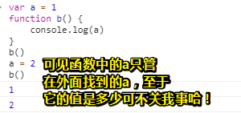
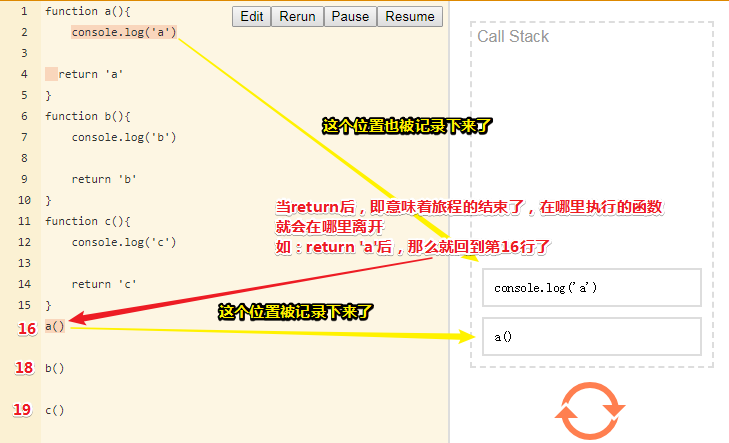
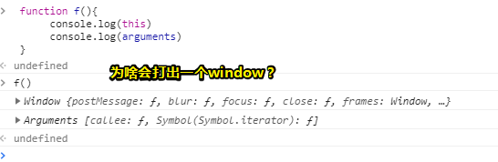

# 你真的懂函数吗？（上）

## ★课程简介

1. 定义

   1. 匿名函数
   2. 具名函数
   3. 箭头函数

2. 词法作用域（也叫静态作用域）

   ```js
    var global1 = 1
    function fn1(param1){
        var local1 = 'local1'
        var local2 = 'local2')
        function fn2(param2){
            var local2 = 'inner local2'
            console.log(local1)
            console.log(local2)
        }
   
        function fn3(){
            var local2 = 'fn3 local2'
            fn2(local2)
        }
    }
   ```

   深入阅读：

   - [javascript的词法作用域](http://js8.in/2011/08/15/javascript%E7%9A%84%E8%AF%8D%E6%B3%95%E4%BD%9C%E7%94%A8%E5%9F%9F/)
   - [作用域 - Wikiwand](https://www.wikiwand.com/zh-hans/%E4%BD%9C%E7%94%A8%E5%9F%9F)
   - [Abstract Syntax Tree 抽象语法树简介](https://div.io/topic/1994)

3. call stack

   - [普通调用 1+1+1](http://latentflip.com/loupe/?code=ZnVuY3Rpb24gYSgpewogICAgY29uc29sZS5sb2coJ2EnKQogIHJldHVybiAnYScgIAp9CgpmdW5jdGlvbiBiKCl7CiAgICBjb25zb2xlLmxvZygnYicpCiAgICByZXR1cm4gJ2InCn0KCmZ1bmN0aW9uIGMoKXsKICAgIGNvbnNvbGUubG9nKCdjJykKICAgIHJldHVybiAnYycKfQoKYSgpCmIoKQpjKCk%3D!!!)
   - [嵌套调用 1>2>3](http://latentflip.com/loupe/?code=ZnVuY3Rpb24gYSgpewogICAgY29uc29sZS5sb2coJ2ExJykKICAgIGIoKQogICAgY29uc29sZS5sb2coJ2EyJykKICByZXR1cm4gJ2EnICAKfQpmdW5jdGlvbiBiKCl7CiAgICBjb25zb2xlLmxvZygnYjEnKQogICAgYygpCiAgICBjb25zb2xlLmxvZygnYjInKQogICAgcmV0dXJuICdiJwp9CmZ1bmN0aW9uIGMoKXsKICAgIGNvbnNvbGUubG9nKCdjJykKICAgIHJldHVybiAnYycKfQphKCkKY29uc29sZS5sb2coJ2VuZCcp!!!)
   - [递归](http://latentflip.com/loupe/?code=ZnVuY3Rpb24gZmFiKG4pewogICAgY29uc29sZS5sb2coJ3N0YXJ0IGNhbGMgZmFiICcrIG4pCiAgICBpZihuPj0zKXsKICAgICAgICByZXR1cm4gZmFiKG4tMSkgKyBmYWIobi0yKQogICAgfWVsc2V7CiAgICAgICAgcmV0dXJuIDEKICAgIH0KfQoKZmFiKDUp!!!PGJ1dHRvbj5DbGljayBtZSE8L2J1dHRvbj4%3D)

4. this & arguments

   - 重要：[this 就是 call 的第一个参数！call 的其他参数统称为 arguments](https://zhuanlan.zhihu.com/p/23804247)
     如果你记住了这个规则，那么网上其他关于 this 的解释在此时都变得很啰嗦了。

   - this 是隐藏的第一个参数，且一般是对象（如果不是对象，就显得很没有意义了）

     ```js
       function f(){
           console.log(this)
           console.log(arguments)
       }
       f.call() // window
       f.call({name:'frank'}) // {name: 'frank'}, []
       f.call({name:'frank'},1) // {name: 'frank'}, [1]
       f.call({name:'frank'},1,2) // {name: 'frank'}, [1,2]
     ```

   - this 为什么必须是对象
     因为 this 就是函数与对象之间的羁绊

     ```js
           var person = {
               name: 'frank',
               sayHi: function(person){
                   console.log('Hi, I am' + person.name)
               },
               sayBye: function(person){
                   console.log('Bye, I am' + person.name)
               },
               say: function(person, word){
                   console.log(word + ', I am' + person.name)
               }
           }
           person.sayHi(person)
           person.sayBye(person)
           person.say(person, 'How are you')
     
           // 能不能变成 
           person.sayHi()
           person.sayBye()
           person.say('How are you')
     
           // 那么源代码就要改了
           var person = {
               name: 'frank',
               sayHi: function(){
                   console.log('Hi, I am' + this.name)
               },
               sayBye: function(){
                   console.log('Bye, I am' + this.name)
               },
               say: function(word){
                   console.log(word + ', I am' + this.name)
               }
           }
           // 如果你不想吃语法糖
           person.sayHi.call(person)
           person.sayBye.call(person)
           person.say.call(person, 'How are you')
     
           // 还是回到那句话：this 是 call 的第一个参数
           // this 是参数，所以，只有在调用的时候才能确定
           person.sayHi.call({name:'haha'})  // 这时 sayHi 里面的 this 就不是 person 了
           // this 真的很不靠谱
     
           // 新手疑惑的两种写法
           var fn = person.sayHi
           person.sayHi() // this === person
           fn()  // this === window
     ```

5. call / apply
   fn.call(asThis, p1,p2) 是函数的正常调用方式
   当你不确定参数的个数时，就使用 apply
   fn.apply(asThis, params)

6. bind
   call 和 apply 是直接调用函数，而 bind 则是返回一个新函数（并没有调用原来的函数），这个新函数会 call 原来的函数，call 的参数由你指定。

7. return
   每个函数都有 return
   如果你不写 return，就相当于写了 return undefined

8. 柯里化 / 高阶函数
   返回函数的函数

   - 柯里化：将 f(x,y) 变成 f(x=1)(y) 或 f(y=1)x

     ```js
       //柯里化之前
       function sum(x,y){
           return x+y
       }
       //柯里化之后
       function addOne(y){
           return sum(1, y)
       }
       //柯里化之前
       function Handlebar(template, data){
           return template.replace('{{name}}', data.name)
       }
       //柯里化之后
       function Handlebar(template){
           return function(data){
               return template.replace('{{name}}', data.name)
           }
       }
     ```

     柯里化可以将真实计算拖延到最后再做

     关于柯里化的高级文章：

     1. <http://www.yinwang.org/blog-cn/2013/04/02/currying>
     2. <https://zhuanlan.zhihu.com/p/31271179>

   - 高阶函数：

     在数学和计算机科学中，高阶函数是至少满足下列一个条件的函数：

     1. 接受一个或多个函数作为输入：forEach sort map filter reduce
     2. 输出一个函数：lodash.curry
     3. 不过它也可以同时满足两个条件：Function.prototype.bind

9. 回调
   名词形式：被当做参数的函数就是回调
   动词形式：调用这个回调
   注意回调跟异步没有任何关系

10. 构造函数
    返回对象的函数就是构造函数
    一般首字母大写

课后题答案：

```js
function curry(func , fixedParams){
    if ( !Array.isArray(fixedParams) ) { fixedParams = [ ] }
    return function(){
        let newParams = Array.prototype.slice.call(arguments); // 新传的所有参数
        if ( (fixedParams.length+newParams.length) < func.length ) {
            return curry(func , fixedParams.concat(newParams));
        }else{
            return func.apply(undefined, fixedParams.concat(newParams));
        }
    };
}
```

## ★概述

我们会讲函数相关的很多细节知识！如，函数的3种声明方式！、this&argument这2个隐含的变量、柯里化/高阶哈数等这些概念，可见我们需要讲的概念很多，而你需要做的就是记笔记！

这个课程是JavaScript的高阶课！如果你发现有很多东西不懂，那么最好的姿势就是记笔记，写博客……

芳芳平时买书看，都会在看书的同时，用一个小本来做笔记，即把书上重要的知识给记下来！这样在回顾的时候就更快了，不用每次都重新看！

当然你可以把课程简介中的讲义当作笔记，不过我希望你能把其中的那些链接都给点一遍！毕竟这些链接都是一些比较深入的资料

## ★函数声明

JS中目前有3种函数的声明方式，分别是

- 匿名函数
- 具名函数
- 箭头函数

### ◇匿名函数

声明函数的时候，不要给名字！就像下面这行demo一样，**✎：**

```js
function() {
    return 1
}
```

不过，你直接运行是会报错的！

因为你声明了一个函数，但是你又不能引用到它！所以这就相当于一个「废话」了呀！为此，一般浏览器都不会让这种函数可以过的，即会告诉你报错了！

那么如何才能让它过呢？

我们需要给它一个引用，**✎：**

```js
var fn = function() {
    return 1
}
```

这个fn就引用了这个函数！

> 其实也就是说，匿名函数要给变量一个引入自己的机会才行！可是，箭头函数呢？这家伙可没有名字，也能自行执行也不报错！

为什么说是「引用」呢？

首先，这个匿名函数是一个对象对吧！可见，这个匿名函数是存储在堆内存里面的！

其次，说到堆内存，显然就有个叫「地址」的概念！

所以，这个fn记录的是这个匿名函数的地址，而不是该函数本身！

> 关于对「引用」的理解，我们在日常中为了让自己所讲的话更具有说服力，为此我们时常用明引的姿势，如，**✎：**「宋代[欧阳修](https://www.wikiwand.com/zh/%E6%AD%90%E9%99%BD%E4%BF%AE)则云：『最佳读书时间，乃为三上：即枕上、马上、厕上。』」
>
> ➹：[引用 - Wikiwand](https://www.wikiwand.com/zh/%E5%BC%95%E7%94%A8)
>
> 我们的fn引用了一个匿名函数，这也就是说通过fn我们是可以使用这个函数的！这就像是那些名言不是我们自己所想，不是我们第一个说的，但是我们是可以使用它们来为我们自身服务的，当然，你最好指明出处才行，不然这是很不道德的！

言归正传，我们如何才能体现这个fn存储的是一个地址呢？

```js
var fn = function() {
    return 1
}
var fn2 = fn
```

在这里，我们把fn1赋值给了fn2，然后你打印一下 `fn.name`和 `fn2.name`的值，你会发现他们都是fn，**✎：**


我在想为啥都是fn呢？我把fn2赋值给fn3，看看fn3.name是fn还是fn2，**✎：**


我想了想，谁叫这个fn是第一个引用匿名函数的变量啊！这就像是这个匿名函数是有版权的，版权归属为fn……

不过fn2、fn3，除了具有可读能力，还具有修改这个匿名函数的能力！这就像我可以把Linux当作是个匿名函数的，而我们都知道它的创造者是[林纳斯·托瓦兹](https://www.wikiwand.com/zh-cn/%E6%9E%97%E7%B4%8D%E6%96%AF%C2%B7%E6%89%98%E7%93%A6%E8%8C%B2)，如fn一样。当它开源后，如赋值一样，即出现了众多的为它贡献代码的开发者了！这也意味着Linux将会愈发地强大起来！

总之，匿名函数默认的name是fn，你会发现这很矛盾——**我是匿名函数，但是我有name**！

或许我可以这样理解，我们总得给一个东西一个名字，毕竟它确实存在于这个世界，不然「这个」「那个」的，沟通起来很不方便，如「这个」是啥？「那个」又是啥。由于匿名函数它确实在堆中，既然在堆中总得起个名字哈！或许是直观的name属性，或许是常用的给个地址，总之我们可以借助某种手段，能精确无误地找到这个东西就可以了

### ◇具名函数

具有名字的函数

```js
function fn3() {
    return 3
}
var fn5 = function fn4() {
    return fn4
}

```

fn3的作用域是全局的，毕竟它是声明在最顶级空间的，而fn4则不是全局的，而是，**✎：**


总之，匿名函数与具名函数的唯一区别就是有没有fn3、fn4……这个名字，但是它们都有name……

### ◇箭头函数

这个是es6的语法……

箭头函数有多少种写法呢？

如果只有一个参数，**✎：**

```js
var fn6 = i => i+1
fn6(6) //7
fn6(7) //8
```

接收一个i返回一个i+1，这就是所谓额输入和输出了，这是最简单的一种写法！

如果有2个参数呢？就像这样，**✎：**

```js
var fn7 = i,j => i+j
```

你说这样写行吗？不行哈！会报错


那么非要传2个参数，该如何才能让它不报错呢？

用括号括起来即可，**✎：**

```js
var fn8 = (i,j) => i+j
```

如果后面，即函数体中不止是一句话呢？

那么你需要用花括号把它们都括起来，同时还要把return的值给说清楚哈！

当然，如果只有一句话，你就不用写return了！但是如果是2句话的话，那么你就得显示的把这个return给说出来了！

```js
var fn9 = (i,j) => { console.log('我是用来测试作为第二句话的！'); return i+j }
```

以上就是箭头函数的用法了！至于区别，我们在讲this的时候才会知道，总之，大体来讲是没有区别的，而只有在this这个地方才会有区别哈！，**✎：**


---

以上就是函数的定义了，匿名函数、具名函数、箭头函数

其中匿名函数和具名函数，都有name，那么箭头函数有没有name呢？

也是有的，跟它们俩的规律是一样的，只是形式不同


总之，箭头函数跟它们俩唯一的不同点在`this`这个地方，而其它地方都是一样的！

### ◇拓展阅读

➹：[java中为什么分栈内存和堆内存？ - 知乎](https://www.zhihu.com/question/24807877)

➹：[什么是堆和栈，它们在哪儿？ - 文章 - 伯乐在线](http://blog.jobbole.com/75321/)

## ★词法作用域

你曾有的疑问，**✎：**

> 有时候一个方法定义的地方和使用的地方会相隔十万八千里，那方法执行时，它能访问哪些变量，不能访问哪些变量，这个该怎么判断呢？

为此，引出了我们这一小节所讲解的内容了——**词法作用域**

那么什么是词法作用域呢？

变量的作用域是**在定义时决定而不是执行时决定**，也就是说**词法作用域取决于源码**，通过静态分析就能确定，因此词法作用域也叫做静态作用域。 对于JS来说，`with`和`eval`除外，所以只能说JS的作用域机制**非常接近**词法作用域（Lexical scope）。

那么在JS中，如何才能体现出词法作用域呢？

给你一段demo，你就知道了，**✎：**

```js
 var global1 = 1
 function fn1(param1){
     var local1 = 'local1'
     var local2 = 'local2'
     function fn2(param2){
         var local2 = 'inner local2'
         console.log(local1)
         console.log(local2)
     }

     function fn3(){
         var local2 = 'fn3 local2'
         fn2(local2)
     }
 }
```

是不是有很多local2，而这个local2就是用于体现词法作用域的！

当浏览器看到这段demo，并不会马上去执行，而是会做一个抽象语法树！

什么叫语法树呢？

即它会把这个语法变成一棵树，然后便于它去执行！

也就是说第一次先不执行，只看语法，看你语法对不对，然后再去理解你的语法。总之语法全部对了之后，再重头开始执行！

我们只看跟变量声明相关的不完整语法树或者叫词法树，**✎：**


1. window是本来就存在的一个全局环境
2. window下面有2个全局声明的变量——global1和fn1，它们俩是同级的！
3. fn1下面有5个声明的变量，分别是param1、local1、local2、fn2和fn3，在这里形参param1也是局部变量
4. fn2下面则有param2、local2这2个声明的变量！
5. fn3下面则有1个声明的变量——local2

这样一来这棵树就形成了，那么这棵树有什么用呢？

以我们需要打印fn2函数中的local1为例，那么你说这打印的是哪个local1呢？而这其中又是如何确定的呢？

这是根据词法树来确定的！

你看我们的fn2下面只有一个local2，所以找不到local1，既然在fn2下面找不到，那么就去fn2所在的这一级里面找了。为此就找到了与fn2同级的local1了！

这是一种静态分析的方式，即此级找不到，就往上找，如果找到了就不就继续往上找了！

好了，这就是所谓的词法树了！

总之，一个函数里面能访问哪些变量，在做词法分析的时候就已经确定了，也就是说这跟你调用与不调用没啥关系，只跟语法有关系，跟执行顺序什么的都没有关系！

还有一点就是，词法树只是用于分析①这个变量是不是②这个变量，不是用来分析①这个变量的值，是不是②这个变量的值。**✎：**


总之，我们只分析语义，即这个①变量是②这个变量，至于其中的值是否相等，并不是我们所关心的！

### ◇一个著名的题目

```js
var a = 1
function b() {
    console.log(a)
}
```

请问b里面的a是不是外面的a？我们分析一下语法就知道是外面的a了，毕竟b它自己并咩有声明这个a。

但是我们所打印a的值是不是外面a的值？即是不是绝对是1呢？

这是无法确定的哈！如，**✎：**

```js
var a = 1
function b() {
    console.log(a)
}
a = 2
b()
```

我们声明了一个函数b，但还没有执行它，当我们去调用b的时候，才会去执行这个函数b，那么这个时候a就是2了！

所以如果你不看这段demo下面的，即，**✎：**

```js
a = 2
b()
```

这一部分，你是永远不知道 `console.log(a)`中的a是几的！

所以我们的词法作用域只是能确定这个a是不是外面那个a，但是不能确定a的这个值是不是外面那个a的值！

总之，词法作用域确定的是两个变量的关系，**✎：**


ps：


### ◇拓展阅读

➹：[javascript的词法作用域 - 三水清](https://js8.in/2011/08/15/javascript%E7%9A%84%E8%AF%8D%E6%B3%95%E4%BD%9C%E7%94%A8%E5%9F%9F/)

➹：[作用域 - Wikiwand](https://www.wikiwand.com/zh-hans/%E4%BD%9C%E7%94%A8%E5%9F%9F)

➹：[Abstract Syntax Tree 抽象语法树简介 - Div.IO](https://div.io/topic/1994)

➹：[你知道「编译」与「解释」的区别吗？ - BlueSun](http://huang-jerryc.com/2016/11/20/do-you-konw-the-different-between-compiler-and-interpreter/)

➹：[js引擎的执行过程（一） - Heying Ye's Personal Website](https://heyingye.github.io/2018/03/19/js%E5%BC%95%E6%93%8E%E7%9A%84%E6%89%A7%E8%A1%8C%E8%BF%87%E7%A8%8B%EF%BC%88%E4%B8%80%EF%BC%89/)

➹：[什么是语义学](http://www.yinwang.org/blog-cn/2012/07/25/semantics)

➹：[JavaScript深入之词法作用域和动态作用域 · Issue #3 · mqyqingfeng/Blog](https://github.com/mqyqingfeng/Blog/issues/3)

### ◇测试demo

这是看这个 [javascript的词法作用域 - 三水清](https://js8.in/2011/08/15/javascript%E7%9A%84%E8%AF%8D%E6%B3%95%E4%BD%9C%E7%94%A8%E5%9F%9F/)  链接的一些测试demo，**✎：**

```js
// function a(i) {
//     var i
//     console.log(i)
// }
// 等价于上面的写法
// 重复var一个变量，并不会让这个i的值为undefined
function a() {
    var i = arguments[0]
    var i;
    console.log(i); //10
}
a(10)
// 总之我想告诉你的是arguments[0]就是形参i
// 何以见得？
function b(i) {
    console.log(arguments[0])
    var i = 6
    console.log(arguments[0])
}
b(10)
// 可见结果是10、6，我们改变了形参i的值，而且这个var形如摆设，即只是个重复的var而已
// 可见局部变量i和形参i以及arguments[0]是同一个家伙
// 你要不信，那比如这样呢：
function c(i) {
    var i ;
    console.log(i===i); //true
    console.log(i); //10
}
c(10)

// 局部变量提升，需要注意的是函数声明提升与变量声明提升，咩有先后顺序之分，即谁在前谁就先声明
var i=10;
function d() {
    console.log(i); //undefined
    var i = 2;
    console.log(i); //2
};
d();
// 等价于
// function d() {
//   var i;
//   console.log(i)
//   i = 2
//   console.log(i)
// }
```

## ★Call Stack

Stack是一个数据结构，中文翻译就是「栈、堆栈」，我们用一个单词就能描述它了——「先进后出」，跟队列正好相反……

> 队列就是谁先排队，就谁先拿到东西！而栈正好相反，即是谁先排队谁后拿到东西

可见，栈这种数据结构显得甚是奇怪，也不知道这是谁设计的！不过它是非常常见的……

### ◇普通调用

```js
function a(){
    console.log('a')
  return 'a'  
}

function b(){
    console.log('b')
    return 'b'
}

function c(){
    console.log('c')
    return 'c'
}

a()
b()
c()
```

➹：[latentflip](http://latentflip.com/loupe/?code=ZnVuY3Rpb24gYSgpewogICAgY29uc29sZS5sb2coJ2EnKQogIHJldHVybiAnYScgIAp9CgpmdW5jdGlvbiBiKCl7CiAgICBjb25zb2xlLmxvZygnYicpCiAgICByZXR1cm4gJ2InCn0KCmZ1bmN0aW9uIGMoKXsKICAgIGNvbnNvbGUubG9nKCdjJykKICAgIHJldHVybiAnYycKfQoKYSgpCmIoKQpjKCk%3D!!!)

浏览器看到这段demo，首先不是运行，而是分析有哪些声明，如发现个函数a，那就提到前面去呗！就像你这样写也是可以的， **✎：**

```js
a()
function a(){
    console.log('a')
  return 'a'  
}
```

浏览器看一遍demo，就会把函数a移到 `a()`的前面去……即所谓的函数提升……

总之第一步，浏览器就是做词法解析——解析完当前有哪些变量，有哪些语法之后，才真正地开始执行……

那么这执行过程是怎样的呢？

1. 看到声明的函数a，什么也不做，那么它里面的demo呢？是存在内存里的，什么也不做，即不会log出a。同理，其余的函数b和c也是如此！

2. 开始正式地运行a，那么运行a要做什么呢？

   1. 记录 `a()`进入函数a之前的位置，总之，你调用函数a，即离开了全局作用域，进入到了函数a的局部作用域里去了，毕竟函数a里面的demo也是在内存中。再次强调，离开的位置是会被记录下来的

   

   从哪里离开就回到哪里！

   `return 'a'`的意思就是我要离开这个函数a了，那么要去哪儿呢？额……看一下刚才在堆栈里记录的位置，于是就回到了第一次调用a的位置，即16行

   这就是函数一次进入的过程了

> 可见，Call Stack记录的是你是从哪里离开的，等你进入到新的函数，把新函数里的内容执行完了之后，轮到`return`了，那么`return`到哪儿呢？就是Call Stack记录的那个最上面最上面的那个函数位置。
>
> `reurn`回来带的那个值，如 `'c'`，就是 `c()`这个整体的值

总之，就是从一个作用域切换到另外一个作用域，然后带回来了一个值，那么把这个值交到哪里呢？就是Call Stack记录的最上面那个位置！

在全局作用域中，一次函数执行完，那么Call Stack里的位置记录就会空空如也，如`a()`执行完毕后，此时的Call Stack中的 `a()`位置也会消失了，接着就是 被 `b()`的位置给替代了……总之就是一次return，一个记录位置消失，一次函数执行，一个记录位置诞生……

以上是一个最简答的例子！即依次执行3个函数……总之，就是普通调用

> 能不能把Call Stack看作是一颗没有分支树的呢？它的root路径就是在全局作用域中第一次执行函数所记录的位置……似乎可以把一个函数看作是一个文件夹，文件夹中的资源return后就会到父级文件夹……直到回到root目录

接下来的这个例子就是嵌套调用，直白一点就是函数里面调函数！

### ◇嵌套调用

➹： [嵌套调用](http://latentflip.com/loupe/?code=ZnVuY3Rpb24gYSgpewogICAgY29uc29sZS5sb2coJ2ExJykKICAgIGIoKQogICAgY29uc29sZS5sb2coJ2EyJykKICByZXR1cm4gJ2EnICAKfQpmdW5jdGlvbiBiKCl7CiAgICBjb25zb2xlLmxvZygnYjEnKQogICAgYygpCiAgICBjb25zb2xlLmxvZygnYjInKQogICAgcmV0dXJuICdiJwp9CmZ1bmN0aW9uIGMoKXsKICAgIGNvbnNvbGUubG9nKCdjJykKICAgIHJldHVybiAnYycKfQphKCkKY29uc29sZS5sb2coJ2VuZCcp!!!)

```js
function a(){
    console.log('a1')
    b()
    console.log('a2')
  return 'a'  
}
function b(){
    console.log('b1')
    c()
    console.log('b2')
    return 'b'
}
function c(){
    console.log('c')
    return 'c'
}
a()
console.log('end')
```

这是一个层层递进的过程，你可以把这个过程看作是盗梦空间，如调用函数a，进入第一层梦，调用log函数，进入到第二层梦，return后回到第一层梦；调用函数b，进入第二层梦，调用log函数，进入第三层梦，return后回到第二层梦，调用函数c，进入第三层梦，调用log函数，进入到第四层梦，return后回到第三层梦，然后reurn又回到了第二层梦……最后在第一层梦，`return 'a'`，回到现实世界，即梦醒了，还是原来的那个17行位置，并且带回来了一个字符串a，即 `a()`的值是一个字符串a

最后来看一个最复杂的，即递归

### ◇递归

➹：[递归](http://latentflip.com/loupe/?code=ZnVuY3Rpb24gZmFiKG4pewogICAgY29uc29sZS5sb2coJ3N0YXJ0IGNhbGMgZmFiICcrIG4pCiAgICBpZihuPj0zKXsKICAgICAgICByZXR1cm4gZmFiKG4tMSkgKyBmYWIobi0yKQogICAgfWVsc2V7CiAgICAgICAgcmV0dXJuIDEKICAgIH0KfQoKZmFiKDUp!!!PGJ1dHRvbj5DbGljayBtZSE8L2J1dHRvbj4%3D)

这个递归是著名的斐波那契数列，**✎：**

```js
function fab(n){
    console.log('start calc fab '+ n)
    if(n>=3){
        return fab(n-1) + fab(n-2)
    }else{
        return 1
    }
}

fab(5)
```

> 这个斐波那契数列以前有了解过，这次看来，这个 `return 1`似乎是为 `return fab(n-1) + fab(n-2)`而准备的……

关于斐波那契数列，第一项和第二项都是1，第三项则是前面的两项相加的和……如此类推……

如 1、1、2、3、5、8、13……

而我们这个用JavaScript写的斐波那契数列，可以让你输入第几项，就给你输出第几项的值，如求第五项的值，输出的结果是5……

解析这个函数，**✎：**

1. 如果大于3，即从第3项开始，每一项是前两项相加的结果；如果是小于3，那就是n为1或者2这两种情况了，那返回的值就是1了。这就像是数学归纳法一样，把所有的项都给写出来了
2. 递归是有重复计算的，总之你要求第5项的值，首先你要知道第4项和第3项的值，而4和3，你又要知道3和2、2和1的值……如此循环下去后……就可以返回一个5的值了
3. 先递后归……

> 在看这个fab函数执行过程中，没想到条件判断也出现在了Call Stack中……不过这不打紧，我们只需要关注所记录的函数调用位置即可！

以上就是用堆栈的概念来理解递归了……


### ◇总结

话又说回来，Call Stack这个东西到底是什么？

我们知道JavaScript是单线程的，所以它在执行一长串demo的时候，它就会把当前的环境都给记住，如我能访问哪些变量，然后它突然看到一个函数，这个时候它就切换环境了，因为它要进入这个函数，而这个函数demo并不在这里，存在另一块内存里，那它进入这个函数之前，它有可能会忘掉怎么回来，这个时候它就会在这里做个记号， 但是它要做很多记号，因为这个函数里面可能还有很多函数 ，而很多函数里面，还有很多函数……于是它就把一层记号放到一个栈里面，这个栈就叫做调用栈。只要它进入一层调用栈，那么栈里面就会多一个关于它进入的时候一个记录，于是它就进入一个新的函数，然后开始执行了，如果新的函数还有函数，它就把第二个函数又放到栈里面，等它回来的时候，就先回最后进入的那个地方。如果用盗梦空间对比的话就很形象了！如从第三层退出就是第二层了……

总之这是跟队列相反的，即先进去的第一层梦，最后才退出第一层梦。

好了，这就是调用堆栈了

那调用堆栈有什么用呢？

没什么用……但是对你理解这个函数的调用是有关系的！所以它是一个理论上的知识！

➹：[学习理论知识有什么价值？ - 知乎](https://www.zhihu.com/question/29985367)

ps：芒格的格栅理论？

➹：[查理·芒格的智慧 (豆瓣)](https://book.douban.com/subject/26374572/)

➹：[建立思维的格栅 | Build your mental database - 知乎](https://zhuanlan.zhihu.com/p/21986189)

一直以来，我的脑海中始终悬挂着一个问题，即**很难把孤立的知识点给串联起来**。我想这个「格栅理论」或许会让我找到答案……

## ★this & arguments

### ◇形式化认识它们俩

 this和arguments，在平时讨论的比较多，而且这个跟调用堆栈有很大的关系！

那么它们跟Call Stack有什么关系呢？，**✎：**

在你进入一个函数的时候，你除了记录一下是在哪一行调用的，你还得记录一个东西，那就是传给这个函数的参数有哪些……

以下面这个函数为例，**✎：**

```js
  function f(){
      console.log(this)
      console.log(arguments)
  }
  f.call() // window
  f.call({name:'frank'}) // {name: 'frank'}, []
  f.call({name:'frank'},1) // {name: 'frank'}, [1]
  f.call({name:'frank'},1,2) // {name: 'frank'}, [1,2]
```

当我们调用函数的时候，如 `f.call()`，肯定得把这个调用位置给记录下来，存到Call Stack里面去，对吧！除此之外，你还得准备一些东西才行，就像你过年过节去串门总得准备点礼物一样……

那么有哪些东西呢？

总共2个东西，第一个是`this`，我们这个 `f.call()`并没有准备this，那么它就是undefined，	奇怪的是最后会变成window……总之，你不给this，就相当于给了一个window

第二个则是一个叫做`arguments`的伪数组……

我们在进入函数f之前得准备this和arguments，显然，我们的 `f.call()`什么也没准备……

既然没有准备，那么this就是window，而arguments则是空空如也的伪数组了……


这个应该是个小window，然而谷歌浏览器却非要手贱显示了一个大Window……总之，当你看到大Window的意思就是小window了……

第二个则是length为0的伪数组……当然，你可以假想为 `[]`

接下来，我们尝试着给它来点东西，首先我们尝试着给它来个this


> call的第一个参数就是this，不要问为什么，因为call的定义就是如此……

同理，我们尝试着再添加一个参数 `1`，**✎：**


this的值依旧如此——一个叫frank的对象，而arguments的值则变了——第0项为1了，假想为 [1]

我们继续追加一个参数2，**✎：**


this雷打不动，依旧是frank，而arguments则多了一项，即第1项为2了……假想为[1,2]

至于后面的，就不多说了，继续追加参数也是同样的结果，这叫做不完全归纳法……

如我们可以不完全归纳出：**不管我们在后面传多少参数都会放到这个arguments里面作为一个伪数组** 

> 在日常中，不完全归纳法甚是常见……

➹：[不完全归纳法与科学归纳法 - 知乎](https://zhuanlan.zhihu.com/p/19598713)

那么什么是this呢？

this就是call的第一个参数，没有任何其它的定义，这是一个很**形式化**的记忆，你要从感性上理解，目前是很困难的！

目前，关于在进入函数的一瞬间要做的事情，我们知道了3个，**✎：**

- 记录调用函数当前的位置，放到Call Stack里面
- 记录this，这个this可以传也可以不传，不穿的话，默认就变成window，这个在浏览器上是这样的
- 传一个参数就放到arguments里面去，不传的话就是空的伪数组……

总之，我们用call来传参数的话，第一个参数就是this的值，而之后所有的参数都放到arguments里面，然后包装成一个伪数组……

好了，以上就是对「this」和「arguments」的分析了，它们都是你认识函数所必须要知道的基本概念

### ◇为什么要用call？

为什么要用call来调用呢？而不是直接就一个括号来调用呢……

因为 f加括号，即`f()`……是阉割版的`f.call()`

所以你要用完整版的，即非阉割版的，你就知道this是什么了！

一旦你用阉割版的，就会陷入到一个恐慌，那么这是什么恐慌呢？就是完全不知道this是什么……

我们用另外一个版本，即不用call来测试一下，**✎：**



你会发现这甚是奇怪，为啥这个this的值是个window，我又咩有传东西进去，什么也没给……

接着添加点参数，**✎：**


可见，我们的1……等这些实参都直接放到arguments里面了

言归正传，为什么说这样 `f()` 是阉割版调用呢？

因为当你用非call的时候，window这个值永远没有办法让你亲自指定，这个值是浏览器靠猜的，因为这个语法没法指定this，所以这是阉割版语法，这就是为什么一开始讲的时候是用call来调用函数的……而不是直接一个函数名跟一个括号，简而言之，阉割版语法不利于我们学习……

现在开始，我们只用call来调用函数，等call学清楚后，才用其它的……

### ◇this 为什么必须是对象？

我们之前的测试都是传一个对象，如 `{name:'frank'}`

那么能不能传别的呢？那就试试传个10看看，**✎：**


按照我们所想的，10就是this的值对吧！然而结果却是一个Number对象

我们可以看到`new Number(10)`也是这样的打印，为此我们可以反推出我们的10被new Number了一下，变成了一个Number对象

那么为什么要这样呢？

**因为 this 就是函数与对象之间的羁绊……**

➹：[日文里的「絆」和中文里的「羁绊」是同一个意思吗？ - 知乎](https://www.zhihu.com/question/22271127)

> this是函数与对象之间的纽带？缘？

什么鬼？说得这么文绉绉的……

我们先来看一下这个demo，**✎：**

```js
      var person = {
          name: 'frank',
          sayHi: function(person){
              console.log('Hi, I am' + person.name)
          },
          sayBye: function(person){
              console.log('Bye, I am' + person.name)
          },
          say: function(person, word){
              console.log(word + ', I am' + person.name)
          }
      }
      person.sayHi(person)
      person.sayBye(person)
      person.say(person, 'How are you')

      // 能不能变成 
      person.sayHi()
      person.sayBye()
      person.say('How are you')

      // 那么源代码就要改了
      var person = {
          name: 'frank',
          sayHi: function(){
              console.log('Hi, I am' + this.name)
          },
          sayBye: function(){
              console.log('Bye, I am' + this.name)
          },
          say: function(word){
              console.log(word + ', I am' + this.name)
          }
      }
      // 如果你不想吃语法糖
      person.sayHi.call(person)
      person.sayBye.call(person)
      person.say.call(person, 'How are you')

      // 还是回到那句话：this 是 call 的第一个参数
      // this 是参数，所以，只有在调用的时候才能确定
      person.sayHi.call({name:'haha'})  // 这时 sayHi 里面的 this 就不是 person 了
      // this 真的很不靠谱

      // 新手疑惑的两种写法
      var fn = person.sayHi
      person.sayHi() // this === person
      fn()  // this === window
```

我们声明了一个对象叫做person，我们的目的是研究this，假设我们的前提是这个世界上没有this，然后我们来看什么情况下会需要this，那么这个时候你就会知道this为什么会有了！

➹：[JS 里为什么会有 this - 知乎](https://zhuanlan.zhihu.com/p/30164164)

研究这个this的前提是，目前我们认为这个世界没有this，那么没有this这个世界是否运行起来依旧良好呢？如果运行良好，那么这个this就是个废话，如果运行得不好，那么就说明this还是有意义的

#### 没有this的世界

```js
var person = {
          name: 'frank',
          sayHi: function(person){
              console.log('Hi, I am' + person.name)
          },
          sayBye: function(person){
              console.log('Bye, I am' + person.name)
          },
          say: function(person, word){
              console.log(word + ', I am' + person.name)
          }
}
```

我们声明了一个person，而它是一个对象，有个name属性，name的值是 `'frank'`。有个函数叫做sayHi，这个sayHi函数接收一个对象，然后打印出 `'Hi, I am 这个对象的名字'`，注意我们这个函数当然是希望接收一个是有name属性对象啦！同理，剩下的那2个函数也是很简单的……

由于咩有this，所以我们写demo会显得很奇怪！

```js
 person.sayHi(person)
 person.sayBye(person)
 person.say(person, 'How are you')
```

我们调用person的sayHi必须得传一个person，即这个对象自己

如果不传呢？不好意思，这个函数就会接收不到任何的信息，也许你会想「不是有个person在点它，即点sayHi吗？」

难道这个sayHi函数不知道有个家伙在点它吗？

为什么要知道呢？这个sayHi函数只能拽拽地说句「who care？」，总之它不知道有家伙在点它……

总之sayHi就是一个函数，只不过这个函数的引用方式是通过一个对象的属性来引用的，总之就是不能把person这个对象带到sayHi这个函数里面去！

所以这个时候，你必须要传个东西（如person）进去给这个函数，除此之外，你没有办法更简略地传了，或许你会想能不能传这样的，**✎：**

```js
person.sayHi(person.name)
```

显然这种更麻烦，即更长一点……

同理，剩余的那2个函数也要传一个person才行

以上就是没有this的世界的demo写法了！

看久了这个demo，你会发现越看越不爽，为什么我要那么麻烦，我每次都要把点前面的对象都给写一遍呢？

你JS就不能帮我写吗？就不能给我搞一个语法糖呢？即能不能变成这样呢？**✎：**

```js
 // 能不能变成 
 person.sayHi()
 person.sayBye()
 person.say('How are you')
```

我是用person点出来的sayHi，所以在执行sayHi的时候，就应该sayhi出person的name才对吧！

这个人在sayHi，那当然肯定是在说它自己的名字啊！如「小明打招呼：嗨，我是小明！」

所以你能不能在sayHi里面直接去访问这个person，同样sayBye也是如此，即能不能直接访问点前面的！

say也是如此，总之就是能不能不需要显示传个person，然后这个点前面是什么就传什么！

所以这怎么办呢？

……

JS之父想了想说「可以，我能通过分析语法给分析出来」

再次回到说过的抽象语法树，**✎：**

> JS引擎的第一步是会先分析语法的，它分析出你的意图之后，就能改变你的代码。总之，就是允许你这样写了，—— `person.sayHi()`

如果允许这样写了，那么我们原先所定义的sayHi函数就有问题了，为什么？因为我们这样写是没有传参数的！

```js
sayHi: function(person){
              console.log('Hi, I am' + person.name)
       },
```

我没有传参数给sayHi这个函数，当是这个sayHi函数却接收到了一个参数，可见这是不是很不一致？

所以？现在有2种方法可以解决这个问题……

第一种，单独给第一个参数一个关键字，就是this，**✎：**

```js
var person = {
          name: 'frank',
          sayHi: function(){
              console.log('Hi, I am' + this.name)
          },
          sayBye: function(){
              console.log('Bye, I am' + this.name)
          },
          say: function(word){
              console.log(word + ', I am' + this.name)
          }
   }
```

我们改写了函数，让它跟我们的这个调用姿势 `person.sayHi()`显得一致起来了，即你调用不传参数，那么相应的函数当然也不能有形参啦！

这个时候我们的sayHi就不能直接用person.name了，我得用一个关键字来访问你传进来的对象，所以那就用this来访问咯！这个sayHi函数并不知道你传进来的是什么，但是呢，「我」只能通过this这样去访问你！

也就是说，this是一个占位符，你这个点前面是什么对象，那么我这个this就是什么，如sayHi的点前面是person，那么我这个this就是person了！

这样JS就做到了「用this可以访问到这个函数点前面的东西」，这就是一个语法糖……

这会儿，新人看到有this的函数就很好理解了，我们在person.sayHi()的时候，用this就可以访问到我们调用sayHi函数的这个person了

如果没有经过以上的那一层思考，那么新人显然会感到很奇怪「这个this是什么鬼？哪来的this？我在定义这个函数的时候好像从来没有指定过这个this啊！为什么这个this会有值呢？」

毕竟新人从来不用call，不知道call可以传this……那如果是老手 ，我们就知道了！

其实，我们这种写法 `person.sayHi()` 不就是为了传this吗？

那我们这样写不就好了吗？，**✎：**

```js
person.sayHi.call(person)
```

这2种写法是完全等价的

为什么这样说呢？我们来来看看它们俩的意思，**✎：**

`person.sayHi()`：以person为this来调用sayHi

`person.sayHi.call(person)`：调用sayHi——`person.sayHi.call()`，然后call的第一个参数是this，拼接起来就是「以person为this来调用sayHi」

所以它们是一模一样的！

#### 整体回顾一下这个逻辑

JS之父为了满足 `person.sayHi()`这样的demo可以运行，就是不用传person，我也能知道当前的对象是什么，于是他就创造了一个叫this的关键字

那么this关键字的值是什么呢？

就是函数前面这个点前面的东西，如果没有点，那么this就是window了！

用代码测试一下没有点的情况，**✎：**


简略分析：

我们拿到sayHi这个函数的引用，然后赋值给了fn。接下来，我们直接fn()这种没有点的来调用这个sayHi函数，这样一来JS引擎就没法从语法分析出来是哪个对象调用这个函数的，因为没有点哈！分析个屁啊！

所以fn里面的this就是window了！

正式分析：

我们这样调用函数 `person.sayHi()`，那么JS引擎就会知道你想用person当作this，这个就相当于你这样调用 `person.sayHi.call(person)`

如果我们直接fn()呢？这不是一样的吗？

这不一样，这个时候JS引擎分析不出来你想要哪个对象来调用这个sayHi，因为sayHi就是一个函数而已，注意，这个函数，**✎：**

```js
function(){
         console.log('Hi, I am' + this.name)
}
```

跟person和sayHi都没有关系，它就是一个函数。**函数只有输入和输出，没有说这个函数是属于这个person对象这么一个说法的**……总之就是这个sayHi函数与它的诞生地——person对象是没有从属关系的（因为sayHi存储的终究是个引用），不管怎样，函数就是函数，只有输入和输出，如果要想有关系的话，那么**this就是函数与对象之间的羁绊**

➹：[从属关系是什么意思?_百度知道](https://zhidao.baidu.com/question/121554915.html)

我们根据看到fn()的结果，可见没有点的调用姿势，这个函数里面的this就是window……

好了，以上就是点与不点的区别了！

简而言之，你写了点JS引擎就知道this的值是什么，如果你不写点JS引擎就把window当作this，**✎：**

```js
 person.sayHi()
 person.sayBye()
 person.say('How are you')
```

不过这种写法很奇怪，因为这是在隐含的告诉你this是什么，为啥不直接告诉我this是什么呢？这岂不是更好一点吗？**✎：**

```js
 person.sayHi.call(person)
 person.sayBye.call(person)
 person.say.call(person, 'How are you')
```

 总之，推荐这种用call调用函数的方式，在我看来这给人一种函数就是函数，不用管前面的点点点……，总之函数它就是一个独立的存在……跟sayHi没有关系，跟person没有关系，它就是跟call有关系 ，你call的第一个参数是什么，那么函数里面的this就是什么

总之，你不用call，那么你会不小心的把person当作是this，所以这种语法甚是操蛋……如果我们全部都用call，那么这个世界就很简单了

```js
person.sayHi() <=> person.sayHi.call(person)
fn() <=> fn.call()
```

我们直接 `person.sayHi()`这样，看不出this是什么，而用了call一眼就能看出来了！

同样 `fn()`里面的this你也看不出来，但是你加个call就能看出来了，它里面的this就是undefined，而undefined会自动被window填充……

所以你用了call，this什么的就很简单了，即call的第一个参数是什么，那this就是什么……

### ◇this的意义

this就是让函数有一个可容易操作的对象，实际上是没有的，只是看起来有。由于我们在函数里面用到了这个this，当我们点这个函数的时候，JS引擎就会理所当然的猜测你是想把函数前面的点的前面的家伙当作是这个this的值

```js
var o = {
    name: 'frank',
    sayHi: function() {
        console.log('I am ' + this.name)
    }
}
o.sayHi() //this就是这个对象o
```

### ◇apply

我们有这么一个求和函数，**✎：**

```js
function sum(x,y) {
	return	x+y
}
```

不需要在函数体里面搞个this吗？

不需要，因为我们的这个函数不需要依附于任何对象的

所以call的第一个参数，我们可以传个undefined或者null，总之随你的便咯！

当然，undefined会变成window，不管怎样，反正我们就是不会用到this，**✎：**


或许你会问，既然不用this，为啥还有传undefined呢？

这不得不传啊，毕竟第一个参数就是this的值！

如果你不传的话，那么结果就是NaN了，**✎：**


1被包装成了一个Number对象，而2则是作为x的形参了，那么y自然而然就是默认的undefined值了！

所以`2+undefined`的结果，可想而知就是NaN了！

总之，sum函数点call的第一个参数只是用于占位的！再次强调，call第一个参数永远是this，如果没有用到this，那就传个null或者undefined就行了！

总之，这是很机械的，不要以为JS是很聪明的

但是有一种情况，我们没有办法用call去写——求所有参数的和

我们不知道有多少个参数，谁知道呢？

那么我们如何把所有参数都给拿到呢？

我们可以访问arguments，**✎：**


这个时候，我给你一个数组，它的内容你不知道，因为这内容可能是从文件里读出来的或者是其它的姿势

我们不知道是什么内容，那么我们假设它是 `var a = [1,2,3,4,5,6,7,8,9]`

这个时候我们用call该怎么调用呢？

这样吗？**✎：**

```js
sum.call(undefined,a[0],a[1],a[2],……，a[7],a[8])
```

可是，我们并不知道a有多少项啊！

所以，这样写根本就写不出来！谁知道尽头在何方呢！这样还调个屁函数啊！

那咋办呢？

我们写不了啊！call完全没用……

这个时候apply就应运而生（适应时机而产生）了……

它就是当你没有办法把这个函数写完的时候，你就直接把这个数组参数传过去就行了，**✎：**

```js
sum.apply(undefined,a)
```


第二个参数接收一个数组，不然会报错，**✎：**


数组里面有多少项，那么这个sum函数就会有多少个参数

> 我在想，难道不是把这个数组直接赋值给arguments？

可见，我们不需要改代码了，不管a有多少项我们都可以把它求出来了！因为我们用到了apply

那么call和apply的区别就很简单了，它们俩几乎一模一样，而其中只有一个区别，**✎：**

就是当你不确定参数的个数时，就使用 apply—— `fn.apply(asThis, params)`

如你得到了一个数组，而你可能不知道这个数组的长度，即便知道了也写不出来，如

你知道是有10个元素的数组，难到你要往call里传11个参数吗？

你说你是不是智障！天杀的，调用一个函数，写那么长……

总之，你就算知道长度，你也更喜欢写apply

总之，在长度不固定以及长度非常长的情况下，apply是明显优于call的

### ◇回顾一下

每个函数进去的时候，都必须传一个this和arguments，如果不传this就是window，如果不传arguments，那么arguments就是空的伪数组

然后传的方法呢？

如果你想明显地告诉阅读代码的人，你就用call。call的第一个参数永远是this，不管你在函数体中有没有写this，call的第一参数就是this，而且this必须是对象，如果你写的不是this，它就会帮你转成对象！当然在严格模式下，就不会帮你转了，**✎：**


而从第二个参数开始才是arguments，即第一个参数之后的都叫做arguments（参数）

总之call的第一个参数就是this，不要问我为什么！——因为避免你每次都传一个this

我们在 `person.sayHi()`中没有传第一个参数，没有第一个参数，那么函数体里面的demo该如何访问这个person呢？

用this哈！

或者你想明显地告诉别人this是person的话，你可以这样写，**✎：**

```js
person.sayHi.call(person)
```

或许你觉得这样写很傻，但是我想告诉你，这样写才是正常的！

因为你这样做，就是在把传给函数的所有东西都告诉了这个代码的阅读者！

即我明显地告诉你「我这个sayHi函数里的this就是person」

而阉割版那种姿势呢？——`person.sayHi()`

没有告诉你this是什么，只能靠猜了，别人一看这个代码就想「……这个sayHi函数里面的this是什么呢？……回顾一下以往所学的知识，好像JavaScript有个语法是说如果前面有点的话，那么点前面的这个东西就是this了，所以这个this是person，对吧！」

可见，这看起来很绕，难道就不能直接点吗？call一下会GG吗？你看call一下会绕吗？没有任何绕的！

这就是不喜欢写call的bug……

之前有一个人在知乎上问，问怎么学习call？

这很简单，不要用阉割版的函数调用姿势，坚持用call姿势一个星期后，那call对你来说就是炉火纯青了！如果你老是用这种智障写法、阉割版写法，你永远都无法理解这个call

至于apply就是call的另一个版本……

## ★bind

> call 和 apply 都是直接调用函数，同时指定this和arguments。而 bind 则是返回一个新函数（并没有直接调用原来的函数），这个新函数会 call 原来的函数，call 的参数由你指定。

这个知识点，讲真，很难搞清楚哈！

### ◇一个具体的场景

```js
var view = {
    ele: $('#div1'),
    bindEvents: function() {
        this.ele.onclick = function() {
            this.onClick()
        }
    },
    onClick: function() {
        console.log('我是onClick函数')
    }
}
```

当别人在调用绑定事件的时候，想都不用想，肯定是 `view.bindEvents()`，这个时候`bindEvents`里的`this`，我们可以猜一般来说它就是点前面的`view`。但是你不能断定，因为有可能这个用户在使用`bindEvents`的时候是使用call来调用的！

可见，我们根本不能确定this到底是什么，只能说大概率情况下是这个`view`。讲真，我开始讨厌this了！尤其是当你不使用call调用函数的时候……

当用户点击了元素，就会调用onclick方法，onclick方法是个函数，它里面有个this，而这个this到底是由谁指定的呢？——call的第一个参数啊！

那么这个 `function() {  this.onClick()  }`函数（暂且称呼它为handle）是怎样被调用的呢？——不知道

或许你会问「难道`this`不是 `this.ele` 吗？」——非也

你说「为啥我们点击一下元素就会执行这个handle」，显然这是浏览器做的调用，即浏览器发现用户点了这个元素，假如说是按钮之类的，就会把这个handle函数给调 一下

而浏览器在调用这个函数的时候，肯定是用call，而不是阉割版的调用姿势……

这也就是为什么我们开头会说「即便你看到了 `this.ele.onclick`也不能断定handle函数的this值是点前面的`this.ele`」的原因所在了！

既然浏览器是用call调用这个handle，那么请问「浏览器传给call的第一个参数什么？」

are you kidding me？我哪儿知道浏览器那货儿传的是什么鬼东西……

我告诉你怎么知道啊！翻浏览器的源代码不就知道了吗！——你说得轻巧，我往哪里去翻浏览器的源代码……

当然，还有一种方法就是看文档……如我们可以去看mdn，看看有没有说在调用onclick的时候传的第一个参数是什么……

> 传递给指定事件处理器函数（event handler function）的事件对象是一个 [`MouseEvent`](https://developer.mozilla.org/zh-CN/docs/Web/API/MouseEvent)。处理器（the handler）里的 this 值是触发事件的元素。

ps：我能够理解为handler.call()的第一个参数吗是MouseEvent对象所传的吗？笼统一点说是浏览器指定的this也不为过。虽然这最终给人的感觉就像是点前面的就是this的值，不过这只是巧合而已……关于翻译——有事件句柄（handler）函数的叫法

➹：[GlobalEventHandlers.onclick - MDN](https://developer.mozilla.org/zh-CN/docs/Web/API/GlobalEventHandlers/onclick)

由于我们不方便去看源代码，所以文档就直接告诉你「浏览器在调用这个handler函数的时候，call的第一参数是触发事件的元素！」——再次强调 `this<=>call的第一个参数`

我们没有看源代码，只能看文档 了，而文档也告诉了你「this的值是什么」，所以你只能去相信文档所说的了！

所以handler这个句柄中的this就是被点击的那个元素对象，即`#div1`

这样一来，我们显然是无法通过this来调用view对象的onClick方法的！因为DOM对象 `#div1`显然是没有onClick属性的哈！

### ◇修改代码

那么如何改呢？用外面的this？

```js
var view = {
    ele: $('#div1'),
    bindEvents: function() {
        var _this = this
        this.ele.onclick = function() {
            _this.onClick()
        }
    },
    onClick: function() {
        console.log('我是onClick函数')
    }
}
```

不过这种做法很智障，因为我们明明知道this是不能用的，可我们没还在造个假this，就好像this能一样，这岂不是在误导自己？

所以这个该怎么办呢？——很简单把，直接用view调用不就好了吗？

```js
var view = {
    ele: $('#div1'),
    bindEvents: function() {
        this.ele.onclick = function() {
            view.onClick()
        }
    },
    onClick: function() {
        console.log('我是onClick函数')
    }
}
```

我们直接用变量就好，不需要去猜this是什么……

很多人在函数里写多了this，就发现this是无法确定的东西

> 话说这个view变量是必须得是全局的才行？不然在一个函数肚子里定义的view该取哪里找哈！毕竟如果没有涉及到闭包的话，那么在函数肚子里定义的局部变量在被调用执行一遍后都被释放掉了啊！

同样，我们也可以用 `view.ele.onclick`这种写法！

不过为了把`this`讲清楚，还是用this吧！毕竟这是个语法糖，方便很多！

我们有用到伪造一个this，因为bindEvents中的this有很大概率是view；也用到了直接一个view变量的做法！

JS之父看到了「伪造一个this」这样的做法，为此准备了一个好的方法来实现你想要的结果……

```js
var view = {
    ele: $('#div1'),
    bindEvents: function() {
 		//这个姿势甚是装逼 	
        this.ele.onclick = this.onClick.bind(this)
        //上面this.onClick.bind(this)这个姿势可以看作是下面这个姿势
        this.onClick.bind = function(x,y,z) {
            var oldFn = this //这个一般也就是外面的this.onClick
            return function() {
                oldFn.call(x,y,z)
            }
        }
    },
    onClick: function() {
        console.log('我是onClick函数')
        this.ele.addClass('active')
    }
}
```

可见，为了让onClick里面的this为view，我们使用了bind函数，显示地传了一个this进去……其底层为了指定this的值，肯定会用到call或者apply……

总之，如果不用this的话，这个世界会变得清爽很多，用了this整个世界就变得混乱起来了！如无形装逼（用this搞得函数很有逼格）最致命……

不管怎样，你只需要知道「this永远都是call的第一个参数就行了」

而**bind 则是返回一个新函数（并没有直接调用原来的函数），这个新函数会 call 原来的函数，call 的参数由你指定。**（这个用中文描述bind的甚是清楚……）

所以 `this.onClick.bind(this)`所传的this会作为onClick.call()的第一个参数！这就是bind的语法了！

### ◇深入了解

如果你想对bind有更深入的了解，你可以看一下mdn，**✎：**

➹：[Function.prototype.bind() | MDN](https://developer.mozilla.org/zh-CN/docs/Web/JavaScript/Reference/Global_Objects/Function/bind#Compatibility)

你只要看它的Polyfill就好了，如果旧版浏览器不支持bind，那你就自己写一个咯！bind除了接收一个this以外，其实也还可以接收其它的！bind的Ployfill代码中，返回了一个fBound函数，其中就是把以前的那个函数apply调用了一下，至于是不是用call来调用的，这无所谓，因为这只是形式不同而已！总之，它就是返回一个函数，然后所返回的这个函数它会去调用之前的那个函数，而之前的那个函数会接一个apply或者是call……而里面的参数就是你写给bind的参数

嗯……这听起来确实很绕口，或许这就是为什么关于对bind学习，会有很少人能学得很清楚……

## ★总结

- 一个知识点反复讲，用各种角度讲，如对this的讲解……
- 在阉割版函数的调用姿势中，把所传的参数看作是arguments的一份子就好了，这样就不需要一个个的看参数，直接打包成一个伪数组（假想为`[arg1，arg2，……，]`）来看
- 要想深入了解原生API，可以看看它们的Polyfill版本……
- 我希望当你看到一个函数的时候，你会想到定义一个函数的姿势有哪些，函数的执行是怎样的，this&arguments又是怎样的，老生常谈的call、apply、bind又是一个什么样的情况等等……

## ★Q&A

### ①什么是形式化？

> 形式化：简单的说就是用一个制式的、建构起来的的形式去表达一个事物
>
> 不过如果是运用在思想上的话...这时候形式化就会是贬义的，就是说想出来的东西都是空架子，看起来有条有理，但没有内涵，达不到真正目的，太过于倚重理论规矩，缺少真实意义，或者说比较片面，不能考虑到实际环境。比如说，有些小孩子从小家教特别严格，父母教的都是大道理和各种规矩，从没有实际接触过外界，小孩子做事想问题显得就很呆板，这就是想的形式化。
>
> 还有一种叫做形式化方法：把概念、判断、推理转化成特制的形式符号后，对形式符号表达系统进行研究的方法。它可以消除自然语言的歧义性、不通用性，为不同学科提供具有普遍适用性的共同逻辑形式，有利于揭示新联系，导致新发现。简单的说就是一种在逻辑科学中,分析、研究思维形式结构的方法。  

➹：[请帮我解释什么是形式化?? - Yahoo奇摩知识+](https://tw.answers.yahoo.com/question/index?qid=20130208000015KK00583#)

➹：[形式化、半形式化和非形式化 - se000的专栏 - CSDN博客](https://blog.csdn.net/se000/article/details/2709261)

➹：[形式化方法的研究方向到底是干什么的？ - 知乎](https://www.zhihu.com/question/37328298)

➹：[请教：形式化是什么意思？-CSDN论坛](https://bbs.csdn.net/topics/30389276)

### ②感性？

➹：[什么是理性？什么是感性？ - 知乎](https://www.zhihu.com/question/20195037)

### ③apply源码？

```js
Function.prototype.apply=function(x){
    x = x || {};//防止this为null
    x['fn'] = this;
    var list = arguments[1] || [];
    var args = '';//参数列表
    var type;
    for (var i = 0; i<list.length;i++) {        
        if (typeof list[i] === 'string') {//参数是字符串，需要在两边加引号，因为在拼接参数的时候会被丢掉
            type = '"'+list[i] + '"';
        }
        else if (typeof list[i] === 'function') {//参数是函数的话，"反编译"出函数的代码
            type = list[i].toString();
        }
        else if (typeof list[i]  === 'object' ) {
            if (/function Array()/.test(list[i]['constructor'])) {//参数是数组则在数组两边加上[,]
                type = "[" + list[i] + "]";
            } else {
                type = JSON.stringify(list[i])//对象的话，json化，然后执行的时候反json化
            }    
        } else {
            type = list[i];//数字类型
        }
        args = args + type +',';
    }
    args = args.slice(0,args.length-1);//去掉最后的逗号
    var q = new Function('var x = arguments[0];x.fn('+args+')')//new Function的时候作用域是独立的，无法访问call里面的x，所以需要传进去
    q(x)
}
function parse_Array_Object(arg) {
    //可以npm install traverse-deep和结合js的map函数进行相应处理，主要是遍历arg的每一个元素，进行类型判断，然后返回相应的字符串
    //to do ..
}

function a(a){
    console.log(this,arguments)
}
a.apply(null,[1,2])
```

➹：[js的apply函数"源码” - theanarkh - SegmentFault 思否](https://segmentfault.com/a/1190000008103734)

### ④Polyfill？

`Polyfill`的准确意思为：**用于实现浏览器并不支持的原生API的代码。**

例如，`querySelectorAll`是很多现代浏览器都支持的原生Web API，但是有些古老的浏览器并不支持，那么假设有人写了库，只要用了这个库， 你就可以在古老的浏览器里面使用`document.querySelectorAll`，使用方法跟现代浏览器原生API无异。那么这个库就可以称为`Polyfill`或者`Polyfiller`。

➹：[Web开发中的“黑话” - Livoras - SegmentFault 思否](https://segmentfault.com/a/1190000002593432)

➹：[shim和polyfill有什么区别? - 知乎](https://www.zhihu.com/question/22129715)

➹：[polyfill为何物 - 掘金](https://juejin.im/post/5a579bc7f265da3e38496ba1)

我简单理解一下就是，你不能看起使用旧版本浏览器的用户，所以你是不是得要自行造个跟新生API一样的不过能在老版本浏览器使用的API……


