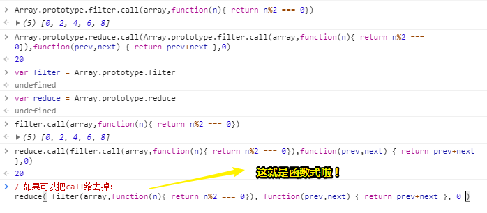
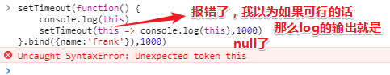

# 你真的懂函数吗？（下）

## ★柯里化

### ◇大概内容

> 返回函数的函数

柯里化：将 f(x,y) 变成 f(x=1)(y) 或 f(y=1)(x)

```
		  //柯里化之前
  function sum(x,y){
      return x+y
  }
  //柯里化之后
  function addOne(y){
      return sum(1, y)
  }
  //柯里化之前
  function Handlebar(template, data){
      return template.replace('{{name}}', data.name)
  }
  //柯里化之后
  function Handlebar(template){
      return function(data){
          return template.replace('{{name}}', data.name)
      }
  }
```

柯里化可以将真实计算拖延到最后再做

关于柯里化的高级文章：

1. <http://www.yinwang.org/blog-cn/2013/04/02/currying>
2. <https://zhuanlan.zhihu.com/p/31271179>

---

看了一些关于函数的定义之后，**✎：**

把sum函数看作是：`sum(x,y) = x + y`

而addOne则是：`addOne(y) = sum(1,y)=1+y`

ps：上面那个柯里化后的第一个demo，你得这样看才行：

```js
//柯里化之前
function sum(x,y){
      return x+y
}

//柯里化之后
function sum(x){
    return function (y) {
      return x + y
  	}
}
```

把addOne那个代码看作是上面这个柯里化之后的返回值——匿名函数就好了！

> 如果你的函数的返回值是一个函数，那么你的函数就会有一个特殊的名字……

#### 柯里化

数学里有这么一个概念：

```js
z = f(x,y) = x + 2y
```

z是关于x和y的一个函数……

假如我们把x的值给指定好了：

```js
g = f(x=1,y) = 1 + 2y
```

可见g是关于y的一个函数

那g和z的是关系是什么呢？

z根据2个变量来动，而g则是根据一个变量来动……

所以g和z的关系就是「g叫做z的偏函数（Partial function）」，即g只是z的一部分

而柯里化基本上就是这样——**把一个函数其中的一个参数给固定下来得到一个新的函数**

举个栗子，**✎：**

有一个求值函数，即sum函数，它是关于x和y的这样一个函数

```js
function sum(x,y) {
    return x + y 
}
```

如果我们这样写：

```js
function addOne(y) {
    return sum(1,y)
}
```

addOne就是把sum的x参数固定成1，然后再加上后面的数——y

所以当你 `addOne(6)`的时候，那么结果就是7啦！

同理，我们再写个addTwo：

```js
function addTwo(y) {
    return sum(2,y)
}
```

那么 `addTwo(3)`就是5啦！

这就是所谓的柯里化……

那么柯里化有什么意义呢？——目前来说，只是一个形式上的变化，但是它确实是有一定意义的！以我们早期的前端的模板引擎为例……

比如说我们有这样一个需求「给我一个模板字符串，再给我一个数据，我就能给你返回一个HTML」


我们的template写得很简单，template就只能有一个叫做name的东西，至于大胡子`{{}}`只是用于占个位而已，因为好识别……然后把里面的`name`改成`data.name`，接着就是把它给return出来了……

当我们调用这个handlebar的时候，你会发现这函数就是把字符串和对象里面的东西给结合起来！

这就是模拟的一个假的 handlebar了！

然而这样是有一个问题的，就是你会写很多次一样的字符串，如，我换个名字，你就得再来一遍这样的：


所以，我们能不能只写一次呢？因为我们这个模板经常在各个地方需要被用到，简而言之，它就是一个很复用的模板

所以咋办呢？

嗯……试试这样做——用一个变量接收这个模板：


然而，函数式编程它基本不会频繁的做这样的变量声明，为此每次调用handlebar都要传一个template……所以，它想对你说「为啥不声明一个柯里化的函数呢？」

就像这样：


这个Handlebar2函数需要被调用两次，第一次会把template给记下来，第二次它才会真正地渲染

我们是如何写这个Handlebar2的？——return一个函数，而这个函数是接收这个data的，而Handlebar2它自己只接收一个template。

测试：

t是个函数，它会接收一个数据。当我们调用t的时候，字符串才会和所传的这个数据结合到一起！

总之，你给了template，并不会渲染什么东西，等你把数据给了之后，才会去渲染，即把data里的东西填到模板里去，**✎：**


好了，这就是柯里化在模板引擎里的使用了，但是现在用得很少！因为意义并没有特别大！当然，它可以用来做惰性求值！

那么什么是「惰性求值」呢？——就是你在调我第一个函数的时候	，如调用Handlebar2函数得到的t函数，其实啥也没做，即只是return了一个函数而已！如果说「我们需要对这个字符串做很重的操作，比如说什么正则啊、什么Ajax啊……」，那如果我们直接在函数声明的时候就调，可能会显得有点麻烦，还不如在某个时间真正地使用这些重操作，然后再去调，再去生效，如第二次调用的时候才真正地生效，这就是惰性求值了！

简而言之，你第一次调用Handlebar2的时候啥也没做，Handlebar2只是在你最后一次真正调的时候才去做一些事情！

所以说柯里化在惰性求值这一方面还是有点意义的，但是在其它方面，我觉得它就是一个形式（做做样子、装装逼）而已！

以上就是对柯里化的了解了……

## ★高阶函数

### ◇大概内容

在数学和计算机科学中，高阶函数是至少满足下列一个条件的函数：

1. 接受一个或多个函数作为输入：forEach sort map filter reduce
2. 输出一个函数：lodash.curry
3. 不过它也可以同时满足两个条件：Function.prototype.bind

### ◇仔细分析一波

高阶函数？看起来很高端，实际上很low很low……

我们从[维基百科](https://www.wikiwand.com/zh-hans/%E9%AB%98%E9%98%B6%E5%87%BD%E6%95%B0)上可以看到关于它的定义，就这么一句话：

> 在[数学](https://www.wikiwand.com/zh-hans/%E6%95%B0%E5%AD%A6)和[计算机科学](https://www.wikiwand.com/zh-hans/%E8%AE%A1%E7%AE%97%E6%9C%BA%E7%A7%91%E5%AD%A6)中，**高阶函数**是指至少满足下列一个条件的[函数](https://www.wikiwand.com/zh-hans/%E5%87%BD%E6%95%B0)：
>
> - 接受一个或多个函数作为输入
> - 输出一个函数

如果函数接受函数作为输入或者函数它输出一个函数，那么它就是高阶函数，当然，它也可以同时满足既输入函数又输出函数！

可见，这样的例子是非常多的！如：

#### 接收一个或多个函数作为输入

我们学到的第一个高阶函数就是 `array.sort()`啦！


这个sort函数接收一个函数，用来比较数组里面的大小！a-b>0，就a大，否则a就是小的……根据a-b的结果是大于0还是小于0，我们就知道怎么去排列这个array了……

➹：[Array.prototype.sort() - MDN](https://developer.mozilla.org/zh-CN/docs/Web/JavaScript/Reference/Global_Objects/Array/sort)

那么还有哪些呢？

- `array.forEach(function(){})`
- `array.map(function(){})`

- `array.filter(function(){})`
- `array.reduce(function(){})`
- ……

如果你不清楚它们的用法可以去看一下MDN……

➹：[Array - MDN](https://developer.mozilla.org/zh-CN/docs/Web/JavaScript/Reference/Global_Objects/Array)

这几个函数都接受了一个函数参数，所以它们是高阶函数……

> 我在想函数就是函数，为啥还要加个「高阶」呢？其实这就像是给函数分了个类一样……在生活中，我们时常需要分类，如厨房就放置一些做菜的工具，卧室当然就得有张床啦！总不能把床放到厨房中吧！还有在网上购物的时候，总会有很多分类选项供你点击……总不能把所有东西都统称为「商品」吧！不然，不然检索起来岂不是一团糟……
>
> 总之，我们分好了类，才可以更好地记忆它们……

#### 输出一个函数

这种我们有没有见过嘞？

之前讲到过的bind函数就是这样的……

当你用call的时候，call的第一个参数就是一个函数fn，这个函数会被bind包转成另一个函数，也就是bind会返回一个新的函数，然后这个新函数的肚子里会调用这个fn，而在调用fn的时候会接收一些参数，就像这样：

```js
fn.bind.call(fn,arg1,arg2,……)
```

fn作为bind里的this，而arg1则是作为fn.call()的第一个参数……而arg2等后面的参数就是fn的输入参数啦！

这就是我们所学过的输出一个函数的高阶函数——bind……

当然，你也可以认为`new Function('x','y','x+y')`也是输出一个函数的！但是这个不太典型……

我们在更多的时候会认为它是一个构造函数！

#### 二者兼顾

bind就是这样的函数……输入一个fn，输出一个新的函数，包含着fn……

回顾柯里化，你会发现高阶函数与柯里化（将函数的参数个数变少，然后输出一个新的函数）是有交叉部分的，毕竟柯里化后的函数总是返回一个偏函数或者说是匿名函数……

而函数只要满足输出一个函数，那它就是高阶函数了……所以高阶函数的范围更广一点

总之bind是一个非常标准的高阶函数！为什么说它非常标准呢？因为它符合所有的条件，它可以接收一个函数，同时又输出一个新的函数，

#### 有什么用呢？

高阶函数有什么用呢？——它有一个特别重要的作用就是「**它可以将函数任意地组合！**」

以我们数组所提供的那几个API为例……

**①需求：找出数组里的所有偶数，并它们都加起来**


正常来说，我们会通过一个for循环遍历一下数组，可见这个思想是很程序员化的！然后求模，加起来，最后输出……

可是为啥不这么做呢？——直接找出所有的偶数——通过filter函数可以做到，接着就是用reduce归纳了……


以上这种是用面向对象的形式来写的！

ps：reduce（归纳）、n%2（读作n模的2）

filter函数是返回一个新数组，对array数组没有副作用。同样reduce也是个纯函数！关于reduce的第二个参数：


如果我们想改成非常非常的函数式写法：



我们这个filter函数接收一个array数组，然后再接收一个函数。由于接收一个函数，所以filter就是一个高阶函数啦！为什么要接收一个函数呢？因为这个函数是一种筛选规则啊！如只要元素为偶数的……这样就得到了一个 `[0,2,4,6,8]`的新数组啦！

> 似乎可以把传入函数看作是传入一种计算规则……

接着我们reduce这个新数组，那么怎么reduce呢？我们需要给这个reduce函数传一个函数，所传的这个函数是告诉reduce如何去把第一个参数给压缩一下，如压缩成20（0+2+4+6+8）……然后还有一个参数是初始值等于0！

reduce这步操作就相当于是我们之前遍历然后累加的结果，即把几句话变成一句话了！

**②需求：把一个数组里面的所有单数（奇数）给找出来，然后给它们排序**


1. 找出所有单数：

   ```js
   filter(array,function(n){ return n%2 === 1})
   ```

   返回一个都是单数元素的数组，然后对这个数组排序，那么怎么排呢？——直接sort一下就好了

2. 排序：

   ```js
   sort(filter(array,function(n){ return n%2 === 1}),function(a,b) {return a-b})
   ```

   sort这个数组需要给判断依据才行，因为我们需要判断1和3到底哪个大，我们一眼就能看出来哪个大，但是机器是不知道的哈！当然，这个sort函数默认是从小到大排列了，可万一我们是打算倒着排呢？即从大到小呢？所以我们必须得告诉sort一个函数！——这个函数就是如果有两个数字，那么就用「前面的数字减后面的数字」的值当作是排序的依据就行了！

   总之，这行demo的意思就是找出所有单数，然后进行一个从小到大的排列……

如果不用函数式的姿势写，如之前的那种循环、遍历数组、累加会很不直观，而用高阶函数的这种（上面那行代码）会很直观！

对于filter、sort等这些函数，我们在Underscore（下划线）或者是Lodash中，都可以找到如何去写！总之就是「reduce怎么写」「sort怎么写」都可以从这两个JavaScript工具库中找到……

➹：[Underscore.js 中文文档](http://www.bootcss.com/p/underscore/#)

➹：[Underscore.js](https://underscorejs.org/)

➹：[Lodash 中文文档 - Lodash 中文网](https://www.lodashjs.com/)

目前，高阶函数在前端比较流行。为什么这么说呢？——就是因为它有这种很「直观」的特性

我们知道在React里面	，每一个组件其实就是一个纯函数，可以是一个纯函数。那如果一个组件是一个纯函数，那么组件和组件是不是能互相转化，然后互相使用呢？

所以高阶函数就在前端火起来了！

你有了高阶函数就可以把各种函数给组合起来，如这个函数接收另一个函数，然后返回一个新的东西，而这个新的东西可以作为另一个函数的参数，也可以作为另一个函数……

总之，高阶函数还是很有用的！

如果你不知道高阶函数是什么，那就回想起之前所讲到的那几个函数，如sort、forEach、filter……它们都是接受一个函数，然后对数组做一些事情

额……下图中，左边那种姿势不太好，对于纯函数来说，还是用call比较好，为什么这么说呢？——因为你用了call之后，你才能真正地理解什么叫函数：


> 似乎「纯」也可以体现在显示地指定了this值，这样一来这个函数看起来就像是独立的一样，不需要关注这个函数的点前面是什么鬼东西，我们只需要关注：`输入、关系、输出`就好了

再次回顾这几个函数的用法：

- sort：对array进行排序，排序的依据就是后面那个函数fn
- forEach：传一个array，对这个array进行遍历
- map：对array的每一个元素进行一个转化
- filter：接受一个数组，对这个数组的每一项进行过滤
- reduce：也是接受一个数组，对这个数组的每一项进行累加或者是其它操作，总之所有的操作都放到fn里边
- bind：接受一个fn作为this，然后对this进行操作，然后操作的时候就是调用这个this，即调用这个fn，而fn的参数就是之后的那几个参数，而fn的调用形式肯定是call的那种形式，而不是那种智障姿势，即直接加括号的那种形式。总之就是用call的形式，不会用括号的那种形式

现在的你可能对高阶函数理解得不深刻，等你在React里面用到高阶函数的时候，你就会特别深刻了！——不就是他妈的接受一个函数，然后返回一个函数吗？

好了，这就是高阶函数啦……

## ★回调和构造函数

[回调](https://www.wikiwand.com/zh-hans/%E5%9B%9E%E8%B0%83%E5%87%BD%E6%95%B0)的英文叫做「Callback，即call then back」

之前对`call`讲解了很多次了！——即用call来调用一个函数

而callback则是回调一个函数

### ◇两种姿势看回调

我们直接看一下回调的形式先：

- 如果你把回调当作是个名词：回调指的是被当做参数的函数，即如果一个函数是另一个函数的参数，那么这个函数就是回调

  回顾上一节的demo：

  

  为什么说它是回调呢？——因为它是一个函数，而且它被当作是一个参数，即实参……

  总之，被当作参数的函数就是回调，就是这么简单……讲真，为啥有些人理解起来会很困难，当然如果以这种方式理解起来是很简单的，但是这个其实是不一定的，因为还有一个隐含条件，那就是你传的这个函数，还得在函数体中call一下才行！因为它不call的话，那就不叫做callback啦！

  所以你传了一个函数给这个函数，然后这个函数再调回来，那么这就叫做callback啦！

  如我们这个map函数，我们给它传了一个函数参数，那么这个函数参数什么时候会调呢？当我们遍历这个array数组的每一项的时候都是会调用这个函数参数的

> 回调就是作为参数的函数，不过这个被当作参数的函数，一定会被在里面给call一下，而这个call就叫做callback

我们把这个函数参数作为名词形式来看待——即是回调

但是我们也可以把它作为动词形式来看待，什么动词形式呢？——当这个map里面对这个函数参数进行call的时候，这个call的动作，即call一下，就叫做callback，这是一来一回的，我们传了一个函数过去，然后再call回来，既然call回来了，那就是callback咯！可见，就是这么简单……

> 我在想：这不就是在说我们这个函数参数，会在函数体中被call一下，为此我们可以把这个函数参数看作是回调。如果我们说传一个回调给这个函数xxx，那么潜台词就是说这个函数参数是会在这个xxx的函数体中被call一下咯！

### ◇对回调最大的误解

对回调最大的误解就是认为回调是在处理异步！

如我们之前的 `array.sort(fn)`，你说这个sort函数在进行异步操作吗？我们在排序一个数组的时候有异步吗？——并没有……又比如 `array.forEach(fn)`，我们在遍历一个数组的时候有异步吗？——同样也没有！

可见，回调跟异步没有半毛钱关系……回调就是回调，异步就是异步，没有任何关系！

有的时候回调会用到异步，异步会用到回调，这只是一个同时出现的这么一个关系，不算真正的关系

看看异步的回调是个怎样的情况：

```js
setTimeout(fn,1000)
```

setTimeout需要接收一个函数fn，这个fn就是回调  ，为什么说它是回调呢？因为fn被作为参数了啊！一个函数被作为参数，那么它就是回调。由于这个setTimeout是异步的，所以这个就叫做异步回调。而之前那几个数组API是同步的，所以它们就叫做同步回调！

或许你会问「回调是不是分为同步和异步？」——嗯，这个问题有点智障……为什么这么说呢？因为同步和异步已经把世界上所有东西都分成两类了啊！而这两类当中当然会有回调啊！就像是这个世界有医生，所以医生是不是应该分为男医生和女医生呢？可见，这是不是很无聊？毕竟世界上有很多东西都可以划分为男和女……简而言之，医生就是医生，与性别无关……回调也是如此，如果你非要让回调跟「同步和异步」有关系，那么这就是你强行做的一个关系，医生和男女有什么关系吗？没有什么特殊的关系，所以异步或同步和回调也没有特殊的关系！

> 程序员是男是女有关系吗？嗯……这个得强行拉一波关系才行，如果你一个男程序猿周边都是女程序媛，那岂不是美滋滋……喂……不要做梦了，该醒醒了……

当然，一般来说，异步操作如果不用回调的话，还挺难做的！如：如果setTimeout不传一个函数fn，而是传一个字符串化的函数：


ps：如果是字符串化的函数是不能为这个函数追加参数的……

➹：[window.setTimeout - MDN](https://developer.mozilla.org/zh-CN/docs/Web/API/Window/setTimeout#Callback_arguments)

这种姿势无法让你为这个「函数」参数追加参数，只有使用了回调才可以在后面追加参数：

```js
setTimeout(fn.bind(obj),1000,1,2)
```


我们的bind是一个高阶函数，它输出一个函数，然后1s后会调用这个函数，函数体里会call一下这个fn，然后把bind第一个参数交给call的第一个参数

可见我们把所有的概念都纠结到一起了，如谈到异步，就说到了它的回调函数，然后又说到了bind这个高阶函数……讲真，这挺神奇的……

或许你会问「函数里边怎么会有那么多的概念？其实全部都是函数哈！」

- 如果一个函数接收一个函数那就是高阶函数
- 如果一个函数返回一个函数，那么这个函数也叫做高阶函数
- 如果一个函数被当作是参数，那就是回调
- 如果一个函数所返回的函数中参数要比原函数要少一个参数，那么这就是柯里化

或许你又会问「为什么函数这么一些细小的差异都要叫一个名字呢？」——嗯……我也不知道，函数式就喜欢搞这些名字！话又说回来，你以为只有函数式喜欢搞这些概念吗？面向对象的概念比函数式多多了……只不过你对面向对象式接触得比较多而已，比如你看面向对象就有继承、封装、多态等概念，什么鬼？这可比函数的那些概念要难理解得多……而且自己有些时候都搞不清楚这些概念，如继承？得到遗产吗？——嗯，不懂……对于函数就很好理解了，每个概念都可以很明确的告诉你是什么，如当作参数就是回调咯！一个或多个函数作为输入或者输出一个函数，那么你就是高阶咯！返回的函数少了一个参数，那你就是柯里化咯！可见一句话就说清楚了！但是面向对象这个概念呢？那就真得难说清楚了……

### ◇构造函数

来到最后一个概念了——构造函数……

这个概念相较之前的更简单——返回对象的函数就是构造函数 

之前说到返回函数的函数就是高阶函数，所以说「为啥要单独搞个名字叫做构造函数呢？」
因为「返回对象的函数」有7个字，而「构造函数」只有4个字，可见省了将近一半，你说这是不是一个质的飞跃？所以单独搞一个名字是很有好处的……

言归正传，我们见过最明显的构造函数就是 `Number`啦：

```js
new Number(1)
```

在这里new是一个语法糖，而这句demo将会返回一个对象，这个对象的原始值是1，还有一些原生的API

注意，当我们讲构造函数的时候，最好把new给去掉 ，因为这个new对这个构造函数干了很多你看不见的事儿……

所以你应该这样讨论构造函数：

```js
function Empty() {
 	return {}   
}
```

这就是一个构造函数啦！因为这个函数返回了一个对象哈!

一般来说，构造函数默认就是大写字母开头的！而且你需要注意一点的就是你不需要去return，而且这个空对象也不需要去写，就像这样：

```js
function Empty() {
    
}
```

当你这样：

```js
var empty = new Empty
```


> 没想到可以不用写括号，或许可以认为new这个家伙，让我们以call的形式调用了这个构造函数

为什么不需要写return和空对象呢？——因为构造函数已经被很多语言给默认的采纳了，所以如果你想要用一个构造函数，很简单，不需要return，直接使用new，它就会帮你return出一个对象出来！

如果你不写new，那么这个Empty函数就什么也没返回了，当然这默认会帮你返回一个undefined……

但是，如果你写了new，那么这个Empty函数就会自动地多出了几行，比如说它会多出这么一行：

```js
function Empty() {
 	return {}   
}
```

你在这个Empty函数中什么都没有写，但用了new，就像是写了 `return {}`一样，即没有写跟写了一样

> 说得好像你会一样……哈哈——有人帮我会了

那如果我们想对这个返回对象加属性该怎么办呢？ ——直接用this就行了：

```js
function Empty() {
    this.name = '空'
    return this
}
var empty = new Empty //Empty.call({})
```

> 之前的理解是：
>
> ```js
> function Empty() {
> 	var temp = {}
> 	var this = temp
>     this.name = '空'
>     return temp
> }
> ```
>
> 反正从各种角度来理解咯，不管是用call，还是用什么。当然我更倾向于用call这种姿势去理解这个new到底对这个构造函数Empty做了什么！

这个this是怎么来的呢？来自call的第一个参数哈！

总之Empty这个函数可以写 `return this`，也可以不写，只要你有new这个语法糖，它就会帮你写这句话……

那如果我不用new呢？——那就是不要糖咯：

```js
function Empty() {
    this.name = '空'
    return this
}
var empty = Empty.call({})
```

这种就是new的去糖形式，即不要糖，我想只想知道其中的语法是如何运行的！

其实这个空对象放在Empty里面也行：

```js
function Empty() {	
	this = {}
    this.name = '空'
    return this
}
var empty = Empty()
```

但是这样做的话，那就会有一个问题了，即你不能给this赋值了，总之你这个JS限制了我们使用call传this值……

而且这也显得有点奇怪！

所以我们还是把空对象放在外面更好一点！：

```js
function Empty() {
    this.name = '空'
    return this
}
var empty = Empty.call({})
```

放在外面后，调用这个构造函数就给这个空对象添加了个name，然后再把它给return出去，这就像是把一个水果放在压榨机中然后变成果汁一样，如从橙子变成了橙子汁……从空对象变成了有name的对象……从一个橙子变成一杯橙子汁……讲真，这个比喻有点尬，总之就是把输入加工一遍然后再输出来，或许会添加点东西，或许会移除点的东西……

好了，这就是构造函数了，再次强调一遍——返回一个对象的函数就是构造函数！

> 函数也是对象啊？所以这应该说是返回一个普通对象吗？即一个hash表吗？……

我们仔细回想一下我们所接触过的函数，你说函数会经常返回对象吗？——其实不经常，很少会有函数会返回对象，如我们之前的sum函数，返回对象吗？不返回，我们返回的是一个数字。还有很多函数都是返回一些特定的值，比如返回一个字符串、返回一个数字、返回一个布尔等……所以返回对象是一个特别特殊的例子，所以我们把它叫做构造函数，嗯……我觉得这其实很无聊……

一般来说，JS的习惯是构造函数的首字母要大写

好了，到此为止我们把函数的一些相关概念都过了一遍……额，似乎还有个箭头函数没过……

这个箭头函数就留到最后讲了，为什么留到最后呢？因为它特别好用，一旦先讲了这个箭头函数，或许你们就不想用这个function关键字了

---

## ★箭头函数

箭头函数特别简单

话说，我们以前写函数是怎样写的呢？——这样：

```js
function fn(x,y) {
    return x+y
}
```

那么箭头函数呢？——它没有名字，我们需要给一个变量来引用它：

```js
var fn = (x,y) => x+y
```

我们之前在第一节已经讲解过它，它还有几种简写的姿势：

- 一个参数的时候就不需要加括号
- 如果函数体中有两句话或两句话以上的时候，就需要自己加return

> 箭头函数，很简洁，但函数体中只有一句话的时候，那么箭头函数看上去就是输入输出了……

我们不需要再次着重讲这些个语法了，我们要着重讲的是，箭头函数和用function关键字声明的函数之间的区别。

那么它们之间有什么区别呢？——那就是箭头函数没有this，可见JS这是在打自己脸啊！你看它出了一个新语法说：「我这个语法的特点是不支持this，除此之外跟这个用function关键字声明的函数一模一样」，这说明了官方都觉得this不好用！因为this它是一个隐含的参数，然而为啥要隐含呢？明设这个参数岂不是更好吗？

### ◇旧姿势确定this

言归正传，我们还是通过demo来看看它们之间的区别——以setTimeout为例


1s后，我们会调用bind所返回的一个新的函数，然后这个新函数的函数体中会用call的姿势调用bind的点前面这个函数，总之就执行这个 `console.log(this)`咯！显然我们用bind指定了this，所以log出来的结果就是 `frank`啦！对了，我们在这里把bind点前面的那个函数叫做旧函数，通过bind调用一下就返回一个新的函数，而新的函数就会调用旧的函数

如果我们不写bind呢？——显然结果是window：


如果我们既写bind，又在旧函数中添加个setTimeout，而且同样log出一个this，你猜这个this的值是什么：


如果你认为第二个this跟第一个this是一样的，那我只能说这很智障了！为什么这么说呢？：


你说这两个a是一样的吗？——肯定不一样啊！它们一个在外，一个在内，都是函数的一个形参而已，我们说this是call的第一个参数，this是参数，而a同样是参数 ，既然你知道外面的a与里面的a不一样，那么你说「外面的this和里面的this能一样吗？」都是参数，难道你这个this参数就特殊一些？所以说这个this是动态的，就是你传给我是什么this，那么这个this就是什么……

第二个函数被调用的时候，我们并没有传this，就直接call，也没有bind什么东西！所以这个this就是window啦！

那么我们如何让第二个this也打出 `frank`呢？——再bind一下就完了吗：


我们所bind的这个this，并没有进入这个旧函数里面，而是外面的这个this，然后我们把外面的this作为里面的this！总之，我们通过bind把里外的this都给确定了！

以上就是旧姿势确定this的值了！

### ◇新姿势确定this

我们使用箭头函数，就不需要bind了！

我们之前说过箭头函数是不接受this的！


所以箭头函数里面的this就是外面的this，箭头函数自己本身是没有this的，也就是说JS在升级语法的时候，终于把这个隐含的this给去掉了，所以对于这个箭头函数 `() => console.log(this)`来说，this就是个变量而已，那么这个this变量从哪里来的呢？它会按照作用域往上找哈！因为箭头函数它自己肯定不会有this的，所以它一定会到它的父作用域里面找哈！而父作用域就是第一个旧函数里面哈！这样就可以确定第二个旧函数里的this是外面这个this了！

> 难道这个箭头函数不是在setTimeout这个函数里面找？然后没有找到this，就往上一级找？
>
> 我看了一下setTimeout的polyfill代码（其实看不懂哈！），这个箭头函数是个回调对吧！为了让自己能够理解，我猜测调用setTimeout后，返回了这个箭头函数，而这个箭头函数是自己apply一下的！而apply的第一个参数所传的是一个null值，然而我们并没有为这个箭头函数添加形参this值，那假如添加上了呢？
>
> 
>
> 这是在告诉我箭头函数是不能用this作为参数的吗？
>
> 
>
> 这是个：只是个
>
> 总之箭头函数里的this值就是往上找，不管你是不是用call，apply，bind还是什么姿势来调用了这个箭头函数
>
> 因为箭头函数本来就没有this，或者说是咩有隐含形参this，我们在箭头函数中写得this就是个普通的this变量而已！反正我们并没有声明这个this变量，如果你把一个有this的箭头函数放置于有this的普通定义（用function关键字声明的）的函数里面，那么这个箭头函数里的this的值就是它爸爸级作用域里的this值了！
>
> 
>
> 其实，也可以通过传参为a变量赋值，只是this这种变量是特殊的：
>
> 
>
> ---
>
> 
>
> 为什么会这样呢？
>
> - 在执行上下文中，你不能这个this关键字赋值，因为它是不可变的
>
> ➹：[window - Javascript - this={} -> Invalid left-hand side in assignment - "CLOSED" - Stack Overflow](https://stackoverflow.com/questions/48871249/javascript-this-invalid-left-hand-side-in-assignment-closed)

当你希望一个函数里面的this和外面this一样的时候，你就使用箭头函数。因为箭头函数本身是没有this的，像用function关键字声明的函数本身一定是有this的。

我们前面讲过每次进入一个function的时候，一定会：

1. 把它压到callstack里面

2. 确定一个this，这是一定会确定的，即使你没传也会确定一个！总之这是不得不传的，非常强制性的，所以这是JS设计的漏洞！它没有办法让你不绑定this，所以一旦进入这个函数，那么this一定会变！如果不指定this的话，那就是window了！

   那么有没有办法不指定这个this呢？——可以，不要用function就好了，毕竟function已经写到规范里了，改不了了！所以我们用箭头函数即可！而箭头函数跟function也差不多，就少了一步，它也会这样：

   1. 压到callstack里面
   2. 不绑定this，绑定arguments。也就是说它是有arguments的，但是就是它咩有this，即就是把this给去掉了！这样一来才算是回到了真正的函数了！没有任何隐含的逻辑……

### ◇做一些比较奇怪的事情


我们写了一个箭头函数，它的功能就是打出一个this。如果我们强制指定一个this到底行不行呢？——不行，你以为这样就能把this传给箭头函数吗？箭头函数它是不接受的，它会直接忽略所传得这个this，所以不管你做了什么，箭头函数里的this始终是外面的this，而外面的this是什么呢？显然默认的就是window啦！

我们永远无法对箭头函数指定this，而箭头函数永远都是会把外面的this当作是里面的this ，这样一来，箭头函数里的this就不是参数了，而是变量，而函数里的变量又涉及到词法作用域，所以这样以一来我们就首尾呼应之前的内容了……举个例子来说，箭头函数里的this就像是下面这个变量a ：


这个a是外面那个a，我们是无法改变的，至于a的值可能会变：


我们继续添加个this：


为什么说它们俩不一样呢？因为this它是每次进入一个函数都会被传一个新的值的变量，而且它不是一个普通的变量，所以this的值是跟着参数走的！第二个this要根据fn2.call()的第一个参数确定，同理，第一个this要根据fn.call()的第一个参数确定！

所以在这里this它不是词法作用域，但是我们如果用箭头函数呢？**✎：**


fn3里的a是词法作用域，因为变量名就是词法作用域，而fn3里的this（看下图）呢？则是词法this，所以你只要确定外面的this是什么，那么里面的this就是什么，不过，这不能完全做词法，因为外面的这个this还是要通过call来确定的！不管怎样：


箭头函数自己不会改变this，而是通过这个局部的词法作用域（蓝色那部分）来确定的！

好了，关于函数的内容就此结束……

- 定义一个函数的三种姿势

- 词法作用域
- this&arguments
- call stack
- call/apply
- bind
- return——每个函数都有return，如果你不写return，就相当于写了return undefined
- 柯里化/高阶函数
- 回调
- 构造函数

你还记得它们的定义吗？——请回忆一下，只要你还能记得它们的定义，那么这节课就是成功的！

> 对词法作用域，不太感冒……
>
> ➹：[动态作用域和词法域的区别是什么？ - 知乎](https://www.zhihu.com/question/20032419)

## ★课后习题

### ◇测试-自测题

> 请写出一个柯里化其他函数的函数 curry，这个函数能够将接受多个参数的函数，变成多个接受一个参数的函数，具体见示例（这是 [lodash.curry](http://lodash.think2011.net/curry) 的文档示例）：

```javascript
function curry(???){
    ???
    return ???
}
var abc = function(a, b, c) {
  return [a, b, c];
};

var curried = curry(abc);

curried(1)(2)(3);
// => [1, 2, 3]

curried(1, 2)(3);
// => [1, 2, 3]

curried(1, 2, 3);
// => [1, 2, 3]
```

> 真做不出来，我原先的思路，先人工柯里化一下这个abc函数，然后在用程序柯里化这个abc函数，然而我是真得写不出这个curry函数出来，感觉这其中需要用到递归的，涉及到递归头又大了！只好厚着脸皮去看答案了：

```js
function curry(func , fixedParams){
    if ( !Array.isArray(fixedParams) ) { fixedParams = [ ] }
    return function(){
        let newParams = Array.prototype.slice.call(arguments); // 新传的所有参数
        if ( (fixedParams.length+newParams.length) < func.length ) {
            return curry(func , fixedParams.concat(newParams));
        }else{
            return func.apply(undefined, fixedParams.concat(newParams));
        }
    };
}
```

有时候会想，程序真得很神奇，短短几行代码，就能弄出这么多「花哨」的事儿！分析一下这个curry函数：

先出现的两个数组API：

- slice：是个纯函数，有「切片」之意，从哪里开始切割这个数组呢？它的参数选择有3种——不传、传一个、传二个，不传默认返回的就是跟原数组一个样，不过这返回的是一个新的数组，而且里面的元素是浅拷贝的，也就是说如果元素是对象之类的，那么新数组和旧数组关于这个元素将会是同一个引用

  还有就是参数遵循「包前不包后原则」。废话少说，语法就是这样：

  ```js
  arr.slice();
  // [0, end]
  
  arr.slice(begin);
  // [begin, end]
  
  arr.slice(begin, end);
  // [begin, end)
  ```

  

- concat：也是一个纯函数，返回一个新数组，用于合并两个或多个数组

  语法：

  ```js
  var new_array = old_array.concat(value1[, value2[, ...[, valueN]]])
  ```

  输入：`valueN`——将数组或值连接成新数组，其实数组和值可以同时出现

  输出：新的Array实例

  同样也是浅拷贝

  

言归正传：

curry函数需要接受2个形参：一个是需要被加工的函数func，一个是固定参数fixedParams

`Array.isArray()` 用于确定传递的值是否是一个 `Array`。

如果fixedParams不是一个数组，那么就把它初始化为一个空数组

接着返回一个新的匿名函数（原来加工这个函数只需要返回一个新的匿名函数就好了，我之前还在想如何直接加工这个func呢！），在这个匿名函数中，我们定义了一个新参数newParams，它的值来自于arguments ，我们把这个伪数组通过slice函数加工为真正的数组，就像这样：


如果「固定参数个数+新传的所有参数个数」小于 「 柯里化之前的那个旧函数func的参数个数」

那就继续对旧函数func柯里化，而且这次所固定的参数是合并了newParams，此时我们就可以跳过判断fixedParams

然后呢？

我发现我不能继续分析下去，我还是把这个func代入进去好了：


curry这个abc函数，没有传第二个参数，那么fixdParams的值就是undefined了，根据判断，这个fixedParams的值会初始化为一个空数组，然后返回了一个匿名函数，根据词法作用域，我们这个匿名函数是可以访问这个fixedParams的，或者说是闭包，因为有curried这个变量引用着这个匿名函数！

我们用3个括号调用这个这个curried函数，那么我们第一次就只传了一个参数，所以拿到的newParams是 `[1]`，

由于 `[].length === 0`+ `[1].length === 1` < `abc.length === 3`

所以继续柯里化，返回一个新的匿名函数，此时我们是重新柯里化了abc这个函数，并且这次是有fixParams的，而它的值为 `[1]`。

接下来就是第二个括号了，依旧是一个值，接着判断`[1].length === 1`+ `[2].length === 1` < `abc.length === 3`，所以继续柯里化。这次固定参数为 `[1,2]`

接下来就是最后一个括号，当然，还是一个值，然后判断 `[1,2].length === 2`+ `[3].length === 1` < `abc.length === 3`，`3<3`吗？显然不成立，所以这次就是直接用apply来调用这个abc函数了，为什么用apply而不用call呢？因为apply是call的另一个版本，而且在这里比call好用得多——apply的第二个参数数组！这样就不用一个个写实参了！

接下来传给apply的参数有，为this值指定一个undefined值意思意思一下！还有一个数组 `[1,2,3]`

这样最后一次调用就相当于是传了三个参数，只是我们之前的柯里化都固定了一个参数，其中这是一个层层嵌套的过程的，即按Call Stack的姿势来……

至于剩下的那两种调用姿势就很简单了：

- `curried(1,2)(3)`：第一次调用就固定了2个参数，最后一次就把之前保存的参数 `[1,2]`连同所传的 `[3]`给concat了一下，然后作为abc的参数
- `curried(1,2,3)`：直接进行func.apply这一步……
- `curried(1)(2,3)`: => [1, 2, 3]

这个curry函数给我的一些想法：

- 让我自己写一遍，肯定是写不出来，除非我抄了几十遍，但是这样一来，下次遇到类似的终究是不会的！
- 再次回忆了递归，这里的递归结束条件是 `fixedParams.length+newParams.length) < func.length`
- 我们想要真正的输出结果，终究是需要调用abc，之前之前的柯里化只是为了固定一个参数而已，直到最后一次，才体现了我们之前所传的参数而存在的价值！
- 如果直接从源码上分析还是很难的，最好从一个简单测试例子开始入手，即代入法
- 几个API——关于数组的：Array.isArray()、array.slice()、array.concat()；关于函数的：apply。或许突破口在于apply的第二个数组参数
- 自己终究还是很难写出这个curry函数出来！依旧是个菜鸡……真让人头疼……


---

## ★总结

- 目前了解到柯里化在惰性求值方面有点意义……柯里化就像是把一个函数给进化了一样，这似乎就是在减少我们在调用函数时所传的参数个数，你会发现「一个输入就一个输出是很简洁的！」，如有两个函数——`f(x) = 2x`和`f(x,y)=x+2y`，假如只传一个参数，那么就是 `2→4`；如果有两个参数，那么就是 `(1,2)→5`。总之我们只是喜欢只有一个东西与另外一个东西有关系，而不是有两个或两个以上的东西与另外一个东西有关系！
- 把函数给分类了，因为有些函数会改变它的调用者，而有些则不会，为此就有了纯函数的分类……总之，把函数给分类了，这样当你看到某种函数的时候会为它们贴上标签……就能更好地使用它们了！
- 看视频看两遍，第一遍大概过一遍就好了，第二遍带着问题去看，做好笔记……感觉看第二遍的时候，潜意识里会有第一遍的记忆，就像我之前潜意识里用call调用箭头函数，然后指定一个this，其实这个视频后面有讲到这种情况……而我之所以会有这样的测试，那是因为我之前看过一遍视频……

## ★Q&A

### ①什么是函数？

有很多方法可以去描述函数，但所有方法都离不开这三个主要部分，**✎：**

- 输入
- 关系
- 输出

以下是关于函数的**一般概念**，不谈其它的个别函数。**✎：**


ps：读作「*"f x 等于 x 平方"*」

这张图可以表示为，**✎：**

| 输入 | 关系 | 输出 |
| ---- | ---- | ---- |
| x    | `*x` | x^2^ |

说到函数首先得有个名字才行，最常见的叫`f`，当然还有其它的，如`g`、`果酱`等

我们把函数的**输入值**放在函数名字后面的括号`（）`中间：

> 所以 **f(x)** 的意思是函数叫 `"f"`，而 `"x"` 是**输入值**

函数对输入值进行的运作：

> **f(x) = x^2^** 显示函数 `"f"` 取输入值 `"x"` 的平方。

根据下面这个函数，


$$
f(x) = x^2
$$


我们假设输入为4，那么输出就是16了，所以我们可以这样


$$
f(4)=16
$$


一些注意点，**✎：**

- `"x"` 只是个位置标志符！,也就是说，你可以换成是其它符号，如q、z等什么的，而且这些符号还有个名字，叫自变量

- 函数有时没有名字，如  y = x^2^

  不过，这个函数仍然有，**✎：**

  - 输入（x）

  - 关系（取平方）
  - 输出（y）

- 「关系」：函数显示输入与输出的**关系**。"**f(4) = 16**" 就是说 4 和 16 是有关系的：4 → 16，而这个关系就是 f。举个例子就是「一棵树每年长高 20厘米」，那么树的高度和它年龄的关系可以用函数h来显示，**✎：**

  `h(年龄) = 年龄 × 20`

  所以，如果年龄是 10年，高度就是：

  `h(10) = 10 × 20 = 200厘米`

  > 输入和输出之间的关系可以用函数来表示，如树的年龄知道了，那么树的高度也就知道了，然而为啥会知道呢？因为有个函数可以描述它们之间的关系啊！
  >
  > 就像是我们俩的关系是男女朋友，然后输入一个「我爱你」，输出一个「我也爱你」

- 函数处理什么？最常见是数字，当然输入也可以是字母等其它特别的字符

- 对函数的另一个看法：把函数的输入和输出为一个 "序偶"，例如 (4,16)。这就是坐标了。函数可以被定义为序偶的**集**，而坐标的集也是函数

一些结论，**✎：**

> - 函数显示输入与输出的**关系**
>
> - 函数把一个集（**定义域**的元素联系到另一个集（陪域）的元素。
>
> - 所有的输出值（陪域里实际与定义域有关系的元素）的集叫**值域**
>
> - 特别关系：
>
>   - 包含定义域里**每个元素**，
>   - 任何输入值**只有一个输出值**（不能是一个**或**另一个输出值）
>
> - 一个输入值和它的输出值一起就叫做**序偶**
> - 所以函数也可以被视为一个**序偶的集**

抛开以上的一切内容，把函数看作是一个实现某种**功能**的工具（盒子），就像这样，**✎：**


函数d就是一个盒子，将输入的x转化为输出的y

> 在我看来这就像是拿一个东西去换另一个东西（注意：只能换同一件东西），至于换成是什么，到底值不值，这就看这个函数是如何定义的了，即「这个兑换规则是怎样的」或者说「这个东西和另外一个东西之间的关系是怎样的」
>
> 回到编程，或许把function翻译成「功能」比较好
>
> ps：联想到LOL，如何补刀呢？如何让这个小兵的最后一下是由你操纵的这个英雄给终结的呢？你输入一个平A，你要想得到这个小兵的经济，那么平A和小兵的经济的关系可以用一个函数f来表示，而这个函数该如何去写呢？按照我的经验，这会分很多情况，不过我一般都是凭感觉去补刀的，所以这不会保证自己一定会得到小兵的经济，除非周边没有其它家伙在攻击敌方小兵，而是只有自己操纵的那一个英雄……
>
> 所以说一个函数写得好不好，还是很重要的……因为写得不好的话，那么结果就有一定几率不是你想要的！如果我要用一个名字形容这样的函数的话，我会叫做「过家家函数」，似乎也可以叫做「玩具函数」，总之就是简单得可以搞一下，复杂一点的就不行了……
>
> 额……函数到底是关系（映射）？还是说函数让输入和输出有了关系呢？


---

➹：[函数是什么](https://www.shuxuele.com/sets/function.html)

➹：[函数 - Wikiwand](https://www.wikiwand.com/zh-hans/%E5%87%BD%E6%95%B0)

➹：[你对函数的理解是什么？ - 知乎](https://www.zhihu.com/question/21301730)

➹：[数学和编程](http://www.yinwang.org/blog-cn/2015/07/04/math)

### ②什么是 Lambda 演算？

➹：[Λ - Wikiwand](https://www.wikiwand.com/zh-hans/%CE%9B)

➹：[λ演算 - Wikiwand](https://www.wikiwand.com/zh-hans/%CE%9B%E6%BC%94%E7%AE%97)

➹：[什么是 Lambda 演算？ - 知乎](https://www.zhihu.com/question/21936396)

➹：[认知科学家写给小白的Lambda演算 - 知乎](https://zhuanlan.zhihu.com/p/30510749)

➹：[Good Math/Bad Math的Lambda演算系列的中文翻译 · cgnail's weblog](http://cgnail.github.io/academic/lambda-index/)

### ③函数式编程？

➹：[编程的智慧](http://www.yinwang.org/blog-cn/2015/11/21/programming-philosophy)

➹：[编程的宗派](http://www.yinwang.org/blog-cn/2015/04/03/paradigms)

➹：[JavaScript 函数式编程（一） - 掘金](https://juejin.im/post/5b7014d5518825612d6441f8)

➹：[functional-programming-in-javascript](http://slides.com/yangzhenyu/functional-programming-in-javascript#/)

### ④取余？

> 取模和求余应该是同一种运算，只是在被除数和除数符号不同时，余数的符号是有歧义的，可为正也可为负。不同的编程语言对此有不同的处理。
>
> C语言中取模运算 % 结果与**被除数同符号**。大部分编程语言都是这样，比如Go，C#，Java，Rust，Swift，JavaScript，PHP。
>
> Python 中取模运算 % 结果与除数同符号。同时Python中函数 **math.fmod** 提供了与C语言中一致的取模运算。
>
> 一般来说，还是 **取模结果与被除数同符号** 比较符合大多数情况。否则商向零取整不满足等式 **被除数=除数\*商+模**


➹：[编程语言中，取余和取模的区别到底是什么？ - 知乎](https://www.zhihu.com/question/30526656)

➹：[模除 - Wikiwand](https://www.wikiwand.com/zh/%E6%A8%A1%E9%99%A4)

### ⑤纯函数？

> 纯函数是这样一种函数，即相同的输入，永远会得到相同的输出，而且没有任何可观察的副作用。

```js
var xs = [1,2,3,4,5];

// 纯的
xs.slice(0,3);
//=> [1,2,3]

xs.slice(0,3);
//=> [1,2,3]

xs.slice(0,3);
//=> [1,2,3]


// 不纯的
xs.splice(0,3);
//=> [1,2,3]

xs.splice(0,3);
//=> [4,5]

xs.splice(0,3);
//=> []
```

嗯，一些函数把调用它的数组给搞坏了……而这些函数就不是纯函数了……

➹：[第 3 章: 纯函数的好处 · JS 函数式编程指南](https://llh911001.gitbooks.io/mostly-adequate-guide-chinese/content/ch3.html)

➹：[纯函数 - Wikiwand](https://www.wikiwand.com/zh-hans/%E7%BA%AF%E5%87%BD%E6%95%B0)

### ⑥什么叫语法？

> 名词：语言的结构规则。包括词法和句法

➹：[语法 - Wikiwand](https://www.wikiwand.com/zh-hans/%E8%AF%AD%E6%B3%95)

### ⑦执行上下文？

➹：[了解JavaScript的执行上下文](https://yanhaijing.com/javascript/2014/04/29/what-is-the-execution-context-in-javascript/)

似乎已经讲了啊！如call Stack、作用域链、this


