# 异步 - 代码烧脑的原因

## ★总览

本次任务的第一个视频是上节课课后题的答案

### ◇同步与异步

同步：等待结果
异步：不等待结果

注意，异步常常伴随回调一起出现，但是异步不是回调，回调也不一定是异步

```javascript
// 同步的 sleep
function sleep(seconds){
    var start = new Date()
    while(new Date() - start < seconds * 1000){

    }
    return
}
console.log(1)
sleep(3)
console.log('wake up')
console.log(2)
```

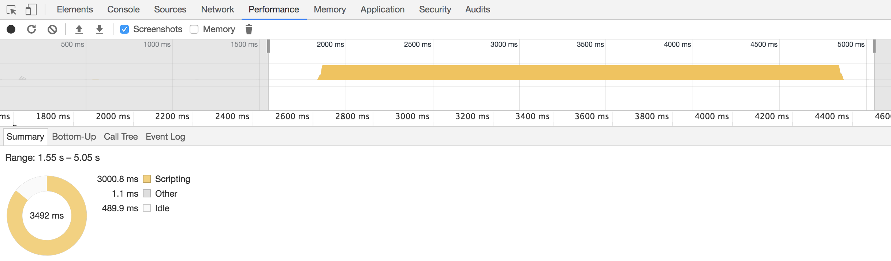

```javascript
//异步的 sleep
function sleep(seconds, fn){
    setTimeout(fn, seconds * 1000)
}
console.log(1)
sleep(3, ()=> console.log('wake up'))
console.log(2)
```

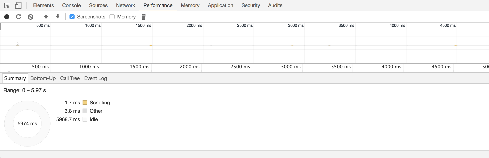

可以看出，用了异步之后，JS 的空闲时间，多了许多。

但是注意，在 JS 空闲的这段时间，实际上是浏览器中的计时器在工作（很有可能是每过一段时间检查是否时间到了，具体要看 Chrome 代码）

### ◇前端经常遇到的异步

```js
document.getElementsByTagNames('img')[0].width // 宽度为 0
console.log('done')
```

```js
document.getElementsByTagNames('img')[0].onload = function(){
    console.log(this.width) // 宽度不为 0
    console.log('real done')
}
console.log('done')
```

### ◇面试题中的异步

```js
let liList = document.querySelectorAll('li')
for(var i=0; i<liList.length; i++){
    liList[i].onclick = function(){
        console.log(i)
    }
}
```

把 var i 改成 let 就可以破解：<https://zhuanlan.zhihu.com/p/28140450>

### ◇AJAX 中的异步

```js
let request = $.ajax({
  url: '.',
  async: false
})
console.log(request.responseText)
```

```js
$.ajax({
    url: '/',
    async: true,
    success: function(responseText){
        console.log(responseText)
    }
})
```

### ◇异步的形式

一般有两种方式拿到异步结果

1. 傻逼方法：轮训
2. 正规方法：回调

### ◇回调的形式

1. Node.js 的 error-first 形式

   ```js
    fs.readFile('./1.txt', (error, content)=>{
        if(error){
            // 失败
        }else{
            // 成功
        }
    })
   ```

2. jQuery 的 success / error 形式

   ```js
    $.ajax({
        url:'/xxx',
        success:()=>{},
        error: ()=>{}
    })
   ```

3. jQuery 的 done / fail / always 形式

   ```js
    $.ajax({
        url:'/xxx',
    }).done( ()=>{} ).fail( ()=>{} ).always( ()=> {})
   ```

4. Prosmise 的 then 形式

   ```js
    $.ajax({
        url:'/xxx',
    }).then( ()=>{}, ()=>{} ).then( ()=>{})
   ```

### ◇如何处理异常？

1. 如何使用多个 success 函数？
2. 在有多个成功回调的情况下，如何处理异常？

### ◇自己返回 Promise

```js
function ajax(){
    return new Promise((resolve, reject)=>{
        做事
        如果成功就调用 resolve
        如果失败就调用 reject
    })
}

var promise = ajax()
promise.then(successFn, errorFn)
```

Promise 深入阅读：<http://www.cnblogs.com/hustskyking/p/promise.html>

Promise/A+ 规范：<https://segmentfault.com/a/1190000002452115>

### ◇async / await

```js
function buyFruit(){
    return new Promise((resolve, reject)=>{
        做事
        如果成功就调用 resolve
        如果失败就调用 reject
    })
}

var promise = await ajax()
```

```js
async functon fn(){
    var result = await buyFruit()
    return result
}

var r = await fn()
console.log(r)
```

## ★上节课答案

### ◇分析题目

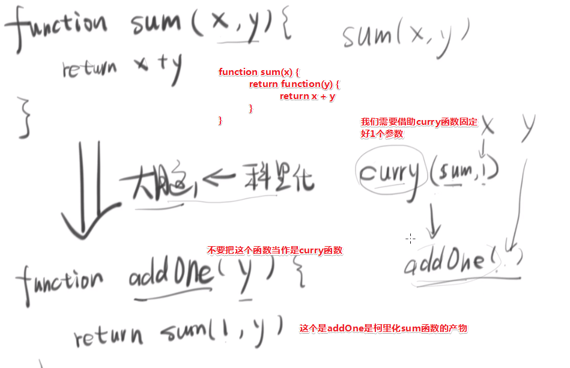

> 这莫非就是输入和输出，难怪老师会这样写……

### ◇如何写一个函数？

你在写一个函数的时候只需要关心两件事情：

1. 它的输入是什么鬼
2. 它的输出是什么鬼

搞清楚这个输入和输出之后，再去写这中间的逻辑！

### ◇开搞

**①根据形式，确定输入和输出：**

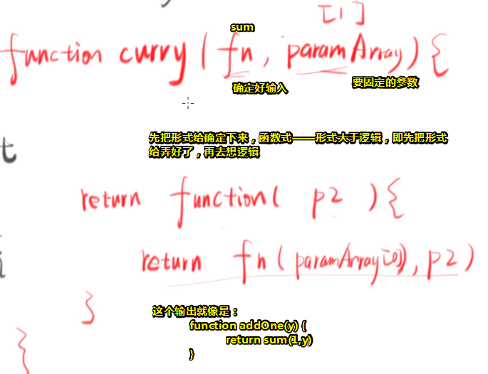

这个返回值的形式更addOne这个函数的形式一模一样……所以你在学函数式的时候一定要记形式，不要去管这个逻辑是怎样的额，只需要把形式给记下来就ok啦！为什么这么说呢？——因为对于函数式来说，形式是大于逻辑的，函数是有这个特点的，总之形式很重要，像柯里化整个就是一个形式变化

目前，我们知道了一个最简单的柯里化是怎么写的了！

**②简单点——实现一个只能把两个参数变成一个参数的curry函数**

> 当你没有思路的时候，就把这个东西给简化一下，所以我们不需要搞那么复杂的，只要能实现把sum函数变成addOne函数，那么我就是成功的。
>
> 总之先把这个最简单的（sum函数）给实现了，然后再去搞这个（abc函数）复杂的！

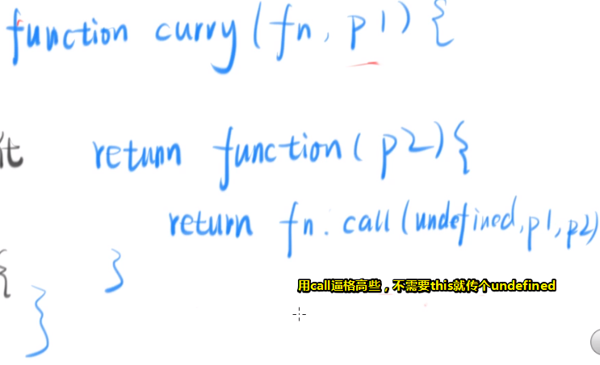

一旦调了这个return出去的函数，那么我们就call一下这个fn！

这个curry函数只能实现把sum变成addOne的这么一个柯里化

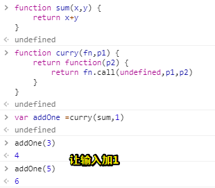

可以见到，addOne实际上是curry这个函数所return出来的函数，这个函数会接受一个参数p2，当我们调用这个函数，那么是上就会去调用sum函数！我们之前用了curry函数固定了sum函数的一个参数，之后在根据你调用addOne函数所传的参数（你传什么就是什么），确定最终的输出结果

这个curry函数做到了——把一个接受两个参数的函数变成固定一个参数接受另一个参数的函数！

一些问题：

1. 我们题目要求的abc函数有3个参数，而这里的sum只有2个参数
2. 可以不传参数1，即固定什么值由用户指定的！而不是交给这个curry函数！

接下来干啥？

如果不传这个1——形式是这样的：

```js
var fn2 = curry(sum)
var addOne = fn2(1)
fn(1)(2)
//本来的形式：
sum(2,3) //5
//通过柯里化这个sum函数之后，现在调用sum函数的形式：
fn2(2)(3)
//注意：不要去管形式转化的逻辑是怎样的，目前，你只需要关注形式是怎样的就可以了！
```

也就是说你传什么就固定什么参数，如你先传个1然后再传个2，就是你先固定一个1，相当于是addOne函数，然后再调用sum函数！

确定形式：

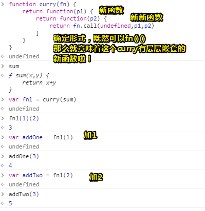

我们在curry sum函数的时候不需要传任何参数，即柯里化这个sum函数把固定参数这一步给消掉了！，总之对curry函数只需要传sum函数即可！其它参数不需要传！至于什么时候传呢？——后面传，即对curry函数所返回的新函数传即可，如fn1……第一次传什么就把sum函数的x形参固定为什么……

接下要考虑什么呢？——怎么能让curry函数接受有3个参数的fn呢？

很简单，再加个return就好了，与此同时你会了解到惰性求值是什么鬼？即不传够三个参数你会无法调用那个fn函数的！

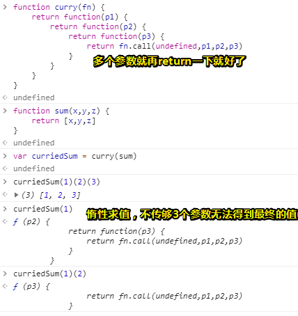

或许你会问这有点多余、有点无聊！因为我直接 `sum(1,2,3)`就好了，即一开始就可以传到位了，为啥还要柯里化sum后再调用呢？

但是有一种情况就是「有没有可能你一开始就不知道传给sum函数有哪些参数？或者说你需要异步请求后才知道有哪些参数」——所以柯里化是能给你一次机会——让你把两次值用不同的时间来传。如sum函数的这3个参数需要从不同的服务器上请求来的数据，然后数据到位了，就把它们混到一起，才调用sum函数。而用柯利化呢？——拿到什么就传什么，那什么时候凑齐了就什么时候有结果……

可见，这就是使用了柯利化的好处啦！

那如果接受4个参数呢？咋办？

难道要再加个return？显然不能继续这样干了，因为我们无法确定fn到底有多少个参数……

好话说，有咩有一个属性标志着某个函数要接受几个参数？——有的，length属性，即函数接受几个参数可以length得到：

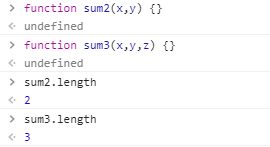

这就给我们一个启发了呀！——我们要return几次函数不就是看它要接受几个参数吗？

> 也就是说return几个函数是动态变化的咯！

总之，return（最后那个return调用fn不算）的嵌套层数就是它的length。

所以终极curry的思路是怎么写的呢？——每return一次就记一下数就告诉curry「我已经return过一次了，然后下次你就只需要return两次了」

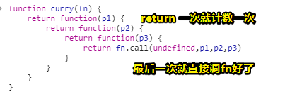

总之通过一个length再加一个计数器就能搞定这个事了！

➹：[JavaScript函数式编程--柯里化(curry) - Jin](https://jinyy.app/article/js-func-curry/)

```js
function curry(func , fixedParams){
    if ( !Array.isArray(fixedParams) ) { fixedParams = [ ] } //防止fixedParams一开始是undefined，为此无法使用数组的cancat方法
    return function(){
        let newParams = Array.prototype.slice.call(arguments); // 新传的所有参数
        if ( (fixedParams.length+newParams.length) < func.length ) {
            return curry(func , fixedParams.concat(newParams));
        }else{
            return func.apply(undefined, fixedParams.concat(newParams));
        }
    };
}
```

分析：

> 当传入的参数个数没有到达`func`函数要求的参数个数的时候一直返回柯里化函数。
> 只有参数满足`func`函数的个数的时候才通过`apply`执行`func`函数。

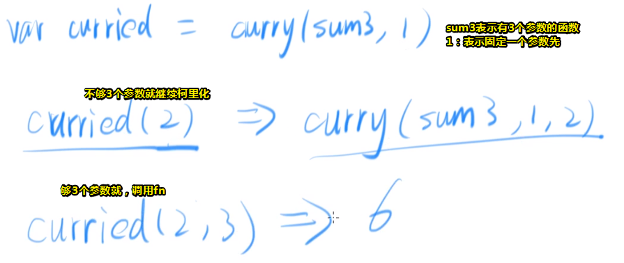

## ★目录

异步是一些人之所以学不会JS的主要原因！总之你学不会JS，那是因为你不知道什么是异步！

这节课讲什么？

- 什么是同步？什么是异步？
- 前端经常会遇到的异步代码
- 面试题
- AJAX中的异步
- 异步主要获取结果的形式
- 回调是怎么用的
- 如何处理异步中的异常
- 什么是Promise
- 讲解一下async和await这个两个关键字

## ★同步与异步

> ➹：[怎样理解阻塞非阻塞与同步异步的区别？ - 知乎](https://www.zhihu.com/question/19732473)
>
> 为啥同步和异步会涉及到I/O呢？——似乎涉及到网络请求等……
>
> 同步与异步的概念在JS中会不会有点不一样？

### ◇区别

简单来说，同步就是等待结果，而异步则是不等结果！形象一点来说就是同步是个很有耐心的一个人，而异步则是一个很急躁的、没有耐心的人！

#### 用代码来说明

```javascript
// 同步的 sleep
function sleep(seconds){
    var start = new Date()
    while(new Date() - start < seconds * 1000){

    }
    return
}
console.log(1)
sleep(3)
console.log('wake up')
console.log(2)
```

解释一波：

这里有个sleep函数，它什么都咩有做，只是等待几秒钟而已……

运行结果，先log个1，然后睡3s，接着再醒来，最后输出2

所以打印顺序为1→☞停3s→☞wake up→☞2

这个过程其实很符合我们人类的直觉，既然要让程序停3s，那就停3s呗……可是JavaScript不支持啊！总不能说V8老哥不要解释代码了，等3s后你在解释第11行代码吧！所以如何模拟出停3秒呢？——写一个执行3s但无意义的操作即可！简单来说，就是这3s之内，v8还在执行代码……只是做一些无意义的操作而已！唯有这样才能按顺序执行的……

在这个sleep函数中，我没有想到的是`new Date()`做计算的话，会得到毫秒数！还有那个循环判断等于3000ms也行……

接下来通过控制台，可视化3s这段时间做了什么：

1. 打开控制台
2. 切换到Performance，然后按一下ESC，就会出现Console
3. 把代码复制到Console中去，不要按回车
4. 点击左上角的Record，即记录一下我们的CPU，然后回车运行代码！

5. 运行结束后，就点击Stop，表示停止记录……

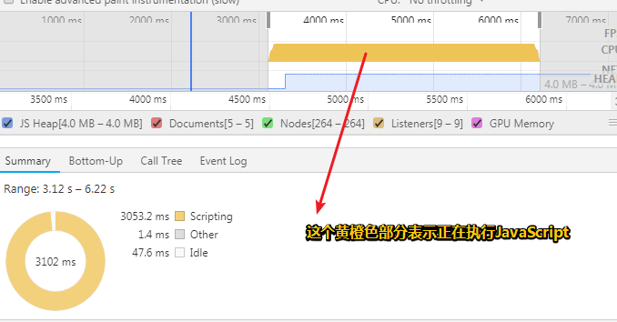

你可以看到这橙色部分基本连成一片了，所以sleep这个函数就好像让JS引擎不停地看表（看循环的判断条件……），直到走了3s钟才结束……

那么这3s钟之内看 了多少次表呢？——这个得看你的CPU有多强了，你CPU越强，看的时间次数越多！当然还得看一些软件设置，总之具体有多少次是不知道的！至少几十万次吧……

所以所谓的同步就是，`console.log('wake up')` 要等 `sleep(3)` 执行完毕后才会执行自己！

那么可以不等吗？可以不等，那就是异步啦！

```javascript
//异步的 sleep
function sleep(seconds, fn){
    setTimeout(fn, seconds * 1000)
}
console.log(1)
sleep(3, ()=> console.log('wake up'))
console.log(2)
```

这个sleep除了接收一个秒数以外，还接收一个回调！

我们把代码运行一下，**✎：**

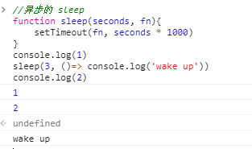

发现，`wake up`是最后才打印的！即 `console.log(2)`并咩有等 `sleep(3, ()=> console.log('wake up'))`的执行完……

为什么不会等它执行完呢？我想来看一看sleep这个函数做了什么吧！

1. 输入：秒数、回调fn

2. 函数体：设置一个闹钟，这个闹钟会在3000ms之后调用这个fn。而在这3000ms之内JS啥也没做，之前是不停地看表，而这次则是到了时间，就由浏览器调用fn，调用fn这件事情也不是JS做的……是浏览器做的！总之

   `setTimeout(fn, seconds * 1000)`的意思是说「浏览器同志请在3秒钟之后调用fn」，毕竟这个setTimeout是浏览器提供的API，所以浏览器会去负责调用这个fn，而fn里面的才是JS的代码！

   我们**不需要等fn被调用**，直接就开始执行下一句了……此时JS是很闲的，就想去睡觉一样，接着3s后就醒来了……

所以异步和同步的区别就是，下一句不会等上一句代码执行完毕……

我们可以再次查看JavaScript的执行情况：

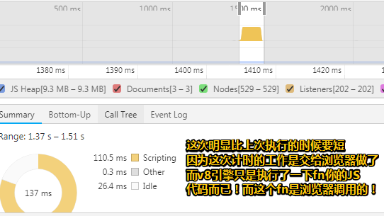

> 照理说会有一段时间不连贯才对的！……
>
> 额我看到了后面，原来是我肉眼没有观测到的原因：

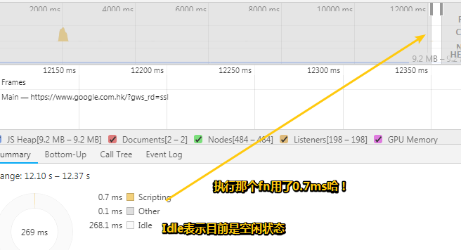

### ◇时序图

画出它们俩的运行过程……

一般异步的过程都用时序图画出来！

#### 同步

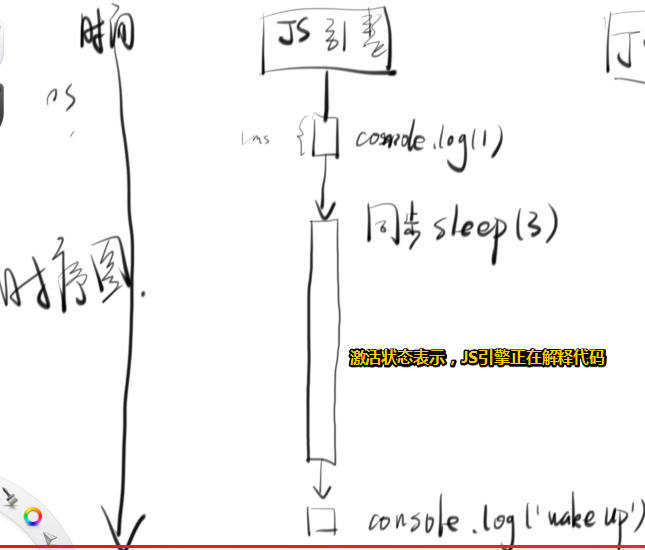

#### 异步

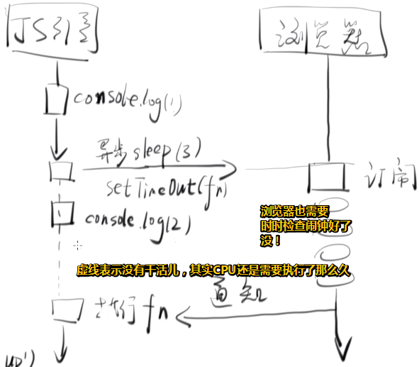


定完闹钟后就马上执行 `console.log(2)` ，这是为什么呢？因为v8引擎很闲哈！总不能傻傻地等着吧！

之所以我们可以实现异步，那是因为我们把定时这件事交给浏览器做了！这样一来JS引擎执行的时间就变少了！毕竟JS引擎处于活跃状态的话，是会阻塞浏览器的，即用户无法实时地与页面交互了！

> 其实说白了就是，一旦call stack中还有代码需要被JS引擎执行的话，那么这是会阻塞浏览器渲染的……毕竟有个渲染队列哈！

浏览器在定好闹钟之后，会定期地去看时间到了没有，一旦到了，它就会通知JS引擎去执行一下你刚刚给我的fn！

时序图是一个非常重要的用于理解异步概念的图！

### ◇小结

- 同步会等待sleep这个函数执行完毕，而异步则不会等待，直接跳到下一句！

## ★异步面试题

> 举3个异步的例子！

### ◇图片？获取它的宽度？

```js
document.getElementsByTagNames('img')[0].width // 宽度为 0
console.log('done')
```

```js
document.getElementsByTagNames('img')[0].onload = function(){
    console.log(this.width) // 宽度不为 0
    console.log('real done')
}
console.log('done')
```

- 当你分析问题不清楚的时候，就用时序图吧！

  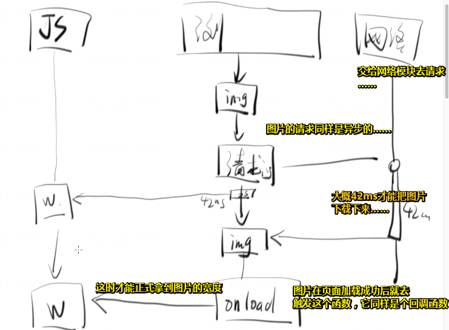

- 回调有多种形式，之前我们所讲的那种是作为参数的形式，那是最常见的，而用onload事件这种呢？则是另一种回调！总之我们无法确切知道图片什么时候加载成功，或许10ms、50ms……所以只能通过事件去做了……

---

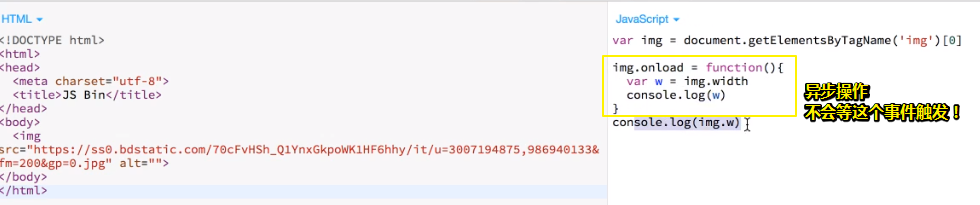

所以异步想要真正拿到结果，要么就去监听一个事件，即你异步操作成功了，就告诉我……毕竟你的成功时间是不可预测的！所以我们就先挂一个函数到你的身上……即挂一个函数到onload身上，等你加载成功后，你就调一下这个onload即可！

以上就是前端遇到的第一种异步，即图片加载是需要时间的，还有一种就是面试的时候会经常问到的！

### ◇面试题中的异步

#### var？for循环……

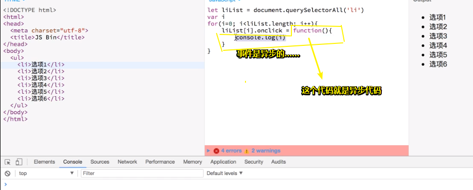

浏览器没有等图中用圈圈	圈住的那个代码执行，直接就进入到一下个循环……总之事件是异步的……

时序图分析：

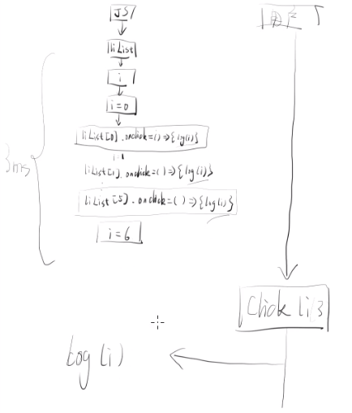

如何解决这个问题？——不要用var，用let就好了！

如果不理解let，那么就看看这篇文章：

➹：[我用了两个月的时间才理解 let - 方应杭的个人网站](https://fangyinghang.com/2017/let-in-js/)

#### let？for循环……


第一次循环给个i1，第二次循环给个i2……这是let做到的！总之i1等这些是不会变的……只有外面那个i才会变！而那6个分身不会变！整体来看改为let之后，从1个i变为了6个i，即多了5个i！

总之你可以直接记住结论，即把var改为let就好了！

时序图的话：

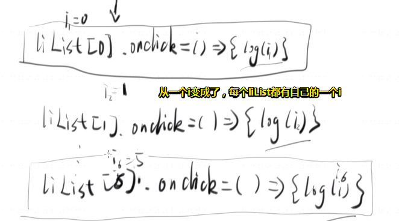

### ◇AJAX中的异步

后端程序员转前端的程序员，尤其喜欢把AJAX变为同步的，而且你会发现同步的AJAX这很奇葩啊！因为AJAX的A是异步的意思！……总之AJAX必须是异步的，况且这种同步的AJAX早就快被废除了！**✎：**

```js
let request = $.ajax({
  url: '.',
  async: false
})
console.log(request.responseText)
```

这个 `.`表示向当前页面的url请求，请求结束后才log出结果！

时序图：


用户点击了按钮，浏览器也不会响应它的动作！你可以通过这段代码测试，且在网速很慢的情况，你会发现无法选中页面中的文本！

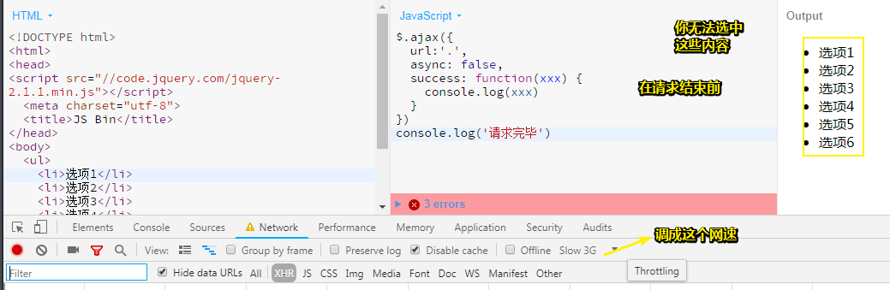

➹： [demo](http://js.jirengu.com/tedinukoko/1/edit)

总之，这是一种非常垃圾的写法！所以你把异步变成同步的话，那么在你请求的过程中，整个页面什么东西都不能动，就像死了一样，但是如果你改成异步的话：

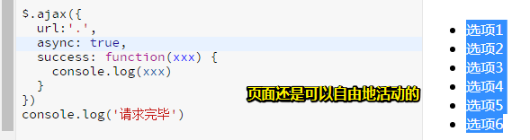

可见这就是异步的好处，即在请求结束前，浏览器同样可以响应用户所做的一些事件！而不需要等着你这个网络请求的响应返回……

接下来，来讲一下是如何拿到异步的结果的！

之前那个图片我们是在onload事件中拿到结果的，而且你不要痴心妄想可以在其它地方拿到！

还有onclick也是，当浏览器调用所赋给onclick的函数时，就会传一个东西给这个回调！

还有一种就是那个success函数！

而同步不需要什么技巧，直接就可以拿到了，**✎：**

```js
let request = $.ajax({
  url: '.',
  async: false
})
console.log(request.responseText)
```

接着把异步的结果赋值给request即可拿到，不需要什么特殊的技巧！但是异步呢？需要一些技巧（这些技巧不是所有人都知道的！）才能拿到，如onload、success……

## ★回调的形式

### ◇如何拿到异步代码的结果

啥意思？——比如说我们请求一个网络的资源，那我们用ajax，那么我们如何拿到这个网络资源的内容呢？

一般有两种形式，一种比较傻逼叫轮询，另一种则是比较正规聪明的叫回调

#### 轮询

如何用所谓的轮询拿到网络资源的内容？

既然结果是在一段时间之后才有的，那就这样做呗：

> 拿到这个结果之后，就把这个结果放到一个地方，然后定期去看一下这个地方有没有这个结果

啥意思？

假设我让一个人去帮我买水果，但是我没有时间跟他一起去买哈！毕竟分分钟几千万上下（ 调侃）……

然后叫他买好之后就放到桌子上即可！而这个**放到桌子上**就是一个结果啦，但是我们并不知道他什么时候会放到桌子上！所以，咋办呢？

比如说此刻我正在写代码，那我就每5分钟看一眼桌子，只要他把这个水果放到桌子上，那么在这5分钟之内我们肯定是能看到这个水果的，然后就把这个水果拿过来了！这就叫做轮询啦！

> 似乎是我在监听这个桌子，但是，我这个是每5min就得触发一次行为，即看一眼这桌子，如果桌子上没有东西，5min之后再次触发行为，直到桌子上有东西后，才停止这些傻逼行为
>
> 这就像是我需要写一个`setInterval()`一样，每5min就要调用一个函数或者说是执行一个代码段，然后判断桌子上是否有东西，有则把这个钟给敲碎了，没有则继续做傻逼操作！
>
> 其实这也有点像是，QQ聊天一样，过几秒看看有没有人回复……当然你可设置通知……

总之不停地去看桌子上有没有水果就是轮询啦！

**用demo模拟这个过程：**

1. 写一个buyFruit函数
2. 由于不知道啥时候把水果买回来，所以用个随机数模拟一段时间……
3. 查看水果买到没？直接看全局变量就好了！

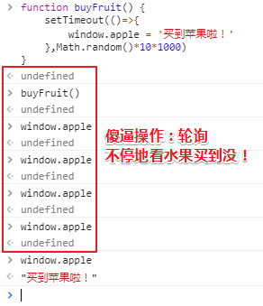

> 我们并不知道，当我们去买水果的时候，什么时候window.apple才会变为「买到苹果啦！」，我们不停地轮询，这其实很智障啊！

有咩有一种办法可以不手动轮询呢？即不要每隔点时间就在Console中敲 `window.apple`一下，然后回车，毕竟这很不自动化呀！

那就用程序呗！你也可以用个setInterval来帮你看看 `window.apple`的值哈！

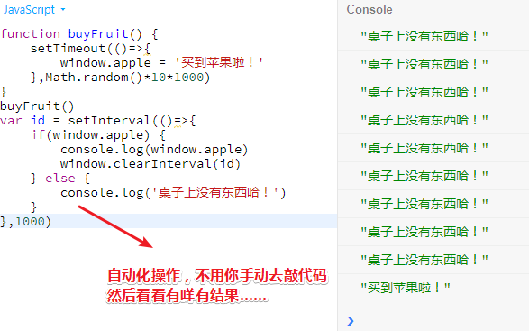

> 不知道怎么回事，在chrome的Console面板中，运行setInterval居然没有效果！以后还是用jsbin来测试JS代码好了

总之这是一种很智障的做法，即轮询（隔断时间就看一下有没有结果）……

为啥说这种方式很智障呢？——因为以前的程序员不会写代码，所以才会这样智障的代码，而正规的方法是什么呢？——回调！即你给一个函数，如果时间到了就通知你！

> 这有种发布订阅的味道……
>
> 其实，上面的代码已经用了回调了，如setTimeout的第一个参数，只是我们无法确定什么时候有结果而已，我们确定知道有结果的方式有两种，一种是通过轮询，另一种则是事件驱动吧，为啥要说是回调呢？
>
> 我看了下面这个答案：
>
> ➹：[事件驱动和回调函数之间有何联系？ - 知乎](https://www.zhihu.com/question/30396023)
>
> 其中说到：
>
> 事件驱动是概念，回调函数是实现方式。不用回调函数，也可以实现事件驱动。而且事件驱动的本质特征：中心轮询机制，event loop的loop是轮询（我以为是事件循环……）至于轮询的目的显然就是感知对象是否发生变化，如我们检查桌子是否发生了变化，即是否有水果在桌子上面了……
>
> 所以说成是回调也是可以咯……

#### 回调

同样的代码，这次不放到桌子上，而是放到你的手上……

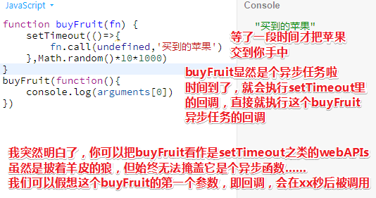

> 我开始有点理解回调，即我们自己也可以封装异步API……然后回调嵌套着回调
>
> 讲真这说容易理解，其实也不容易理解……因为这需要很多知识铺垫呀！

在前端人员知道回调方式之后，就基本上不会再用轮询了，因为这实际上很傻逼呀！

### ◇回调的形式

回调虽然是回调，但回调有很多形式！

接下来就看看流行的回调形式有哪些……

#### ①Node.js 的 error-first 形式

```js
 fs.readFile('./1.txt', (error, content)=>{
     if(error){
         // 失败
     }else{
         // 成功
     }
 })
```

把error放在第一个，为啥用error呢？因为有可能没有买到苹果

如果没有买到苹果该咋办呢？比如说我们有一半的几率：

1. 用随机函数，就像是摇个筛子一样
2. 如果没有买到苹果，就说咩有买到苹果或者沉默是金……

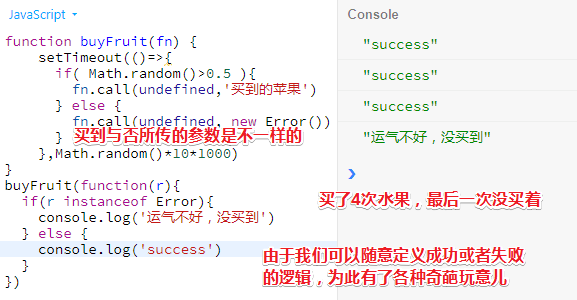

总之你得告诉这个回调是成功还是失败的，那怎么告诉呢？随便哈！

> 我们做了什么？修改了异步API，让它具备失败的几率；接着我们修改了回调，让它具备两种程序走向，当然，前提是你得知道这个封装好的异步API的代码才行，谁知道传个回调的参数是什么，可能没传，可能是个error……
>
> 一般情况下，显然我们无法知道异步API的逻辑，所以它肯定会告诉我们使用它的逻辑，毕竟我们只需要管我们该如何写这个回调即可，如nodejs的readFile函数，它的第二个参数，显然是我们要写的回调，那么回调的第一个参数呢？显然它告诉我们，如果读取文件失败，即error为true啦，然后你就做进一步的处理呗，如 `alert('读取文件失败！')`
>
> 总之，你得对异步API传给回调的参数心知肚明才行……

你想怎么告诉就怎么告诉，于是各种程序员就发明了奇奇怪怪的通知方法……

如你看看nodejs是怎么通知的：

文件模块fs，然后读一个文件xxx，然而这个读是有可能成功和有可能失败的，毕竟文件可能不存在或者损坏了……

> 注意：一般用箭头函数作为回调，因为我们并不关心this……

言归正传，nodejs是怎么想的呢？请看我娓娓道来……

如果失败了，就传一个error出来，而成功则是别传这个error，把它留着、空着……即不要给我传第一个参数！

这就是所谓的error-first啦！

那么如何知道成功还是失败呢？——很简单

如果你的回调被传的第一个参数是一个存在的东西，不管它是什么，如error啊，字符串都行……总之只要它存在，那么你这件事情，即读这个文件就失败啦！

那么如果不存在，那么就成功啦！

总之error-first即是「失败有第一个参数，没有则没有第一个参数！」

不过jQuery可不这么想的！于是它嘲讽 一波「nodejs你是不是傻？干嘛非要用一个参数来回调，然后用一个参数的有没有来表示成功和失败……你看我怎么做的？我可是写两个回调，一个成功时调，一个失败时调……只要success函数被调了，那就一定是成功的啦！何必要通过回调的第一个参数的有无来判断成功还是失败呢！」

#### ②jQuery 的 success / error 形式

```js
 $.ajax({
     url:'/xxx',
     success:()=>{},
     error: ()=>{}
 })
```

jQuery还发明了另外一种形式……就是下面这种，其实跟success/error形式差不多

#### ③jQuery 的 done / fail / always 形式

```js
$.ajax({
     url:'/xxx',
 }).done( ()=>{} ).fail( ()=>{} ).always( ()=> {})
```

传了一个参数之后，还可以追加传三个参数……第一个就是done参数，这是怎么做到的呢？柯里化啊！之前不是说过了吗？

> 注意：请在形式上理解，如像之前的curry函数那样！当然，你可以从形式上推敲出这个ajax api的原理！
>
> 不过，如果只是想单纯地用起来有行哈！
>
> ➹：[jQuery全面解剖系列（一）Deferred风格的Ajax - i33的个人空间 - 开源中国](https://my.oschina.net/i33/blog/91227)
>
> ➹： [Should I use .done() and .fail() for new jQuery AJAX code instead of success and error - Stack Overflow](https://stackoverflow.com/questions/10931836/should-i-use-done-and-fail-for-new-jquery-ajax-code-instead-of-success-and)
>
> ➹： [jQuery ajax（）使用success,，error 和 complete与.done（），.fail（）和always（）？ - 问答 - 云+社区 - 腾讯云](https://cloud.tencent.com/developer/ask/78982)

我们可以一次接受多个参数，但也可以不一次性给我，即可以慢慢给，柯里化不就是在做这个事情吗？

ajax返回一个新函数，然后这个函数可以有个done属性，然后这个done属性可以接受一个参数……

> 不断地添加柴火……而不是一次性把柴火都添加了，汤还是慢慢熬比较好喝……

虽然这个跟柯里化不太一样，但是形式是差不多的，都是慢慢熬……

总之这三个属性是，成功调，失败调，always则是不管成功还是失败，最后调！

这就是jQuery发明的另一种形式，而这种形式要比上面那种好看一点！

上面三种姿势，我们可以看到，这个回调并没有什么规范，有各种形式……你想要怎么搞就怎么搞（如传参还是换另一个回调等等），很随便，只要你可以根据异步结果的不同来相应地执行不同的逻辑就好了……

由于这个大家都是随便的，而且非常随便，于是前端就想了一个规范，这个规范叫做Promise规范，那么Promise规范是怎样的呢？

你的所有的异步操作发出之后，你就给我暴露一个API，也就是返回一个对象，这个对象虽然不是正式的结果，但是就要你返回这个对象，而且这是强制性的……

#### ④Promise 的 then 形式

```js
 $.ajax({
     url:'/xxx',
 }).then( ()=>{}, ()=>{} ).then( ()=>{})
```

`$.ajax`必须返回一个对象，而这个对象必须要有一个函数叫做then…

也就说所以的异步操作返回一个带有属性叫做then的对象！笼统来说就是返回一个then对象！

这个then对象有什么特点呢？——很明显，它有个then……而且就这么一个特点

then必须接受两个函数，第一个函数叫做成功回调，而第二个则是失败回调，简而言之，第一个参数是成功函数，第二个是失败函数

当前面的ajax请求成功之后就调then的第一个函数，失败则调第二个函数

从这我们可以看出，Promise是对函数回调形式的一个规范，也就是说我依然用回调，只不过回调形式我确定了，即第一个必须有then，then的第一个参数必须是成功，而第二个参数则是失败，就是这么简单！

其实还有一个要求就是你这个then传入了参数之后，你必须再给我返回一个then对象，即你可以继续传入成功还是失败！看起来似乎很抽象，但实际上用一下你就知道了！

我们之前的做法是这样的：

```js
$.ajax({
	url:'.',
	async: true,
	success: funtion(xxx) {
        console.log(xxx)
	}
})
```

成功就会调success这个回调！失败就会调error……

如果用then呢？就不用想这个名字了！即全部统一叫then……

```js
$.ajax({
    url:'.',
    async: true,
}).then((x)=>{
    console.log(x)
    return 'zzz'
},(y)=>{
    console.log('失败')
    return '失败了'
}).then((z)=>{
  console.log(z)
},(o)=>{
  console.log(o)
})
```

> 这个代码是在jsbin里跑的

成功就调第一个参数，而且会把成功的结果放到回调的第一个参数里面，同理，失败也是如此！

如果成功了，那么这个x的值就是html文本了……

如果失败？改一下url为一个不存在的路径就可以模拟失败……我们可以看到是404……然后看一下控制台所打印的是一个失败！

我们无法直接拿到结果，需要放点东西（如回调），然后你成功之后，就把放入其中的函数调用一下即可

这个过程很简单，关于Promise规范其实挺拗口的，所以在这里就不讲Promise规范了！

总之then就是接受回调，然后放到ajax里面，而ajax是什么呢？就是个对象……而且是个空对象？

接着我们可以继续then……

> z的值是前面成功return的值，而o的值是前面失败return的值……

不过这个Promise是jQuery实现的，不代表它一定是对的，它有可能不遵守这个规范！

我们换一个ajax的库，叫做axios……看它有没有遵守这个规范

axios是抄袭jQuery的，所以不用怎么改代码……即它没有ajax方法

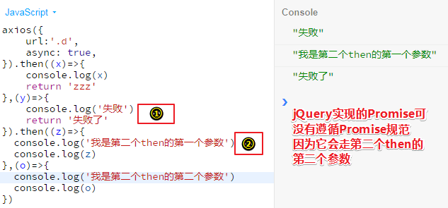

看看jQuery的：

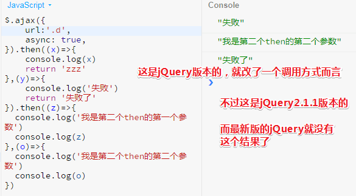

> 我测试了jQuery3.3.1是与axios相同的……

axios遵守了Promise规范，即第一个调用失败了，然后第二个then却调用了成功的！

为什么要一直then？——因为可以把前面回调处理的结果，传递给后面的回调再处理一遍哈！就这样一环套一环，大家都可以去处理，有种只做一件事的调调……总之我们可以把响应回来的结果，一直往后面传，这样大家都能处理了。其实你可以把第一个then处理过程想象成一个中间件，即第一个then处理的结果，就是第二个then需要处理的输入，形象一点就是第一个then是代购，第二个then则是买家……如此类推……

> 假如很多人都在监听这个成功的结果，第一个人监听之后，是直接把这个结果返回出去，还是加点东西再返回给第二个人呢？这就好像一个接力赛一样，第一个人拿到结果然后传给第二个人，但是可以在结果上加点东西，比如加点润滑油去捣乱，也可以加点增加摩擦力的粉好让第二个人能更好地去握这个接力棒，所以这就是一个链式的操作啦！

下一节会探讨「Promise到底是怎么一个处理关系？」

### ◇回顾

回顾回调的形式这个问题！

我们知道轮询可以获取异步结果，回调也可以获取异步结果！

而我们用哪一种呢？一般是用回调！

那么回调怎么知道结果是成功还是失败呢？

对于nodejs来说，如果回调的第一个参数是存在的，就是有值，那就说明它失败了，反之，没值那就说明它成功了！

对于jQuery一开始的形式来说，如果你调我的success回调，那就是成功了，如果你调我的error回调，那就是失败了，反正我只写回调……

jQuery还发明了一种，即done成功回调，fail失败回调，always不管成功与否都要执行的回调，总之就是加了一个always呗！

> 这似乎有点then的雏形了……

Promise出来之后，流规定你得这样做，即都给我返回一个then对象，then对象，有个then函数，然后它会接受两个回调，即两个函数，第一个函数作为成功回调，第二个则作为失败回调，调完之后，你还可以在后面继续then，有种接力赛的味道……那么第二个then中的第一个函数跟前面的那个then中的两个函数有什么关系呢？下一节课再讲……

总之，我们现在只需要知道的一个结果是Promise只是一种回调的形式而已！它能让你不用去想，这个回调要不要加error参数，也不用去想这个回调要不要加success、error、done之类的，而是只需要一个，请记住它，这个东西叫做then……也就是说它其实只是把名字给固定下来了，然后就是then之后还能再then……这就是所谓的Promise啦！

> 从无须考虑我们想要这个成功回调是写在success身上呢？还是done身上，到我们只需要关注then的第一个参数就好了！这是一种潜规则，说得好听一点就是规范，约束之类的……

---

## ★Promise & async/await

> 研究一下这个Promise和回调之间的关系

这个关系写在Promise/A+规范里面！总之这是有规范的，而不是你随意决定就有的关系……

### ◇研究一个具体的例子

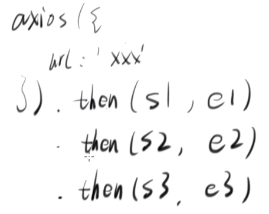

 axios()一定会返回一个对象，而发起的ajax请求可能会成功，也可能会失败，所以需要then啦！其中s1表示「成功1」，e1表示「失败1」……如此类推

> 从形式上理解就好，如果具体到Promise的原理的话，这不是分分钟就能理解的！

那么问题来了，如果请求结果是成功的，那么这些回调的执行顺序会是怎样的呢？

我们一般都会认为先调s1，然后s2，最后s3这样……而这种思维是jQuery思维，jQuery就是这样做的，但是这不是Promise规范，虽然这样也是可以的，但规范并没有这样写。那么规范又是怎样的呢？

举例来说：把一个then里面的两个函数看作是一个责任人，而这个责任人是负责处理成功或者失败的情况……第一个then就是第1责任人……如此类推……

假设axios请求成功了，那么我们可以确定的是，s1一定会被调用，但是s2会不会被调用，这是不一定的，因为这要看s1是怎么处理的，如果第1责任人发现这个成功我可以处理，而且可以处理得很好，然后结果也可以成功的传递到后面去，它就去return一个值，至于这个值是啥，无所谓哈！

总之如果第1责任人（老大）没有出什么差错，那么第2责任人（老二）就会成功执行s2，毕竟老大已经处理得很好了，老二就稍微看一下就好了，而老二拿到的值是s1返回的值……如果老二处理得没啥问题，那就再返回这一个值，这个值可以跟s1所返回的相等，也可以不相等，总之随你的便哈！想返回啥就返回啥！

老三拿到s2的返回值，然后交给了s3去处理……同理，处理得很好，返回一个值，然后交给后面的兄弟……

以上是正常情况下的处理过程，与jQuery思维一致……

但是如果s1处理差错呢？如语法写错了（`retun x`没有写这个r），你说这会导致什么现象呢？

形象点来说就是，老大弱爆了，身为老大居然连件小事都处理不好！如何服众？

为此，老二咋办呢？它就把这个事情当作失败来处理（老二不会屈服于老大的身份，反正就是讲道理哈！），毕竟老大没有处理好哈，所以老二就不能把它当作成功来处理了！

用代码模拟一下上述这个过程：

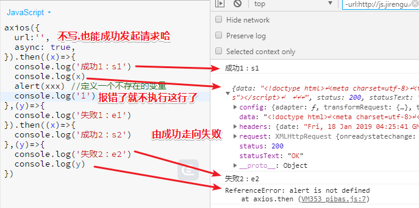

我们用一个不存在的变量来模拟错误……我们的请求是成功的，既然是成功的，那么老大就去处理s1啦，然而老大它自己能力不行，自己翻车了，那么后面的老二就把这个s1处理当作是烂尾工程来处理，即执行e2了……e2拿到的值，即y的值是老大之所以失败的原因……可见老大写了垃圾代码，显然身为一个老大一点担当都没有哈，这么明显的小错误都犯了……

总结一下：

1. s1和e1中，总有一个函数会被调用，反正老大就是等着请求的结果，然后好进行下一步操作！如果s1或者e1都没有报错的话，那么这都会走到s2；反之，如果其中一个报错了，那么就会走到e2，这是一个兜底的处理……

   如此类推……

所以Promise是上述所说的这种过程来处理回调的，不想jQuery旧版本那样，成功后就s1、s2、s3，显然这没啥意义，毕竟回调也是会出错的哦……

总之，我们可以看到Promise通过多个责任人来处理异步请求所返回的结果，其中关键在于有个兜底的家伙！

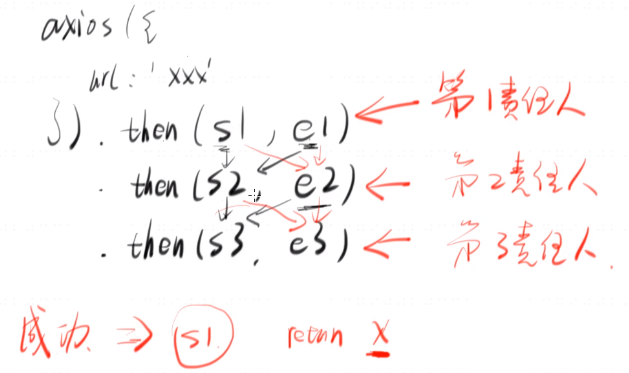

除了我们写代码出错以外，还可以主动报一个错误，为啥要主动报一个错误呢？因为老大自己处理不了，但不想因为自己写垃圾代码而报错，所以就主动给个错误结果交给后面的老二处理

模拟主动失败：

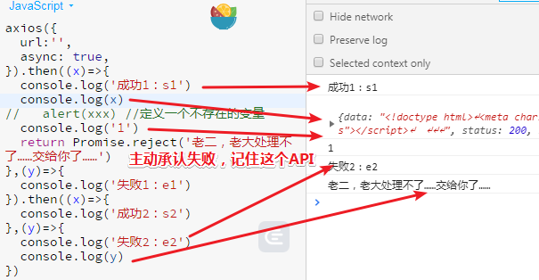

老大要给老二一个结果，所以就return了一个错误的结果给老二，注意这不是error，这是一个错误的结果，这个结果告知老二失败的原因，即reject里的字符串……

总之，老大不想要语法错误，就想要失败，如果想要老二执行成功的话，那就直接返回一个字符串就好了！

`Promise.reject()`是一个很好用的「主动失败」的API

归纳一下我们讲了什么：

1. 如何使用多个success函数？——Promise比较复杂一点，不像老版本的jQuery那样，s1、s2、s3这样依次调用！而是看第一个人有没有结果，如果有那就执行下个s2，如果出错了，那就e2了……

   总之这涉及到第一个then里的回调执行是否有错误情况，不管是无意报错，还是主动写个错误……

### ◇如何处理异常？

> 在有多个成功回调的情况下，如何处理异常？

如果回调处理出现异常了，这个异常就会返回给下一个函数的error……

如s1或者e1任何一个出现异常就会返回给e2处理了……如果e2也异常了，那么就给e3了，可是假如没有e3呢？

下面是一个模拟咩有e2处理异常的情况：

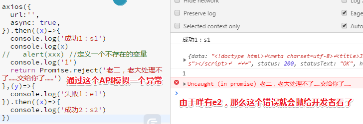

我们可以在控制台看到很显然红色错误提示，显然这个是给开发者看的，如果开发者不处理的话，那么显然就没有管了，毕竟你的代码都说搞不定。既然代码说搞不定，只能你自己搞定了……

还一种方法就是，如果你不想写一个e2，那就直接写个catch就好了，这个catch函数可以把之前所有的错误都搞定，但如果你看了MDN你就会知道，catch相当于是写了一个失败函数，即与e2一样……

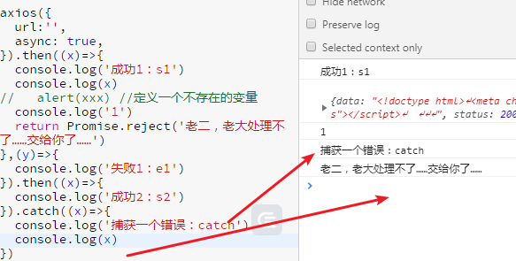

由于没有写e2，只写了一个s2，那么这只能交给**兜底的**catch来处理了！然后catch就捕获到失败的原因，然后就log一下……

> 此刻请丢弃对try……catch……的认识

catch其实是一个语法糖，等价于这样：

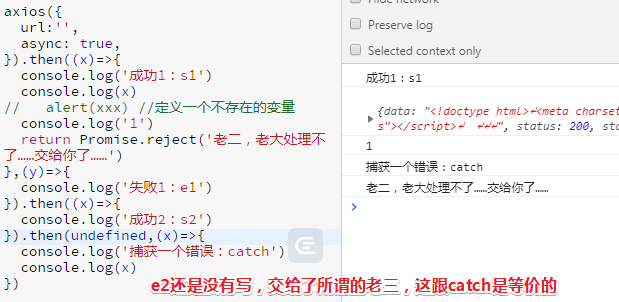

总之catch就是一个没有成功函数的失败函数……可见，catch很简单，毕竟它是用then来做到的，所以一个then就搞定了所有事情了……

### ◇小结

现状：有多个success函数

问题：这多个success函数之间的关系是怎样的？以及如何处理这其中会出现的异常（如代码写错了，数据出错了……）？

关于异常处理：写个catch就好了，或者在最后写个失败函数，这个失败函数就会作为一个兜底的函数去处理这些异常情况，这样一来你就可以获取到所有的异常然后解决它！解决它之后，你在抛给后面的责任人去处理即可！

> 我开始明白，写不写catch都是可以的，只要有then就好了！不过catch显然更简单一点！

### ◇自己写一个Promise

> 我们都是在用别人的Promise，那么我们自己该如何写一个Promise呢？

#### 背下来

把形式给背下来，我们之前讲到函数的时候会经常说到「形式」这个东西，因为你只要把形式给背下来了，那么这个东西就很简单了！如果你想从逻辑上理解的话，这还真得是有点难哈！

写Promise很简单，比如说：你想写一个函数，这个函数去做一件异步的事情，像之前那个买水果例子一样

之前我们是接收一个回调，但是回调这种形式太随便，这次我们就遵守Promise的规范

话又说回来，我们如何写一个函数呢？——先搞清楚接受什么，输出什么，然后再去想其它细节！

所以我们的 `buyFruit()`不需要接受什么，为什么呢？形象一点来说就是不需要给钱，买水果那人身上有钱哈！至于输出则是一个Promise实例，即一个then对象

总之这个Promise对象有个唯一的特点就是它有个then函数，所以别人拿到你的返回结果之后可以去then一下！

```js
function buyFruit() {
    return new Promise
}
```

接着把你要做的事情（比如说：花10s买一个水果）写成一个函数

```js
function buyFruit() {
    //①我要做的事情：10s后拿到水果
	var fn = ()=>{
        setTimeout(()=>{
            'apple'
        },10000)
	}
    //②我要返回的：
    return new Promise
}
```

如何把①、②结合起来？——把你要做的事情，即fn传给Promise作为它的初始化函数！

```js
function buyFruit() {
    //①我要做的事情：10s后拿到水果
	var fn = ()=>{
        setTimeout(()=>{
            'apple'
        },10000)
	}
    //②我要返回的：
    return new Promise(fn)
}
```

这就是所谓的形式啦！即`return new Promise(fn)`，当然，这还没完……

话说，我们如何把这个 `apple`给外面呢？——用回调

这个`fn`你要接收两个函数，这是Promise强行给你的两个函数，总之你就必须搞两个函数进来（不要问为什么，规范就是如此……），目的是成功了就调用第一个函数，失败了就调用第二个函数。

```js
function buyFruit() {
    //①我要做的事情：10s后拿到水果
    //随便起个形参名字
	var fn = (x,y)=>{
        setTimeout(()=>{
            x('apple')
        },10000)
	}
    //②我要返回的：
    return new Promise(fn)
}
```

如果成功了就调`x`这个函数，目前为了简单起见，就不写失败的情况……即不管第二个函数y

目前来看，这个形式有点复杂……先来分析一下这个fn，首先必须搞两个参数进来，而且这是函数哈！不要问为什么，因为规范就是这样，如果10s之后就搞定了，那就调一下第一个函数，即x，如果没有那就调一下y

> 注意：如果回调队列中有很多任务在排队，并不一定10s后就会执行setTimeout的第一个参数！总之10s是个最短时间

这两个函数等一会儿会有人给你的，虽然没有看到这两个函数，但不要着急，毕竟这涉及到异步，总之Promise会给你的！

Promise拿到这个fn之后，你猜它会做什么？——它会把两个函数插进来，也就是Promise里面肯定会有这样一句：

```js
//不给你传this,然后成功、失败
fn.call(undefined,success,error)
```

这样一来success就会传给x，error就会传给y……

所以你调的东西，其实是Promise给你准备好的回调而已！

接着，一旦有人去使用你这个buyFruit，它就会得到一个Promise对象，至于这个 ` new Promise(fn)`怎么用，你等回就知道了……

进一步简化——既然fn是个函数，那么我们可以不用函数名哈，即用一个匿名函数：

```js
function buyFruit() {
    return new Promise((x,y)=>{
        setTimeout(()=>{
            x('apple')
        },10000)
	}) //fn.call(undefined,success,error)
}
```

过程大概就是：

1. 接受一个函数
2. 这个函数有两个参数函数，如果成功了就调第一个函数，失败则第二个
3. 函数体中有个异步任务

目前我们这个buyFruit已经声明好了，那么怎么用呢？

我们知道调用这个函数所返回的结果是一个Promise对象，所以这样：

```js
var promise = buyFruit()
```

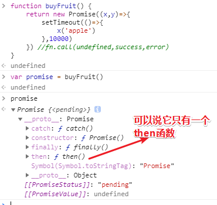

这个时候buyFruit已经在做事了了，至于它什么时候成功，我们不需要知道，我们只需要知道，这个买水果成功之后要做什么，所以我们直接用then输入到这个promise里面去即可！

> 距离上一张图已过去20s了，如果写上then后，那么就会马上执行成功回调

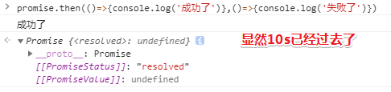

> 我很好奇，为啥then后你就能执行x这个函数？promise对象似乎在等着我们传成功回调……即便20s后它还是等着，只要你then一下它就会执行了……

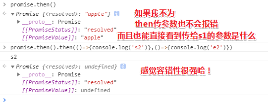

> 不过这种测试很无意义，因为开发者的目的本来就是要传回调的！就像是你用typescript就是为了有类型，虽然可以不用写类型，但你不写为哈还要用它呢？还不如直接用JavaScript方便点多呢

无间隔执行，让你印象跟深刻一点，毕竟一般都是无间隔执行的，即 `buyFruit().then(()=>{},()=>{})`：

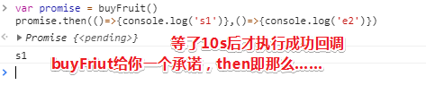

叫小明去买水果，然后小明给我一个承诺（即promise）说「我会买的！」

既然你会买，那么（then即是那么）你买成功就打印s1，失败就打印e2，总之成功调第一个函数，失败就调第二个函数！

然后小明说「好的！」

#### 回顾

> 如何写一个Promise函数？

1. 直接写 `return new Promise()`，其形式就是如此，你背下来即可！当然还要背两个东西，即所传的函数参数需要接受两个函数参数，总之需要背5个东西—— `reuturn`、`new`、`Promise`、`x`、`y`
2. 如果成功就调x，失败就调，至于你这个异步任务做啥我不管，即不管你是买水果还是发ajax请求……
3. x，y有个专有的名字，这个名字是约定俗成的，所以你不要去改它。x、y这个两个名字其实是很奇怪的，所以你还是改为resolve、reject比较好，这个没有原因可说，就是规定，总之成功就调resolve，失败就调reject

```js
function buyFruit() {
    return new Promise((resolve,reject)=>{
        setTimeout(()=>{
            resolve('apple')
        },10000)
	}) //fn.call(undefined,success,error)
}
var promise = buyFruit()
promise.then(()=>{console.log('s1')},()=>{console.log('e2')})
```

以上就是我们自己所写的Promise啦，抽像一点就是：

> 声明了一个ajax函数，形式就是5个单词，然偶成功调这个，失败调那个。不管怎样，你无须理解这是为什么，记住就好了！

```
function ajax(){
    return new Promise((resolve, reject)=>{
        做事
        如果成功就调用 resolve
        如果失败就调用 reject
    })
}

var promise = ajax()
promise.then(successFn, errorFn)
```

> Promise 深入阅读：<http://www.cnblogs.com/hustskyking/p/promise.html>
> Promise/A+ 规范：<https://segmentfault.com/a/1190000002452115>

假如我没有写异步任务会咋样：

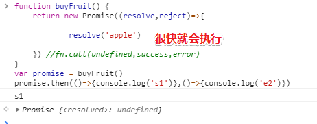

话说这是异步执行的吗？

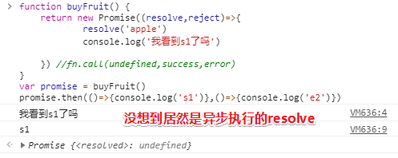

➹：[Promise then中回调为什么是异步执行？ - 知乎](https://www.zhihu.com/question/57071244)

### ◇async/await

> 任意一个名称都是有意义的，先从字面意思来理解。async 是“异步”的简写，而 await 可以认为是 async wait 的简写。所以应该很好理解 async 用于申明一个 function 是异步的，而 await 用于等待一个异步方法执行完成。

这个东西说复杂也复杂，说简单也简单，因为如果你从形式上记的话，这是特别简单的！

先来看看这个代码：

```js
var promise = buyFruit()
promise.then(()=>{console.log('s1')},()=>{console.log('e1')})
```

我们依旧是用了then去调回调，即回调被规范到then而已！

那么我们能否去掉回调呢？——这很难！必须要改掉这门语言才行！

于是JavaScript声明了一个新的关键字，这个关键字叫做`await`，当然这只是第一个而已，还有第二个叫做`async`.

#### await

```js
var result = await buyFruit()
```

我们需要等buyFruit的结果出来才行，即这个 `=`不是马上赋值给result了！而是要等这个Promise搞定了即成功或者失败之后，这个等于号才会执行，也就是说这个等于号现在是一个异步的等于号……因为它后面有个await关键字……

> 第一眼看异步等于号是懵逼的，然后想了想，因为buyFriut是一个异步函数，而且还有个await关键字，即等等待也给异步方法执行，即异步等，异步的等于号赋值……
>
> 其实我不需要按老师这种方式理解的，因为await本来就是在等一个异步任务执行执行完毕，然后再进行下一步操作的！

有了await关键字后，我们拿到的就不是承诺了，而是结果！即 `'apple'`

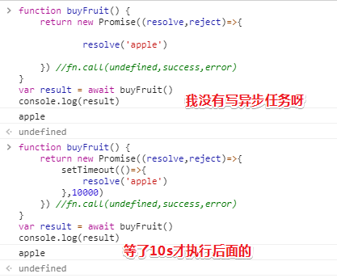

---

一些疑问：

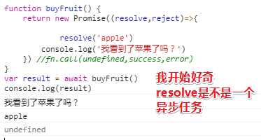

还有就是：

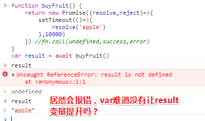

---

为啥一开始拿result的值会咩有定义呢？——疑问await呀，它的存在让我们10s之内不会执行这个等于号，而且也不会执行这个var……也就是说await把这个 `var result = await buyFruit()`分为为  `var result = `和 ` buyFruit()`这么两段的，前面是一个同步的，后面则是一个异步的！

> 还能说什么？——此刻我只能记住形式了呀！虽然没有灵魂，但胜在能用……

由于我们写了await，那么它就会去等这个 `buyFruit`异步的结果！所以这就成了同步，因此await它就是模拟了同步的代码！进一步理解就是把等于号认为是异步的等于号，既然是异步等于号，那就需要等异步结果啦！

总之前10s你怎么取都取不到result的值，而等10s之后才会自动执行赋值操作！

> 是不是先变量提升，然后再赋值？

一个问题：

```js
var result = await buyFruit()
console.log(2)
```

你说第二行代码会马上执行，还是等10s后再执行？——显然是后者呀！

从这可以看出我们可以用同步的形式写异步代码，这样一来我们就不用去回调里面写了！

小结：

1. await的意思就是会等右边结束，才会去执行左边的！左边执行完了才会执行下一句
2. await改变了整个代码的执行顺序！相当于是把 `var result =`这个代码给保存了，等 `buyFruit()`这个执行完毕后才把保存的那些代码给执行一遍……

那么async是干嘛的呢？

#### async

如果你写了一个函数，而这个函数里面有await，那么最好你在外面写个async。比如说这样： 

```js
function fn() {
    var result = await buyFruit()
    return result
}
var s = fn()
console.log(2)
```

你说这个fn()是马上返回结果还是等10s后才返回结果，换句话说这个2是马上打印还是等10s后才打印！

都不是！因为报错了

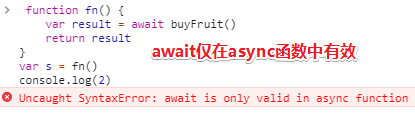

看这个 `var s = fn()`， fn是个异步函数，然后我们用的是同步等于号！然后await只能放到有async的函数里面！

也就说JavaScript引擎并不知道该如何处理这个fn，因为它不知道这个fn是同步还是异步的！它为何不知道呢？进去这个fn函数里看一下不就好了吗？——这种想法是错误的，总不能看到一个函数名之后就跑到它的函数体里面去看，它其实在想你在声明这个fn函数的时候就告诉我这个fn是异步还是同步的…

> 我们知道buyFruit是异步的，可await呢？它在做什么？那么fn它到底是异步函数还是函数呢？
>
> 我们可以看到这个错误信息，这是语法错误哈！

既然这个fn函数里有await，那就说明 这是一个异步操作的哈！

所以你最好这样声明：

```js
async function fn() {
    var result = await buyFruit()
    return result
}
var s = fn()
console.log(2)
```

直接表明这是异步函数fn，然后其里面有一个异步操作，然后用await去等……

总之就直接告诉这是异步即可！

然而这样也不行，因为这个2直接就打印了……

这是为什么呢？——因为这个s没有去等这个fn执行完毕……

毕竟你说了fn是异步了呀！既然是异步为啥还要等fn呢？所以需要加个await：

```js
async function fn() {
    var result = await buyFruit()
    return result
}
var s = await fn()
console.log(2)
```

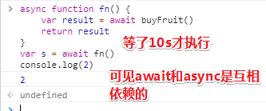

> 从这我可看出局部作用域里的await真得就是在局部作用域里搞事情……

s在等这个fn执行，接着切换到fn的肚子里，result又在等着这个buyFruit执行！

一旦buyFruit执行完了，就会执行这个result……

接着结果就显而易见了！

整个过程可谓是一层层进去然后一层层出来！

如果buyFruit失败了会咋样呢？还能等到结果吗？

模拟失败：10s之后买不到苹果，即什么也不传

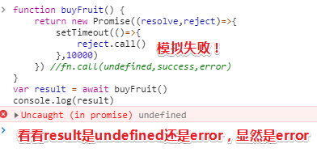

或者可以这样：

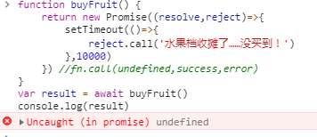

其实结果是一样的，毕竟这是调用失败回调……

我们知道是没有result的，因为这买水果根本就没有成功（通过reject模拟没有成功）……

所以这result是undefined还是error呢？——报错，如果await后面是一个失败，那么它直接就会报错，所以咋办呢？

用`try……catch……`哈！

尝试去获取这个结果，如果报错了就catch一下：


更进一步：


我想要的结果：


catch到一个异常，就明说异常了，表明JavaScript想告诉你「如果怕出错，你就自己去搞定这个错误……」

那我开发者如何搞定这个错误呢？——要么把这个错误记录到日志里面，然后开发者去分析哪里错了然后去把它解决掉！反正你就把这个错误放这不管，如果你不管的话，我JavaScript引擎就报错给你看！

如果没错的话，就把 `console.log('没错')`写到这儿：

```js
try {
    var result = await buyFruit()
    console.log('没错')
} catch(e) {
    console.log('异常了')
}
//写到这的话，不管成功或失败都会运行到这儿……
console.log('没错！')
```

可见，「没错」跟「异常」只有一个被执行！

结果是异常了，因为buyFruit出错了！

以上就是async和await的用法啦！

#### 小结

> 疑问：用了await等这些难道不会阻塞页面吗？
>
> ➹：[async/await会引起阻塞因而影响并发吗? 所以项目里应不应该广泛的使用? - CNode技术社区](https://cnodejs.org/topic/585ce97f8193ec6c5df1deba)

1. await后面接一个返回Promise的函数，如果是个普通函数，就会马上执行！

   根据[MDN](https://developer.mozilla.org/zh-CN/docs/Web/JavaScript/Reference/Operators/await)，

   其作用可知：

   `await`  操作符用于等待一个[`Promise`](https://developer.mozilla.org/zh-CN/docs/Web/JavaScript/Reference/Global_Objects/Promise) 对象。它只能在异步函数 [`async function`](https://developer.mozilla.org/zh-CN/docs/Web/JavaScript/Reference/Statements/async_function)中使用。

   其语法可知：

   ```
   [return_value] = await expression;
   ```

   - **表达式**：一个 [`Promise`](https://developer.mozilla.org/zh-CN/docs/Web/JavaScript/Reference/Global_Objects/Promise) 对象或者任何要等待的值。
   - **返回值**：返回 Promise 对象的处理结果。如果等待的不是 Promise 对象，则返回该值本身。

   总之一般来说，await后面接一个返回Promise的函数！那么怎么返回Promis呢？我们已经讲了……而且Promise怎么用的？我们也已经讲了（关于多个success已经异常那些事儿……）

2. 这节课从前端的异步到回调再到Promise再到async/await

3. async/await目前由最新版的chrome支持！IE你就别想了，如果你想在IE里面用的话，你就用Babel把它们转义成Promise这种形式，总之它可以互相转的！
4. 出一个题目来检查你对Promis、async/await的理解！如写一个LazyMan（好像没有用到async…）……

➹：[实现Lazyman - stein's前端之路 - SegmentFault 思否](https://segmentfault.com/a/1190000009018654)

---

## ★测试

### ◇自己实现Promise

请自行阅读相关文章，实现 Promise 的简化版，满足以下需求即可

```js
function Promise(???){
    ???
    return ???
}

var promise = new Promise(function(x,y){
    setTimeout(()=>{
        x(101)
    }, 3000)
})
promise.then((z)=>{
    console.log(z)  // 101
})
```

如果你对 new 的含义还没搞清楚，可能无法完成这道题，建议先看此文：<https://zhuanlan.zhihu.com/p/23987456>

如果只要一个结果的话，那么我就直接这样就好了：

```js
function Promise(fn){
    let temp = {}
    temp.then = (resolve,reject)=> {
         fn.call(undefined,resolve,reject)
    }
    return temp
}

var promise = new Promise(function(x,y){
    setTimeout(()=>{
        x(101)
    }, 3000)
})
promise.then((z)=>{
    console.log(z) 
})
```

一些问题：

1. 异步任务应该先去执行才对，而不是等我们向then传了回调后才会去执行
2. then还可以一直then下去吧！
3. ……

最终答案参考链接：

➹：[一个简单的 Promise 实现](https://judes.me/tech/frontend/2017/03/12/a_simple_promise.html)

---

## ★总结

- 把大问题拆解成小问题，根据大问题提供的方向扩展小问题，为此小问题逐渐演化成大问题，最终的结果就是把大问题给解决了，而这个过程是不断地添加问题和解决问题，有种「极限」的调调（联想到求导）……把大问题解决就像是你不想添加新问题或者说是你找不到新问题可以添加进去……

- 当你看视频学习的时候，尤其是讲解某些知识点，你最好先预习一遍，看一下资料，然后试着尝试自己先讲解一波，最后根据视频所讲的与自己所讲的进行一个比较，你在自学一遍的过程中，所遇到的不会，你就在视频找寻答案；对有些东西的理解是否准确或者说是不是还有更好的理解姿势，你都可以去视频中找寻答案！

  总之，基于每个人知识面的不同，所以对同一样的东西理解可能会千奇百怪，不管怎样，只要能解决问题就好了！至于解决问题的姿势漂不漂亮，还需要积累……

- 额，本来是腰腿有点疼，可是心无杂念（专注于写总结），坐姿比较正确，结果一站起来好像没有那么疼了……当然专注于打LOL也是如此……

- 练习题——写一个curry函数：关键在于判断所传参数个数是否凑齐了！凑齐了就调用fn啦，如果没凑齐就继续柯里化咯！

- 形式？指某物的样子和构造，区别于该物构成的材料，即为事物的外形。也有指办事的方法。形式犹言表象

- 在不断地质疑过程中，逐步接近真相！

- 在使用console.log()的过程中，关心什么就打印什么……


---

## ★Q&A

### ①形式大于内容？

我本来想要搜索的是「形式大于逻辑」，结果出现「形式大于内容，逻辑大于情感」……

➹：[演讲或讲课过程中，形式大于内容？ - 知乎](https://zhuanlan.zhihu.com/p/20853039)

➹：[《一代宗师》：概念先行，形式大于内容-影视评论-论坛_天涯社区](http://bbs.tianya.cn/post-filmtv-378464-1.shtml)

### ②UML？

常用的 UML 图可分静（态）图、动（态）图两类，静态图主要描绘软件的静态结构，而动态图主要描绘软件的动态行为。

常用 UML 动态图（5 个）：

用例图，活动图，状态机图，序列图，通信图。

常用 UML 静态图（4 个）：

类图，包图，部署图，构件图。

以上这 9 种图是从 UML 1.x 开始就有的，因而很基础，建议初学者先掌握这些图。

不常用的 UML 图大多是 UML 2.x 后来添加的，有 5 个：

对象图（1.x 起）、组成结构图、扩集图、交互概览图、时序图。

➹：[时序图 - Wikiwand](https://www.wikiwand.com/zh-hans/%E6%97%B6%E5%BA%8F%E5%9B%BE)

➹：[顺序图的语法和功能](http://plantuml.com/sequence-diagram)

➹：[在软件开发过程中，有哪些UML图是比较常用的？ - 知乎](https://www.zhihu.com/question/22253854)

➹：[UML 还有用吗？ - 知乎](https://www.zhihu.com/question/23569835)

➹：[UML实践详细经典教程----用例图、顺序图、状态图、类图、包图、协作图](http://www.uml.org.cn/oobject/201609092.asp)

➹：[时序图、流程图、状态图、协作图之间的区别 - rosekin的专栏 - CSDN博客](https://blog.csdn.net/rosekin/article/details/14519277)

➹：[快速学习时序图：时序图简介、画法及实例 -人人都是产品经理](http://www.woshipm.com/ucd/607593.html)

### ③performance？

➹：[全新Chrome Devtool Performance使用指南 - Nic's Utopia](https://nicholaslee119.github.io/2017/10/04/Chrome-Devtool-Performance%E4%BD%BF%E7%94%A8%E6%8C%87%E5%8D%97/)

### ④V8到底是解释代码还是执行代码？

你要知道编程语言分为编译型语言和解释型语言两类，编译型语言在执行之前要先进行完全编译，而解释型语言一边编译一边执行，很明显解释型语言的执行速度是慢于编译型语言的，而JavaScript就是一种解释型脚本语言，支持动态类型、弱类型、基于原型的语言，内置支持类型……

V8确实是在执行代码，即把JavaScript代码编译成机器码，为此，好让CPU真正地去执行代码！

目前JS引擎的执行过程为：

源代码-→抽象语法树-→字节码-→JIT-→本地代码(V8引擎没有中间字节码)。

➹：[认识 V8 引擎 - 知乎](https://zhuanlan.zhihu.com/p/27628685)

### ⑤let声明的变量是否会提升？

关于变量的生命周期……

 当引擎使用变量时，它们的生命周期包括以下阶段：


> 关于绑定，就像是为已注册的变量系上了一条目标为某个内存的地址的绳索一样……
>
> 补充：
>
> JS 变量的「创建create、初始化initialize 和赋值assign」
>
> 有的地方把创建说成是声明（declare），为了将这个概念与变量声明区别开，我故意不使用声明这个字眼。
>
> 有的地方把初始化叫做绑定（binding），但我感觉这个词不如初始化形象。

总之，JS引擎在处理变量声明的过程中需要历经3个阶段： 声明阶段、初始化阶段和赋值阶段。

注意：声明阶段非我们通常所说的变量声明……

---

**①var变量的生命周期：**（`var` variables（变量声明？） lifecycle）

> 难道翻译为var「变量声明生命周期」？还是说「变量生命周期」呢？我觉得前者比较合理！因为我是看必应词典查的！**✎：**
>
> 
>
> 我不认为它会作为一个形容词……


用代码来体现这个过程：

```javascript
function multiplyByTen(number) {  
  console.log(ten); // => undefined
  var ten;
  ten = 10;
  console.log(ten); // => 10
  return number * ten;
}
multiplyByTen(4); // => 40  
```

当JavaScript开始执行 `multiplyByTen(4); `，那么它就会在Call stack记录好当前位置，然后切换到或者说是进入到函数作用域，在执行`console.log(ten);`之前， 变量ten经历了两个阶段，即声明阶段和初始化阶段，此刻变量ten的状态为初始化状态，所以当你调用 `console.log(ten);`时，显然这个ten变量被log出的结果为undefined……

接着就是 `ten = 10;`，赋给了ten变量一个初始值10，所以历经了赋值阶段后， `console.log(ten)`的结果就是10啦！

---

**②函数声明生命周期**

相较于var这种声明，`function funName() {...}`这种函数声明语句更为简单！


用代码来说就是：

```javascript
function sumArray(array) {  
  return array.reduce(sum);
  function sum(a, b) {
    return a + b;
  }
}
sumArray([5, 10, 8]); // => 23  
```

这个代码演示了这个sum函数的提升……即函数提升啦！

解释一波：

但JavaScript执行 `sumArray([5, 10, 8]); `，那么就会进入到sumArray的函数作用域中去。

在这个作用域里，在任何语句执行之前，sum函数首先会经历3个阶段——声明、初始化和赋值阶段……

所以 `array.reduce(sum);`是可以在我们使用这个 `function sum(a, b) {...}`声明语句之前使用sum函数的！

**③`let` variables lifecycle**

let变量声明的处理方式与var不同。 主要区别在于其声明和初始化阶段是分开的。


> 把浅蓝色的`variable`看作是`xxx`

1. 现在让我们来研究这样一个场景：当解释器进入一个包含let变量（即 `let xxx` ）语句的块作用域时，`xxx`变量会立即通过声明阶段，并将其名称（变量名）注册到该作用域中

   然后解释器继续逐行解析块级作用域里的语句

   如果在此阶段尝试访问变量`xxx`，那么JavaScript将抛出`ReferenceError : xxx is not defined`。之所以发生这种情况是因为变量`xxx`的状态未初始化，而之前的var是两者都有了，即变量处于初始化状态哈！

   总之此刻你打算访问变量`xxx`是不行的，毕竟变量`xxx`此时处于 TDZ中……

2. 当解释器到达语句`let xxx`时，初始化阶段就过去了

   那么现在变量状态则已经被初始化了，而且访问它的结果就是 `undefined`的

   此时，也意味着，变量`xxx`退出了TDZ

3. 之后当赋值语句出现，即出现`xxx ='value'`时，那么赋值阶段也就通过了，即此刻变量`xxx`为**可赋值状态**了……额，还是说`已赋值状态`呢？我觉得后者好一点，因为可以对应`已初始化状态`，不然叫 `可初始化状态` 有点怪怪的，毕竟初始化就TM一次……

4. 如果JavaScript遇到`let xxx = ' value '`，那么初始化和赋值将在这单个语句中进行。

   > 之前有了解过这样：
   >
   > ```js
   > let xxx = 'value';
   > 
   > let xxx;
   > xxx = 'value';
   > ```
   >
   > 好像是在学习vue的时候出现过这种情况，当时好像说在那个需要被挂载的DOM里写表达式的问题……

用代码来说明上述过程……

在一个块级作用域中，创建一个用let来声明的变量number：

```javascript
let condition = true;  
if (condition) {  
  // console.log(number); // => Throws ReferenceError
  let number;
  console.log(number); // => undefined
  number = 5;
  console.log(number); // => 5
}
```

当JavaScript进入到 `if (condition) {...}`这个块级作用域时，`number`立即通过声明阶段……

由于`number`目前为未初始化状态，并且处于临时死区（TDZ）中，所以试图访问变量，那么就会抛出 `ReferenceError: number is not defined`这样的错误信息出来！

之后的语句  `let number`对变量进行了初始化，所以现在是可以访问变量的，当然它的值是 `undefined`

接着赋值语句 `number = 5`，显然，这会进入到赋值阶段……

 `const`和 `class` 类型与`let`具有相同的生命周期，除了赋值只能发生一次。

---

所以，为啥提升（ hoisting）对于`let` 生命周期是无效的？

如上所述，提升是把变量在作用域顶部进行了声明和初始化的耦合，简而言之：提升就是变量的耦合，那么耦合谁跟谁呢？——声明阶段和初始化阶段

而let生命周期则是将声明和初始化阶段给解耦了，既然解耦了，那么hoisting这个术语对于let来说就消失了啊！即let的字典里没有hoisting这个单词！至于var的字典里有这个单词，但这关我屁事啊！

话又说回来， 这两个阶段之间的间隙创建了TDZ（temporal dead zone）——在这里变量是无法被访问的，所以不要痴心妄想试图访问了，毕竟有了个TDZ约束，这样你的代码看起来就好看很多了。

装逼一点来说， 站在科幻风格的角度来看，提升本来是两个位面的事儿，但对于let生命周期来说，则使出了洪荒之力把这两个位面的间隙给轰出了一个临时性死区……

> 其实用双节棍类比也挺好的，var是真的双节棍，而let则是一节棍……

结论：

1. 使用var意味着任性，容易导致很多错误！为此ES6改进了算法，引入了let，而且添加了块级作用域
2.  由于声明和初始化阶段是分离的，所以提升对于`let 变量`(包括常量和class)是无效的。初始化之前，变量处于临时性死区，而且这是不可访问的。
3. 为了让你（写JavaScript代码的）干变量声明的活儿优雅起来，所以推荐了一些建议给你：
   - 声明，初始化，然后使用变量。这个流程是正确的且易于遵循
   -  尽可能隐藏变量。暴露的变量越少，那么代码就越模块化。

这其实是 *variables coding best practices*哈！

补充，关于对let的扩展：

对JS变量封禁起来，即你无法对该变量进行**赋值、取值**，还是**声明**……

做法？——直接 `let x = x`即可，不要想着x是个undefined哈！因为右值x已经报错了。即初始化过程失败！

可以得到的结论：

如果 let x 的初始化过程失败了，那么

1. x 变量就将永远处于 created 状态。
2. 你无法再次对 x 进行初始化（初始化只有一次机会，而那次机会你失败了）。
3. 由于 x 无法被初始化，所以 x 永远处在暂时死区（也就是盗梦空间里的 limbo）！
4. 有人会觉得 JS 坑，怎么能出现这种情况；其实问题不大，因为此时代码已经报错了，后面的代码想执行也没机会。

➹：[我用了两个月的时间才理解 let - 知乎](https://zhuanlan.zhihu.com/p/28140450)

➹：[var let变量提升引发的思考 - 简书](https://www.jianshu.com/p/b87d620185f2)

➹：[let 声明会提升（hoist）吗？ - 知乎](https://zhuanlan.zhihu.com/p/27558914)

➹：[★JavaScript variables lifecycle: why let is not hoisted](https://dmitripavlutin.com/variables-lifecycle-and-why-let-is-not-hoisted/)

ps：实例化的promise对象也有三种状态—— **Fulfilled**、**Rejected**、**Pending**


注意这是基于Promise/A+规范的三种状态

➹：[带你深入理解图灵机和图灵完备的概念定义以及有哪些作用和什么意义 - 宽客在线](https://quant.la/Article/View/1049/%E5%B8%A6%E4%BD%A0%E6%B7%B1%E5%85%A5%E7%90%86%E8%A7%A3%E5%9B%BE%E7%81%B5%E6%9C%BA%E5%92%8C%E5%9B%BE%E7%81%B5%E5%AE%8C%E5%A4%87%E7%9A%84%E6%A6%82%E5%BF%B5%E5%AE%9A%E4%B9%89%E4%BB%A5%E5%8F%8A%E6%9C%89%E5%93%AA%E4%BA%9B%E4%BD%9C%E7%94%A8%E5%92%8C%E4%BB%80%E4%B9%88%E6%84%8F%E4%B9%89.html)


### ⑥事件驱动模型？

事件驱动模型也就是我们常说的观察者，或者发布-订阅模型；理解它的几个关键点：

- 首先是一种对象间的**一对多**的关系；最简单的如交通信号灯，信号灯是目标（一方），行人注视着信号灯（多方）；
- 当目标发送改变（发布），观察者（订阅者）就可以接收到改变；
- 观察者如何处理（如行人如何走，是快走/慢走/不走，目标不会管的），目标无需干涉；所以就**松散耦合**了它们之间的关系。

---

事件驱动机制就是：

- 让驴拉磨，它不拉，你用鞭抽一下，它就开始拉了。然后又停了，你再抽一下，它又继续拉了。**这叫用“鞭”驱动“驴”拉磨**

- 在程序里，程序停止在那不动，你点击一个按钮，它就有反应了，过一会，又没反应了，你再点一下，它又继续运行。**这叫用“事件”驱动“程序”运行**  

➹：[事件驱动编程 - 简书](https://www.jianshu.com/p/d4e591465ef3)

➹：[事件驱动机制是什么？_百度知道](https://zhidao.baidu.com/question/538382174.html)

➹：[编程和数学建模的区别是什么？ - 问答 - 问答 - 果壳 科技有意思](https://www.guokr.com/question/460622/)

### ⑦中间件？中间介？

其实一个意思！

> 将具体业务和底层逻辑解耦的组件

简而言之：

需要利用服务的人（前端写业务的），不需要知道底层逻辑（提供服务的）的具体实现，只要拿着中间件结果来用就好了。

有种代购味道：

买家：性价比高的鞋子

代购：货比三家，把鞋子交于你手中

➹：[中间件是什么？如何解释比较通俗易懂？ - 知乎](https://www.zhihu.com/question/19730582)

➹：[中间介（MiddleWare） - skyflask - 博客园](https://www.cnblogs.com/skyflask/p/9823498.html)

