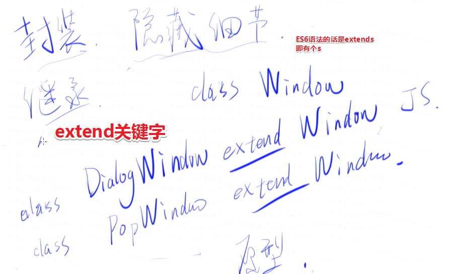
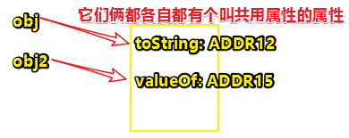

# 面向对象（上）

## ★总览

### ◇上节课答案


用图解释一波：


➹：[一个简单的 Promise 实现](https://judes.me/tech/frontend/2017/03/12/a_simple_promise.html)

> 这个答案我没有去看……

### ◇面向对象解决的问题

并不是：封装、继承、多态
而是写代码的套路问题（定势思维）

### ◇对象与函数的关系

JS中对象函数没有关系，JS之父通过this 强行使得它们有关系。

`obj.fn.call(obj,1,2,3)=>obj.fn(1,2,3)`

### ◇对象与对象的关系

## ★封装和继承

接下来，我们要讲的是JS中的面向对象，而不是其它语言的面向对象，毕竟JavaScript的面向对象跟其它语言的都不太一样！

### ◇什么是面向对象？

在上节课里边，我们讲到了异步，但发现没有用到对象！当然，我们用到了很多函数，然而在面向对象这个领域里边，是咩有**函数**这个词的！


画个图解释一波：


我一直觉得面向对象就是一个宗教，即你有信仰，认为世界万物都是有出处的！在这里，我把宗教分为两个，一个是「面向对象」教，还有一个是「函数式」教，当然还有个无教派，即认为这两个教都挺好的，我都可以加入这两个教，总之，无教派者们认为「自己无须一直遵循某种特定的教义，该什么时候用就什么时候用，即需要用面向对象就面向对象，需要用函数式就函数式，而不是要么这个式，要么那个式，选择一个之后，就终身不能选择另外一个了！简而言之，我两个都喜欢！」

回过头来看，函数式教，如我们之前的 `new Promise(fn)`，`Promise(fn)`就是个函数式，而加上个new就变成是面向对象式了！

而在面向对象式教里边，是没有「函数」这个词的！就像有些教义是咩有同性恋的，也没有离婚的，不允许吃荤的等等，总之**一般来说教义都有推崇什么，反对什么**，像面向对象它就没有函数一说！

既然没有函数，那它对应的是什么呢？——就是「类」啦！

你要知道的是面向对象的核心可不是对象呀！而是**类**呀！

但是在JavaScript里边，是**咩有类**的！所以这就很尴尬了呀！


于是，与类对等的东西就出现了，而这个东西叫做「**构造函数**」

那么什么是构造函数呢？我们之前有讲到过，但现在让我们来再次回顾一下它的定义：

> 如果一个函数返回了一个对象，那么这个函数就叫做构造函数啦！

而类呢？**如果一个东西，它返回了对象，那么这个东西就叫做类**！

所以，我们可以看到，它们俩是一个定义的，因此，我们大可认为「**所谓的类就是构造函数！**」

小结：

- 大致理解一下函数式和面向对象式的区别即可，比如关于面向对象：

  - 什么是类？什么是构造函数？

  而关于函数式则是：

  - 只讲函数，没有类，甚至连对象都不想讲！总之，就是全函数！

### ◇面向对象要解决的问题是什么？

> 换言之，就是为什么会有面向对象？

如果你学过面向对象的话，那么你听到最多的就是这三面大旗了——**封装、继承和多态**！

然而，在我看来这是很扯淡的一件事！

为什么这么说呢？——因为所有东西都可以有这三面大旗啊！并不是说只有你面向对象教才有的！只不过，你面向对象特别喜欢这三个东西罢了！

#### 什么是封装？


封装就是隐藏细节！为什么要隐藏细节呢？有这么两种情况：

1. 一个是自己（A）对自己（A）隐藏细节
2. 一个是自己（A）对别人（B）隐藏细节

我们先来看第二种情况，因为这个好说一点。举例来说，假如A是jQuery的作者，他提供了一个方法叫做 `$.get(url)`，而这样对B来说就很very good了！因为B只需要传给url过去，然后 `$.get(url).then(success)`即可！所以这就叫做隐藏细节了！毕竟B只需要传两个参数即可！

所以这样做的好处就是「我们合作起来特别顺畅！」即，你不用管我 `$.get()`到底用了什么技术，我只给了提供一个优雅的API，而你用这个API就能到达你的目的了！而我则保证「我把这个get和then写得好好的！」这样一来，这个就有助于我们双方之间的合作了呀！

所以说，**封装，在人和人之间意义就是有助于合作和交流，甚至不用交流，看这个API的名字就知道怎么做了**！

如果是自己对自己呢？

比如说，我们写了一百行代码！而这100行代码是我们一行行写的！而且这里边的代码是一个很复杂的逻辑，由于我们不想每次都得 把这100行代码都给看一遍，毕竟忒他妈麻烦了！于是我们就对它取了一个名字—— `跟女孩搭讪（女孩名字）`

有了名字之后，我们就可以把代码（假如里边代码是搭讪的套路）封装起来了，我们只需要传一个女孩的名字，然后我们就可以自动的去找这个女孩，自动的去搭讪，然后结果呢？就是成功或失败！

可以看到，我们不需要去了解是如何去搭讪的，只需要传个女孩的名字即可！

那么，这样做到底有什么好处呢？

就是可以解决你自己这个的思维负担！

为什么说可以解决思维负担呢？

因为这100行代码，你只要给它们取一个名字，或者 说给它们封装成一个对象，或者封装成一个类！以后，你只需要看这个名字，你就知道这是要跟女孩搭讪

至于是说「女孩你掉了一块砖？」「你的钱掉了？」还是其它等等什么的搭讪技巧，自己就不需要管了

总之，这就是**自己对自己分装，用于减少自己的思维负担，方便写出条理更清楚的代码**！

那么问题来了？你说这两种情况一定要用面向对象姿势弄出来吗？

显然，这是不一定的！因为，我简单地用一个函数也可以做到啊！

所以说，**面向对象可以实现封装，但不代表只有面向对象可以封装，只要你是隐藏细节，就都可以叫做封装！**

比如说，你把100行代码**变成一个function**，那么这个是不是封装呢？——答案，显然是的！

把100行代码**变成一个对象**，同样也是封装！

把100行代码**变成一个url**，同样也算是封装！

………

为什么说url也行呢？因为，你一旦get我这个url，那么我后台就得去做事情了！然后把结果响应回来给你了！

所以，**你只要把细节隐藏了，那就是封装了！**

#### 什么是继承？

继承是干嘛的呢？继承是为了……

还是先说一下继承之前是怎么样的吧！然后再看一下，继承之后有什么好处！

有这样一个场景：


> 没有继承之前，是没有三根线连在一起的！即，互不产生联系！

假设我们要写一个桌面程序 ，你可以认为是div做的，也可以是其它的东东，总之，不管是什么都行！

有一个叫窗口东西，我们知道每个窗口都是很固定的，如在windows里边，一个窗口它有这样几个元素：

1. 一个×
2. 一个标题栏
3. 一个状态栏


然后我们对这个窗口起一个名字，叫做「window」，而**这个window是一个函数，当然，你也可以认为它是一个类**！不过，这都无所谓啦！总之，它唯一的特点就是「接受一个名字！然后会返回一个对象」，就像下边这样的代码：

```
window = Window(name)
```

你可以加new，也可以不加，之后会说到这个new不new的问题！总之，目前在这里，new不new都一样！

随着时间的流逝，你会发现这有一个问题呀！即，我的窗口可不止上述所描述的这么一种窗口，我还有其它的窗口，比如说，我还有：

对话框的窗口：


它与那个Window窗口大部分是一样的，只是稍微小了一点，而且还有一个确定按钮，需要注意的是，你不能点击该对话框以外的地方关闭这个对话框，而是点击那个「x」或者「确定按钮（ok）」才行！所以这就是为什么叫它为对话框的原因了！

还有一种是什么都没有的窗口：


这是一种把标题栏、×等都隐藏的窗口，总之，这个窗口你不能关闭它，而是用于显示一些信息，然后过一段时间之后它就会消失的这样一个窗口，可以理解为我们右下角的弹窗一样，过一段时间它就消失了！

如果我们不用继承的姿势，写这三个窗口的话，我们就得写3个函数，分别如下：

- Window，要做的事有：

  1. 初始化关闭（`×`）按钮
  2. 出初始化标题栏
  3. 初始化宽高
  4. 初始化状态栏

- 弹窗：

  1. 前4步同上
  2. 点其它地方不关闭窗口
  3. 必须有个`ok`按钮

  总之，前4件事情是一样的，即存在**重复**

- 什么都没有的窗口：

  1. 可以同上的前4步，也可以不同上，如果同上的话，那么第五步，可以是去掉`×`按钮。

如果我们把那4件事情，变成是一个东西的话，那么我们再让窗口去继承的话，即「4件事」等价于「同上」之意。

可见，「同上」这么一个东西就是「继承」了

官方一点的说法就是「我直接用另外一个东西的属性和方法，不再自给自足的去声明了，而是在另外一个东西的基础之上，去加我新的属性和方法。」

这样一来，我们就产生了三种窗口：

1. 基本窗口（1234）
2. 对话框（56）
3. 提示框（5）

至此，我们所写的代码，只需要写7种功能即可！毕竟，后面两种框都继承了第一种框的那4个功能！

所以继承是啥意思呢？

就是这样一个意思——**我拥有你的所有东西，然后，我还有我自己特殊的东西**

如对话框拥有基本窗口的所有东西，而且对话框还有`ok`按钮，以及「点其它地方不关闭窗口」这样特殊的功能

那么，继承可以怎么实现呢？

**面向对象的方法，就是通过一个关键字来实现**，不过，这个关键字，在JavaScript里边是没有这个东西的！当然，在这里是指ES5（包括ES5）之前是没有的。总之，一开始JavaScript是没有的，而最新的JavaScript是有的！

那么这个关键字是啥呢？

它叫`extend`



假设有一个叫`Window`的类或者是构造函数，如果我还有一个叫做 `DialogWindow`的类的话，那么我在声明它时候，我就直接这样写了（JS可不是这样的姿势）：

```
class DialogWindow extend Window
```

那么这是啥意思呢？

就是说Window有的，我`DialogWindow`也都有，然后我还有其它的你Window没有的！

同理，我如果还有个弹出窗口`PopWindow`也继承了Window：

```
class PopWindow extend Window
```

以上的两行代码，实现了继承，不过，你只需要知道关键字extend的意思即可，**无需知道这个关键字到底是不是正确的拼写**！总之，你知不知道这个关键字是无所谓的！

那么JS的姿势是怎样的呢？

**JS它是用原型来做的！**（之后会讲，JS是如何做到的！）

#### 什么叫多态？


这个我们就以DOM为例好了，多态是指**一个东西拥有两种甚至多种东西的属性**。那么为什么会有这个东西呢？

比如说，我们声明一个div，拿到它的DOM对象，然后这样做：

```js
var div = document.getElementById('xxx')
div.childNodes //返回包含指定节点的子节点的集合，该集合为即时更新的集合
```

请问，这个`childNodes`接口（或者说是API）是哪儿来的？

因为div它是Node（节点）的实例，注意，这可不是nodejs的实例哈！

与此同时，我们还可以这样做：

```js
div.childern //是一个只读属性，返回 一个Node的子elements ，是一个动态更新的 HTMLCollection。
```

总之，上边两个，一个是获取节点子代，一个是获取元素子代

可以发现，上上边的那种做法，我们是把div当作是节点来用，而直接这上边的做法，则是把div当作是元素来用

那么它们俩之间有什么关系呢？

节点是分多种的，有些是元素节点，有些是文本节点等等。当我们把div当作是节点用的时候，我们就可以调用节点的API；同理，当我们把div当作是元素用的时候，就可以调用元素的API。

而这就是多态了。即div同时是节点和元素！

这个东西听起来很抽象，对吧！

那么如果我们不用这个面向对象，能不能实现这个多态呢？

也是可以的。

以函数为例，比如说我们jQuery，不过我们举的例子一定要符合可以调用**多种**API的这么一种情况！

以 `animate()`为例

其第一个参数：我们传的是我们要做的哪些属性变换，如把元素的宽度变成100，高度变成200等等

其第二个参数：我们可以传个字符串，如「慢慢地变」就是`'slow'`，还可以「快快地变」，即`'fast'` ，除了传字符串以外，我们还可以传一个数字，如`2000`，就是在2秒之内，把宽度变成100，把高度变成200

而这就类似于一个多态了，即我可以认为这个[animate](http://api.jquery.com/animate/)是在用字符串来进行操作，也可以是用数值来搞事情

所以说，多态这个东西，其实挺抽象的！如果你只以面向对象来说的话，就特别的狭隘了！

### ◇总结

- 封装就是把细节给隐藏起来，这样可以减少我们与他人之间沟通的成本，也可以减少我们自己的思维的负担。这样一来，当我们在说ajax的时候，就不用说ajax对象了，而是直接说 `$.get()`，你就知道我在干什么了！

- 继承是为了干嘛的呢？继承是为了复用代码，如Window类已经做了4件事情了，那么DialogWindow类就不用再把那4件事情给做一遍了，我直接就复用你Window类的代码就行了，当然，这不单只是复用别人的，也可以是复用自己的！

  > 复用自己的代码，难道不是封装姿势？同一个开发者，同样是可以写多个的类的！

- 多态是为了干嘛的呢？多态是为了让一个东西更加的灵活吧！为啥这样说呢？因为如果说没有多态的话，那么你经常要做得一个事情就是类型转换了。或许JavaScript没有类型的缘故，说了你也不懂，其实学过Java等强类型语言你就知道了。总之，**多态的存在就是为了更灵活一点！而灵活的好处就是代码写起来比较轻松一点，不需要老是去做所谓的「转换」**！

  ➹：[弱类型、强类型、动态类型、静态类型语言的区别是什么？ - 知乎](https://www.zhihu.com/question/19918532)

- 封装使得我们跟别人合作得更好！继承使得我们复用之前的代码而变得很好用！灵活使得我们的代码不那么死板，然后可以调整我们的思路，可见，这个多态是最抽象的！

以上，就是我们从抽象层面上，理解了这三面大旗了！

接下来，我们将会从代码层面上，来继续理解这三面大旗！

不过，我始终认为，这三面大旗并不是面向对象的终极需求！即，我不是为了做到封装、继承和多态，才去用面向对象的！

那么是为什么呢？

**是希望我写代码的时候不用再思考怎么写代码！**

比如说：知乎上有一个问题就是「请问，穷人思维是什么？富人思维又是什么？」

而答案里边，有很多人举例子，而我的观点就是：

> 穷人思维就是让你跟穷人活得一样。而富人思维就是让你跟富人活得一样。也就是说，你不用再思考了，你就跟着他们学就好了。比如说我是个穷人，而我的周围也都是穷人，我看这些穷人是怎么活下来的，比如说他们省吃俭用，然后不浪费水，不浪费电，然后经常存钱等等……额……我这样一看，那我学他们不就行了吗？至此，我就不用思考「为什么要存钱？」，毕竟他们因为存钱等就活下来了！因此我也要学他们存钱而活下来！
>
> 然后，我们回过头来看富人，比如说我是富人，然后我周围看富人，他们都去借贷款，买房产。然后买完一套，买 两套，买完了之后，还去炒什么股票，然后还能赚钱。那么我该干嘛呢？
>
> 同样，我不用思考，对不对？我学着他们做不就好了吗？
>
> 所以穷人思维和富人思维都是模仿你周围的人，然后减少你大脑的思考，因为一旦你大脑思考的话，由于人天生就是喜欢想着「我能不能什么也不做就有钱呢？」，即**我不想思考，也不想动就是最好的！**
>
> 而面向对象也是这样的问题，我在写代码的时候，拿到一个需求，然后想呀想，这个需求到底该如何实现呢……
>
> 然后这个需求换了，我又得重新开始想了。
>
> 那么我能不能就是想出一个思维定势（类似于把2号大脑搞成是1号大脑），不管你给我什么需求，我都这样想，而面向对象就是解决这个问题的，即让你好像是从以前的穷人思维变成是富人思维一样
>
> 总之，其实，这是让你「**遇到任何需求，都用一套思维解决**」
>
> 那么函数式呢？就是你「**遇到任何需求，你就用另一套思维解决**」
>
> 而**这套思维具体是什么，其实不重要。你只需要去习惯这套思维，也就是说，你要做的事情是「不要思考，而是去习惯它！然后来什么，你就往这里边靠就好了！」**

好了，这就是我们所说的第一个面向对象所要解决的问题了！（**思维定势**）

其实，你说封装、继承、多态是独属于面向对象式的，可是，难道函数式就没有这些东西吗？它也有类似的东西呀！只不过名字不一样而已！所以说，**这个名字都是面向对象教派里边的一些人自己取的**！

比如说中国人把上帝叫做玉皇大帝，而外国人把上帝叫做耶稣。难道中国人有个上帝？外国人同样也有个上帝吗？

如果有上帝的话，那全世界肯定只有一个上帝呀，怎么会有每个国家都有一个上帝呢？如果真的是这样，那么这就没啥意义了。

所以这个也是一样的，即**面向对象把封装叫封装，而函数可能就把封装叫其它东西了，但它们本质上说的都是同一个东东，总之，装逼如风，常伴吾身**……

➹：[为什么独立思考这么难？——谈谈心理学的成因，并分享俺的经验 @ 编程随想的博客](https://program-think.blogspot.com/2019/03/Why-Thinking-Hard-So-Hard.html)

➹：[什么是「富人思维」？ - 知乎](https://www.zhihu.com/question/26980854)

## ★原型链（对象与对象）

我们之前讲了一些关于面向对象的抽象概念，接下来，我们就来看看JS是如何实现面向对象的！即JS是如何实现封装、继承和多态的！

在此之前，我们先想想JS有什么，然后JS又是如何做到这些的？

那么JS有啥东西呢？

### ◇JS有啥东西？


JS有的东西就那么几个东西，首先最基础的就是，它有7种的基本数据类型（建议大家把这7个小矮人背得滚瓜烂熟）。

其中分为，基本类型和复杂类型（或者说是引用类型、对象），前者的特点「存的是值」，而后者则是「存的是内存地址，但本质上来说，内存地址也是个值哈！所以说它们俩是差不多的！」

在这里，基本类型就不用看了，因为与这节课无关，毕竟，这次课的目的是探究「Object」啊！

关于Object，我们在这里得分三种情况来搞事情。

一种是普通对象，不过，这种对象没啥特殊的：

```js
{name:'frank'}
```

另外一种是数组，它是一种特殊的对象，那么它和上边那种有啥区别呢？数组的下标是0字符串、1字符串……lenght字符串，总之它的下标是固定的：


> 当然，你也可以对数组添加其它属性，不过，这样一来，那就很不像「数组」了

而上边那种则是随意的，即乱七八糟的属性都行，不是非得是字符串0等这样子的！

最后一种是函数啦！

它是JS里边重中之重的这么一个东西

那么JS是如何实现它们之间的组合关系呢？这就涉及到原型链啦！

### ◇原型链

在讲解原型链之前，我们先来写一段很简单的代码，以此来看看这段代码到底干了啥事：

```js
var obj = {
	name: 'frank',
	age: 18
}
```

上边这段代码到底干了啥？

实际上它在栈内存里边，存的是地址，一个可以让你找到对象位置的地址：


我不在乎`obj.toString()`的值是什么，我只在乎为啥会有`toString`？

我们可以看到，这个内存里边根本就没有`toString`这个属性对吧！

可这个突然出现神奇的属性到底是怎么来的呢？


至此，我们就遇到了一个非常大的问题了！

在讲解下面的内容之前，我还是先告诉你答案吧！——**它其实是隐藏在原型链里边的**

我们想要这个obj有个toString方法的话，有一种很简单的方式，那就是把这个toString写在内存里边不就好了，然后它就存一个函数，当然函数也是一个对象，所以该toString得再存一个地址才行，然后当我们调用该方法时就找到那个地址所指向的那个函数即可：

```js
var obj = {
	name: 'frank',
	age: 18
}
```


至此，我们就让这个toString属性关联到了一个函数！

此刻，我们确实实现了`obj.toString()`

但是有个问题是，我们并没有在obj这个对象里边声明这个toString属性，然后它就有了这个toString属性。当然，你可以利用JS引擎，偷偷地在语法分析的时候加个toString属性不就好了吗？就像是我们new一个对象时，JS之父为我们所做的加糖操作！

假如还有个obj2对象，它也需要toString属性呢？


我们可以发现，这存在一个很大的浪费现象，如出现了两个叫toString的key，而且还出现了两个功能一模一样的函数

那么如何解决这个浪费现象呢？第二个浪费现象很好解决，即把这两个toString都定位到同一个内存地址不就好了吗？

那么现在，就只存在一个问题了，那就是重复的这个key——toString，该如何解决呢？

或许此刻的你认为，就一个重复的key没啥大不了的，这点空间，内存还是够的，可是，你要知道的是，我们除了可以`obj.toString()`以外，还可以 `obj.valueOf()`等等……

一旦我们的属性多了之后，如有10个以上了呢？这时是不是觉得这些同名的key是很浪费内存的？

那么我们是否能把这些同名的ke也给统一起来呢？

这是可以的。再声明一个对象就好了，而这个对象就是把你们这些共有的key和value都放进来，如`toString`、`valueOf`……



然后对`obj`和`obj2`各自加上一个叫「共用属性的」属性即可！


至此，我们把能简化的都给简化了。

那么现在当我们声明一个对象`obj`的时候，这个obj会做些什么呢？

我们知道，我们搞了一个对象出来，就有toString等这样的方法可以供我们使用。根据对上文的讲解，我们可以理解为在这个背后里边，会有一只无形的手来为我们的普通对象追加一个属性，而这个属性类似于共用属性，总之，你是普通对象的话，那么你将会和其它对象一样共用一个属性了。

> 

话又说回来，我们可以访问到上上图中的那个「共」属性吗？——可以的，只是不叫「共」而已！它叫另外一个名字，而且这个名字很特殊，等会儿你就知道了（上面那张图剧透了）

同理，如果你又有声明另一个对象的话，同样第三只手，也会在内存里边帮了搞个「共」属性（其值是一个对象的地址）！

如果我们要找`toString`的话，这是很容易就能办到的！

如我们写了这样一句 `obj.toString()`代码

首先，JS引擎会看你这个obj对象的内存里边有没有叫个`toString`的key，如果没有，那么就会去看「共」这个key所指向的那个对象内存（**A188**）里边有没有个叫`toString`的key了！显然这次找着了！那就用这个对象内存里的`toString`就好了

同理，obj2也是如此！

可见，这个过程类似于我们之前所讲的作用域链一样！形象点来说就是「**此地不留爷，自有留爷处**」！

**小结：**

- JS通过加个「共」的这么一个小技巧，就可以实现又经济又环保的、然后性价比又高的，所有东西都没有重复的存，如果你想要跟别人共享一个东西的话，你就把这个共享东西，单独做成一个对象，然后大家都去「共」它即可！这就是原型链最朴素的一个想法了，即**省内存**

  或许你会认为就目前2019年来说，**省内存**是不是有点多余了，毕竟现在都是4G、8G、16G等的内存条了，可是你有没有想过，在JavaScript刚诞生的那个年代，即1995年，那时的电脑的内存条只有8M、16M等，就8M内存而言，你声明几个字符串就能把它给占满了！所以说省内存是这个计算机编程的一个首要功能，毕竟内存实在是太少了，所以才发明了原型链。

  如果1995年，大家的电脑都是8G、16G的内存，那么可能JavaScript就不会去搞原型链了！

- 以上就是把JavaScript原型链的出现原理给说了一下！

> 个人理解，基于之前芳芳所讲的内容。
>
> 我们知道`_proto__`只对普通对象有意义
>
> 而`prototype`只对构造函数有意义
>
> 后者指向了实例的原型，而实例的原型也因此构成了一颗原型对象树
>
> 这种情况就像是，一对双胞胎，要找父母要钱买零食，然而父母都不给，表示没钱，于是就去找爷爷奶奶，慈祥的爷爷奶奶，肯定会给的呀！
>
> 一个题：
>
> 
>
> 我理解得有点欠缺，看到这句话我就真正明白了：
>
> ```
> var dog = function(){}; 语句实际上是 var dog = new Function();，所以，dog.__proto__ === Function.prototype；而 Function.prototype 并没有 price 属性，如果加一句：Function.prototype.price = 123；那么第一个打印就是 123；
> ```
>
> ➹：[ js 原型链怎么理解？ - 知乎](https://www.zhihu.com/question/34158992)

### ◇JS的原型链是怎样的？


## ★总结


## ★Q&A