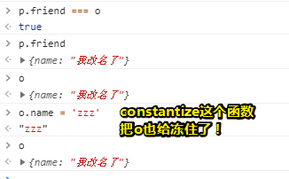

---

typora-copy-images-to: img\02
---

# 新版变量声明：let 和 const

## ★课程简介

ES 6 新特性一览：<https://frankfang.github.io/es-6-tutorials/>

教程：es6.ruanyifeng.com

### ◇先学 ES 5 还是 ES 6

无聊的问题，ES 6 包含 ES 5，你无论如何都必须先学 ES 5，才能看懂 ES 6

### ◇ES 6 如何学

1. 快速通览，然后使用
2. 边使用边加深印象

### ◇自学的问题

你不知道一个语法为什么要存在

1. 触类旁通，去看看其他语言有没有这个语法，怎么用的
2. 反证法，如果不用这个语法，该怎么实现需求

### ◇let & const

[我用了两个月的时间才理解 let](https://zhuanlan.zhihu.com/p/28140450)

1. let 和 var 的区别
2. const 和 let 的区别
3. 相关面试题

### ◇扩展链接

➹： [ECMAScript - Wikiwand](https://www.wikiwand.com/en/ECMAScript#/Versions)

## ★概述

### ◇一些问题

这一个系列课只讲ES6的知识点！

什么是ES6？——自己去搜一下就好了！如可以去了解它的历史之类的……

为什么会有这一次系列课？——因为ES6已经是前端的事实标准了！什么叫事实标准呢？即除了IE，所有浏览器都支持了ES6！但是大部分前端只会ES5，那ES6是2015年出的一个语法，而今年是2018年，那么距离现在已经过去3年了！或许你会觉得这语法依旧很新，但其实这已经是旧语法了！为什么这么说呢？因为在今年的6月份ES9已经出来了！

学完ES6后学什么？——学ES7，然后学ES8……总之学习顺序是ES5→☞ES6→☞ES7→☞……那么为什么要这样学呢？➹：


总之，不管先学ES5还是ES6，ES6都是包含ES5的，不管你学什么，都得先学核心，然后再学周边的。这次系列课只讲纯语法，不讲对应的在页面上怎么使用！

讲解目录：<https://fangyinghang.com/es-6-tutorials/>。这个是ES6的新特性列表！除了ES5之外的内容就这么多！看上去内容挺多的，讲解顺序——从左到右，一个个往下讲……

在讲解这些新特性之前，我们需要解决一些问题：

为什么JS要升级呢？是因为要加强吗？

芳芳个人认为从ES5到ES6，就是JS的打脸史……怎么个打脸法呢？基本上把它以前认为对的东西都给改掉了！如一开始不要出这个，后来就出了这个；要出这个，后来又不出这个……总之就是一直在打脸……

那为什么JS宁愿去打脸，也不愿意发明一个新的语言呢？

有两种途径，如果你觉得ES5太烂了，你就放弃它，然后产生新的语言，如TypeScript；可为什么我们要选择升级呢？因为JS的生命力太过于顽强，就算它那么烂，全世界所有的开发者却都喜欢使用JS，基本上所有的开发者都会写JS以及会写另一门语言，如写PHP的会写JS，写JAVA也会写JS，写python的也会写JS等等……只有前端是专门学JS的，所以芳芳**建议大家除了学JS以外还要学习另外一门语言**……


为什么特意强调这是一个打脸史过程呢？是为了定义这个系列课的基调——打脸，带着一种有种嘲讽、愉悦的心情去学习它！

如果在学习的过程中有任何不懂的，可以在群里问，或者可以去看阮一峰的！

### ◇目录

目录：

- 先从简单的开始学，然后再学复杂的！所以先学ES5，然后再学ES6

- ES6怎么学？——一般来说，所有语言的特性都是这样的，即快速的全部看一遍，然而这个大部分人都做不到，为什么这么说呢？因为除非你天资很高，如果你是个普通的自学者，你想在没有了解JS的情况下去通览ES6的特性，这很难……

  接下来就是开始用了，即我知道有哪些东西，相当于背了一个字典，如ES可以干什么，有let、const等……然后就开始用了，然后再用的过程中边用边加深印象。那边加深印象有哪些方法呢？

  第一个你可以看阮一峰的[ES6教程](http://es6.ruanyifeng.com/)，第二个你可以看[MDN](https://fangyinghang.com/es-6-tutorials/)（这个内容里面的链接都指向MDN）

  总之先通览，边用边加深！

- 自学的问题？——如果你自学，即你没有人指导的话，那么将会遇到一个比较大问题的就是「你不知道为什么会有这样一个语法存在」，不如说Symbol，JS一开始没有Symbol，但是在ES6中就突然出现一个叫Symbol类型，而到目前为止，前端基本上没有人去使用Symbol类型，因为它们不知道为什么要去用它！换句话说就是「我知道有这个语法，但是我平时用不到！」，那么在这种情况下，基本上你就不能靠自己想了！所以你需要去 ？有些特殊的技巧，比如说：

  1. 触类旁通：就是你去看看其它的语言，比如说ruby这门语言，它是有Symbol的！然后你去看看ruby是怎么用symbol的，为此，你就知道了JS大概会怎么样去用Symbol的！就好像美国和中国一开始，美国好多人买汽车，但中国以前刚解放的时候很穷，咩有钱买汽车，但是现在中国人有钱了，买了自己的小轿车之后，那么该怎么用，有哪些品牌，你参考美国不就好了吗？如美国人说哪个好，我们就去看一下是不是真得好、看美国人是怎么开车的……

     总之：如果某个语言比较先进，那我们JS作为一个后进的语言就去抄袭一下它们，所以这就叫做触类旁通，直白一点就是去看看别的语言是怎么用这个语法的，那就可以快速的知道这JS也是一样的用法，没有什么区别

  2. 反证法：有很多情况下你不知道为什么会这样用，那你就想「那如果不用它，即我就不用这个语法，我该怎么实现某个效果」

  这次系列课中会经常用到这两个方法！

根据 [ES 6 新特性列表](https://fangyinghang.com/es-6-tutorials/) 这个开始讲，第一个就是著名的变量声明—— `var、let、const`这三者的区别

---

## ★let和const

### ◇预习

➹：[let 和 const 命令 - ECMAScript 6入门](http://es6.ruanyifeng.com/#docs/let#let-%E5%91%BD%E4%BB%A4)

#### ES6简介

- ES6的目标：是使得 JavaScript 语言可以用来编写复杂的大型应用程序，成为企业级开发语言。

- ES6 既是一个历史名词，也是一个泛指，含义是 5.1 版以后的 JavaScript 的下一代标准，涵盖了 ES2015、ES2016、ES2017 等等，而 ES2015 则是正式名称，特指该年发布的正式版本的语言标准。

  总之ES6一般是指 ES2015 标准，但有时也是泛指“下一代 JavaScript 语言”。

- [你的浏览器支持 ES6 吗？ - ES-Checker](http://ruanyf.github.io/es-checker/index.cn.html)

#### let 和 const 命令

##### let命令

- 基本用法：

  - `let`命令，用来声明变量。它的用法**类似**于`var`，但是所声明的变量，只在`let`命令所在的代码块内有效。
  - for循环其实很特别，只是因为你用了 `var`声明循环变量的缘故，才没有发现它的特别之处——一个 `()`，即设置循环变量这部分是个父作用域；一个 `{}`，即循环体这部分是个子作用域

- 不存在变量提升

  - 原因：`var`命令会发生”变量提升“现象，即变量可以在声明之前使用，值为`undefined`。这种现象多多少少是有些奇怪的，按照一般的逻辑，变量应该在声明语句之后才可以使用。

- 暂时性死区

  只要块级作用域内存在`let`命令，它所声明的变量就“绑定”（binding）这个区域，不再受外部的影响。

  > 换句话说就是，检查 `{}`里有咩有let命令，如果有，那就看看它所声明的变量，而这个变量是无法逃出 `{}`的范围的

  在代码块内，使用`let`命令声明变量之前，该变量都是不可用的。这在语法上，称为“暂时性死区”（temporal dead zone，简称 TDZ）。

  不管怎样：变量一定要在声明之后使用，否则就报错。

总结上面两点：

ES6 规定暂时性死区和`let`、`const`语句不出现变量提升，主要是**为了减少运行时错误**，**防止在变量声明前就使用这个变量，从而导致意料之外的行为**。这样的错误在 ES5 是很常见的，现在有了这种规定，避免此类错误就很容易了。

总之，暂时性死区的本质就是，**只要一进入当前作用域，所要使用的变量就已经存在了，但是不可获取，只有等到声明变量的那一行代码出现，才可以获取和使用该变量。**

---

- 不允许重复声明 
  - `let`不允许在**相同作用域**内，重复声明同一个变量。如let声明了一个变量a，你再用var声明一个变量a，是会报错的额！
  - 不能在函数内部重新声明参数。除非你用个 `{}`

##### 块级作用域

- 为什么需要块级作用域？——ES5 只有全局作用域和函数作用域，没有块级作用域，这带来很多不合理的场景。如「内层变量可能会覆盖外层变量。」就像这样：

  

  还有就是「用来计数的循环变量泄露为全局变量。」就像这样：

  

- ES6 的块级作用域

  - `let`实际上为 JavaScript 新增了块级作用域。

  - ES6 允许块级作用域的任意嵌套。外层作用域无法读取内层作用域的变量，而内层作用域可以定义外层作用域的同名变量。

  - 块级作用域的出现，实际上使得获得广泛应用的立即执行函数表达式（IIFE）不再必要了。

    

    自从有let命令，妈妈再也不用担心我写IIFE了……

- 块级作用域与函数声明

  函数能不能在块级作用域之中声明？这是一个相当令人混淆的问题。

  - ES5 规定，函数只能在顶层作用域和函数作用域之中声明，不能在块级作用域声明。但是，浏览器没有遵守这个规定，为了兼容以前的旧代码，还是支持在块级作用域之中声明函数

  - ES6 引入了块级作用域，明确允许在块级作用域之中声明函数。ES6 规定，块级作用域之中，函数声明语句的行为类似于`let`，在块级作用域之外不可引用。

    不过，在浏览器的 ES6 环境中，块级作用域内声明的函数，行为类似于`var`声明的变量。

    所以考虑到环境导致的行为差异太大，应该**避免在块级作用域内声明函数**。如果确实需要，也应该**写成函数表达式，而不是函数声明语句。**

  - 另外，还有一个需要注意的地方。ES6 的块级作用域允许声明函数的规则，只在使用大括号的情况下成立，如果没有使用大括号，就会报错。

    

##### const 命令

- 基本用法

  - `const`声明一个只读的常量。一旦声明，常量的值就不能改变，这意味着，`const`一旦声明变量，就必须立即初始化，不能留到以后赋值。
  - `const`的作用域与`let`命令相同：只在声明所在的块级作用域内有效。
  - `const`命令声明的常量也是不提升，同样存在暂时性死区，只能在声明的位置后面使用。
  - `const`声明的常量，也与`let`一样不可重复声明。

- 本质

  > `const`实际上保证的，并不是变量的值不得改动，而是**变量指向的那个内存地址**所保存的数据不得改动。对于简单类型的数据（数值、字符串、布尔值），值就保存在变量指向的那个内存地址，因此等同于常量。但对于复合类型的数据（主要是对象和数组），**变量指向的内存地址，保存的只是一个指向实际数据的指针**，`const`只能保证这个指针是固定的（即总是指向另一个固定的地址），至于它指向的数据结构是不是可变的，就完全不能控制了。因此，将一个对象声明为常量必须非常小心。

  

  上面代码中，常量`foo`储存的是一个地址，这个地址指向一个对象。不可变的只是这个地址，即不能把`foo`指向另一个地址，但对象本身是可变的，所以依然可以为其添加新属性

  既然如此，如果我一定要让对象不能改呢？即真的想将对象给冻结了……

  那么就使用`Object.freeze`方法吧！

  ```javascript
  const foo = Object.freeze({});
  
  // 常规模式时，下面一行不起作用；
  // 严格模式时，该行会报错
  foo.prop = 123;
  ```

  上面代码中，常量`foo`指向一个冻结的对象，所以添加新属性不起作用，严格模式时还会报错。

  

  所以除了将对象本身冻结，对象的属性（感觉这表述不太准确）也应该冻结。下面是一个将对象彻底冻结的函数。

  

  我这样测试了：

  ```js
  p.friend === o //true，也就是说还是同一个对象，只是里面的内容不同了！
  ```

  似乎不对啊！

  

  ```javascript
  var constantize = (obj) => {
    Object.freeze(obj);
    Object.keys(obj).forEach( (key, i) => {
      if ( typeof obj[key] === 'object' ) {
        constantize( obj[key] );
      }
    });
  };
  ```

  这个函数既把对象给冻住了，还把对象里的属性的值是Object类型的，都给冻住了！

  感觉这个很函数很不纯碎，有种「株连九族」的赶脚……

  > 这个函数像是之前写curry函数那样，同样用到递归，然后终结点是对象里是否还有属性值是Object类型的，如果有那就一直进行下去好了！直到没有为止……

- ES6 声明变量的六种方法

  ES5 只有两种声明变量的方法：`var`命令和`function`命令。ES6 除了添加`let`和`const`命令，后面章节还会提到，另外两种声明变量的方法：`import`命令和`class`命令。所以，ES6 一共有 6 种声明变量的方法。

##### 顶层对象的属性

顶层对象，在浏览器环境指的是`window`对象，在 Node 指的是`global`对象。ES5 之中，顶层对象的属性与全局变量是等价的。

-  JavaScript 语言最大的设计败笔之一：顶层对象的属性与全局变量挂钩

  为什么这么说呢？因为它带来了这么些问题：

  1. 没法在编译时就报出变量未声明的错误，只有运行时才能知道（因为全局变量可能是顶层对象的属性创造的，而属性的创造是动态的）

  2. 程序员很容易不知不觉地就创建了全局变量（比如打字出错）

  3. 顶层对象的属性是到处可以读写的，这非常不利于模块化编程

  4. 另一方面，`window`对象有实体含义，指的是浏览器的窗口对象，顶层对象是一个有实体含义的对象，也是不合适的。

     > 难道顶层对象不应该有实体含义？按照我对实体的理解，它就是非抽象的，即正如你所看到的「浏览器的窗口对象」，而顶层对象则是不可见的，即无法通过肉眼观测到这个对象的！
     >
     > 也就是说一个是「substance」，一个是非substance的！
     >
     > ➹：[淺談 Entity 的概念 - Twin Earth Conservancy Bureau](http://www.drupaltky.org/article/43)
     >
     > ➹：[哲学中的实体与实在到底是什么意思？ - 知乎](https://www.zhihu.com/question/23941781)

  所以ES6的出现就意味着接受大家的打脸……

  ES6 为了改变这一点：

  一方面规定，为了保持兼容性，`var`命令和`function`命令声明的全局变量，依旧是顶层对象的属性；

  另一方面规定，`let`命令、`const`命令、`class`命令声明的全局变量，不属于顶层对象的属性。

  也就是说，从 ES6 开始，**全局变量将逐步与顶层对象的属性脱钩。**

  ```javascript
  var a = 1;
  // 如果在 Node 的 REPL 环境，可以写成 global.a
  // 或者采用通用方法，写成 this.a
  window.a // 1
  
  let b = 1;
  window.b // undefined
  ```

  上面代码中，全局变量`a`由`var`命令声明，所以它是顶层对象的属性；全局变量`b`由`let`命令声明，所以它不是顶层对象的属性，返回`undefined`。

##### global 对象

ES5 的顶层对象，本身也是一个问题，因为它在各种实现里面是不统一的。

- 浏览器里面，顶层对象是`window`，但 Node 和 Web Worker 没有`window`。
- 浏览器和 Web Worker 里面，`self`也指向顶层对象，但是 Node 没有`self`。
- Node 里面，顶层对象是`global`，但其他环境都不支持。

如何找到一种方法，可以在所有情况下，都取到顶层对象？

```javascript
var getGlobal = function () {
  if (typeof self !== 'undefined') { return self; }
  if (typeof window !== 'undefined') { return window; }
  if (typeof global !== 'undefined') { return global; }
  throw new Error('unable to locate global object');
};
```


➹：[let 和 const 命令 - ECMAScript 6入门](http://es6.ruanyifeng.com/#docs/let#global-%E5%AF%B9%E8%B1%A1)

---

### ◇视频


---

## ★总结

- 对「触类旁通」这四个字有了更深一层的认识，如语法的互相抄袭。同一个效果，有多种途径可以做到，当你不理解这种途径是怎么做到的时候，你就去看看其它途径是怎么做到的，简而言之，三个字可以概括这一过程——反证法
- 可以叫ES6精讲，也可以叫ES6深入浅出……
- 可以在这儿查找资料：[翻译 - HTML5 Chinese Interest Group Wiki](https://www.w3.org/html/ig/zh/wiki/%E7%BF%BB%E8%AF%91)
- **避免在块级作用域内声明函数**。如果确实需要，也应该**写成函数表达式，而不是函数声明语句。**
- ES6 一共有 6 种声明变量的方法。

## ★Q&A

### ①什么叫基调？

- 音乐作品中主要的曲调
- 比喻基本精神、基本观点等，如会议的 基调是团结奋进
- 风格、主要情感，如rap的flow……

突然想到似乎可以把基调看作是一个变量名，然后应用到句子的时候，就把替换一下就好了，如「会议的基本精神是团结奋进」

### ②触类旁通？

> 接触某一事物并掌握其规律后，就能推知同类的其他事物（旁：别的；通：通晓）。

接触Ruby的Symbol语法后，并了解其用法以及其存在的意义后，就能推知JS的Symbol语法是怎么用的，以及要解决什么问题了……

### ③为什么要声明变量？

> 其实换句话说就是「定义变量的作用是什么？」

反证法：

- 如果不声明变量的话，那么JS解释器就不认识这个所谓的「变量」，只是一个莫名其妙的字符而已：

  

  唯有声明了变量，解释器或编译器才会设置一个空间来存储所给出的值

变量的定义：

- [变量](https://www.wikiwand.com/zh-cn/%E5%8F%98%E9%87%8F_(%E7%A8%8B%E5%BA%8F%E8%AE%BE%E8%AE%A1))可以指在[计算机存储器](https://www.wikiwand.com/zh-cn/%E9%9B%BB%E8%85%A6%E8%A8%98%E6%86%B6%E9%AB%94)里**存在值的被命名的**存储空间。

我们可对变量做啥：

- 变量通常是可被修改的，即可以用来表示可变的状态

- 为变量命名——每种编程语言都有规则指定什么才可作为[变量](https://www.wikiwand.com/zh-cn/%E5%8F%98%E9%87%8F_(%E7%A8%8B%E5%BA%8F%E8%AE%BE%E8%AE%A1))的名字

如果不理解的话，可以触类旁通：

> 在[初等数学](https://www.wikiwand.com/zh-cn/%E5%88%9D%E7%AD%89%E6%95%B0%E5%AD%A6)里，**变量**或**变元**、**元**是一个用来表示值的[符号](https://www.wikiwand.com/zh-cn/%E7%AC%A6%E8%99%9F)，该值可以是随意的，也可能是未指定或未定的

变量是一个用来表示值的符号！

➹：[变量 - Wikiwand](https://www.wikiwand.com/zh-cn/%E8%AE%8A%E6%95%B8)

其它的一些答案：

- 在编程里，变量其实是存放值的存储器地址的别名
- 上帝叫你完成一件任务的时候,你必须存在(声明变量)

➹：[编程里定义变量的作用是什么。为什么要给它定义个数据类型，怎么熟练学好这个知识_百度知道](https://zhidao.baidu.com/question/7710070.html)

变量？存储地址？什么鬼？变量与存储地址是等价的吗？

用标签标记文本，用变量名指代变量？

> 变量：用来标识(identify)一块内存区域，这块区域的值一般是可以更改的，这就是它“变”的由来，但是我们可以通过使用如const等一些修饰符号来限定这一内存区域的操作特性(characteristic)，即变量的操作特性。用const修饰的使变量不能更改的就和常量一样的变量叫做常变量。 
>
> 变量名：是一个标识符(identifier)，用来指代一块内存区域，即变量，使用变量使我们操作内存以区域(area)，以块(block)为单位，提高了方便性。 

变量名是用来标识某个内存块的 

变量是地址的别名..就像刚生的小孩,你只知道他在地球上的某个位置,而不能叫出他名字,给你取个名

一般来说，变量名不需要存储，但对于带 eval 的动态语言来说，变量名是储存的，比如 JS 的每个 Environment Record 就存了所有的局部变量，以及访问链。

➹：[变量名储存在那里，变量的储存机制是什么？ - 知乎](https://www.zhihu.com/question/34266997)

➹：[C 里面 ---变量名-- 和 --地址-- 的关系探讨 - 那些年....的专栏 - CSDN博客](https://blog.csdn.net/jiary5201314/article/details/44684243)

➹：[变量名和变量地址 - 天天向上... - 博客园](https://www.cnblogs.com/xuhj001/p/3436177.html)

➹：[程序如何根据变量名在内存中找到存放这个变量的地址？ - 知乎](https://www.zhihu.com/question/20086414)

### ④为什么要对变量私有化？

> “‘老王忘记把他的猫封装，后来他的猫就被辗平了⋯⋯’（在捷运站听到的鬼故事）”摘自《Head First Java》

➹：[编程中为什么要把一些变量私有？ - 知乎](https://www.zhihu.com/question/21142338)

### ⑤JS 环境记录 访问链？

对于 C/C++ 这种编译成机器代码的语言：
**变量名不需要储存**，所有的局部变量读写都会变成（栈地址 + 偏移）的形式。
允许子程序嵌套的语言比如 Pascal/ML，读写非局部变量会经由访问链（Access link）去读其他的栈帧，但是变量名也会变成一个索引（整数），不会在内存中出现的。

对于带 eval 的动态语言来说，变量名是储存的，比如 JS 的每个 Environment Record 就存了所有的局部变量，以及访问链。

我是否可以这样理解：


再次理解：

我把桌子看作是一份内存空间，桌子上面可摆放一个水杯或者一台电脑，或者二者都存在，只要桌子够大就行！

我们可以把这份内存空间看作是一个变量，换句话说「我们在说变量也就是在说内存地址」，针对我们开发者而言，我们大都使用高级语言来开发程序，如果我们要去读取数据，该怎么读好呢？写个内存地址吗？显然不会，我们可以为变量取个名字，用于标识这个变量，这就是标识符啦！更通俗一点来说就是变量名！

所以：

> 变量名不需要储存，变量名是给人看的，编译器编译的时候知道每个变量所储存的地址，直接使用地址来读写便是。

言归正传：

➹：[谈谈JavaScript的词法环境和闭包（一） - 聪豆儿的前端专栏 - SegmentFault 思否](https://segmentfault.com/a/1190000006719728)

➹：[理解 JavaScript（二） - 太极客（Very Geek） - SegmentFault 思否](https://segmentfault.com/a/1190000000348228)

- 声明变量：

  ```js
  var a;
  ```

- 定义变量：

  ```js
  var a = 1;
  ```

解释：

- **声明：**是指你声称某样东西的存在，比如一个变量或一个函数；但你没有说明这样东西到底是什么，仅仅是告诉解释器这样东西存在而已；
- **定义：**是指你指明了某样东西的具体实现，比如一个变量的值是多少，一个函数的函数体是什么，确切的表达了这样东西的意义。

所以这个：

```js
var a = 1;   
```

声明并定义变量！即这一句话，解释器是分解成两个步骤来做的！一个是声明（`var a`），另一个是定义（`a = 1`）。

在JS中，关于变量作用域，即是静态作用域，在ES5中使用**词法环境**管理静态作用域。当然还有其它域，如全局作用域和函数作用域，这是针对一个变量是否可以被访问来划分的！不过目前ES6有了块级作用域，要使块级作用域生效需要使用let和const……

关于词法环境，它包含两部分：

- 环境记录
  - 形参
  - 函数声明
  - 变量
  - 其它...
- 对外部词法环境的引用(outer)

关于环境记录初始化：

一段JS代码执行之前，会对环境记录进行初始化（声明提前），即将函数的形参、函数声明和变量先放入函数的环境记录中，特别需要注意的是：

- 形参会在初始化的时候定义值，但是函数内部定义的变量只声明不定义（不赋值），这个需要用JS中的Hoisting机制来解释，具体可以看这一篇文章：[《理解 JavaScript（二）：Scoping & Hoisting》](https://segmentfault.com/a/1190000000348228)。

以下面这段代码为例，解析环境记录初始化和代码执行的过程：

```js
var x = 10;
function foo(y) {
    var z  = 30;
    function bar(q) {
        return x + y + z + q;
    }
    return bar;
}
var bar = foo(20);
bar(40);
```

- **step1:初始化全局环境**


- **step2: 执行x=10**


- **step3：执行var bar = foo(20)语句之前，将foo函数的环境记录初始化**


- **step4：执行var bar = foo(20)语句，变量bar接收foo函数中返回的bar函数**


- **step5：执行bar函数之前，初始化bar的词法环境**


- **step6：在foo函数内执行bar函数**

```js
x + y + z + q = 10 + 20 + 30 + 40 = 100
```

其实说了那么多，也是想强调一点：形参的值在环境初始化的时候就赋值了！因此形参的作用之一就是**保存外部变量的值**！

> 我之所以摘录下来是因为这给了我新的认识！

➹：[图解JS词法环境(Lexical environment) - public class Me的博客 - CSDN博客](https://blog.csdn.net/dhassa/article/details/70945016)

### ⑥let声明的变量，无法用window读取它？

➹：[javascript’let’全局变量不是’window’的属性,不像全局’var’ - 代码日志](https://codeday.me/bug/20180831/238070.html)

➹：[let 和 const 命令 - ECMAScript 6入门](http://es6.ruanyifeng.com/#docs/let#%E9%A1%B6%E5%B1%82%E5%AF%B9%E8%B1%A1%E7%9A%84%E5%B1%9E%E6%80%A7)

### ⑦for循环的括号？

我看了这样一份demo：

```js
for (let i = 0; i < 10; i++) {
  // ...
}

console.log(i);
// ReferenceError: i is not defined
```

上面代码中，计数器`i`只在`for`循环体内有效，在循环体外引用就会报错。

我是不是可以认为这个`for()`中括号的变量，是在 `{}`中的，或者说这3句语句的操作都是在 `{}`中进行的！

额……不是这样的，因为：

`for`循环有一个特别之处，就是设置循环变量的那部分是一个父作用域，而循环体内部是一个单独的子作用域。

```javascript
for (let i = 0; i < 3; i++) {
  let i = 'abc';
  console.log(i);
}
// abc
// abc
// abc
```

上面代码正确运行，输出了 3 次`abc`。这表明函数内部的变量`i`与循环变量`i`不在同一个作用域，有各自单独的作用域。

> 所以说for循环的父级作用域，只是为了告知我们子作用域要执行几次咯！
>
> 之前有了解到余数，如星期几的划分是，mod7的结果，这个结果 `0~6` ，就像是从0开始的循环变量小于3，就循环执行子作用域三遍！
>
> 或许这也体现了「`let`不允许在相同作用域内，重复声明同一个变量。」

还有一个demo就是：

```javascript
var a = [];
for (let i = 0; i < 10; i++) {
  a[i] = function () {
    console.log(i);
  };
}
a[6](); // 6
```

为什么这里是6的结果？

上面代码中，变量`i`是`let`声明的，当前的`i`只在本轮循环有效，所以每一次循环的`i`其实**都是一个新的变量**，所以最后输出的是`6`。你可能会问，如果每一轮循环的变量`i`都是重新声明的，那它怎么知道上一轮循环的值，从而计算出本轮循环的值？这是**因为 JavaScript 引擎内部会记住上一轮循环的值**，初始化本轮的变量`i`时，就在上一轮循环的基础上进行计算。

> 每次循环，i变量都是新的，就像是重新声明了一个变量一样
>
> 总之一轮循环一次初始化！函数内部的变量是循环体中的变量，而不是父作用域，即 `()`中的变量！也就是说每次执行循环体，都是新的let i，而这个i会被记住，就像这个demo会被记住10轮循环，即10个所谓的 `{}`，这里面的都会有个i，根据词法作用域，函数里的变量到底是哪个，由定义时确定，而不是运行时确定！
>
> 反正，你只需要知道这是JavaScript引擎搞得鬼就好了！
>
> 额……想了想，既然是两个作用域，那为啥这个循环体里的i能读取父作用域里的值呢？
>
> 或者说既然有块级作用域，那么也会遵循词法作用域咯！只能这样解释了！

回顾这个：

```javascript
var a = [];
for (var i = 0; i < 10; i++) {
  a[i] = function () {
    console.log(i);
  };
}
a[6](); // 10
```

为什么它会是10呢？


> ps：这个图……额……我理解错的产物，我以为每次循环体都会再次声明变量i，即我以为每循环一次，就得 `{var i = ++i;}`，其实没有这样，你只要把let命令声明的变量看作是有词法作用域就好 ！即每次定义这个函数：
>
> ```js
> a[i] = function () {
>     console.log(i);
> };
> ```
>
> 的时候，其父级作用域的变量i都是一次新的变量i……即一次循环之后，用let声明的变量i就会消失，然后开始下一轮循环之前，又再次用let声明了变量i，不然重复let一个变量i是不允许的哈！就像这样：
>
> 

用var声明的变量，并咩有所谓的块级作用域……也就是说这个i变量是全局的！

我们循环体里的i来自于var声明的i……即每一轮循环读取的都是全局的i变量！

### ⑧Web Worker？

➹：[Web Worker 使用教程 - 阮一峰的网络日志](http://www.ruanyifeng.com/blog/2018/07/web-worker.html)


