# Promise的使用

## ★课程简介

> 若愚老师主讲《Promise的使用和日常学习情况答疑》

➹：[Promise · 饥人谷课件](http://book.jirengu.com/fe/%E5%89%8D%E7%AB%AF%E8%BF%9B%E9%98%B6/%E5%BC%82%E6%AD%A5/Promise.html)

## ★Promise的用法

### ◇从一个例子入手

```js
function fn1() {
  setTimeout(()=>{
    console.log('fn1')
  }, 1000)
}

function fn2() {
  setTimeout(()=>{
    console.log('fn2')
  }, 1000)
}

function fn3() {
  setTimeout(()=>{
    console.log('fn3')
  }, 1000)
}
```

需求：

> 对于以上代码如何实现: 1秒钟之后输出 fn1, 再过1s输出 fn2, 再过1秒输出 fn3 ?

改装代码：

```js
function fn1(callback) {
  setTimeout(()=>{
    console.log('fn1')
    callback()
  }, 1000)
}

function fn2(callback) {
  setTimeout(()=>{
    console.log('fn2')
    callback()
  }, 1000)
}

function fn3() {
  setTimeout(()=>{
    console.log('fn3')
  }, 1000)
}

```

调用姿势：

```js
fn1(function(){
  fn2(function(){
    fn3()
  })
})
```

fn1的第一个参数是一个匿名函数，相当于是一个函数名……

有几个概念是等同的，如函数名、函数代码、匿名函数等后面只要不加括号的，它们其实都是一个函数地址而已……

所以fn1的callback参数就指向了这个匿名函数了……

接着1s后调用这个匿名函数，这个匿名函数中需要调用fn2，fn2同样是个异步任务，所以它也要等1s后执行回调，回调开始执行，然后调用fn3，1s后，才打印了fn3……

我们可以发现这几个函数所传的callback都是在一个异步任务里的callback里面的，根据对事件循环的理解，显然它们的执行顺序就很容易理解了！

### ◇回调地狱

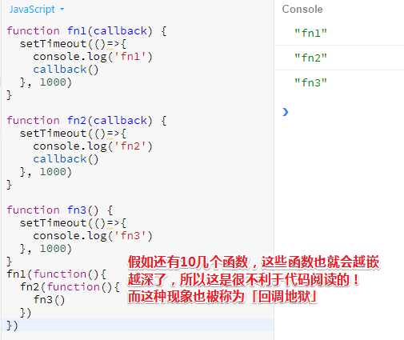

当然，这种callback写法，也是常见的我们去处理异步函数的一种写法！

能否换一种写法？我们不想要下面这种调用姿势了：

```js
fn1(function(){
  fn2(function(){
    fn3()
  })
})
```

可以，引入Promise即可！

### ◇什么是Promise

在讲解这个家伙之前，先聊聊「预案」的概念，预案就是balabala……还是举例子吧！

老板说「下班之前把项目给上线了，就奖励1000块，如果没有搞定就扣500块……」，老板根据项目是否上线制定了两个预案，一个是`+1000`，一个`-500`

言归正传，到底什么是Promise呢？——它是一个函数，当然它也是一个对象，这个对象有个属性存储了它此刻的状态，默认的状态为**等待态(Pending）**……

那么如何才能让它发生状态变化呢？——这个就得跟随其内部的执行情况而转化了，至于转化的结果要么是**完成态(Fulfilled)**、要么是**拒绝态(Rejected)**，换句话说就是选择哪个预案的问题！白话一点就是，成功调哪个函数，失败调哪个函数

一旦Promise启动之后，如果异步任务成功完成，那么就让其状态从 pending 变成 fullfilled ，然后自动执行 resolve；反之就从 pending 变成 rejected，然后自动执行 reject……

进一步了解：[Promise 对象 - ECMAScript 6入门](http://es6.ruanyifeng.com/#docs/promise)

### ◇Promise范例

#### AJAX请求——getIp

> 接下来通过结合代码让你来加深刚刚对Promise的理解！

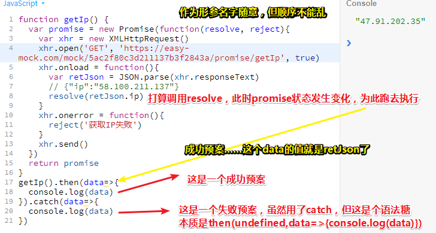

当我们调用resolve的时候，此时的Promise实例里面的状态就会发生改变，即从pending变为fulfilled！既然状态改变了，那就会调用`promise.then(s1,e1)`中的s1……其中s1里的参数就是resolve(xxx)里的xxx！

> 我在想这个resolve到底是不是指向then的第一个参数？还是说是这样的：
>
> ```js
> //resolve是异步执行的……可能是有个onResolvedChange之类的事件，然后这个resolve是个回调
> function resolve(xxx) {
>     promise.statues = 'resolved'
>     promise.value = xxx
> }
> ……
> //可能监听resolved状态，然后执行成功预案之类的……
> //then
> function then(s1,e1) {
>     ……
>     promise.onPendingChange = function() {
>          if(promise.statues === 'resolved') {
>     		s1.call(undefined,promise.value)
>     	} else {
>             e1.call(undefined,promise.value)
>     	}
>     }
>     ……
> }
> ```
>
> 此刻我还是打算停留在使用阶段好了，其原理暂且不要去深究……

之前可能存在的误区：

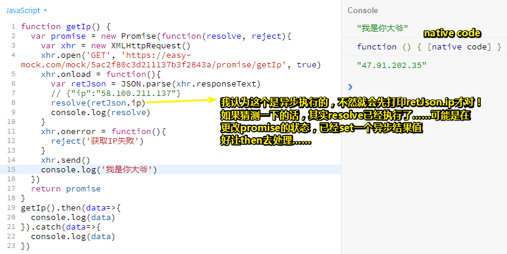

总之，这似乎与任务队列相关……

➹：[你真的会使用XMLHttpRequest吗？ - WEB前端路上踩过的坑儿 - SegmentFault 思否](https://segmentfault.com/a/1190000004322487)

➹：[Easy Mock](https://easy-mock.com/docs)

话说今天的主题是什么？——弄清楚Promise是什么？其内部原理？以及它的用法？

#### 观察状态的变化

向resolve(xxx)添加个延时函数即可

> 新的mock数据API：http://rap2api.taobao.org/app/mock/124878/example/1547900417643

```js
……
setTimeout(()=>{
    resolve(retJson.ip)
} , 5000)
……
//调用姿势：
var promise = getIp().then(data=>{
    console.log(data)
    console.log(promise)
}
).catch(data=>{
    console.log(data)
}
)
console.log(promise)
```

我们5s之后再resolve，为此就有足够的时间去观察promise的状态变化

> 如果不写个延时的话，基本上很难观测到这种变化！从这可以看出resolve是执行了的，因为执行上面最后一行代码的时候已经是resolved状态了！接着才执行成功回调！

结果：

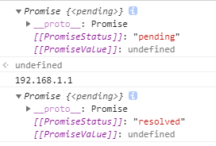

promise这个对象一开始是pending状态，之后就变为resolved状态！

这个 有两个中括号的家伙`[[PromiseStatus]]`表示你不能随便用，总之你只能看，不能通过 `promise.[[PromiseStatus]]`这种方式去读取

➹：[Promise的内部变量 - SegmentFault 思否](https://segmentfault.com/q/1010000010670739)

#### 假设有多个then

场景类似于「今晚项目上线的话，不单只给你1000奖金，还给你放两天假」，两个成功预案接连发生……

```js
var promise = getIp().then(data=>{
    console.log(data)
    console.log(promise)
}).then(()=>{
    console.log('给你放两天假！')
}).catch(data=>{
    console.log(data)
})
```

#### 对比

我并咩有看到这种加了then、catch的做法……比那种还没有走向回调地狱的那种做法有优势呀！

如果请求比较多或者是异步操作比较多，而且还需要一定的条件，那么它的优势就出现了！

举例来说：我们想要得到一个某个城市的天气，那么首先得获取ip，获取了ip就意味着获取了城市，知道了城市，也就知道了天气，总之就是我们的请求是一个接一个的，是有顺序之分的……即后面的数据是根据前面的数据才有的！

```js
getIp().then(function(ip){
  return getCityFromIp(ip)
}).then(function(city){
  return getWeatherFromCity(city)
}).then(function(data){
  console.log(data)
}).catch(function(e){
  console.log('出现了错误', e)
})
```

在这里写了3个成功预案，第一个预案是给getIp所返的Promise对象而服务的，其它的如此类推，这给人的感觉就像是每次都是在处理一个异步，一个回调……

至于catch，只要有一步出错了，都会走到这儿……

除此之外，我们还可以继续添加更多异步任务，如根据天气获取穿啥衣服的建议等等……用代码来表示的话，就是添加个return，添加个then，然后添加个成功预案……形式上就是从上到下一步步写就好了

而以前那种姿势则是从外往内一层层去写……

总之使用了Promise，我们就换了一种书写方式……而这种方式显然更清爽，更利于我们阅读……

我们可以看一下请求的时序，即数据到了才发下一个ajax请求：

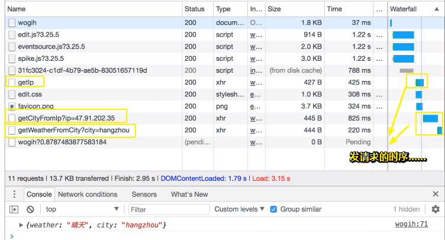

#### 最终代码

```js
function getIp() {
  var promise = new Promise(function(resolve, reject){
    var xhr = new XMLHttpRequest()
    xhr.open('GET', 'https://easy-mock.com/mock/5ac2f80c3d211137b3f2843a/promise/getIp', true)
    xhr.onload = function(){
      var retJson = JSON.parse(xhr.responseText)  // {"ip":"58.100.211.137"}
      resolve(retJson.ip)
    }
    xhr.onerror = function(){
      reject('获取IP失败')
    }
    xhr.send()
  })
  return promise
}

function getCityFromIp(ip) {
  var promise = new Promise(function(resolve, reject){
    var xhr = new XMLHttpRequest()
    xhr.open('GET', 'https://easy-mock.com/mock/5ac2f80c3d211137b3f2843a/promise/getCityFromIp?ip='+ip, true)
    xhr.onload = function(){
      var retJson = JSON.parse(xhr.responseText)  // {"city": "hangzhou","ip": "23.45.12.34"}
      resolve(retJson.city)
    }
    xhr.onerror = function(){
      reject('获取city失败')
    }
    xhr.send()
  })
  return promise
}
function getWeatherFromCity(city) {
  var promise = new Promise(function(resolve, reject){
    var xhr = new XMLHttpRequest()
    xhr.open('GET', 'https://easy-mock.com/mock/5ac2f80c3d211137b3f2843a/promise/getWeatherFromCity?city='+city, true)
    xhr.onload = function(){
      var retJson = JSON.parse(xhr.responseText)   //{"weather": "晴天","city": "beijing"}
      resolve(retJson)
    }
    xhr.onerror = function(){
      reject('获取天气失败')
    }
    xhr.send()
  })
  return promise
}

getIp().then(function(ip){
  return getCityFromIp(ip)
}).then(function(city){
  return getWeatherFromCity(city)
}).then(function(data){
  console.log(data)
}).catch(function(e){
  console.log('出现了错误', e)
})
```

我们可以看到请求参数很重要，其参数值一般都是上一个成功预案的promise对象的resolve参数值！

#### 假设出错呢？

模拟错误：把第二个请求的域名改成一个不存在的域名就好了……

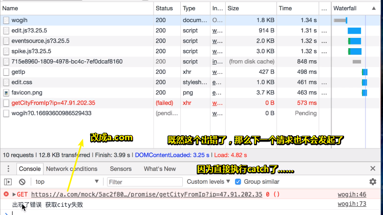

错误原因，就是reject的参数值！

在错误处理上，使用Promise相比我们之前的回调要简单的多！毕竟以前的那种姿势，每一个异步请求都要写一个关于失败的预案，如果有3个请求那就得必须写3个error了，这样一叠加起来就显得特别烦了！而Promise，就在最后一个then的后面写一个catch就好了，所以写3次好还是写1次好？只要不是傻的，都会选择写1次！

#### 小结

1. 如果能明白上面所说的两种方法，那么对于日常生活中的使用也就足够了！

接下来将会对一些特殊情况进行讲解——主要看看如何去用

#### 补充

Promise实例的原型上还有个finally方法，那么它是什么呢？——就是不管成功还是失败，只要状态从pending变为resolved或者rejected，它都会去执行这个finally方法里面的预案，不过一般情况下我们用不到，用到的时候你知道它是怎么执行的就行了……

注意：这个是最后执行的，而不是执行了一个then就会执行了一个finally，而是多个then结束了，最后才会执行它！

### ◇特殊场景使用

#### Promise.all

举个例子：目前有多个异步请求，我想要得到的结果是什么呢？——当所有的异步请求操作都ok之后，我想拿到一个总结果！

如：目前我们前端需要3个接口，然后后端就提供了3个接口，分别是小明的家庭详细、工作信息、兴趣爱好……

我们获取小明的三个不同信息分别是三个不同的接口！

那么我问题来了，我想要一个总数据，即把这三个数据打包起来后的数据，你说怎么办？具体代码就是，一个大的数据有3个属性

由于请求发出的时机是不一样，那么导致处理成功预案的时机也是不一样的！所以说把这三个数据拼装起来一个，然后等所有成功回调执行之后才得到总数据，然后再干其它的，显然这很难干！

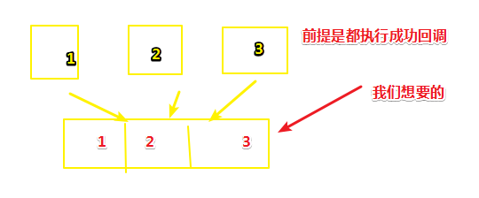

为此Promise.all这个API的用武之地就出来了！

它是什么呢？——如果你了解过JavaScript基于原型的面向对象的话，显然你是很容易理解它是什么的。它就是Promise这个构造函数原型上的一个方法，之前的then也是，这就是为什么Promise实例能访问到then……

> all是个静态方法额，只能被Promise这个构造函数调用，其实例是不行的，你看一下下面这个测试你就知道了：
>
> [②](#er)

它的用法：

```js
//Promise.all, 当所有的 Promise 对象都完成后再执行
Promise.all([p1, p2, p3]).then(data=>{
  console.log(data)
})
```

需要传递一个参数，这个参数是一个可遍历的对象，目前来说你可以认为它是一个数组，这个数组里的每一个元素都是一个Promise对象！

那么它会干嘛呢？——它会等到所有的Promise对象全都resolve之后，然后把resolve的东西组装成一个数据，而这个数据就是data啦！

> all即是全部，当全部的Promise对象都resolve之后，然后把resolve之后的东西都给拼起来、打包起来，最后的大包裹就是我们想要的data啦！

测试代码：

```js
function getCityFromIp(ip) {
  var promise = new Promise(function(resolve, reject){
    var xhr = new XMLHttpRequest()
    xhr.open('GET', 'https://easy-mock.com/mock/5ac2f80c3d211137b3f2843a/promise/getCityFromIp?ip='+ip, true)
    xhr.onload = function(){
      var retJson = JSON.parse(xhr.responseText)  // {"city": "hangzhou","ip": "23.45.12.34"}
      resolve(retJson)
    }
    xhr.onerror = function(){
      reject('获取city失败')
    }
    xhr.send()
  })
  return promise
}

var p1 = getCityFromIp('10.10.10.1')
var p2 = getCityFromIp('10.10.10.2')
var p3 = getCityFromIp('10.10.10.3')

//Promise.all, 当所有的 Promise 对象都完成后再执行
Promise.all([p1, p2, p3]).then(data=>{
  console.log(data)
})
```

我们声明了3个变量，它的值是Promise对象，意味着已经发了3个请求了，只不过Promise对象此刻的状态还没有发生改变！

而这个代码：

```js
Promise.all([p1, p2, p3])
```

表示，三个Promise对象都从pending态变为 fulfilled状态或者说是resolved状态以后，就执行接下来的成功预案

> all的操作有点轮询的味道……

关于接下来的data，其实它是一个数组哈！

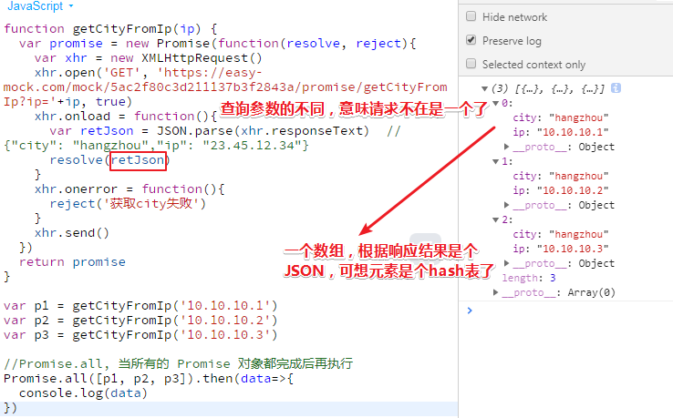

看一下网络资源的加载情况：


➹：[测量资源加载时间  -  Tools for Web Developers  -  Google Developers](https://developers.google.com/web/tools/chrome-devtools/network-performance/resource-loading?hl=zh-cn)

小结：

如果以后有这样的需求，就记得用`Promise.all()`吧！

再举个例子加深一下印象：

一个班有三位同学和老师，老师说「如果你们三今天考试都及格，那么明天就放假，如果存在一个同学不及格，那明天就补课啦」

```js
Promise.all（[小明，小李，小孙]）.all((data)=>{
	console.log(data) //[{name:'小明'，say:'老师我及格啦！'}……]
    console.log('明天放假！')
}).catch((data)=>{
    console.log('明天补课！！！')
})
```

#### Promise.race

用法跟all差不多，race顾名思义即竞赛，谁先得第一，奖牌就是谁的！

```js
function getCityFromIp(ip) {
  var promise = new Promise(function(resolve, reject){
    var xhr = new XMLHttpRequest()
    xhr.open('GET', 'https://easy-mock.com/mock/5ac2f80c3d211137b3f2843a/promise/getCityFromIp?ip='+ip, true)
    xhr.onload = function(){
      var retJson = JSON.parse(xhr.responseText)  // {"city": "hangzhou","ip": "23.45.12.34"}
      resolve(retJson)
    }
    xhr.onerror = function(){
      reject('获取city失败')
    }
    setTimeout(()=>{
      xhr.send()
    }, Math.random()*1000)

  })
  return promise
}

var p1 = getCityFromIp('10.10.10.1')
var p2 = getCityFromIp('10.10.10.2')
var p3 = getCityFromIp('10.10.10.3')

//Promise.all, 当所有的 Promise 对象都完成后再执行
Promise.race([p1, p2, p3]).then(data=>{
  console.log(data)
})
```

我们发了3个请求，哪个请求先resolved，那么就先执行成功预案了……同时这也意味着我们并不需要其它数据了

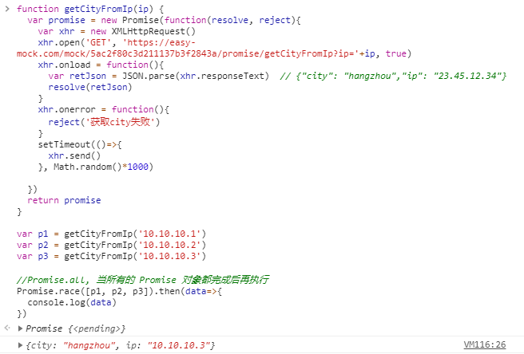

模拟一个错误的：

```js
function getIp() {
  var promise = new Promise(function(resolve, reject){
    var xhr = new XMLHttpRequest()
    xhr.open('GET', 'https://easy-mock.com/mock/5ac2f80c3d211137b3f2843a/promise/getIp', true)
    xhr.onload = function(){
      var retJson = JSON.parse(xhr.responseText)  // {"ip":"58.100.211.137"}
      resolve(retJson.ip)
    }
    xhr.onerror = function(){
      reject('获取IP失败')
    }
    xhr.send()
  })
  return promise
}
function getCityFromIp(ip) {
  var promise = new Promise(function(resolve, reject){
    var xhr = new XMLHttpRequest()
    xhr.open('GET', 'https://easy-moc.com/mock/5ac2f80c3d211137b3f2843a/promise/getCityFromIp?p='+ip, true)
    xhr.onload = function(){
      var retJson = JSON.parse(xhr.responseText)  // {"city": "hangzhou","ip": "23.45.12.34"}
      resolve(retJson)
    }
    xhr.onerror = function(){
      reject('获取city失败')
    }
    xhr.send()
  })
  return promise
}

var p1 = getIp()
var p2 = getIp()
var p3 = getCityFromIp('10.10.10.3')

//Promise.all, 当所有的 Promise 对象都完成后再执行
Promise.race([p1, p2, p3]).then(data=>{
  console.log(data)
}).catch((data)=>{
  console.log(data)
}).finally(()=>{
  console.log('我执行了')
})
```

结果：

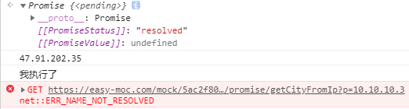

那如果先错误呢（存在一个错误）？即我先发错误请求，让`getCityFromIp('10.10.10.3')`先执行，结果同上！话说，这是在容错吗？只要一个家伙ok，就有结果了！就像是3个人在跑1500米，只要有一个人跑到终点，那么这场比赛就结束了……

那如果全错呢？——把它们的请求url的域名改一下就好了，结果：

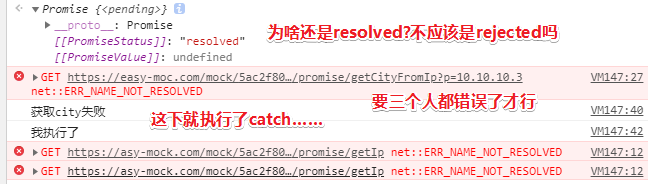

这就像是，3个都无法冲刺，如跑着跑着……跑道就莫名其妙的塌陷了，导致比赛无法顺利进行了。所以就执行了失败预案……比如「明天换个跑道继续跑」

### ◇改进回调地狱

> 写久了你就知道怎么写了，而且也不用去问什么了！虽然这像是架着一个空壳子，但胜在能用！

直接封装成Promise就好了

```js
function fn1() {
  return new Promise((resolve, reject)=>{
    setTimeout(()=>{
      console.log('fn1...')
      resolve()
    }, 1000)    
  })
}

function fn2() {
  return new Promise((resolve, reject)=>{
    setTimeout(()=>{
      console.log('fn2...')
      resolve()
    }, 1000)    
  })
}

function fn3() {
  return new Promise((resolve, reject)=>{
    setTimeout(()=>{
      console.log('fn3...')
      resolve()
    }, 1000)    
  })
}

function onerror() {
  console.log('error')
}

fn1().then(fn2).then(fn3).catch(onerror)
```

或许你会疑问，为啥是传一个fn2，其实这跟前面是一样的……只是之前的那个需要用到前面数据的，需要才包了一层，而这个就不需要了！

之前那个：

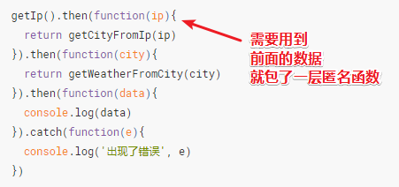

> 突然感到很奇怪，因为之前我了解到return的值是下一个then的某个预案的参数值，我们可以直接写一个字符串，既然可以写字符串，那么为啥可以继续then呢？

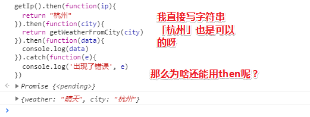

那我就打印一下这个then的返回值就好了：

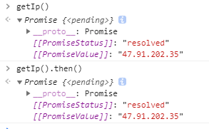

我在想难道是做了某种语法糖的包装？

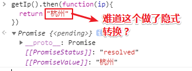

额……我想了想，then是可以接收两个预案的吧！那么它身为参数，那就好办了，我们可以return一个Promise对象那么就很合理了……

最终的猜测：

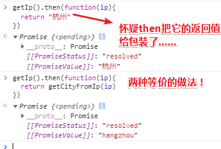

当我们继续then的时候，显然根据状态以及值，可以判断执行哪个预案，并传什么参数给它了！

那么如何做才能拿到一个rejected态呢？

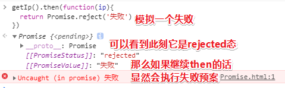

小结：

1. then的返回值为Promise实例

2. then其中一个预案的返回值可以是直接的字符串结果，或者是常见的把JSON数据转化为普通对象的对象！

   如果是Promise对象的话，那么就在再好不过了，毕竟不用去包装了……

3. 每次在then之前，先看看Promised的状态，以及其Value，然后再去then……

4. 封装一层的那种做法比较好，因为可以改写数据给下一个then……如果自顶向不涉及到对数据的依赖，那就不用封装了，直接写就好了……

### ◇扩展

去MDN看看我们的讲解是否有遗漏！同时也要去看看其它的教程做个对照，这样的话你才能对Promise有个真正了解！然后下次你在写代码的时候尝试着去使用它就好了！

一幅图：


还有两个立即更改状态的静态方法：

- [`Promise.reject(reason)`](https://developer.mozilla.org/zh-CN/docs/Web/JavaScript/Reference/Global_Objects/Promise/reject)
- [`Promise.resolve(value)`](https://developer.mozilla.org/zh-CN/docs/Web/JavaScript/Reference/Global_Objects/Promise/resolve)

➹：[Promise - MDN](https://developer.mozilla.org/zh-CN/docs/Web/JavaScript/Reference/Global_Objects/Promise)

---

## ★Promise答疑

**①catch一定要跟在then后面吗？**

一般都是这个样子的！因为如果你不这样做的话，即放在中间的话，像这样：

```js
getIp().then(s1).catch(e1).then(s2).then(s3)……
```

那么catch只能处理s1的异常了……

那么假如s2出错了呢？那就无法再次catch了，所以一般都会放在后面。如果你非要智障，非要放在前面，那你就为每个then都搞一个失败预案吧！

总之放在最后的catch就是个公因子，即每个promise对象的一个公因子了！（把一个Promise对象当作是一个整数）

简单来说，出现任何报错就立即到catch……

**②promise里多个读取文件也是异步的吗？**

你之所以用promise就是因为有异步操作才用的promise，不用promise的话，那我就有可能用回调函啦，如果不是异步的是同步的，那就用同步函数从上到下依次执行就好了，这样就没什么必要用promise了！毕竟可以直接result……

**③promise怎么返回一个值呢？比如`const a = getData().then(res => {return res})`这样，这里的a是一个promise对象，那么怎么让a是return的res值呢？**

这个可不能做到哈！除非用到await等之类的其它的语法……目前我先不管它！此刻我们只能在回调函数里面处理这个res，即只能在回调函数处理业务逻辑！

如果非要拿到这个res值，那么后面会有对应的写法做到，但这种写法本质上是和这种（promise.then()……）类似的！

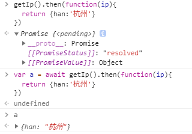


**③概括一下Promise？**

Promise一般是用于处理异步的！让异步换一种写法，然后解决多层嵌套的问题，然后变成上下级联的关系！

**④各种异步的写法？**

➹： [callback/Promise/Generator/async/await · 饥人谷课件](http://book.jirengu.com/fe/%E5%89%8D%E7%AB%AF%E8%BF%9B%E9%98%B6/%E5%BC%82%E6%AD%A5/%E5%90%84%E7%A7%8D%E5%BC%82%E6%AD%A5.html)

**⑤异步和回调的区别是什么？**

它们本来就不是一个东西，所以谈何区别？就像是在问纸巾和豆腐的区别的是什么？

你首先应该问一下「异步是什么？」，在此之前先来分析一下关于同步、异步、回调之间的关系，其实一句话就能概括「异步和同步是相对应的！回调是用于处理异步的！」

那么什么是同步呢？——一个一个地执行，不能边敲代码边刷牙，比如吃完晚饭后敲代码，代码敲完后，刷牙，上床，睡觉……总之特点就是「等、卡住……」好了，这就是同步的执行方式了

那么异步是什么呢？——举个现实中的场景就是，去客栈吃饭，「小二，来5斤牛肉、一瓶女儿红……」、「好的，客官前稍等……」，此时你可以干其它事，比如调戏隔壁桌上的妇人……这个点菜到上菜的过程就是异步的……如果是同步的话，那么你只能等到菜上好了，你才能去调戏隔壁桌的妇人，不过，我想这时妇人早就吃完了然后走了……

那么回调呢？——就在来点菜的时候，并告只小二「菜炒好了，就送到隔壁桌子上，我要和妇人一起吃，就是这么不要脸……」这个放到隔壁桌就是回调啦！而且这个回调，还没有发生，也就是说它相当于是个预案……可见这样做对于程序来说，性能就好很多了！

总之，回调就是安排，安排老板菜炒好了就送到隔壁桌子上！文绉绉一点就是「回调就是处理异步返回值的方式」

总之，你要理解同步和异步这两种不同的机制！

**⑥预案？**

事情还没有发生，但是我会事先告诉你「如果发生了我会怎么办？」，难听点就是你立了份遗嘱，然后万一GG了，就按遗嘱所说的做！

**⑦每日一题「写一个耗时函数」**

> 每天做一道题挺好的，积少成多，等到面试的时候你就很强了！

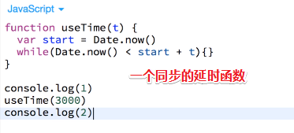

3s后才打印2……

如果写异步的话，那就加callback或者promise吧！

callback：

```js
function useTime(time,callback) {
  setTimeout(()=>{
    callback()
  },time*1000)
}
console.log(1)
useTime(3,()=>{
  console.log(2)
})
```

promise：

```js
function useTime(time,value) {
  return new Promise((resolve,reject)=>{
    setTimeout(()=>{
      resolve(value)
    },time*1000)
  })
}
console.log(1)
useTime(3,2).then((value)=>{
   console.log(value)
})
```

在这里我强制给了一个值……之前的异步请求，通过xhr对象会自动得到一个值……

---

## ★总结

- 如果我继续按照这样的效率看视频的话，显然是不行的！我得对视频中所讲的每一个小点都得按自己的理解一遍后，才记笔记，如果不理解就多看几遍，总之下笔需理解，而不是说一句话就写一句话……还有就是关于信噪比的问题，你得明确哪些是噪音，即无用信息……

  对了，还有一个就是，反复的内容尽可能少记，不会的内容就多记！

- 就只写一个catch就好了，不用在写成功预案的同时，把失败预案也给写上！

## ★Q&A

### ①使用在线的mock，经常会出现500错误？

➹：[通过设置chrome浏览器解决跨域问题，在本地进行开发工作 - 哭个六 - 博客园](https://www.cnblogs.com/kugeliu/p/6566462.html)

### <a id="er">②测试结果</a>

简单的一个Promise实例：

```js
function fn() {
	return new Promise((resolve,reject)=>{
		setTimeout(()=>{resolve('apple')},3000)
	})
}
var p = fn()
```

测试结果：

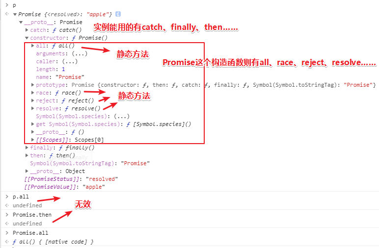

### ③老师的书签栏


