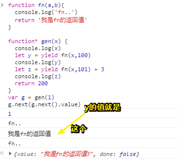

# 异步的各种写法:回调、Promise、异步模块、await/async（上）

## ★课程简介

> 若愚老师主讲：《异步的各种写法:回调、Promise、异步模块、await/async》

资料：

➹：[callback/Promise/Generator/async/await · 饥人谷课件](http://book.jirengu.com/fe/%E5%89%8D%E7%AB%AF%E8%BF%9B%E9%98%B6/%E5%BC%82%E6%AD%A5/%E5%90%84%E7%A7%8D%E5%BC%82%E6%AD%A5.html)

## ★回调函数与Promise

### ◇这节课讲什么？

在前端里面，我们常见的异步有几种方式呢？（不单只包括浏览器端，还包括node端）

大概会有5种，分别是：

1. 简单的callback（回调）
2. 对一种进行的该进——Promise
3. 一种新的语法——ES6的Generator
4. 一些现成的模块，即别人封装好的模块，这些模块不是原生的，不像Promise，还是ES6里面其它的如Generator之类的是原生的。总之它就是别人封装好的，我们需要用的时候可以去import、require它，当然，相应的模块还有很多，不单只有这个`co` 模块！
5. ES2017（ES8）的语法——async和await

接下来，我们将会看到这5种异步分别是怎样写的？以及明白为啥有了一种之后，还有第二种、第三种……

### ◇回调

这个例子是针对node端的！

需求：

- 读取 a.md 文件，得到内容
- 把内容转换成 HTML 字符串
- 把HTML 字符串写入 b.html

这个过程在node端该如何实现呢？

```js
var fs = require('fs')
var markdown = require( "markdown" ).markdown
fs.readFile('a.md','utf-8', function(err, str){
  if(err){
    return console.log(err)
  }
  var html = markdown.toHTML(str)
  fs.writeFile('b.html', html, function(err){
    if(err){
      return console.log(err)
    }
    console.log('write success')
  })
})
```

> 在 Node.js 模块系统中，每个文件都视为独立的模块。而require()用于引入（import）模块、JSON 文件、或本地模块。 可以引入 `node_modules` 中的模块。
>
> 在上面这个demo中我们引入了文件系统模块，然后调用它的两个异步API，并分别添加两个回调！此时这两个回调就形成了嵌套姿势……如果接着还要搞点什么幺儿子的异步操作，那么又得继续嵌套，最后十八层地狱……
>
> ➹：[fs - Node.js API 文档](http://nodejs.cn/api/fs.html)

既然在 Node 环境下执行，那我们就尽量多使用 ES6的语法，比如`let`、`const`、`箭头函数`，上述代码改写如下：

```js
const fs = require('fs')
const markdown = require( "markdown" ).markdown
fs.readFile('a.md','utf-8', (err, str)=>{
  if(err){
    return console.log(err)
  }
  let html = markdown.toHTML(str)

  fs.writeFile('b.html', html, (err)=>{
    if(err){
      return console.log(err)
    }
    console.log('write success')
  })
})
```

看起来还不错哦，那是因为我们的回调只有两层，如果是七层、十层呢？这不是开玩笑

### ◇Promise

#### 概括

关于 Promise 规范大家可以参考阮一峰老师的[教程](http://book.jirengu.com/fe/%E5%89%8D%E7%AB%AF%E8%BF%9B%E9%98%B6/%E5%BC%82%E6%AD%A5/ECMAScript%206%E5%85%A5%E9%97%A8),这里不作赘述。

这里我们把上述代码改写为 Promise 规范的调用方式，其中文件的读写需要进行包装，调用后返回 Promise 对象

```js
const fs = require('fs')
const markdown = require( "markdown" ).markdown

readFile("a.md")
  .then((mdStr)=>{
    return markdown.toHTML(mdStr)  //返回的结果作为下个回调的参数
  }).then(html=>{
    writeFile('b.html', html)
  }).catch((e)=>{
    console.log(e)
  });

function readFile(url) {
  var promise = new Promise((resolve, reject)=>{
    fs.readFile(url,'utf-8', (err, str)=>{
      if(err){
        reject(new Error('readFile error'))
      }else{
        resolve(str)
      }
    })
  })
  return promise
}

function writeFile(url, data) {
  var promise = new Promise((resolve, reject)=>{
    fs.writeFile(url, data, (err, str)=>{
      if(err){
        reject(new Error('writeFile error'))
      }else{
        resolve()
      }
    })
  })
  return promise
}
```

上述代码把 callback 的嵌套执行改为 then 的串联执行，看起来舒服了一些。代码中我们对文件的读写函数进行了 Promise 化包装，其实可以使用一些现成的模块来做这个事情，继续改写代码

```js
const markdown = require('markdown').markdown
const fsp = require('fs-promise')   //用于把 fs 变为 promise 化，内部处理逻辑和上面的例子类似
let onerror = err=>{
  console.error('something wrong...')
}

fsp.readFile('a.md', 'utf-8')
  .then((mdStr)=>{
    return markdown.toHTML(mdStr)  //返回的结果作为下个回调的参数
  }).then(html=>{
    fsp.writeFile('b.html', html)
  }).catch(onerror);
```

代码一下子少了很多，结构清晰，但一堆的 then 看着还是碍眼...


#### 一些细节

1. 无法通过 `promise.xxx`  的姿势获取promise对象的内部状态
2. 关于`new Promise((x,y)=>{…这里的代码是同步的…})`，然后返回一个promise对象，在异步结束之前，我们可以先为promise对象设置预案了，一旦有了异步结果，改变了对象的内部状态就立即执行预案……
3. 关于之前那几个获取ip、根据ip获取城市、根据城市获取天气这个三个API，一般后端就直接给你一个API，而不会分三下给

4. 关于then的书写，最好是换一行，就像这样（好看一点，因为会越来越长）：

   ```js
   readFile("a.md")
     .then((mdStr)=>{
       return markdown.toHTML(mdStr)  //返回的结果作为下个回调的参数
     }).then(html=>{
       writeFile('b.html', html)
     }).catch((e)=>{
       console.log(e)
     });
   ```

   由于readFile返回的是Promise对象，为此我们可以级联操作回调！

5. 关于成功预案的返回值不是promise对象：

   

   then函数会返回一个Promise对象给后面用，而且是立刻去resolve()

6. 用了promise之后可以实现一个异步的级联，就像这样一直then：

   ```js
   getIp().then(function(ip){
     return getCityFromIp(ip)
   }).then(function(city){
     return getWeatherFromCity(city)
   }).then(function(data){
     console.log(data)
   }).catch(function(e){
     console.log('出现了错误', e)
   })
   ```

   这里的级联是从上到下，一层一层的，如果还有其它回调，那就继续添加相应的then就好了！而不会像我们以前一样，一层层的嵌套……

   所以使用了promise之后，对回调的可读性会更好一些！

7. Promise.all的使用场景：

   某个网站提供了很多接口供一些开发者去使用，但这个接口比较多，而现在，作为开发者的我们需要一个总的数据，这个数据需要从不同的接口中拿到，但拿到之后呢？由于请求是有先有后的，当然谁先谁后，我们是不知道的！不管怎样，反正我们只是希望得到这几个请求全都成功，然后打包之后的一个总的数据，有了这总的数据，然后我们就可以做页面渲染之类的……

   那么这个时候我们就可以调用Promise.all了……

   注意返回的数组中其元素是有相应的顺序的：

   

   总之使用all之后，就不用关心哪个异步结果先出来了！

8. 

   测试：

   

#### 小结

- 剩下的几种会稍微难一些，而Promise则是不管你是做新式的前端，如使用vue/react技术栈去做一些封装，而经常做的封装就是封装接口，那么一般的话我们会把它封装为Promise，或者是说我们用得很多别人提供的现成的模块 都返回的是Promise对象，然后你就可以直接调用then去用啦！

  如果你是做node端，就服务端的话，那基本上大部分的函数方法都是异步的，如读取文件、读写文件、网络请求以及各种各样数据库的操作都是异步的！那么一般来说我们都会把它封装成Promise

- 串联起来的then就像一串冰糖葫芦……

---

## ★generator的用法

### ◇是什么？

Generator 函数是 ES6 提供的一种异步编程解决方案，相较于对Promise理解，它会更难一点！尤其是你第一次通过看看文档接触它的时候，甚是头疼……

### ◇分析

与generator相对应的就是`*`（读作星号）函数，即星号函数！就像这样：

```js
function fn(a,b){
  console.log('fn..')
  return a + b
}

function* gen(x) {
  console.log(x)
  let y = yield fn(x,100) + 3
  console.log(y)
  return 200
}
```

多了一个星号的函数给人一种莫名其妙的即视感，虽说如此，但我们不得不接受它，所以我们还是先从形式上理解它吧！

我们可以看到上面这段代码出现了两个东西—— `*`和`yield`，这两个东西是新东西，毕竟这是我第一次所遇到的……那么这两个东西有什么用呢？

> 当你看到一个新东西的时候，请问自己下面这几句话：
>
> 1. 它是干嘛的？——`yield`是干嘛的？——用于打怪
> 2. 它有什么用？——`yield`有什么用？——打怪物的时候有buff
> 3. 它到底中间什么怎么运行的？——`yield`运行原理？——首先需要借助天地灵气，然后通过自身丹田把灵气转化为火灵气，然后催动……
>
> 我在想1、2步骤难道不是一个意思？按照自己已有的理解应该是：
>
> 1. 作用
> 2. 使用
> 3. 原理

#### 运行原理


实测：


> 其实这有点像是链表的数据结构哈！

之后我再次：

```js
console.log( g.next() )
console.log(g)
```

观测到g始终是closed态！

而它的done还是true，话说这个done的值是根据什么来判断的？难道是因为有个yield吗？

为此我就尝试了这样：

> 这似乎是一种简单的实验思维，通过实验结果，推测yield与generator函数（如它的return）的关系……

```js
function fn(a,b){
  console.log('fn..')
  return a + b
}

function* gen(x) {
  console.log(x)
  let y = yield fn(x,100) + 3
  console.log(y)
  let z = yield fn(x,101) + 3
  console.log(z)
  return 200
}
let g = gen(1)
console.log(g)
console.log( g.next() )
console.log(g)
console.log( g.next() )
console.log(g)
console.log( g.next() )
console.log(g)
console.log( g.next())
console.log( g)
```

结果：


两个yield打断了一个函数的正常运行……

一点猜测：

> generator的出现似乎可以让我们打断一个函数的执行，这意味着假如fn是个异步操作的话，那么我们可以通过yield等待这个异步结果了呀，如何拿到这个异步结果呢？通过 `g.next().value`就好了，然后就把这个值传给一个回调函数就好了
>
> 然而这样做不会阻塞callstack吗？
>
> ➹：[请教下，把yield 这个操作，单纯理解为异步变同步，是否准确？他与真正的同步代码有什么本质上区别？ - 知乎](https://www.zhihu.com/question/55423123)

### ◇回到主题，改写刚刚那个代码？

#### 代码

> 之前那个需求

```js
const fs = require('fs')
const markdown = require("markdown").markdown

function readFile(url) {
  fs.readFile(url, 'utf8', (err, str)=>{
    if(err){
      g.throw('read error');
    }else{
      g.next(str)  //line4
    }
  })
}

function writeFile(url, data) {
  fs.writeFile(url, data, (err, str)=>{
    if(err){
      //主动抛出错误，然后被catch捕获，结束next()的调用！
      g.throw('write error');
    }else{
      g.next()  //line5
    }
  })
}

let gen = function* () {
  try{
    let mdStr = yield readFile('aa.md', 'utf-8')   //line3
    console.log(mdStr)
    let html = markdown.toHTML(mdStr)
    yield fs.writeFile('b.html', html)
    //当文件写完之后再执行……
  }catch(e){
    console.log('error occur...') //line6
  }
}

let g = gen()  //line1
let result = g.next()  //line2
```

一个yield表示，你必须把其右边的代码搞定了才走下一步，如文件读好了，才做下一件事，有种同步的既视感！

以上就是generator函数的作用啦！

虽然看起来有点复杂，但它的存在让我们的代码有了翻天覆地的变化，以前需要加callback或者是Promise，而现在则是感觉像是同步的代码一样！

注意：这一步 `let mdStr = yield readFile('aa.md', 'utf-8')`执行中间存在等待的过程，但我们开发者在用的时候，感觉像是在写同步的代码的一样……这是不是在告诉我，这其实没有阻塞浏览器啊！不然就本末倒置了，因为该有的异步还是要有的……感觉yield像是把左边的代码给保存了，此时的callstack中应该没有任何代码，然后有了异步结果后就激活保存的代码！——为了强制从形式上理解它，给了一个自己理解它的理由！

不过我们上述代码的写法是有一个问题的——readFile和writeFile函数中出现了莫名其妙的g，你唯一把代码看到最后你才知道这个g是哪里的！

总之函数里面用到了全局变量，然后后面又调用它，然后就相互访问了，导致出现了很混乱的既视感，为此难以理解！就像这样：


使用generator后，整个代码执行流程串来串去的，就因为这样，即便它是新特性，在日常生活中也很少使用到它！毕竟我们使用Promise只要搞个promise对象然后then来then去就好了，而它这个就跳来跳去……

不管怎样，你至少得知道用了generator之后，它的整个流程是如何执行的！

#### 优化

优化原因：

> 虽然感觉用了更“高级”的技术，但与前面两种方法相比这种写法反而更丑陋难用。状态对象竟然在 readFile 和 writeFile 这两个普通函数里面调用...

所以我们得改造成一个干干净净的函数，没有搞得乱七八糟的全局变量嵌套其中，那么思路是？

直接用柯里化改造那两个个读写文件函数，然后把启动方式也变一下就好了！

```js
function readFile(url) {
  return (callback)=>{
    fs.readFile(url, 'utf-8', (err, str)=>{
      if(err) throw err
      callback(str)
    })
  }
}
//readFile('a.md')( (err, str)=>{ console.log(str)} ) 
//将多个参数的调用转换成单个参数的调用，回想想那些常常提到的概念，如闭包、函数柯里化


function writeFile(url, data){
  return (callback)=>{
    fs.writeFile(url, data, (err, str)=>{
      if(err) throw err
      callback()
    })
  }
}
// writeFile('b.html')( (err)=>{console.log('write ok')} )

let gen = function* () {
  try{
    let mdStr = yield readFile('a.md', 'utf-8') //line4
    let html = markdown.toHTML(mdStr)
    yield writeFile('b.html', html)
  }catch(e){
    console.log('error occur...')
  }
}

let g = gen()   //line1
//g.next().value()执行的是readFile('a.md', 'utf-8')所返回的匿名函数
g.next().value(str=>{    //line2
  g.next(str).value(()=>{  //line3
    console.log('write success')
  })
})
```

执行过程：

1. line1: 执行Generator，创建一个状态对象，此时函数内部并没有执行,此时状态对象`{value:undefined, done: false}`
2. lin2：开始执行Generator，开始readFile，然后遇到了yield就暂停执行下面的代码了，知道readFile执行完毕，readFile返回一个匿名函数，它是g.next.value的值，但我们g.next.value()的时候就在调用这个匿名函数了，并且传入了一个callback，可以说这个匿名函数就是我们所定义的一个高阶函数，匿名函数开始读文件，如果没有错误，那就执行callback吧！然后把读文件的异步结果传给它作为参数
3. lin3：打破暂停，开始把next的参数值当作是暂停之前 `yield readFile('a.md', 'utf-8')`的返回值，即我们拿到了异步结果mdStr，处理这个异步结果把它转化成HTML文件，处理 `yield writeFile('b.html', html)`这个，然后返回一个 `{value:匿名函数地址，done:false}`，拿到这个地址然后调用它，并出传入一个回调，等文件写好后就调用它

如果你继续next的话，那么g.next()所返回的结果中done值就是true了，因为generator函数已经return了！

> value属性：它是一个值，访问这个值的时候默认会调用toString哈！
>
> 
>
> 就像这样：上面那个截图中 `g.next.value`少了个括号，即应该为 `g.next().value`
>
> 

虽然代码看起来特别绕，但是这两个函数里面终于没有全局变量了！

回过头来看，虽然业务代码（generator这个函数里面的代码）没有嵌套，但是为了启动我们的业务代码，本身就出现了这种类似的嵌套！就像这样：

```js
let g = gen()   //line1
g.next().value(str=>{    //line2
  g.next(str).value(()=>{  //line3
    console.log('write success')
  })
})
```

所以继续优化：

> 让Generator自动调用，知道状态变为done，原理大家自己好好想想

```js
//这个代码的存在就不需要我们再用之前的方式启动generator了！直接run(gen)就好了
function run(fn) {
  let gen = fn()
  //data不传默认undefined
  //这个函数执行类似于一个循环，当状态变为done，循环就停止掉了！停止掉了意味着gen里的代码也就执行完了！
  function next(data) {
    let result = gen.next(data)
    //递归结束条件
    if (result.done) return
    console.log(result.value)
    result.value(next)
  }
  next()
}

run(gen)
//这个run就像下面这样：
gen.next(data).value(data=>{
    gen.next(data).value(data=>{
       	//gen.next(data).done === true，关键在于yield的个数
        if(true) return……
    })
})
```

根据done是true还是false判断这个generator这个函数是否运行完毕，即return了！它的callStack：


感觉这种代码好难理解，因为又是用到了递归！当然，你静下心来，仔细去看，就能慢慢理解它了——不过我再也不想用 Generator 了，因为这真TM绕……

### ◇小结

下一节课讲解现成的模块、别人做的封装以及ES2017里面的async/await


---

## ★总结

- 看视频的姿势：

  1. 不要把老师所讲的所有话给记下来，而是记那些如方法论、很难理解的、一些概念啊等等，总之主要是记你理解过后用自己的话组织起来的内容，而不是照搬全抄

     还有谨记一个原则：已经理解的内容就不要记了，主要是记你不理解的！

  2. 理解后就要用出来，用到项目中去！当你在学习某个知识点时候，你就多想想它的应用场景！


---

## ★Q&A

### ①什么叫级联？

把二个以上的设备通过某种方式连接起来，能起到扩容的效果就是级联？

每个元件都是头尾衔接就叫级联？

```js
new Promise((x,y)=>{}).then(s1).then(s2).catch(e)……
```

➹：[什么叫‘级联’？_百度知道](https://zhidao.baidu.com/question/10706142.html?qbl=relate_question_0)

