# 异步的各种写法:回调、Promise、异步模块、await/async（下）

## ★回顾

从callback这种嵌套调用，到promise这种then、then……的平级调用、再到绕来绕去的Generator，虽然如此，但其好处是让我们的业务代码清晰明了，如明明是一个异步操作，但给人的感觉就像同步一样，如之前的读一个文件，然后得到结果，再输出结果，然后做处理，写文件：

```js
let gen = function* () {
  try{
    //下面这个核心代码，给人感觉像是同步代码一样，这就是使用generator的价值所在了！不过启动generator的代码可读性不太友好！
    let mdStr = yield readFile('aa.md', 'utf-8')   //line3
    console.log(mdStr)
    let html = markdown.toHTML(mdStr)
    yield fs.writeFile('b.html', html)
  }catch(e){
    console.log('error occur...') //line6
  }
}
```

## ★co 模块

不是JS里面现有的东西，像是Promise、Generator等都是JS现有的！而它则是别人封装好的一些模块（package）

我们可以在npmjs.com里面搜索到很多跟异步相关的package！

常见的有：

1. [co](https://www.npmjs.com/package/co)
2. [async](https://www.npmjs.com/package/async)，这个可不是ES2017里面原生的语法，而是一个package，即别人封装好的一个包
3. [bluebird（蓝知更鸟）](https://www.npmjs.com/package/bluebird)

这些东西功能都差不多，只不过语法层面不太一样！

举个例子来说，如co

> 关于这些异步模块有很多，我们到底要用哪一个，需要看它的一周下载量，下载量高的，意味着这个包有更多人用，所以你也可以跟着去用，毕竟用得多意味着它出问题概率更少。不过我认为这不排除是马太效应的结果！
>
> ➹：[什么是马太效应？ - 知乎](https://www.zhihu.com/question/21509110)

co 模块是用于处理异步的一个node包，用于 Generator 函数的自动执行。[NPM 地址](http://book.jirengu.com/fe/%E5%89%8D%E7%AB%AF%E8%BF%9B%E9%98%B6/%E5%BC%82%E6%AD%A5/co),模块内部原理可[参考这里](http://book.jirengu.com/fe/%E5%89%8D%E7%AB%AF%E8%BF%9B%E9%98%B6/%E5%BC%82%E6%AD%A5/ECMAScript%206%E5%85%A5%E9%97%A8-%E6%A8%A1%E5%9D%97), 本质上就是 Promise 和 Generator 的结合，和我们上个范例还是很像的。

```js
const fs = require('fs')
const markdown = require('markdown').markdown
const co = require('co')
const thunkify = require('thunkify')

let readFile = thunkify(fs.readFile)
let writeFile = thunkify(fs.writeFile)
let onerror = err=>{
  console.error('something wrong...')
}

let gen = function* () {
    let mdStr = yield readFile('a.md', 'utf-8')
    let html = markdown.toHTML(mdStr)
    yield writeFile('b.html', html)
}

co(gen).catch(onerror)
```

例子中 thunkify模块用于把一个函数thunk化，也就是我们上例中如下形式对异步函数进行包装。gen 的启动由 `co(gen)`来开启，和我们上一个范例类似

```javascript
//thunkify的作用类似于下面这个：代码虽然不多，但很绕……之前接触过curry函数，反正这些函数都难阅读！
function writeFile(url, data){
  return (callback)=>{
    fs.writeFile(url, data, (err, str)=>{
      if(err) throw err
      callback()
    })
  }
}
```

就像回到了男耕女织的田园生活，感觉世界一下子清爽了许多。

## ★async模块

用的时候直接去看它的文档即可！

➹：[Home - Documentation](https://caolan.github.io/async/)

这里面有很多很多的方法，直接根据这个文档去用即可！

常用的方法有：

1. 串联的：有一些异步请求可以一个一个串联去执行，叫series
2. 也可以去map，把多个异步请求的结果变成一个总的结果！相当于是Promise.all()这么一个东西
3. 还有every，每一个都去执行，each也是如此！
4. ……

## ★bluebird模块

也是类似的做法，即看对应的文档即可！

## ★async/await

ES2017 标准引入了 async 函数，用于更方便的处理异步。 这个特性太新了，真要用需要babel来转码变成ES5的写法。甚至nodejs也有可能不支持！总之babel在手，天下我有！

```js
const markdown = require('markdown').markdown
const fsp = require('fs-promise')
let onerror = err=>{
  console.error('something wrong...')
}

async function start () {
    let mdStr = await fsp.readFile('a.md', 'utf-8')
    let html = markdown.toHTML(mdStr)
    await fsp.writeFile('b.html', html)
}
//start()返回的是Promise对象，类似于gen().next()操作，同generator一样，会根据await的个数，切换状态，即Promise对象的状态是会在执行这个start函数的过程中切换状态，以及其中所存储的值即传给预案（回调）的参数也会发生变化
start().catch(onerror)
```

> 上面这个代码更多的细节[①](#yi)

这个语法跟我们之前的Generator语法很像，`yield`换成了`await`，`*`换成了`async`

这里的fsp是把一个东西变成一个Promise对象，它就是把一个内置模块给Promise化了！就像我们之前写的这样：

```js
function readFile(url) {
  var promise = new Promise((resolve, reject)=>{
    fs.readFile(url,'utf-8', (err, str)=>{
      if(err){
        reject(new Error('readFile error'))
      }else{
        resolve(str)
      }
    })
  })
  return promise
}
```

> 突然发觉这些变化都是一个形式上的变化

小结：

1. 使用async/await的话，需要把异步操作给Promise化，即 `let mdStr = await fsp.readFile('a.md', 'utf-8')`中的 `fsp.readFile('a.md', 'utf-8')`必须返回的是Promise对象才行！由于得到是一个Promise对象，那么我们就能直接这样 `start().catch(onerror)`了，类似于之前的 `gen().next()`这样……一旦哪个异步操作里面reject了，就可以直接catch了
2. 关于语法：async和await，写函数的时候，第一个先在函数外面async，然后再在函数里面写await

引入async/await的话，当我们写异步的代码的时候，就感觉像同步的代码一样，如首先去读文件，读完之后就赋值给mdStr，然后处理这个mdStr，把处理结果赋值给html，然后再去写文件，写完之后，下面还能干其它的事情：

```js
async function start () {
    //类似于在gen启动时的gen().next().value，也就是异步操作所返回的结果啦！
    let mdStr = await fsp.readFile('a.md', 'utf-8')
    let html = markdown.toHTML(mdStr)
    await fsp.writeFile('b.html', html)
    //还能干其它事
}
start().catch(onerror)
```

总之，我们写代码像是写同步代码一样，但这本质上来说这还是一个异步的过程！

> 用了async和await后，不用写then了！直接在start函数里面写就好了！

以上就是异步的所有使用场景以及使用方法啦！

## ★答疑

**①这节课所讲的内容有啥用？**

很有用，如：

1. 面试的时候，会经常问，其实会Promise就已经很不错了，如果你能把其它写法用到项目里面，会让人对你的JS水平刮目相看

2. 在做实际项目的时候，无可避免地会接触到各种各样的异步操作，特别是你用nodejs做nodejs项目的时候，那么就会随时随地在接触使用异步的操作，那么一般情况下你会看到各种各样的Promise处理后的结果。既然用了Promise，那么你就稍微做一下改造，用一下ES2017出的新特性async/await……这样一来，我们的代码就显得特别干净和整洁了！这就是我们学习它的一个价值了！

**②改写下面这个代码为async/await姿势？**

```js
function getIp() {
  var promise = new Promise(function(resolve, reject){
    var xhr = new XMLHttpRequest()
    xhr.open('GET', 'https://easy-mock.com/mock/5ac2f80c3d211137b3f2843a/promise/getIp', true)
    xhr.onload = function(){
      var retJson = JSON.parse(xhr.responseText)  // {"ip":"58.100.211.137"}
      resolve(retJson.ip)
    }
    xhr.onerror = function(){
      reject('获取IP失败')
    }
    xhr.send()
  })
  return promise
}

function getCityFromIp(ip) {
  var promise = new Promise(function(resolve, reject){
    var xhr = new XMLHttpRequest()
    xhr.open('GET', 'https://easy-mock.com/mock/5ac2f80c3d211137b3f2843a/promise/getCityFromIp?ip='+ip, true)
    xhr.onload = function(){
      var retJson = JSON.parse(xhr.responseText)  // {"city": "hangzhou","ip": "23.45.12.34"}
      resolve(retJson.city)
    }
    xhr.onerror = function(){
      reject('获取city失败')
    }
    xhr.send()
  })
  return promise
}
function getWeatherFromCity(city) {
  var promise = new Promise(function(resolve, reject){
    var xhr = new XMLHttpRequest()
    xhr.open('GET', 'https://easy-mock.com/mock/5ac2f80c3d211137b3f2843a/promise/getWeatherFromCity?city='+city, true)
    xhr.onload = function(){
      var retJson = JSON.parse(xhr.responseText)   //{"weather": "晴天","city": "beijing"}
      resolve(retJson)
    }
    xhr.onerror = function(){
      reject('获取天气失败')
    }
    xhr.send()
  })
  return promise
}

getIp().then(function(ip){
  return getCityFromIp(ip)
}).then(function(city){
  return getWeatherFromCity(city)
}).then(function(data){
  console.log(data)
}).catch(function(e){
  console.log('出现了错误', e)
})
```

改写：

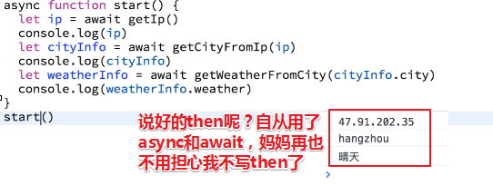

可见改进后的代码用起来特别方便，方便在哪儿呢？就像同步代码一样！你说方便不？

**③async是语法糖？还是创建的API？**

语法糖哈！当然，它们是ES2017新出的关键字！

async/await内部的流程和我们前面所讲的generator的流程是类似的！这就是为啥要按照这种顺序讲5种异步写法的原因了！而不是一开始就讲async/await——这可谓之先苦后甜

总之async/await实际上就是对前面的几种异步写法做了封装！

**④★为什么跨域不安全？**

质疑：问这个问题的人应该是对这个东西不太清楚，毕竟问这样的问题很奇怪！

回答：

回顾一下什么是同源策略？什么是跨域？——举个例子来说，正常的我们的网站xiedaimala.com，如这个前端页面：

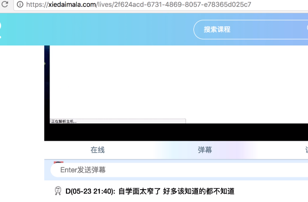

服务端的接口也是xiedaimala.com/api/……聊天的一些接口，然后我们的js去发请求，向这个接口去获取数据，这个时候我们当前前端页面的url接口和我们js请求的url接口是一个域名的，总之是同源的，即协议、域名、端口都相同，所以这个时候才是正常的！

但有时候会出现一些额外的场景，举个例子：

我现在要做一个云笔记的项目或者是云博客的项目，然后我自己不搭后台，我用一个别人即第三方提供的一些接口，然后我调用这个接口就可以去创建博客、创建笔记、查看笔记、修改笔记，然后我自己做的是一个纯前端的项目，做好之后我就把这个项目放到我的githubpage上，然后部署一下，而这个时候就会出现一个问题了！

当别人打开github的时候，看到的是你的这个项目的页面，但是你的JS请求发的又是另外一个接口，这个时候不就会出现跨域吗？

那正常情况下，跨域会被浏览器阻止掉……

举个例子：

当我打开了你这个github的网站，那这个时候我的浏览器会向对方的那个服务器去发送请求，那服务器其实它是不管的，它收到请求之后，然后就把数据发回来，但发回来之后我的浏览器一看当前域名是github，而你的接口的响应头又不是，那么这个时候这个数据，浏览器虽然得到了，但是不会给你，换句话说你的ajax是拿不到的！这个跨域是被浏览器（当期用户的浏览器）给阻止掉的！

换一种场景：

假设我不是浏览器，我是服务端，举个例子：

我现在用nodejs写了一个server，然后nodejs里面去发请求，找其它第三方的接口要数据，要完数据之后你说能不能到？当然可以……这是为什么呢？因为不存在浏览器呀！既然不存在浏览器，那么这也就不存在所谓的跨域了！

那么这个时候希望整个流程能够跑通，那必须要第三方的服务器允许你去跨域

那么如何才能允许呢？——它可以设置它的响应头（系统班课程里有讲到）

浏览器拿到服务器设置好的响应头，发现服务端是允许我的……那就放行吧，这样ajax就能拿到这个数据啦！

所以这里面没有所谓的安不安全，只有所谓的有没有这个需求

**⑤关于CSRF？**

这是另外一个概念，这和跨域没有什么特别大的关系！

➹：[为什么浏览器要限制跨域访问? - 知乎](https://www.zhihu.com/question/26379635)

**⑥jQuery中的find命令可以实现对字符串的寻找吗？**

不行，它是用于查找DOM的，对于字符串查找你就用字符串查找的方法就行了，比如：字符串的像match、search、indexOf都可以去查！

➹：[String.prototype.match() - MDN](https://developer.mozilla.org/zh-CN/docs/Web/JavaScript/Reference/Global_Objects/String/match)

➹：[String.prototype.search() - MDN](https://developer.mozilla.org/zh-CN/docs/Web/JavaScript/Reference/Global_Objects/String/search)

➹：[String.prototype.indexOf() - MDN](https://developer.mozilla.org/zh-CN/docs/Web/JavaScript/Reference/Global_Objects/String/indexOf)

**⑦★为什么要有同源策略？后台不是可以禁止某些请求吗？**

HTTP是一个无状态的协议，当服务端收到一个请求之后，它怎么知道是谁的？另外即使它知道是谁的，如果服务端故意去禁止的话，那么这是不是对服务端的要求比较高？如服务端还需要看请求的来源，如果不符合（一般会根据referer（包含了当前请求页面的来源页面的地址）来判断）我的白名单那我就直接禁掉了，然后不返回响应，不发回响应……但这有个前提就是，对服务端的要求会比较高！服务端必须专门去做这个事情才可以。

那现在浏览器有了同源策略之后，那问题就简单了，因为默认情况下全都是禁止的，即浏览器禁止掉，服务器啥都不用干，既然浏览器禁掉了，那服务端就得专门开一个口子允许某个域名用我的数据，那浏览器才放行！

总之这就相当于是白名单和黑名单的区别！即通过浏览器的全部禁止，然后服务端再开个白名单，如下面某些域名可以收到……这样一来就安全多了

➹：[Referer - MDN](https://developer.mozilla.org/zh-CN/docs/Web/HTTP/Headers/Referer)

**⑧想要将字符串变成dom节点呢？直接用`$node=$(str);str='<div>a</div>'`，可以将字符串变成dom节点吗？**

这个是jQuery创建DOM的一种方式，`$`符加上这么一个字符串模板 `'<div>a</div>'`，它就相当于它会创建一个DOM对象！在这里这个`$​node`是一个jQuery对象，

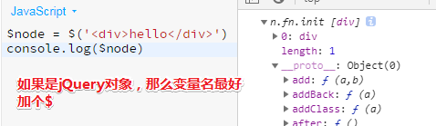

---

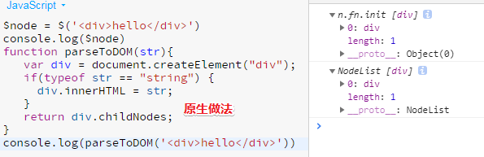

- 参数：

  `str` : HTML文本字符串

- 返回值：

  你所需要的DOM对象，以Array形式返回（事实上是近似Array的NodeList)

- 用法：

  `var nodelist = parseToDOM("<b>hello world</b>");`

> 以后看一个API的时候，先看输入的是什么，然后输出的又是什么，之后再看用法……最后就剖析这个API的逻辑
>
> 自己封装一个API的时候，可以多借助那些原生API实现目的。如果你不要原生的，那么你可以基于jQuery的API再做一层封装……最后就很声明式了……

不过代码有个不严谨的地方：tr标签不能作为div的child node

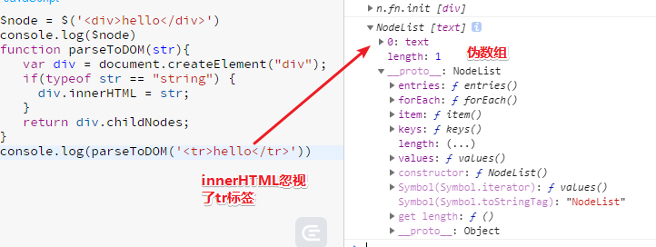

➹：[怎样用原生 JavaScript 把字符串解析为 DOM 对象？ - 知乎](https://www.zhihu.com/question/20785073)

**⑨ `* function(){}`里的 `*`是什么？**

这种写法表示它是星号函数，用于区分普通函数，正常情况下，一个函数名加个括号就执行了，但它不一样，它的特殊之处在于它是一种标记！ 

**⑩关于JS的事件循环机制？**

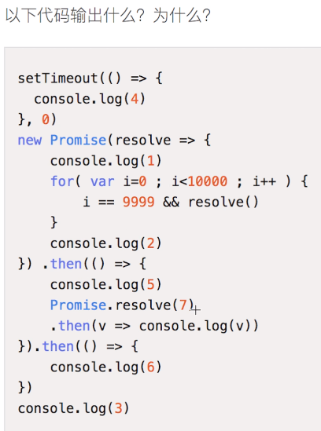

demo：

```js
setTimeout(()=>{
	console.log(4)
},0) 
new Promise(resolve=>{
    console.log(1)
    //循环了10000次，模拟一个异步请求的结果
    for(var i=0;i<10000;i++){
      //话说这是一种什么样的写法，我知道 2 && 3会返回 3，如果前面一个表达式的返回值是false的话，那么就
      //不会执行resolve()，所以这里是等到i == 9999为true的时候，才执行resolve(),即循环了10000次之后
      //才执行resolve()   
      i==9999 && resolve()
    }
	console.log(2)
}).then(()=>{
    console.log(5) 
    //回调中也有Promise，这样在执行下个then前，会先执行它的这个then…这个会插microTask的队！
    //如果下面这个代码的下面还有同步代码的话，那么会先log(v)执行！
    //其实你只要抓住这些回调都是在Call Stack执行即可！
    Promise.resolve(7).then(v=>console.log(v))
    //console.log(8)
}).then(()=>{
	console.log(6)
})
console.log(3)
```

我的答案：1、2、5、7、6、3、4

关于Promise的预案执行是不是异步回调的？

正确答案：1235764

可见这个3是在then之前执行的！

老师的解释：[②](#er)

问题解析的关键：

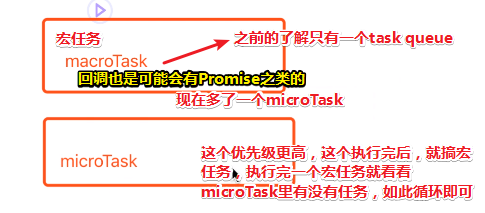

关于这两个异步任务机制有哪些API的问题：

- **macrotasks**: `setTimeout`, `setInterval`, `setImmediate`, I/O, UI rendering
- **microtasks**: `process.nextTick`, `Promises`, `Object.observe`(废弃), `MutationObserver`

我开始从新理解回调这个概念，之前看冒号课堂的时候，说到底层API调用应用层的API，即你在应用层写的API你开发者自己不调用，非要用我们这些Web APIs来间接调用！这就是所谓的回调啦！

所以我的错误原因：没有清楚理解异步任务，以及不知道还有个microTask的存在！还有`Promise.resolve()`是同步代码，它做了状态的转化，好让microTask回去选择成功预案执行。`Promise then`才是异步任务哈！

完善脑海中曾有的图：

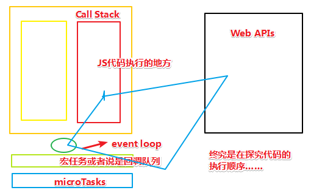

如果代码都按书写顺序执行该多好呀！哎……

➹：[理解 JavaScript 中的 macrotask 和 microtask - 前端 - 掘金](https://juejin.im/entry/58d4df3b5c497d0057eb99ff)

➹：[Tasks, microtasks, queues and schedules - JakeArchibald.com(有个可视化的执行过程，强烈推荐)](https://jakearchibald.com/2015/tasks-microtasks-queues-and-schedules/)


---

## ★总结

- 突然发觉你看到的那些新特性都是封装了好几层的东西，如果你想要更好的记忆它们的话，你就像扒洋葱一样一层层剥开就好了。

  还有最好是通过对比来学习，如`async/await`和 `*/yield`，即多通过几个类似的例子来学习，如异步的各种写法……

- 关于模块最直接的用途就是，把原始的callback姿势封装成可以配合generator或者async/await使用的姿势。很多时候我们会导入各种模块，模块的存在让我们的代码更精炼，逻辑更清晰，代码更声明式……总之就是提高效率呗！
- 可以经常看逛一下npm社区！
- 下一个任务看看同源策略

## ★Q&A

### <a id='yi'>①进一步了解async/await</a>

async函数是对 Generator 函数的改进，实际上就是把Generator自动执行给封装起来，同时返回的是 Promise 对象更便于操作。

用的时候需要注意await命令后面是一个 Promise 对象。

上例中 fsp的作用是把内置的fs模块Promise 化，这个其实刚刚做过。

```js
function delay(time) {
  return new Promise((resolve,reject) => {
    setTimeout(()=>{
      if(Math.random()>0.8){
        resolve(time)
      }else{
        reject('error..')
      }
    }, time)
  })
}

async function fn() {
  console.log('start')
  let time = await delay(1000)
  console.log(`${time}ms passed`)
  let time2 = await delay(3000)
  console.log(`${time2}ms passed`)
}
fn().catch(err=>console.log(err))
```

解释一波：

1s过去了，然后3s过去了，如果有reject的情况出现，那么就catch了！

为了测试效果更好一点，可以把delay函数改写一下：

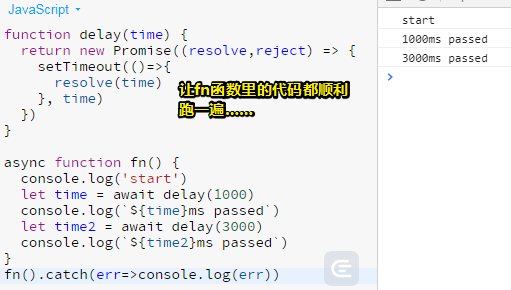

在这里这个time是我们预先设置的异步结果！

这就是异步的终极用法，这些代码甚是干净利落，我们唯一需要的注意是`delay(1000)`的返回值必须是一个Promise对象！当然，这也可以通过某些模块（如fs-promise模块）对它进行Promise化！

### <a id="er">② 每日一题的解释</a>

```js
setTimeout(()=>{
	console.log(4)
},0) 
new Promise(resolve=>{
    console.log(1)
    for(var i=0;i<10000;i++){
      //如果resolve了这个循环会退出吗？不会，毕竟这终究是由循环变量决定了
      i===999 && resolve()
    }
	console.log(2)
}).then(()=>{
    console.log(5) 
    Promise.resolve(7).then(v=>console.log(v))
	console.log(8)
}).then(()=>{
	console.log(6)
})
console.log(3)
```

这个代码看起来特别乱，是故意写的，正常情况下可没有这样的代码！目的是主要让大家去理解这个过程！

那么段代码是怎么去执行的呢？

1. 先去执行同步代码，那么那些是同步代码呢？你看到的代码都是同步代码！或许你会问 `setTimeout`不是异步的吗？它的回调函数 `()=>{console.log(4)}`的执行才是异步的！总之通过setTimeout()本身去设置一个定时器这样的一个语法是同步的！可是它这里的定时器设置的是0ms呀！难道不会立即执行吗？——不会，在我们的JS里面，0等同于1，因为有个最小时间粒度！换句话说，`setTimeout(callback,0)`相当于是`setTimeout(callback,1)`，当然这也不是真得1ms，而是一个最小时间粒度！换句话说，会在这个最小时间粒度之后把这个callback放入到宏任务队列中去！

2. `new Promise(resolve=>{resolve()}).then()`看到这个就把成功预案扔到microTasks里面去，然后后面的then也不用看了

3. 执行`console.log(3)`

4. GG

5. 查看microTasks里的回调，开始执行，先是`5`，然后遇到了`Promise.resolve(7).then(callback),`把callback扔到microTasks中去，并把7也传给它，等会儿在执行它，因为callStack中的同步代码还没有执行完毕

   接着就是`8`了

   由于整个流程咩有报错，且它的返回值是undefined，即done状态，所以就把下一个then的成功预案给扔到里面去，并传入一个undefined值，与此同时当前这个预案也就可以弹出microTasks队列中去了！

   此时microTask中有两个callback等待着执行

6. 根据队列的先进先出原则，所以先执行`7`

7. 接着执行`6`，这是microTask没有任何东西了，可以执行setTimeout中的callback了

8. 输出`4`

所以答案是12358764，反正看到then就跳过……

进一步扩展：

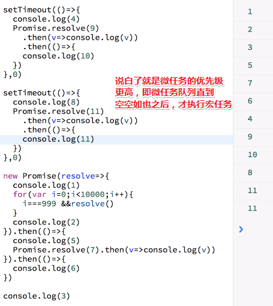

总之就这样：

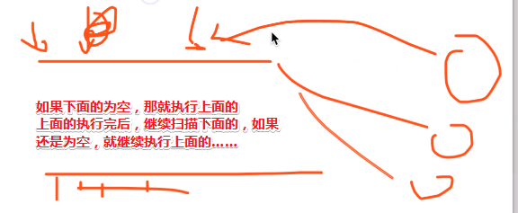

注意：留意回调队列的任务是否会产生微任务……

题外话：

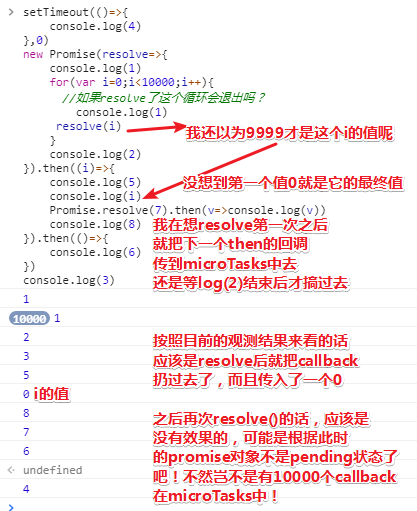

➹：[setTimeout(fn,0)与Promise的执行顺序](http://ghmagical.com/article/page/id/8IN61XjjVt9y)

➹：[微任务、宏任务与Event-Loop - 掘金](https://juejin.im/post/5b73d7a6518825610072b42b)

### ③setTimeout平均最小时间粒度？

```js
(function mintime(){
    var i=0;
    var start = Date.now();
    var clock=setTimeout(function(){
        i++;
        if(i===1000){
            clearTimeout(clock);
            var end=Date.now();
            console.log( (end-start)/i );
        }
        clock = setTimeout(arguments.callee,0);
    },0)
})();//5ms左右
```

目前：HTML5中已经将最小执行时间统一为4ms。

➹：[★javascript - 计时器问题最小时间粒度 - SegmentFault 思否](https://segmentfault.com/q/1010000014379634)


