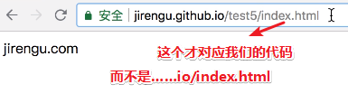

# node.js 搭建服务器、请求、响应、ajax、跨域

## ★课程简介

若愚老师讲解难点

## ★服务器深入浅出（文章）

### ◇什么是服务器？

Web 服务器就是一个软件，这个软件监听某个端口。当一个 Http 请求到达这个端口后这个软件会接收到，根据请求的 url 和参数发送响应数据，这些数据可以是：

1. 本机文件；
2. 通过可执行程序从数据库获取数据后组装的页面

### ◇静态服务器


> 文件路径可以不与url路径一一对应吧？

### ◇动态服务器


### ◇一个简单的服务器

以下代码使用的 api 文档[点此查看](https://nodejs.org/dist/latest-v10.x/docs/api/http.html)

```js
var http = require('http')

// var server = http.createServer(function(req, res){
//     console.log('jiengu')
//     res.setHeader("Content-Type","text/html; charset=utf-8")
//     res.write('<h1> 饥人谷</h1>')
//     res.end()
// })
// server.listen(9000)


var server = http.createServer(function(request, response){
  setTimeout(function(){


    response.setHeader('Content-Type','text/html; charset=utf-8')
    response.writeHead(404, 'Not Found')
    response.write('<html><head><meta charset="gbk" /></head>')
    response.write('<body>')
    response.write('<h1>你好</h1>')
    response.write('</body>')
    response.write('</html>')

    response.end()
  },2000);
})

console.log('open http://localhost:8080')
server.listen(8080)
```

### ◇一个简单的静态服务器

```js
var http = require('http')
var fs = require('fs')

var server = http.createServer(function(req, res){
  try{
    var fileContent = fs.readFileSync(__dirname + '/static' + req.url)
    res.write(fileContent)
  }catch(e){
    res.writeHead(404, 'not found')
  }
  res.end()
})

server.listen(8080)
console.log('visit http://localhost:8080' )
```

### ◇支持静态文件动态路由的服务器

```js
var http = require('http')
var fs = require('fs')
var url = require('url')

http.createServer(function(req, res){
  var pathObj = url.parse(req.url, true)
  console.log(pathObj)

  switch (pathObj.pathname) {
    case '/getWeather':
      var ret
      if(pathObj.query.city == 'beijing'){
        ret = { city: 'beijing', weather: '晴天' }
      }else{
        ret = { city: pathObj.query.city, weather: '不知道' }
      }
      res.end(JSON.stringify(ret))
      break;
    default:
        try{
            var fileContent = fs.readFileSync(__dirname + '/static' + pathObj.pathnamel)
            res.write(fileContent)
            }catch(e){
                res.writeHead(404, 'not found')
            }
       res.end( )
  }
}).listen(8080)
```

## ★Ajax（文章）

### ◇从写代码到页面展现

#### ajax

资料：[ajax](http://book.jirengu.com/fe/%E5%89%8D%E7%AB%AF%E5%9F%BA%E7%A1%80/Javascript/ajax.html)

##### ajax是什么？

ajax是一种技术方案，但并不是一种新技术。它依赖的是现有的CSS/HTML/Javascript，而其中最核心的依赖是浏览器提供的`XMLHttpRequest`对象，是这个对象使得浏览器可以发出HTTP请求与接收HTTP响应。 实现在页面不刷新的情况下和服务端进行数据交互

##### 怎么实现？

- XMLHttpRequest对象
- fetch [兼容性](http://caniuse.com/#search=fetch)——不支持IE

##### 范例？

1. [ajax](http://js.jirengu.com/gahon/1/edit?html,output)
2. [fetch](http://js.jirengu.com/tohuy/2/edit?html,console,output)

写一个 ajax

```javascript
var xhr = new XMLHttpRequest()
xhr.open('GET', 'http://api.jirengu.com/weather.php', true)
xhr.onreadystatechange = function(){
    if(xhr.readyState === 4) {
        if((xhr.status >= 200 && xhr.status < 300) || xhr.status == 304){
            //成功了
            console.log(xhr.responseText)
        } else {
            console.log('服务器异常')
        }
    }
}
xhr.onerror = function(){
    console.log('服务器异常')
}
xhr.send()
```

换种写法

```js
var xhr = new XMLHttpRequest()
xhr.open('GET', 'http://api.jirengu.com/weather.php', true)
xhr.onload = function(){
    if((xhr.status >= 200 && xhr.status < 300) || xhr.status == 304){
        //成功了
        console.log(xhr.responseText)
    } else {
        console.log('服务器异常')
    }
}
xhr.onerror = function(){
    console.log('服务器异常')
}
xhr.send()
```

post 的使用

```javascript
  var xhr = new XMLHttpRequest()
  xhr.timeout = 3000        //可选，设置xhr请求的超时时间
  xhr.open('POST', '/register', true)

  xhr.onload = function(e) { 
    if((xhr.status >= 200 && xhr.status < 300) || xhr.status == 304){
      console.log(this.responseText)
    }
  }
    //可选
  xhr.ontimeout = function(e) { 
        console.log('请求超时')
  }

  //可选
  xhr.onerror = function(e) {
      console.log('连接失败')
  }
  //可选
  xhr.upload.onprogress = function(e) {
      //如果是上传文件，可以获取上传进度
  }

  xhr.send('username=jirengu&password=123456')
```

封装一个 ajax

```javascript
function ajax(opts){
    var url = opts.url
    var type = opts.type || 'GET'
    var dataType = opts.dataType || 'json'
    var onsuccess = opts.onsuccess || function(){}
    var onerror = opts.onerror || function(){}
    var data = opts.data || {}

    var dataStr = []
    for(var key in data){
        dataStr.push(key + '=' + data[key])
    }
    dataStr = dataStr.join('&')

    if(type === 'GET'){
        url += '?' + dataStr
    }

    var xhr = new XMLHttpRequest()
    xhr.open(type, url, true)
    xhr.onload = function(){
        if((xhr.status >= 200 && xhr.status < 300) || xhr.status == 304){
            //成功了
            if(dataType === 'json'){
                onsuccess( JSON.parse(xhr.responseText))
            }else{
                onsuccess( xhr.responseText)
            }
        } else {
            onerror()
        }
    }
    xhr.onerror = onerror
    if(type === 'POST'){
        xhr.send(dataStr)
    }else{
        xhr.send()
    }
}

ajax({
    url: 'http://api.jirengu.com/weather.php',
    data: {
        city: '北京'
    },
    onsuccess: function(ret){
        console.log(ret)
    },
    onerror: function(){
        console.log('服务器异常')
    }
})
```

##### 详细使用

[参考这里](https://segmentfault.com/a/1190000004322487)

### ◇跨域

## ★什么是 Web 服务器

### ◇一次过

它是一个软件，其中分为静态服务器和动态服务器两种，前者甚是简单，即本地资源路径与url一一对应，而其中的资源是静态的，如我部署这个笔记到到github上，就是按静态服务器处理的，就像这样访问：


至于后者，资源是动态的，url可不是非得与服务器的本地资源路径一致的

### ◇本节课讲什么？

讲解服务器、AJAX，然后与之相关的一些知识！

### ◇什么是Web服务器？

举个例子来说：

1. 访问https://xiedaimala.com的时候，可以看到一个页面
2. 访问https://baidu.com的时候，也可以看到一个页面
3. 当我把当前这个md文件上传到自己的GitHub上，然后通过GitHub Pages部署该文件所对应的仓库，然后就可以通过url访问该md文件HTMl化后的文件了！

4. ……

或许你会疑问：

为啥我们可以通过url来访问这些文件？

为啥我当前电脑xx盘中有许多小视频（你懂的……），人家就不可以通过url来访问我的小视频呢？

是不是得必须把这些资源放到某个地方上去，别人才能看得见呢？

这其中到底是不是有什么东西做了支撑？

……

这就涉及到Web服务器的概念啦！

举个例子：

在本地建个文件夹，里面有个index.html文件，就像这样：


此刻你想访问我这个文件，然后你就打开浏览器，然后输入一个东西想看到我这个页面，你说可以不？——显然不可以哈！

或许你会说这是因为你的这台电脑没有在公网上，所以才无法访问的，所谓的公网就是一个提供一个能够公共访问IP的这么一个东西，总之就是通过公网ip，浏览器就能找到你这台电脑就对了……

➹：[外网公网是什么意思_百度知道](https://zhidao.baidu.com/question/692210293638867364.html)

既然你这样说，那我就在阿里云上购买一个服务器好了，而这个服务器就相当于是我这台电脑，而且还有一个公网的ip，这样一来别人就可以通过ip地址找到我所购买的（应该说是租赁的）服务器了……就像这样：


当我把小视频上传到了这台服务器中的root目录中的zzz文件夹中，然后通过 `公网ip/zzz/`访问，结果还是看不见东西……

既然不是公网ip的问题，所以咋办？

这个时候我们就需要一个东西，一个叫做Web服务器的东西……

那么它是什么呢？

它是一个软件，这个软件可以去监听你当前电脑上的某个端口（如监听这个端口上的http请求）。当这个 Http 请求到达这个端口后，由于这个软件也在监听这个端口，所以这个请求一到端口上，它立刻就能听得到！能听到之后它就会根据比如说用户的配置，然后去返回一些东西，，通过HTTP协议返回一些数据……

换句话说，一个请求到这个服务器之后，用户能够看到什么是由这个服务器上装的某一个软件决定的。

这个软件说你可以看到我的某个文件夹下的某几个文件，那此刻这几个文件的数据就会发送给浏览器，发送给用户，然后他就能看得见，这就是一个Web服务器。

那么这个Web服务器它可以干什么事情呢？

它可以把这个当前电脑上面的文件给拿出去，然后扔给你。它也可以干吗？它也可以命令某些可执行的文件，可执行的程序去执行，而执行的过程中会生成数据，然后把生成的数据拿给你！

所以这个服务器一般来说会把它分为静态服务器和动态服务器，当然，你也可以不用这样去分……

#### 静态服务器

什么叫静态服务器？


1. 一台机器（也就是电脑），与之对应的域名是这个  `jirengu.github.io`
2. 这个机器的某个文件夹下有两个文件夹，这两个——`project1`和`project2`
3. `project1`下面有这个文件—`a.html`
4. 当用户访问`jirengu.github.io/project1/a.html`的时候，实际上这个请求相当于是到了这个机器  ，然后这个机器的软件就会根据你这个url后缀里面这个 `/project1/a.html` ，然后就会读对应的文件夹，然后把其中的文件里面的数据给拿到，然后再发给用户，然后这个东西就到用户的电脑，用户就看到这个HTML了。换句话说，这个服务器做事情很简单，就是根据你访问的路径，然后去找对应的的文件，然后把这个文件拿给你，所以它叫静态服务器

#### 动态服务器

动态服务器给的数据的种类就比较多了！比如说我们这个a.html数据太死了……

举个例子来说，a.html是个静态页面，可是它这里面的数据，我希望它是实时变动的，这该怎么办呢？

总之就是让不同用户访问它的时候所看到的结果是不一样的……

没有办法可以做到，因为a.html这个页面是死的……

所以，我们现在需要一个程序可以帮我们做到数据是动态的而不是静态的！

而这个程序的逻辑可能是这个样子的：


当我们输入 `xiedaimala.com/courses`这个地址以后，这个请求实际上就到达了这个服务器，这个服务器里面安装了一个我们刚刚所说的web server，即Web服务器——一个软件

然后它就会根据你写的这个url的配置，把你这个请求交给某个程序，这个程序实际上，不管是用PHP、Ruby、nodejs，还是JAVA、Python等来写的，反正它就相当于是一个可执行的程序！注意这个程序里的代码可能是你自己去写的！

交给它之后，里面的代码就会处理这个请求，然后会从View中拿到对应的模板，然后从模型（Model）里面拿到对应的数据，接着把数据和模板几个进行拼接（一个复杂的页面可是由好几个组件构成的，这意味着会有好几个模板，不过目前，前端已经把后端生成模板的活给干了！），然后生成一个新的页面，这个页面实际上就是一个很大的一串字符串，然后把这个东西发回去，所以用户看到的就是一个可变的数据。

换句话说，此刻当用户输入 `xiedaimala.com/courses` 的时候，并不是去找这个服务器下面有个目录叫courses中的默认文件index.html，而是Controller（控制器）它去决定去找谁要数据，决定去拿哪个模板，然后把这个数据塞到这个模板里面，拼成一个新的HTML字符串，然后返回去。

所以这整个请求响应的过程是动态的。换句话说，有一个可执行的程序能够去执行你这个代码。

而静态服务器比较简单，没有什么执行，就是根据你给的url路径去找。

所以经常有人会说，我写了一个nodejs代码——一个server，写完之后把它上传到GitHub上，然后用GitHub Pages做预览。

然而为什么没有执行这个server呢？

那是因为GitHub Pages它本身是一个静态服务器，你把这文件上传上去，你访问它，你看的是这个文件，而不是去执行这个文件，然后得到它的结果。

所以它是不支持的，它只是支持展示一些静态页面。那如果想要用更复杂的功能，那你需要自己去搭服务器，把你的代码上传的一个支持nodejs的这么一套环境上才可以。

这就是关于静态服务器和动态服务器这么一个概念。

### ◇小结

- “网络服务器（Web server）”可以代指硬件或软件，或者是它们协同工作的整体。

- 你在阿里云上租赁了一台服务器，那么这台服务器就相当于是你经常使用的笔记本一样，当然，这其中一般会配置linux系统，而除此之外空空如也，即没有所谓的QQ等软件之类的……如果你把这台服务器当作是类似于云盘之类的用作备份的话，显然有点大材小用了，而且也存不了多少东西（似乎涉及到文件服务器）

  为此很多时候我们必须得为这台很纯粹的服务器添加点东西才行

  如果你想让服务器提供Web服务的，那么你就得使用一些诸如Apache、nginx等之类的软件才行（主要是提供HTTP服务的……）

  如果你想让服务器还能提供数据库服务的，那么你就得使用一些Oracle、MySQL等之类的软件才行

  所以此刻你的服务器有多种身份了，可以说它是Web服务器，也可以说数据库服务器……反正这台服务器提供了什么服务，那么它就是什么样的服务器了。

  总之，你租赁了一台服务器，那么你就得搞点Web服务器软件，这样用户才能通过url访问某些资源吧，如果你搭建的是动态Web服务器的话，那么你得搞点MySQL之类的软件，为此好提供数据库服务……

  

  所以什么是Web服务器？

  Web 服务器就是一个软件，这个软件（如Nginx、Apache、Tomcat之类的）监听某个端口。当一个 Http 请求到达这个端口后这个软件会接收到，根据请求的 url 和参数发送响应数据，这些数据可以是：

  1. 本机文件；
  2. 通过可执行程序（用Java/nodejs等语言写的程序，这应该是Web后端程序员干的活儿吧！）从数据库获取数据后组装的页面

- 为了让用户在浏览器地址栏里输入的url是有结果的，那么你的服务器得开启http服务才行！

➹：[什么是网络服务器？ - MDN](https://developer.mozilla.org/zh-CN/docs/Learn/Common_questions/What_is_a_web_server)

➹：[服务器 - Wikiwand](https://www.wikiwand.com/zh-hans/%E6%9C%8D%E5%8A%A1%E5%99%A8)

➹：[文件服务器 - Wikiwand](https://www.wikiwand.com/zh-hans/%E6%96%87%E4%BB%B6%E6%9C%8D%E5%8A%A1%E5%99%A8)

➹：[Nginx - Wikiwand](https://www.wikiwand.com/zh-hans/Nginx)

➹：[Apache和Apache Tomcat的区别是什么？ - 知乎](https://www.zhihu.com/question/37155807)

## ★使用 Node.js 写一个静态服务器

### ◇写一个简单的服务器

使用node.js实现……

#### 实现逻辑

之前说到这个服务器就是Web服务器，即一个小软件

写好之后，就开启它，然后它就会监听某个端口……

接着就是测试：

在浏览器中输入一个ip地址或者是域名，当然我并咩有域名，所以只能用ip地址测试啦！然后还要写对应的端口才行！就像这样：


敲下回车，这个请求就会到达我们所写的这个软件，然后由我们这个软件去决定发送什么数据，发完之后，浏览器就会看到了！

#### 看看代码如何实现

从一个最简单的范例开始：

```js
var http = require('http')

var server = http.createServer(function(req, res){
    console.log('jiengu')
    res.setHeader("Content-Type","text/html; charset=utf-8")
    res.write('<h1> 饥人谷</h1>')
    res.end()
})
server.listen(9000)
```

分析：

1. 使用nodejs的一个内置模块http
2. 然后调用http的createServer方法，并传入一个参数，这个参数的作用是当server启动之后要做的事情，即我们需要的一些配置
3. 这个server创建之后就去监听9000这个端口，这个9000随便给，如8080、3000等，总之只要端口没被其它程序监听就好了！还有一些端口是不能使用的……

只要程序运行，监听这个端口，那么这个server就已经启动了，换句话说就是通过`http.createServer`启动了一个服务器。

> 其实这个的赶脚就像事件监听处理一样，有请求过来就调用回调函数啦！

请求到来之后，就会执行那个函数，其中req就是请求相关的信息，这个信息包括很多东西，如用户的浏览器类型、用户请求的一个url以及一些与url相关的信息、请求带的参数都在req这个对象里面

这个函数既然得到了用户的请求的信息，那么我们就得给用户一个响应才行哈！

如何才能给响应呢？——用这个函数的第二个参数res，直接调用res的一些方法即可！反正有内置模块http帮我们封装了许多API

关于res对象，有哪些API呢？

1. setHeader()：设置响应头
2. write()：设置响应体
3. end()：结束

4. ……

在本地启动这个server，看看效果：

使用node去执行这个server1.js，换句话说就是去启动我们这个服务器：


浏览器显示效果：


这个server1.js就是一个Web服务器啦！

> 我想起之前关于Java web的就感到头疼，需要做很多功夫，才能看到一个结果，在我看来，这对于初学者来说并不友好。因为很多时候，我只是看到一个跑通的结果而已，即一个请求，然后浏览器响应了一个结果。而不是费很多功夫才能看这个结果！
>
> 总之，对于初学者理清整个请求和响应的过程，比去关注实现这个过程的代码要重要得多！

虽然很简单，但「麻雀虽小五脏俱全」哈！

分析一下下面这个代码：

```js
res.setHeader("Content-Type","text/html; charset=utf-8")
res.write('<h1> 饥人谷</h1>')
```

浏览器和服务器的沟通就是通过http协议进行的，而http协议就是响应头和响应体！

响应头 `Content-Type`告诉我后面的响应体的类型为`html`，编码为`utf-8`

此刻浏览器就会知道 `<h1> 饥人谷</h1>`这个东西是html，然后它就会把这个东西当作是html渲染


如果我们不加`Content-Type`，你猜会咋样：


浏览器不知道响应体是什么东西，但可以去猜，有时可以猜对！此刻虽然认为是HTML内容，但出现了乱码哈！

总之你还得设置编码方式才行！当然一般我们写html的时候都会在meta标签里写上编码信息……

查看network：


以上就是一个最简单的server了，但是这个server有啥用呢？——貌似没啥用……

当然，还是有点用处的，比如此刻你的server1.js正运行在云服务器上，通过公网ip，加上相应的端口，就能让其它人访问了，接着你要向某个女孩表白，然后就在响应体写上一大段表白内容，然后就把这个url发送给那女孩，然后那女孩就能看到这个表白页面了……

不管怎样，这终究是一个功能有限的服务器！所以我们需要进一步扩展

不过在扩展之前，还是先完善一下这个例子先：

```js
var http = require('http')

// var server = http.createServer(function(req, res){
//     console.log('jiengu')
//     res.setHeader("Content-Type","text/html; charset=utf-8")
//     res.write('<h1> 饥人谷</h1>')
//     res.end()
// })
// server.listen(9000)


var server = http.createServer(function(request, response){
  //加了个延时，模拟了一下网络延时，让它在2000ms之后再发送响应
  setTimeout(function(){
    response.setHeader('Content-Type','text/html; charset=utf-8')
    response.writeHead(404, 'Not Found')
    response.write('<html><head><meta charset="gbk" /></head>')
    response.write('<body>')
    response.write('<h1>你好</h1>')
    response.write('</body>')
    response.write('</html>')

    response.end()
  },2000);
})
//这些log会在终端显示
console.log('open http://localhost:8080')
server.listen(8080)
```

解释一波：

出现了一个新的API——`writeHead()`，它的作用是设置一个状态码，以及出现这个状态的一些原因（reason）！

测试：


结果：


meta标签里设置的charset属性没有响应头设置的优先级高！

> 其实url写成这样也没事儿：http://127.0.0.1:8080/index.html，默认就是拼接成index.html内容，即便我们并没有在本地写这个index.html文件

我们查看页面的network情况：

先看一下Timing：


➹：[Network Analysis Reference  -  Tools for Web Developers  -  Google Developers](https://developers.google.com/web/tools/chrome-devtools/network-performance/reference?hl=zh-cn)

我在看preview的时候：


最后看下http请求和响应情况：


明明响应ok，但这状态码是404，这是为什么呢？因为你在服务器里写了404啊！那么这个状态就是404，浏览器收到这个状态就会根据这个状态去提示，比如这样：


提示中的 `Not Found`也是我们在服务器中写的！

从这可以看出，当我们自己去实现这个web server的时候，你可以按照约定来。那么约定是什么呢？就是正常情况下响应成功约定状态是200的，万一文件不存在才是404

当然，你也可以不按，不按的话就会出现一些奇怪的结果，毕竟在没有Web开发之前你已经有了一些潜在的认识了，为此感觉不按约定的话会显得很奇怪！这就像是把约定当作是正常现象，不遵守这个约定的就是异类！

> 很多时候，我们在不知不觉中就被同化了，而且还装作若无其事般接受……最后习以为常……即便有些东西并不是那么合理

总之，用户看到的东西，我们都可以在服务器这边做控制，如搞坏状态码

关于编码选择的优先级：[②](#er)

这个例子虽然多了点代码，但还是并无卵用……所以我们接下来就搭建一个静态服务器！

#### 关于API的学习

如何学习nodejs提供的这些API，如`setHeader()`之类的……

直接去nodejs的官网api里找就好了！

我们在学nodejs的时候，可不是从头到尾，从打开其官网API的文档开始之后的第一行学到其最后一行的，而是通过一些小例子，让你越来越了解更多的API，然后自然而然地就学会了！

总之千万不要直接去看API，而是用到什么就去看什么，不理解什么，就去理解什么，而不是毫无目的为了学习API而去学习API……毕竟这API真TM多！

➹：[http  - Node.js API 文档](http://nodejs.cn/api/http.html#http_response_write_chunk_encoding_callback)

### ◇写一个静态服务器

```js
var http = require('http')
var fs = require('fs')

var server = http.createServer(function(req, res){
  try{
    //req.url的值就是url除了协议、域名、端口之外后面的那部分，其中包括查询参数：
   	//如请求是是：http://127.0.0.1:8080/static/index.html?a=1，那么它的值就是:
    // '/static/index.html?a=1'
    //总之它就是主域名后面的东西，这个要观测的话，可以看它的请求头：
    // GET /static/index.html?a=1 HTTP/1.1
    var fileContent = fs.readFileSync(__dirname + '/public' + req.url)
    // 加了一个'/public'表明请求路径可不是非得与本地资源的路径保持一致的！这由你开发者决定哈！
    res.write(fileContent)
  }catch(e){
    res.writeHead(404, 'not found')
  }
  res.end()
})

server.listen(8080)
console.log('visit http://localhost:8080' )
```

解释一波：

1. 引入一个内置模块http，反正所有的功能都是这个内置模块提供的！

2. 引入一个操作文件的模块fs，它可以去读文件，也可以去写文件

3. `__dirname`是当前这个server3.js的目录，不过我在windows拿到的是 `D:\A2-temp-file\server`，话说这个反斜杠如何处理？而`req.url`拿到的是url端口之后的路径，假如用户发的请求是 `http://127.0.0.1:8080/static/index.html`

   那么其结果就是 `/static/index.html`

   最后fs读的是 `D:\A2-temp-file\server/static/static/index.html`，这显然是有问题的……

4. 根据url，我们可以字符串拼接成一个相应的文件路径，然后让fs去读就好了，如果没有读到，那就返回一个404

如果返回的是404的话，就像这样：


其响应状态码是：


当你打开一个网站， 居然返回了一个404，而这个404是谁给你的呢？其实就是web服务器给你的！当然你也可以捣乱，比如这样：

```js
 try {
     //……
 } catch(e) {
    //状态码一定要设置在write前面才行
    res.writeHead(404, 'not found')
    res.write('<h1>你好</h1>')
  }
  res.end()
```

你会发现这样做了，页面也能看到内容了，所以你可以搞一个漂亮的404.html，不然就是上上面那张图所展示的那样了！

➹：[404页面下载：一组漂亮的404错误页面模板下载 - 人人都是产品经理](http://www.woshipm.com/xiazai/12285.html)

捋一下整个过程：

为什么当我们在浏览器中输入一个url之后就能看见内容呢？——如 `127.0.0.1:8080/index.html`

这个ip（一般是域名）就定位到我们当前的本机，8080相当是我们的请求到达了本机的8080端口，而8080端口呢？恰巧我们启动了一个服务器在监听这个8080端口，听到之后就会执行一个回调函数，并传入两个参数，一个有请求相关的信息，一个有响应相关的信息……这个可以查看network

接着就拿到`req`的`url`信息啦，注意这不包括同源那些东西，端口后面的那些东西才是它的值！


然后根据这个 `req.url`去决定我们该读哪个文件夹！如决定读这个：


决定好之后就生成一个完整的url，即系统的绝对路径——从root到这index.html，就像这样：


然后就用读文件的方式，把这个文件里的数据给读出来！

接着就把读出来的字符串发出去给浏览器即可！

> 我在想res.end()这个方法，是等我们把数据发完了才end吗？你要知道数据可不是一次性就能发完的……
>
> 我随便找了个[网站](https://www.cnblogs.com/chyingp/p/node-learning-guide-path.html)，看看它的timing：
>
> 

这样一来，我们就实现了一个静态服务器了！

我们还可以添加资源测试，为此好明白何为「静态」：


后面会进一步拓展这个静态服务器的功能，如让它变成一个动态服务器

此时，我想你肯定会问「为啥写个服务器这么简单？」

当然，如果你写得特别好的话，那么服务器的功能就特别、特别复杂……比如常见的Web Server有很多，像Nginx、Apache、lighttpd这些功能特别复杂

而我们这个静态服务器只不过是一个比较简单的演示而已！

➹：[常见的web服务器软件分类 - 锋齐叶落 - 博客园](http://www.cnblogs.com/qianzf/p/6803863.html)

> 似乎可以搞一个静态的json数据出来……
>
> 1. 找一个[API](https://easy-mock.com/mock/5c42d010fa4bae6ac3633398/example/mock)，根据其中的请求和响应信息来搞事情就好了
> 2. 复制这个静态服务器，添加 `res.setHeader('Content-Type','application/json; charset=utf-8')` 
>
> 总之这个可以是你本地专门mock数据的静态服务器，名字叫mockserver.js
>
> 请求：http://127.0.0.1:8080/test.json
>
> 效果：
>
> 

---

## ★使用 Node.js写一个动态服务器

### ◇代码

> 使用nodejs实现一个支持静态文件动态路由的服务器

```js
var http = require('http')
var fs = require('fs')
var url = require('url')

http.createServer(function(req, res){
  var pathObj = url.parse(req.url, true)
  console.log(pathObj)

  switch (pathObj.pathname) {
    case '/getWeather':
      var ret
      if(pathObj.query.city == 'beijing'){
        ret = { city: 'beijing', weather: '晴天' }
      }else{
        ret = { city: pathObj.query.city, weather: '不知道' }
      }
      res.end(JSON.stringify(ret))
      break;
    default:
        try{
            var fileContent = fs.readFileSync(__dirname + '/static' + pathObj.pathnamel)
            res.write(fileContent)
        }catch(e){
            res.writeHead(404, 'not found')
        }
        res.end( )
  }
}).listen(8080)
```

### ◇解释

解释一波：

1. 引入一个url模块，用于解析url
2. 启动一个这个server，监听8080端口，只要有请求到了8080端口，就会执行那回调函数。

关于那回调函数的逻辑：

1. `var pathObj = url.parse(req.url, true)`，在这里我们为啥要`passe`一下`req.url`，然后得到一个新的path对象呢？那是因为很多时候请求的url是带有参数的，就像这样：

   

   按照我们之前静态服务器的逻辑，这个url就是在找一个文件叫 `index.html`然后还有后缀 `?a=1&b=2`，那我能否创建这样的文件呢？于是我做了下面这个尝试：

   

   显然GG了

   总之，按照我们的这个逻辑，这个文件 `index.html?a=1&b=2`  是不存在的，所以我们需要对`req.url`进行处理，让后面这些所谓的参数 `?a=1&b=2`通过url的parse（解析）得到一个真实的path以及其后面的参数！

   关于请求URL的一些细节：[⑤](#wu)

2. 使用`switch……case……default`语句，如果服务器里面后端有个叫 `/getWeather`的接口，然后就查看查询参数里是否有个叫beijing的字段，如果是则返回`晴天`这个数据，如果不是，那天气状况就`不知道` 啦！

   假设根据`pathname`判断你不是找天气 的，而是其它的，那么我们就默认你是去找静态文件的，然后我们就去读本地文件，读到之后就把文件发给你！

   如果本地文件找不到或者文件受损了，那么我只能发个404以及reason了呀！至于其它内容那就算了，我可没有精力去写一个好看的404.html给你！

   总之下面这段代码所描述的功能就是静态服务器：

   ```js
   try {
       var fileContent = fs.readFileSync(__dirname + '/static' + pathObj.pathnamel)
       res.write(fileContent)
   } catch(e) {
   	res.writeHead(404, 'not found')
   }
   ```

   而下面这块则是路由功能：

   ```js
   case '/getWeather':
         var ret
         if(pathObj.query.city == 'beijing'){
           ret = { city: 'beijing', weather: '晴天' }
         }else{
           ret = { city: pathObj.query.city, weather: '不知道' }
         }
         res.end(JSON.stringify(ret))
         break;
   ```

   当用户输入一个URL的时候，服务端做的事情不是去找 `getWeater`这个文件，而是要给前端一些数据，不管这是啥数据，还是打哪儿来的，如这中间可能是你直接模拟的假数据、如果是真实场景的话，这些数据是从服务器或者是数据库中获取的！

   换句话说，这个过程就有一个动态的特性，即数据是变的而不是死死的某个文件

### ◇小结

1. 当我们去学习AJAX的时候，通过这个动态服务器，我们就可以用它去模拟数据了，去mock数据！
2. 之后会讲解ajax以及与它相关的一概念

---

## ★从写代码到用户预览发生了什么

> 讲解AJAX相关的一些概念，以及它和服务器之间的关系，跨域到底是什么？它是怎么跨的？

### ◇先来画个图

> 画什么？画我们日常工作的流程，以及用户看到你的代码中间发生的过程

#### 静态服务器


#### 动态服务器

> 相较于静态服务器，它既支持上图所述的静态文件（index.html、a.css、b.js……），也支持某些动态的路由！

举个例子来说，我们现在搭了一个网站，比如用nodejs写了一个网站

小Y：写了一些静态文件，以及一些处理后端逻辑的文件，反正它们是打包在一起，都是网站的代码，其中一部分是前端部分，大部分是后端部分，写好之后就把网站代码部署到服务器上，然后启动我们webserver，即server.js，监听的端口是8080

小B：用户输入URL，是获取index.html的，其中端口为8080

小C：webserver接收到了，就执行回调，把index.html给用户

小B：index.html中某些标签需要发请求去拿到一些诸如图片、css、js等的资源

小C：给js你

小B：执行js，发现需要用ajax发请求，如发 `/getWeather`，获取天气状况，既然你是绝对路径的，那就默认为了添加 当前这个index.html页面的url中的`协议+域名+端口`，然后就拼接成一个完整的URL了！即 `协议+域名+端口/getWeather`

小C：收到 `/gerWeather`，查找到一段数据给小B

这就是一个同源的过程，即我们用ajax所发的请求接口 `/getWeather` 与当前页面是同源的！

如果发的是 `https://weather.jirengu.com:80/getWeather`，那么这就是在向另一台服务器发送请求了，总之这和我们当前域名所看到的是不一样的，总之数据源发生了变化，那么这对浏览器来说这就叫不同源！

还能识别不同源还有协议不同（如http和https的不同）、端口不同（80和8080），不单只是域名的不同！

注意这种形式：`blog.ppambler.cn`和 `ppambler.cn`，这也是不同源的！

> 当我无法用文字描述，那就举例好了
>
> 关html标签如img发的请求应该不需要准守同源策略的吧！只有ajax才会如此吧，那script的src遵守同源策略吗？
>
> 不需要，很多时候你就看ajax发的请求就好了！
>
> [⑥](#liu)

总之在协议、域名、端口中存在一个不同，那就是不同源的。

关于端口的不同，如 `ppambler.cn:80`和 `ppambler.cn:3000`，虽然域名相同 ，但逻辑上并不是指向同一个服务器！

既然不同源，那么请求发出去了，然后数据响应回来了，而此时浏览器就会阻止掉这个数据，换句话说就是请求可以发出去，然后所需的数据也能响应回来，可回来之后，浏览器就不干了，说「这个数据有问题，不同源」，所以这个数据就被拒绝掉了！

所以你的代码等待数据到了，就等不到了，因为浏览器拒绝接收啊！总之你的代码无法得到数据

为此这就存在了「跨域」的概念了！

之后会讲到处理方案！

一些思考：

我写的代码到底在网站上处于怎样的角色？到底是什么？

如我写个index.html里面有一个script，其中有个请求到底发给谁呢？发到哪去呢？上面那幅就很好解释清楚了！

下面用实例做个演示！

> 感觉这里就是说能不能跨域获取数据的问题！至于CSRF（Cross-site request forgery，中文名称：跨站请求伪造）又是另外一个话题了！

---

## ★小测试

> 刚刚讲了很多概念，接下来搞一个具体的例子来分析分析！

1. 在github上创建一个仓库——test5，且初始化README

2. 直接在线上创建搞两个文件（index.html和a.js），而不是在本地用命令行创建，其中index.html有个script标签引用这个a.js，而且是这种姿势 `/a.js`

   

   index.html：

   

3. 启动github pages，让我们可以在线上预览

但某个用户浏览这个index.html的时候，报错了！


这是为什么呢？我们写的代码没哈问题啊！

分析：

当我们把使用了github pages的时候，其路径是这样的 :



这就是我们之前所说的静态服务器啦！继续获取静态资源：


由于我们的index.html写的是 `/a.js`

但用户打开 `jirengu.github.io/test5/index.html`的时候，那这个数据就会到达用户浏览器，也就是得到了这个源码：


得到这个源码之后，发现里面有个 `/a.js`，然后就会重新去发请求，那么它发是什么呢？

之前说到 `/a.js`表示的是这个URL的一个path，path就是它的主域名（不看端口）后面那部分

换句话说，完整URL就是： `jirengu.github.io/a.js`

当浏览器发生这个请求的时候，你说服务器会找到这个资源吗？——显然找不到哈！毕竟你想找这个资源的话，必须加个test5才行啊！

所以这就是它报错的原因了！

很多时候我们的代码在本地运行的时候是没有问题的，但push到远程仓库，然后启动github pages做线上预览的时候就报错了！

其实这就在于server.js是在哪个目录下运行的，哪个目录下运行那么哪个目录就是root目录，就像这样：


测试效果：


而为test5启动了github pages，显然类似于在server目录下创建了一个test5目录，然后添加两个文件（index.html和a.js）

所以 `/a.js`所定位的资源的位置显然是在server目录下！这就是为啥静态服务器没有找到a.js这个资源的原因啦！

为此，很多时候对于这个网站自己的资源我们都是写相对路径的，如果是其它站点的资源那就写它的一个完整URL！

总之，这是浏览器的锅！看到 只有一个 `/`，那就直接把它当作是path咯，如果看到是 `./`，显然拼接的URL是相对于当前这个页面的

总之，你要理解 `/`代表什么，即浏览器是怎么看待这个 `/`的，而不是所谓的你必须要写 `./a.js`，或者是 `/test5/a.js`（这种做法很傻，太死了，如果是test6那就得改了！虽然能运行，但不健壮）

毕竟正常情况下我们并没有这种 `/test5/a.js` 二级路径！所以你得留个心眼，知道根据不同的情况要修改对应的东西……如本地代码push到远程仓库，我们在本地预览没事，但通过启动github pages预览就出错了！

---

## ★跨域

> 讲解同源策略以及跨域相关的内容

### ◇为什么不让浏览器取消同源？

我们打开一个页面，里面有JavaScript，而JavaScript里面有个ajax去发请求，如果请求的url和我们当前这个html的url非同源，即存在协议、域名、端口中有一个不同就是非同源了！

既然是非同源的，那么此刻的ajax请求就是跨域请求的！

那么跨域请求有什么特点呢？——请求可以到服务器，服务器也会响应数据，但浏览器不放行。换句话说，我们写了一个ajax请求，然后等着onload，然后这个数据就是不来，不来的话我们就无法处理这个数据了，毕竟数据被浏览器给卡住了！

或许你会问「把浏览器的同源什么鬼的安全设置给关掉不就好了吗？」

这是可以的，但是你既然做一个网站，肯定是让所有人都能访问的呀，难道你要他们都得把自己的浏览器给设置一番？比如说，用户访问你这个网站就能获取到当前用户所在区域的天气情况，而这个获取天气的接口是跨域的，难道你要提示用户说「请设置一下浏览器，才能看到天气预报？」——显然用户不会这么干！

所以把自己的浏览器设置成取消同源显然是没有什么意义的！

那么如何解决跨域的问题呢？——有两种方案，围绕对方的服务器愿不愿意给数据，如果不愿意给那就没办法了！

第一种方案：愿意给，既然愿意给那么服务器就会有两种方式可以给你数据，第一种是它支持JSONP的形式，第二种则是它设置了CORS，即相当于告诉浏览器，你放行它吧，它可以拿到我的这个数据，然后浏览器就放行了

这是它愿意提供数据、提供支持的方案！

假设它不愿意提供的话，比如说，某个提供天气服务的网站，你需要使用它的天气接口获取数据，然而它并没有给我们提供JSONP的数据方式，也不支持CORS。那么这该怎么办？——那就使用我们的终极武器，就是服务器中转，换句话说就是让ajax请求发送到我们自己的服务器上，然而我们自己的服务并咩有数据，但是可以让服务器向那个天气服务器要数据啊！一要它就会给了，然后再把这个数据给我们这用户！

所以这样一来，就不存在跨域了！也不存在不同源了，即使不同源，由于是自己的服务器，那么也可以设置成这个个天气接口允许所有人去用！

总之这两种方案大体来说，就是别人支持（JSONP、CORS）或者是别人不支持（服务器中转）！

### ◇别人支持

#### JSONP

> 资料：
>
> ➹：[跨域 · 饥人谷课件](http://book.jirengu.com/fe/%E5%89%8D%E7%AB%AF%E5%9F%BA%E7%A1%80/Javascript/%E8%B7%A8%E5%9F%9F.html)
>
> ➹：[JSONP - 维基百科，自由的百科全书](https://zh.wikipedia.org/wiki/JSONP)

HTML 中 script 标签可以加载其他域下的js，比如我们经常引入一个其他域下线上cdn的jQuery。那如何利用这个特性实现从其他域下获取数据呢？

可以先这样试试：

```html
<script src="http://api.jirengu.com/weather.php"></script>
```

这时候会向天气接口发送请求获取数据，获取数据后做为 js 来执行。 但这里有个问题， 数据是 JSON 格式的数据，直接作为 JS 运行的话我如何去得到这个数据来操作呢？

这样试试：

```html
<script src="http://api.jirengu.com/weather.php?callback=showData"></script>
```

这个请求到达后端后，后端会去解析callback这个参数获取到字符串showData，在发送数据做如下处理：

之前后端返回数据：` {"city": "hangzhou", "weather": "晴天"}` 

现在后端返回数据：` showData({"city": "hangzhou", "weather": "晴天"}) `

前端script标签在加载数据后会把 「`showData({“city”: “hangzhou”, “weather”: “晴天”})`」做为 js 来执行，这实际上就是调用showData这个函数，同时参数是 `{“city”: “hangzhou”, “weather”: “晴天”}`。 用户只需要在加载提前在页面定义好showData这个全局函数，在函数内部处理参数即可。

```html
<script>
    function showData(ret){
        //可以做更多的操作！
    	console.log(ret);
    }
</script>
<script src="http://api.jirengu.com/weather.php?callback=showData"></script>
```

这就是 JSONP(JSON with padding)，总结一下：

> padding：填充，让数据填充到回调函数里去，即作为回调函数的参数

JSONP是通过 script 标签加载数据的方式去获取数据当做 JS 代码来执行 提前在页面上声明一个函数，函数名通过接口传参的方式传给后台，后台解析到函数名后在原始数据上「包裹」这个函数名，发送给前端。

换句话说，JSONP 需要对应接口的后端的配合才能实现。

##### demo

server.js

```javascript
var http = require('http')
var fs = require('fs')
var path = require('path')
var url = require('url')

http.createServer(function(req, res){
  var pathObj = url.parse(req.url, true)

  switch (pathObj.pathname) {
    case '/getNews':
      var news = [
        "第11日前瞻：中国冲击4金 博尔特再战200米羽球",
        "正直播柴飚/洪炜出战 男双力争会师决赛",
        "女排将死磕巴西！郎平安排男陪练模仿对方核心"
        ]
      res.setHeader('Content-Type','text/json; charset=utf-8')
      if(pathObj.query.callback){
        res.end(pathObj.query.callback + '(' + JSON.stringify(news) + ')')
      }else{
        res.end(JSON.stringify(news))
      }

      break;

    default:
      fs.readFile(path.join(__dirname, pathObj.pathname), function(e, data){
        if(e){
          res.writeHead(404, 'not found')
          res.end('<h1>404 Not Found</h1>')
        }else{
          res.end(data)
        }
      }) 
  }
}).listen(8080)
```

index.html

```html
<!DOCTYPE html>
<html>
<body>
  <div class="container">
    <ul class="news">
    </ul>
    <button class="show">show news</button>
  </div>

<script>

  $('.show').addEventListener('click', function(){
    var script = document.createElement('script');
    script.src = 'http://127.0.0.1:8080/getNews?callback=appendHtml';
    document.head.appendChild(script);
    document.head.removeChild(script);
  })

  function appendHtml(news){
    var html = '';
    for( var i=0; i<news.length; i++){
      html += '<li>' + news[i] + '</li>';
    }
    console.log(html);
    $('.news').innerHTML = html;
  }

  function $(id){
    return document.querySelector(id);
  }
</script>

</html>
```

打开终端，输入 node server.js ，浏览器打开 <http://localhost:8080/index.html>

##### 小结

1. JSONP被称作是一种“让用户利用script元素注入的方式绕开同源策略”的方法。
2. 粗略的JSONP部署很容易受到[跨站请求伪造](https://zh.wikipedia.org/wiki/%E8%B7%A8%E7%AB%99%E8%AF%B7%E6%B1%82%E4%BC%AA%E9%80%A0)（CSRF/XSRF）的攻击

关于CSRF攻击：

利用web中用户身份验证的一个漏洞：**简单的身份验证只能保证请求发自某个用户的浏览器，却不能保证请求本身是用户自愿发出的**。

防御措施：

1. 检查Referer字段
2. 添加校验token（选择这个）


#### CORS

CORS 全称是跨域资源共享（Cross-Origin Resource Sharing），是一种 ajax 跨域请求资源的方式，支持现代浏览器，IE支持10以上。

 实现方式很简单，当你使用 `XMLHttpRequest` 发送请求时，浏览器发现该请求不符合同源策略，会给该请求加一个请求头：Origin，后台进行一系列处理，如果确定接受请求则在返回结果中加入一个响应头：`Access-Control-Allow-Origin`; 浏览器判断该相应头中是否包含 Origin 的值，如果有则浏览器会处理响应，我们就可以拿到响应数据，如果不包含浏览器直接驳回，这时我们无法拿到响应数据。就像这样：


> 如果用户发请求的那个页面不是这个的话，如 是`127.0.0.1:8080`的话，就像这样：
>
> 
>
> 所以浏览器要确保响应头 `Access-Control-Allow-Origin`的值是否与发ajax请求的那个页面的url是否一致，如果一致则放行，不一致则GG
>
> 虽然没有放行，但还是可以在network中查看到数据：
>
> 
>
> 还有一点就是浏览器很傻，认为`localhost`和`127.0.0.1`不是等价的！

所以 CORS 的表象是让你觉得它与同源的 ajax 请求没啥区别，代码完全一样。

server.js

```javascript
var http = require('http')
var fs = require('fs')
var path = require('path')
var url = require('url')

http.createServer(function(req, res){
  var pathObj = url.parse(req.url, true)

  switch (pathObj.pathname) {
    case '/getNews':
      var news = [
        "第11日前瞻：中国冲击4金 博尔特再战200米羽球",
        "正直播柴飚/洪炜出战 男双力争会师决赛",
        "女排将死磕巴西！郎平安排男陪练模仿对方核心"
        ]
      //主要要有这个字段，不然浏览器接收到的数据就是乱码的
	  res.setHeader('Content-Type','text/json; charset=utf-8')
      //如果发请求的那个页面是127.0.0.1:8080的话，显然还是无法跨域的，毕竟这里是localhost值
      //浏览器可是直接拿这个值与当前源equal的
      res.setHeader('Access-Control-Allow-Origin','http://localhost:8080')
      //res.setHeader('Access-Control-Allow-Origin','*')
      res.end(JSON.stringify(news))
      break;
    default:
      fs.readFile(path.join(__dirname, pathObj.pathname), function(e, data){
        if(e){
          res.writeHead(404, 'not found')
          res.end('<h1>404 Not Found</h1>')
        }else{
          res.end(data)
        }
      }) 
  }
}).listen(8080)
```

index.html

```html
<!DOCTYPE html>
<html>
<body>
  <div class="container">
    <ul class="news">

    </ul>
    <button class="show">show news</button>
  </div>

<script>

  $('.show').addEventListener('click', function(){
    var xhr = new XMLHttpRequest()
    xhr.open('GET', 'http://127.0.0.1:3000/getNews', true)
    xhr.send()
    xhr.onload = function(){
      appendHtml(JSON.parse(xhr.responseText))
    }
  })

  function appendHtml(news){
    var html = ''
    for( var i=0; i<news.length; i++){
      html += '<li>' + news[i] + '</li>'
    }
    $('.news').innerHTML = html
  }

  function $(selector){
    return document.querySelector(selector)
  }
</script>


</html>
```

启动终端，执行 node server.js ，浏览器打开 <http://localhost:8080/index.html> ,查看效果和网络请求

我的测试：


关于 `*`——后端愿意给所有人数据，包括同源的自己


总之服务端 可以使用nodejs做响应头的配置，如果是使用Nginx、Apache这些你也可以在它们的配置文件做个配置……

> 突然觉得所谓的跨域不安全简直是无稽之谈啊！毕竟这应该是JSONP的问题吧！

### ◇小结

1. 以上就是JSONP和CORS的原理了，当然还有个服务器中转的做法！
2. 还有其它方式——降域和postMessage

➹：[javascript跨域的几种情况 - 知乎](https://zhuanlan.zhihu.com/p/25657704)

➹：[【跨域】JSONP/CORS/降域/postMessage - 简书](https://www.jianshu.com/p/6d35c01f8a22)

---

## ★总结

- 我觉得我得选择一门Web后端语言来学习才行，如nodejs，因为它用的是JavaScript……唯有这样，我才觉得知识面算是比较完整的，当然诸如算法、数据结构、网络、数学、英语等之类的，你都得花时间去学习它们，因为它们贯穿了你整个程序员生涯……

  总之目前的学习方向就是抓大放小……然后先找一份工作，稳定下来了之后再慢慢升级……

- 这个东西和那个东西之间存在什么关系？这个东西在整个执行流程中扮演了什么角色？这两个问题很值得去探究！

  如：

  服务器和服务器软件之间的关系？

  只要服务器提供了Web服务，那么我们就叫可以叫它Web服务器，很多时候我们都把web服务器指代为软件或硬件，或者说是软硬件协同工作的结合体！

  可执行程序在整个请求和响应过程中扮演了什么角色？

  目前我所了解到的：可执行程序跟Web服务器打交道，也跟数据库服务器打交道

- 可以把web服务器直接返回的内容，看作是root目录下的index.html

- 在查看请求的network的很多时候，我们都会这样：

  

  作用是你用了就知道了！

- 修改了服务器的代码就要重启，也就是不支持热部署……当然，CRUD了那些静态资源就不需要重启server……

  


---

## ★Q&A

### ①chrome浏览器的编码设置不见了？

安装下面这个扩展就好了：

[Charset - Chrome 网上应用店](https://chrome.google.com/webstore/detail/charset/oenllhgkiiljibhfagbfogdbchhdchml/related)

➹：[javascript - 新版chrome如何设置编码格式 - SegmentFault 思否](https://segmentfault.com/q/1010000008940788)

###  <a id="er">②编码的优先级？</a>

meta里设置的编码和响应头所设置的编码，其中哪个优先级更高？

Content-Type 的优先级更高，浏览器先采纳了它，忽略了文档内的声明，毕竟浏览器省略了嗅探的步骤，提高了效率。

➹：[网页中的编码与乱码（3） – 肖国栋的i自留地](https://xiaogd.net/%E7%BD%91%E9%A1%B5%E4%B8%AD%E7%9A%84%E7%BC%96%E7%A0%81%E4%B8%8E%E4%B9%B1%E7%A0%81%EF%BC%883%EF%BC%89/)

➹：[html5 -` <meta charset="utf-8">` vs `<meta http-equiv="Content-Type">` - Stack Overflow](https://stackoverflow.com/questions/4696499/meta-charset-utf-8-vs-meta-http-equiv-content-type)

### <a id="san">③windows下的路径问题</a>

发一个http://127.0.0.1:8080/static/index.html请求……

当前目录结构：


由于我测试的系统是windows的，所以我简单的改了一些静态服务器代码：

```js
var http = require('http')
var fs = require('fs')
var path = require('path')

var server = http.createServer(function(req, res){
  try{
    console.log(__dirname) //  D:\A2-temp-file\server
    console.log(req.url) //  /static/index.html
    console.log(path.win32.join(__dirname ,req.url)) 
    //  D:\A2-temp-file\server\static\index.html
    var fileContent = fs.readFileSync(path.win32.join(__dirname ,req.url))
    console.log(fileContent) //  <Buffer 3c……>
    res.setHeader('Content-Type','text/html;utf-8')
    res.write(fileContent)
  }catch(e){
    res.writeHead(404, 'not found')
  }
  res.end()
})

server.listen(8080)
console.log('visit http://localhost:8080' )
```

结果：


➹：[Nodejs基础：路径处理模块path总结 - 程序猿小卡 - 博客园](https://www.cnblogs.com/chyingp/p/node-learning-guide-path.html)

### ④发现一个简单好用的web server？

caddy用起来特简单，而且它的特性中有一点很关键：

- Markdown 自动把md转成 HTML

这个点跟通过github pages展示md文件为html文件一样牛逼！而且还有一点就是`Every Site on HTTPS`。总之可以入门一下这个……

➹：[新兴的web服务器caddy - 知乎](https://zhuanlan.zhihu.com/p/25815245)

### <a id="wu">⑤URL的常见组成？</a>


### <a id="liu">⑥同源策略为什么而生？</a>

JS可以读取/修改网页的值。

一个浏览器中，打开一个银行网站和一个恶意网站，如果恶意网站能够对银行网站进行修改，那么就会很危险。

你打开了恶意网站和另一个网站，如果没有同源限制，该恶意网站就可以构造AJAX请求频繁在另一个网站发广告帖。

同源策略就是为了解决这类问题而出现的。

同源策略限制一个加载于A origin的document或者script能够如何和来自于另外一个origin的resource交互。同源策略是隔离潜在恶意网页的安全机制。

浏览器的同源策略，限制了来自不同源的"document"或脚本，对当前"document"读取或设置某些属性。 在浏览器中，`<script>`、``、`<iframe>`、`<link>`等标签都可以加载跨域资源，同源策略只对网页的HTML文档做了限制，对加载的其他静态资源如javascript、css、图片等仍然认为属于同源。

➹：[javascript 同源策略及web安全 - 世有因果知因求果 - 博客园](https://www.cnblogs.com/kidsitcn/p/5036682.html)

