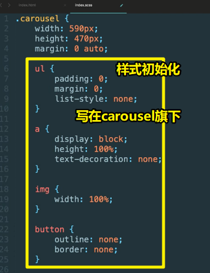
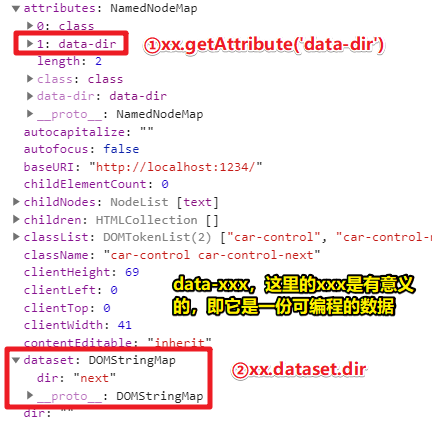
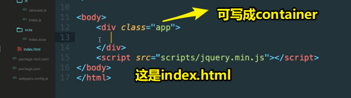
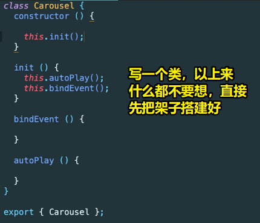

# 面向对象深度实战（1）

## ★TPR？

**1）Webpack环境搭建？**

拿着老师提供的 `webpack.config.js` 配置来练就好了，毕竟，webpack里边的loader、plugin这些写法的更新特别勤快！一般在公司里边不会轻易地去升级这些工具，所以拷贝老师的配置就好了，无须搞最新版的！

如果你用上了最新版，那么这些plugin、loader的配置，最后就是去github、npm上看看在最新版的webpack里边是如何配置的！千万不要去百度里边搜索，毕竟这些配置适用webpack哪个版本是不明确的！

总之，你要添加新的loader、plugin的话，那么就往老师提供的配置文件里边添加就好了，对了，别忘了Webpack是哪个版本哦！

> Webpack配置里边，供我们学习用的常用的件其实并咩有几个！总之，拷贝老师提供的配置就足够了！如果工作上需要添加新的loader和plugin，那就找到相应的webpack版本，然后自行看英文官网配置loader和plugin呗！

**2）插件的样式初始化？**

不能影响全局的样式哈！毕竟这只是个插件！总之，插件的样式只能影响自己的！



**3）轮播图底部的小点排成一行，由于是 `inline-block`，因此它们之间是有间隙的？**

用`font-size:0;`解决了这个间隙，不过如果有其它方案的话，那就不要用这个方案的了，总之 `font-size:0;` 这个方案在不得已的时候可以用，千万不要乱用！

**4）在录播图里边，为啥左按钮和右按钮的结构里边没有图片？**

``` html
<button class="car-control car-control-prev" data-dir="prev"></button>
<button class="car-control car-control-next" data-dir="next"></button>
```

因为如果要用事件代理的话，HTML结构必须要尽可能的简单，因为如果有很复杂的结构嵌套的话，那么当你用上事件代理，用户在点击的时候，你就得多去判断一下哈！

所以这也是为啥用的是背景图片！即不希望button元素里边还有结构，而如果还有结构的话，那么事件代理就不好整了，如这样：

``` html
<button class="car-control car-control-prev" data-dir="prev">
    //or svg icon之类的
</button>
```

那么当我们点击button里边的元素，还得判断一下 `data-dir`这个属性！

因此，我们在写轮播图底部的圆圈点的时候，就写了一个很简单的结构：

``` html
<div class="car-indicator">
  <i class="indicator-btn active"></i>
  <i class="indicator-btn"></i>
  <i class="indicator-btn"></i>
  <i class="indicator-btn"></i>
  <i class="indicator-btn"></i>
  <i class="indicator-btn"></i>
  <i class="indicator-btn"></i>
  <i class="indicator-btn"></i>
</div>
```

总之，要使用事件代理，那么请保证DOM结构简单！

> 这些圆圈点没有用float来让它们同处一行，而是用了 `inline-block`，为啥要用它呢？——因为它唯一的弊端就是圆圈点之间有间隙，但是其实我们的文字与文字之间也是间隙的，当我们用了 `font-size：0；`之后，间隙也就消失了，如果再用float的话，显然多次一举了！

**5）如果是个jQuery对象，那么变量名的前缀最好写个 `$`，如：**

``` js
this.$dom = $('#xxx')
```

而这样做的目的是为了好区分普通DOM对象与jQuery化的DOM对象！

**5）Webpack之图片打包？**

``` html
<li class="car-item active"><a href="" class="car-lk">" alt="" class="car-img"></a></li>
```

图片的`src`属性值是这样的：`<%=require('./images/1.jpg')%>`，可不是直接的相对路径 `./images/1.jpg`

**6）node-sass安装失败？**

为啥会失败？

> npm 安装 node-sass 依赖时，会从 github.com 上下载 .node 文件。由于国内网络环境的问题，这个下载时间可能会很长，甚至导致超时失败。

如何才能安装成功？

``` bash
npm i node-sass --sass_binary_site=https://npm.taobao.org/mirrors/node-sass/
```

➹：[整理 node-sass 安装失败的原因及解决办法 - - SegmentFault 思否](https://segmentfault.com/a/1190000010984731)


**7）关于轮播图的大小样式参考？**

可以参考京东的！如宽高为590px*470px，当然这也是一张图片的大小！

还可以参考[小米官网](https://www.mi.com/)的，老师写的样式几乎同小米官网的轮播样式！

**8）`jQuery(callback)`？**

当传进去的参数是函数的时候，则在document对象上绑定一个ready事件监听函数，当DOM结构加载完成的时候执行：

``` js
$(function(){})
//以上代码和下面的效果是一样的
$(document).ready(function(){
    ...//代码
})
```

➹：[jQuery中$()函数的7种用法汇总 - 谦龙的小天地](https://qianlongo.github.io/2016/03/26/jQuery%E4%B8%AD-%E5%87%BD%E6%95%B0%E7%9A%847%E7%A7%8D%E7%94%A8%E6%B3%95%E6%B1%87%E6%80%BB/)

➹：[【译】用原生javascript代替jQuery的Ready（）方法 - 简书](https://www.jianshu.com/p/f359a531a72a)

**9）在class里边，经常改变方法的 `this` 指向？**

因为方法需要操作很多咋们new出来的对象里边的一些属性哈！


**10）关于「联动」这个概念？**

轮播图自动滚动的时候，其里边的小点也会自动的跟着走！同样，你主动点击左右两个按钮时，也会自动跟着走！

**11）如何用JS拿到元素身上的`data-xxx`数据？**

有这样一行HTML代码：

``` html
<button class="car-control car-control-next" data-dir="next">
```

那么如果我们想要拿到 `data-dir`的 `next` 值，则可以这样做：



---

## ★淡入淡出轮播

> 这是面向对象的综合性实战，都是实现轮播图

### ◇为啥实战的是录播图？

1. 有很多人对轮播图实际上有惧怕心理的
   
2. 很多人不知道漂亮的代码是怎么写的，而小野老师会告诉你该怎么写，只要你跟着老师的思路一步步来就好了！
   
3. 轮播图其实并不是一个简单的东西，在很多企业里边都是用translate-3d来做轮播，毕竟该translate-3d可以开启GPU加速，因此效果会好一些，而一般现在来说不会用到jQuery的 `animate`API了，毕竟它的性能确实有点差哈！

### ◇How？

> 用ES6的class特性来开发一个真正的轮播图插件，轮播是一个大课题，因为它有淡入淡出、无缝滚动等效果，要完成这些效果等要花点心思才行，即便你知道了逻辑，但是你可能未必知道怎么写才是最好的！

**①目录结构**

1. 创建一个 `src/icons/`，用于防止轮播图左右滑的左图标和右图标
2. 创建一个 `src/images/`：放置8张用于轮播的图片
3. `src/js/`：`carousel.js`是我们写轮播图的类，国外都用 carousel 来表示轮播！、`index.js`是入口文件
4. `src/scss/`：`index.scss`，日后开发项目都用scss来开发！在企业里边其实写scss是写得非常简单的，而且基本上不会用哪些花里胡哨的东西，除非有特别重要的东西，如复用，就用mixin、include提取出来！
5. `src/index.html`：主页面


**②布局**

一个挂载点：



HTML结构与CSS：

➹：[布局轮播图 · ppambler/xdmala-demo@7d9881e](https://github.com/ppambler/xdmala-demo/commit/7d9881e25c1040e59435c5f73563921687d949a7)


效果：


**③Carousel类**

**1）搞个架子先：**




**2）弄清楚这个轮播插件要配置什么：**

> 有speed，DOM结构里边的JS钩子，还有需要注入一下jQuery……

而这些配置，显然都是作为`constructor`的参数，即 new一个实例出来时，传给实例的参数！

``` js
import '../scss/index.scss';
import { Carousel } from './carousel'

$(function () {
  new Carousel(jQuery, {
    dom: '.j-carousel',
    speed: 3000
  })
})
```

**3）写代码逻辑：**

<mark>1、自动播放：</mark>

- `autoPlay()`
  - 搞一个重复执行的定时器，如每隔3s左右就得让轮播图run起来
    - run做什么呢？
      - 明确当前应该轮播到哪张图片
      - 切换样式，即让轮播到的那张图片的class为 `active`

> 因为写这个函数，以致于多了几个成员属性： `oCarItems`、`timer`、`curIdx`

➹：[完成轮播图的自动播放 · ppambler/xdmala-demo@8d3b564](https://github.com/ppambler/xdmala-demo/commit/8d3b564157c50ee75f86310ba6e5fffd745fa775)

<mark>2、鼠标移入轮播图停止，移出则继续自动run：</mark>

> 绑定 `mouseover`和 `mouseout`事件，执行 `mouseover`事件时，并传入一个 `in` 字符串数据，用于明确告知用户此时是移入行为，同理，如果用户从移入变为移出，那么就会执行 `mouseout`事件，为了明确是哪个事件同样也要传入一个 `out`字符串数据！
> 
> 之所以这样做的缘故，是因为我们只想写一个事件处理函数，然后利用 `switch`这个语法，来切换不同的代码逻辑！如 如果是 `in`的话，那么就把定时器给砸了！而如果是 `out`的话，那么就 `autoPlay`一下，即重新激活定时器！

➹：[鼠标移入停止轮播，移出继续轮播 · ppambler/xdmala-demo@d1e84c6](https://github.com/ppambler/xdmala-demo/commit/d1e84c643cc543d1bf99e7f81036cb13d3a1aa0b)

<mark>3、点击左右按钮以及小点也会滚动轮播：</mark>

> 使用事件代理，为JS钩子 `.j-carousel` 添加 `click`事件，这样只需要绑定一个事件处理函数就得了！然后根据点击的是`button`元素还是 `i`元素就去做相应的代码逻辑处理！

➹：[点击 button or 小圆圈点 ，也要轮播起来 · ppambler/xdmala-demo@5e90b2e](https://github.com/ppambler/xdmala-demo/commit/5e90b2e0f8965e47282e54ac88cfdbc05968a613)

**④最终效果**


---

## ★总结

- 请把轮播图看做是一个对象，一个活生生的有着属性和方法的东西，它杵在页面里边可以自行轮播图片……总之，它就类似于一台电风扇一样，我们 `new Carousel().init()`类似于为这台电风扇插上了电源，扭动了开关！

- 这是我看过思路最清晰的淡入淡出轮播图代码！

