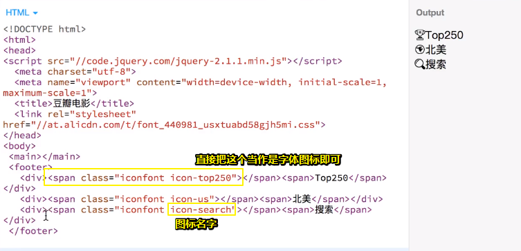
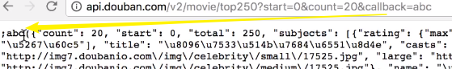
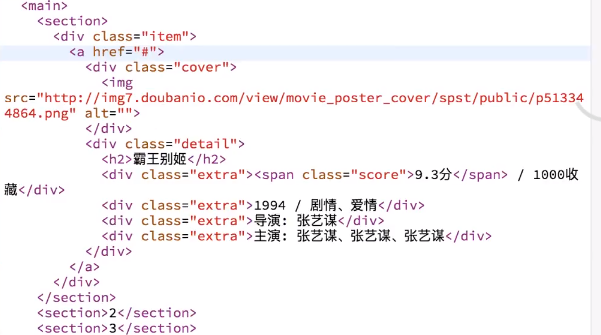

---

typora-copy-images-to: img\01
---

# 豆瓣电影（上）

## ★概述

### ◇效果

➹：[豆瓣电影](http://book.jirengu.com/jirengu-inc/js-works/projects/doubanmovie/index.html)

### ◇开搞之前的准备工作

#### 分析

分析：

1. 有个footer，其中有3个tab
2. 点对应的tab的话，会进行一个切换
3. 这是个单页应用，看起来是三个页面，实际上是一个页面

#### 预览页面姿势与移动端调试

预览页面&调试：

> 有时候在PC端的模拟移动端预览可以，但手机却GG了，如对一些API支持的不好等等……

1. 在做之前需要学会移动端的调试，可以在PC端中的浏览器里的开发工具中测试，测试好就用手机测试。不过PC可以通过控制台调试，但手机却是不可以的，那么如何在手机上调试，这又是一个问题了！

   

2. 手机调试：通过使用http-server，获取当前页面的局域网ip地址，然后就可以在手机浏览器上输入这个ip就可以浏览这个页面啦！

   

   不过手机上可无法调试，打log啊！

3. 如果url地址过长的话，难以输入的话，可以这样：

   1. 在PC端登录你的微信，把url发到文件传输助手
   2. 使用草料二维码即可： [草料文本二维码生成器](https://cli.im/text)，通过这个二维码，让手机扫一扫即可，如微信内置的扫一扫
   3. 使用js.jirengu.com测试即可，边写移动端的效果就会自动刷新，这样就可以立即看到效果了

关于手机端调试，即打开控制台：

用npm全局安装一个工具：


那么这个工具如何用呢？

1. 切换到你的项目下，然后 输入 `browser-sync`

2. 由于这是个普通的工具，显然其中的命令你是记不住的，一般我们会通过它的 `--help`或者直接输入这个 `browser-sync`查看这个工具命令提示：

   

3. 启动之后的效果：

   

   下面，那个UI是管理页面：

   

   接着，你要勾选remote（远程） debug：

   

   由于是第一次勾选了，为了安全起见可以重新启动server，接着回到 remote debug，点击勾选按钮下的那个链接：

   

   点击这个url，然后点开Elements这个选项：

   

   如果有报错了，我们就可以在Console看到了

   你在Console输入alert就会在手机浏览器上看到：

   

   以上就是移动端的调试姿势了！

了解了移动端调试姿势就可以开搞了

为了方便，可以看到实时的预览效果，就直接在jsbin中写代码好了

### ◇分析页面功能

1. 这是个单页的应用，而多页即是每次tab切换又是一个全新的页面，只是这三个页面的footer都是一样而已
2. 我们可以借助框架来实现单页，但在这里我们还是通过原生JavaScript来实现！
3. 第一页，我们通过豆瓣电影免费提供的API接口来20、20的来渲染数据，而不是250条数据一次性发过来，如果是这样的话，那么页面就会卡死了！
4. 第二页跟第一页差不多
5. 第三页是搜索查询，然后同样是渲染数据

## ★开搞

### ◇准备工作


> scale表示当你双击屏幕时，页面不会放大，因为我们希望这个页面做得更像APP，所以我们就加了这两句关于scale的话，总之用户在双击的时候，也不会让页面放大！
>
> ➹：[html - Difference between visual viewport and layout viewport? - Stack Overflow](https://stackoverflow.com/questions/6333927/difference-between-visual-viewport-and-layout-viewport)

写个title & 引入jQuery

既然要做移动端的项目，那么就得加上个`meta:vp`，如果不加的话，假设你在body中写了个h1标签，那么当你在移动端浏览栏时，这个字体就显得特别小了，就像这样：


> 为什么会有这样的状况发生呢？因为我们的屏幕本来就很大的，然后在移动端显示的时候就就进行了一个压缩哈！即页面认为移动端大概是980px这样的，为此就得充满这个屏幕，既然要充满，那么那些文本就得挤压缩小啊！

如果写上了，就像这样：


### ◇写HTML

我们这个页面分为两部分，一个是主要区块main，一个是footer

其中footer里面有3个tab，而且tab上面还有3个icon

> 通过iconfont弄图标，最终完成时，最好把icon的css给下载下来，因为放在iconfont里，很容易挂掉哈！



### ◇写CSS

#### 搞footer

①为了宽度计算方便，所以用了border-box——初始化css

②默认字体为12px，毕竟在手机上这些文字一般都很小哈！至于font-family就用手机的默认字体即可——定义基调

③写footer，如果你打算用固定定位的话，我劝你不要这么干！因为移动端会对此会有很多bug，所以一般来说我们不用fixed，而是用……如`calc()`、`position:absolute;`……

而单位则是用vw和vh，这就是移动端和PC端的差异了


接下来对footer搞绝对定位，为了撑开的这个盒子，我们需要给个100%的宽度，不然无法撑开哈！

> 对body加了relative居然会收缩，所以加了个`height:100%`


接下来，这些tab有一个切换的效果，所以我们需要对footer的div加上个class（如active），用于表示不同的状态！

有了active的div表示这个tab是被选中的，所以需要对active搞写样式声明，如文本颜色变红等等……

④我们的页面内容是可滚动的，即把这个窗口变成main了，即滚动就在这个main里做滚动：


以上的样式，让我们的页面有了个基本的雏形了！

#### 搞main

一个tab，对应一个区块，那就用section好了

测试：默认情况下第一个section是展示的，当我们点切换的时候，让对应的页面给展示出来即可！

1. 把所有section都给`display:none;`，然后main中的第一个孩子为 `display:block;`即可

2. 写JavaScript代码：

   

> 我在想多次点同一个tab的话，会不会有重置的效果？即再次点北美，然后2再次淡入出现哈！
>
> 所以是否需要判断当前所点击的对象是否已经别激活了呢？如果被激活那就不用fadeIn()了呀!

接下来就写对应的页面了

那么第一个页面该怎么写呢？

1. 发个请求，获取数据
2. 获取完数据之后拼装DOM，然后再放到页面上

以上是第一步，之后去滚动的时候再去获取数据，再放到页面上！

> 一开始实现的时候，不要去考虑代码的逻辑，只需要考虑功能上的实现，当然更不用说让代码变得更漂亮，写得更合理，以及复用什么的
>
> 总之一开始做的时候不用想太多，先实现这个功能即可！

那么这个功能是什么呢？

1. 先去获取数据，所以要写个ajax去发请求

> 我们要找到豆瓣电影api的开发文档才行：
>
> 不知怎么回事，豆瓣开发者api挂了，不过数据还是可以拿到的，当然我们可以通过页面的缓存找到以前的页面：
>
> ➹：[豆瓣Api V2](https://web.archive.org/web/20150912090540/http://developers.douban.com/wiki/?title=api_v2)
>
> 我们找到关于豆瓣电影的API：
>
> 
>
> 电影里边特别复杂的高级API和商务API不是直接开放的，而我们能用免费的就只有这个`movie_basic`
>
> 而其中这里边的接口有很多，但能用的也没有几个，如我们可以获取电影条目信息，即获取电影详情
>
> 还有就是影人条目信息、电影条目搜索、Top250、北美票房
>
> 
>
> 所以我们能实现的功能就只有这几个免费给我们提供的API

### ◇写JavaScript

#### Top250

它的接口是这样的：

```
GET /v2/movie/top250
```

我们只需要向这个接口发送请求即可

至于参数是可选的

其中有start和count

前者可以解决我们一下子不是获取250条，而是10条、20条这样的

那么获取哪十条呢？——就是从start开始


那么我们可以得到什么数据呢？——我们只能通过请求响应成功后所得到的数据观察得知

那么我们如何写这个ajax呢？


所以：


不过跨域了……


> 服务器那边并咩有设置允许我们跨域请求的响应头

既然我们无法直接去发ajax请求，那么该咋办呢？

我们知道该豆瓣api平台是提供给我们用了，但是现在你可以看见我们用不了

于是我们做了以下测试：


可见，可以直接打开

那么我们搞个callback看看能行不？



加个callback也行哈！

所以说「这个接口是支持jsonp格式的调用的！」

既然支持了，那就so easy了！

我们直接把dataType换成是jsonp：


结果：


然后我们就来分析这个数据，看看有哪些字段，有怎样的数据，如这里的subjects，有20条数据

我们知道了有哪些数据以后，就可以拼装这些数据为一个dom，然后放到页面上了

拼装数据：

如果往done函数里拼装的话，这样代码就糅在一起了，而这样未免显得太复杂了吧！所以我们特意写一个函数来专门做拼装数据的活儿！如`setData(data)`

那么接下来的问题就是「我们得把dom拼装成啥样？」

这个时候我们显然是不知道的，但是我们可以在HTML里面写好呀！然后写CSS，写完之后就把HTML给去掉，然后通过JavaScript把这个DOM拼好就可以了！



为什么要这样写？

1. 有很多项，所以用了个item，当然你也可以写一个ul li
2. 由于整个内容都是可点的，我们就用个a链接来包裹它们，既然a标签要包裹，那么a的display必须要是block才行哈！

成品效果：


这个成品效果没有体现评分哈！真实效果其实是这样的：


> 有评分的话会好很多呀！因为这就是这部电影之所以在这个列表里的说服力啊！

CSS：


> 可以用浮动，不过做移动端项目还是用flex好！
>
> 对了，你还得一开始就把a链接的下划线给去掉哈！就像这样：
>
> 

效果：


那么接下来我们就要把那些数据生成很多个像图片中所表现出来的这种dom

生成好之后，就把这些dom放到第一个section里边去

既然如此，那么这些数据该如何拼呢？——你要知道我们拿到的是一坨数据，所以我们需要拿到相应的数据然后拼接起来，所以这一块就要考察我们对JavaScript的基本功了，即遍历数组，拿到数据进行一个拼接！

不管如何，这一块我们是可以做出来的！

那么如何去做呢？——做的时候有两种方法，第一种是你直接去拼接HTML字符串，比如说我们可以去生成一个字符串，然后把它加起来，遇到这个变量就获取这个数据然后加起来

但是直接去拼接HTML字符串的话，会有一点问题是什么呢？

假设这个数据不是安全的，


那么会导致XSS攻击

> 一般是评论的时候，有人提交带有script标签的内容，然后服务器端自然而然就拿到这个数据存到数据库里了，接着用户在浏览这个页面的时候由于需要获取评论数据，那么只要前端代码是通过innerHTML来拼接数据的话，那么就会执行这个脚本了！所以这个很不安全，总之这不是这个网站所属者所弄得代码……

所以我们咋办呢？——不去拼接字符串，而是直接创建这个节点，然后把这些内容作为innerText给放进去

那这样一来，即是输入的是带有script标签的东西，那么页面上所展示的也是这个script的东东，而不是去执行它！

好了，直接开搞吧！

1. 遍历数组，把每一项生成一个dom节点，然后放到页面上

关于生成 一个dom有很多方法，可以一个一个来，一个个添加，也可以一次性搞……当然这个用vue等这些框架就方便很多了

那么问题来了：「由于字符串是一大段的，总不能放在一行吧？这样未免可读性太差了吧！所以我们就得换行了，既然换行，显然会有问题吧！」

第一种姿势：啰嗦姿势


> 这里的反斜杠把换行 `\n`给GG了，这样一来，此换行就不是换行了
>
> ➹：[javascript反斜杠 “\” 的有什么特殊作用？_百度知道](https://zhidao.baidu.com/question/710920044765763685.html?qbl=relate_question_7)

可见，我们通过这种姿势写了很多行的字符串

第二种方法：不需要加斜杆，直接用加号


> 再次强调为啥不写在一行里去？因为多行姿势可读性会更好一点，不然写在一行里边看不什么名堂哈！

第三种方法：ES6姿势，这个在手机上也支持哈！


显然我们选择第3种姿势

利用jQuery提供的API，我们可以直接把这坨字符串弄成是dom节点


> 话说这个`eq(0)`的0是不是得要动态变化一下，毕竟 `.append()`是在每个匹配元素里面的末尾处插入参数内容，难道老师写错了？
>
> 
>
> 应该是我理解错了append
>
> 所以每次对同一个元素append，那么后来的append始终会追着尾巴跑咯，其中边界是下一个相邻的兄弟元素
>
> 我觉得jQuery应该是做了优化，书写顺序是有关系的，把后来的append接到末尾，然后一次性追加哈！可能是做了缓存操作什么的！
>
> 可是遍历呢？或许会等遍历完后一次性追加到section里的第一元素里去！
>
> 我想了想老师的demo似乎是写错的，因为那些item似乎没有被section包裹住呀！
>
> ```html
> <main>
>     <section>1</section>
>     <section>2</section>
>     <section>3</section>
> </main>
> ```
>
> 定位到第一个section元素，然后再其尾巴里添加东西
>
> 于是，我就去看看我写的demo：
>
> 
>
> 结果可以看到是作为一个子元素被append的！
>
> 所以「 `.append()`是在每个匹配元素**里面的末尾处**插入参数内容」这句话的意思就是：
>
> 匹配了一个元素，然后把参数内容作为一个子元素插入到同级子元素的末尾处！
>
> 所以，老师没错，还是我的理解错误！

最终 `setData`的 代码：


---


为此，我们第一步就完成了

第二步就是滚动到底部再去重新获取20~40的数据了，然后再去拼装dom，然后扔到页面里去渲染了！

明白需求后，那就开搞吧！

问题：

**①如何判断我们把页面滚动到底部呢？——有很多方法**

1. 可以搞个看不见的元素放在尾巴里边，一直滚动的话，那么最终这个不看见的元素就会出现在视窗里边了。如果元素出现在视窗里边，那就做xxx事情呗！

2. 拿到一些数据：

   

**②发请求的参数要变掉了，以前是start为0，那么现在就是start为20了**

所以我们需要一个变量，告诉我从哪个地方开始获取，为此我们可以定义一个全局变量，然后……

> 我们不需要到底了再去发请求，毕竟这有点太苛刻了，所以可以减个10px，再搞事情


> 可以用小于等于的：
>
> 
>
> 用小于等于不太好，毕竟在10px这段时间里，会发了很多次请求
>
> 

虽然效果有了，但是还有很多细节需要处理，如：

1. 如果滚动到了最后同时连续发了很多个请求，那么我如何去不让它同时发那么多请求，必须等一个请求完了之后，我再发另外一个请求
2. 如何在底部加个loading
3. 进行tab切换又要发请求了，那么这个时候我该如何去做呢？那么这中间会不出现一个混到一起的这种感觉呢？
4. 其它tab页面的里列表其实跟top250里的内容其实是长得一个模样的，那么我们就得看看能否复用了？

5. 把代码写得更漂亮一些，如把复用的东西放到Helper这个对象里边，还有看看我们页面的整个结构：

   

   那么这个init()做了什么事情了？其实就是调用一个初始化，第一个实现了footer的功能，第二个去初始化我们三个页面，其中每个页面都是一个独立的东西，只要执行了`Top250Page.init()`这句话，那么相当于第一个主页面的功能就有了，而且你也不用去管它发生了什么事情，就认为执行完成它之后，它就有了，如此类推……

   那么这个东西是什么呢？就是一个对象哈！

   

   调用init就执行……

   虽然看得很复杂，但是实际上这没有什么复杂的，其实我们以前学过，只是我们留意它，但是现在我们把学到的东西跟实际的场合结合起来，你会发现这样写或者说组织代码的姿势有什么好处了

## ★总结


## ★Q&A

### ①移动端的一些概念？

布局视口：没有设置 `meta:vp`，那么一般在手机端浏览页面的布局视口大概是980px

视觉视口：你无法改变哈！就是那些设备的尺寸，如iPhone4~iPhone5S: 320*480px

完美视口：类似于布局视口，但宽度和视觉视口相同，这就是完美视口（ideal viewport），有了完美视口，用户不用缩放和拖动网页就能够很好的进行网页浏览。而完美视口也是通过viewport meta的某种设置来达到。

> 移动端的浏览和PC端的浏览看来是两个概念啊！

➹：[移动前端第一弹：viewport详解 - CSS探索之旅](http://blog.doyoe.com/2015/10/13/mobile/%E7%A7%BB%E5%8A%A8%E5%89%8D%E7%AB%AF%E7%AC%AC%E4%B8%80%E5%BC%B9%EF%BC%9Aviewport%E8%AF%A6%E8%A7%A3/)

### ②`display:none;` 和 `visibility: hidden`的区别？

>  `visibility: hidden` 与 `display: none` 是不一样的。前者隐藏元素，但元素仍占据着布局空间（即将其渲染成一个空框），而后者 (`display: none`) 将元素从渲染树中完全移除，元素既不可见，也不是布局的组成部分。

➹：[渲染树构建、布局及绘制  -  Web  -  Google Developers](https://developers.google.com/web/fundamentals/performance/critical-rendering-path/render-tree-construction?hl=zh-cn)

### ③ `this`和 `$(this)`?

后者显然是个jQuery对象哈，可以使用自己旗下的API哈！总之后者的功能要比前者厉害，当然前者有些的操作显然是后者不具备的，即后者不是说兼容前者的！

jQuery对象它是个伪数组（我改成一个div也是如此）：


> 其实这是把this对象包装成jQuery对象罢了！好让我们可以使用jQuery所提供的API去更方便操纵DOM等等

➹：[JQuery -- this 和 $(this) 的区别 - RicoRui - 博客园](http://www.cnblogs.com/RuiLei/archive/2009/08/20/1550804.html)

### ④其它jQuery API？

**①index()**

返回指定元素相对于其他指定元素的 index 位置，如果未找到元素，index() 将返回 -1。

没有参数，那就是相对同胞元素的姿势—— `$(selector).index()`，总之结果是父元素的第一个子元素是index 0

有参数，那就相对于选择器—— `$(selector).index(element)`，总之结果是element相对于selector的index，即把selector的index当作是0哈！

➹：[jQuery DOM 元素方法 - index() 方法](http://www.w3school.com.cn/jquery/dom_element_methods_index.asp)

**②click()**

➹：[.click() : 为 JavaScript 的"click" 事件绑定一个处理器，或者触发元素上的 "click" 事件。 - jQuery API 中文文档 - jQuery 中文网](https://www.jquery123.com/click/)

**③hide()**

没有参数，`.hide()`方法是最简单的方法来隐藏一个元素

```js
$('.target').hide();
```

匹配的元素将被立即隐藏，没有动画。这大致相当于调用`.css('display', 'none')`，但`display`属性值保存在jQuery的数据缓存中，所以`display`可以方便以后可以恢复到其初始值。如果一个元素的`display`属性值为`inline`，那么隐藏再显示时，这个元素将再次显示`inline`。

➹：[.hide() : 隐藏匹配的元素。 - jQuery API 中文文档 - jQuery 中文网](https://www.jquery123.com/hide/)

**④eq()**

减少匹配元素的集合为指定的索引的哪一个元素。简而言之就是从10个人中选择一个人单挑！

➹：[.eq() : 减少匹配元素的集合为指定的索引的哪一个元素。 - jQuery API 中文文档 - jQuery 中文网](https://www.jquery123.com/eq/)

**⑤fadeIn()**

通过淡入的方式显示匹配元素

➹：<https://www.jquery123.com/fadeIn/>

**⑥siblings()**

语法：`.siblings( [selector ] )`

获得匹配元素集合中每个元素的兄弟元素,可以提供一个可选的选择器。。注意存在自身也会被匹配的可能，因为直接子元素中多个元素存在同样一个类，就像这样：

```html
<ul>
  <li>Eight</li>
  <li class="hilite">Nine</li>
  <li>Ten</li>
  <li class="hilite">Eleven</li>
</ul>
<script>$(".hilite").siblings().css("color", "red").length;</script>
//这4个li都会变红哈！
```


所以最好还是一个类：

```html
<ul>
  <li>One</li>
  <li>Two</li>
  <li class="hilite">Three</li>
  <li>Four</li>
</ul>
<script>$(".hilite").siblings().css("color", "red").length;</script>
```


如果有参数，那么它的兄弟姐妹得有某些标志才行！简单来说就是多了一个「且」

```html
<body>
  <div><span>Hello</span></div>
  //这个Hello Again会变黄
  <p class="selected">Hello Again</p>
  <p>And Again</p>
<script>$("p").siblings(".selected").css("background", "yellow");</script>
</body>
```


可见div这个元素被GG了，因为我们有了「且」是兄弟为 `.selected`的！

➹：<https://www.jquery123.com/siblings/>

**⑦addClass()**

每个匹配的元素添加指定的样式类名

注意：这个方法不会替换一个样式类名。它只是简单的添加一个样式类名到元素上

还可以添加多样式类名：

```js
$("p").addClass("myClass yourClass");
```

这个方法通常和`.removeClass()`一起使用，用来切换元素的样式, 像这样：

```css
$("p").removeClass("myClass noClass").addClass("yourClass");
```

这里, `myClass` 和 `noClass` 样式名在所有段落上被移除， 然后 `yourClass` 被添加。

当然，我们还可以动态的添加class，即使用函数参数哈！其中返回值就是要添加的class

➹：<https://www.jquery123.com/addClass/>

**⑧removeClass()**

 移除集合中每个匹配元素上一个，多个或全部样式。

➹：<https://www.jquery123.com/removeClass/>

> 突然感觉了解了一下jQuery的API之后，对Vue的认识有了更近的一步了解了！

**⑨scroll()**

为 JavaScript 的 "scroll" 事件绑定一个处理函数，或者触发元素上的该事件。

不带参数的用法是 `.trigger('scroll')` 的快捷方式。

当用户在元素内执行了滚动操作，就会在这个元素上触发`scroll`事件。它适用于`window`对象，但也可以是可滚动frames与CSS `overflow`属性设置为`scroll`的元素（或`auto`时，元素的显示高度小于其内容高度）。

➹： <https://www.jquery123.com/scroll/>

### ⑤`$.ajax({})`中的选项dataType值为jsonp？

dataType：预期服务器返回的数据类型。总之就是要把拿到的数据默认进行某种处理哈！

而我们这样：


就是把数据默认通过jsonp姿势搞一遍后就把异步的响应结果给done函数参数哈！——在这里我并没有去想jQuery的内部源码是如何实现的哈！

> "jsonp": 以 [JSONP](http://bob.pythonmac.org/archives/2005/12/05/remote-json-jsonp/) 的方式载入 JSON 数据块。会自动在所请求的URL最后添加 "?callback=?"。默认情况下不会通过在URL中附加查询字符串变量 "_=[TIMESTAMP]" 进行自动缓存结果，除非将 `cache`参数设置为`true`。

我们知道，要完成跨域请求有好几种姿势，其中一种是用jsonp，只要它人所提供的api支持jsonp调用的，那我们就可以拿到数据了

那么如何判断我们所拿的数据是否支持jsonp呢？


直接搞个callback字段，然后搞个函数名……

注意，豆瓣api文档并没有给出这些api接口能否支持jsonp


➹： <https://www.jquery123.com/jQuery.ajax/>

### ⑥关于转义字符？

> HTML中<，>，&等有特殊含义（<，>，用于链接签，&用于转义），不能直接使用。这些符号是不显示在我们最终看到的网页里的，那如果我们希望在网页中显示这些符号，该怎么办呢？
>
> 这就要说到HTML转义字符串（Escape Sequence）了。也称字符实体(Character Entity)

➹： [常用HTML转义字符,html转义符,JavaScript转义符,html转义字符表,HTML语言特殊字符对照表(ISO Latin-1字符集) - 来源：嘻嘻网 114.xixik.com](http://114.xixik.com/character/)

