# 豆瓣电影（中）

## ★概述

之前做了一个关于豆瓣电影移动端的页面，那么这节课我们就来继续优化这个页面，去完成它的功能，在完成的过程中你会发现我们的代码会越写越少，然后之后再对我们的这个代码进行一个优化！让整个页面的代码的功能逻辑性会更强、组织会更合理一些！

## ★回顾上节课完成的效果

1. 页面的底部是个footer，其中有三个tab，而这这是一个单页应用，通过tab可以切换到相应的内容

2. 接下来到了首页，即第一个tab的内容，一开始默认就是进来这个top250的tab的，就会自动的获取数据，基于性能考虑，所以一次性不能获取所有的数据，即250条数据，所以这其中涉及到分页的概念。于是我们定义一个全局变量`index=0`，所以一开始获取的是从0开始的20条数据！获取到数据之后，我们就通过setData对所拿到的数据进行一个渲染，当然，渲染之后，index的值就变成了20，即类似于 `data[0]~data[19]`、`data[20]~data[39]`……

   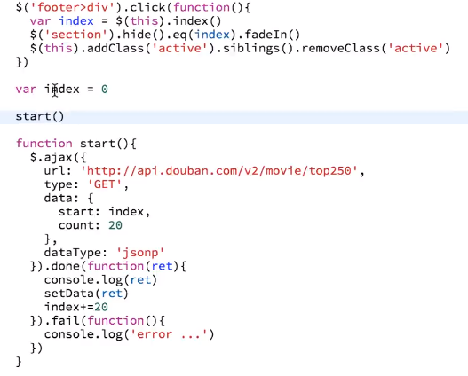

3. `setData(data)`这个家伙是如何搞事情的？分析所拿到的数据，其中有个subjects字段，它是个数组，我们通过遍历它拿到20条电影条目。在遍历的过程中，我们创建了一个字符串模板（一个电影条目的壳），然后把需要展示到页面上的数据给填充进去！

4. 如何填充数据呢？——借用jQuery所提供的API，把整坨字符串模板弄成是一个jQuery对象，接着就是找元素(`find()`)，即匹配元素，通过 `attr()`、`text`这两个API来填充内容

   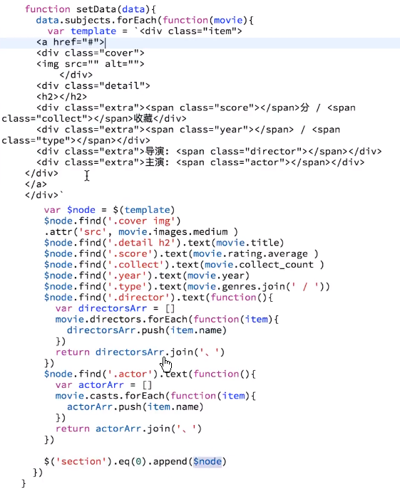

5. 数据都填充好或者说是设置好之后，就把这个已经填充数据的字符串模板dom对象，给扔到三个面板中的第一个section里边去，这个可以通过 `append()`做到，当然，在此之前你需要通过 `eq()`匹配到第一个section才行！接着浏览器就会自动渲染这些dom了！这样你就可以看到一个还不错的页面效果了！

6. 此时页面的大致效果如下：

   

7. 滚动懒加载，当我们滚动到页面底部的时候，那么需要做什么事情呢？我们需要去监听滚动事件，当这个main发生了滚动的时候（我很好奇为啥不是监听section，你就内容的变化不是在section里边吗？照理来说应该是第一个section里的滚动条才对的哈！），然后我们需要去判断是否到达了底部。那么如何判断是否到达了页面的底部呢？借助某些api，拿到一些数据，如section里边的内容高度（a）、mian里边滚动内容的距离（b）、窗口（main）的高度（c），这三者是有关联的，刚好组成一条公式，即`a=b+c`。

   如果公式成立，即为true的话，那么这就表示滚到底了！为了不滚动到底才加载数据，我们可以提前个几十像素来做个请求缓冲，这样用户一滚动底时，就会让人感觉这过渡动画，没有搞很久就有数据出现了，显然这用户体验好很多哈！

   有了判断条件，只要为true，就再做一次之前的操作就好了！即执行`start()`函数

   不过这其中存在一个问题：那就是我们需要去做一些节流，不然滚动到最后一点点的时候，鼠标稍微上下动一下的话，那么条件就都会满足，然后这个start函数就会连续执行很多遍了 ，而一次start就会发送一次请求，所以我们就得做节流才行！

   假设不做节流的话，那么需要注意的是，我们发送这个请求的时候必须一次只能有一条，换句话说，我这个请求发过去以后，如果这个数据还没有到来，我再发请求，你就不要去执行它了，所以我们现在需要一个状态的判断，比如说一个加锁机制或者说一个函数节流方法机制！

   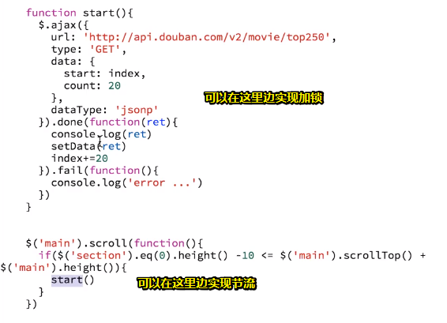

   那么在这里边，我们简单点就做个加锁就好了！那么是什么样的加锁呢？之后讲！

以上操作就实现了我们整个页面的基本逻辑了！

那么现在我们需要对整个页面进行一个优化

而第一个操作就是对数据进行一个加锁！

第二个就是对样式的优化，比如说一开始在我们加载数据的过程页面上会出现一个loading，当我们滚动到底部的时候，又要加载数据了，这就又出现一个loading了，当数据到了之后，loading就会隐藏！这就是一个UI的优化了！

> 我开始明白一些优化操作无须一开始就弄上，先把页面的基本逻辑给弄出来之后，才考虑这些细节层面上的东西！

第三个：实现「北美」、「搜索」这两块的功能！

## ★加锁

什么是加锁呢？

假设我们连续执行了很多次star函数，即发了很多请求！

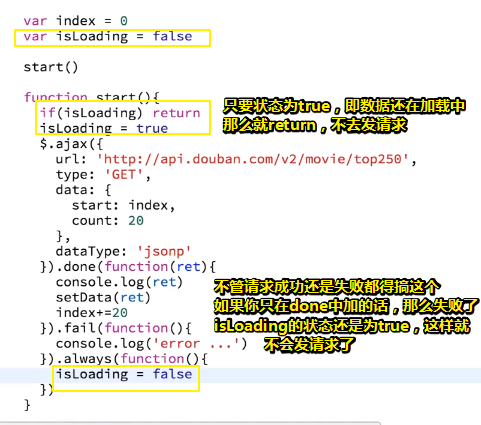

> 突然觉得用es6的Promise语法比jQuery好使啊！
>
> 这个加锁操作似乎我之前在vue中使用过！

## ★加个loading

很多地方都需要loading

如我们可以在第一个section里边加，也可以在main的尾巴加，就像这样：

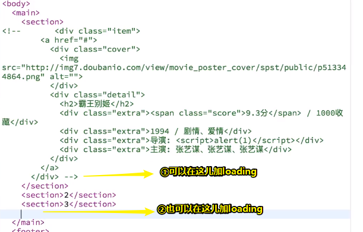

如果在②位置加的话，那么这3个页面都会用这个loading，所以我们就得看看这个loading是否和相应的tab的样式吻合……

为了简单起见，我们用①位置

那么loading是什么呢？——就是一个简单的转圈

那么我们该怎么做了？

可以用一张一直转圈的gif图片，不过遵循能不用图片就不用图片原则，那么我就用字体图标好了，但是字体图标就是一个文字，它是不转圈的！所以我们可以加上css3动画，让它无限地转圈

所以我们先搞个字体图标：（有套路的写法）

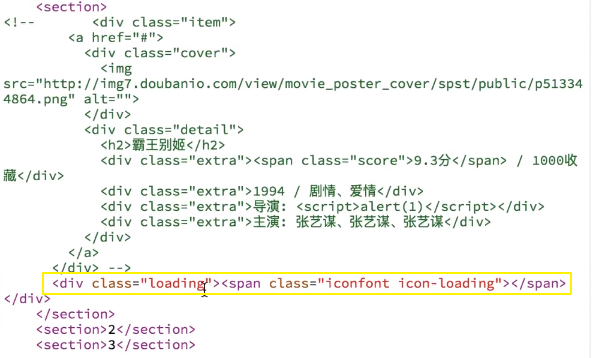

> 字体图标所在的span始终会有两个class，当然，官方文档有说道：
>
> 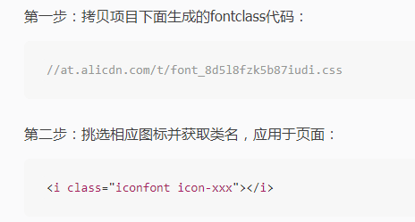
>
> 这两个class之所以写上的缘由：
>
> <http://at.alicdn.com/t/font_8d5l8fzk5b87iudi.c>
>
> 你会发现其中有类似这样的样式
>
> ```css
> .iconfont {
>   font-family:"iconfont" !important;
>   font-size:16px;
>   font-style:normal;
>   -webkit-font-smoothing: antialiased;
>   -moz-osx-font-smoothing: grayscale;
> }
> 
> .icon-tuichu:before { content: "\e604"; }
> ```
>
> 所以你必须搞上哈！
>
> 总之你就把这个span当作是字体图标就好了！

选择好合适的字体图标好，就更新一下那个关于字体图标的链接！

添加动画：

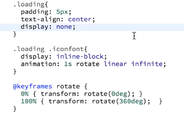

解释：

1. 居中，默认情况需要隐藏，当我们需要展示它的时候才去展示，比如说我们在发请求之前展示它，当数据到来之后，才让它去隐藏，所以默认情况下就给它为 `display:none;`

   你要知道loading表示告诉用户我们的网络正在加载，所以JavaScript可以这样写：

   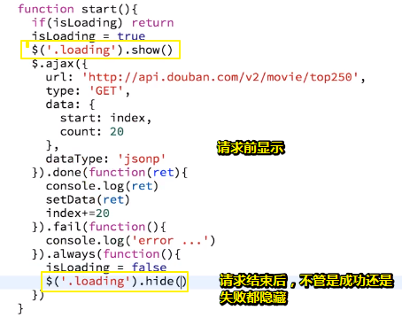

2. 字体图标必须是inline-block，如果是block的话，就会这样：

   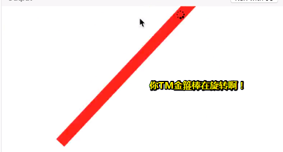

   而inline-block则是这样：

   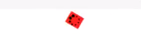

   显然选择inline-block哈！

   给这个元素加上动画，然后动画的执行时间是1s，动画的名称是下面那个rotate哈！接着均匀旋转（也就是匀速），而且还有无休止的，如果没有infinite的话，那么旋转一圈就GG了！

   注意这是1s就执行一个旋转，即完成一个动画，这其中我想会有60帧或者是24帧的过程……

3. 一个动画是由很多帧构成的，在这里这个关键帧的名字叫做rotate，用于定义动画（旋转）的效果，而rotate里边有个百分比，表示 一个进度、状态，`0%`表示在一开始的时候，旋转是0度，到最后 `100%` 是旋转360度，所以这就是一个动画啦。

然而完成了以上操作之后，有bug了

即append元素的结果是在loading下面，这导致loading一直在电影条目的上边

所以我们得再搞个容器用于装电影条目，这样loading就一直在下边了，只要第一次的时候才会顶部loading，之后都是在底部loading了！

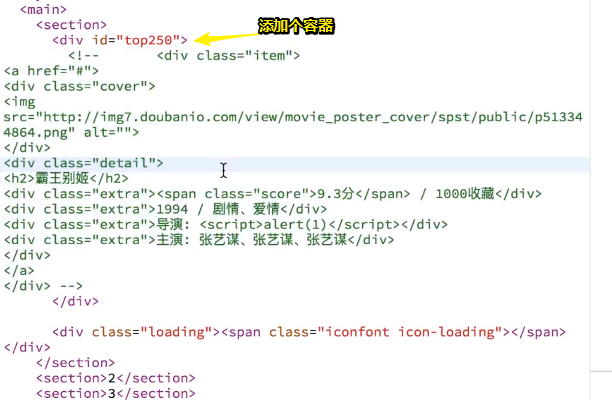

所以往容器添加DOM节点的姿势也要改了：

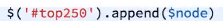

效果：

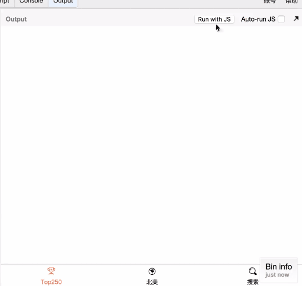

## ★函数节流

函数节流是什么东西呢？

就是当下面这个东西如果会频繁执行的时候：

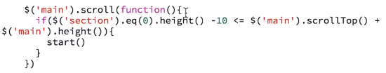

我不想它执行太快，而是以最后一次为最终的执行结果

那么代码该如何实现呢？——请看下边：

> 节流：可以是截留，一般叫节流，即节省它流量

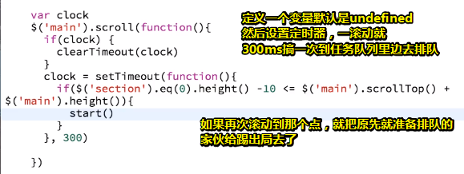

> 话说清除定时器，是清除还咩有到300ms就砸了这个闹钟，还是已经在排队了，然后把它扔出任务队列里去？
>
> 我觉得很有可能是前者额……
>
> 因为闹钟砸了，回调函数就不执行了呀！如果已经在回调队列里排队的函数，那么此时还能揪出去吗？毕竟setTimeout的任务已经完成了啊！
>
> 总之300ms之后再执行一次判断，不然，就把上一次还在定时中的家伙给砸了，用这次新的定时器，可是这样岂不是会把成功的给砸了吗？那万一我滚动到最后的10px，然后又滚上去了，那岂不是没有发请求了？
>
> 先想想这最后10px的过程：
>
> 1. 刚好滚动「底部-10px」那个点，等300ms之后，就会判断，然后发请求
> 2. 突然手抖了一下，再向下滚了1px，此时由于callstack是空的，这个回调就开始执行了，而此时上一次那个家伙还在300ms之内，所以先把它给砸了，然后再换个新定时器，此时又重新计时了
> 3. 天杀的，手又抖了一下，然后同上操作
> 4. ……
>
> 如果手不抖了，那么这次请求是可以顺利发出去的，但是如果快速滚上去的话，那么这次请求岂不是GG了？
>
> 所以我为啥要做所谓的「节流」呢？——就是在距离底部的10px之内，只执行一次start，即只发一次请求，而上述代码就可以实现你这样的需求……
>
> 我的假想：
>
> 那么用户在最后10px，又滚上去了呢？——这证明用户真得不想继续看下去啊！所以这次就省了请求，如果它想看的话，显然又会拉下去，所以我们又可以做一次同样的操作了！
>
> 因此我们代码，因为又滚上去的操作，显然是「无心插柳，柳成荫」了……
>
> 不管如何，最后10px，我们只想发一次请求，而不是多次！
>
> 思于至此：
>
> 我再次回顾 对[②](#er)的回答，然后看了其中一篇博文对函数节流的定义阐述：
>
> 「规定一个单位时间，在这个单位时间内，只能有一次触发事件的回调函数执行，如果在同一个单位时间内某事件被触发多次，只有一次能生效。」
>
> 所以这就是函数节流，老师说得没错哈！但是当我们超过300ms之后，再向下滚动了一次之后，此时还是会再次执行start啊！
>
> 所以老师设置的这个300ms应该是满足一个10px的滚动，可是万一用户停顿了一下，超过300ms，然后再滚下去了呢？所以这次请求显然又发出去了……
>
> 所以，我TM无语了，话说一个300ms是多久？我们一次操作又是多久时间？

话说，这个代码到底是什么意思呢？

一开始定个变量叫clock，此时它一开始的值就是undefined的，所以`if(false)`就不执行了

然后300ms后执行定时器里的回调

可是如果300ms以内，又去执行了scroll中的回调，那么这个clock就是有值了，所以就把上次那个定时器给清掉了，即上次的不算了，这次重新开始计算，同理，后面也类似，直到最后一次，300ms以内，也没有滚动了，那就去判断，然后执行这个start了！

所以这就是以最后一次为基准了！

> 似乎可以减少滚动的n次判断哦！毕竟你滚动速度实在是太快了，300ms这段时间内肯定会有多次重新砸上一次的定时器，这样核心代码就始终没法执行了，除非用户停顿了300ms，但就一般而言的话，用户唯有滚动到底看到个菊花（loading）或者是浏览滚动途中的信息才会停止滚动吧！
>
> 假如用户滚到底就停止了，此时又有内容渲染出来了，那么判断条件此时数据又发生变化了，所以又是一次周期性的搞事情了……

好了，目前而言，加个loading就实现了，而且在性能优化上有双重保障，即加锁和函数节流！

那么接下来，后面的功能该如何实现呢？

## ★北美

当我们点击「北美」这个tab需要做什么事情呢？——我们可以看看做好的效果

可以看到点击北美就会展示北美的内容，而这个内容是哪来的呢？同样是发送请求获取数据，然后给数据穿身衣服，然后就展示到页面上！

所以这个tab做了「一点击北美就获取数据，然后渲染到页面上」

当然我们还可以一进入到所谓的首页（top250），然后就顺便把北美的数据也给获取了，虽然这样做会很方便，但会遇到很多问题，如：

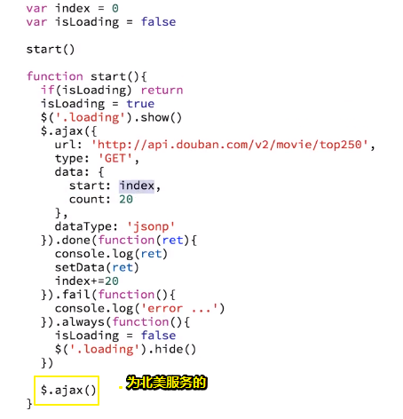

代码的复用，如

1. 需要加多次ajax，而startData还得搞一次是针对北美这个tab的
2. 我们的加锁操作会让另外一个ajax请求失效，即不会同时发多次请求。
3. 还有一个问题就是假设北美也需要分页的的话，而start函数里的index变量是专门为top250服务的，那么我们再用同一个start函数的话，显然会把index给混淆了！所以我们需要一个新的index变量才行

当然如果不需要代码复用的话，这还是很好解决的，即直接就再一套就好了，如你叫`xxxTop`的话，那我就叫做`xxxBeiMei`，如这样

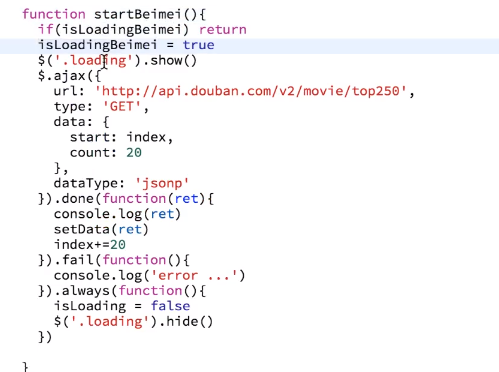


可见很多东西都要换，尤其是loading这个东东，同样得搞一套才行

虽然可以实现，但是感觉这些代码是可以混为一谈的，因此我对这代码极其不满意！毕竟有很多东西明明是差不多的，明明是一样的，为啥我还要写一遍呢？如index变量、isLoading变量等等这些标识符都要重新起个名字，这就有种挂羊头卖狗肉的味道了……

所以功能越复杂，代码的可维护性和复用性就越差！

那么我们该如何去做呢？——敬请留意下一节

> 先看优化后的代码，然后再去分析为啥这样写……


## ★总结


## ★Q&A

### ①动画？

➹：[CSS动画简介 - 阮一峰的网络日志](http://www.ruanyifeng.com/blog/2014/02/css_transition_and_animation.html)

➹： <https://jsbin.com/yinupeg/edit?html,css,js,output>

➹：[Animation（转）](http://stormhouse.github.io/posts/2013/animation/)

### <a href="#er">②关于函数防抖和函数节流？</a>

应用场景：

对于函数防抖，有以下几种应用场景：

- 给按钮加函数防抖防止表单多次提交。
- 对于输入框连续输入进行AJAX验证时，用函数防抖能有效减少请求次数。
- 判断`scroll`是否滑到底部，`滚动事件`+`函数防抖`

> 总的来说，适合多次事件**一次响应**的情况

对于函数节流，有如下几个场景：

- 游戏中的刷新率
- DOM元素拖拽
- Canvas画笔功能

> 总的来说，适合**大量事件**按时间做**平均**分配触发。

所以老师所说的应该是函数防抖咯！而不是函数节流？

➹：[浅谈javascript的函数节流 - AlloyTeam](http://www.alloyteam.com/2012/11/javascript-throttle/comment-page-2/)

➹：[函数防抖与函数节流 - 知乎](https://zhuanlan.zhihu.com/p/38313717)

➹：[轻松理解JS函数节流和函数防抖 - 掘金](https://juejin.im/post/5a35ed25f265da431d3cc1b1)