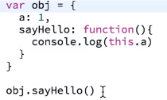
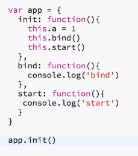
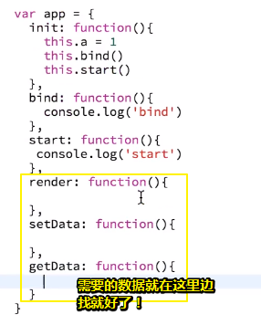
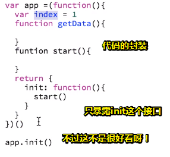

# 豆瓣电影（下）

## ★概述

之前的操作，已经实现了我们整个页面的基本功能了！但是，当需求变多之后，我们的页面变得难以维护，所以我们现在可以换换另外一种写法去告诉我们的页面说「老哥，之前那种姿势不适合你的成长，所以这次就换另外一种姿势来让你更好地茁壮成长！」

## ★开搞

### ◇缩小版

> 按凡人修仙传的修真等级划分

练气期：

显而易见，log的结果就是1啦！

筑基期：

> 换个名字，搞几个名字好听点的属性，如init、bind、start……这样就从凡人境升到练气境了

只需要init一下，就可以为app这个对象搞个属性，而且还可以调用它的两个方法……

为啥非要叫init、bind等这样的名字呢？——其实什么名字都无所谓，如xxx，yyy等等……app都是一个普通的对象，只不过是因为我习惯这样写哈！因为这样写的话，相当于把整个页面的逻辑都可以嵌套进去了，毕竟我们执行一个东西的时候，一开始不就是初始化吗？做完初始化后，我们是不是立刻就需要去绑定一些事件？所谓的绑定就是当用户 触发的时候就会去执行，绑定完之后，由于我们一开始就需要去执行一些东西，所以我们就再加上个start了！

所以，我们起的这些名字就感觉更形象一点了！

当然，你可以把这些东东变成一个套路，如我要做一个什么功能，然后init就是做一些初始化的东西（比如元素的选择），然后bind就是给这个元素去绑定事件，而start则是一开始需要执行的东西就放到start里边。在这样的基础之上，我们还可以为这个普通对象再添加一些方法：

言归正传，我们这样做到底有啥用？——显然整个页面就只有app这个全局变量了，很多关键的值都是作为app这个对象的属性而存在，所以假如说我们页面有两个类似于app这样的东西的话，那么它们之间的公用变量都不会产生相互影响！如app1有个滚动请求的初始index（用于获取电影条目起始点），而app2也有一个index，虽然都叫index，但是一个属于app1旗下的，一个属于app2旗下的，总之，它们是两个不同的对象，那么对应的属性也是不同的！当然，属性的值是可以相同的！

理解以上套路之后，我们写页面就按照这个套路去套吧！

后面你会发现，我们再去学习面向对象的时候，实际上写法也是和它（app）差不了多少的！而且去学习模块化的时候，也差不了多少，大不了就把这个app对象变成个文件，然后给导出去！还有就是我们去学习一些新框架的时候，如vue、react，你会发现其实用的套路就是别人写好的这么一个类似app对象的东西！你只不过是去填充这个框架定义好的方法，然后去用即可！

> 就像是`new Vue({……})`

说白了你可以把这个app对象当成是一个最入门的、最简单的这么一个框架，再次强调，**这其实就是一个套路，好让你去里边填东西！**

> 或者说，这就是组织代码的一种姿势，而且这种姿势在前端方面使用很普遍……
>
> 有了框架似乎可以让我们以很声明的方式去写代码！

还有另外一种姿势——代码的封装：

不让全局变量app可以访问getData之类的函数，只允许我们通过这个start函数去搞事情！

在这里我们还是使用第一种姿势！

### ◇正式版

#### 一些细节层面的东西

1. 从大到小开始处理这个页面逻辑，如先搞定footer的切换，然后针对三个tab的内容搞事情
2. 整个页面的入口是`App.init()`
3. 选择元素，最好在init里面就搞好了，这样修改起来方便
4. bind事件时，注意this的值为啥东西？是app对象还是什么的……可以使用箭头函数，或者在定义一个变量叫 `_this`的东东，然后就赋值给this，然后在事件的回调函数里边就用这个 `_this`就好了
5. 注意在init里，通过this为app对象添加的属性，其名字是否会和外层属性名冲突，如果冲突，那么外层属性名就加个下划线 `_`好了，如 `_start`
6. 如果这个对象不需要绑定事件，那么就不用添加bind属性了……
7. 先不要去管复用问题，先把最终效果做出来再说！
8. 如果这个tab只有一个请求的话，可以不用loading，随你喜欢
9. 用了这种套路去写代码之后，你会发现只要搞定其中一个tab，那么其它的tab都是一个姿势了！
10. jQuery获取输入框里的值是 `val()`而不是 `value`
11. 需要分析获取的数据有哪些字段，然后找到我们所需要的字段，就填充数据

#### 小结

1. 这样就完成了我们的功能了，不管是top250、北美、还是搜索，其实最难的还是top250。当你完成了top250，那么剩下的那两个tab只需要简单的拷贝一下代码即可，毕竟这其中大同小异哈！
2. 在实现过程中，用了套路之后，就可以感觉到逻辑甚是清晰！也不用考虑什么相互影响了！反正整个结构就是这样的：app里边有3个功能，然后先实现基本功能（tab切换），然后每个页面的功能再单独去实现，然后去实现的时候就按照这个套路去实现！
3. 存在的问题：
   1. 三个tab的内容数据都是一样的，而我们代码里边有个最长的代码，即render函数，而且在三个tab中这个render函数是99%一样的，除了一些基本的数据结构不一样之外，都一样！所以我们可以把render踢出来，复用一下！其中template有点不一样，所以不用管了！
   2. 如果北美和搜索还有很多数据，同样需要滚动后再加载数据的话，那么我们就可以把滚动加载数据的功能给抽离出来了！所以我们就弄了个叫Helper的对象，然后添加一些通用的方法，即这3个tab都会用到的方法！
4. 用到的思想：
   1. 单一职责原则，如Top250这个对象只关心自己，至于通用的东西，就调用那个Helper，而且Helper并没有精确定位哪个元素，传到啥参数，就用啥东西，所以可以放心使用，然后通过`App.init()`去统一管理这三个遵循单一职责原则的对象
5. 如果页面需要再增加一个页面的话，那就通过App这个管理对象，再增加一个叫  `xxxPage.init()` 的初始化就好了！
6. 对页面做优化：一开始我们点击到北美，然后点击了某个电影条目，然后就跳到一个详情页了，当我们从详情页返回来的时候，结果又回到了点击top250这个页面，而不是原先的北美，所以我们可以对url加一个类似于控制hash的东东，当我们点击北美的时候，就去修改这个hash，当页面刷新的时候，再去根据这个hash去选择切换到对应的页面，那么这就类似于一个真正的单页应用了，这样功能就很完善了！
7. 这个项目可以学到很多东西，不光只是实现功能，还有很多一些思想以及代码的书写方式！

## ★总结

## ★Q&A

### ①套路？

1. 名词：编排成套的武术动作；也指竞赛的成套战术。「从 套路上可以看出，这是少林武术」
2. 名词：比喻完整的、成系统的思路。「改革的新 套路」

现在泛指的是成套的技巧、程式、方法等。用来形容精心策划的一套计划，简单来说，就是你这个人不简单，会算计人。随着英雄联盟的流行被人们广泛应用的。

> 在编程看来，套路就是让你走捷径，而且这捷径没有啥副作用！

➹：[有哪些有趣的聊天套路？ - 知乎](https://www.zhihu.com/question/41759135)

➹：[套路是什么意思啊？？_百度知道](https://zhidao.baidu.com/question/1767788281855744700.html)

### ②看到豆瓣电影，那么网易云是否有类似的api的提供呢？

➹：[网易云音乐（Cloudmusic）API - 知乎](https://zhuanlan.zhihu.com/p/30246788)

➹：[NeteaseCloudMusicApi - 网易云音乐 NodeJS 版 API](https://binaryify.github.io/NeteaseCloudMusicApi/#/?id=neteasecloudmusicapi)

