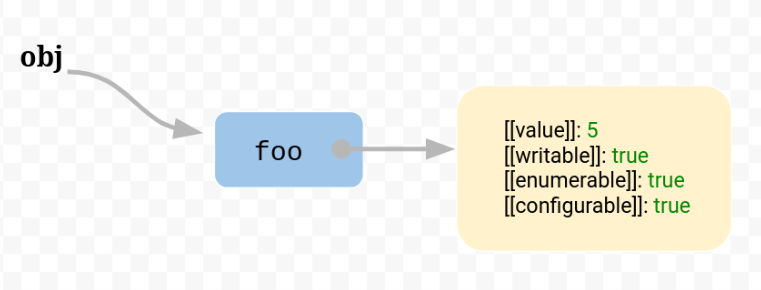
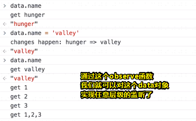

---

typora-copy-images-to: img\01
---

# 数据的监听

## ★课程简介

> 讲解了`Object.defineProperty`的作用，实现数据拦截

## ★手写MVVM概述

使用JavaScript去实现一个MVVM框架，这实际上就是Vue的一个雏形。在写代码之前，先来看看我们最终要实现的效果。

模板：


具体的调用：


实现的效果：

第一个，一打开页面就可以看到有我们data里的内容：


第二个效果是什么呢？如下：


那么这个提示哪儿来的？——来自于我们对input元素做了事件的绑定，当我们点击的时候，就会调用sayHi啦，而这个sayHi则是我们methods里的方法

还有个效果就是，当我们修改输入框的内容时，其下面的内容也会做一个相应的修改：


这就实现了一个双向绑定啦！

总之，这次的任务，就是去实现一个mvvm函数，即 `new mvvm({})`这个mvvm构造函数！

这其中大概有180行左右的代码，而这就是vue的一个核心啦！

## ★Object.defineProperty的用法（文章）

### ◇概述

> `Object.defineProperty()` 方法会直接在一个对象上定义一个新属性，或者修改一个对象的现有属性。这个方法执行完成后会返回修改后的这个对象。

### ◇语法

```js
Object.defineProperty(obj, prop, descriptor)
```

- obj
  - 要处理的目标对象
- prop
  - 要定义或修改的属性的名称
- descriptor
  - 将被定义或修改的属性描述符

### ◇使用方法

> 围绕第三个参数展开

#### 直接一个value值

```js
var obj = {}
obj.name = 'hunger'
obj['age'] = 3
Object.defineProperty(obj, 'intro', {
    value : 'hello world'
})
console.log(obj)  // {name: 'hunger', age: 3, intro: 'hello world'}
```


以上三种方法**都可以用来定义/修改一个属性**，`Object.defineProperty` 的方法貌似看起来有些小题大做。没关系，且往下看它更复杂的用法

#### 添加个configurable

> 默认为false，即不可配置的，所以该属性无法被删除和修改（重新赋值）


> 注意对象的某个属性的configurable设为false后，我们是无法修改它的：
>
> 

通过上面的例子可以看出，属性描述对象中 configurable 的值设置为 false 后(**如果没设置，默认就是 false**)，以后就不能再次通过 Object.defineProperty修改属性，也无法删除该属性。

#### 添加个enumerable

> 默认为false不可遍历


设置 enumerable 属性为 false 后，遍历对象的时候会忽略当前属性(**如果未设置，默认就是 false**不可遍历)。

#### 添加个writable

> 默认为false，不可写


### ◇深入了解

#### **数据描述符**

value 和 writable 叫**数据描述符**，具有以下可选键值：

- value：该属性对应的值。可以是任何有效的 JavaScript 值（数值，对象，函数等）。默认为 undefined。
- writable：当且仅当该属性的writable为true时，该属性才能被赋值运算符改变。**默认为 false**。

configurable: true 和 writable: true 的区别是，前者是设置属性能删除，后者是设置属性能修改

#### **存取描述符**


get 和 set 叫**存取描述符**，有以下可选键值：

- get：一个给属性提供 getter 的方法，如果没有 getter 则为 undefined。该方法返回值被用作属性值。默认为 undefined。
- set：一个给属性提供 setter 的方法，如果没有 setter 则为 undefined。该方法将接受唯一参数，并将该参数的新值分配给该属性。默认为 undefined。

#### **数据描述符和存取描述符是不能同时存在的**


> 报错了，浏览器告诉你这些属性描述符是无效的，因为accessors（存取访问器）有了，那么你得value或者writable就可以见鬼去了！

因为有 value，又有 get，上述代码会报错

## ★Object.defineProperty 的用法

### ◇概述

实现这个小的mvvm框架，我们需要用到什么东西呢？——主要用到以下几个东西：

1. 数据的劫持，即通过`Object.defineProperty`这个方法来实现数据拦截
2. 发布订阅模式——因为我们中间需要去拦截数据，然后在合适的时间需要去订阅数据的变动，当数据发生变动的时候，我们再去触发，去修改

还有就是在学习 「MVVM单向绑定」和「MVVM双向绑定」这两个东西之前，你需要提前掌握上面两个东西才行！

所以让我们先来看看数据监听吧！——说到数据监听，那么就得说说Object.defineProperty这个方法了

### ◇讲解这个方法

> 资料：[Object.defineProperty() - JavaScript - MDN](https://developer.mozilla.org/zh-CN/docs/Web/JavaScript/Reference/Global_Objects/Object/defineProperty)

Object是一个对象，我们或多或少都接触过它的一些方法，如最简单的`Object.keys()`，你传入一个对象，返回一个数组，这个数组里边的元素是这个对象里边的属性集合，就想这样：


更多有关这个Object构造函数的方法，请到下面这个网址里边查看：

➹：[Object - JavaScript - MDN](https://developer.mozilla.org/zh-CN/docs/Web/JavaScript/Reference/Global_Objects/Object)

语法：

```js
Object.defineProperty(obj, prop, descriptor)
```

第三个参数：描述符，表示我们该如何去修改这个通过`Object.defineProperty`定义出来的属性

使用范例：

我们知道对一个对象的属性的操作，可以用 `.`或者是 中括号 `[]`的方式，去获取或修改这个属性对应的值，或者给这个对象增加某个属性某个值，如：

```js
var obj = {}
obj.name = 'frank'
//注意一定要是字符串，不要写成是变量age，如 obj[age]=18
obj['age'] = 18
```

而现在，我们又多了一种姿势，可以干同样的事儿

那就是我们刚刚所提到的这个 `Object.defineProperty`啦！

```js
Object.defineProperty(obj, 'intro', {
    value : 'hello world'
})
```

我们对这个obj增加了一个新的属性，属性名叫 `intro`，接着的这第3个参数，就是告知JavaScript引擎我们是如何去描述这个属性，如这位intro大佬它里边有哪些值？是不是可以去修改？是不是可以被删除？能否被遍历？

> 其实这些描述属性的属性，我们可以把它们称之为元属性。总之说白了第三个参数即是属性描述对象：
>
> ```javascript
> var obj = { foo:  5 };
> ```
>
> 用图表示：
>
> 
>
> 然而它的庐山真面目其实是这样的：
>
> 
>
> ```js
> {
>   foo: {
>     [[value]]: 5
>     [[writable]]: true
>     [[enumerable]]: true
>     [[configurable]]: true
>   }
> }
> ```
>
> ➹：[属性描述对象 - JavaScript 教程 - 网道](https://wangdoc.com/javascript/stdlib/attributes.html#%E5%85%83%E5%B1%9E%E6%80%A7)
>
> ➹：[JavaScript 的 this 原理 - 阮一峰的网络日志](http://www.ruanyifeng.com/blog/2018/06/javascript-this.html)

总之，这就是一种新的对属性以及里面的值进行操作的方法

就目前我们所看到的，这似乎也忒复杂了吧！你看 `.`和 `[]`的姿势多么的简洁啊！

我不知道存在是否合理，但在这里这个方法的存在肯定是合理的，而这种合理的体现在它的其它的描述符，而不是你单纯的所看到的这样一个value属性

#### configurable

它的作用是告知这个属性能否被删除，我们知道有个delete操作符，可以把一些属性给GG掉，而当你写上这个描述符，并把它设置为false的话（你不写，默认就是false），那么该属性就无法被删除了，总之就是告诉delete操作符「你死了这条心吧！我是不会离不开我对象的……」


再次强调「configurable的作用就是告诉你这个用新姿势弄出来的属性能否被删除（GG）」，当然我们不写，这种新姿势创建出来的属性默认就是无法被删除的，而如果你想它可以被GG的话，那么你就得手动写上这个configurable描述符，并设置为true

#### enumerable

它表示这个属性是否可以被遍历出来

常见的对对象遍历的姿势有 `for……in循环`，这种姿势可以拿到这个对象的所有属性，不过这只是普通情况，因为如果我们通过新姿势所创建出来的属性，那么这个属性默认是无法被遍历出来的！所以如果你想让这个属性被遍历出来的话，同样需要手动的把enumerable的值弄成是true！


总之，这个描述符就是告诉你我们当前这个自定义的属性能否被遍历出来！

以上两个叫属性描述符

而接下所讲的则是数据描述符，即对当前数据的描述，那么它有哪些东西呢？

#### value

一个是value，默认不写就是undefined，类似于直接对一个对象点上一个自身不存在的属性，那么其结果显而易见是undefined


#### writable

另外一个是writable，表示当前属性是否可修改和可写，默认就是false，即不可写的，不可被修改的，所以你要想赋值操作有效的话，那么你就得手动的把这个属性弄成是true啦！

话说configurable不是与writable有同样的效果吗？——对，确实有同样的效果，它们都能让一个属性值不可被修改，不能被重新赋值，但是configurable它可以决定一个属性能否被delete操作符删除啊！而writable则是做不到的！

之前说到了属性描述符和数据描述符，那么接下来，我们来看看存取描述符get和set是怎样用的

#### get和set

get和set的值对应的是一个函数，而之前的除了value以外，其余的都是布尔值

既然它们都应一个函数，那么这有啥用呢？

```js
var obj = {}
var age 
Object.defineProperty(obj, 'age', {
    get: function(){
        console.log('get age...')
        return age
    },
    set: function(val){
        console.log('set age...')
        age = val
    }
})
obj.age = 100  // 'set age...'
console.log(obj.age) // 'get age...', 100
```

通过上述代码，我们可以知晓set/get所对应的函数的作用，如

当我们 `obj.age`的时候，实际上是去向这个obj对象要age这个属性 ，那么这个obj对象就会调用这个get函数，然后把全局变量age的值给return出去，然后log出去。当然你可以把全局变量写在get里边，不过这样一来set就无法设置该值了

当我们 `obj.age=100`的时候，即去修改它或设置（有添加一个属性的味道）它的时候，就会去调用set函数去设置全局变量age值，当你get值的时候拿到的就是set的值。

注意，当你log obj这个对象的时候，你会发现，它并咩有让你可以直接看到这个age属性，而且我们还可以像在Elements面板修改CSS像素值那样修改这个age属性，即点开age的是三个点，就会执行一次get操作，修改一次值就会执行set操作！


以上就是所谓的存取描述符啦！

有了存取描述符之后，我们就可以搞一些数据劫持的事儿了！如当用户通过一个对象去调用这个age属性得到它的值的时候，这中间就会被我们拦了一道，即调用了这个get；同理，当用户去设置这个值的时候，这中间也会被我们的set函数给拦了一道！

注意，数据描述符和存取描述符是不能同时存在的，换句话说就是value或writable存在了，那么set和get可以GG了，反之亦然……为什么它们不能共存呢？因为它们各自都做了同样的事情，如果弄在一起，岂不是冲突、冗余？

以上就是关于这个新姿势创建对象属性的用法啦！

## ★数据的劫持（文章）

之前讲解了 Object.defineProperty 的用法，现在我们利用这个方法动态监听数据

```javascript
var data = {
  name: 'hunger',
  friends: [1, 2, 3]
}
observe(data)

console.log(data.name)
data.name = 'valley'
data.friends[0] = 4


function observe(data) {
  if(!data || typeof data !== 'object') return
  for(var key in data) {
    let val = data[key]     //注意点1：这里是 let 不是 var，想想为什么
    Object.defineProperty(data, key, {
      enumerable: true,
      configurable: true,
      get: function() {
        console.log(`get ${val}`)
        return val
      },
      set: function(newVal) {
        console.log(`changes happen: ${val} => ${newVal}`)
        val = newVal
      }
    })
    if(typeof val === 'object'){
      observe(val)
    }
  }
}
```

代码中注意点1，要使用 let，不用 var，想想为什么？

上面的 observe 函数实现了一个数据监听，当监听某个对象后，我们可以在用户读取或者设置属性值的时候做个拦截，做我们想做的事

> 先来理解一波：
>
> observe这个函数把data这个对象的所有属性都弄成是存取描述符了，而不是原先默认的数据描述符，这样一来我就可以在返回数据之前搞一些事情了
>
> 关于var 和 let，每次遍历，let出来的都是一个新的变量，而且会生成一个新的作用域，如果是用var的话，那么就是同样一个局部变量了

## ★数据的劫持

### ◇概述

我们接下来通过`Object.defineProperty`来实现一个数据的拦截，或者说是数据的劫持！

有这样一份代码：

```js
var data = {
  name: 'hunger',
  friends: [1, 2, 3]
}
observe(data)

console.log(data.name)
data.name = 'valley'
data.friends[0] = 4


function observe(data) {
  if(!data || typeof data !== 'object') return
  for(var key in data) {
    let val = data[key]     //注意点1：这里是 let 不是 var，想想为什么
    Object.defineProperty(data, key, {
      enumerable: true,
      configurable: true,
      get: function() {
        console.log(`get ${val}`)
        return val
      },
      set: function(newVal) {
        console.log(`changes happen: ${val} => ${newVal}`)
        val = newVal
      }
    })
    if(typeof val === 'object'){
      observe(val)
    }
  }
}
```

我们搞了一个data对象出来，并添加了两个属性，一个是name，一个是friends。name的值是个字符串，而friends则是个数组，当然，这可以是其它普通对象（hash表）

接着我们通过一个observe函数（名字随意）来监控这个data对象旗下的所有属性，当用户去读取data对象旗下某个属性时，那么就会有相应的反应，同理，去赋值时，也会有相应的反应！

这样一来我们就实现了数据的拦截了！

那么问题来了，关于这个observe函数，我们该如何去写？

### ◇写个observe函数

具体逻辑：

1. 判断所传的参数是否是对象，如果不是，如基本类型什么的，那就直接return，什么也不做（虽然null的typeof结果也是object，不过在此之前我们已经有了个 `!data`操作了 ，还有就是关于数组是否也要观察呢？）

   

2. 遍历这个data对象的属性，并且你得手动搞两个属性描述符才行，虽然在此之前这些属性都有这样的特性（可被delete，可被遍历），但是你用了新姿势重新定义了一遍属性，这意味原先那些特性都GG了，所有你得重新手动配置一下，这样一来才原来一样，毕竟我们用新姿势只是为了存取描述符！

3. 如果data对象的某个属性还是个对象的话，那么同样也得observe一下！即我们做了一个递归，那么递归什么时候结束呢？——我们可以看到数组里的元素不是对象而是 `1、2、3`这样的值 ，那么这样就可以GG了

> 别想着在get/set函数里边使用this什么的，以及直接不用一个变量，而是一个data[key]什么的，因为这样是不行的！

把这段代码运行一下：



可见我们对这个data对象实现了任意层级的监听和劫持（监听到数据的变化，然后拦截数据，作出一些响应之后才返回数据）

不过，目前我们这个observe函数，似乎做不了什么复杂的事情啊！如只能在get/set函数里边搞点过家家……当然，我们之后会修改它，让它可以做更多的东西！

### ◇一些细节讨论

**①能否用var？而不是let？**

不能用var，因为我们用了let之后，这个 `{}`是有块级作用域的，所以每次遍历就感觉到有个闭包能够存储当前块级作用域里边的状态一样，简而言之就是每次遍历所得到的val是不一样的！当用户调取get去获取某个属性的值的时候，假设有个闭包的话，那么所获取的值就是当前闭包下的val，总之就是记录那次遍历所拿到的val值！

如果我们没有这样一个「闭包」（注意，这不是真正的闭包，为了好理解才这样说的，具体详情可以查看阮一峰的ES6入门里边的[var和let区别](http://es6.ruanyifeng.com/#docs/let#%E5%9F%BA%E6%9C%AC%E7%94%A8%E6%B3%95)）或则是没有写一个函数的话，而直接用var的话，那么val的值就是最后一次遍历所那到那个属性对应的值啦！（注意for in 遍历中的key可是无顺序可言的）

以下是用了var的结果：


> 注意数组也做了observe

如果我非得用var呢？——也是可以的，比如这样：


关于这个`Object.keys()`，可以拿到数组化后的对象属性集：


我们遍历keys数组，由于val变量是处于回调函数里边的，这意味着每次遍历所得到的val是不一样的，为此get、set因闭包的存在，那就会存储每次遍历所得到的val状态了！

还有一种姿势：


**②能否不用val变量？这样就不用关心是var还是let的问题了？**


为什么说陷入死循环呢？

当用户调用`data.name`的时候，即会执行这个get函数，然后 `data[key]`，即 `data['name']`又需要再次get啦，这样一来岂不是死循环啦？

同理set也是如此

好了，这就是为啥我们得让get、set函数与其外部的某个对应的属性构成闭包的缘故了！

> 每次遍历的逻辑，拿到对象的属性（key）相对应的值（value），然后再使用`Object.defineProperty`，接着就是再添加set和get，其中set和get需要和value构成闭包才行！

以上就是关于数据劫持的写法了！

## ★总结

- 加深了对立即执行函数、let、var的认识
- 了解了一个对象的属性其对应的值，其实是个属性描述对象！
- get和set，可以让我们在赋值时或得到值时做一些数据劫持……

---

## ★Q&A

### ①使用for in遍历对象其顺序问题？

本质：

Chrome Opera 中使用 for-in 语句遍历对象属性时会遵循一个规律：

> 它们会先提取所有 key 的 parseFloat 值为非负整数的属性，然后根据数字顺序对属性排序首先遍历出来，然后按照对象定义的顺序遍历余下的所有属性。

其它浏览器则完全按照对象定义的顺序遍历属性。

结论：

1. 如果想顺序遍历一组数据，请使用数组并使用 for 语句遍历。
2. for-in语句无法保证遍历顺序，应尽量避免编写依赖对象属性顺序的代码。如果想按照定义的次序遍历对象属性，请参考[这里](http://w3help.org/zh-cn/causes/SJ9011)针对各浏览器编写特殊代码。
3. 由于对象的输出是无序的，但是数组却是有序的，所以为了保证顺序，搞成数组再输出

➹：[js能够保证object属性的输出顺序吗？ - Jartto's blog](http://jartto.wang/2016/10/25/does-js-guarantee-object-property-order/)

➹：[JavaScript for...in 循环出来的对象属性顺序到底是什么规律？ - 掘金](https://juejin.im/post/5a6936e9f265da3e2d339e00)

➹：[循环读取时 JS 对象属性的顺序遵循怎样的规则？ - 知乎](https://www.zhihu.com/question/20135901)

➹：[Map()的营救；使对象属性有顺序](http://www.jstips.co/zh_cn/javascript/map-to-the-rescue-adding-order-to-object-properties/)

### ②为啥要叫getter/setter这样的名字？

> 我没有找到答案，或许这是一种习惯写法，用于统一描述获取数据，修改数据这样的操作吧！

➹：[getter 和 setter 方法有什么意义？ - 知乎](https://www.zhihu.com/question/21401198)


