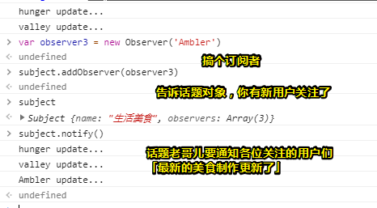
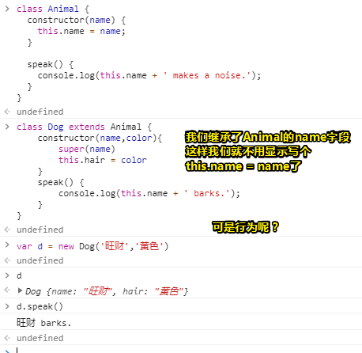
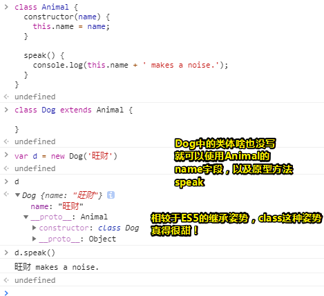

# 观察者模式

## ★简介

> 理解观察者模式
>
> 项目代码： <https://github.com/jirengu/wheel-mvvm>

## ★观察者模式

### ◇概述

接下来我们将会讨论实现这个mvvm框架所用到的发布订阅模式，当然你也可以叫观察者模式，毕竟这两者没什么差别哈！

一个典型的观察者模式应用场景是用户在一个网站订阅主题

1. 多个用户(观察者，Observer)都可以订阅某个主题(Subject)
2. 当主题内容更新时订阅该主题的用户都能收到通知

> 类似于用户订阅掘金某个的[主题](https://baike.baidu.com/item/%E4%B8%BB%E9%A2%98/2095)（前端相关方面的话题），然后话题更新了，那么所有的订阅者都会收到掘金已更新xxx话题的消息
>
> 我觉得把topic翻译成「话题」比较好！

### ◇代码实现

我们该如何使用JavaScript来描述这个过程呢？——请往下看

#### 思路

Subject是构造函数，new Subject() 创建一个主题对象，该对象内部维护订阅当前主题的观察者数组。

> 需要知道谁订阅了这个话题，一旦这个话题下有文章更新，那么就会把文章更新的消息通知给这些订阅者们……

主题对象上有一些方法，如添加观察者(addObserver)、删除观察者(removeObserver)、通知观察者更新(notify)。

> 作为一个话题对象，自身可以添加观察者，可以删除一些观察者，然后还可以提醒观察者去更新，毕竟该话题下有内容更新的话，那么我会提醒你们所有人去更新（其实这TM就是提醒你们可以去看最新内容了，不需要再对着一堆瓜子而没有内容看了）
>
> 题外话：之前了解过，对象与对象之间有个很重要的概念，那就是消息传递，具体一点就是：
>
> ```js
>  person.cut('jj')
> ```
>
> 这行代码所阐述的意思是：
>
> 1. 给 persom 对象发送了一个 cut 消息
> 2. person 对象会响应这个消息
>
> 或许你会疑问，这不是一个函数调用吗？即调用一个cut函数（`person.cut`是一个整体），哪里有用到消息传递啊？
>
> 然而，你如果代码弄成是smalltalk姿势的话，那么你就能理解了：
>
> ```smalltalk
> person cut: 'jj'
> person cut: 'jj'; cut: 'hands'
> ```
>
> `cut: 'jj'`就是一个消息， `cut: 'jj'; cut: 'hands'`就是两个消息
>
> 所以，在这里我们是说给person传了个cut的消息，然后person就会响应这个消息，如把手给剁了……
>
> 回过头来看主题对象，我们用户一般订阅，肯定是需要勾选某个按钮，或者点击某个按钮，那么这个按钮对象显然就会告诉主题对象一个 `addObserver`，然后主题对象，就去响应这个消息啦！

 当notify 时实际上调用全部观察者 observer 自身的 update 方法。

Observer 是构造函数，new Observer() 创建一个观察者对象，该对象有一个 update 方法。

#### 面向对象姿势

```javascript
function Subject() {
  this.observers = []
}
Subject.prototype.addObserver = function(observer) {
  this.observers.push(observer)
}
Subject.prototype.removeObserver = function(observer) {
  var index = this.observers.indexOf(observer)
  if(index > -1){
    this.observers.splice(index, 1)
  }
}
Subject.prototype.notify = function() {
  this.observers.forEach(function(observer){
    observer.update()
  })
}

function Observer(name) {
  this.name = name
  this.update = function(){
    console.log(name + ' update...')
  }
}  

// 创建主题
var subject = new Subject()

//创建观察者1
var observer1 = new Observer('hunger')
//主题添加观察者1
subject.addObserver(observer1)
//创建观察者2
var observer2 = new Observer('valley')
//主题添加观察者2
subject.addObserver(observer2)

//主题通知所有的观察者更新
subject.notify()
```

解释一波：

1. 直接使用使用的数组push方法就可以把观察者扔到数组里边了

   > `push()` 方法将一个或多个元素添加到数组的末尾，并返回该数组的新长度。

2. 关于数组的这个两个API——indexOf和splice的用法：[②](#er)

   了解了这两个API之后，你就知道 `removeObserver`的逻辑是怎样的，即在数组中找到要被删除的观察者的索引，如果找着了，即inexOf的返回值不是等于-1，那么就可以把该索引对应的元素给删除了

3. 关于notify实际上就是遍历observer数组，然后让观察者们自己update一下，总之就是传个`update()`消息给那些observer们！

4. Observers是个构造函数，我们需要给个名字，然后它有个update方法，当然你也可以把这个方法扔到它的原型上边去！

5. 当我们为主题（话题）创建观察者的时候，实际上就是让观察者订阅（关注）这个主题（话题）！

测试结果：




#### ES6姿势

这种姿势只是换了个形式，换了个壳而已！之后的写法也会用ES6姿势进行！

```js
class Subject {
  constructor() {
    this.observers = []
  }
  addObserver(observer) {
    this.observers.push(observer)
  }
  removeObserver(observer) {
    var index = this.observers.indexOf(observer)
    if(index > -1){
      this.observers.splice(index, 1)
    }
  }
  notify() {
    this.observers.forEach(observer=> {
      observer.update()
    })
  }
}


class Observer{
  constructor() {
    this.update = function() {}
  }
}  


let subject = new Subject()
let observer1 = new Observer()
//覆盖
observer1.update = function() {
  console.log('observer1 update')
}
subject.addObserver(observer1)

let observer2 = new Observer('valley')
observer2.update = function() {
  console.log('observer2 update')
}
subject.addObserver(observer2)

subject.notify()
```

上面的代码中，主题被观察者订阅的写法是 subject.addObserver(observer)， 不是很直观，给观察者增加订阅方法

```js
class Observer{
  constructor() {
    this.update = function() {}
  }
  subscribeTo(subject) {
    subject.addObserver(this)
  }
} 


let subject = new Subject()
let observer = new Observer()
observer.update = function() {
  console.log('observer update')
}
observer.subscribeTo(subject)  //观察者订阅主题

subject.notify()
```

之所以这样修正，那是因为主题肯定是被观察者订阅的啊！如关注一下我的博客吧！总不能让博主自己主动去添加订阅者吧！所以订阅这个操作理应交给Observer来做！虽然这只是换了个壳，但是换了壳对于从外部调用来看，写法就更符合我们的逻辑了！如我们创建一个主题，然后创建一个观察者，然后观察者有它自己一个更新的方法，这个方法会在主题通知之后调用，然后观察者还可以主动订阅更多的主题，只要主题发送通知，我这个观察者就会收到！然后就会执行自己的update方法去更新了

总之，这种写法才比较符合我们日常的逻辑

> 感觉多了个 ` subscribeTo`方法之后，代码看起来好了很多！不过要想成为真正地发布订阅模式，这得要有个event hub之类的东西存在吧！
>
> ➹：[测试订阅/发布模式 · ppambler/163-music-2018@f2fefa2](https://github.com/ppambler/163-music-2018/commit/f2fefa274b7039b7c5978dee99018ba24ea7a603)

## ★总结

- 我们只用到了两个对象，其中Subject有存放观察者们的数组，有添加观察者、删除观察者，以及通知观察者们的方法；而Observer则有个更新数据的方法，以及订阅主题的方法……

## ★Q&A

### ①观察者模式与发布订阅者模式是否有不同？

一个误区：

> *Publishers + Subscribers = Observer Pattern*

根据这条公式，你会认为它们俩是一样的，但其实它们是不一样的！接下来我们将会通过一些鸟瞰图来形象地理解它们俩的不同

**①观察者模式**

Observer姿势是这样的：


解释一波：

xxx正在找工作，于是就在招聘网站上找啊找，偶然看到一家心仪的公司，于是你就联系了那家公司的hr，并把自己的联系方式给了hr，而hr也对你表示「如果公司有这个职位空缺的话，我们会联系你的」，当然，这个世界总有人跟你做同样的事儿，即他们都是关于这个职位的竞争者。

在这里hr就是Subject啦！管理着这些职位竞争者，一旦公司某个部门说该职位空缺了，那么hr就会去通知这些竞争者们去面试啦！

因此，如果你的代码实现了上述类似的过程，那么你就可以说你的软件或者应用程序用到了「观察者设计模式」

观察者模式中的Subject类似于Publisher（发布者），而Observer则可以完全与Subscriber（订阅者）相关。Subject通知Observe，就像是Publisher通知它的Subscriber那样，这就是为啥大多数设计模式书籍或文章使用功能「Publisher-Subscriber」来解释观察者设计模式。

**②发布订阅模式**

然而还有另外一种流行的模式叫做「Publisher-Subscriber」，这种模式在概念上与观察者模式非常相似，当然，真正的「Publisher-Subscriber」模式和「Observer」模式之间还是有主要的区别的。

在真正的「Publisher-Subscriber」模式中，**publishers**（信息发送者）不会直接把信息发给**subscribers**（信息接收者），这意味着发布者和订阅者不知道彼此的存在，因此这当中必定会存在第三个组件，而这个组件可以被称为**broker**（代理、经纪人）或**message broker** （消息代理）或**event bus**（事件总线），而发布者和订阅者都知道这个组件，总之，这个组件就是过滤掉所有传入的消息并相应地分发给那些订阅者们。

换句话说，pub-sub是用于在不同系统组件之间传递消息的模式，而这些组件不知道关于彼此身份的任何信息。 

那么**broker**是如何过滤掉所有的消息呢？ 实际上，这其中有几个消息过滤过程。而最常用的方法是：**Topic-based**和**Content-based**，如果你感兴趣可以看看这个：

➹：[Publish–subscribe pattern - Wikipedia](https://en.wikipedia.org/wiki/Publish%E2%80%93subscribe_pattern#Message_filtering)

一张图解释何为 「Pub-Sub Pattern」：


> 通信基础施设

**③它们俩的主要区别如下：**


**④结论：**

- 在观察者模式中，**Observers**知道**Subject**的存在，当然，Subject也保存有Observes的记录。 然而，在发布者/订阅者中，发布者和订阅者不需要彼此了解。 它们只是在消息队列或代理（broke）的帮助下进行通信。

- 在Publisher / Subscriber模式中，组件之间是松耦合的（loosely coupled），Observer模式则与之相反，即它们俩互相依赖

  > 我看了一篇文章中说到，Observer是松耦合的，而Publish/Subscribe则是完全解耦的！

- 观察者模式主要以同步（**synchronous**）姿势实现，即当某些事件发生（occurs）时，Subject就会调用其所有 observers的适当的方法。 而发布者/订阅者模式主要以异步（**asynchronous** ）姿势实现（使用消息队列）。

- 观察者模式需要在单个应用程序的地址空间中实现。 而另一方面的发布者/订阅者模式则更像是跨应用程序模式。

尽管这些模式之间存在差异，但有些人可能会说发布者 - 订阅者模式是观察者模式的变体，因为它们之间存在概念上的相似性。因此，你说发布者-订阅者模式为观察者模式，其实也没啥错的啊！毕竟它们俩就是如此的形似！这就像是樱桃和车厘子，只是车厘子留过洋你就说它们俩不一样吗？

➹：[鸟瞰图的意义在于什么？ - 知乎](https://www.zhihu.com/question/26776553)

➹：[Observer vs Pub-Sub pattern – Hacker Noon](https://hackernoon.com/observer-vs-pub-sub-pattern-50d3b27f838c)

➹：[观察者模式 vs 发布订阅模式 - 知乎](https://zhuanlan.zhihu.com/p/51357583)

➹：[主题订阅名词解释_名词解释_产品简介_消息服务 MNS-阿里云](https://help.aliyun.com/document_detail/34955.html)

### <a id="er">②数组的`IndexOf()`以及`splice()`</a>

1. **`indexOf()`**方法返回在数组中可以找到一个给定元素的第一个索引，如果不存在，则返回-1。

   例子：

   ```js
   var beasts = ['ant', 'bison', 'camel', 'duck', 'bison'];
   
   console.log(beasts.indexOf('bison'));
   // expected output: 1
   
   // start from index 2
   console.log(beasts.indexOf('bison', 2));
   // expected output: 4
   
   console.log(beasts.indexOf('giraffe'));
   // expected output: -1
   ```

2. **`splice()`**方法通过删除或替换现有元素来修改数组,并以数组形式返回被修改的内容。此方法会改变原数组。

   语法： `array.splice(start[, deleteCount[, item1[, item2[, ...]]]])`

   例子：

   ```js
   var months = ['Jan', 'March', 'April', 'June'];
   months.splice(1, 0, 'Feb');
   // inserts at 1st index position
   console.log(months);
   // expected output: Array ['Jan', 'Feb', 'March', 'April', 'June']
   
   months.splice(4, 1, 'May');
   // replaces 1 element at 4th index
   console.log(months);
   // expected output: Array ['Jan', 'Feb', 'March', 'April', 'May']
   ```

➹：[Array.prototype.indexOf() - JavaScript - MDN](https://developer.mozilla.org/zh-CN/docs/Web/JavaScript/Reference/Global_Objects/Array/indexOf)

➹：[Array.prototype.splice() - JavaScript - MDN](https://developer.mozilla.org/zh-CN/docs/Web/JavaScript/Reference/Global_Objects/Array/splice)

### ③ES6 class 语法？

一个基本认识：

> ES6引入的class语法实质上是 JavaScript 现有的基于原型的继承的**语法糖**。class语法**不会**为JavaScript引入新的面向对象的继承模型。

如何定义一个类？

可以想想函数是如何声明和定义的，那么类就是如何定义的

类实际上是个“特殊的函数”，类语法有两个组成部分：**类表达式和类声明**。

**①声明一个类：**

```js
class Rectangle {
  constructor(height, width) {
    this.height = height;
    this.width = width;
  }
}
```

提升：

函数声明会提升，但类不会提升，因此你需要先声明你的类，然后再去访问它（就像let那样），否则，则如下抛出错误：

```js
let p = new Rectangle(); 
// ReferenceError

class Rectangle {}
```

**②类表达式：**

```js
/* 匿名类 */ 
let Rectangle = class {
  constructor(height, width) {
    this.height = height;
    this.width = width;
  }
};

/* 命名的类 */ 
let Rectangle = class Rectangle {
  constructor(height, width) {
    this.height = height;
    this.width = width;
  }
};
```

**③类体和方法定义**

类体：`{}` 中的部分，这是你定义类成员的位置，如方法或构造函数。

**④this问题**

```js
class Animal { 
  speak() {
    return this;
  }
  static eat() {
    return this;
  }
}

let obj = new Animal();
obj.speak(); // Animal {}
let speak = obj.speak;
speak(); // undefined

Animal.eat() // class Animal
let eat = Animal.eat;
eat(); // undefined
```

返回了一个class Animal，类似于一个函数

没有指定this的值，this值将为`undefined`。

如果我们使用传统的基于函数的类来编写上述代码，那么基于调用该函数的“this”值将发生自动装箱。

```js
function Animal() { }

Animal.prototype.speak = function() {
  return this;
}

Animal.eat = function() {
  return this;
}

let obj = new Animal();
let speak = obj.speak;
speak(); // global object

let eat = Animal.eat;
eat(); // global object
```

没办法谁叫你这不是严格模式呢！

**⑤关于继承**

我们使用 `extends` 创建子类

`extends` 关键字在类声明或类表达式中用于创建一个类作为另一个类的一个子类。

既然成为了另外一个类的子类，显然儿子肯定会继承爸爸的某些字段和方法啦！

```js
class Animal { 
  constructor(name) {
    this.name = name;
  }
  
  speak() {
    console.log(this.name + ' makes a noise.');
  }
}

class Dog extends Animal {
  speak() {
    console.log(this.name + ' barks.');
  }
}

var d = new Dog('Mitzie');
// 'Mitzie barks.'
d.speak();
```

注意，如果子类中存在构造函数，则需要在使用“this”之前首先调用 super()：

```js
class Dog extends Animal {
    constructor(name,color){
		super(name)
		this.hair = color
    }
    speak() {
    	console.log(this.name + ' barks.');
    }
}
```

测试：



关于行为，默认就是继承的，因为Animal的speak是prototype方法呀！当然字段也是如此的！所以我们在Dog中写的speak方法，是在重写父类的speak，测试如下：



注意，我们也可以继承基于函数的「类」：

```js
function Animal (name) {
  this.name = name;  
}
Animal.prototype.speak = function () {
  console.log(this.name + ' makes a noise.');
}

class Dog extends Animal {
  speak() {
    super.speak();
    console.log(this.name + ' barks.');
  }
}

var d = new Dog('Mitzie');
d.speak();
```

还有类不能继承常规（非可构造）对象。如果要继承常规对象，可以改用[`Object.setPrototypeOf()`](https://developer.mozilla.org/zh-CN/docs/Web/JavaScript/Reference/Global_Objects/Object/setPrototypeOf)

```js
var Animal = {
  speak() {
    console.log(this.name + ' makes a noise.');
  }
};

class Dog {
  constructor(name) {
    this.name = name;
  }
}
//往Dog的原型上添加原型方法，那么这些方法是来自哪儿的呢？来自Animal这个hash表
Object.setPrototypeOf(Dog.prototype, Animal);// If you do not do this you will get a TypeError when you invoke speak

var d = new Dog('Mitzie');
d.speak(); // Mitzie makes a noise.
```


---

一些细节和概念：

1. 不能重复声明类

2. 不要把在对象中使用方法的那种姿势，映射到class中来！

   ```js
   var o = {
   	xxx() {}
   }
   //等价于
   var o = {
       xxx: function(){
           
       }
   }
   //下面这种姿势是不行的：
   class xxx {
       constructor: function(){}
   }
   ```

3. 类声明和类表达式的主体都执行在[严格模式](https://developer.mozilla.org/zh-CN/docs/Web/JavaScript/Reference/Strict_mode)下。比如，构造函数，静态方法，原型方法，getter和setter都在严格模式下执行。

4. 关于原型（prototype）方法，可以看看上文额面向对象姿势和ES6姿势中，Subject对象添加的那几个用于处理观察们的方法，而他们就是原型方法啦！

5. [constructor](https://developer.mozilla.org/en-US/docs/Web/JavaScript/Reference/Classes/constructor)方法是一个特殊的方法，这种方法用于创建和初始化一个由`class`创建的对象，注意一个class只能用一个constructor，不然会抛出语法错误！

6. 一个构造函数可以使用 `super` 关键字来调用一个父类的构造函数。

7. `static` 关键字用来定义一个类的一个静态方法。调用静态方法不需要[实例化](https://developer.mozilla.org/zh-CN/docs/Web/JavaScript/Introduction_to_Object-Oriented_JavaScript#The_object_(class_instance))该类，但不能通过一个类实例调用静态方法。静态方法通常用于为一个应用程序创建工具函数。

8. 我们可以使用super调用父类：

   super关键字用于调用super类的相应方法。这是优于基于原型的继承的一个优势。

   

   难道是 :

   ```js
   super.speak()
   //等价于下面这个吗？
   Cat.prototype.speak.call(this)
   ```

   总之，`super` 关键字用于调用对象（Lion类的实例）的父对象（Cat类的实例）上的函数。

9. 关于兼容性，IE都GG了

➹：[类 - JavaScript - MDN](https://developer.mozilla.org/zh-CN/docs/Web/JavaScript/Reference/Classes)

### ④ES5的继承？

```js
function Human(name){
     this.name = name
 }
 Human.prototype.run = function(){
     console.log("我叫"+this.name+"，我在跑")
     return undefined
 }
 function Man(name){
     Human.call(this, name)
     this.gender = '男'
 }

 var f = function(){}
 f.prototype = Human.prototype
 Man.prototype = new f()

 Man.prototype.fight = function(){
     console.log('糊你熊脸')
 }
```

