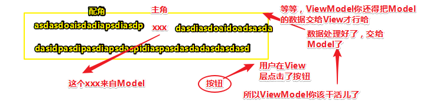
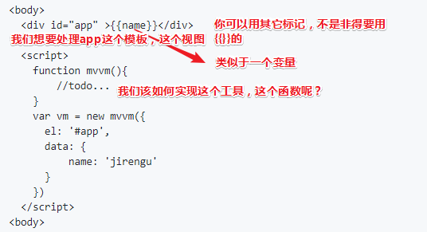
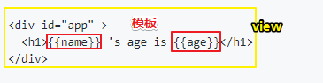
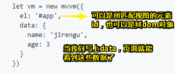
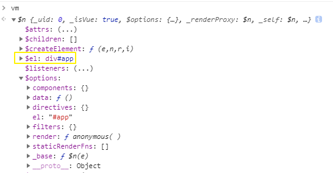
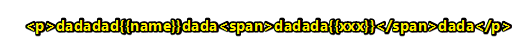
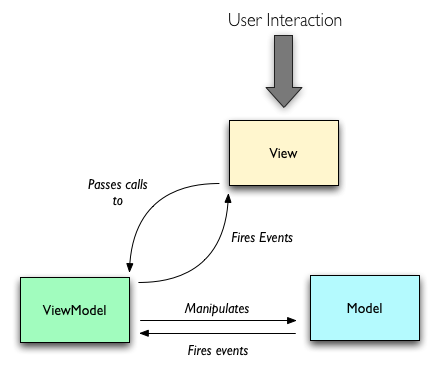
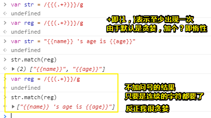

# MVVM单向绑定

## ★简介

> MVVM 原理
>
> 项目代码 <https://github.com/jirengu/wheel-mvvm>

## ★MVVM单向绑定的实现（文章）

### ◇概念

MVVM (Model-View-ViewModel) 是一种用于把数据和 UI 分离的设计模式。

MVVM 中的 Model 表示应用程序使用的数据，比如一个用户账户信息(名字、头像、电子邮件等)。Model 保存信息，但通常不处理行为，不会对信息进行再次加工。数据的格式化是由View 处理的。行为一般认为是业务逻辑，封装再 ViewModel 中。

View 是与用户进行交互的桥梁。

ViewModel 充当数据转换器，讲 Model 信息转换为 View 的信息，讲命令从 View 传递到 Model。

### ◇思考

假设有如下代码，data 里的`name`会和视图中的`{{name}}`一一映射，修改 data 里的值，会直接引起视图中对应数据的变化。

```html
<body>
  <div id="app" >{{name}}</div>

  <script>
    function mvvm(){
        //todo...
    }
    var vm = new mvvm({
      el: '#app',
      data: { 
          name: 'jirengu' 
      }
    })
  </script>
<body>
```

如何实现上述 mvvm 呢？

一起回想之前讲的观察者模式和数据监听：

1. 主题(subject)是什么？
2. 观察者(observer)是什么？
3. 观察者何时订阅主题？
4. 主题何时通知更新？

上面的例子中，主题应该是`data`的 `name` 属性，观察者是视图里的`{{name}}`，当一开始执行mvvm初始化(根据 el 解析模板发现`{{name}}`)的时候订阅主题，当`data.name`发生改变的时候，通知观察者更新内容。 我们可以在一开始监控 data.name （Object.defineProperty(data, 'name', {...})），当用户修改 data.name 的时候调用主题的 subject.notify。

### ◇单向绑定实现

```html
<!DOCTYPE html>
<html>
<head>
  <meta charset="UTF-8">
  <title>MVVM 单向绑定</title>
</head>
<body>

<div id="app">
  <h1>{{name}} 's age is {{age}}</h1>
</div>

<script>

function observe(data) {
  if(!data || typeof data !== 'object') return
  for(var key in data) {
    let val = data[key]
    let subject = new Subject()
    Object.defineProperty(data, key, {
      enumerable: true,
      configurable: true,
      get: function() {
        console.log(`get ${key}: ${val}`)
        if(currentObserver){
          console.log('has currentObserver')
          currentObserver.subscribeTo(subject)
        }
        return val
      },
      set: function(newVal) {
        val = newVal
        console.log('start notify...')
        subject.notify()
      }
    })
    if(typeof val === 'object'){
      observe(val)
    }
  }
}

let id = 0
let currentObserver = null

class Subject {
  constructor() {
    this.id = id++
    this.observers = []
  }
  addObserver(observer) {
    this.observers.push(observer)
  }
  removeObserver(observer) {
    var index = this.observers.indexOf(observer)
    if(index > -1){
      this.observers.splice(index, 1)
    }
  }
  notify() {
    this.observers.forEach(observer=> {
      observer.update()
    })
  }
}

class Observer{
  constructor(vm, key, cb) {
    this.subjects = {}
    this.vm = vm
    this.key = key
    this.cb = cb
    this.value = this.getValue()
  }
  update(){
    let oldVal = this.value
    let value = this.getValue()
    if(value !== oldVal) {
      this.value = value
      this.cb.bind(this.vm)(value, oldVal)
    }
  }
  subscribeTo(subject) {
    if(!this.subjects[subject.id]){
      console.log('subscribeTo.. ', subject)
       subject.addObserver(this)
       this.subjects[subject.id] = subject
    }
  }
  getValue(){
    currentObserver = this	
    let value = this.vm.$data[this.key]
    currentObserver = null
    return value
  }
} 


class mvvm {
  constructor(opts) {
    this.init(opts)
    observe(this.$data)
    this.compile()
  }
  init(opts){
    this.$el = document.querySelector(opts.el)
    this.$data = opts.data
    this.observers = []
  }
  compile(){
    this.traverse(this.$el)
  }
  traverse(node){
    if(node.nodeType === 1){
      node.childNodes.forEach(childNode=>{
        this.traverse(childNode)
      })
    }else if(node.nodeType === 3){ //文本
      this.renderText(node)
    }
  }
  renderText(node){
    let reg = /{{(.+?)}}/g
    let match
    while(match = reg.exec(node.nodeValue)){
      let raw = match[0]
      let key = match[1].trim()
      node.nodeValue = node.nodeValue.replace(raw, this.$data[key])
      new Observer(this, key, function(val, oldVal){
        node.nodeValue = node.nodeValue.replace(oldVal, val)
      })
    }    
  }

}

let vm = new mvvm({
  el: '#app',
  data: { 
    name: 'jirengu',
    age: 3
  }
})

setInterval(function(){
  vm.$data.age++
}, 1000)


</script>
</body>
</html>
```

## ★MVVM之单向绑定的实现

### ◇MVVM

MVVM是个什么鬼东西？与之对应的MVC思想我之前有了解过，可是这MVVM到底是什么呀？

> MVVM (Model-View-ViewModel) 是一种用于把数据和 UI 分离的**设计模式**。

Model即模型，View即视图，然后ViewModel就ViewModel吧！

虽然知道了它们的中文意思，但它们各自具体表示什么东西呢？

- MVVM 中的 Model 表示应用程序使用的数据

  当我们把这个框架写出来之后，你就会有一个很深刻的感受啦！总之，Model即数据，这个数据和我们页面上看到的数据是一一对应，不过它仅仅只是数据哈！比如一个用户账户信息(名字、头像、电子邮件等)。

  Model它保存信息，但通常不处理行为，不会对信息进行再次加工。

  而数据的格式化则是由View 处理的。至于行为一般认为是业务逻辑，至此就把行为封装再在ViewModel 中。

- View 是与用户进行交互的桥梁。换句话说，就是用户所看到的页面，也就是所谓的视图啦！比如说页面上有一个按钮，然后还有一段话，其中话里边还有个关键字，但是这个关键字是我们的数据映射上去的，然后其它地方就是所谓的View，当然你也可以认为是模板。当用户点击某个按钮的时候，然后再由ViewModel去做一件事情，如去做一个行为——拿到数据，然后把数据放到那个关键字里边

  

- ViewModel 充当数据转换器，将Model 信息转换为 View 的信息，将命令从 View 传递到 Model。

  所以说：

  Model（数据）、View（模板）、ViewModel（数据和模板之间的一个映射关系、一个处理流程）

这就是MVVM啦！现在你该知道MVVM是个什么鬼东西了吧！是不是很简单？

> 有关MVC和MVVM的图：[①](#yi)

### ◇单向绑定

#### 思路

> 把数据映射到View上！



> 注意页面上显示的可不是 `{{name}}`，而是一个来自于data的映射值！
>
> 更复杂一点的还有，比如说data中还有其它属性，而其中某个属性值是一个对象，这样的多层级映射，还有就是对视图添加一些方法、指令之类的，实现双向绑定等等……

言归正传，我们该如何实现这个mvvm？

我们之前了解过数据劫持以及观察者模式，这似乎隐隐约约可以用上啊！

既然如此，那么如何用呢？

在此之前我们需要考虑这些问题：

1. 主题是什么？
2. 观察者是什么？
3. 什么时候去订阅这个数据的变化？
4. 当数据变化之后，怎样更新到这个视图上？

根据之前所学的知识，我们可以得出：

1. `data.name`就是主题
2. \{\{name}}就是观察者
3. 解析模板时，即需要展示数据的时候就去订阅，订阅好之后，data.name的数据就展示出去啦！
4. 用户再次去修改 data.name中的数据的时候，就会通知观察者们去更新数据啦！当然，更新完之后，又会展示新的数据啦！

大概就是这样的思路了，那么如何实现呢？请往下看

#### 实现

**①需求：**

model中的数据一更改，那么在view中用大胡子语法所标记的模板就得得到相应的更新了！



然后用户可以这样调用：



他人修改数据data中的数据时：

```js
setInterval(function(){
  vm.$data.age++
}, 1000)
```

那么用户所看到的视图中的相应的模板就会是实时已经自动更新好的数据了，这样一来我们就无须自己去手动操纵它们更新数据了！毕竟可以自动更新数据！

**②实现：**

1. mvvm是个构造函数，所以我们可以用es6中所引入的class语法，当然你如果不熟悉的话，还是可以用es5姿势！

2. 我们要把用户new一个mvvm实例的时候所传的参数给保存起来，因为后面要用，所以我们得在mvvm这个class里边的constructor里边做一些初始化的操作，如隐式的为mvvm实例添加一些属性，为了与所传选项对象的属性区分开来，我们可以加个 `$`符、下划线  `_`等之类的都可以

   ```js
   class mvvm {
     constructor(opts) {
       this.init(opts)
       observe(this.$data)
       this.compile()
     }
     init(opts){
       //做得更精细点，可以做个判断，如果opts.el直接是dom元素的话，那就直接做个赋值吧！如果不是，那就
       //使用原生API去获取DOM元素呗
       this.$el = document.querySelector(opts.el)
       //把这个data专门抽出来，直接绑定到其实例vm上
       this.$data = opts.data
       //可以先不写，毕竟就目前而言，我们并不知道它是什么
       this.observers = []
     }
     //…………
   }
   ```

   看看vue实例：

   

   实例旗下同样有个 `$el`

3. 做好了初始化，把数据暂存起来之后，那么我们接下来就需要去监控这个数据了，即实例里边所传的data选项一旦发生了变化，那么我们就得去做一些事情哈！

   为此就有了在constructor里边就有了这行代码，用于监控数据的变化（也就是所谓的数据劫持）：

   ```
   observe(this.$data)
   ```

4. 如何写这个observe？跟之前的基本一样，只是多了一点操作，如每遍历一个属性，就创建一个主题，然后其它人就去订阅这个主题，当你的这个主题变了，然后就去通知观察者们，好让它们去修正！

   ```js
   function observe(data) {
     if(!data || typeof data !== 'object') return
     for(var key in data) {
       let val = data[key]
       //遍历一次就创建一个主题
       let subject = new Subject()
       Object.defineProperty(data, key, {
         enumerable: true,
         configurable: true,
         get: function() {
           console.log(`get ${key}: ${val}`)
            //这个可以先不用去管，我们直接按原来那样返回一个值就好了！
           if(currentObserver){
             console.log('has currentObserver')
             currentObserver.subscribeTo(subject)
           }
           return val
         },
         set: function(newVal) {
           val = newVal
           console.log('start notify...')
           //当用户修改了这个属性，那就通知观察者们去更新数据呗
           subject.notify()
         }
       })
       if(typeof val === 'object'){
         observe(val)
       }
     }
   }
   ```

   有一个关键的核心点「在什么时候，谁去订阅这个主题，如果没有订阅者的话，显然当主题通知的时候，那就没有人会更新了！」，而这个核心点就是get里边那个判断哈！

5. 监控完数据之后，我们要对模板进行一个解析，而我们的模板就是这个：

   ```html
   //标签里边的内容就是一个字符串
   <h1>{{name}} 's age is {{age}}</h1>
   ```

   我们需要把里边的内容拿出来，知道 \{\{name}}和{\{age}}这俩兄弟是个变量，所以我们就写了个方法叫做：

   ```
   this.compile()
   ```

   这个方法用于解析这个字符串

   ```
     compile(){
       this.traverse(this.$el)
     }
   ```

   而compile的逻辑则是去遍历（traverse）当前这个元素，或许你会疑问「就一行代码，还要封装成一个函数吗？直接在constructor里边写个 `this.traverse(this.$el)`不就好了吗？ 」

   因为 `this.compile()`让人感觉更好一点，毕竟我们一开始就是需要去编译模板的，而不是说去遍历这个目标元素的

   总之我们就是遍历那个dom元素，然后再遍历的过程中，我们需要去做一些判断，由于我们这个模板写得比较简单，只写了一层，那么假如模板之间还可以去做嵌套呢？嵌套之后还可以再嵌套呢？所以的话，我们需要用个递归去做遍历

   

6. 递归遍历：

   ```js
    traverse(node){
       if(node.nodeType === 1){
         node.childNodes.forEach(childNode=>{
           this.traverse(childNode)
         })
       }else if(node.nodeType === 3){ //文本
         this.renderText(node)
       }
     }
   ```

   如果dom元素的nodeType为1的话，那么就表示这个dom元素是有孩子的，即它是一个父节点啦！既然有孩子，那就对它的孩子再做一个遍历，就这样如此反复，当然，这肯定是有尽头的……

   到头之后，就只剩下些没有嵌套元素的内容了，或者说这肯定会遍历到内容肯定不是作为一个父亲的角色而存在的

   > 只读属性 `**Node.nodeType**` 表示的是该节点的类型。
   >
   > 关于input元素等这样的单标签元素……显然它们是没有子节点的。所以这一点是需要考量的，所以上面的代码还是有点不严谨的
   >
   > ➹：[Node.nodeType - Web API 接口参考 - MDN](https://developer.mozilla.org/zh-CN/docs/Web/API/Node/nodeType#%E8%8A%82%E7%82%B9%E7%B1%BB%E5%9E%8B%E5%B8%B8%E9%87%8F)

   不管怎样，当当前节点的nodeType为3的话，那就停止遍历了，然后就可以去渲染我们的东西了，即我们需要把这个模板替换成真实的数据

7. 渲染模板：

   ```js
     renderText(node){
       let reg = /{{(.+?)}}/g
       let match
       while(match = reg.exec(node.nodeValue)){
         let raw = match[0]
         let key = match[1].trim()
         node.nodeValue = node.nodeValue.replace(raw, this.$data[key])
         new Observer(this, key, function(val, oldVal){
           node.nodeValue = node.nodeValue.replace(oldVal, val)
         })
       }    
     }
   ```

   对当前这个节点里边，进行一个匹配，即拿出大胡子里边的内容

   >  `**Node.nodeValue** `属性返回或设置当前节点的值。
   >
   > ➹：[Node.nodeValue - Web API 接口参考 - MDN](https://developer.mozilla.org/zh-CN/docs/Web/API/Node/nodeValue)

   接着我们通过`node.nodeValue`拿到我们那个文本内容，


## ★总结

- 我开始明白为啥要去看看那些框架（如vue）的源码，因为这会让你的技术水平升级啊！或者说相较之前，能对框架有个更深的了解，为此能够更好地去使用框架！

- 关于单向绑定结合观察者模式的使用不是很好理解！

  我自己结合所学的知识弄了一个简陋多bug版的单向绑定！

  ➹：[传送门](https://ppambler.github.io/fe-blog-demo/01-JS/02-traverseNode.html)

  直接在控制里边输入`data.xxx`什么的就能更改视图里边的数据，但其实潜在很多bug！

- 扩展阅读：

  ➹：[被误解的MVC和被神化的MVVM](https://infoq.cn/article/rethinking-mvc-mvvm)

## ★Q&A

### <a id="yi">①关于MVC和MVVM的图</a>

MVC：


MVVM：



你看MVVM有没有一种发布订阅模式的即视感？——只是publisher和event bus是单向的

总之我们可以见着View和Model是完全解耦的，它们俩的通信都是交由ViewModel来处理的！还有就是View很薄，ViewModel很厚，薄在是个模板，厚在所有的业务逻辑都部署在这儿

➹：[MVC，MVP 和 MVVM 的图示 - 阮一峰的网络日志](http://www.ruanyifeng.com/blog/2015/02/mvcmvp_mvvm.html)

➹：[Scaling Isomorphic Javascript Code - Nodejitsu Inc.](https://blog.nodejitsu.com/scaling-isomorphic-javascript-code/)

### ②我卡在正则了呀？

解释这个正则：

```js
/{{(.+?)}}/g
```



不要贪婪到把第二个的 `}}`当作是子串的结束

### ③关于遍历节点？

我想得重新看一遍关于DOM的内容了！


### ④理解单向绑定的代码很吃力啊！

我想得用思维导图组织一下代码才行了！


### ⑤关于\{\{xxx}}是模板，还是整个view是模板？

整个View就是模板，而 \{\{xxx}}是动态块！

➹：[fe-learn-2018/05-只有20行的JS模板引擎.md at master · ppambler/fe-learn-2018](https://github.com/ppambler/fe-learn-2018/blob/master/JavaScript/05-%E5%8F%AA%E6%9C%8920%E8%A1%8C%E7%9A%84JS%E6%A8%A1%E6%9D%BF%E5%BC%95%E6%93%8E.md)

### ⑥我们传的data选项到底是不是model？

### ⑦关于数组的indexOf()和splice()

`**indexOf()**`方法返回在数组中可以找到一个给定元素的**第一个**索引，如果不存在，则返回-1。

语法：

```
arr.indexOf(searchElement)
arr.indexOf(searchElement[, fromIndex = 0])
```

类似于字符串的indexOf方法！

---

**`splice()`** 方法通过删除或替换现有元素来修改数组,并以数组形式返回被修改的内容。此方法**会改变原数组**。

语法：

```
array.splice(start[, deleteCount[, item1[, item2[, ...]]]])
```

arg1：定位到数组的某个下标

arg2:：表示以arg1为起点（包括arg1的下标）开始删除数组元素

arg3：按顺序占领被删除的位置！

```js
var months = ['Jan', 'March', 'April', 'June'];
months.splice(1, 0, 'Feb');
// inserts at 1st index position
console.log(months);
// expected output: Array ['Jan', 'Feb', 'March', 'April', 'June']

months.splice(4, 1, 'May');
// replaces 1 element at 4th index
console.log(months);
// expected output: Array ['Jan', 'Feb', 'March', 'April', 'May']

```

