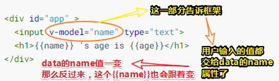
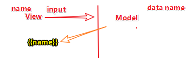

# MVVM双向绑定

## ★课程简介

双向绑定的实现

项目代码： <https://github.com/jirengu/wheel-mvvm>

## ★实现双向绑定（文章）

```html
<!DOCTYPE html>
<html>
<head>
  <meta charset="UTF-8">
  <title>MVVM 双向绑定</title>
</head>
<body>

<div id="app" >
  <input v-model="name" type="text">
  <h1>{{name}} 's age is {{age}}</h1>
</div>

<script>

function observe(data) {
  if(!data || typeof data !== 'object') return
  for(var key in data) {
    let val = data[key]
    let subject = new Subject()
    Object.defineProperty(data, key, {
      enumerable: true,
      configurable: true,
      get: function() {
        console.log(`get ${key}: ${val}`)
        if(currentObserver){
          console.log('has currentObserver')
          currentObserver.subscribeTo(subject)
        }
        return val
      },
      set: function(newVal) {
        val = newVal
        console.log('start notify...')
        subject.notify()
      }
    })
    if(typeof val === 'object'){
      observe(val)
    }
  }
}

let id = 0
let currentObserver = null

class Subject {
  constructor() {
    this.id = id++
    this.observers = []
  }
  addObserver(observer) {
    this.observers.push(observer)
  }
  removeObserver(observer) {
    var index = this.observers.indexOf(observer)
    if(index > -1){
      this.observers.splice(index, 1)
    }
  }
  notify() {
    this.observers.forEach(observer=> {
      observer.update()
    })
  }
}

class Observer{
  constructor(vm, key, cb) {
    this.subjects = {}
    this.vm = vm
    this.key = key
    this.cb = cb
    this.value = this.getValue()
  }
  update(){
    let oldVal = this.value
    let value = this.getValue()
    if(value !== oldVal) {
      this.value = value
      this.cb.bind(this.vm)(value, oldVal)
    }
  }
  subscribeTo(subject) {
    if(!this.subjects[subject.id]){
      console.log('subscribeTo.. ', subject)
       subject.addObserver(this)
       this.subjects[subject.id] = subject
    }
  }
  getValue(){
    currentObserver = this
    let value = this.vm.$data[this.key]
    currentObserver = null
    return value
  }
} 


class Compile {
  constructor(vm){
    this.vm = vm
    this.node = vm.$el
    this.compile()
  }
  compile(){
    this.traverse(this.node)
  }
  traverse(node){
    if(node.nodeType === 1){
      this.compileNode(node)   //解析节点上的v-bind 属性
      node.childNodes.forEach(childNode=>{
        this.traverse(childNode)
      })
    }else if(node.nodeType === 3){ //处理文本
      this.compileText(node)
    }
  }
  compileText(node){
    let reg = /{{(.+?)}}/g
    let match
    console.log(node)
    while(match = reg.exec(node.nodeValue)){
      let raw = match[0]
      let key = match[1].trim()
      node.nodeValue = node.nodeValue.replace(raw, this.vm.$data[key])
      new Observer(this.vm, key, function(val, oldVal){
        node.nodeValue = node.nodeValue.replace(oldVal, val)
      })
    }    
  }

  //处理指令
  compileNode(node){
    let attrs = [...node.attributes] //类数组对象转换成数组，也可用其他方法
    attrs.forEach(attr=>{
      //attr 是个对象，attr.name 是属性的名字如 v-model， attr.value 是对应的值，如 name
      if(this.isDirective(attr.name)){
        let key = attr.value       //attr.value === 'name'
        node.value = this.vm.$data[key]  
        new Observer(this.vm, key, function(newVal){
          node.value = newVal
        })
        node.oninput = (e)=>{
          this.vm.$data[key] = e.target.value  //因为是箭头函数，所以这里的 this 是 compile 对象
        }
      }
    })
  }
  //判断属性名是否是指令
  isDirective(attrName){
     return attrName === 'v-model'
  }

}


class mvvm {
  constructor(opts) {
    this.init(opts)
    observe(this.$data)
    new Compile(this)
  }
  init(opts){
    this.$el = document.querySelector(opts.el)
    this.$data = opts.data
  }

}

let vm = new mvvm({
  el: '#app',
  data: { 
    name: 'jirengu',
    age: 3
  }
})

// setInterval(function(){
//   vm.$data.age++
// }, 1000)


</script>
</body>
</html>
```

## ★实现双向绑定

单向绑定：修改数据会反应到视图上，而双向绑定则是修改视图还会反应到数据上，最典型的就是input，为什么这么说了，因为修改视图，唯有那些表单可以做到，毕竟页面那些杵着的文字是静态的！
既然如此，那么我们如何把input里边的东西展示到视图上？返回到那个data对象里边呢？

在这里边我们就增加了一个东西，叫「标记」

具体姿势是这样的：



这样一来就实现了数据的双向传递了！这一个过程可以看做是这样：



因此，我们该如何去实现这样的效果呢？

大部分代码与我们上一节课的代码一样，而不一样的是：

1. 多了一个Compile对象，毕竟我们需要处理的东西变多了，如需要处理 像`v-model="xxx"`这样的标志，所以东西一多，那就对象化吧！
2. 多了一个处理指令的 `compileNode`方法

> 注意：分析代码的时候，从mvvm这个class开始分析


## ★增加事件指令、完善代码（文章）

### ◇代码优化

```html
<!DOCTYPE html>
<html>
<head>
  <meta charset="UTF-8">
  <title>事件与代码优化</title>
</head>
<body>

<div id="app" >
  <input v-model="name" v-on:click="sayHi" type="text">
  <h1>{{name}} 's age is {{age}}</h1>
</div>

<script>

function observe(data) {
  if(!data || typeof data !== 'object') return
  for(var key in data) {
    let val = data[key]
    let subject = new Subject()
    Object.defineProperty(data, key, {
      enumerable: true,
      configurable: true,
      get: function() {
        console.log(`get ${key}: ${val}`)
        if(currentObserver){
          console.log('has currentObserver')
          currentObserver.subscribeTo(subject)
        }
        return val
      },
      set: function(newVal) {
        val = newVal
        console.log('start notify...')
        subject.notify()
      }
    })
    if(typeof val === 'object'){
      observe(val)
    }
  }
}

let id = 0
let currentObserver = null

class Subject {
  constructor() {
    this.id = id++
    this.observers = []
  }
  addObserver(observer) {
    this.observers.push(observer)
  }
  removeObserver(observer) {
    var index = this.observers.indexOf(observer)
    if(index > -1){
      this.observers.splice(index, 1)
    }
  }
  notify() {
    this.observers.forEach(observer=> {
      observer.update()
    })
  }
}

class Observer{
  constructor(vm, key, cb) {
    this.subjects = {}
    this.vm = vm
    this.key = key
    this.cb = cb
    this.value = this.getValue()
  }
  update(){
    let oldVal = this.value
    let value = this.getValue()
    if(value !== oldVal) {
      this.value = value
      this.cb.bind(this.vm)(value, oldVal)
    }
  }
  subscribeTo(subject) {
    if(!this.subjects[subject.id]){
      console.log('subscribeTo.. ', subject)
       subject.addObserver(this)
       this.subjects[subject.id] = subject
    }
  }
  getValue(){
    currentObserver = this
    let value = this.vm[this.key]   //等同于 this.vm.$data[this.key]
    currentObserver = null
    return value
  }
} 


class Compile {
  constructor(vm){
    this.vm = vm
    this.node = vm.$el
    this.compile()
  }
  compile(){
    this.traverse(this.node)
  }
  traverse(node){
    if(node.nodeType === 1){
      this.compileNode(node)   //解析节点上的v-bind 属性
      node.childNodes.forEach(childNode=>{
        this.traverse(childNode)
      })
    }else if(node.nodeType === 3){ //处理文本
      this.compileText(node)
    }
  }
  compileText(node){
    let reg = /{{(.+?)}}/g
    let match
    console.log(node)
    while(match = reg.exec(node.nodeValue)){
      let raw = match[0]
      let key = match[1].trim()
      node.nodeValue = node.nodeValue.replace(raw, this.vm[key])
      new Observer(this.vm, key, function(val, oldVal){
        node.nodeValue = node.nodeValue.replace(oldVal, val)
      })
    }    
  }

  //处理指令
  compileNode(node){
    let attrs = [...node.attributes] //类数组对象转换成数组，也可用其他方法
    attrs.forEach(attr=>{
      //attr 是个对象，attr.name 是属性的名字如 v-model， attr.value 是对应的值，如 name
      if(this.isModelDirective(attr.name)){
        this.bindModel(node, attr)
      }else if(this.isEventDirective(attr.name)){
        this.bindEventHander(node, attr)
      }
    })
  }
  bindModel(node, attr){
    let key = attr.value       //attr.value === 'name'
    node.value = this.vm[key]  
    new Observer(this.vm, key, function(newVal){
      node.value = newVal
    })
    node.oninput = (e)=>{
      this.vm[key] = e.target.value  //因为是箭头函数，所以这里的 this 是 compile 对象
    }
  }
  bindEventHander(node, attr){       //attr.name === 'v-on:click', attr.value === 'sayHi'
    let eventType = attr.name.substr(5)       // click
    let methodName = attr.value
    node.addEventListener(eventType, this.vm.$methods[methodName]) 
  }

  //判断属性名是否是指令
  isModelDirective(attrName){
     return attrName === 'v-model'
  }

  isEventDirective(attrName){
    return attrName.indexOf('v-on') === 0
  }

}


class mvvm {
  constructor(opts) {
    this.init(opts)
    observe(this.$data)
    new Compile(this)
  }
  init(opts){
    this.$el = document.querySelector(opts.el)
    this.$data = opts.data || {}
    this.$methods = opts.methods || {}

    //把$data 中的数据直接代理到当前 vm 对象
    for(let key in this.$data) {
      Object.defineProperty(this, key, {
        enumerable: true,
        configurable: true,
        get: ()=> {  //这里用了箭头函数，所有里面的 this 就指代外面的 this 也就是 vm
          return this.$data[key]
        },
        set: newVal=> {
          this.$data[key] = newVal
        }        
      })
    }

    //让 this.$methods 里面的函数中的 this，都指向当前的 this，也就是 vm
    for(let key in this.$methods) {
      this.$methods[key] = this.$methods[key].bind(this)
    }
  }

}

let vm = new mvvm({
  el: '#app',
  data: { 
    name: 'jirengu',
    age: 3
  },
  methods: {
    sayHi(){
      alert(`hi ${this.name}` )
    }
  }
})

let clock = setInterval(function(){
  vm.age++   //等同于 vm.$data.age， 见 mvvm init 方法内的数据劫持

  if(vm.age === 10) clearInterval(clock)
}, 1000)


</script>
</body>
</html>
```

## ★完善

对刚刚实现的双向绑定进行一个完善，如再增加一些方法（搞个onclick，用户一点击，就会执行xxx方法）

不管怎样，相较之前的代码，我们除了判断是否是模型指令以外，还需要判断这是否是事件指令！

毕竟对这两种指令的处理是不一样的！

还有需要注意的是： `vm.age++` 这个代码为啥可行？难道不应该是 `vm.$data.age`？

总结：

1. 了解了`Object.defineProperty()`的用法，以及关于其对数据劫持的应用
2. 了解了观察者模式
3. 了解了单向数据流和双向数据流
4. 了解了书写代码过程中的一些小技巧，如绑定this、使用class等等

## ★总结

- 讲真，我是真得没有理解观察者模式！当然，实现一个简单的MVVM框架，我大概了解了思路！核心点无非就是对 `Object.defineProperty()`以及正则的灵活使用，当然，贯通这个框架的是观察者模式，或者说是发布订阅者模式！不过就目前而言，似乎有用 es6的 `proxy`来取代这个 `Object.defineProperty()`API！

