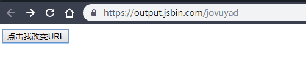

# 如何在不刷新页面的情况下改变URL？

## ★资料

➹：[如何在不刷新页面的情况下改变URL - 知乎](https://zhuanlan.zhihu.com/p/22412047)

## ★思路

有两种姿势可以做到：

1. 改`window.location.hash`
2. 用[window.history.pushState()](https://developer.mozilla.org/zh-CN/docs/Web/API/History_API)

## ★开搞

一般来说，如果你要改变页面的地址，你必须要刷新页面才行！

使用一个线上编辑器：

➹：[jsbin.com](https://jsbin.com/) 

需要注意的是，在你调试代码是否运行成功的时候，请使用`console.log()`，而不是`alert()`，因为后者在 [http://js.jirengu.com](http://js.jirengu.com/) 在这个线上编辑器里边是GG的！

### ◇对url添加一个hash

```html
<button id="x">点击我改变URL</button>
<script>
    x.onclick = function() {
        window.location.hash = 'hello'
    }
</script>
```

> 请记住，摁`Ctrl+S`保存一下代码！

效果：



可见我们点击这个按钮，就在当前页面的URL地址的末尾里边追加了 `#hello`，而且还保存了回退和前进的历史记录！当然，即便刷新了页面这个锚点还是在的哈！

不过，我们这样做到底有啥用呢？——可以做一个小应用哈！

接下来，我们添加个 `onhashchange`方法「**当 一个窗口的 hash （URL 中 # 后面的部分）改变时就会触发 `hashchange` 事件（参见 [`location.hash`](https://developer.mozilla.org/zh-CN/docs/Web/API/Window/location)）**」

```
window.onhashchange = function() {
	console.log('change')
}
```

当我点击按钮的时候，有两个地方发生了变化，一个是URL，一个是控制台里边log了一个 `‘change’`字符串出来，即执行了一个回调函数哈！


